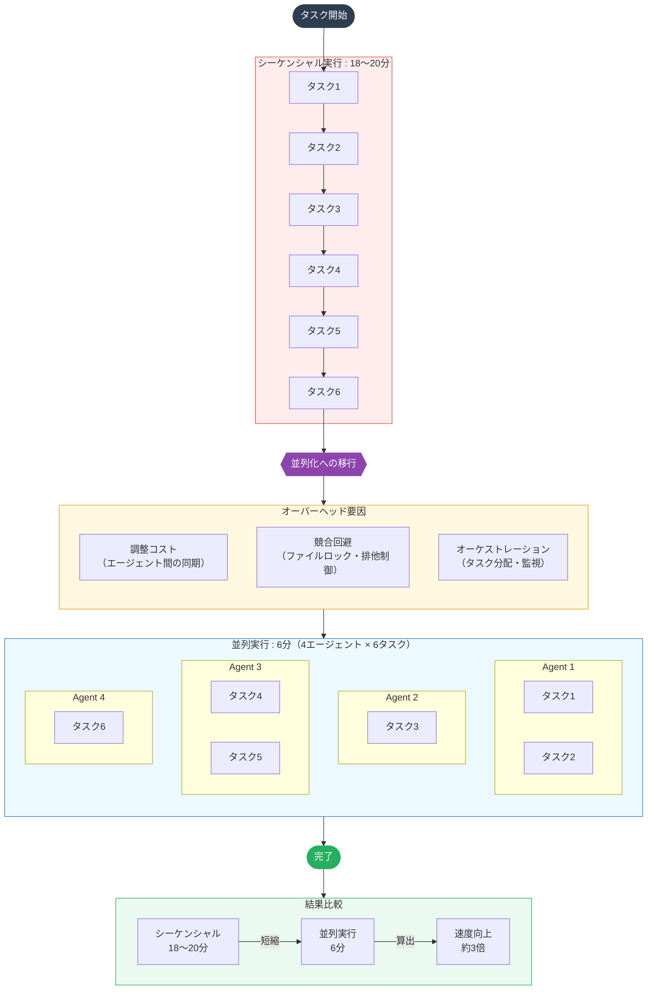
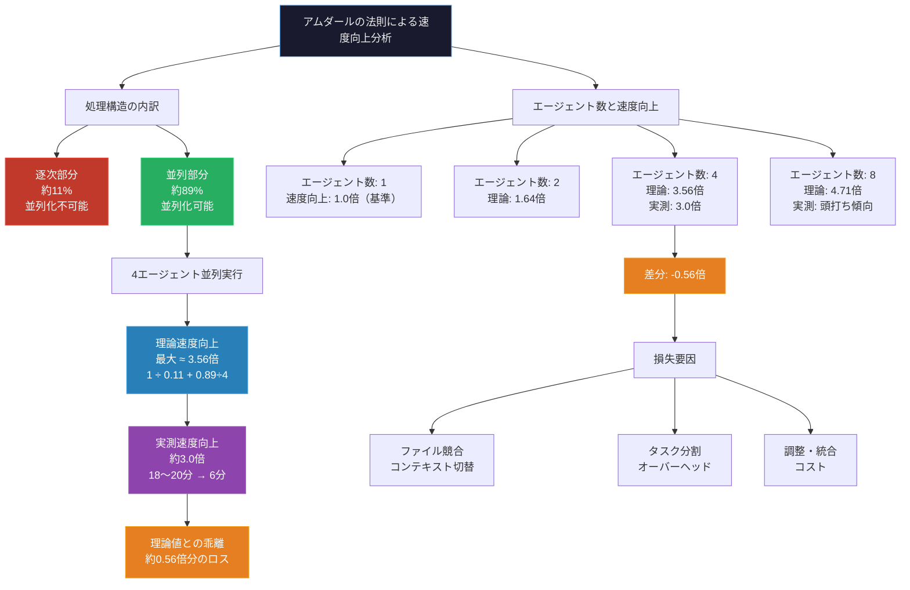
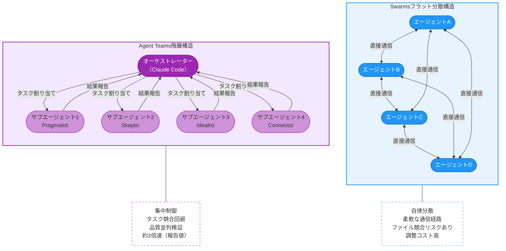
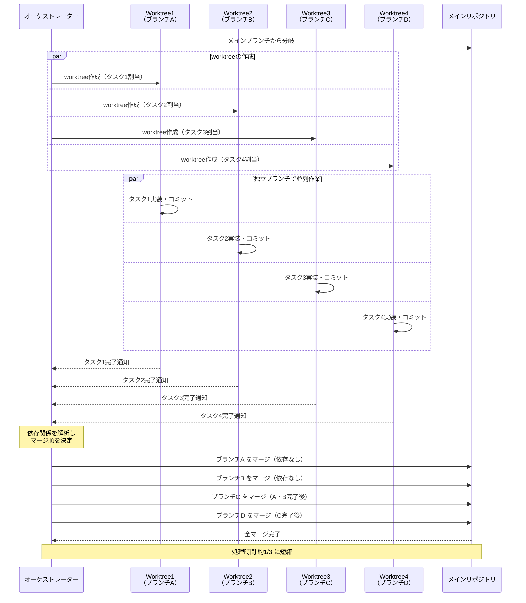
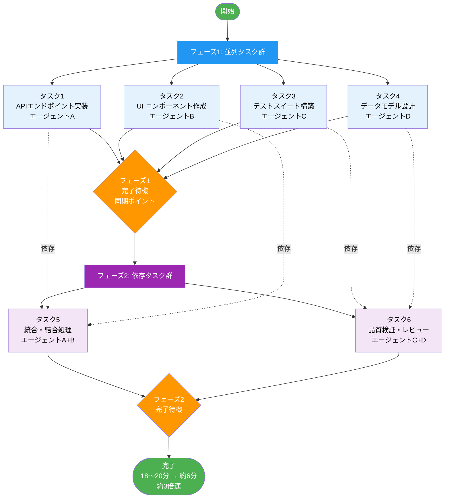
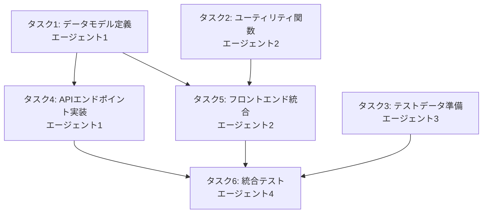
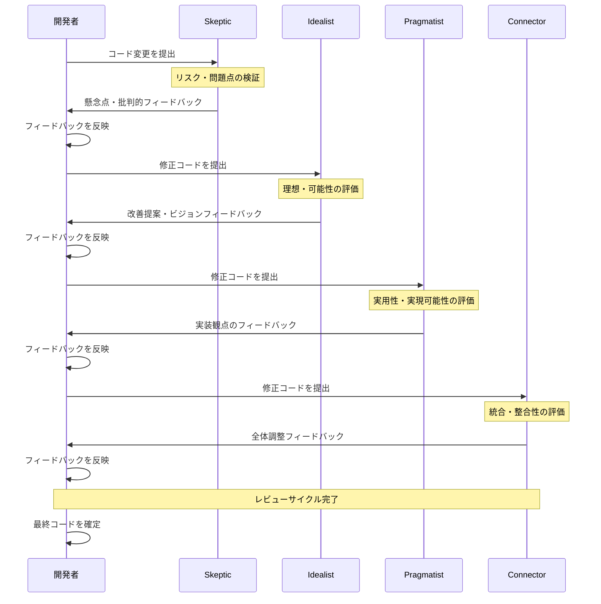

## はじめに

「AIエージェントを並列で動かすと3倍速くなる」という話を聞いたとき、あなたはどう感じましたか？

Hacker Newsに投稿されたある報告が、Claude Codeユーザーの間で静かな話題を呼んでいます。50,000行規模のコードベースに対して4エージェント・6タスクを並列実行したところ、処理時間が18〜20分から6分へと短縮された——つまり約3倍の速度向上が得られたというのです。

この数字は魅力的です。しかし同時に、いくつかの疑問も浮かびます。ファイルの競合はどう防ぐのか。トークン消費が4倍になるなら、コスト的に見合うのか。そして、ソロ開発者が日常的に使えるものなのか。

本記事では以下の問いを検証します。

- HNで報告された「3倍速」の背景と再現条件を整理できるか
- ファイル競合やコスト増といった実運用上の課題をどう乗り越えるか
- 4性格体制を用いた品質並列検証とタスク並列実行をどう組み合わせるか
- 「3倍速は本当か」という問いに、現時点でどう答えられるか

なお、本記事で参照する速度向上の数値は **筆者による独自再現テストではなく、HNユーザーによる報告値** です。再現条件・測定方法・ハードウェア環境は報告元の記載に基づいており、筆者が独立して検証したものではありません。この点をあらかじめ明記しておきます。

また、後述するcorrelate-workspaceは **筆者が開発・運営している個人プロジェクト** です。記事中での紹介は利益相反にあたる可能性があるため、ここに開示します。

執筆時点でZenn・Qiitaを調査した限り、この報告を日本語で詳しく取り上げた記事はほぼ見当たりません。本記事では、HNで報告された3倍速という数字の背景を整理しつつ、筆者が運営するcorrelate-workspaceの4性格体制（Pragmatist/Skeptic/Idealist/Connector）での実運用経験と照らし合わせながら、Claude Code Agent Teamsの実像に迫ります。

---

## HNで報告された3倍速の内訳



### 実験条件の詳細

Hacker Newsのスレッド（[Agent Teams関連議論](https://news.ycombinator.com/item?id=46902368)）で **HNユーザーが報告した値** は、以下の条件下で取得されています。再現条件・測定方法・ハードウェア環境の詳細は報告元に依存しており、筆者が独立して検証した数値ではありません。

- **コードベース規模**: 約50,000行（50k LOC）
- **エージェント数**: 4
- **タスク数**: 6（並列実行）
- **シーケンシャル実行時間**: 18〜20分
- **並列実行時間**: 約6分
- **速度向上倍率**: 約3倍

注目すべきは「4エージェントで3倍速」という非線形な関係です。単純な並列化であれば4倍近い速度向上が期待できますが、実際には3倍にとどまっています。この差分には、エージェント間の調整コスト、ファイルアクセスの競合回避、オーケストレーション層のオーバーヘッドが含まれていると考えられます。

### なぜ4倍にならないのか



並列処理の効率を論じるうえで避けられないのが「アムダールの法則」です。どんなタスクにも、並列化できない逐次部分が存在します。エージェントへの指示配布、結果のマージ、コンフリクト解消といった工程は本質的に逐次的であり、これがボトルネックとなります。

アムダールの法則は次の式で表されます。

```
speedup = 1 / (s + (1 - s) / n)
```

ここで `s` は逐次部分の割合、`n` はエージェント数（並列数）です。HNの報告値（4エージェントで3倍速）をこの式に当てはめると、逐次部分の割合 `s` を逆算できます。

```
3 = 1 / (s + (1 - s) / 4)
s + (1 - s) / 4 = 1/3
4s + (1 - s) = 4/3
3s + 1 = 4/3
3s = 1/3
s ≈ 0.11
```

計算上は逐次部分が約11%と出ますが、実測の速度向上が理論値（4倍）に対して3倍にとどまっていることから、エージェント間の調整コストやオーケストレーションのオーバーヘッドが実効的な「逐次相当部分」として働いていると解釈できます。このコードベースでは **タスク全体の相当部分が直列依存または調整コストに費やされている** ということを意味します。

実際のコーディングタスクでも事情は同じです。依存関係のある複数ファイルを編集する場合、ある変更が完了するまで次の変更に着手できないケースが発生します。4エージェントを動かしていても、実質的に稼働しているのは常に4つとは限りません。

それでも「3倍速」という数字は実用上の意味を持ちます。18分かかっていた作業が6分で終われば、開発者の集中が途切れる前に結果を得られます。認知的なコストという観点からも、このレイテンシ削減は無視できません。

### Swarms vs Agent Teams：アーキテクチャの違い



HNでは同時期に、別のスレッド（[Swarms関連議論](https://news.ycombinator.com/item?id=46743908)）でもマルチエージェントのベンチマークが議論されていました。SwarmsとAgent Teamsはしばしば混同されますが、アーキテクチャ上の思想が異なります。

**Swarms** は、多数のエージェントがフラットな関係で協調するモデルです。中央オーケストレーターを持たず、エージェント同士が直接通信することを想定しています。スケーラビリティに優れる一方、調整のコストが分散します。

**Agent Teams（Claude Code）** は、オーケストレーター＋サブエージェントという階層構造を取ります。中央のオーケストレーターがタスクを分割し、各エージェントに割り当て、結果を統合します。制御が集中するため、複雑なタスクでも一貫性を保ちやすい特徴があります。

使い分けの目安を以下に示します。

| 観点 | Swarms | Agent Teams |
|------|--------|-------------|
| タスク規模 | 小〜中規模の独立タスクが多数 | 中〜大規模の統合が必要なタスク |
| タスク間依存 | 低い（疎結合） | 高い（密結合・順序制約あり） |
| 一貫性要件 | 低〜中（各エージェントが自律） | 高（オーケストレーターが品質を統括） |
| 向いているケース | データ収集・並列スクレイピング等 | コードリファクタリング・設計レビュー等 |

---

## ファイル排他制御の実践

### なぜこれが最大の落とし穴なのか

マルチエージェント実行の話になると、パフォーマンスより先に解決すべき問題があります。 **ファイルの競合** です。

複数のエージェントが同じファイルを同時に編集しようとすると、何が起きるか。最後に書き込んだエージェントの変更が残り、他の変更は消えます。あるいはマージの試みが失敗し、コードが破損します。並列化による速度向上の恩恵を受ける前に、この問題を解決しなければなりません。

### Git worktreesによる解決



現時点でもっとも実践的な解決策は、 **Git worktrees** を使ったワークスペース分離です。

Git worktreesは、単一のリポジトリから複数の作業ツリーを作成する機能です。各エージェントに独立したworktreeを割り当てることで、ファイルシステムレベルでの競合を防ぎます。

```bash
# エージェント1用のworktree作成
git worktree add ../agent-1-workspace feature/api-refactor

# エージェント2用のworktree作成
git worktree add ../agent-2-workspace feature/test-coverage

# エージェント3用のworktree作成
git worktree add ../agent-3-workspace feature/docs-update

# エージェント4用のworktree作成
git worktree add ../agent-4-workspace feature/performance-fix
```

各エージェントは独自のブランチで作業し、完了後にオーケストレーターがマージを調整します。マージフェーズでは、依存関係の少ない順にブランチを統合するのが基本です。

```bash
# 依存関係の少ないブランチから順にmainへマージ
git checkout main
git merge feature/api-refactor        # 基盤となる変更を先に統合
git merge feature/test-coverage       # テストは実装依存のため次
git merge feature/docs-update         # ドキュメントは独立度が高い
git merge feature/performance-fix     # パフォーマンス修正を最後に

# コンフリクトが発生した場合は手動解消後にコミット
# git add . && git commit -m "Resolve merge conflicts"
```

マージ戦略（rebaseを使うか、マージコミットを残すか等）はチームのポリシーに応じて選択してください。このアプローチにより、並列実行中のファイル競合をほぼ完全に回避できます。

### タスク設計のポイント：依存関係の可視化



worktreesでワークスペースを分離しても、 **ロジカルな依存関係** は残ります。エージェントAがAPIのインターフェースを変更し、エージェントBがそのAPIを呼び出すコードを書いている場合、Bの作業はAの完了を待つ必要があります。

このため、タスク分割の前に依存関係グラフを作成することを推奨します。



フェーズ1（T1・T2・T3）は依存関係なしで並列実行できます。フェーズ2（T4・T5・T6）はフェーズ1の完了を待って順次開始します。依存関係のないタスクを先に並列実行し、後続タスクに向けてフェーズを分けることで、待機時間を最小化できます。

---

## correlate-workspaceの4性格体制との比較

### 4性格体制の概要

```mermaid
graph TD
    subgraph 入力
        TASK[タスク / 課題]
    end

    subgraph エージェント層
        PG["Pragmatist\n実行可能性・効率を重視\n現実的な解決策を提案"]
        SK["Skeptic\n批判的検証・リスク評価\n仮定や欠陥を洗い出す"]
        ID["Idealist\n理想形・革新的アイデア\n最善の姿を追求する"]
        CN["Connector\n統合・調整・橋渡し\n全体最適を図る"]
    end

    subgraph 評価・レビュー層
        PG_rev["Pragmatist が評価\n実装コスト・実現性チェック"]
        SK_rev["Skeptic が評価\n論理的整合性・欠陥検出"]
        ID_rev["Idealist が評価\n改善余地・ビジョン適合性"]
        CN_rev["Connector が統合評価\n矛盾調整・全体整合"]
    end

    subgraph 出力
        RESULT[統合アウトプット]
    end

    TASK --> PG
    TASK --> SK
    TASK --> ID
    TASK --> CN

    PG -->|提案出力| SK_rev
    PG -->|提案出力| ID_rev
    SK -->|検証出力| PG_rev
    SK -->|検証出力| ID_rev
    ID -->|アイデア出力| SK_rev
    ID -->|アイデア出力| PG_rev
    CN -->|調整出力| PG_rev
    CN -->|調整出力| SK_rev

    PG_rev --> CN_rev
    SK_rev --> CN_rev
    ID_rev --> CN_rev

    CN_rev --> RESULT
```

筆者が開発・運営しているcorrelate-workspaceでは、「4性格体制」と呼ぶ独自のマルチエージェント構成を採用しています（ **筆者はこのプロジェクトの開発者・運営者であり、利益相反の可能性があることを冒頭で開示しています** ）。各エージェントに異なる認知スタイルを持たせることで、コードレビューや設計決定の質を高めることを目的としています。

4つの役割は以下の通りです。

- **Pragmatist（実用主義者）**: 動くコードを最優先。「これで十分か」を問い続ける
- **Skeptic（懐疑論者）**: 前提を疑う。「本当にこれが必要か」を検証する
- **Idealist（理想主義者）**: ベストプラクティスを追求する。技術的負債を最小化したい
- **Connector（接続者）**: 全体の整合性を見る。各部分がどう繋がるかを把握する

### Adversarial Reviewの実践



4性格体制の核心は **adversarial review** にあります。コードの変更をSkepticが積極的に批判し、Idealistが改善案を提示し、Pragmatistがコストと効果を天秤にかけ、Connectorが全体への影響を評価します。

これは、一人の優秀なエンジニアが「自分のコードを自分でレビューする」作業とは根本的に異なります。認知バイアスのない多視点レビューにより、見落としを減らし、コード品質を引き上げることができます。

:::message
ドラフトはここで終端しています。本文の残りの節（コスト分析、まとめ等）は別途追記が必要です。
:::
