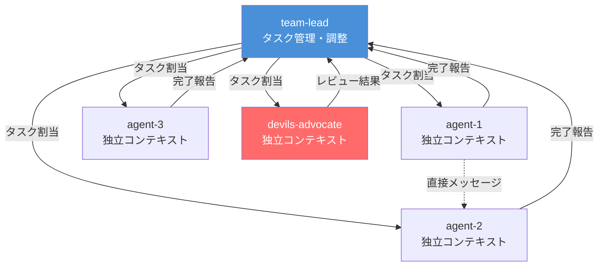
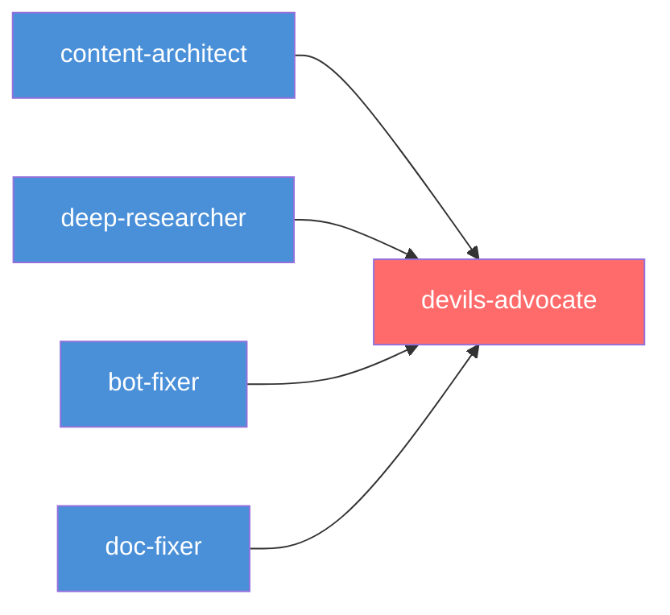
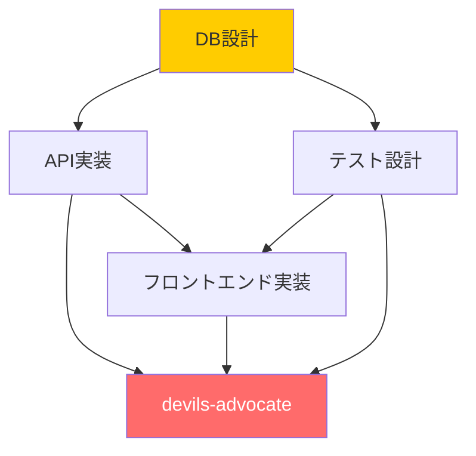

## はじめに

Claude Codeは強力なツールです。しかし、1つのセッションで複雑なタスクを処理していると、ある壁に直面します。コンテキストウィンドウの圧迫、直列処理による待ち時間、そして1つのAIが全てを把握しようとすることで生じる品質低下。

この問題を解決するのがAgent Teams。複数のClaude Codeセッションが1つのチームとして連携し、タスクを並列に処理する仕組みです。

:::message
Agent Teamsは2026年2月5日、Claude Opus 4.6と同時にリリースされたResearch Preview機能。実際に使ってみると生産性の向上は劇的でした。私のケースでは、5エージェントチームで設計書修正・ドキュメント更新・リサーチ・記事執筆・品質レビューを同時並行で完了させています。
:::

本記事では、3つのチームで計13エージェントを運用した実体験から、Agent Teamsの構築方法と実践的なノウハウを共有します。「使ってみた」で終わらず、どうタスクを分割し、どう依存関係を設計すれば並列化の恩恵を最大化できるかに踏み込んだ内容。

:::message alert
前回の記事「[デビルズアドボケイトをAI開発チームに入れたら品質が劇的に改善した話](https://zenn.dev/correlate000/articles/devils-advocate-ai-team)」の続編です。DAをAgent Teamsにどう組み込むかも扱うので、未読の方はそちらも併せてどうぞ。
:::

## Agent Teamsとは

### 有効化はワンステップ

`settings.json`（`~/.claude/settings.json` またはプロジェクト `.claude/settings.json`）に以下を追加するだけ。

```json
{
  "env": {
    "CLAUDE_CODE_EXPERIMENTAL_AGENT_TEAMS": "1"
  }
}
```

あとはClaude Codeに「4人チームでこのタスクを並列に処理して」と指示すれば、チームが自動的に構成されます。

### Subagentsとの違い

Claude Codeには以前からSubagents（Task tool）という仕組みがありました。一見似ていますが、Agent Teamsとは根本的に異なります。

| 項目 | Subagents | Agent Teams |
|------|-----------|-------------|
| コンテキスト | 独自ウィンドウ、結果は呼び出し元に返る | 独自ウィンドウ、完全に独立して動作 |
| 通信 | メインへの報告のみ | チームメイト同士で直接メッセージ可能 |
| ライフサイクル | タスク完了で結果を返して終了 | 明示的なシャットダウンまで持続 |
| タスク管理 | なし | 共有タスクリスト |
| 調整方法 | メインエージェントが全管理 | 自己調整（タスクの自動取得） |
| 最適用途 | 結果だけが必要な単発タスク | 議論・協調が必要な複雑作業 |

最大の違いは独立したコンテキストウィンドウ。各エージェントが自分専用のコンテキストを持つため、一方のエージェントが大量のコードを読んでも、他のエージェントのコンテキストは消費されない。GoogleのChrome開発チームの Addy Osmani 氏も指摘する通り、「LLMはコンテキストが広がると性能が落ちる」[^1]。Agent Teamsはこの問題を構造的に解決しています。

[^1]: Addy Osmani「[Claude Code Swarms](https://addyosmani.com/blog/claude-code-agent-teams/)」より。コンテキストウィンドウの分離がAgent Teamsの設計上の核心的な利点であるとの分析。

### 基本アーキテクチャ



team-leadが全体を統括し、`TaskCreate` / `TaskUpdate` でタスクを割り当て・管理し、`SendMessage` で指示や背景情報を伝える構造。SubagentsにはないエージェントA↔B間の直接通信ができるのもポイント。

内部的には以下のデータ構造で管理されています。

| コンポーネント | 保存先 | 役割 |
|---|---|---|
| チーム設定 | `~/.claude/teams/{team-name}/config.json` | メンバー一覧・設定 |
| タスクリスト | `~/.claude/tasks/{team-name}/` | 共有タスク管理 |
| メールボックス | 内部管理 | エージェント間メッセージング |

## なぜ「並列化」が効くのか

### 直列処理の3つの問題

1つのClaude Codeセッションで全タスクを処理すると、以下の問題が発生します。

- コンテキスト汚染: 設計書修正のためにコードを読むと、その内容がリサーチ作業のコンテキストを圧迫
- 待ち時間: タスクAが終わるまでタスクBに着手できない
- 集中力の分散: 「設計も実装もドキュメントもレビューも」を1つのセッションに任せると、どれも中途半端になりがち


*並列化により、独立タスクの同時実行で全体の所要時間を大幅に短縮*

### 並列化のメリット

Agent Teamsでは各エージェントが専門性を持ちます。

- 設計書修正の専門エージェントは設計書だけに集中
- リサーチ担当は `WebSearch` を駆使して情報を収集
- DAは全員の成果物が揃ってから批判的レビューに専念

> 1つのセッションに「何でもやって」と頼むより、「あなたはこれだけやって」と限定する方が品質は上がる。人間のチームでも同じこと。

-----

## 実践: 3つのチーム運用事例

ここからは実際に運用した3チームの構成と結果を紹介します。

### チーム1: parallel-tasks（4エージェント）

初めてAgent Teamsを本格運用したチーム。朝会ボット設計書のDA指摘対応を中心に構成しました。

```
team-lead（自分）
├── bot-updater      ← 設計書のDA指摘9項目を修正
├── structure-updater ← claude.mdのフォルダ構成を実態に合わせて更新
├── cleanup-analyst  ← Downloadsの重複削除 + BigQueryテーブル整合チェック
└── devils-advocate  ← 全成果物の批判的レビュー（R2）
```

結果:
- 4タスクが並列で完了（DA以外は依存関係なし）
- DA R2レビューで高重要度9件/中10件/低4件を検出
- 直列なら数時間かかるところが大幅に短縮

:::message alert
ここで得た教訓が一つ。DAエージェントに `addBlockedBy` で依存関係を設定しておかないと、未完成の成果物をレビューしてしまう。DAは「全員の完了を待ってから動く」設計が必須。
:::

-----

### チーム2: session-02-08（5エージェント）

最も大規模なチーム。コンテンツパイプライン構築からDA R3レビューまでを一気に処理した構成。

```
team-lead（自分）
├── content-architect  ← コンテンツパイプライン設計
│                       （ディレクトリ構築、テンプレート、ワークフロー設計書）
├── deep-researcher    ← 上位3候補のDeep Research
│                       （Agent Teams/DA/Google Drive同期）
├── bot-fixer          ← 朝会ボット設計書のDA R2全16項目修正
├── doc-fixer          ← claude.mdのDA R2全6項目修正
└── devils-advocate    ← 最終レビュー（R3）
```

タスク依存関係の設計:



4つの独立タスクが並列で走り、全て完了した時点でDAが起動するDAG構造。

結果:

| エージェント | 成果 |
|---|---|
| content-architect | ディレクトリ構成・テンプレート2件・ワークフロー設計書を作成 |
| deep-researcher | 3記事分のリサーチノートを並行作成 |
| bot-fixer | 16項目の修正を完了（工数見積もり16h→35-45h、テスト戦略追加等） |
| doc-fixer | claude.mdの6項目修正（ナレッジ管理使い分け表追加等） |
| devils-advocate | R3レビュー: 全成果物が実行可能レベルに到達（高1件/中11件/低8件） |

:::message
5エージェントが同時に動くのは壮観。それぞれが自分のコンテキストで集中して作業し、DAだけが全員の完了を待ってから動き始める。直列なら半日以上かかる作業量でした。
:::

-----

### チーム3: session-02-08-b（4エージェント）

記事執筆とシステム設計を並行で進めたチーム。

```
team-lead（自分）
├── system-designer   ← Obsidian記録構造の強化（テンプレート改善、Handoff方式）
├── info-collector    ← 情報収集システム設計 + Threads/X APIリサーチ
├── article-writer    ← デビルズアドボケイト記事のドラフト執筆
└── devils-advocate   ← 全成果物のレビュー
```

結果:
- system-designer: セッション/エラー/PJの3テンプレートを改善、Context/Handoff方式を導入
- info-collector: 6ソースの情報収集システム設計、Threads/X APIリサーチ完了
- article-writer: 約4,500字のZenn記事ドラフトを作成
- DA: 高5件/中14件/低10件を検出。特に記事の出典不備・数値不一致を発見し、即時修正（DORA偽引用の防止に成功）

> DAが防いだ「DORA偽引用」とは、DAレビューなしなら公開されていたかもしれない、存在しない統計データの引用。これだけでもDAを入れる価値があるというもの。

### 3チームの総括


*3チームの実績を比較。R2→R3でDA高重要度が9件→1件に激減*

| チーム | エージェント数 | タスク数 | DA検出 | 成果 |
|--------|--------------|---------|--------|------|
| parallel-tasks | 4 | 4 | 高9/中10/低4 | 設計書修正+環境整備 |
| session-02-08 | 5 | 5 | 高1/中11/低8 | パイプライン構築+DA R3到達 |
| session-02-08-b | 4 | 4 | 高5/中14/低10 | 記事執筆+システム設計 |
| 合計 | 13 | 13 | - | 3チーム合計13タスクを1日で並列完了 |

-----

## チーム設計の実践ノウハウ

### 1. タスク依存関係のDAG設計

Agent Teamsの肝は `addBlockedBy` による依存関係の制御。タスクを有向非巡回グラフ（DAG）として設計することで、並列化の恩恵を最大化できます。

基本パターン:

```
# 独立タスクは並列実行
TaskCreate: "設計書修正"      → agent-1に割当
TaskCreate: "ドキュメント更新"  → agent-2に割当
TaskCreate: "リサーチ実施"     → agent-3に割当

# DAは全員の完了を待つ
TaskCreate: "批判的レビュー"
TaskUpdate: addBlockedBy: [task-1, task-2, task-3]
→ devils-advocateに割当
```

より複雑な依存関係の例:



DB設計が先行し、API実装とテスト設計が並列で走り、フロントエンドは両方の完了を待つ。DAは全工程の後。こういった多段の依存関係もAgent Teamsなら自然に表現できます。

:::message
依存関係のないタスクは必ず並列に。DAのように「全成果物が揃ってからでないと意味がない」タスクだけに `addBlockedBy` を設定するのがポイント。
:::

### 2. エージェントの専門性設計

各エージェントには1つの明確な役割だけを与えるのが鉄則。

| パターン | 役割分担 | 向いているタスク |
|----------|---------|----------------|
| 最小構成（3体） | 実装 + レビュー + DA | 単一機能の開発 |
| 標準構成（4-5体） | 設計 + 実装 + ドキュメント + テスト + DA | 機能開発プロジェクト |
| リサーチ構成（4体） | リサーチ×2-3 + DA | 技術調査・記事執筆 |

ファイル競合を避けるため、タスク設計の段階で各エージェントの担当ファイルを明確に分けることも重要。複数エージェントが同じファイルを同時編集するとコンフリクトが発生する可能性があります。これはAgent Teamsの既知の制約です。

### 3. コスト最適化: モデル混在戦略

Agent Teamsの最大のトレードオフはトークンコスト。全エージェントをOpusで動かすと、5エージェントで5-7倍のトークンを消費します。

そこでモデル混在戦略が有効。

| 役割 | 推奨モデル | 理由 |
|------|-----------|------|
| team-lead | Opus | 全体統括に高い判断力が必要 |
| 設計・実装 | Sonnet | 実装品質を維持しつつコスト削減 |
| リサーチ・探索 | Haiku | 情報収集は高速・低コストで十分 |
| DA | Opus or Sonnet | 批判的レビューには高い推論力が望ましい |

チームメイトのモデルは自然言語で指定できます。

```
4人チームを作成してください。
実装担当2名はSonnetで、DAはOpusで動かしてください。
```

:::message alert
Claude Max（$200/月）のような定額プランなら気にならないものの、従量課金の場合はチーム規模に注意。Sonnet活用でOpus比コスト約1/5という実測データもあります[^2]。
:::

[^2]: 筆者の運用実測およびコミュニティレポートに基づく概算。3人チームのコードレビューで合計約50-70K input / 15-20K output トークン、実時間約80秒。環境やタスクにより変動する。


*全Opusから混在戦略に切り替えることでトークンコストを大幅に削減できる*

### 4. CLAUDE.mdでのルール定着

チーム編成のルールは `CLAUDE.md` に記載して自動化するのがおすすめ。

:::details CLAUDE.mdに追記するチーム編成ルール（クリックで展開）
```markdown
## チーム編成ルール

- Agent Teamsでチームを編成する場合、必ず
  **デビルズアドボケイト（批判的レビュアー）**を1名含めること
- デビルズアドボケイトの役割: 全成果物を批判的視点でレビューし、
  見落としているリスク・前提条件の誤り・実行可能性の問題・
  コスト試算の甘さを指摘する
- 他のエージェントのタスク完了後にレビューを開始する
- レビュー結果は記録・保存する
```
:::

どのプロジェクトでClaude Codeを起動しても、チーム編成時にDAが自動的に考慮される仕組みです。一度効果を実感したら、仕組み化するのが吉。

### 5. 表示モードの選択

Agent Teamsの動作を視覚的に確認する方法は2つ。

| モード | 必要環境 | 特徴 |
|--------|---------|------|
| auto（デフォルト） | どの端末でもOK | tmuxセッション内ならSplit panes、それ以外はIn-process |
| In-process | どの端末でもOK | メインターミナル内で実行。`Shift+Up/Down`で切替 |
| Split panes | tmux or iTerm2 | 各エージェントが独自ペインで動作 |

`settings.json` で指定:

```json
{
  "teammateMode": "tmux"
}
```

`teammateMode: "tmux"` を設定すれば、Agent Teamsが自動的にペインを分割してくれます。以下は参考として、手動で4つの独立セッションを起動するスクリプト（Agent Teamsのチーム機能とは別の手動並列アプローチ）。

:::details tmux 手動4分割スクリプト（クリックで展開）
```bash
#!/bin/bash
# claude-team.sh - 4分割でClaude Codeを起動
SESSION="claude-team"
tmux kill-session -t $SESSION 2>/dev/null
tmux new-session -d -s $SESSION -n main
tmux split-window -h -t $SESSION
tmux split-window -v -t $SESSION:0.0
tmux split-window -v -t $SESSION:0.2
tmux send-keys -t $SESSION:0.0 'claude' C-m
tmux send-keys -t $SESSION:0.1 'claude' C-m
tmux send-keys -t $SESSION:0.2 'claude' C-m
tmux send-keys -t $SESSION:0.3 'claude' C-m
tmux attach-session -t $SESSION
```
:::

Split panesモードなら、各エージェントが同時に動く様子をリアルタイムで確認できます。デバッグやチーム動作の理解に役立ちます。

-----

## 注意すべきポイント

### 制限事項

Agent Teamsはまだ Research Preview。以下の制約を理解しておく必要があります。

| 制約 | 詳細 |
|------|------|
| セッション復元 | `/resume` でin-processチームメイトは復元されない |
| ネスト不可 | チームメイトは自分のチームを作れない |
| 1セッション1チーム | 同時に複数チームは不可 |
| リード固定 | team-leadの移譲・昇格はできない |
| タスクステータス遅延 | チームメイトがタスクを完了としてマークできず、依存タスクがブロックされることがある |
| Split panes制限 | VS Code統合ターミナル、Windows Terminal、Ghosttyでは非対応 |

### ファイル競合の回避

最も実践的に重要なのがファイル競合の問題。複数エージェントが同じファイルを同時編集するとコンフリクトが起きうるので、タスク設計の段階でファイルの担当を明確に分けておくこと。

```
# 良い例: ファイルの担当が明確に分かれている
agent-1: src/auth/ 配下の修正
agent-2: src/api/ 配下の修正
agent-3: docs/ 配下の更新

# 悪い例: 同じファイルを複数エージェントが触る
agent-1: package.json のdependencies更新
agent-2: package.json のscripts更新
```

### コンテキスト管理

各エージェントは独立したコンテキストを持つため、共有すべき情報は `SendMessage` で明示的に伝える必要がある。「当然知っているだろう」という前提は通用しません。team-leadからの指示に、必要な背景情報を含めることが大切。

-----

## まとめ

- Agent Teamsは「AIチーム開発」を実現する仕組み。1つのセッションに何でもやらせるのではなく、専門性を持ったエージェントがチームで動く
- タスクをDAGとして設計し、依存関係のないものは並列実行。DAのような「全成果物が必要な」タスクだけに `addBlockedBy` を設定
- DAは必ず入れる。全員が協調的なチームには批判的な視点がない。これはAgent Teamsでも変わらない原則
- モデル混在戦略でコスト最適化。リードはOpus、実装はSonnet、探索はHaiku
- 実績として、3チーム13タスクを1日で並列完了。直列処理なら半日以上かかる作業量を並列で処理できた

> 1つのAIセッションに全部任せる時代は終わりつつある。次のステージは「AIチームをどう編成するか」。その答えの一つがAgent Teams。

## 参考資料

https://code.claude.com/docs/en/agent-teams

https://www.anthropic.com/news/claude-opus-4-6

https://addyosmani.com/blog/claude-code-agent-teams/

https://qiita.com/nero-15/items/c12a9403a7d7673ae432

https://izanami.dev/post/8628a13f-8cff-47d0-a4fa-be8f2a4551c3

https://zenn.dev/correlate000/articles/devils-advocate-ai-team
