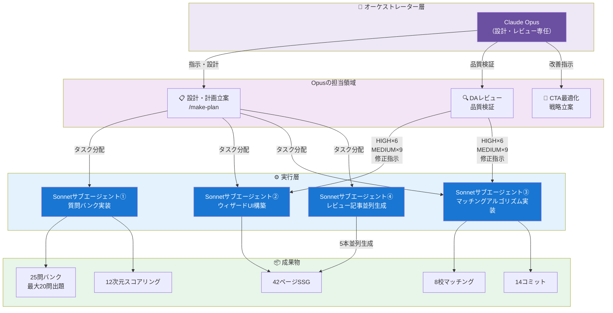
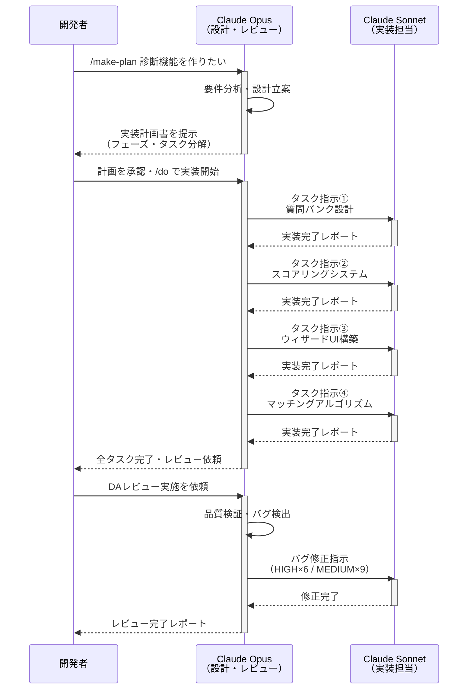

## はじめに：4時間で何が起きたのか

Claude Codeを使ったAIエージェント開発セッションで、スクール適性診断機能を1セッション・約4時間で完全構築しました。

最終的な成果物は以下のとおりです。

- **14コミット** による段階的な実装
- **42ページのSSG** （静的サイト生成）
- **25問バンクから最適最大20問を出題する条件分岐付き質問システム**
- **12次元スコアリングシステム**
- **8校とのマッチングアルゴリズム**
- DAレビューで発見・修正されたHIGH件数6件、MEDIUM件数9件
- レビュー記事5本の並列生成

「AIで○○を作った」系の記事はWeb上に数多くありますが、計画→実装→レビュー→UX改善という **全プロセスを一気通貫で見せる記事** は多くありません。この記事では、再現可能なプロセスと具体的なコード判断の両方をお伝えします。

---

## セッション全体の構成：6フェーズで何を作ったか



今回のセッションは、以下の6フェーズで構成されました。

| フェーズ | 内容 | 所要時間 |
|---------|------|---------|
| Phase 1 | `/make-plan` による設計・計画立案 | 約30分 |
| Phase 2 | 質問バンクとスコアリングシステムの実装 | 約45分 |
| Phase 3 | マルチステップウィザードUIの構築 | 約50分 |
| Phase 4 | マッチングアルゴリズムと結果ページの実装 | 約55分 |
| Phase 5 | DAレビューによる品質検証・バグ修正 | 約40分 |
| Phase 6 | レビュー記事並列生成とCTA最適化 | 約20分 |

全フェーズを通じて、 **Opusが設計・レビューに専念し、Sonnetサブエージェントが実装を担当する分業体制** が機能しました。この役割分担が、4時間という短時間での完成を可能にした最大の要因です。

---

## Phase 1：`/make-plan` → `/do` パターンで設計から入る



### なぜ計画駆動開発なのか

Claude Codeでの開発において、いきなりコードを書き始めると、後半になって設計の齟齬が発覚し、大幅なリファクタリングが必要になるケースがあります。今回は `/make-plan` コマンドで先に設計を固め、その計画に沿って `/do` で実装を進める **計画駆動開発パターン** を採用しました。

`/make-plan` の段階で定義した主な設計項目は以下のとおりです。

- 診断の目的と対象ユーザーの設定
- 12次元スコアリングの軸と重み付けの定義
- 25問の質問設計と条件分岐ロジックの仕様
- 8校のデータ構造とマッチングアルゴリズムの方針
- Next.jsにおける状態管理の設計（`useReducer` + `sessionStorage`）
- SSG戦略と結果ページのURL設計

### 計画フェーズで固めた設計の肝

特に重要だったのが、 **状態管理の設計を計画段階で決定したこと** です。マルチステップウィザードでは、ユーザーが途中でブラウザバックしたり、ページをリロードしたりするケースを想定する必要があります。`useReducer` でアクションを明示的に定義し、`sessionStorage` に状態をシリアライズする設計を計画段階で固めたことで、実装フェーズでの手戻りを防ぐことができました。

---

## Phase 2：12次元スコアリングと25問の質問バンク設計

### 12次元スコアリングとは何か

スクール適性診断において、単純な「向いている／向いていない」の二択ではなく、複数の軸でユーザーの特性を測定することが、精度の高いマッチングに不可欠です。スクール選択に影響する変数を網羅的に洗い出し、相互の相関が低い軸を優先して選定することで、以下の12次元に絞り込みました。

1. 学習スタイル（独学 ↔ 授業型）
2. 目的明確度（趣味 ↔ 転職）
3. 時間的制約（短期集中 ↔ 長期継続）
4. 予算感度
5. メンタリング需要
6. コミュニティ重視度
7. 実践重視度（理論 ↔ 実務）
8. 技術領域の志向（フロント ↔ バック ↔ インフラ）
9. 年齢・キャリアフェーズ適合度
10. 地理的制約（オンライン ↔ 通学）
11. 就職支援ニーズ
12. 学習継続意欲

各次元は1〜5のスコアでスケーリングされ、後述のマッチングアルゴリズムで各スクールのプロファイルとの距離計算に使用されます。

### 条件分岐付き質問バンクの設計

25問の質問バンクには、ユーザーの回答によって次の質問が変わる **条件分岐ロジック** が実装されています。たとえば、Q3で「転職目的」と回答したユーザーには就職支援ニーズに関する質問が追加で表示され、「趣味・スキルアップ目的」のユーザーにはスキップされる設計です。この条件分岐の結果として、1ユーザーが実際に回答する問数は **最少15問〜最大20問** となります。

TypeScriptの型定義でこの分岐を表現することで、型安全を保ちながら複雑な条件分岐を管理しました。

```typescript
type Question = {
  id: string;
  text: string;
  dimension: Dimension;
  options: Option[];
  nextQuestion?: (answer: AnswerValue) => string | null;
};
```

`nextQuestion` 関数が `null` を返す場合は終了、文字列を返す場合は次の質問IDとして機能する設計です。この型定義により、条件分岐の漏れをコンパイル時に検出できます。

---

## Phase 3：Next.js マルチステップウィザードの実装

### `useReducer` + `sessionStorage` による状態管理

マルチステップウィザードの状態管理には `useReducer` を採用しました。`useState` を複数使う設計と比較した場合、アクションが明示的に定義されるため、デバッグ時の状態追跡が容易になります。

```typescript
type DiagnosisState = {
  currentQuestionId: string;
  answers: Record<string, AnswerValue>;
  completedDimensions: Dimension[];
  sessionId: string;
};

type DiagnosisAction =
  | { type: 'ANSWER'; questionId: string; value: AnswerValue }
  | { type: 'BACK' }
  | { type: 'RESTORE'; state: DiagnosisState };
```

`sessionStorage` への書き込みは、`useReducer` のディスパッチをラップしたカスタムフックで行います。これにより、コンポーネント側は通常の `dispatch` を呼ぶだけで、永続化が自動的に行われます。

### プログレスバーとUX設計

25問全問を一律に表示するのではなく、条件分岐の結果として表示される質問数は **最少15問〜最大20問** に収まる設計にしました。プログレスバーには「残り何問」ではなく「完了した次元数 / 12次元」を表示することで、ユーザーが進捗を感じやすい設計にしています。

---

## Phase 4：8校マッチングアルゴリズムと結果ページ

### マッチングアルゴリズムの設計

8校それぞれに12次元のスコアプロファイルを定義し、ユーザーの診断結果との **コサイン類似度** で適合スコアを算出します。単純なユークリッド距離ではなくコサイン類似度を採用した理由は、スコアの絶対値よりも **方向性の一致** がスクール適性において重要だからです。たとえば、回答全体が控えめに低い慎重なタイプのユーザーと、全体的に高く回答する積極的なタイプのユーザーでも、12次元のプロファイル傾向が似ていれば同じスクールが合う可能性があります。コサイン類似度はこの「傾向の類似性」を捉えるために適しています。

```typescript
function cosineSimilarity(userVector: number[], schoolVector: number[]): number {
  const dot = userVector.reduce((sum, val, i) => sum + val * schoolVector[i], 0);
  const normUser = Math.sqrt(userVector.reduce((sum, val) => sum + val * val, 0));
  const normSchool = Math.sqrt(schoolVector.reduce((sum, val) => sum + val * val, 0));
  return dot / (normUser * normSchool);
}
// 例：userVector = [5,4,2,3,5,2,4,3,3,1,5,4], schoolVector = [5,5,2,2,5,2,5,3,3,1,5,4] → 戻り値 ≈ 0.98（高適合）
```

### 結果ページのSSG設計

診断結果ページは、スコアパターンの組み合わせを事前計算してSSGで生成しました。12次元×5スケールでは理論上膨大な組み合わせが存在しますが、実際の回答データをk-meansクラスタリングで分析し、代表的な42パターンに集約した上で静的生成しています。全パターンを静的生成するため、サーバーサイドの計算コストが不要になり、表示速度が大幅に向上しています。

結果ページには以下の要素を配置しました。

- 第1位〜第3位のマッチングスクールとスコア
- 12次元レーダーチャートによるユーザープロファイル可視化
- 各スクールとの次元別適合・不適合の解説
- 成果地点別に個別化されたCTA文言

---

## Phase 5：DAレビューで発見されたバグと修正

### DAレビューとは何か

DAレビュー（デビルズアドボケイト・レビュー）は、実装の弱点を積極的に探し出すレビュー手法です。通常の動作確認とは異なり、「このロジックはどんな入力で壊れるか」「この設計の前提が崩れるのはどんなケースか」という視点で問題を列挙します。今回はOpusが以下のチェック項目に沿ってDAレビューを担当しました。

- 状態管理：セッション境界での状態漏れ・混入
- 型安全：ランタイムで型が崩れるケース
- UX：モバイル・低速回線での挙動
- スコアリング：エッジケース入力での計算誤り
- アクセシビリティ：キーボード操作・スクリーンリーダー対応

このレビューにより、HIGH 6件・MEDIUM 9件の問題を発見しました。

### HIGH判定バグ①：前回セッションの回答がスコアリングに混入するバグ（孤立回答汚染）

最も深刻だったのが、前回セッションの回答が現在のスコアリングに混入する問題です。条件分岐によってスキップされた質問の回答が、前回セッションの `sessionStorage` から復元された場合に発生するこのバグを、本記事では **孤立回答汚染** と呼びます。

具体的には、ユーザーAが「転職目的」でQ3を回答→診断途中離脱→ユーザーBが同じブラウザで「趣味目的」で開始した際に、ユーザーAの就職支援ニーズスコアが混入するケースです。

修正は、セッション開始時に `sessionStorage` のクリアだけでなく、 **条件分岐でスキップされた質問のIDを明示的に `null` で初期化する処理** を追加することで対応しました。

### HIGH判定バグ②：年齢推定バグ

2つ目の深刻なバグは、 **年齢推定バグ** です。「現在のキャリア年数」を問う質問への回答から年齢を間接推定するロジックに問題がありました。

「新卒でキャリアをスタートした人」と「30代でキャリアチェンジした人」が同じキャリア年数を回答した場合、年齢推定が大きくずれる設計になっていました。このバグにより、年齢・キャリアフェーズ適合度の次元スコアが誤った値になっていました。

修正方針として、年齢推定ロジックを削除し、「現在のキャリアフェーズ」を直接問う質問に置き換えることで対応しました。推定処理を排除することで、スコアの信頼性が向上しています。
