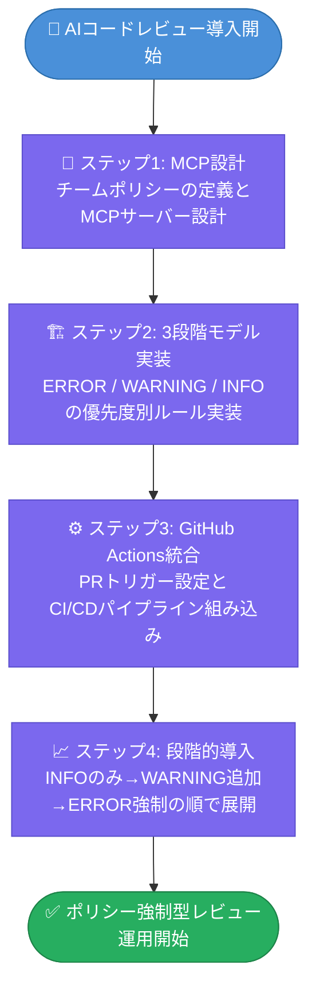
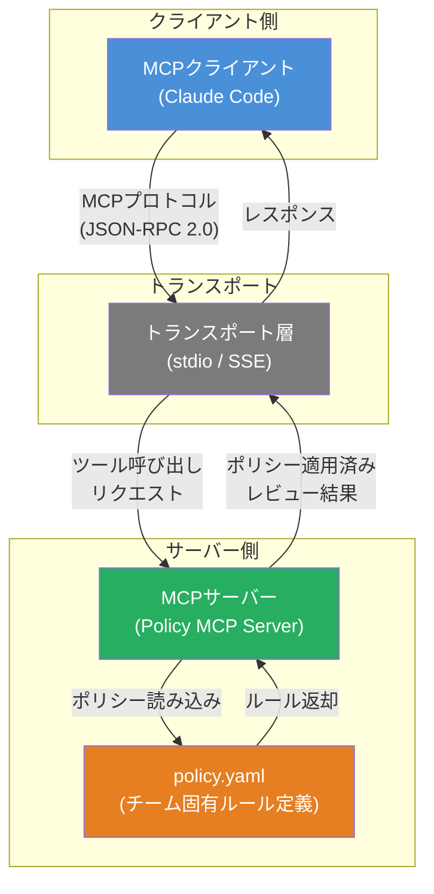
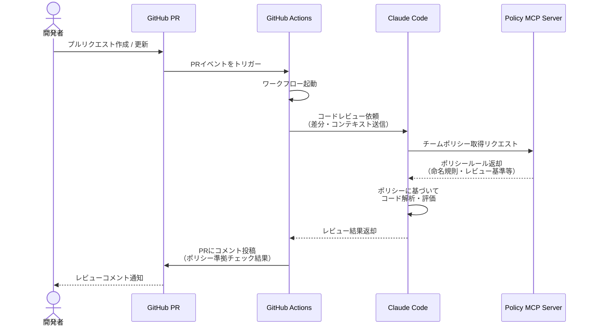

— Claude Code × MCP で実装する段階的ガイドライン導入

---

## はじめに ― 「AIがレビューしてくれる」という幻想

### よくある失敗パターン：なぜAIレビューは"うるさいだけ"になるのか

あるチームの話をします。

フロントエンドとバックエンドを合わせて10名ほどのWebサービス開発チームが、AIコードレビューツールを導入しました。初日は「すごい、こんなにコメントが来た」と盛り上がりました。ところが1週間後、エンジニアたちはほぼ全員がAIのコメントを読み飛ばすようになっていました。

> **注記**：以下は筆者が観察した複数チームの共通パターンを合成した事例です。

理由は単純です。**コメントの量が多すぎて、重要なものとそうでないものの区別がつかなかった**からです。

「変数名をもっとわかりやすくしてください」「このネストは3段階に抑えるべきです」「コメントを英語で書いてください」――これらのコメントは、いずれも間違ってはいません。しかし、そのチームには「日本語コメントでもOK」「レガシーコードのリファクタリングは別チケットで」という暗黙のルールがありました。AIはそれを知らなかったのです。

結果として、AIコメントの大半が無視される状態になりました。その中に本当に重要な指摘が含まれていたとしても、エンジニアはもう見ていません。

これは特殊な事例ではありません。「AIを入れたのにレビューの質が上がらない」「むしろノイズが増えてCIが邪魔になった」という声は、AIコードレビューツールを導入したチームから頻繁に聞かれます。

問題の根本は、**AIコードレビューを「自動化」として設計してしまうこと**にあります。

---

### 自動化 vs ポリシー強制 ― 概念の違いを整理する

「自動化」と「ポリシー強制」は、似ているようで本質的に異なる概念です。

**自動化（Automation）** の発想は、「人間がやっていた作業をAIに置き換える」というものです。人間のレビュアーが見ていたことをAIが代わりに見る。このアプローチの前提は、「AIが人間と同等以上の判断をできる」というものですが、現実にはAIはチームの文脈、過去の意思決定の経緯、プロダクトのビジネスロジックを知りません。

**ポリシー強制（Policy Enforcement）** の発想は、「チームが決めたルールを一貫して適用するエンフォーサーをAIにやらせる」というものです。ここでの主体はあくまでチームです。チームがポリシーを定義し、AIはそのポリシーを漏れなく・疲れずに・一貫して適用します。

この違いは、設計の出発点を根本から変えます。

| 観点 | 自動化アプローチ | ポリシー強制アプローチ |
|------|--------------|------------------|
| AIの役割 | 人間の代替 | ポリシーのエンフォーサー |
| ルールの出所 | AIが汎用的に判断 | チームが明示的に定義 |
| 失敗の原因 | AIの能力限界 | ポリシー定義の不備 |
| 改善の方向 | AIを賢くする | ポリシーを磨く |
| 人間の関与 | 少ないほどよい | 設計者として必須 |

ポリシー強制として設計すると、「AIがおかしなコメントをした」という問題の性質が変わります。「AIが間違えた」ではなく「ポリシーの定義が不明確だった」という改善可能な問題になるのです。これがポリシー強制アプローチの中心的な価値です。

---

### この記事で実現すること（読者への約束）




**対象読者**：Claude CodeおよびGitHub Actionsの基本操作ができる方を対象とします。MCPやPolicy as Codeの事前知識は不要ですが、TypeScriptの読み書きができることを前提とします。

この記事では、以下を具体的に実装します。

**1. Claude Code × MCP によるポリシー強制レビューシステムの設計**
チームのガイドラインをMCPサーバー経由でClaudeのコンテキストに注入し、チーム固有のルールに基づいたレビューを実現します。MCPの仕組みとClaude Codeとの連携については、次のセクションで詳しく説明します。

**2. Warn / Error / Block の3段階モデルの実装**
「警告として伝える」「エラーとして明示する」「CIをブロックする」という3段階を設計し、ルールの重要度に応じた対応を可能にします。

**3. GitHub Actions との統合**
PRが作成・更新されるたびに自動的にポリシーレビューが走り、結果がPRコメントとして投稿される完全なワークフローを実装します。

**4. 段階的な導入フェーズの設計**
「最初からすべてBlockにすると反発が起きる」という実務的な知見に基づき、チームへの摩擦を最小化しながら段階的に導入するアプローチを示します。

コードはすべてTypeScript/YAMLで実際に動作するものを提供します。設定を変えればそのまま使えるレベルを目指します。

---

## AIコードレビューの現状 ― ツールと限界

### 既存ツールの分類（Static Analysis / Rule-based / LLM-based）

```mermaid
graph TD
    ROOT["🔍 AIコードレビュー手法"]

    ROOT --> SA["📐 Static Analysis\n（静的解析）"]
    ROOT --> RB["📋 Rule-based\n（ルールベース）"]
    ROOT --> LB["🤖 LLM-based\n（LLMベース）"]

    SA --> SA1["ESLint"]
    SA --> SA2["Pylint"]
    SA --> SA3["SonarQube"]
    SA --> SA4["Checkstyle"]

    RB --> RB1["Danger JS"]
    RB --> RB2["Reviewdog"]
    RB --> RB3["Pronto"]
    RB --> RB4["カスタムCIスクリプト"]

    LB --> LB1["GitHub Copilot\nCode Review"]
    LB --> LB2["CodeRabbit"]
    LB --> LB3["Claude Code\n× MCP"]
    LB --> LB4["GPT-4 Review Bot"]

    SA:::saStyle
    RB:::rbStyle
    LB:::lbStyle

    SA1:::toolStyle
    SA2:::toolStyle
    SA3:::toolStyle
    SA4:::toolStyle

    RB1:::toolStyle
    RB2:::toolStyle
    RB3:::toolStyle
    RB4:::toolStyle

    LB1:::toolStyle
    LB2:::toolStyle
    LB3:::toolStyle
    LB4:::toolStyle

    NOTE_SA["✅ 構文・型エラーの検出\n⚡ 高速・決定論的\n❌ 文脈理解なし"]
    NOTE_RB["✅ チームポリシー強制\n⚡ カスタマイズ容易\n❌ ルール定義コスト"]
    NOTE_LB["✅ 文脈・意図の理解\n⚡ 柔軟な指摘\n❌ ノイズ・幻覚リスク"]

    SA --- NOTE_SA
    RB --- NOTE_RB
    LB --- NOTE_LB

    classDef saStyle fill:#dbeafe,stroke:#2563eb,color:#1e3a5f,font-weight:bold
    classDef rbStyle fill:#dcfce7,stroke:#16a34a,color:#14532d,font-weight:bold
    classDef lbStyle fill:#fef3c7,stroke:#d97706,color:#78350f,font-weight:bold
    classDef toolStyle fill:#f8fafc,stroke:#94a3b8,color:#334155
```




現在利用可能なコードレビュー支援ツールは、大きく3つのカテゴリに分類できます。

**① Static Analysis（静的解析）**

SonarQube、CodeClimate、Semgrepなどが代表例です。ソースコードを解析し、あらかじめ定義されたルールに照らして問題を検出します。バグの可能性、セキュリティ脆弱性、コードの複雑度などを数値化できます。

強みは再現性と速度です。同じコードに対して常に同じ結果を返します。弱みはルールが汎用的すぎることです。チーム固有の規約（「このプロジェクトではRepositoryパターンを使う」など）をルールとして表現するには、カスタムルールを自前で実装する必要があり、コストが高くなります。

**② Rule-based（ルールベース）**

reviewdog（[GitHub](https://github.com/reviewdog/reviewdog)）、danger.jsなどが代表例です。Lintツールの出力をPRコメントとして投稿したり、CIの成否を制御したりする「フレームワーク」です。

ルールの表現力は比較的高く、JavaScriptやRubyでカスタムロジックを書けます。ただし、「コードの意味を理解したレビュー」はできません。あくまでパターンマッチングです。

**③ LLM-based（LLMベース）**

GitHub Copilot Code Review、CodeRabbit、そしてClaude Codeなどが代表例です。LLM（大規模言語モデル）は大量のテキストと構造化データを学習した機械学習モデルで、自然言語でコードの意味を理解し、文脈に応じたコメントを生成できます。

強みはコードの「意図」を読み取れることです。「この条件分岐は漏れがありそうです」「この変数名はメソッドの動作を誤解させます」といった、ルールでは表現しにくい指摘ができます。

---

### LLMベースレビューが「うるさい」理由 ― コンテキスト欠如問題

LLMベースのレビューが「ノイズが多い」「的外れ」になる根本原因は、**コンテキスト欠如**です。

LLMは、コードを見た瞬間に「一般的なベストプラクティス」に照らして評価を始めます。しかし実際の開発現場では、「一般的なベストプラクティスよりも優先されるチーム固有の判断」が数多く存在します。

典型的な例を挙げます。

- 「このエラーハンドリングは`AppError`クラスでラップすること」というチームルールがあるのに、LLMは標準的な`Error`クラスの使用を提案してくる
- 「テストコードのDRY違反は許容する（可読性優先）」というポリシーがあるのに、テストコードのリファクタリングを大量に提案してくる
- レガシーコードの改修範囲を「今回のPRスコープ外」として意図的に絞っているのに、関係ない箇所の改善を提案してくる

これらはすべて、「LLMが賢くない」のではなく、「LLMがチームの文脈を知らない」ことによる問題です。

---

### チームのガイドラインはどこへ行くのか

多くのチームは、コードレビューのガイドラインを持っています。Confluenceのページ、GitHub WikiのREADME、あるいはベテランエンジニアの頭の中に。

しかしこれらのガイドラインは、AIツールには届いていません。

既存ツールの「チームコンテキスト反映度」を比較すると、以下のようになります。

| ツール | コンテキスト反映度 | カスタマイズ性 | ノイズ量 | チーム規約の反映 |
|--------|------------|------------|--------|------------|
| SonarQube | ✗ | △（カスタムルール要実装） | 多 | 困難 |
| Copilot Code Review | △ | △（限定的） | 中〜多 | 限定的 |
| reviewdog + ESLint | △ | ○（設定ファイルで制御） | 設定次第 | Lint設定の範囲内 |
| Claude Code + MCP | ◎ | ◎（自然言語で定義可能） | 制御可能 | ◎ |

**凡例：◎=優秀 ○=良好 △=限定的 ✗=非対応**

なお、Claude Code + MCPにも現実的なトレードオフがあります。API利用コスト（後述）、MCPサーバーの保守工数、ポリシー定義の更新フローなどが導入・運用上の課題になります。「制御可能」なノイズ量も、ポリシー定義の質に依存します。

Claude Code × MCPの組み合わせが他と異なるのは、**自然言語で書かれたチームのガイドラインをそのままコンテキストとして注入できる**点です。「Repositoryパターンを使うこと」「エラーは`AppError`でラップすること」といった規約を、カスタムルールのプログラミングなしで反映できます。

---

## Claude Code × MCP のアーキテクチャ




本システムを実装する前に、Claude CodeとMCPがどのように連携するかを理解しておく必要があります。

### MCPとは何か

MCP（Model Context Protocol）は、Anthropicが策定したオープンプロトコルです（[公式ドキュメント](https://modelcontextprotocol.io/)）。LLMアプリケーションが外部のデータソースやツールと標準化された方法でやり取りするための仕様を定めています。

MCPの基本的な構造は以下の通りです。

- **MCPクライアント**：LLMアプリケーション側。Claude Codeがこれにあたります
- **MCPサーバー**：外部データやツールを提供する側。今回私たちが実装します
- **トランスポート**：クライアントとサーバー間の通信方式（stdio、HTTP SSEなど）

MCPサーバーは「リソース（Resources）」「ツール（Tools）」「プロンプト（Prompts）」という3種類の機能を提供できます。今回はチームのポリシー定義ファイルを「リソース」として、レビュー実行を「ツール」として提供します。

### Claude CodeがどのようにMCPサーバーを呼び出すか




```
┌─────────────────────────────────────────────────────────────┐
│                     全体アーキテクチャ                         │
│                                                               │
│  GitHub PR ──→ GitHub Actions                                 │
│                     │                                         │
│                     ▼                                         │
│             Claude Code (MCPクライアント)                      │
│                     │                                         │
│          MCP Protocol (stdio / HTTP SSE)                      │
│                     │                                         │
│                     ▼                                         │
│             Policy MCP Server                                 │
│           ┌──────────────────┐                                │
│           │  ① ポリシー定義   │ ←── policy.yaml              │
│           │     (Resource)   │                                │
│           │                  │                                │
│           │