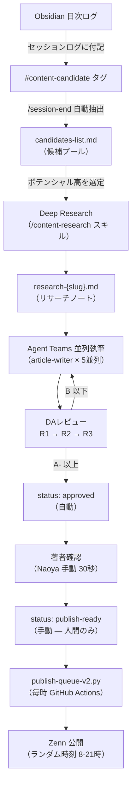

## この記事を書こうと思った背景

前作「[Claude Code × Agent Teamsで1日5本のZenn記事を書いた方法](https://zenn.dev/correlate_dev/articles/ai-content-pipeline)」では「何をしたか」を中心に書きました。

公開後、「実際の設定ファイルを見たい」「DAレビューの具体的な指摘内容は？」「承認キューはどう実装しているか？」という反応が多かったため、この記事では ** 「どうやるか」を再現できるレベルで詳しく ** 解説します。

2026年3月のZenn AIコンテンツガイドライン発表後の現在、「品質を担保したまま量を増やす」設計の詳細を共有することに意義があると判断しました。

---

## パイプラインの全体設計（再掲・拡張版）



8ステップの各工程を、この記事ではステップ0から順に実装レベルで解説します。

---

## ステップ0: 前提条件と初期セットアップ

### 必要なもの

| 必要なもの | 用途 | 備考 |
|-----------|------|------|
| Claude Code Maxプラン（$200/月） | Agent Teams実行 | Agent Teamsはトークン消費が3-4倍 |
| Obsidian | ナレッジベース・セッションログ | 無料プランで可 |
| Zenn CLI + GitHub連携 | `git push` で記事公開 | `npm install -g zenn-cli` |
| Python 3.11+ | publish-queue-v2.py の実行 | pyenvで管理推奨 |
| GitHub Actions | 毎時スケジュール実行 | 無料枠で十分 |

Agent Teamsは2026年4月現在も「実験的機能」のラベルが付いています。将来のバージョンで挙動が変わる可能性があることを念頭に置いてください。

### Obsidianのディレクトリ構成（実際の構造）

```
~/dev/Obsidian/
├── 06_sessions/                # セッションログ
│   ├── 2026-04-07-session.md   # 今日のセッション記録
│   └── current-state.md        # 次セッション引き継ぎ
├── 07_content_pipeline/        # コンテンツパイプライン専用
│   ├── candidates/             # 候補一覧（#content-candidateから自動生成）
│   │   └── content-candidates-list.md
│   ├── research/               # Deep Researchノート
│   │   └── research-{slug}.md  # スラッグごとに1ファイル
│   ├── drafts/                 # 執筆中のドラフト
│   ├── staging/                # DAレビュー通過済み・承認待ち
│   └── templates/              # 記事テンプレート
└── 03_knowledge/               # 技術パターン（CLAUDE.md から参照）
```

`06_sessions/` のセッションログから `07_content_pipeline/research/` のリサーチノートが自動生成される流れが、パイプラインの起点になります。

### Agent Teamsの有効化

`~/.claude/settings.json` に以下を追記します。

```json
{
  "env": {
    "CLAUDE_CODE_EXPERIMENTAL_AGENT_TEAMS": "1"
  },
  "teammateMode": "in-process"
}
```

`teammateMode: "in-process"` を指定すると、チームメイトが同一プロセス内で動作します。`"subprocess"` モードと比べてメモリ効率が高く、コンテンツ生成用途では `"in-process"` を推奨します。

---

## ステップ1: ネタの蓄積 — Obsidianと #content-candidate タグ

### タグ付けだけがネタ探しの全工程

記事のネタ探しに時間を使わなくなったのが、パイプライン導入後の最大の変化です。日々の開発中に気づいたことをセッションログに書いている際、「これは記事になりそう」と感じたものに `#content-candidate` タグを付けるだけ。

```markdown
<!-- 06_sessions/2026-04-07-session.md の一部 -->
## Learnings

- `publish-queue-v2.py` のタイミング制御をSHA256ハッシュで実装した。
  日付ベースで決定的だが予測困難な公開時刻が生成できる #content-candidate
  → タイトル案: 「Zenn記事の公開タイミングをハッシュで決定する設計」
```

### /session-end でのコンテンツ候補自動抽出

`/session-end` スキルを実行すると、セッション中の全作業から `#content-candidate` タグが付いた項目を自動抽出し、`content-candidates-list.md` に追記します。このステップはスキップ禁止のMUSTゲートとして設計しています。

候補リストの各エントリーには自動でポテンシャルスコア（High/Medium/Low）が付与され、High判定の候補には `research-{slug}.md` ファイルのスケルトンが自動生成されます。

---

## ステップ2: Deep Research — リサーチノートの作成

記事執筆の前に、必ずDeep Researchを実施します。リサーチなしで執筆に入ることは禁止しています。

### /content-research スキルの役割

`/content-research {slug}` を実行すると、以下の4つの分析が行われます。

1. ** 競合記事分析 **: 同テーマの既存Zenn記事を5-10本調査し、差別化ポイントを特定
2. ** 参考文献収集 **: 公式ドキュメント・一次資料のURLと要点
3. ** 構成案の生成 **: H2レベルの目次案と各セクションの想定行数
4. ** コード例の収集 **: 実装に必要なコードスニペットのドラフト

このリサーチノートが、次のAgent Teamsへのインプットになります。 ** リサーチノートの質がそのまま記事の質に直結します ** 。

---

## ステップ3: Agent Teamsの設定と役割分担

### 3つのエージェントの役割

| エージェント | 役割 | モデル | 並列実行 |
|:--|:--|:--|:--|
| `deep-researcher` | 競合分析・参考資料の補足収集 | sonnet | ✅ |
| `article-writer` | リサーチ結果をもとに記事を執筆 | haiku | ✅（最大5並列） |
| `devils-advocate` | 批判的レビュー（DAレビュー） | sonnet | — |

**article-writerにhaikuを使う理由 **: テンプレートに沿った文章生成は軽量モデルで十分であり、並列実行コストを抑えられるからです。一方、DAレビューはsonnetを使います。レビュー精度が低いと品質ゲートとして機能しないため、ここはコストをかける判断になる。

### CLAUDE.md での共通ルール設定

全チームメイトに共通するルールは CLAUDE.md（プロジェクト設定）に記載します。個々のspawn promptで繰り返し書く必要がなくなります。

```markdown
<!-- ~/dev/projects/self/public-zenn-docs/CLAUDE.md -->
# Zennコンテンツチーム共通ルール

## 文体ルール（全エージェント共通）
- です・ます調で統一（体言止め混在可）
- 同じ文末を3回連続させない
- 技術用語の初出時は括弧で補足

## Front Matter 必須項目
- topics: インライン配列形式（YAML list禁止）
- topicsは英語小文字のみ（最大5つ）
- publication_name: "correlate_dev"（変更禁止）

## 禁止事項
- WebSearch（リサーチノートにある情報だけを使うこと）
- コードベースの探索（指定ファイル以外のReadを禁止）
- 著者に関する情報の創作
```

### spawn promptのテンプレート（自己完結原則）

Agent Teamsで最も重要な設計判断は、 **spawn promptを自己完結させる ** ことです。以下がarticle-writer用のテンプレートです。

```markdown
## あなたの役割
Zenn技術記事のドラフトを執筆する article-writer です。

## 入力情報（このプロンプト内にすべて含まれています）
- テーマ: {テーマ}
- ターゲット読者: Claude Codeを使っている個人開発者・エンジニア
- リサーチノート: {絶対パス}（このファイルだけ読んでください）
- 目標行数: 350-450行

## 制約（厳守）
- ** 既存ファイルを探索する必要はありません ** （このプロンプトだけで完結します）
- WebSearchは使わず、リサーチノートと知識から執筆してください
- 読んでよいファイルは上記リサーチノートの1ファイルのみ

## 出力形式
以下のFront Matterで始まること:

\`\`\`yaml
---
title: "（リサーチノートのタイトル案から最良のものを選ぶ）"
emoji: "（テーマに合った絵文字1つ）"
type: "tech"
topics: ["topic1", "topic2", "topic3"]
published: false
status: "draft"
publication_name: "correlate_dev"
---
\`\`\`

## 出力先
/Users/naoyayokota/dev/projects/self/public-zenn-docs/articles/{slug}.md
（上書きしてよい。ファイルが存在しない場合は新規作成）
```

「既存ファイルを読む必要はない」を明示するのが最重要です。この一文がないと、エージェントはコードベースを探索し始め、tool callが爆発してコンテキストが枯渇します。これは実際に痛い目を見た経験から来るルールです（→ 失敗パターン1）。

### Subagentsとの使い分け判断

Claude CodeにはAgent Teamsの他にSubagents（`Agent` ツール経由）があります。

| 比較軸 | Agent Teams | Subagents |
|--------|------------|-----------|
| 通信方向 | 双方向（チームメイト間で協議） | 一方向（結果を返すのみ） |
| コスト比 | 3-4倍 | 1倍 |
| 向いているタスク | 前のエージェントの成果物が次に必要 | 独立して並列実行できる |
| コンテンツPL内での用途 | リサーチャー→ライターの成果物連携 | 個別記事の並列生成 |

実運用の感覚では、 **70-80%程度のタスクはSubagentsで十分 ** です。コストを考えると、Agent Teamsは「前の工程の中間成果物を受け取って次の工程が走る」場合にのみ使うべきで、それ以外はSubagentsで十分です。

---

## ステップ4: DAレビュー — 品質を担保する仕組み

### DAとは何か

DA（Devil's Advocate / デビルズアドボケイト）は、ドラフトを忖度なしで批判するレビュワーです。「良い点を探す」のではなく「問題点を探す」役割に特化しています。

Google DeepMindの研究でも、AIの出力物を別のAIが批判的にレビューすることで品質が向上することが示されています。コンテンツパイプラインでは、article-writerとdevils-advocateを意図的に分離することで同様の効果を得ています。

### 評価基準: HIGH/MEDIUM/LOW の定義

| 重要度 | 定義 | 具体例 |
|--------|------|--------|
| HIGH | 公開不可レベルの問題 | 事実誤認、URL無効、著者オリジナル要素の欠如、セキュリティリスク |
| MEDIUM | 品質に影響するが公開は可能 | 構成の改善余地、冗長な説明、内部リンク切れ |
| LOW | あれば良いレベル | 表現の微調整、追加情報の提案、文末リズムの改善 |

**HIGH判定は差し戻し必須 ** 。B評価以下の場合は article-writer が修正ラウンドに戻ります。

### DAレビューの評価スキル（da-review/SKILL.md の核心）

```markdown
## 著者オリジナル要素チェック（Zennガイドライン対応・最重要）

以下の3項目を確認すること:
1. 記事内に著者の実体験・検証結果に基づく記述があるか
2. AIの一般的回答と区別できる固有の知見が含まれるか
3. 「実際にやらないとわからない」レベルのハマりポイントがあるか

→ 3つとも No の場合: HIGH「著者オリジナル要素不足」で差し戻し（理由も明記）

## コンテンツ品質チェック

- [ ] 文体: です・ます調の統一（体言止め混在は可）
- [ ] 事実確認: 数値・URL・バージョン番号の正確性
- [ ] 構成: 導入→本題→まとめの流れ
- [ ] コードブロック: 実行可能か、文脈と一致しているか
- [ ] 差別化: 既存記事との重複がないか
```

### 指摘フォーマット（コードブロック形式）

DAレビューの出力は以下のフォーマットで統一しています。

```
[HIGH] 事実確認: BigQuery MLの無料枠上限が誤っている
  現状: 「月10GBまで無料」と記載
  推奨: 「最初の1TBのクエリ処理が無料（その後は$6.25/TB）」に修正
  理由: 公式ドキュメントと矛盾。読者が誤った前提でアーキテクチャ設計するリスク

[MEDIUM] 構成: ステップ3が長すぎて読み疲れる
  現状: H2「ステップ3」が30段落・180行
  推奨: 「DAの定義」「評価基準」「実際の指摘例」の3つのH3に分割
  理由: 段落が長いと読者が離脱しやすい
```

フォーマットを固定することで、article-writerが指摘を機械的に修正しやすくなります。

### R1→R2→R3: 多段レビューの効果（実測データ）

承認キューを実装した際のDAレビュー推移の実例です。

| ラウンド | 総合評価 | HIGH | MEDIUM | LOW | 主な指摘 |
|---------|---------|------|--------|-----|---------|
| R1 | B- | 4 | 7 | 3 | Discord通知変数名の不一致、frontmatter範囲外の誤置換 |
| R2 | B | 2 | 4 | 2 | レートリミット判定ロジックの説明不足、部分変更フラグの分離不足 |
| R3 | A- | 0 | 3 | 3 | ログメッセージの整合性（軽微） |

R1のHIGH 4件がR3でゼロになるのが、多段レビューの価値です。1回のレビューではどうしても見落しが出るため、最低3ラウンドを原則としています。

---

## ステップ5: 承認キュー — 「人が主体」を技術的に担保する

### Zennガイドライン（2026-03-10）への対応

Zennの[AIコンテンツガイドライン](https://info.zenn.dev/2026-03-10-ai-contents-guideline)は「人が主体」であることを要請しています。具体的には、「公開前に内容の正確性を検証すること」と「著者自身の経験や洞察が込められていること」です。

全自動で公開すると、著者が内容を検証していないコンテンツが世に出るリスクがあります。そこで設計したのが ** 承認キュー方式 ** です。

### 4ステータスの設計思想

```yaml
# Front Matterのstatusフィールドで管理

status: "draft"          # 執筆中（article-writerが自動設定）
  ↓ DAレビュー A- 以上
status: "approved"       # レビュー通過（devils-advocateが自動設定）
  ↓ Naoyaが内容を目視確認（1記事あたり30秒）
status: "publish-ready"  # 公開承認（人間のみが変更できる）
  ↓ publish-queue-v2.py が毎時チェック
status: "published"      # 公開完了（スクリプトが自動設定）
```

`status: publish-ready` への変更は ** 人間（私）のみが実行できる ** ように設計しています。スクリプト側に自動承認ロジックは一切持たせていません。この「最小限の人間ゲート」こそがZennのガイドラインへの技術的な対応策。

### publish-queue-v2.py のタイミング制御ロジック

```python
# publish-queue-v2.py（抜粋）
import hashlib
from datetime import datetime

# 制御定数
DAILY_LIMIT = 4           # Zenn公式上限5本、安全マージン1本分
COOLDOWN_HOURS = 48       # 失敗記事の再試行間隔
MAX_CONSECUTIVE_DAYS = 3  # 連続公開の上限
PUBLISH_HOUR_MIN = 8      # 公開時間帯（JST）
PUBLISH_HOUR_MAX = 21


def date_hash(date_str: str, salt: str) -> int:
    """日付とsaltからハッシュ値を生成（決定的・予測困難）"""
    raw = f"{date_str}:{salt}".encode()
    return int(hashlib.sha256(raw).hexdigest(), 16)


def get_publish_hour(today: datetime) -> int:
    """今日の公開時刻をハッシュで決定する"""
    h = date_hash(today.strftime("%Y-%m-%d"), "publish_hour")
    return PUBLISH_HOUR_MIN + (h % (PUBLISH_HOUR_MAX - PUBLISH_HOUR_MIN + 1))


def should_skip_today(today: datetime) -> bool:
    """土日は50%の確率でスキップ（ハッシュベース）"""
    if today.weekday() < 5:  # 平日はスキップしない
        return False
    h = date_hash(today.strftime("%Y-%m-%d"), "weekend_skip")
    return (h % 2) == 0


def get_next_publish_ready_article(queue_dir: str) -> str | None:
    """publish-readyのarticleを1本取得（更新日時が最古のものを優先）"""
    candidates = []
    for path in Path(queue_dir).glob("*.md"):
        frontmatter = parse_frontmatter(path)
        if frontmatter.get("status") == "publish-ready":
            candidates.append((path.stat().st_mtime, path))
    return min(candidates)[1] if candidates else None
```

** 設計のポイント **: 同じ日付なら何時に実行しても同じ公開時刻が返ります（決定的）。しかし外部からは予測しにくい（SHA256ハッシュ）。これにより「毎日X時に公開しているbot」のパターンを避けられます。

### GitHub Actionsでの毎時実行

```yaml
# .github/workflows/publish-queue.yml
name: Publish Queue

on:
  schedule:
    - cron: '0 * * * *'  # 毎時00分に実行
  workflow_dispatch:       # 手動実行も可

jobs:
  publish:
    runs-on: ubuntu-latest
    steps:
      - uses: actions/checkout@v4
        with:
          token: ${{ secrets.GITHUB_TOKEN }}

      - name: Run publish queue
        run: python scripts/publish-queue-v2.py
        env:
          ZENN_QUEUE_DIR: articles/
          TZ: Asia/Tokyo

      - name: Commit changes
        run: |
          git config user.name "publish-queue[bot]"
          git config user.email "bot@correlate.design"
          git add -A
          git diff --staged --quiet || git commit -m "chore: publish article via queue"
          git push
```

---

## 失敗パターンと対処法

### 失敗1: コンテキスト枯渇 — 5本中4本が途中終了した夜

2026年2月21日、初めて5本の記事を並列生成しようとしたときの話です。

結果は4本が `Context limit reached` で途中終了。成功したのは1本だけでした。原因はspawn promptの曖昧さでした。

```
# NG例（実際に使って失敗したプロンプト）
"public-zenn-docsプロジェクトを調べて、
 {テーマ}に関する記事を書いてください"

# 何が起きたか
→ エージェントがプロジェクト全体のディレクトリを探索開始
→ CLAUDE.md, articles/*.md を次々Read
→ tool callが50回を超えた段階でContext limit
→ 5エージェントのうち4エージェントが同様の運命
```

** 対策（現在のプロンプト） **:

```
# OK例
"以下のテンプレートとリサーチノートだけを使って書いてください。
 既存ファイルを読む必要はありません。
 WebSearchは不要です。
 読んでよいファイルは /absolute/path/to/research-{slug}.md だけです。"
```

この変更後、5本並列で5本すべて成功するようになりました。成功率: 20% → 100%。「プロジェクトを探索しなくていい」という明示が最大の改善点です。

### 失敗2: ファイル競合 — 2エージェントが同じファイルを上書き

Agent Teamsで複数エージェントが並列動作している際、出力先ファイルのパスが重複するとどちらかの成果物が消えます。

** 発生条件 **: spawn prompt内のスラッグを動的に生成した際に、ハッシュ衝突でほぼ同一のスラッグになったケース。

** 対策 **: スラッグはメインエージェントが事前に確定し、リスト形式でspawn promptに埋め込む。エージェント側でスラッグを生成させない。

```python
# publish-queue orchestrator 側での事前確定
slugs = [
    "ai-content-pipeline-rewrite",
    "bigquery-merge-idempotent",
    "claude-code-agent-teams-guide",
    "obsidian-session-management",
    "zenn-publish-automation",
]
# 各spawn promptにhardcodeして渡す
```

### 失敗3: bold過多 — 強調だらけは何も強調していない

5本のドラフト全体で太字マーカーが84箇所使われていました。DAのR1レビューで「強調が多すぎて読みにくい。1セクション2-3箇所に絞ること」と指摘されて一括修正。

AIには「重要そうに見せたい」バイアスがあるようです。CLAUDE.md に「1H2セクションにつき太字は最大3箇所」のルールを追加後、この問題は発生しなくなりました。

### 失敗4: Zennガイドライン観点での差し戻し

DAレビューに著者オリジナル要素チェックを追加する前は、「ハウツー記事の体裁だが、実際には一般的な情報の寄せ集め」という状態の記事が approved になってしまうことがありました。

追加後は、3つのオリジナル要素チェックすべてが No の場合に HIGH 判定で自動差し戻しするようにしました。この変更以降、「著者の体験談がゼロの記事」が publish-ready になることはなくなっています。

---

## モデル使い分けのコスト感

### 役割別モデル選択の根拠

| エージェント | モデル | 月間コスト感（目安） | 選択理由 |
|:--|:--|:--|:--|
| article-writer | haiku | 低（月$5-10程度） | テンプレート埋めは軽量モデルで十分 |
| deep-researcher | sonnet | 中（月$20-30程度） | 競合分析の精度が品質を左右する |
| devils-advocate | sonnet | 中（月$15-20程度） | レビュー精度を下げるとゲートが形骸化 |
| 設計・判断 | opus | 低（月$5程度） | アーキテクチャ設計時のみ使用 |

Maxプラン（$200/月）の範囲内で十分に収まっています。最も重要な投資先はDAレビューのsonnetです。article-writerをopusにしても記事品質は大して変わりませんが、DAをhaikuに下げると指摘の見落しが増加した。

---

## Before → After（詳細版）

| 指標 | パイプライン導入前 | 現在 |
|:--|:--|:--|
| 1本あたりの所要時間 | 3〜5時間 | 約50分（素材が揃っている場合） |
| テーマ選定 | 毎回ゼロから考える（30-60分） | タグ検索で候補一覧（5分） |
| コードブロック数（平均） | 1-2個 | 6-8個 |
| 品質チェックの精度 | 自分で読み返すだけ（見落し多） | DA 3ラウンド → HIGH ゼロが前提 |
| 参照URLの有効性確認 | 手動（やらないことも多い） | DAが自動チェック |
| 公開タイミング | 手動git push（不規則） | 承認キューで自動（8-21時ランダム） |
| 月間公開本数 | 2-4本 | 15-20本（承認キューに通したもの） |

所要時間の内訳（1サイクル・5本同時生成の場合）:

- Obsidianでのネタ選定: 15分
- Deep Research (/content-research × 5): 40分（並列実行）
- Agent Teams 並列執筆（5本）: 90分
- DAレビュー 3ラウンド（5本分）: 60分
- 著者確認 + publish-ready 設定: 15分（1本あたり3分）

** 合計: 約3時間20分 / 5本 = 1本あたり約40分 **

---

## 今後の課題と正直な限界

### 文末リズムの同質化問題

AIが生成する日本語は「〜します。〜します。〜します。」と文末が均一になりがちです。DAレビューに文末3連続検出ルールを組み込みましたが、完全な解消には至っていません。体言止めや断言を混ぜるプロンプト設計の改善が継続的な課題として残る。

### 「1日5本」は素材が揃っている前提

「1日5本」はあくまで素材（リサーチノート5本分）が揃っている前提です。素材がないところから記事は生まれません。パイプラインが機能するためには、日々のセッションログへの `#content-candidate` タグ付けを継続する習慣が不可欠になる。

### Zennガイドラインへの継続的な対応

2026年3月のガイドラインは「禁止」ではなく「人が主体であること」を要請するものでした。しかし方針は今後も更新される可能性があります。承認キュー方式はその変化に対応しやすい設計にしていますが、定期的な方針確認は欠かせない。

---

## 読者が試せる最小ステップ

大がかりなパイプラインを一気に構築する必要はありません。以下の3ステップから始めてみてください。

**Step 1: タグ付けの習慣化 **

日々の開発ログに `#content-candidate` タグを付ける習慣から始める。1週間続けると候補が5-10件溜まります。

**Step 2: settings.json にAgent Teamsを有効化 **

```json
{
  "env": {
    "CLAUDE_CODE_EXPERIMENTAL_AGENT_TEAMS": "1"
  }
}
```

これだけで並列実行が可能になります。まず1本だけ試してみてください。

**Step 3: spawn promptを自己完結させる **

既存ファイルの探索を禁止し、指定ファイルだけを読むよう明示する。この一文がコンテキスト枯渇を防ぐ最重要の設計原則です。

**DAレビューを後から追加する **

記事を1本書いたら、別セッションで「この記事を忖度なしで批判してください。HIGH/MEDIUM/LOWで評価してください」と依頼するだけでDA相当のレビューが得られます。スキルとして体系化するのはその後でも十分です。

---

## おわりに

承認キュー方式の設計で最も重要だったのは、「人間が介在するタイミングをどこにするか」の判断でした。全自動にする誘惑は強かったものの、Zennのガイドライン対応だけでなく「著者として内容に責任を持つ」という観点から、`publish-ready` への変更だけは人間が行う設計にしました。

AIには「何を書いてほしいか（What）」を伝え、「どう書くか（How）」は任せる。ただし検証する役割（DA）を必ず組み込み、最終承認は人間が行う。パイプラインの設計思想はこの一文に集約されます。

「開発するだけでコンテンツが生まれる」という流れをつくることが、今回のパイプライン設計で一番大事にしたことです。

---

## 参考資料

https://docs.anthropic.com/ja/docs/claude-code/agent-teams

https://info.zenn.dev/2026-03-10-ai-contents-guideline

https://zenn.dev/sc30gsw/articles/4eee68a83454a2

https://zenn.dev/toono_f/articles/claude-code-agent-teams-guide

https://ledge.ai/articles/google_deepmind_devils_adovocate

---

** 関連記事 **

- [Claude Code × Agent Teamsで1日5本のZenn記事を書いた方法](https://zenn.dev/correlate_dev/articles/ai-content-pipeline)
- [Claude Code Agent Teamsで開発タスクを並列処理した実践ガイド](https://zenn.dev/correlate_dev/articles/agent-teams-parallel)

> [correlate_dev](https://zenn.dev/p/correlate_dev) では、Claude Code・GCP・Pythonを使った開発自動化の実践知を発信しています。
