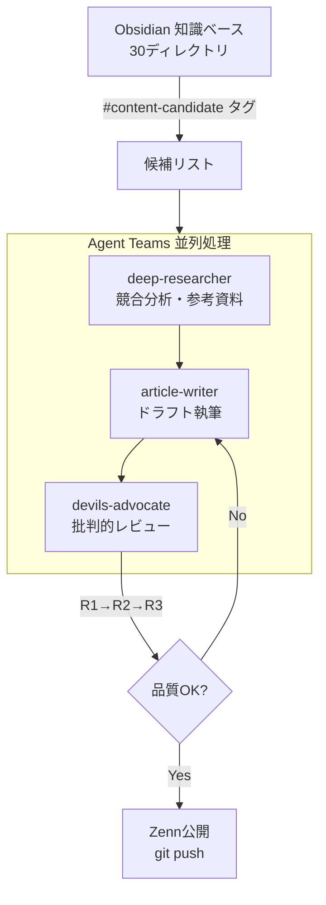

---
title:" "Claude Code × Agent Teamsで1日5本のZenn記事を書いた方法""
emoji: "🚀"
type: "tech"
topics: ["claudecode", "agentteams", "zenn", "obsidian", "ai"]
published: true
publication_name: "correlate_dev"
---

## 1本に半日かかっていた記事を、1日で5本書けるようになった

技術記事を書くのに半日かかっていました。Obsidianに素材はあるのに、「記事」に変換する作業が重すぎて手が止まる。その状態が変わったのは、Claude Code Agent Teamsでコンテンツパイプラインを組んでからです。

2026年2月8日、Zennに技術記事を5本公開しました。すべてDAレビュー（デビルズアドボケイトによる批判的レビュー）を経ています。所要時間は合計で約4時間。AIに丸投げした粗悪コンテンツではなく、事実確認・構成・読みやすさを検証したうえでの5本になります。

この記事では、そのパイプラインをどう構築し、何がうまくいき、何に躓いたかをお話しします。

## 記事を1本書くのに半日かかっていた

私は合同会社コラレイトデザインを運営しながら、日々の開発で得た知見を技術記事にまとめています。ただ正直なところ、記事執筆はずっと後回しになっていました。

理由は単純で、時間がかかりすぎる。

テーマ選定、構成、下調べ、執筆、推敲。1本の記事に3〜5時間費やすことも珍しくありませんでした。開発業務の合間に「書かなきゃ」と思いつつ、手が止まる。気づけば Obsidian のセッションログだけが積み上がっていく日々。

もどかしいのは、ログの中にはすでに記事のタネが眠っていたこと。Google Drive のトラブル対応記録、Agent Teams の検証メモ、claude.md の設計判断——どれも記事になり得る素材なのに、「素材」から「記事」への変換コストが高すぎて放置していました。

「開発作業をするだけで、自然に記事が生まれる仕組みはつくれないだろうか？」

これがパイプライン構想の出発点です。

## パイプラインをつくる

### 設計思想: "What" を伝え、"How" は任せる

パイプラインを設計する上で意識したのは、AIに「何を書いてほしいか（What）」を徹底的に伝え、「どう書くか（How）」には一切触れないという原則です。

記事のテーマ、ターゲット読者、差別化ポイント、文体の方針、参照すべき自分の体験——こうした「What」をObsidianのメモやリサーチノートとして準備し、あとはエージェントに委ねます。コードの書き方を指示するのではなく、出力の期待値を明確にする。検証はDAという別のエージェントに任せる。

この考え方があったからこそ、パイプラインが機能しました。

### 全体像

### Obsidian: すべての起点

Obsidian vault には30のディレクトリがあり、セッションログ、意思決定記録、ナレッジパターンが蓄積されています。日々の開発中に「これは記事になりそうだ」と感じたものには `#content-candidate` タグを付けておく。

この仕組みのおかげで、いざ記事を書こうとしたとき「何を書くか」で迷う時間がゼロになりました。タグを検索するだけで候補が一覧できます。

### Agent Teams: 並列処理の威力

Claude Code の Agent Teams を使い、複数のエージェントを並列で動かしました。

| エージェント | 役割 | 具体的な動き |
|:--|:--|:--|
| deep-researcher | 競合分析・参考資料の収集 | WebSearchで類似記事を調査し、リサーチノートを作成 |
| article-writer | リサーチ結果をもとに記事を執筆 | リサーチノート + Obsidianの体験ログを読んでドラフトを生成 |
| devils-advocate | 事実確認・論理・SEO・可読性の批判的レビュー | ドラフトを忖度なしで批判し、修正案を提示 |

deep-researcherとarticle-writerは並列に走らせています。リサーチャーが競合を調べている間にライターがObsidianの素材からドラフトを書き始める。完全に独立した作業なので、待ち時間がほぼゼロ。

### 最初からうまくいったわけではない

正直に書くと、最初のアプローチは微妙でした。

Agent Teamsを使わず、Claude Code単体で1本書かせてみたところ、出てきたのは「それっぽいが薄い記事」。Obsidianのログを参照させる指示は出しましたが、エージェントが拾う情報の粒度が粗く、自分の体験がちゃんと反映されていませんでした。

そこでリサーチャー・ライター・レビュワーの3役に分けたのですが、今度はリサーチャーが集めた情報をライターがうまく使えない問題が発生。エージェント間のコンテキスト共有が不十分だったためです。結局、リサーチ結果をマークダウンファイルに書き出し、ライターに明示的に読ませるフローに落ち着くまで、2〜3回の試行を要しました。

### DA多段レビュー: R1→R2→R3

DAによるレビューは1回で終わらせません。R1（初回指摘）→ R2（修正確認）→ R3（最終チェック）と3ラウンド回します。

なぜ多段にするのか？ 単純に、1回のレビューでは見落としが出るからです。

実際、今回のレビューで発覚した問題があります。5本の記事全体で太字マーカーが84箇所も使われていました。強調だらけの文章は、何も強調していないのと同じ。R1の指摘を受けて一括修正し、R2で修正漏れを確認、R3で最終的な読みやすさを検証しています。

:::message alert
DAレビューなしでAI生成記事を公開するのは危険です。今回のレビューでは、統計データの誤引用や参照URLの不備が複数検出されました。Googleの2025年品質評価ガイドラインでも、AI大量生成+人間監修なしのコンテンツは最低品質と分類されています[^1]。ファクトチェックの省略は信頼性を大きく損ないます。
:::

### Zenn CLI + GitHub: 公開まで自動化

最後の工程は `npx zenn preview` でローカル確認し、`git push` するだけ。GitHub連携済みのZennなら、pushした瞬間に記事が反映されます。ここは既存の仕組みをそのまま活用した形で、特別なことはしていません。

## Before → After

| | Before | After |
|:--|:--|:--|
| 1本あたりの所要時間 | 3〜5時間 | 約50分 |
| テーマ選定 | 毎回ゼロから考える | タグ検索で候補一覧 |
| 品質チェック | 自分で読み返すだけ | DA 3ラウンドレビュー |
| 参照URLの検証 | 手動（やらないことも） | DAが自動チェック |

所要時間の内訳はおおよそこうなります。ネタ選定とObsidianからの素材抽出に30分、Agent Teamsによる並列リサーチ+執筆に2時間、DAレビュー3ラウンドに1時間、最終確認とgit pushに30分。5本合計で約4時間でした。

数字だけ見れば「5倍速」ですが、本質はスピードではないと感じています。これまで「素材はあるのに記事にならない」という摩擦がなくなったことが一番大きい。開発ログを書く行為そのものが、記事執筆の第一歩になっています。

## 今回公開した5本の記事

:::details 公開記事一覧（クリックで展開）

1. [Google Driveで開発フォルダを同期したら167GB書き込まれた話](https://zenn.dev/correlate000/articles/google-drive-incident)
2. [デビルズアドボケイトをAI開発チームに入れたら品質が劇的に改善した話](https://zenn.dev/correlate000/articles/devils-advocate-ai-team)
3. [Claude Code Agent Teamsで開発タスクを並列処理した実践ガイド](https://zenn.dev/correlate000/articles/agent-teams-parallel)
4. [CLAUDE.md設計ガイド - AIエージェントに環境を理解させる15セクション](https://zenn.dev/correlate000/articles/claude-md-guide)
5. [Obsidian × Claude Codeで作業ログを自動蓄積する仕組み](https://zenn.dev/correlate000/articles/obsidian-claude-code)

:::

それぞれ独立した記事になっているので、興味のあるテーマから読んでいただければと思います。

## 学んだこと

### DAレビューは省略してはいけない

5本すべてに共通していたbold過多問題（84箇所）は、人間の目視レビューでは気づきにくいものです。DAの批判的視点があったからこそ、公開前に修正できました。もっともらしい統計データや参照URLこそ、機械的に検証する仕組みが要る。

### パイプラインはネタを循環させる

面白いのは、このパイプライン自体が記事のネタになるという点。今まさにこの記事がそうです。開発プロセスを記録し、それを記事にする仕組みを作れば、仕組みそのものがコンテンツを生む。再帰的な構造と言ってもいいでしょう。

### 読者が始めるなら

大がかりなパイプラインを一気に構築する必要はありません。まずは以下の2つから試してみてください。

1. 日々の開発ログに `#content-candidate` タグを付ける習慣をつくる
2. Claude Code で1本だけ記事を書いてみて、DA役のエージェントにレビューさせる

この2ステップだけでも、「素材はあるのに記事が書けない」問題はかなり軽減されるはずです。

:::message
Agent Teams の具体的な設定方法は[こちらの記事](https://zenn.dev/correlate000/articles/agent-teams-parallel)で詳しく解説しています。
:::

## おわりに

「AIで記事を量産する」と聞くと、品質を犠牲にしたスパム的なコンテンツを想像するかもしれません。ですが今回のアプローチは真逆で、レビュープロセスを自動化することで品質を担保しながらアウトプット量を増やしています。

AIには「何を書いてほしいか」を伝え、「どう書くか」は任せる。ただし検証する役割（DA）を必ず組み込む。この設計が機能すれば、人間はテーマの選定と最終判断に集中できます。

1日5本はあくまで結果であって、目標ではありません。大事なのは「開発するだけでコンテンツが生まれる」という流れをつくること。その仕組みができたことが、今回の一番の成果だと感じています。

## 参考資料

https://docs.anthropic.com/en/docs/claude-code/agent-teams

https://www.suzukikenichi.com/blog/ai-generated-content-references-in-the-search-quality-evaluator-guidelines-updated-on-january-2025/

https://ledge.ai/articles/google_deepmind_devils_adovocate

[^1]: Google検索品質評価ガイドライン（2025年1月更新）では、AIで大量生成し人間の監修を経ていないコンテンツを最低品質（Lowest Quality）に分類しています。
