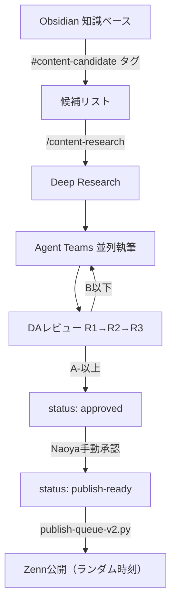

## 1本に半日かかっていた記事を、1日5本書けるようになった

技術記事を書くのに半日かかっていました。Obsidianに素材はあるのに、「記事」に変換する作業が重すぎて手が止まる。その状態が変わったのは、Claude Code Agent Teamsでコンテンツパイプラインを組んでからです。

2026年2月8日、Zennに技術記事を5本公開しました。すべてDAレビュー（デビルズアドボケイトによる批判的レビュー）を経た記事です。所要時間は合計で約4時間。AIに丸投げした粗悪コンテンツではなく、事実確認・構成・読みやすさを検証したうえでの5本になります。

2026年3月には、Zennが [AIコンテンツガイドライン](https://info.zenn.dev/2026-03-10-ai-contents-guideline) を発表。「人が主体」であることが求められる時代に、どうやって品質と効率を両立するか——この記事ではパイプラインの設計・設定・失敗談・品質管理の仕組みを詳しく解説します。

## パイプラインの全体設計


```mermaid
graph TB
    A["Obsidian 知識ベース"] -->|"#content-candidate タグ"| B["候補リスト"]
    B -->|"/content-research"| C["Deep Research"]
    C --> D["Agent Teams 並列執筆"]
    D --> E["DAレビュー R1→R2→R3"]
    E -->|"A-以上"| F["status: approved"]
    F -->|"Naoya手動承認"| G["status: publish-ready"]
    G -->|"publish-queue-v2.py"| H["Zenn公開（ランダム時刻）"]
    E -->|"B以下"| D
```

全体は8ステップで構成されています。ポイントは2つあります。

1. **品質ゲートが2段階ある**: DAレビュー（自動）と著者承認（手動）の二重チェック
2. **公開タイミングが非決定的**: ハッシュベースのランダム時刻で、bot的パターンを回避

## ステップ0: 必要なものと初期セットアップ

### 前提条件

| 必要なもの | 用途 |
|-----------|------|
| Claude Code（Maxプラン $200/月推奨） | Agent Teamsはトークン消費が大きい |
| Obsidian | 知識ベース・セッションログの蓄積 |
| Zenn CLI + GitHub連携 | `git push` で記事公開 |

Agent Teamsは実験的機能であり、将来変更される可能性があります。Maxプランを推奨する理由は、5本並列でのトークン消費が通常の3-4倍に達するためです。

### Obsidianのディレクトリ構成

私のObsidian Vaultでは、コンテンツパイプライン専用のディレクトリを用意しています。

```
~/dev/Obsidian/
├── 06_sessions/           # セッションログ（全作業の記録）
│   └── current-state.md   # 次セッション引き継ぎ用
├── 07_content_pipeline/   # コンテンツパイプライン
│   ├── candidates/        # #content-candidate → 候補一覧
│   ├── research/          # Deep Researchノート
│   ├── drafts/            # 執筆中ドラフト
│   └── competitive/       # 競合分析レポート
└── 03_knowledge/          # 技術パターン・ナレッジ
```

セッションログに `#content-candidate` タグを付けると、セッション終了時にパイプラインが自動検知する仕組みだ。このタグ付けだけが「ネタ探し」の全工程で、いざ記事を書くときに「何を書くか」で迷う時間はゼロになります。

### Agent Teamsの有効化

Claude Codeの設定ファイル（`~/.claude/settings.json`）に以下を追加します。

```json
{
  "env": {
    "CLAUDE_CODE_EXPERIMENTAL_AGENT_TEAMS": "1"
  }
}
```

この1行で、Claude Codeのセッション中に別のClaude Codeインスタンスを「チームメイト」として起動できるようになります。

## ステップ1: ネタの蓄積と自動抽出

### #content-candidateタグの運用

日々の開発中に「これは記事になりそうだ」と感じたものには、セッションログに `#content-candidate` タグとタイトル案1行を付けるだけ。

```markdown
## Learnings
- Google Driveの同期で167GB書き込まれた #content-candidate
  → タイトル案: 「Google Driveで開発フォルダを同期したら大変なことになった話」
```

### セッション終了時の自動抽出

`/session-end` スキル実行時に、セッション中の全作業からコンテンツ候補を自動抽出します。これはスキップ禁止のMUSTゲートとして設計しました。

抽出された候補は `content-candidates-list.md` に追記され、ポテンシャル「高」の候補には自動で `research-{slug}.md` ファイルが生成される。このファイルが次のステップ（Deep Research）のトリガーになります。

## ステップ2: Agent Teamsの設定と役割分担

### 3つの役割

| エージェント | 役割 | モデル | 並列 |
|:--|:--|:--|:--|
| deep-researcher | 競合分析・参考資料の収集 | sonnet | ✅ |
| article-writer | リサーチ結果をもとに記事を執筆 | haiku | ✅ |
| devils-advocate | 批判的レビュー（DAレビュー） | sonnet | — |

モデルの使い分けが重要です。article-writerにhaikuを使うのは、テンプレートに沿った文章生成は軽量モデルで十分だから。一方、DAレビューはsonnetを使います。レビューの精度が低いと品質ゲートとして機能しません。

### spawn promptの自己完結原則

Agent Teamsで最も重要な設計判断は、**spawn promptを自己完結させる** こと。

```markdown
## あなたの役割
Zenn技術記事のドラフトを執筆するarticle-writerです。

## 入力
- テーマ: {テーマ}
- ターゲット読者: {読者像}
- リサーチノート: {ファイルパス}（このファイルだけ読んでください）

## 制約
- 既存ファイルを探索する必要はありません（このプロンプトだけで完結します）
- WebSearchは使わず、リサーチノートと知識から執筆してください
- 参照ファイルは上記リサーチノートのみ読むこと

## 出力形式
（frontmatterテンプレート、文体ルール、構成ガイドをここに記載）
```

「既存ファイルを読む必要はない」を明示するのがコツです。この一文がないと、エージェントはコードベースを探索し始め、tool callが爆発してコンテキストが枯渇する。

### Subagentsとの使い分け

Claude CodeにはAgent Teamsの他にSubagents（`Agent` ツール）もあります。

| 比較軸 | Agent Teams | Subagents |
|--------|------------|-----------|
| 通信 | 双方向（チームメイト間で会話） | 一方向（結果を返すのみ） |
| コスト | 3-4倍 | 1倍 |
| 用途 | 協調が必要なタスク | 独立タスク |

**判断基準**: エージェント間で中間成果物をやり取りする必要があるならAgent Teams、独立に並列実行できるならSubagents。コンテンツパイプラインでは、リサーチャーの結果をライターが参照するためAgent Teamsを採用しました。ただし、実際には70-80%のタスクはSubagentsで十分です。

## ステップ3: DAレビュー — 品質を担保する仕組み

### DAとは何か

DA（Devil's Advocate）は、ドラフトを忖度なしで批判するレビュワー。「良い点」を探すのではなく「問題点」を探す役割に特化しています。

### 評価基準: HIGH/MEDIUM/LOW

| 重要度 | 定義 | 例 |
|--------|------|-----|
| HIGH | 公開不可レベルの問題 | セキュリティリスク、事実誤認、著者オリジナル要素の欠如 |
| MEDIUM | 品質に影響するが公開は可能 | 構成の改善余地、冗長な説明、リンク切れ |
| LOW | あれば良いレベル | 表現の微調整、追加情報の提案 |

指摘は以下のフォーマットで出力されます。

```
[HIGH] 事実確認: BigQuery MLの無料枠上限が誤っている
  現状: 「月10GBまで無料」と記載
  推奨: 「最初の1TBのクエリ処理が無料」に修正
  理由: 公式ドキュメントと矛盾。読者が誤った前提で設計するリスク
```

### 著者オリジナル要素チェック

2026年3月のZennガイドラインを受けて追加した品質チェック項目です。

```
チェック項目:
1. 記事内に著者の実体験・検証結果に基づく記述があるか
2. AIの一般的回答と区別できる固有の知見が含まれるか
3. 「実際にやらないとわからない」レベルのハマりポイントがあるか

→ 3つとも No の場合: HIGH「著者オリジナル要素不足」で差し戻し
```

### R1→R2→R3: 多段レビューの効果

DAによるレビューは1回で終わらせません。R1（初回指摘）→ R2（修正確認）→ R3（最終チェック）と3ラウンド回す。

なぜ多段にするか？ 単純に、1回のレビューでは見落としが出るからです。

**実際のレビュー推移（承認キュー実装時）**:

| ラウンド | 評価 | HIGH | MEDIUM | LOW | 主な指摘 |
|---------|------|------|--------|-----|---------|
| R1 | B- | 4 | 7 | 3 | Discord通知変数名の不一致、frontmatter範囲外の誤置換 |
| R2 | B | 2 | 4 | 2 | レートリミットの判定ロジック、部分変更フラグの分離不足 |
| R3 | A- | 0 | 3 | 3 | ログメッセージの整合性（軽微） |

R1のHIGH 4件がR3で0件に。この品質向上カーブこそ、多段レビューの価値です。

## ステップ4: 承認キュー — 人間の目を通す設計

### なぜ手動承認が必要か

Zennのガイドラインは「人が主体」であることを求めています。全自動で公開すると、著者自身が内容を検証していないコンテンツが世に出るリスクがある。

そこで設計したのが **承認キュー方式** です。

```
status: "draft"          # 執筆中（自動設定）
  ↓ DAレビュー通過
status: "approved"       # レビュー通過（自動）
  ↓ Naoyaが内容を確認
status: "publish-ready"  # 公開承認（手動 — ここだけ人間）
  ↓ publish-queue-v2.py
status: "published"      # 公開完了（自動）
```

Naoyaの作業は `approved` → `publish-ready` に変えるだけ。1記事あたり30秒ほどの確認作業。この「最小限の人間ゲート」が、全自動と手動のバランスポイントです。

### 公開タイミングのランダム化

毎日同じ時刻に公開するとbot的なパターンとして検知されるリスクがあります。`publish-queue-v2.py` では、日付のSHA256ハッシュで公開時刻を決定する。

```python
PUBLISH_HOUR_MIN = 8   # 公開時間帯（JST）
PUBLISH_HOUR_MAX = 21

def get_publish_hour(today: datetime) -> int:
    """今日の公開時刻をハッシュで決定（決定的だが予測困難）"""
    h = date_hash(today.strftime("%Y-%m-%d"), "publish_hour")
    return PUBLISH_HOUR_MIN + (h % (PUBLISH_HOUR_MAX - PUBLISH_HOUR_MIN + 1))
```

追加の制御ルール:
- **1日1本まで**: レートリミット（Zenn公式上限5、安全マージンで4）
- **土日は50%スキップ**: ハッシュベースの確率判定
- **3日連続で休止**: 連続公開の自然なリズムを模倣

GitHub Actionsで毎時実行し、スクリプトが「今この時刻に公開すべきか」を判定する設計です。

## 失敗パターンと対処法

### 失敗1: コンテキスト枯渇 — 5本中4本が途中終了した夜

2026年2月21日、初めて5本の記事を並列生成しようとした夜。結果は4本が `Context limit reached` で途中終了。成功したのは1本だけでした。

**原因**: プロンプトが曖昧すぎた。「プロジェクトを調べて記事を書いてください」と指示したため、各エージェントが手当たり次第にファイルを読み始め、tool callが爆発した。

**対策**: spawn promptを自己完結させる原則を確立。

```
NG: "public-zenn-docsプロジェクトを調べて記事を書いてください"
OK: "以下のテンプレートとリサーチノートだけを使って書いてください
    （テンプレート全文をプロンプトに埋め込み）
    既存ファイルを読む必要はありません"
```

この変更後、5本中5本が成功するようになった。

### 失敗2: bold過多 — 強調だらけは何も強調していない

5本のドラフト全体で太字マーカーが84箇所使われていました。R1のDAレビューで「強調が多すぎて読みにくい。1セクション2-3箇所に絞ること」と指摘されて一括修正。AIは「重要そうに見せたい」バイアスがあるようです。

### 失敗3: 統計データの誤引用

DAがR1で検出した問題の中に、BigQueryの無料枠の数値が間違っているケースがありました。AIが「それっぽい数字」を生成してしまう典型例。ファクトチェックの自動化が不可欠だと痛感した瞬間です。

## Before → After

| | Before | After |
|:--|:--|:--|
| 1本あたりの所要時間 | 3〜5時間 | 約50分 |
| テーマ選定 | 毎回ゼロから考える | タグ検索で候補一覧 |
| 品質チェック | 自分で読み返すだけ | DA 3ラウンド + 著者承認 |
| 参照URLの検証 | 手動（やらないことも） | DAが自動チェック |
| 公開タイミング | 手動git push | 承認キューで自動（ランダム時刻） |
| 1日の最大公開数 | 1本が限界 | 5本（並列生成） |

所要時間の内訳はおおよそこうなります。ネタ選定とObsidianからの素材抽出に30分、Agent Teamsによる並列リサーチ+執筆に2時間、DAレビュー3ラウンドに1時間、最終確認とgit pushに30分。5本合計で約4時間。

数字だけ見れば「5倍速」ですが、本質はスピードではないと感じています。これまで「素材はあるのに記事にならない」という摩擦がなくなったことが一番大きい。

## 今後の課題

### 文末リズムの同質化

AIが生成する日本語は「〜します。〜します。〜します。」と文末が均一になりがちです。DAレビューに文末3連続検出ルールを組み込みましたが、完全な解消には至っていない。体言止めや断言を混ぜるプロンプト設計の改善が必要です。

### コストの透明性

Agent Teamsは通常のSubagentsの3-4倍のトークンを消費します。Maxプラン（$200/月）で運用していますが、頻度次第では上限に達する可能性も。記事1本あたりの実測コストを今後トラッキングしていく予定です。

### Zennガイドラインとの継続的な整合

2026年3月のガイドラインは「禁止」ではなく「人が主体であること」を要請するものでした。しかし方針は今後も更新される可能性がある。承認キュー方式はその変化に対応しやすい設計にしていますが、定期的な方針確認は欠かせません。

## 読者が始めるなら

大がかりなパイプラインを一気に構築する必要はありません。以下の3ステップから始めてみてください。

1. **日々のログにタグを付ける**: 開発中に気づいたことに `#content-candidate` タグを付ける習慣をつくる
2. **1本だけ書いてDAレビューさせる**: Claude Codeで記事を1本書き、別のセッションで「この記事を忖度なしで批判してください」と依頼する
3. **settings.jsonにAgent Teamsを有効化**: 並列生成を試し、効率の差を体感する

この3ステップだけでも、「素材はあるのに記事が書けない」問題はかなり軽減されるはずです。

:::message
Agent Teamsの詳細な設定方法は[公式ドキュメント](https://code.claude.com/docs/ja/agent-teams)を参照してください。
:::

## おわりに

「AIで記事を量産する」と聞くと、品質を犠牲にしたスパムを想像するかもしれない。しかし今回のアプローチは真逆で、レビュープロセスを多段化し、人間の承認ゲートを組み込むことで品質を担保しながらアウトプット量を増やしています。

AIには「何を書いてほしいか」を伝え、「どう書くか」は任せる。ただし検証する役割（DA）を必ず組み込み、最終承認は人間が行う。パイプラインの設計思想はこの一文に集約されます。

1日5本はあくまで結果であって目標ではない。大事なのは「開発するだけでコンテンツが生まれる」という流れをつくること。その仕組みが、今回の一番の成果だと感じています。

## 参考資料

https://code.claude.com/docs/ja/agent-teams

https://info.zenn.dev/2026-03-10-ai-contents-guideline

https://www.suzukikenichi.com/blog/ai-generated-content-references-in-the-search-quality-evaluator-guidelines-updated-on-january-2025/

https://ledge.ai/articles/google_deepmind_devils_adovocate

[^1]: Google検索品質評価ガイドライン（2025年1月更新）では、AIで大量生成し人間の監修を経ていないコンテンツを最低品質（Lowest Quality）に分類しています。
