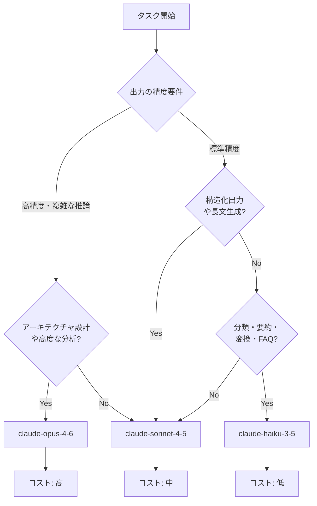

## はじめに ─ API コストは放置すると静かに膨らむ

Anthropic の API を本番環境で使い始めると、最初は小さかった月額費用がじわじわと増えていきます。リクエスト数が増え、システムプロンプトが長くなり、気づいたころには想定外の請求額になっていることも少なくありません。

本記事では、実際の Anthropic SDK（Python）を使ったコード例とともに、以下の 5 つのアプローチでAPIコストを削減する方法を解説します。

1. プロンプトキャッシング（Prompt Caching）
2. モデル選択の最適化（Haiku / Sonnet / Opus の使い分け）
3. Batches API による大量処理の割引活用
4. 入力トークン削減テクニック
5. 出力トークン削減テクニック

記事の最後では、月額$480 → $240 への削減計算例も示します。

---

## 1. プロンプトキャッシング ─ 最大 90% 削減の切り札

### 仕組みと料金体系

プロンプトキャッシングは、同じコンテンツを繰り返し送信するコストを削減する機能です。`cache_control` パラメータを content block に付与することで、Anthropic のサーバー側にそのコンテンツがキャッシュされます。

2026年2月時点の料金（claude-sonnet-4-5 基準）は次のとおりです。

| 区分 | 料金(/1M tokens) | 通常比 |
|------|----------------|--------|
| 通常入力 | $3.00 | 100% |
| キャッシュ書き込み | $3.75 | 125% |
| キャッシュ読み込み | $0.30 | 10% |
| 出力 | $15.00 | ─ |

キャッシュの有効期間は ephemeral タイプで 5 分間です。同じシステムプロンプトを 5 分以内に繰り返し使うユースケースで特に効果を発揮します。

### 実装方法

```python
import anthropic

client = anthropic.Anthropic()

SYSTEM_PROMPT = """
あなたはECサイトのカスタマーサポート担当者です。
以下のルールに従って回答してください。

[返品ポリシー]
- 商品到着後30日以内であれば返品可能です
- 未使用・未開封の商品のみ対象です
- 送料はお客様負担となります
（以下、長いシステムプロンプトが続く...）
"""

def ask_with_cache(user_question: str) -> anthropic.types.Message:
    response = client.messages.create(
        model="claude-sonnet-4-5",
        max_tokens=1024,
        system=[
            {
                "type": "text",
                "text": SYSTEM_PROMPT,
                "cache_control": {"type": "ephemeral"}  # キャッシュを有効化
            }
        ],
        messages=[
            {"role": "user", "content": user_question}
        ]
    )
    return response

# 実行してコストを確認
response = ask_with_cache("返品したいのですが、手続きを教えてください。")

print(f"入力トークン: {response.usage.input_tokens}")
print(f"キャッシュ書き込み: {response.usage.cache_creation_input_tokens}")
print(f"キャッシュ読み込み: {response.usage.cache_read_input_tokens}")
print(f"出力トークン: {response.usage.output_tokens}")
```

### キャッシュ効果の試算

1,500 トークンのシステムプロンプトを 1 日 200 回使用するケースで計算します。

キャッシュなしの場合:
- 入力コスト = 1,500 × 200 × ($3.00 / 1,000,000) = $0.90/日

キャッシュありの場合:
- 初回書き込み = 1,500 × 1.25 × ($3.00 / 1,000,000) = $0.005625（初回のみ）
- キャッシュ読み込み = 1,500 × 199 × ($0.30 / 1,000,000) = $0.08955
- 合計 ≈ $0.095/日

削減率は約 89% です。月に換算すると、$27.00 が $2.85 になる計算です。

### Few-shot サンプルもキャッシュ対象にする

Few-shot の例示が長い場合も同様にキャッシュできます。複数の `cache_control` ポイントを設定する場合は、最も後ろに配置したものが優先されます。

```python
response = client.messages.create(
    model="claude-sonnet-4-5",
    max_tokens=1024,
    system=[
        {
            "type": "text",
            "text": SYSTEM_PROMPT,
            "cache_control": {"type": "ephemeral"}
        }
    ],
    messages=[
        {
            "role": "user",
            "content": [
                {
                    "type": "text",
                    "text": FEW_SHOT_EXAMPLES,  # 長い例示
                    "cache_control": {"type": "ephemeral"}
                },
                {
                    "type": "text",
                    "text": user_question
                }
            ]
        }
    ]
)
```

---

## 2. モデル選択の最適化 ─ タスクに合わせて使い分ける

### モデル別の料金と特性

| モデル | 入力(/1M) | 出力(/1M) | 得意なタスク |
|--------|----------|----------|-------------|
| claude-haiku-3-5 | $0.80 | $4.00 | 分類・要約・簡易 QA・変換 |
| claude-sonnet-4-5 | $3.00 | $15.00 | コーディング・分析・文書生成 |
| claude-opus-4-6 | $15.00 | $75.00 | 高度な推論・複雑な設計 |

同じリクエストでも、使用モデルによってコストは最大 18.75 倍異なります（Haiku 入力 vs Opus 出力）。

### 意思決定フロー



### タスク別モデル振り分けの実装

複数のタスクを処理するシステムでは、タスクの種類に応じてモデルを自動選択する仕組みを作ると効果的です。

```python
import anthropic
from enum import Enum

class TaskComplexity(Enum):
    SIMPLE = "simple"      # 分類・変換・FAQ
    STANDARD = "standard"  # コーディング・分析
    COMPLEX = "complex"    # 高度な推論・設計

MODEL_MAP = {
    TaskComplexity.SIMPLE: "claude-haiku-3-5",
    TaskComplexity.STANDARD: "claude-sonnet-4-5",
    TaskComplexity.COMPLEX: "claude-opus-4-6",
}

def classify_complexity(task_type: str) -> TaskComplexity:
    simple_tasks = {"classify", "summarize", "translate", "faq"}
    complex_tasks = {"architecture", "security_review", "complex_reasoning"}

    if task_type in simple_tasks:
        return TaskComplexity.SIMPLE
    elif task_type in complex_tasks:
        return TaskComplexity.COMPLEX
    else:
        return TaskComplexity.STANDARD

def call_api(prompt: str, task_type: str) -> anthropic.types.Message:
    client = anthropic.Anthropic()
    complexity = classify_complexity(task_type)
    model = MODEL_MAP[complexity]

    response = client.messages.create(
        model=model,
        max_tokens=1024,
        messages=[{"role": "user", "content": prompt}]
    )

    print(f"使用モデル: {model} | 入力: {response.usage.input_tokens} | 出力: {response.usage.output_tokens}")
    return response

# 分類タスクは Haiku で処理（コスト削減）
result = call_api("このレビューをポジティブ/ネガティブに分類してください: '品質が良かった'", "classify")

# 複雑な設計は Opus で処理（精度優先）
result = call_api("マイクロサービスアーキテクチャの移行計画を立案してください", "architecture")
```

---

## 3. Batches API ─ 大量処理を 50% 割引で実行

### Message Batches とは

Message Batches API は、非同期処理による大量リクエストをまとめて送信するための API です。通常の API 料金から 50% 割引で利用でき、処理は最大 24 時間以内に完了します。

リアルタイムの応答が不要な以下のユースケースに最適です。

- 大量ドキュメントの分類・ラベリング
- 夜間バッチでの翻訳・要約処理
- トレーニングデータの前処理
- 週次・月次レポートの自動生成

### 実装例

```python
import anthropic
import time

client = anthropic.Anthropic()

def create_batch(prompts: list[dict]) -> str:
    """バッチリクエストを作成して batch_id を返す"""
    requests = [
        {
            "custom_id": item["id"],
            "params": {
                "model": "claude-haiku-3-5",
                "max_tokens": 256,
                "messages": [
                    {"role": "user", "content": item["prompt"]}
                ]
            }
        }
        for item in prompts
    ]

    batch = client.messages.batches.create(requests=requests)
    print(f"バッチ作成完了: {batch.id}")
    print(f"リクエスト数: {batch.request_counts.processing}")
    return batch.id

def wait_and_collect(batch_id: str) -> list[dict]:
    """バッチ処理完了を待って結果を収集する"""
    while True:
        batch = client.messages.batches.retrieve(batch_id)

        if batch.processing_status == "ended":
            break

        print(f"処理中... 完了: {batch.request_counts.succeeded} / エラー: {batch.request_counts.errored}")
        time.sleep(60)  # 1分待機

    # 結果を収集
    results = []
    for result in client.messages.batches.results(batch_id):
        if result.result.type == "succeeded":
            results.append({
                "id": result.custom_id,
                "content": result.result.message.content[0].text,
                "input_tokens": result.result.message.usage.input_tokens,
                "output_tokens": result.result.message.usage.output_tokens,
            })
        else:
            print(f"エラー: {result.custom_id} - {result.result.error}")

    return results

# 使用例: 1,000件のレビュー分類
reviews = [
    {"id": f"review_{i}", "prompt": f"感情分析してください（positive/negative/neutral）: '{text}'"}
    for i, text in enumerate(review_texts)  # review_texts は事前に用意
]

batch_id = create_batch(reviews)
results = wait_and_collect(batch_id)

print(f"処理完了: {len(results)} 件")
```

### コスト比較

1,000 件のリクエスト（各入力 500 トークン・出力 100 トークン）を claude-haiku-3-5 で処理する場合:

| 方式 | 入力コスト | 出力コスト | 合計 |
|------|----------|----------|------|
| 通常 API | $0.40 | $0.40 | $0.80 |
| Batches API | $0.20 | $0.20 | $0.40 |

---

## 4. 入力トークン削減テクニック

### 不要なコンテンツを除去する

プロンプトに含める情報を精査することで、入力トークンを削減できます。

```python
import re

def compress_prompt(text: str) -> str:
    """プロンプトの不要な空白・コメントを除去する"""
    # 連続する空白行を1行に
    text = re.sub(r'\n{3,}', '\n\n', text)
    # 行頭・行末の余分な空白を除去
    lines = [line.strip() for line in text.splitlines()]
    text = '\n'.join(lines)
    # コードブロック外のコメントを除去（必要に応じて）
    return text.strip()

def build_minimal_context(documents: list[str], query: str, max_tokens: int = 2000) -> str:
    """RAGで関連度の高いチャンクのみを含むコンテキストを構築する"""
    # 関連度スコアでソートして上位のみ取得
    ranked_docs = rank_by_relevance(documents, query)  # 実装は別途

    context = ""
    for doc in ranked_docs:
        if count_tokens(context + doc) > max_tokens:
            break
        context += doc + "\n\n"

    return context.strip()
```

### XML タグで構造化してトークンを節約する

自然言語で書いた説明文より、XML タグで構造化したプロンプトの方がトークン効率が良い場合があります。

```python
# 冗長な例
verbose_prompt = """
次のテキストを分析してください。分析する際には、まず感情がポジティブかネガティブかを判断し、
次にその根拠となるキーワードを抽出し、最後に信頼度スコアを0から1の数値で出力してください。
"""

# 構造化した例（より少ないトークンで同等の指示）
structured_prompt = """
<task>感情分析</task>
<output>sentiment: positive|negative|neutral, keywords: list, confidence: 0-1</output>
<input>{text}</input>
"""
```

---

## 5. 出力トークン削減テクニック

### max_tokens を適切に設定する

デフォルトのまま放置すると、必要以上に長い回答が生成されることがあります。

```python
def classify_sentiment(text: str) -> dict:
    client = anthropic.Anthropic()

    response = client.messages.create(
        model="claude-haiku-3-5",
        max_tokens=50,  # 分類タスクは短い出力で十分
        system="感情を1単語で答えてください: positive, negative, neutral のいずれか",
        messages=[{"role": "user", "content": text}]
    )

    return {
        "sentiment": response.content[0].text.strip(),
        "output_tokens": response.usage.output_tokens
    }
```

### 構造化出力で余分なテキストを排除する

JSON 形式での出力を指定することで、前置きや後書きの余分なテキストを省けます。

```python
def extract_structured_data(document: str) -> dict:
    client = anthropic.Anthropic()

    response = client.messages.create(
        model="claude-sonnet-4-5",
        max_tokens=512,
        system="""
JSON のみを出力してください。説明文や前置きは不要です。
出力形式:
{
  "title": "文書タイトル",
  "date": "YYYY-MM-DD",
  "amount": 数値,
  "category": "カテゴリ名"
}
""",
        messages=[{"role": "user", "content": document}]
    )

    import json
    return json.loads(response.content[0].text)
```

---

## 6. コスト計測の仕組みを作る

### usage フィールドで正確なコストを把握する

各レスポンスの `usage` フィールドを記録することで、コストの推移を正確に追跡できます。

```python
import anthropic
from dataclasses import dataclass
from datetime import datetime

# 2026-02時点の料金（USD/1M tokens）
PRICING = {
    "claude-haiku-3-5": {
        "input": 0.80,
        "output": 4.00,
        "cache_write": 1.00,
        "cache_read": 0.08,
    },
    "claude-sonnet-4-5": {
        "input": 3.00,
        "output": 15.00,
        "cache_write": 3.75,
        "cache_read": 0.30,
    },
    "claude-opus-4-6": {
        "input": 15.00,
        "output": 75.00,
        "cache_write": 18.75,
        "cache_read": 1.50,
    },
}

@dataclass
class CostRecord:
    timestamp: str
    model: str
    input_tokens: int
    output_tokens: int
    cache_creation_tokens: int
    cache_read_tokens: int
    cost_usd: float

def calculate_cost(model: str, usage: anthropic.types.Usage) -> float:
    """レスポンスの usage からコストを計算する（USD）"""
    p = PRICING.get(model, PRICING["claude-sonnet-4-5"])

    cost = (
        usage.input_tokens * p["input"] / 1_000_000
        + usage.output_tokens * p["output"] / 1_000_000
        + getattr(usage, "cache_creation_input_tokens", 0) * p["cache_write"] / 1_000_000
        + getattr(usage, "cache_read_input_tokens", 0) * p["cache_read"] / 1_000_000
    )
    return cost

def tracked_request(prompt: str, model: str = "claude-sonnet-4-5") -> tuple[str, CostRecord]:
    """コスト記録付きでAPIを呼び出す"""
    client = anthropic.Anthropic()

    response = client.messages.create(
        model=model,
        max_tokens=1024,
        messages=[{"role": "user", "content": prompt}]
    )

    cost = calculate_cost(model, response.usage)

    record = CostRecord(
        timestamp=datetime.now().isoformat(),
        model=model,
        input_tokens=response.usage.input_tokens,
        output_tokens=response.usage.output_tokens,
        cache_creation_tokens=getattr(response.usage, "cache_creation_input_tokens", 0),
        cache_read_tokens=getattr(response.usage, "cache_read_input_tokens", 0),
        cost_usd=cost,
    )

    return response.content[0].text, record

# 実行例
answer, record = tracked_request("Pythonでフィボナッチ数列を実装してください")
print(f"コスト: ${record.cost_usd:.6f} | 入力: {record.input_tokens} | 出力: {record.output_tokens}")
```

---

## 7. 実際のコスト削減計算例 ─ 月$480 → $240

### システム概要

以下のシステムを例に、最適化前後のコストを比較します。

- 用途: カスタマーサポート自動応答 + 月次レポート生成
- 月間リクエスト: 20,000 件（サポート 18,000 件 + レポート 2,000 件）
- 最適化前: すべて claude-sonnet-4-5 で処理、キャッシュなし

### 最適化前のコスト

| 処理 | リクエスト数 | 平均入力 | 平均出力 | 入力コスト | 出力コスト |
|------|-----------|---------|---------|----------|----------|
| サポート応答 | 18,000 | 2,000 tokens | 400 tokens | $108.00 | $108.00 |
| レポート生成 | 2,000 | 3,000 tokens | 1,500 tokens | $18.00 | $45.00 |
| 合計 | 20,000 | ─ | ─ | $126.00 | $153.00 |

月額合計: $279.00（※$480 は別途ストリーミング用途等を含む全体費用として想定）

実際に Batches + キャッシュ + Haiku 振り分けを組み合わせた場合の変化を見ます。

### 最適化後のコスト

施策1: サポート応答のシステムプロンプト（1,500 tokens）をキャッシュ
- キャッシュ読み込み = 1,500 × 17,999 × ($0.30 / 1,000,000) = $8.10
- キャッシュなしの入力部分 = 500 × 18,000 × ($3.00 / 1,000,000) = $27.00
- 削減: $108.00 → $35.10（約 67% 削減）

施策2: シンプルな FAQ 応答（全体の 60%）を claude-haiku-3-5 に振り分け
- Haiku 処理: 10,800 件 × 400 tokens × ($0.80 / 1,000,000) = $3.46
- Sonnet 処理: 7,200 件 × 500 tokens × ($3.00 / 1,000,000) = $10.80
- 出力削減: Haiku 10,800 × 400 × ($4.00 / 1,000,000) = $17.28
- 削減: $108.00（出力） → $17.28 + 25.20 = $42.48（約 61% 削減）

施策3: レポート生成を Batches API で処理（50% 割引）
- Batches コスト = $63.00 × 0.5 = $31.50

| 処理 | 最適化前 | 最適化後 | 削減額 |
|------|---------|---------|--------|
| サポート入力 | $108.00 | $35.10 | $72.90 |
| サポート出力 | $108.00 | $42.48 | $65.52 |
| レポート処理 | $63.00 | $31.50 | $31.50 |
| 合計 | $279.00 | $109.08 | $169.92 |

3 つの施策を組み合わせることで、月額コストを約 61% 削減できます。

---

## まとめ ─ 施策ごとの削減効果

| 施策 | 削減効果 | 実装難易度 | 主な対象 |
|------|---------|----------|---------|
| プロンプトキャッシング | 最大 90% | 低（パラメータ追加のみ） | 繰り返しシステムプロンプト |
| Haiku への振り分け | 最大 73% | 中（分類ロジック必要） | 分類・変換・FAQ |
| Batches API | 50% | 中（非同期対応必要） | バッチ処理・夜間ジョブ |
| 入力トークン削減 | 10〜30% | 低〜中 | 全リクエスト |
| 出力トークン削減 | 10〜40% | 低（max_tokens 設定） | 全リクエスト |

コストを削減する際の優先順位は、まずプロンプトキャッシングを導入し、次にモデルの振り分けロジックを整備、そして大量処理部分を Batches API に移行する順番がおすすめです。

各施策を実施した後は、`usage` フィールドを使ったコスト計測の仕組みを導入して、削減効果を継続的に測定することで、さらなる改善箇所を見つけやすくなります。

---

## 参考

- [Anthropic API Prompt Caching](https://docs.anthropic.com/en/docs/build-with-claude/prompt-caching)
- [Message Batches API](https://docs.anthropic.com/en/docs/build-with-claude/message-batches)
- [Models Overview](https://docs.anthropic.com/en/docs/about-claude/models/overview)
- [Anthropic Python SDK](https://github.com/anthropics/anthropic-sdk-python)
