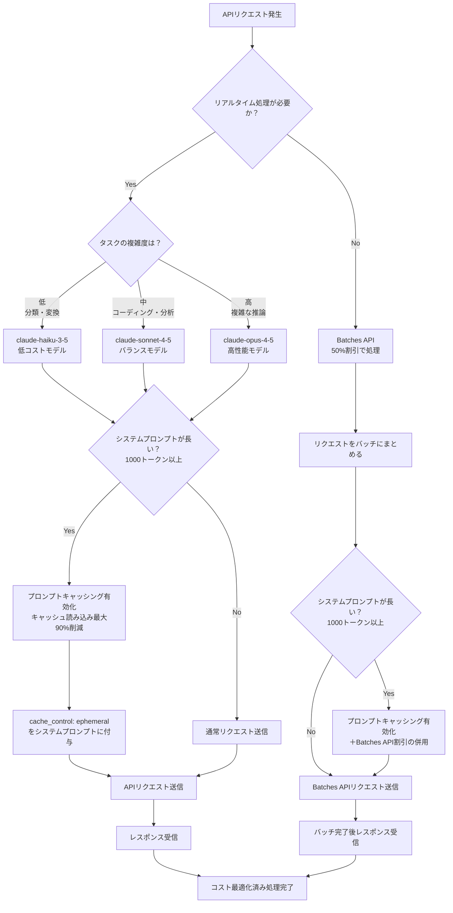
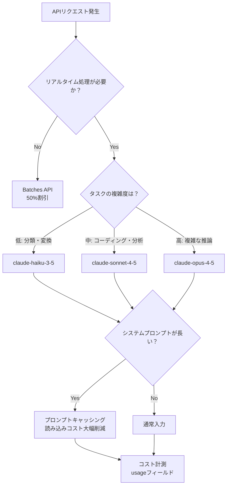
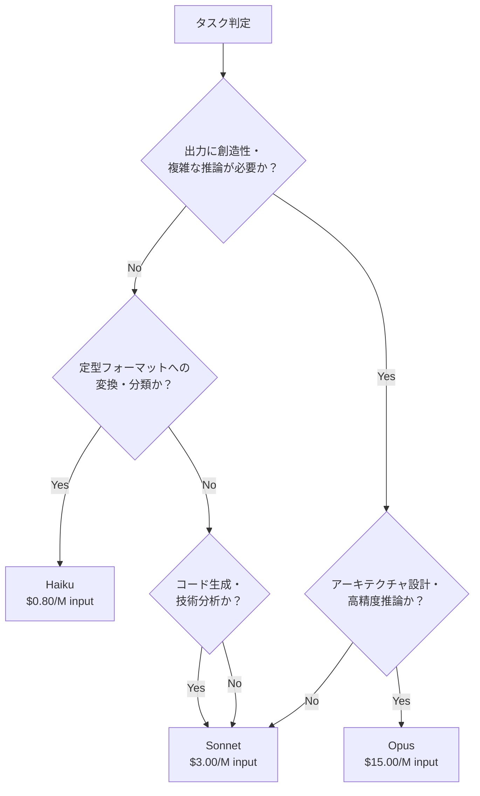

## はじめに

Anthropic APIを本番環境で使い続けていると、月額コストが思いのほか膨らんでいることに気づきます。「機能は動いているが、コストが予算を超えそう」という状況は、個人開発者から1人法人経営者まで共通の悩みです。

本記事では、以下の3つの主要テクニックを中心に、**月額コストを削減するための具体的な実装パターン**を解説します。ワークロードの構成によって削減率は大きく異なりますが、後述する試算例では各施策で最大50〜90%の削減が得られるケースも確認できます。

- **プロンプトキャッシング**: 繰り返しトークンをキャッシュして読み込み料金を最大90%削減
- **モデル選択の最適化**: タスク特性に応じてモデルを振り分け
- **Batches API**: 非同期処理で一律50%割引

単なる「やってみた」記事ではなく、各施策のROI計算と実装コードをセットで提示します。自分のプロダクトに当てはめながら読み進めてください。

> **対象読者の目安**: 月間APIコールが数千件以上、または月額APIコストが数十ドルを超えている方がコスト削減効果を実感しやすいです。トラフィック規模が小さい場合、削減額は限定的になります。

---

## コスト削減の全体像




最初に、3つのテクニックを組み合わせたときのコスト削減イメージを示します。各施策の詳細な料金は後述の各セクションの料金表を参照してください。



各テクニックは独立して機能しますが、組み合わせることで相乗効果が生まれます。それぞれの実装を順番に見ていきましょう。

---

## テクニック1: プロンプトキャッシング

### 仕組みと料金

プロンプトキャッシングは、**システムプロンプトやFew-shotサンプルなど、リクエストをまたいで繰り返し使うコンテンツをAnthropicサーバー側にキャッシュする機能**です。

`cache_control: {"type": "ephemeral"}` をcontentブロックに付与するだけで有効になります。

キャッシュの有効期間については、**公式ドキュメント（[Prompt caching](https://docs.anthropic.com/en/docs/build-with-claude/prompt-caching)）を必ず参照してください**。`ephemeral` タイプのキャッシュはデフォルトで一定時間保持されますが、アクティブな利用状況によって延長される場合があります。本記事執筆時点の最新仕様では5分程度とされていますが、Anthropicの公式ドキュメントで最新情報を確認することを強く推奨します。

料金は本記事執筆時点の最新モデル（claude-sonnet-4-5）基準で以下のとおりです。執筆時点の公式料金ページの値を掲載していますが、最新料金は[公式料金ページ](https://www.anthropic.com/pricing)で確認してください。

| 種別 | 料金 (/1M tokens) | 通常比 |
|------|-----------------|--------|
| 通常入力 | $3.00 | — |
| キャッシュ書き込み | $3.75 | 通常の125%（25%割増） |
| キャッシュ読み込み | $0.30 | 通常の10%（90%引き） |

初回リクエストだけキャッシュ書き込みコスト（25%割増）が発生しますが、2回目以降はキャッシュ読み込み（通常の10%）になります。

### 削減効果の試算

1,000トークンのシステムプロンプトを100回使用する場合を計算します（概算値）。

**キャッシュなし**
```
1,000 tokens × 100回 = 100,000 tokens
100,000 × $3.00/M ≈ $0.30
```

**キャッシュあり**
```
書き込み: 1,000 tokens × 1回 → 1,000 × $3.75/M ≈ $0.0038
読み込み: 1,000 tokens × 99回 = 99,000 tokens → 99,000 × $0.30/M ≈ $0.030
合計: ≈ $0.034
```

**削減率: 約89%**

システムプロンプトが長いほど、リクエスト数が多いほど、削減効果は大きくなります。

### 実装コード

```python
import anthropic

client = anthropic.Anthropic()

# 長いシステムプロンプトをキャッシュする例
SYSTEM_PROMPT = """
あなたは技術ドキュメントの専門家です。
以下のルールに従って回答してください：
（... 1,000トークン相当の詳細な指示 ...）
"""

def call_with_cache(user_message: str) -> anthropic.types.Message:
    try:
        response = client.messages.create(
            model="claude-sonnet-4-5",  # 本記事執筆時点の最新モデルを使用
            max_tokens=1024,
            system=[
                {
                    "type": "text",
                    "text": SYSTEM_PROMPT,
                    "cache_control": {"type": "ephemeral"}  # ← キャッシュを有効化
                }
            ],
            messages=[
                {"role": "user", "content": user_message}
            ]
        )
        return response
    except anthropic.APIError as e:
        print(f"APIエラーが発生しました: {e}")
        raise

# usageでキャッシュの効果を確認
# ※ SDKのバージョンによって属性名が変わる場合があります。
# ※ `pip show anthropic` でバージョンを確認してください。
response = call_with_cache("Pythonの型ヒントについて説明してください")

print(f"通常入力トークン:       {response.usage.input_tokens}")
print(f"キャッシュ書き込みトークン: {response.usage.cache_creation_input_tokens}")
print(f"キャッシュ読み込みトークン: {response.usage.cache_read_input_tokens}")
print(f"出力トークン:           {response.usage.output_tokens}")
```

**出力例（2回目以降のリクエスト）**
```
通常入力トークン:          50
キャッシュ書き込みトークン:   0
キャッシュ読み込みトークン: 1000
出力トークン:            320
```

`cache_read_input_tokens` に値が入っていれば、キャッシュが正常にヒットしています。

### Few-shotサンプルをキャッシュする例

システムプロンプトだけでなく、Few-shotサンプルにもキャッシュを適用できます。

> **前提条件**: 以下のコードでキャッシュがヒットするためには、キャッシュ対象のコンテンツブロック（Few-shotサンプル部分）が前回のリクエストと完全に一致している必要があります。ユーザーごとに異なる会話履歴を持つ場合はキャッシュがヒットしないため、Few-shotを固定のプレフィックスとして配置するユースケースに限定して使用してください。

```python
def call_with_fewshot_cache(user_message: str) -> anthropic.types.Message:
    try:
        response = client.messages.create(
            model="claude-sonnet-4-5",  # 本記事執筆時点の最新モデルを使用
            max_tokens=512,
            messages=[
                # Few-shotサンプル（繰り返し使う部分）
                {
                    "role": "user",
                    "content": [
                        {
                            "type": "text",
                            "text": "感情分析の例:\n入力: '今日は最高の天気です'\n出力: {\"sentiment\": \"positive\", \"score\": 0.95}",
                            "cache_control": {"type": "ephemeral"}  # キャッシュ対象
                        }
                    ]
                },
                {
                    "role": "assistant",
                    "content": "了解しました。同じ形式で分析します。"
                },
                # 実際のユーザー入力（毎回変わる部分）
                {
                    "role": "user",
                    "content": user_message
                }
            ]
        )
        return response
    except anthropic.APIError as e:
        print(f"APIエラーが発生しました: {e}")
        raise
```

> **注意点**: キャッシュの有効期間については冒頭の説明および[公式ドキュメント](https://docs.anthropic.com/en/docs/build-with-claude/prompt-caching)を参照してください。キャッシュが失効した場合は次回リクエスト時にキャッシュ書き込みが再発生します。高頻度リクエストのユースケースに最も効果的です。

---

## テクニック2: モデル選択の最適化

### モデル別料金と特性

3つのモデルの料金と適した用途を整理します（本記事執筆時点。最新料金は[公式料金ページ](https://www.anthropic.com/pricing)を参照）。

| モデル | 入力 (/1M) | 出力 (/1M) | 主な用途 |
|--------|-----------|-----------|---------|
| claude-haiku-3-5 | $0.80 | $4.00 | 分類・要約・簡易QA |
| claude-sonnet-4-5 | $3.00 | $15.00 | コーディング・データ分析・技術文書 |
| claude-opus-4-5 | $15.00 | $75.00 | 複雑な推論・高精度分析 |

Haikuを使うと、Sonnet比で**入力コストが約73%削減**されます。Opusが必要な場面は限定されますが、Haikuで代替できるタスクを正確に見極めることがコスト削減の鍵です。

### モデルの品質トレードオフについて

コスト削減のためにモデルをダウングレードする場合、品質トレードオフを事前に評価することが重要です。

**Sonnetで十分なケースをOpusで運用していた例（Opusが不要だったケース）**
- 定型的なコードのフォーマット・Lint指摘
- 決まったスキーマへのJSON変換
- キーワード抽出・タグ付け

**Opusが明確に必要だったケース**
- 複数の法的制約を同時に考慮した契約書レビュー
- 複雑なシステム設計のトレードオフ分析
- 多段階の数学的推論を含む問題解決

モデルの品質評価には、タスクに特化した評価セット（ゴールデンセット）を用意し、正解率・F1スコアなどの指標で比較することを推奨します。「とりあえずOpusを使う」のではなく、まずSonnetで品質評価を行い、閾値を下回った場合にOpusへ切り替えるアプローチが現実的です。

### タスク別振り分けの判断基準



**Haikuが適したタスク（例）**
- テキストの感情分析（positive/negative/neutral）
- カテゴリ分類（問い合わせ種別の振り分けなど）
- 定型フォーマットへの変換（住所の正規化など）
- シンプルなFAQ応答

**Sonnetが適したタスク（例）**
- コードのレビューや生成
- データ