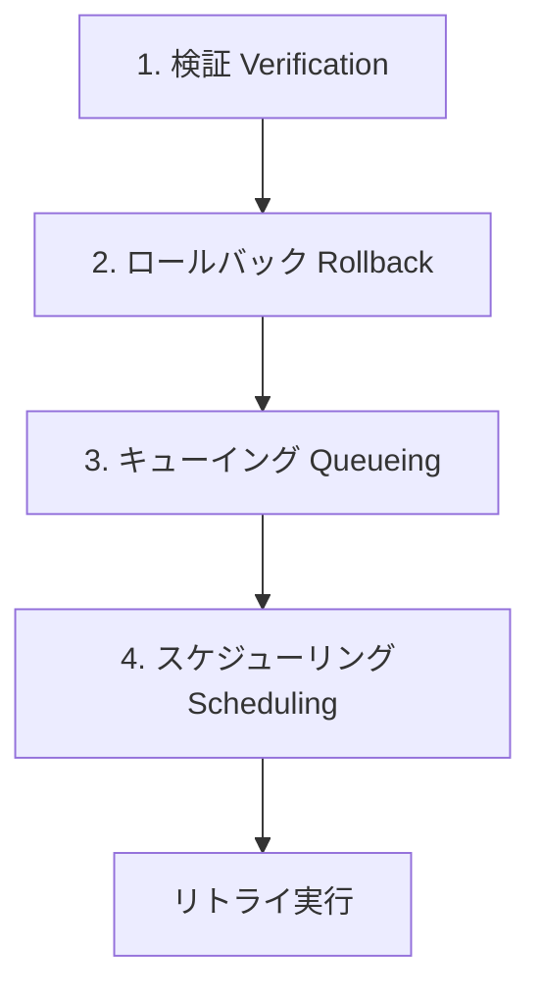

---
title:" "APIレートリミット対策の設計パターン — 自動リトライ機構の実装""
emoji: "🔄"
type: "tech"
topics: ["api", "githubactions", "python", "automation", "errorhandling"]
published: true
publication_name: "correlate_dev"
---

## はじめに — APIレートリミットは誰もが直面する問題

APIを利用した自動化を実装していると、必ず直面するのが**レートリミット（Rate Limit）**です。

レートリミットとは、一定時間内に実行できるAPIリクエスト数の上限のことです。サービス提供側がサーバー負荷を管理し、公平なリソース分配を実現するために設定されています。

### レートリミットの種類

主なレートリミットの種類は以下の3つです。

| 種類 | 説明 | 例 |
|------|------|-----|
| **時間あたり制限** | 1時間あたりのリクエスト数上限 | GitHub API: 5,000/時（認証済み） |
| **日あたり制限** | 1日あたりのリクエスト数上限 | Twitter API: 50ツイート/日（Free Tier） |
| **ローリングウィンドウ** | 直近N時間の累積リクエスト数 | Zenn: 直近24時間で5本まで投稿可能 |

### レートリミット超過時の影響

レートリミットを超えると、以下のような問題が発生します。

- **処理の中断**: APIリクエストが `429 Too Many Requests` エラーで拒否される
- **データ損失**: 投稿予定だったコンテンツが公開されない
- **ユーザー体験の悪化**: Bot応答遅延、通知の遅れ
- **アカウント停止リスク**: 頻繁な超過でアカウントBANの可能性

### この記事で学べること

本記事では、実際に私が遭遇したZenn自動投稿の失敗事例を元に、**4ステップの設計パターン**で自動リトライ機構を実装する方法を解説します。

- ✅ レートリミット失敗を自動検知する仕組み
- ✅ 失敗した処理をロールバックする方法
- ✅ リトライキューの設計パターン
- ✅ 既存スケジュールと競合しないリトライアルゴリズム
- ✅ GitHub Actionsでの自動化実装

実装例はPythonですが、考え方はどの言語・どのAPIにも応用できます。

---

## 実例：Zennで8本の記事が消えた日

### 何が起きたのか

2026年2月14日、私は8本のZenn記事を予約公開しました。GitHub Actionsのcronで自動投稿する設定で、`published_at`に同じ時刻を設定していました。

しかし、**8本すべてがZennに公開されませんでした**。

### 問題の深刻さ

ローカルのMarkdownファイルでは以下のように設定されていました。

```yaml
published: true
```

GitHub Actions上でも「デプロイ成功」と表示されていましたが、実際にZenn上で記事を確認すると**404 Not Found**でした。

つまり、**ローカルとGitHubでは公開済み、Zenn上では未公開**という不整合状態に陥りました。

### 原因：24時間ローリングウィンドウの罠

Zennのレートリミット仕様を調査したところ、以下のルールが判明しました。

> Zennでは一定時間あたりの投稿数に上限があります。直近24時間以内に5本以上投稿すると、それ以降の投稿がブロックされます。
>
> — [Zenn FAQ - レートリミット](https://zenn.dev/faq)

私は8本すべてに同じ`published_at`を設定していたため、**8本が同時にデプロイ対象になり、レートリミットで全件ブロック**されたのです。

さらに問題だったのは、**デプロイログに何のエラーも出力されなかった**ことです。

```
次の記事は投稿数の上限に達したためデプロイされませんでした:
article-1, article-2, article-3, article-4, article-5, article-6, article-7, article-8
```

このメッセージが出たのはデプロイ後のログ末尾で、GitHub Actionsの実行結果は**成功ステータス**のままでした。

### 失敗を放置するとどうなるか

この状態を放置すると、次のような問題が発生します。

1. **ローカルとZennの状態不整合**
   - ローカル: `published: true`
   - Zenn: 未公開（404）

2. **再実行できない**
   - `published: true`のままなので、再度デプロイしても何も起きない

3. **手動修正が必要**
   - 8本すべてを手動で`published: false`に戻す
   - `published_at`を再設定する
   - Git commitして再デプロイ

この手動作業は**エラーの温床**であり、特に記事数が多い場合は見落としが発生します。

---

## レートリミット対策の4ステップ設計パターン

レートリミット失敗を自動で回復するには、以下の4ステップが必要です。



それぞれのステップを詳しく見ていきます。

### 3.1 検証（Verification）

**目的**: APIリクエストが実際に成功したかを確認する

GitHub Actionsやデプロイツールが「成功」と報告しても、実際にAPI側で処理が完了しているとは限りません。

**検証方法**:
1. APIエンドポイントに直接アクセスして確認
2. HTTPステータスコード（200/404）をチェック
3. ローカルの状態と比較

**実装例**:

```python
import requests
from typing import Optional

def check_published_on_zenn(slug: str, username: str = "correlate") -> bool:
    """Zennで実際に公開されているか確認"""
    url = f"https://zenn.dev/{username}/articles/{slug}"
    try:
        response = requests.head(url, timeout=10, allow_redirects=True)
        return response.status_code in [200, 301]
    except requests.RequestException:
        return False
```

**ポイント**:
- `HEAD`リクエストで軽量にチェック（レスポンスボディ不要）
- タイムアウト設定で無限待ちを防ぐ
- リダイレクト（301）も成功扱い

### 3.2 ロールバック（Rollback）

**目的**: 失敗した状態を元に戻す

検証で失敗が確認された場合、ローカルの状態を「未公開」に戻します。これにより、次回のデプロイで再度処理対象になります。

**実装例**:

```python
import re
from pathlib import Path

def rollback_published_flag(file_path: Path):
    """published: true → false にロールバック"""
    content = file_path.read_text(encoding="utf-8")

    # published: true → false に変更
    updated = re.sub(
        r'^published:\s*true',
        'published: false',
        content,
        flags=re.MULTILINE
    )

    # published_at も削除（Zennの仕様: published: false + published_at は不正）
    updated = re.sub(
        r'^published_at:.*\n',
        '',
        updated,
        flags=re.MULTILINE
    )

    file_path.write_text(updated, encoding="utf-8")
```

**ポイント**:
- `published: true` → `published: false` だけでなく、`published_at`も削除
- Zennの仕様では、`published: false` + `published_at`の組み合わせはエラーになる
- 正規表現で確実に置換

**注意**: ロールバック後は必ずGit commitが必要です。

```python
import subprocess

def commit_rollback(files: list[Path], message: str = "Rollback failed articles"):
    """ロールバックをコミット"""
    subprocess.run(["git", "add"] + [str(f) for f in files], check=True)
    subprocess.run(["git", "commit", "-m", message], check=True)
    subprocess.run(["git", "push"], check=True)
```

### 3.3 キューイング（Queueing）

**目的**: 失敗したアイテムを記録し、リトライ対象として管理する

単にロールバックするだけでは、次回デプロイでまた同じエラーが発生します。リトライキューに記録することで、**適切なタイミングで再実行**できます。

**キュー設計**:

```json
{
  "queue": [
    {
      "slug": "article-1",
      "file_path": "articles/article-1.md",
      "failed_at": "2026-02-14T08:00:00Z",
      "retry_count": 0,
      "reason": "rate_limit"
    },
    {
      "slug": "article-2",
      "file_path": "articles/article-2.md",
      "failed_at": "2026-02-14T08:00:00Z",
      "retry_count": 0,
      "reason": "rate_limit"
    }
  ]
}
```

**実装例**:

```python
import json
from datetime import datetime
from pathlib import Path

QUEUE_FILE = Path(".zenn-retry-queue.json")

def add_to_retry_queue(slug: str, file_path: Path, reason: str = "rate_limit"):
    """失敗したアイテムをキューに追加"""
    queue_data = load_queue()

    # 既にキューに存在する場合はスキップ
    if any(item["slug"] == slug for item in queue_data["queue"]):
        return

    queue_data["queue"].append({
        "slug": slug,
        "file_path": str(file_path),
        "failed_at": datetime.utcnow().isoformat() + "Z",
        "retry_count": 0,
        "reason": reason,
    })

    save_queue(queue_data)

def load_queue() -> dict:
    """キューファイルを読み込み"""
    if not QUEUE_FILE.exists():
        return {"queue": []}
    return json.loads(QUEUE_FILE.read_text(encoding="utf-8"))

def save_queue(data: dict):
    """キューファイルを保存"""
    QUEUE_FILE.write_text(json.dumps(data, indent=2, ensure_ascii=False), encoding="utf-8")
```

**ポイント**:
- JSONファイルで永続化（軽量で管理しやすい）
- `retry_count`でリトライ回数を追跡
- `reason`でエラー種別を記録（デバッグに有用）

### 3.4 スケジューリング（Scheduling）

**目的**: リトライ実行時に既存スケジュールと競合しないようにする

リトライキューから取り出して即座に実行すると、**また同じレートリミットエラーが発生**します。

既存の予約投稿スケジュールを確認し、**空いているスロット**を見つけて再予約する必要があります。

**アルゴリズム**:

```python
import re
from datetime import datetime, timedelta
from pathlib import Path

ARTICLES_DIR = Path("articles")

def get_existing_scheduled_times() -> set:
    """既存記事のpublished_atを取得（競合チェック用）"""
    scheduled_times = set()

    for article_file in ARTICLES_DIR.glob("*.md"):
        content = article_file.read_text(encoding="utf-8")
        match = re.search(r'^published_at:\s*["\']?([^"\']+)["\']?', content, re.MULTILINE)
        if match:
            scheduled_times.add(match.group(1).strip())

    return scheduled_times

def calculate_next_slots(count: int, start_time: datetime = None) -> list[str]:
    """次の公開スロットを計算（既存記事と競合しないように）"""
    if start_time is None:
        start_time = datetime.now() + timedelta(hours=1)

    existing_times = get_existing_scheduled_times()
    slots = []
    current = start_time

    # 24時間に5本ルールを遵守
    # 1日を3つのスロットに分割: 08:00, 12:30, 19:00
    time_slots_per_day = [
        {"hour": 8, "minute": 0},
        {"hour": 12, "minute": 30},
        {"hour": 19, "minute": 0},
    ]

    while len(slots) < count:
        for slot_time in time_slots_per_day:
            candidate = current.replace(
                hour=slot_time["hour"],
                minute=slot_time["minute"],
                second=0,
                microsecond=0
            )

            # 過去の時刻はスキップ
            if candidate < datetime.now():
                continue

            slot_str = candidate.strftime("%Y-%m-%d %H:%M")

            # 既存スケジュールと重複しないかチェック
            if slot_str not in existing_times:
                slots.append(slot_str)

                if len(slots) >= count:
                    break

        # 次の日へ
        current += timedelta(days=1)

    return slots

def update_published_at(file_path: Path, published_at: str):
    """記事のpublished_atを更新"""
    content = file_path.read_text(encoding="utf-8")

    # published: false → true
    content = re.sub(r'^published:\s*false', 'published: true', content, flags=re.MULTILINE)

    # published_at を追加または更新
    if "published_at:" in content:
        content = re.sub(
            r'^published_at:.*$',
            f'published_at: "{published_at}"',
            content,
            flags=re.MULTILINE
        )
    else:
        # front matterの末尾に追加
        content = re.sub(
            r'^---$',
            f'published_at: "{published_at}"\n---',
            content,
            count=2,  # 2番目の --- に追加
            flags=re.MULTILINE
        )

    file_path.write_text(content, encoding="utf-8")
```

**ポイント**:
- 既存の全記事をスキャンして`published_at`を収集
- 空きスロットのみを選択
- 24時間に5本ルールを遵守（1日3スロット × 複数日）

---

## 実装例：Python + GitHub Actions

これまでの4ステップを統合したワークフローを実装します。

### 4.1 検証スクリプト（zenn-verify-published.py）

```python
#!/usr/bin/env python3
"""
Zenn記事が実際に公開されているか検証し、失敗した記事をロールバック
"""
import sys
import re
import requests
from pathlib import Path
from typing import Optional
import json
from datetime import datetime

ARTICLES_DIR = Path("articles")
QUEUE_FILE = Path(".zenn-retry-queue.json")
USERNAME = "correlate"  # 自分のZennユーザー名

def check_published_on_zenn(slug: str) -> bool:
    """Zennで実際に公開されているか確認"""
    url = f"https://zenn.dev/{USERNAME}/articles/{slug}"
    try:
        response = requests.head(url, timeout=10, allow_redirects=True)
        return response.status_code in [200, 301]
    except requests.RequestException:
        return False

def get_published_articles() -> list[tuple[str, Path]]:
    """published: true の記事を取得"""
    articles = []
    for article_file in ARTICLES_DIR.glob("*.md"):
        content = article_file.read_text(encoding="utf-8")
        if re.search(r'^published:\s*true', content, re.MULTILINE):
            slug = article_file.stem
            articles.append((slug, article_file))
    return articles

def rollback_published_flag(file_path: Path):
    """published: true → false にロールバック"""
    content = file_path.read_text(encoding="utf-8")

    # published: true → false
    updated = re.sub(r'^published:\s*true', 'published: false', content, flags=re.MULTILINE)

    # published_at も削除
    updated = re.sub(r'^published_at:.*\n', '', updated, flags=re.MULTILINE)

    file_path.write_text(updated, encoding="utf-8")

def add_to_retry_queue(slug: str, file_path: Path):
    """リトライキューに追加"""
    queue_data = {"queue": []} if not QUEUE_FILE.exists() else json.loads(QUEUE_FILE.read_text())

    if any(item["slug"] == slug for item in queue_data["queue"]):
        return  # 既に存在

    queue_data["queue"].append({
        "slug": slug,
        "file_path": str(file_path),
        "failed_at": datetime.utcnow().isoformat() + "Z",
        "retry_count": 0,
        "reason": "rate_limit",
    })

    QUEUE_FILE.write_text(json.dumps(queue_data, indent=2, ensure_ascii=False))

def main():
    articles = get_published_articles()
    failed_articles = []

    for slug, file_path in articles:
        if not check_published_on_zenn(slug):
            print(f"❌ Failed: {slug}")
            failed_articles.append((slug, file_path))
        else:
            print(f"✅ Published: {slug}")

    if failed_articles:
        print(f"\n🔄 Rolling back {len(failed_articles)} failed articles...")
        for slug, file_path in failed_articles:
            rollback_published_flag(file_path)
            add_to_retry_queue(slug, file_path)
            print(f"  Rolled back: {slug}")

        # Git commit
        import subprocess
        subprocess.run(["git", "add", str(ARTICLES_DIR)], check=True)
        subprocess.run(["git", "add", str(QUEUE_FILE)], check=True)
        subprocess.run(["git", "commit", "-m", "Rollback failed articles"], check=True)
        subprocess.run(["git", "push"], check=True)
    else:
        print("\n✅ All articles published successfully!")

if __name__ == "__main__":
    main()
```

### 4.2 リトライスクリプト（zenn-retry-failed.py）

```python
#!/usr/bin/env python3
"""
リトライキューから記事を取り出し、空きスロットに再予約
"""
import sys
import re
import json
from pathlib import Path
from datetime import datetime, timedelta

ARTICLES_DIR = Path("articles")
QUEUE_FILE = Path(".zenn-retry-queue.json")
MAX_RETRY = 3  # 最大リトライ回数

def get_existing_scheduled_times() -> set:
    """既存記事のpublished_atを取得"""
    scheduled_times = set()
    for article_file in ARTICLES_DIR.glob("*.md"):
        content = article_file.read_text(encoding="utf-8")
        match = re.search(r'^published_at:\s*["\']?([^"\']+)["\']?', content, re.MULTILINE)
        if match:
            scheduled_times.add(match.group(1).strip())
    return scheduled_times

def calculate_next_slots(count: int) -> list[str]:
    """次の公開スロットを計算"""
    existing_times = get_existing_scheduled_times()
    slots = []
    current = datetime.now() + timedelta(hours=1)

    time_slots_per_day = [
        {"hour": 8, "minute": 0},
        {"hour": 12, "minute": 30},
        {"hour": 19, "minute": 0},
    ]

    max_days = 14  # 2週間先まで検索
    for day_offset in range(max_days):
        check_date = current + timedelta(days=day_offset)
        for slot_time in time_slots_per_day:
            candidate = check_date.replace(
                hour=slot_time["hour"],
                minute=slot_time["minute"],
                second=0,
                microsecond=0
            )

            if candidate < datetime.now():
                continue

            slot_str = candidate.strftime("%Y-%m-%d %H:%M")
            if slot_str not in existing_times:
                slots.append(slot_str)

                if len(slots) >= count:
                    return slots

    return slots

def update_published_at(file_path: Path, published_at: str):
    """記事のpublished_atを更新"""
    content = file_path.read_text(encoding="utf-8")
    content = re.sub(r'^published:\s*false', 'published: true', content, flags=re.MULTILINE)

    if "published_at:" in content:
        content = re.sub(
            r'^published_at:.*$',
            f'published_at: "{published_at}"',
            content,
            flags=re.MULTILINE
        )
    else:
        content = re.sub(r'^(---\n(?:.*\n)*?)---', rf'\1published_at: "{published_at}"\n---', content, count=1)

    file_path.write_text(content, encoding="utf-8")

def main():
    if not QUEUE_FILE.exists():
        print("No retry queue found.")
        return

    queue_data = json.loads(QUEUE_FILE.read_text())
    items = queue_data["queue"]

    if not items:
        print("Retry queue is empty.")
        return

    # リトライ回数超過を除外
    valid_items = [item for item in items if item["retry_count"] < MAX_RETRY]

    if not valid_items:
        print("All items exceeded max retry count.")
        return

    # スロットを計算
    slots = calculate_next_slots(len(valid_items))

    if len(slots) < len(valid_items):
        print(f"⚠️  Only {len(slots)} slots available for {len(valid_items)} items.")

    # 再予約
    updated_files = []
    for item, slot in zip(valid_items, slots):
        file_path = Path(item["file_path"])
        update_published_at(file_path, slot)
        updated_files.append(file_path)
        item["retry_count"] += 1
        print(f"📅 Rescheduled: {item['slug']} → {slot}")

    # キューから削除
    queue_data["queue"] = [item for item in items if item["retry_count"] >= MAX_RETRY]
    QUEUE_FILE.write_text(json.dumps(queue_data, indent=2, ensure_ascii=False))

    # Git commit
    import subprocess
    subprocess.run(["git", "add"] + [str(f) for f in updated_files], check=True)
    subprocess.run(["git", "add", str(QUEUE_FILE)], check=True)
    subprocess.run(["git", "commit", "-m", f"Reschedule {len(updated_files)} articles"], check=True)
    subprocess.run(["git", "push"], check=True)

if __name__ == "__main__":
    main()
```

### 4.3 GitHub Actionsワークフロー

`.github/workflows/publish-with-retry.yml`:

```yaml
name: Publish with Retry

on:
  schedule:
    - cron: '0 */6 * * *'  # 6時間毎に実行
  workflow_dispatch:

jobs:
  publish:
    runs-on: ubuntu-latest
    steps:
      - uses: actions/checkout@v4
        with:
          fetch-depth: 0

      - name: Setup Python
        uses: actions/setup-python@v5
        with:
          python-version: '3.12'

      - name: Install dependencies
        run: pip install requests

      # Step 1: リトライキューを処理
      - name: Process retry queue
        run: python3 .github/scripts/zenn-retry-failed.py

      # Step 2: Zenn公開処理
      - name: Publish scheduled articles
        uses: x-color/zenn-post-scheduler@v1.0.0
        with:
          username: correlate
          publish-if-today: true

      # Step 3: デプロイ完了を待つ（5分）
      - name: Wait for Zenn deployment
        run: sleep 300

      # Step 4: 検証 & ロールバック
      - name: Verify published status
        run: python3 .github/scripts/zenn-verify-published.py
```

**ポイント**:
- 6時間ごとに自動実行（cron）
- リトライ処理 → 公開 → 検証の順で実行
- `sleep 300`でZennのデプロイ完了を待つ

---

## 他のAPIへの応用

この4ステップパターンは、Zenn以外のAPIにも適用できます。

### 5.1 Twitter API (X API)

**レート制限**:
- **Free Tier**: 50ツイート/日
- **判定方式**: 24時間ローリングウィンドウ

**適用例**:

```python
def check_tweet_published(tweet_id: str) -> bool:
    """ツイートが実際に投稿されているか確認"""
    url = f"https://api.twitter.com/2/tweets/{tweet_id}"
    headers = {"Authorization": f"Bearer {os.getenv('TWITTER_BEARER_TOKEN')}"}
    response = requests.get(url, headers=headers)
    return response.status_code == 200

def calculate_tweet_schedule(count: int) -> list[datetime]:
    """24時間に50本以内のスケジュールを生成"""
    interval_minutes = (24 * 60) // 50  # 約29分間隔
    slots = []
    current = datetime.now()

    for i in range(count):
        slots.append(current + timedelta(minutes=interval_minutes * i))

    return slots
```

### 5.2 GitHub API

**レート制限**:
- **認証済み**: 5,000リクエスト/時
- **ヘッダー**: `X-RateLimit-Remaining`で残数確認可能

**適用例**:

```python
def check_rate_limit_remaining() -> int:
    """GitHub APIの残りリクエスト数を取得"""
    url = "https://api.github.com/rate_limit"
    headers = {"Authorization": f"token {os.getenv('GITHUB_TOKEN')}"}
    response = requests.get(url, headers=headers)
    return response.json()["resources"]["core"]["remaining"]

def wait_if_rate_limited():
    """レートリミット残数が少ない場合は待機"""
    remaining = check_rate_limit_remaining()
    if remaining < 100:
        reset_time = response.json()["resources"]["core"]["reset"]
        wait_seconds = reset_time - int(datetime.now().timestamp())
        print(f"⏳ Rate limit low. Waiting {wait_seconds}s...")
        time.sleep(wait_seconds)
```

### 5.3 OpenAI API

**レート制限**:
- **RPM (Requests Per Minute)**: モデルごとに異なる
- **TPM (Tokens Per Minute)**: モデルごとに異なる
- **429エラー**: レート制限超過時

**適用例（指数バックオフ）**:

```python
import time

def call_openai_with_retry(prompt: str, max_retries: int = 3):
    """指数バックオフでOpenAI APIをリトライ"""
    for attempt in range(max_retries):
        try:
            response = openai.ChatCompletion.create(
                model="gpt-4",
                messages=[{"role": "user", "content": prompt}]
            )
            return response
        except openai.error.RateLimitError:
            if attempt < max_retries - 1:
                wait_time = 2 ** attempt  # 1秒, 2秒, 4秒...
                print(f"⏳ Rate limited. Retrying in {wait_time}s...")
                time.sleep(wait_time)
            else:
                raise
```

---

## ベストプラクティス

### 6.1 環境変数でAPIキーを管理

**❌ 悪い例**:

```python
ZENN_USERNAME = "correlate"  # ハードコード
GITHUB_TOKEN = "ghp_xxxxx"  # 絶対NG
```

**✅ 良い例**:

```python
import os

ZENN_USERNAME = os.getenv("ZENN_USERNAME", "correlate")
GITHUB_TOKEN = os.getenv("GITHUB_TOKEN")

if not GITHUB_TOKEN:
    raise ValueError("GITHUB_TOKEN environment variable is required")
```

GitHub Actionsでは`secrets`を使用:

```yaml
env:
  GITHUB_TOKEN: ${{ secrets.GITHUB_TOKEN }}
  ZENN_USERNAME: ${{ secrets.ZENN_USERNAME }}
```

### 6.2 ログ記録

リトライ履歴を記録することで、エラーパターンの分析が可能になります。

```python
import logging

logging.basicConfig(
    level=logging.INFO,
    format='%(asctime)s [%(levelname)s] %(message)s',
    handlers=[
        logging.FileHandler("retry.log"),
        logging.StreamHandler()
    ]
)

logging.info(f"Rescheduled: {slug} → {published_at}")
logging.error(f"Failed after {MAX_RETRY} retries: {slug}")
```

### 6.3 Discord/Slack通知で異常検知

```python
import requests

def notify_discord(message: str):
    """Discord Webhookで通知"""
    webhook_url = os.getenv("DISCORD_WEBHOOK_URL")
    if not webhook_url:
        return

    requests.post(webhook_url, json={"content": message})

# 使用例
if failed_articles:
    notify_discord(f"⚠️  {len(failed_articles)} articles failed to publish")
```

### 6.4 テストモード（dry-run）の実装

```python
def main(dry_run: bool = False):
    if dry_run:
        print("[DRY RUN] Would reschedule:", slug, "→", published_at)
        return

    # 実際の処理
    update_published_at(file_path, published_at)
```

実行時:

```bash
python zenn-retry-failed.py --dry-run
```

---

## まとめ

本記事では、APIレートリミット対策として**4ステップの設計パターン**を解説しました。

### 4ステップの復習

1. **検証（Verification）**: APIで実際に成功したか確認
2. **ロールバック（Rollback）**: 失敗した状態を元に戻す
3. **キューイング（Queueing）**: リトライ対象を記録
4. **スケジューリング（Scheduling）**: 競合を避けて再実行

### この設計パターンの利点

- ✅ **完全自動化**: 人間の介入不要
- ✅ **汎用性**: どのAPI・どの言語でも応用可能
- ✅ **冪等性**: 何度実行しても安全
- ✅ **競合回避**: 既存スケジュールと重複しない
- ✅ **エラーハンドリング**: リトライ回数制限、ログ記録

### 次のステップ

- **指数バックオフ**: リトライ間隔を段階的に増やす
- **サーキットブレーカー**: 連続失敗時に自動停止
- **分散リトライキュー**: Redis/RabbitMQで複数ワーカー対応

レートリミット対策は、API利用の基本スキルです。失敗を前提とした設計で、堅牢なシステムを構築しましょう。

---

## 参考資料

- [Zenn FAQ - レートリミット](https://zenn.dev/faq)
- [GitHub REST API Rate Limits](https://docs.github.com/en/rest/overview/rate-limits)
- [Twitter API Rate Limits](https://developer.twitter.com/en/docs/twitter-api/rate-limits)
- [OpenAI API Error Codes](https://platform.openai.com/docs/guides/error-codes)
