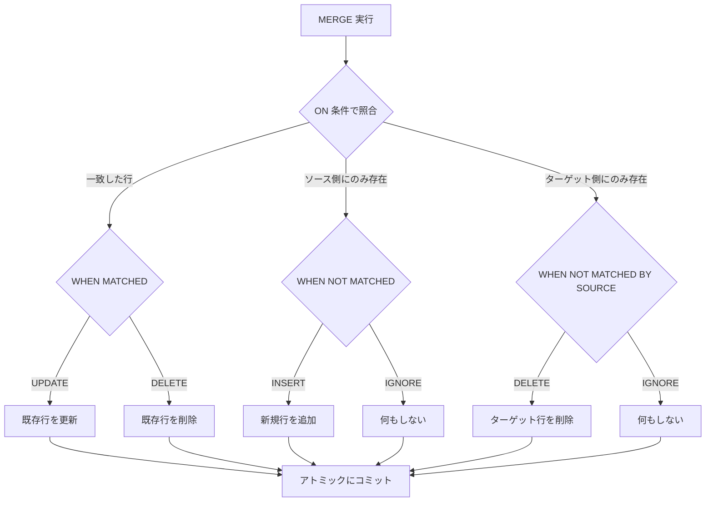
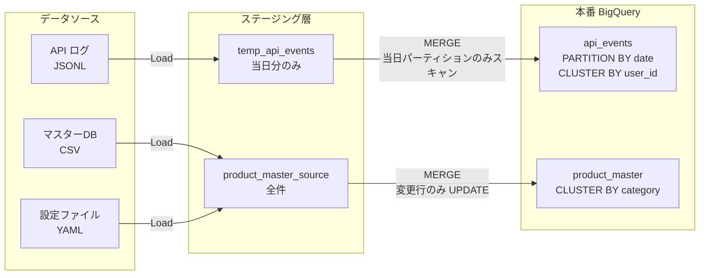

## はじめに ─ なぜ MERGE なのか

BigQuery を本番データ基盤として使い始めると、必ずぶつかる問題があります。

「毎日バッチで投入しているのに、データが重複してしまう」

`INSERT INTO` でそのままデータを流し込めば、同じデータを2回実行したときに重複行が発生します。`DELETE WHERE date = today` してから `INSERT` する方法でも、DELETE と INSERT の間にエラーが起きると中間状態が残ります。

この問題を解決するのが **MERGE 文**です。MERGE は「一致したら UPDATE、一致しなかったら INSERT」を1つのアトミックな操作で行います。BigQuery の MERGE は他の RDBMS と同様の SQL 標準に準拠しており、**冪等（idempotent）**なデータ更新を実現できます。

### 冪等性とは何か

冪等性とは、**同じ操作を何度繰り返しても結果が同じになる性質**のことです。

たとえば：
- `INSERT INTO` は冪等でない（実行のたびに行が増える）
- `MERGE` は冪等になり得る（一致条件がある限り、同じキーのデータは1行のみ保持される）

バッチ処理において冪等性は非常に重要です。ネットワーク障害・タイムアウト・バグによる再実行が発生したとき、冪等な処理であれば「もう一度実行すれば正しい状態に戻る」が保証されます。

### この記事で学べること

- BigQuery MERGE の基本構文
- 本番で使える4つの MERGE パターン（ログ蓄積・マスター同期・SCD Type 2・完全同期）
- Python（google-cloud-bigquery）からの MERGE 実行
- パーティション + クラスタリングによるコスト最適化
- よくあるエラーと対処法

---

## BigQuery MERGE の基本構文

MERGE 文の基本構造は以下のとおりです。

```sql
MERGE `{project_id}.{dataset}.target_table` AS T
USING `{project_id}.{dataset}.source_table` AS S
ON T.key_column = S.key_column
WHEN MATCHED THEN
  UPDATE SET
    T.value_column = S.value_column,
    T.updated_at = CURRENT_TIMESTAMP()
WHEN NOT MATCHED THEN
  INSERT (key_column, value_column, created_at)
  VALUES (S.key_column, S.value_column, CURRENT_TIMESTAMP())
```

3つの主要な句を理解してください。

| 句 | 意味 | 用途 |
|----|------|------|
| `WHEN MATCHED` | ON 条件でターゲットとソースが一致した行 | UPDATE（既存行の更新） |
| `WHEN NOT MATCHED` | ソース側にあるがターゲットにない行 | INSERT（新規行の追加） |
| `WHEN NOT MATCHED BY SOURCE` | ターゲット側にあるがソースにない行 | DELETE（削除済みを同期） |

MERGE の処理フローを図で確認してみましょう。



---

## パターン1: 日次ログ蓄積（重複防止 INSERT）

### ユースケース

API のアクセスログやアプリのイベントログを、毎日バッチで BigQuery に投入するパターンです。同じ `event_id` を持つログが2回投入されても、重複行を作らないようにします。

### テーブル定義

```sql
-- 本番テーブル
CREATE TABLE IF NOT EXISTS `{project_id}.{dataset}.api_events` (
  event_id     STRING    NOT NULL,
  event_date   DATE      NOT NULL,
  user_id      STRING,
  event_type   STRING,
  endpoint     STRING,
  status_code  INT64,
  response_ms  INT64,
  created_at   TIMESTAMP
)
PARTITION BY event_date
CLUSTER BY user_id, event_type;
```

### MERGE SQL

ステージングテーブル（当日分の新規データ）を用意し、本番テーブルに MERGE します。

```sql
-- ステージングテーブル（毎日バッチで作成）
CREATE OR REPLACE TABLE `{project_id}.{dataset}.api_events_staging` AS
SELECT
  event_id,
  DATE(event_timestamp) AS event_date,
  user_id,
  event_type,
  endpoint,
  status_code,
  response_ms,
  event_timestamp AS created_at
FROM `{project_id}.{dataset}.api_events_raw`
WHERE DATE(event_timestamp) = CURRENT_DATE('Asia/Tokyo');

-- MERGE で重複防止 INSERT
MERGE `{project_id}.{dataset}.api_events` AS T
USING `{project_id}.{dataset}.api_events_staging` AS S
ON T.event_id = S.event_id
   AND T.event_date = S.event_date  -- パーティションプルーニングのため必須
WHEN NOT MATCHED THEN
  INSERT (event_id, event_date, user_id, event_type, endpoint, status_code, response_ms, created_at)
  VALUES (S.event_id, S.event_date, S.user_id, S.event_type, S.endpoint, S.status_code, S.response_ms, S.created_at);
```

`WHEN MATCHED` 句を書かないことで、**既存行は変更せず、新規行だけ INSERT** する純粋な冪等 INSERT になります。何度実行しても、同じ `event_id` の行は1行だけ保持されます。

> **重要**: ON 条件にパーティション列（`event_date`）を含めることで、スキャン対象パーティションが当日分のみに絞られ、コストを大幅に削減できます。

---

## パターン2: 設定値・マスターデータ同期（差分 UPDATE）

### ユースケース

外部データベースや管理画面で変更された設定値・マスターデータを BigQuery に同期するパターンです。INSERT と UPDATE を同時に処理します。

### テーブル定義

```sql
CREATE TABLE IF NOT EXISTS `{project_id}.{dataset}.product_master` (
  product_id   STRING    NOT NULL,
  product_name STRING,
  category     STRING,
  price        NUMERIC,
  is_active    BOOL,
  created_at   TIMESTAMP,
  updated_at   TIMESTAMP
);
```

### MERGE SQL

```sql
MERGE `{project_id}.{dataset}.product_master` AS T
USING (
  -- 外部ソース（CSV 読み込みや別テーブル等）
  SELECT * FROM `{project_id}.{dataset}.product_master_source`
) AS S
ON T.product_id = S.product_id
WHEN MATCHED AND (
  -- 実際に値が変わっている場合のみ UPDATE（不要な書き込みを防ぐ）
  -- NULL 許容カラムには IS DISTINCT FROM を使う（NULL != NULL は FALSE になるため）
  T.product_name IS DISTINCT FROM S.product_name
  OR T.category   IS DISTINCT FROM S.category
  OR T.price      IS DISTINCT FROM S.price
  OR T.is_active  IS DISTINCT FROM S.is_active
) THEN
  UPDATE SET
    T.product_name = S.product_name,
    T.category     = S.category,
    T.price        = S.price,
    T.is_active    = S.is_active,
    T.updated_at   = CURRENT_TIMESTAMP()
WHEN NOT MATCHED THEN
  INSERT (product_id, product_name, category, price, is_active, created_at, updated_at)
  VALUES (S.product_id, S.product_name, S.category, S.price, S.is_active, CURRENT_TIMESTAMP(), CURRENT_TIMESTAMP());
```

`WHEN MATCHED AND (条件)` を使うことで、**値が実際に変わっている行だけを UPDATE** します。変更のない行をスキップすることで、無駄な DML コストを抑えられます。

---

## パターン3: SCD Type 2（履歴管理付き UPSERT）

### SCD Type 2 とは

Slowly Changing Dimension Type 2 は、データの**変更履歴を保持するパターン**です。現在値だけでなく、いつからいつまでその値だったかを記録します。

たとえば、ユーザーの住所が変わったとき：
- **Type 1**: 既存行を上書き（履歴なし）
- **Type 2**: 旧レコードを「有効期限切れ」にし、新レコードを追加（履歴あり）

### テーブル定義

```sql
CREATE TABLE IF NOT EXISTS `{project_id}.{dataset}.user_profiles_history` (
  surrogate_id  STRING    NOT NULL,  -- UUIDなど一意ID
  user_id       STRING    NOT NULL,  -- ビジネスキー
  email         STRING,
  plan_type     STRING,
  region        STRING,
  is_current    BOOL      NOT NULL,
  valid_from    TIMESTAMP NOT NULL,
  valid_to      TIMESTAMP,           -- NULL = 現在有効
  created_at    TIMESTAMP
)
CLUSTER BY user_id, is_current;
```

### MERGE SQL（SCD Type 2）

```sql
-- ステップ1: 変更があった行の旧レコードをクローズ
MERGE `{project_id}.{dataset}.user_profiles_history` AS T
USING (
  SELECT
    S.user_id,
    S.email,
    S.plan_type,
    S.region
  FROM `{project_id}.{dataset}.user_profiles_source` AS S
  INNER JOIN `{project_id}.{dataset}.user_profiles_history` AS H
    ON S.user_id = H.user_id
    AND H.is_current = TRUE
  WHERE
    -- NULL 許容カラムは IS DISTINCT FROM で比較する
    S.email     IS DISTINCT FROM H.email
    OR S.plan_type IS DISTINCT FROM H.plan_type
    OR S.region  IS DISTINCT FROM H.region
) AS changed
ON T.user_id = changed.user_id AND T.is_current = TRUE
WHEN MATCHED THEN
  UPDATE SET
    T.is_current = FALSE,
    T.valid_to   = CURRENT_TIMESTAMP();

-- ステップ2: 新規行（変更後または新規ユーザー）を INSERT
MERGE `{project_id}.{dataset}.user_profiles_history` AS T
USING (
  SELECT
    GENERATE_UUID() AS surrogate_id,
    S.user_id,
    S.email,
    S.plan_type,
    S.region
  FROM `{project_id}.{dataset}.user_profiles_source` AS S
) AS S
ON T.user_id = S.user_id AND T.is_current = TRUE
WHEN NOT MATCHED THEN
  INSERT (surrogate_id, user_id, email, plan_type, region, is_current, valid_from, created_at)
  VALUES (S.surrogate_id, S.user_id, S.email, S.plan_type, S.region, TRUE, CURRENT_TIMESTAMP(), CURRENT_TIMESTAMP());
```

SCD Type 2 は MERGE を2回に分けて実行します。1回目で変更行の旧レコードをクローズ（`is_current = FALSE`）し、2回目で新レコードを INSERT します。

---

## パターン4: DELETE 含む完全同期

### ユースケース

ソーステーブルの内容とターゲットテーブルを**完全に一致させる**パターンです。ソースから削除されたデータを、ターゲットからも削除します。

```sql
MERGE `{project_id}.{dataset}.active_campaigns` AS T
USING `{project_id}.{dataset}.campaigns_source` AS S
ON T.campaign_id = S.campaign_id
WHEN MATCHED AND (
  T.campaign_name IS DISTINCT FROM S.campaign_name
  OR T.budget      IS DISTINCT FROM S.budget
  OR T.status      IS DISTINCT FROM S.status
) THEN
  UPDATE SET
    T.campaign_name = S.campaign_name,
    T.budget        = S.budget,
    T.status        = S.status,
    T.updated_at    = CURRENT_TIMESTAMP()
WHEN NOT MATCHED THEN
  INSERT (campaign_id, campaign_name, budget, status, created_at, updated_at)
  VALUES (S.campaign_id, S.campaign_name, S.budget, S.status, CURRENT_TIMESTAMP(), CURRENT_TIMESTAMP())
WHEN NOT MATCHED BY SOURCE THEN
  DELETE;
```

`WHEN NOT MATCHED BY SOURCE THEN DELETE` 句によって、ターゲット側にあってソース側にない行（＝ソースで削除された行）が自動的に削除されます。

> **注意**: この句は強力です。ソースデータが不完全（一部しか含まれていない）な場合に使うと、意図せずデータが大量削除される可能性があります。ソースが**全件**を含んでいることを必ず確認してから使用してください。

---

## Python からの MERGE 実行

### 環境セットアップ

```bash
pip install google-cloud-bigquery
```

### 基本的な MERGE 実行

```python
from google.cloud import bigquery

def run_merge(project_id: str, dataset: str) -> bigquery.QueryJob:
    """
    BigQuery MERGE を実行する関数。
    テーブル名は信頼できる変数から組み立てる。
    ユーザー入力値を SQL に埋め込む場合は QueryParameters を使うこと。
    """
    client = bigquery.Client(project=project_id)

    # テーブル名のみ f-string で組み立て（値パラメータはクエリパラメータで渡す）
    sql = f"""
    MERGE `{project_id}.{dataset}.api_events` AS T
    USING `{project_id}.{dataset}.api_events_staging` AS S
    ON T.event_id = S.event_id
       AND T.event_date = S.event_date
    WHEN NOT MATCHED THEN
      INSERT (event_id, event_date, user_id, event_type, endpoint, status_code, response_ms, created_at)
      VALUES (S.event_id, S.event_date, S.user_id, S.event_type, S.endpoint, S.status_code, S.response_ms, S.created_at)
    """

    job = client.query(sql)
    job.result()  # 完了まで待機

    print(f"MERGE 完了: {job.num_dml_affected_rows} 行に影響")
    return job


def run_merge_with_staging(
    project_id: str,
    dataset: str,
    rows: list[dict],
) -> None:
    """
    ローカルデータをステージングテーブルに書き込み、MERGE を実行する。
    """
    client = bigquery.Client(project=project_id)
    staging_table = f"{project_id}.{dataset}.api_events_staging"

    # ステージングテーブルを上書き作成
    job_config = bigquery.LoadJobConfig(
        write_disposition=bigquery.WriteDisposition.WRITE_TRUNCATE,
        source_format=bigquery.SourceFormat.NEWLINE_DELIMITED_JSON,
        autodetect=True,
    )

    load_job = client.load_table_from_json(rows, staging_table, job_config=job_config)
    load_job.result()
    print(f"ステージング投入: {len(rows)} 行")

    # MERGE 実行
    run_merge(project_id, dataset)
```

### エラーハンドリングと冪等リトライ

```python
import time
from google.api_core.exceptions import GoogleAPIError

def run_merge_with_retry(
    project_id: str,
    dataset: str,
    max_retries: int = 3,
    retry_delay_sec: float = 5.0,
) -> bool:
    """
    MERGE を最大 max_retries 回リトライする。
    MERGE は冪等なので、リトライしても二重投入は発生しない。
    """
    for attempt in range(1, max_retries + 1):
        try:
            run_merge(project_id, dataset)
            return True
        except GoogleAPIError as e:
            print(f"試行 {attempt}/{max_retries} 失敗: {e}")
            if attempt < max_retries:
                time.sleep(retry_delay_sec * attempt)  # 指数バックオフ

    print("MERGE が全リトライ後も失敗しました")
    return False
```

MERGE は冪等であるため、リトライロジックをシンプルに実装できます。INSERT と異なり、同じデータを再送しても重複行が作られません。

---

## コスト最適化

### パーティション + クラスタリングの活用

データパイプライン全体でのデータフローと最適化ポイントを確認してみましょう。



### パーティションプルーニングの効果

ON 条件にパーティション列を含めるかどうかで、スキャン量が大きく変わります。

```sql
-- NG: 全パーティションをスキャン（コスト高）
MERGE `{project_id}.{dataset}.api_events` AS T
USING `{project_id}.{dataset}.api_events_staging` AS S
ON T.event_id = S.event_id  -- event_date を含めていない

-- OK: 当日パーティションのみスキャン（コスト低）
MERGE `{project_id}.{dataset}.api_events` AS T
USING `{project_id}.{dataset}.api_events_staging` AS S
ON T.event_id = S.event_id
   AND T.event_date = S.event_date  -- パーティション列を必ず含める
```

1億行・1年分のテーブルであれば、パーティションプルーニングにより**スキャン量を最大 1/365 に削減**できます。

### セッション一時テーブルの活用

ステージングテーブルをセッション一時テーブルとして作成すると、セッション終了時に自動削除されます。

```sql
-- セッション一時テーブルを作成（セッション終了後に自動削除）
CREATE TEMP TABLE api_events_staging AS
SELECT
  event_id,
  DATE(event_timestamp) AS event_date,
  user_id,
  event_type,
  endpoint,
  status_code,
  response_ms,
  event_timestamp AS created_at
FROM `{project_id}.{dataset}.api_events_raw`
WHERE DATE(event_timestamp) = CURRENT_DATE('Asia/Tokyo');

-- 同一セッション内で MERGE 実行
MERGE `{project_id}.{dataset}.api_events` AS T
USING api_events_staging AS S  -- 一時テーブル名をそのまま参照
ON T.event_id = S.event_id
   AND T.event_date = S.event_date
WHEN NOT MATCHED THEN
  INSERT (event_id, event_date, user_id, event_type, endpoint, status_code, response_ms, created_at)
  VALUES (S.event_id, S.event_date, S.user_id, S.event_type, S.endpoint, S.status_code, S.response_ms, S.created_at);
```

一時テーブルはストレージコストが不要で、管理も楽になります。

---

## よくあるエラーと対処法

### エラー1: `UPDATE/MERGE must match at most one source row`

**原因**: MERGE のソース側（USING 句）に重複行が存在している。1つのターゲット行に対して複数のソース行がマッチすると、どのソース行を使えばよいか BigQuery が判断できないため、エラーになります。

**対処**: ソース側で重複を除去してから MERGE に渡します。

```sql
-- NG: source に重複がある場合エラーになる
MERGE target AS T
USING source AS S  -- source に event_id 重複がある
ON T.event_id = S.event_id

-- OK: USING 句内で重複を除去する
MERGE `{project_id}.{dataset}.api_events` AS T
USING (
  SELECT *
  FROM (
    SELECT
      *,
      ROW_NUMBER() OVER (PARTITION BY event_id ORDER BY created_at DESC) AS rn
    FROM `{project_id}.{dataset}.api_events_staging`
  )
  WHERE rn = 1  -- 最新の1行だけを残す
) AS S
ON T.event_id = S.event_id
   AND T.event_date = S.event_date
WHEN NOT MATCHED THEN
  INSERT (event_id, event_date, user_id, event_type, created_at)
  VALUES (S.event_id, S.event_date, S.user_id, S.event_type, S.created_at);
```

### エラー2: `Column name is ambiguous`

**原因**: ターゲットとソースで同じカラム名が存在し、どちらを参照しているか不明確。

**対処**: `T.` または `S.` のエイリアスを明示します。

```sql
-- NG: updated_at がどちらか不明
WHEN MATCHED THEN UPDATE SET updated_at = CURRENT_TIMESTAMP()

-- OK: T. を明示
WHEN MATCHED THEN UPDATE SET T.updated_at = CURRENT_TIMESTAMP()
```

### エラー3: 全パーティションスキャンによるコスト超過

**原因**: ON 条件にパーティション列が含まれていない。

**対処**: ON 条件に必ずパーティション列を含めます（パターン1の MERGE SQL を参照）。

### エラー4: DML クォータ超過

**原因**: 1日あたりの DML クォータ（プロジェクトあたり 1,000 DML ジョブ）を超えた。

**対処**: バッチの実行頻度を下げる、または MERGE の対象テーブルを統合してジョブ数を減らします。

---

## まとめ

BigQuery MERGE を使った冪等アップサートのパターンをまとめます。

| パターン | WHEN 句 | 主なユースケース |
|---------|---------|----------------|
| 重複防止 INSERT | NOT MATCHED のみ | ログ蓄積・イベント追記 |
| 差分 UPSERT | MATCHED + NOT MATCHED | マスター同期・設定値更新 |
| SCD Type 2 | 2段階 MERGE | 変更履歴保持が必要なデータ |
| 完全同期 | MATCHED + NOT MATCHED + NOT MATCHED BY SOURCE | ソースとの完全一致 |

MERGE を活用する際の重要ポイントを以下にまとめます。

- **ON 条件にパーティション列を含める**: スキャン量削減のために必須
- **USING 句で重複を除去する**: `ROW_NUMBER()` を使って1ソース行に絞る
- **WHEN MATCHED の条件を絞る**: 実際に変更があった行だけ UPDATE する
- **冪等性を信頼してリトライを実装する**: MERGE は再実行しても安全

BigQuery の MERGE はコストさえ意識すれば、本番データパイプラインに非常に有効な手法です。INSERT・UPDATE・DELETE を別々のジョブに分けるより、MERGE 1本にまとめることでジョブ管理も単純化できます。

ぜひ本記事のパターンを参考に、安全で冪等なデータ更新パイプラインを構築してみてください。

---

## 参考リンク

- [BigQuery MERGE 公式ドキュメント](https://cloud.google.com/bigquery/docs/reference/standard-sql/dml-syntax#merge_statement)
- [BigQuery パーティション分割テーブル](https://cloud.google.com/bigquery/docs/partitioned-tables)
- [google-cloud-bigquery Python クライアント](https://cloud.google.com/python/docs/reference/bigquery/latest)
