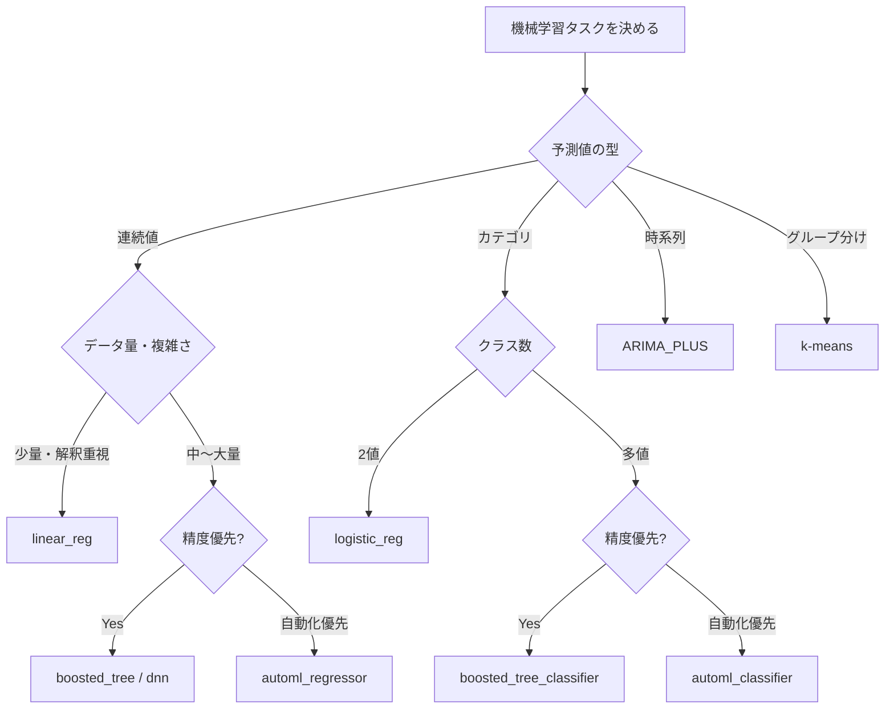
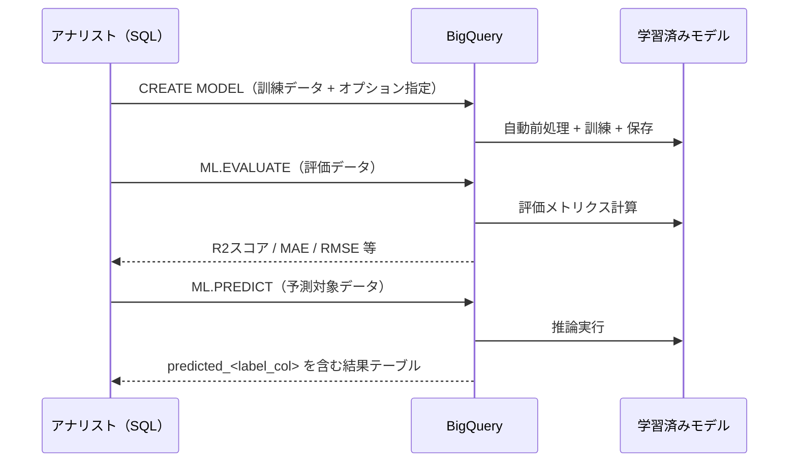
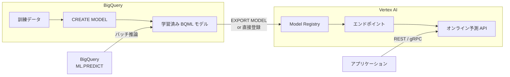

## はじめに ─ BigQuery ML とは何か

機械学習を業務に導入したいが、Python 環境の構築・データ移動・モデルサービングの複雑さに踏み出せない ── そういった声をデータエンジニアリングの現場でよく耳にします。

BigQuery ML（BQML）は、Google Cloud が提供する「BigQuery 上で SQL だけで機械学習モデルを構築・評価・予測できる」サービスです。2018 年にベータ版として登場し、現在は線形回帰・ロジスティック回帰・k-means クラスタリング・時系列予測（ARIMA_PLUS）・DNN・XGBoost・AutoML Tables まで幅広いモデルタイプをサポートしています。

### 従来の ML パイプラインとの違い

従来の機械学習開発では次のようなステップが必要でした。

1. BigQuery からデータをエクスポート（GCS 経由など）
2. Python/Jupyter 環境でデータ前処理・特徴量エンジニアリング
3. scikit-learn / TensorFlow などでモデル訓練
4. モデルをシリアライズして保存
5. Cloud Run や Vertex AI エンドポイントにデプロイ
6. 推論結果を BigQuery に書き戻す

BigQuery ML を使えば、このすべてを BigQuery の SQL 上で完結させられます。データをエクスポートする必要がなく、すでに BigQuery に蓄積されているデータをそのまま訓練データとして使えます。特徴量スケーリングや欠損値補完といった前処理も多くのモデルタイプで自動化されています。

### この記事で学べること

- BigQuery ML がサポートするモデルタイプと選択基準
- CREATE MODEL / ML.EVALUATE / ML.PREDICT の基本構文
- 線形回帰による売上予測・k-means による顧客セグメンテーション・ARIMA_PLUS による時系列予測の実践 SQL
- ハイパーパラメータチューニングとモデル評価の読み方
- Vertex AI との連携によるオンライン予測の実現
- コスト最適化とベストプラクティス

---

## サポートモデル一覧と使い分け

BigQuery ML は 2025 年時点で以下のモデルタイプをサポートしています。

| モデルタイプ | model_type 指定値 | タスク | 特徴 |
|---|---|---|---|
| 線形回帰 | `linear_reg` | 回帰 | 連続値の予測。解釈しやすく訓練も高速 |
| ロジスティック回帰 | `logistic_reg` | 2値・多値分類 | チャーン予測・スパム判定など |
| k-means クラスタリング | `kmeans` | クラスタリング | 顧客セグメンテーション・異常検知 |
| 時系列予測 | `arima_plus` | 時系列 | 需要予測・KPI 推移予測。百万系列規模に対応 |
| XGBoost（Boosted Trees） | `boosted_tree_regressor` / `boosted_tree_classifier` | 回帰・分類 | 表形式データで高精度 |
| DNN 回帰・分類 | `dnn_regressor` / `dnn_classifier` | 回帰・分類 | 特徴量が多い複雑なデータセット向け |
| Wide & Deep | `wide_and_deep_regressor` / `wide_and_deep_classifier` | 回帰・分類 | 記憶と汎化を両立する推薦システムに有効 |
| AutoML Tables | `automl_regressor` / `automl_classifier` | 回帰・分類 | 自動特徴量エンジニアリング・モデル選択 |
| 行列分解 | `matrix_factorization` | 推薦 | 協調フィルタリング |
| TensorFlow インポート | `tensorflow` | 任意 | 既存 SavedModel を BQ 上で推論 |
| リモートモデル（Gemini 等） | `(REMOTE WITH CONNECTION)` | 任意 | Vertex AI / Gemini API を BQ から呼び出し |

### モデル選択のフローチャート



---

## 環境セットアップ

### 必要な権限

BigQuery ML を使うには、サービスアカウントまたはユーザーアカウントに以下の IAM ロールが必要です。

| ロール | 用途 |
|---|---|
| `roles/bigquery.dataEditor` | データセットへのモデル作成・書き込み |
| `roles/bigquery.jobUser` | クエリジョブの実行 |
| `roles/bigquery.user` | データセット・モデルの参照 |

AutoML Tables や DNN を使う場合は、Vertex AI API の有効化も必要です。

```sql
-- データセットを作成（モデル保存先として使用）
CREATE SCHEMA IF NOT EXISTS `my_project.bqml_demo`
OPTIONS (
  location = 'asia-northeast1'
);
```

### BigQuery ML の有効化確認

プロジェクトで BigQuery API が有効になっていれば BigQuery ML は追加設定なしで使えます。Cloud Console の「APIとサービス」から `bigquery.googleapis.com` が有効になっていることを確認してください。

---

## 基本ワークフロー ─ CREATE MODEL → EVALUATE → PREDICT

BigQuery ML の作業フローは次の 3 ステップで構成されます。



### CREATE MODEL の基本構文

```sql
CREATE OR REPLACE MODEL `project.dataset.model_name`
OPTIONS (
  model_type = 'モデルタイプ',
  input_label_cols = ['目的変数カラム名'],
  -- その他オプション
) AS
SELECT
  特徴量カラム1,
  特徴量カラム2,
  目的変数カラム名
FROM
  `project.dataset.training_table`
WHERE
  分割条件;
```

`CREATE OR REPLACE MODEL` とすることで、既存モデルを上書き再訓練できます。`input_label_cols` で目的変数を指定し、SELECT 句に含めたカラムが自動的に特徴量として使われます。

### ML.EVALUATE の基本構文

```sql
SELECT *
FROM ML.EVALUATE(
  MODEL `project.dataset.model_name`,
  (
    SELECT
      特徴量カラム1,
      特徴量カラム2,
      目的変数カラム名
    FROM
      `project.dataset.evaluation_table`
  )
);
```

### ML.PREDICT の基本構文

```sql
SELECT *
FROM ML.PREDICT(
  MODEL `project.dataset.model_name`,
  (
    SELECT
      特徴量カラム1,
      特徴量カラム2
    FROM
      `project.dataset.prediction_table`
  )
);
```

出力には元のカラムすべてに加えて `predicted_<目的変数名>` カラムが付加されます。

---

## 実践 1 ── 線形回帰で売上予測

ECサイトの商品別・月別売上データから、翌月の売上を予測するシナリオです。

### 訓練データの準備

```sql
-- サンプル: ECサイト売上テーブルのイメージ
-- project.dataset.sales_history
-- カラム: product_id, year_month, price_avg, ad_spend, num_reviews,
--          category, monthly_sales（目的変数）

CREATE OR REPLACE TABLE `bqml_demo.sales_training` AS
SELECT
  price_avg,
  ad_spend,
  num_reviews,
  category,
  monthly_sales
FROM
  `bqml_demo.sales_history`
WHERE
  year_month < '2024-10-01';
```

### モデル訓練

```sql
CREATE OR REPLACE MODEL `bqml_demo.sales_forecast_model`
OPTIONS (
  model_type         = 'linear_reg',
  input_label_cols   = ['monthly_sales'],
  l1_reg             = 0.1,
  l2_reg             = 0.1,
  max_iterations     = 50,
  learn_rate_strategy = 'line_search'
) AS
SELECT
  price_avg,
  ad_spend,
  num_reviews,
  category,
  monthly_sales
FROM
  `bqml_demo.sales_training`;
```

`l1_reg` / `l2_reg` は過学習を防ぐ正則化パラメータです。`category` のような文字列カラムは BigQuery ML が自動的に One-Hot エンコードします。

### モデル評価

```sql
SELECT
  mean_absolute_error,
  mean_squared_error,
  mean_squared_log_error,
  median_absolute_error,
  r2_score,
  explained_variance
FROM ML.EVALUATE(
  MODEL `bqml_demo.sales_forecast_model`,
  (
    SELECT
      price_avg,
      ad_spend,
      num_reviews,
      category,
      monthly_sales
    FROM
      `bqml_demo.sales_history`
    WHERE
      year_month >= '2024-10-01'
      AND year_month < '2024-12-01'
  )
);
```

評価メトリクスの読み方：

| メトリクス | 意味 | 目安 |
|---|---|---|
| `r2_score` | 説明率（1 が最高） | 0.8 以上で良好 |
| `mean_absolute_error` | 予測誤差の平均（実数値） | 業務許容範囲に合わせて判断 |
| `mean_squared_error` | 大きな誤差を重視するペナルティ | 外れ値の多さを示す |
| `median_absolute_error` | 外れ値の影響を受けない中央値誤差 | MAE と比較して外れ値の影響を評価 |

### 予測実行

```sql
SELECT
  product_id,
  year_month,
  predicted_monthly_sales,
  -- 予測区間も取得できる（線形回帰では prediction_interval 利用可）
FROM ML.PREDICT(
  MODEL `bqml_demo.sales_forecast_model`,
  (
    SELECT
      product_id,
      '2024-12-01' AS year_month,
      price_avg,
      ad_spend,
      num_reviews,
      category
    FROM
      `bqml_demo.products_current`
  )
)
ORDER BY
  predicted_monthly_sales DESC;
```

### 特徴量重要度の確認

```sql
SELECT
  processed_input,
  weight,
  category_name
FROM ML.WEIGHTS(MODEL `bqml_demo.sales_forecast_model`)
ORDER BY ABS(weight) DESC;
```

`ML.WEIGHTS` でどの特徴量が予測に強く影響しているかを確認できます。

---

## 実践 2 ── k-means で顧客セグメンテーション

購買履歴データから顧客を自動的にグループ分けし、マーケティング戦略に活用するシナリオです。

### 特徴量の準備

```sql
-- RFM 分析をベースにした顧客特徴量の作成
CREATE OR REPLACE TABLE `bqml_demo.customer_features` AS
SELECT
  customer_id,
  -- Recency: 最終購入からの経過日数
  DATE_DIFF(CURRENT_DATE(), MAX(order_date), DAY)  AS recency_days,
  -- Frequency: 購入回数
  COUNT(DISTINCT order_id)                          AS frequency,
  -- Monetary: 合計購入金額
  SUM(order_amount)                                 AS monetary,
  -- 平均注文金額
  AVG(order_amount)                                 AS avg_order_value,
  -- カテゴリ多様性
  COUNT(DISTINCT category)                          AS category_diversity
FROM
  `bqml_demo.orders`
WHERE
  order_date >= DATE_SUB(CURRENT_DATE(), INTERVAL 365 DAY)
GROUP BY
  customer_id;
```

### モデル訓練（クラスタ数は 5 で試行）

```sql
CREATE OR REPLACE MODEL `bqml_demo.customer_segment_model`
OPTIONS (
  model_type        = 'kmeans',
  num_clusters      = 5,
  kmeans_init_method = 'KMEANS++',
  distance_type     = 'euclidean',
  standardize_features = TRUE
) AS
SELECT
  recency_days,
  frequency,
  monetary,
  avg_order_value,
  category_diversity
FROM
  `bqml_demo.customer_features`;
```

`standardize_features = TRUE` を指定すると、各特徴量が自動的に標準化されます。金額と日数のようにスケールが大きく異なる特徴量を扱う際には必ず有効にしてください。

### クラスタリング結果の評価

```sql
-- Davies-Bouldin Index（小さいほどクラスタが明確に分離されている）
SELECT
  davies_bouldin_index,
  mean_squared_distance
FROM ML.EVALUATE(MODEL `bqml_demo.customer_segment_model`);
```

### 各顧客をクラスタに割り当て

```sql
CREATE OR REPLACE TABLE `bqml_demo.customer_segments` AS
SELECT
  customer_id,
  CENTROID_ID AS segment_id,
  recency_days,
  frequency,
  monetary
FROM ML.PREDICT(
  MODEL `bqml_demo.customer_segment_model`,
  TABLE `bqml_demo.customer_features`
);
```

### セグメント別の特性確認

```sql
SELECT
  segment_id,
  COUNT(*)                     AS customer_count,
  ROUND(AVG(recency_days), 1)  AS avg_recency,
  ROUND(AVG(frequency), 1)     AS avg_frequency,
  ROUND(AVG(monetary), 0)      AS avg_monetary
FROM
  `bqml_demo.customer_segments`
GROUP BY
  segment_id
ORDER BY
  avg_monetary DESC;
```

この結果から「高頻度・高単価の優良顧客（segment 2）」「離脱リスクのある休眠顧客（segment 4）」といったラベルを付与し、それぞれに最適なマーケティング施策を打てます。

### 異常検知への応用

k-means モデルは `ML.DETECT_ANOMALIES` 関数と組み合わせて、購買行動の異常（不正アクセス・異常購入）を検出するためにも使えます。

```sql
SELECT
  customer_id,
  is_anomaly,
  normalised_distance
FROM ML.DETECT_ANOMALIES(
  MODEL `bqml_demo.customer_segment_model`,
  STRUCT(0.02 AS contamination),
  TABLE `bqml_demo.customer_features`
)
WHERE is_anomaly = TRUE
ORDER BY normalised_distance DESC;
```

---

## 実践 3 ── ARIMA_PLUS で時系列予測

店舗別・SKU 別の日次売上データから将来の需要を予測するシナリオです。ARIMA_PLUS は BigQuery ML の時系列予測専用モデルで、欠損値補完・外れ値除去・季節性分解を自動で行います。

### モデル訓練

```sql
CREATE OR REPLACE MODEL `bqml_demo.demand_forecast_model`
OPTIONS (
  model_type        = 'arima_plus',
  time_series_timestamp_col = 'sale_date',
  time_series_data_col      = 'daily_sales',
  time_series_id_col        = ['store_id', 'sku_id'],  -- 複数系列を一括訓練
  holiday_region            = 'JP',                    -- 日本の祝日効果を考慮
  auto_arima                = TRUE,                    -- p,d,q を自動探索
  decompose_time_series     = TRUE                     -- トレンド・季節性を分解して保存
) AS
SELECT
  sale_date,
  store_id,
  sku_id,
  daily_sales
FROM
  `bqml_demo.daily_sales_history`
WHERE
  sale_date BETWEEN '2022-01-01' AND '2024-12-31';
```

`holiday_region = 'JP'` を指定すると、お盆・年末年始などの日本の祝日による売上スパイク・ディップが異常として誤検知されなくなります。

### 将来予測の実行

```sql
SELECT
  store_id,
  sku_id,
  forecast_timestamp,
  forecast_value,
  prediction_interval_lower_bound,
  prediction_interval_upper_bound
FROM ML.FORECAST(
  MODEL `bqml_demo.demand_forecast_model`,
  STRUCT(
    30   AS horizon,         -- 30日先まで予測
    0.90 AS confidence_level -- 90% 予測区間
  )
)
ORDER BY
  store_id, sku_id, forecast_timestamp;
```

`horizon` で予測ステップ数を、`confidence_level` で予測区間の幅を指定します。予測区間（`prediction_interval_lower_bound` / `prediction_interval_upper_bound`）は在庫の安全在庫計算に活用できます。

### 時系列の成分分解

```sql
-- トレンド・季節性・残差の確認
SELECT
  time_series_timestamp,
  time_series_data,
  trend,
  seasonal_period,
  seasonal_period_seasonality,
  holiday_effect,
  residual
FROM ML.EXPLAIN_FORECAST(
  MODEL `bqml_demo.demand_forecast_model`,
  STRUCT(90 AS horizon, 0.90 AS confidence_level)
)
WHERE store_id = 'STORE_001'
  AND sku_id = 'SKU_A100'
ORDER BY time_series_timestamp;
```

`ML.EXPLAIN_FORECAST` を使うと、予測値をトレンド・季節性・休日効果・残差に分解して可視化できます。「なぜこの時期に売上が増えるのか」をステークホルダーに説明しやすくなります。

### 異常検知（ARIMA_PLUS）

```sql
SELECT
  time_series_timestamp,
  time_series_data,
  is_anomaly,
  lower_bound,
  upper_bound,
  anomaly_probability
FROM ML.DETECT_ANOMALIES(
  MODEL `bqml_demo.demand_forecast_model`,
  STRUCT(0.8 AS anomaly_prob_threshold),
  (
    SELECT sale_date, store_id, sku_id, daily_sales
    FROM `bqml_demo.daily_sales_history`
    WHERE sale_date >= '2025-01-01'
  )
)
WHERE is_anomaly = TRUE;
```

---

## モデル評価とハイパーパラメータチューニング

### ハイパーパラメータ自動チューニング

BigQuery ML には `NUM_TRIALS` オプションによる自動ハイパーパラメータチューニング機能があります。指定したトライアル数だけ異なるパラメータ組み合わせで訓練を繰り返し、最も良いモデルを自動選択します。

```sql
CREATE OR REPLACE MODEL `bqml_demo.sales_model_tuned`
OPTIONS (
  model_type       = 'boosted_tree_regressor',
  input_label_cols = ['monthly_sales'],
  num_trials       = 20,             -- 20 回の試行を実行
  max_tree_depth   = HPARAM_RANGE(3, 8),
  subsample        = HPARAM_RANGE(0.6, 1.0),
  l1_reg           = HPARAM_RANGE(0.0, 1.0),
  l2_reg           = HPARAM_RANGE(0.0, 1.0)
) AS
SELECT
  price_avg,
  ad_spend,
  num_reviews,
  category,
  monthly_sales
FROM
  `bqml_demo.sales_training`;
```

`HPARAM_RANGE(min, max)` でチューニング対象パラメータの探索範囲を指定します。Google の推奨として、チューニングするハイパーパラメータ数 × 10 以上の `NUM_TRIALS` を設定することが推奨されています。

### トライアル結果の確認

```sql
SELECT
  trial_id,
  hparam_tuning_evaluation_metrics.mean_squared_error AS mse,
  hparam_tuning_evaluation_metrics.r2_score           AS r2,
  max_tree_depth,
  subsample,
  l1_reg,
  l2_reg,
  training_loss,
  eval_loss
FROM ML.TRIAL_INFO(MODEL `bqml_demo.sales_model_tuned`)
ORDER BY r2 DESC
LIMIT 5;
```

### ML.PREDICT は最適トライアルを自動選択

`ML.PREDICT` 実行時は `NUM_TRIALS` で得られた最もスコアの高いトライアルのモデルが自動的に使用されます。特定のトライアルを使いたい場合は次のように指定します。

```sql
SELECT * FROM ML.PREDICT(
  MODEL `bqml_demo.sales_model_tuned`,
  TABLE `bqml_demo.products_current`,
  STRUCT(3 AS trial_id)  -- trial_id=3 のモデルを使用
);
```

### モデル情報の確認

```sql
-- モデルの訓練情報・オプションを確認
SELECT *
FROM ML.TRAINING_INFO(MODEL `bqml_demo.sales_forecast_model`)
ORDER BY iteration;
```

---

## Vertex AI との連携

BigQuery ML のモデルはバッチ予測専用ですが、Vertex AI と連携することでオンライン予測（低レイテンシのリアルタイム推論）が可能になります。

### アーキテクチャ全体像



### Vertex AI Model Registry への直接登録（推奨）

2023 年以降、モデルをエクスポートせず BigQuery ML から直接 Vertex AI Model Registry に登録できるようになりました。

```sql
-- BigQuery からは以下のクエリで登録できない（bq コマンドまたは REST API を使用）
-- 参考: gcloud / REST での操作
```

```bash
# bq コマンドでモデルを Vertex AI Model Registry に登録
bq --project_id=my_project \
  update \
  --set_label vertex_ai_model_id:my-sales-model \
  bqml_demo.sales_model_tuned
```

Python SDK を使った登録例：

```python
from google.cloud import bigquery
from google.cloud import aiplatform

# Vertex AI 初期化
aiplatform.init(project="my_project", location="asia-northeast1")

# BigQuery ML モデルを Vertex AI に登録
model = aiplatform.Model.upload(
    display_name="sales-forecast-model",
    artifact_uri="bq://my_project.bqml_demo.sales_model_tuned",
    serving_container_image_uri=None  # BQML モデルはコンテナ不要
)
print(f"登録完了: {model.resource_name}")
```

### Vertex AI エンドポイントへのデプロイとオンライン予測

```python
# エンドポイントの作成とデプロイ
endpoint = aiplatform.Endpoint.create(
    display_name="sales-forecast-endpoint",
    location="asia-northeast1"
)

model.deploy(
    endpoint=endpoint,
    machine_type="n1-standard-4",
    min_replica_count=1,
    max_replica_count=3
)

# オンライン予測の実行
response = endpoint.predict(
    instances=[
        {
            "price_avg": 2500.0,
            "ad_spend": 50000.0,
            "num_reviews": 128,
            "category": "electronics"
        }
    ]
)
print(response.predictions)
```

### エクスポートが必要なケース

Vertex AI Model Registry への直接登録に対応していないモデルタイプ（TensorFlow インポートモデルなど）は、GCS 経由のエクスポートが必要です。

```sql
-- GCS へのエクスポート（SavedModel 形式）
EXPORT MODEL `bqml_demo.sales_forecast_model`
OPTIONS (
  URI = 'gs://my-bucket/bqml-models/sales_forecast/'
);
```

---

## コスト最適化とベストプラクティス

### BigQuery ML の料金体系

BigQuery ML の課金はクエリで処理されたデータ量に基づきます（オンデマンド料金の場合）。

| 操作 | 料金（オンデマンド） |
|---|---|
| モデル訓練（線形回帰・ロジスティック回帰・k-means・ARIMA） | $5.00 / TB |
| モデル訓練（Boosted Trees・DNN・Wide & Deep） | $5.00 / TB + Vertex AI 使用料 |
| モデル訓練（AutoML Tables） | Vertex AI AutoML の料金 |
| 評価・検査・予測（ML.EVALUATE / ML.PREDICT 等） | $6.25 / TB |
| 無料枠（月間） | 訓練 10 GB / 予測 1 GB |

BigQuery の Editions（Enterprise / Enterprise Plus）を契約しているプロジェクトではスロットベースの課金となり、大量の ML ジョブを実行する場合はオンデマンドより低コストになることがあります。

### コスト削減のベストプラクティス

#### 1. 訓練データのサンプリング

モデルの試作段階では全量データではなくサンプルで訓練し、コストと時間を削減します。

```sql
CREATE OR REPLACE MODEL `bqml_demo.sales_model_dev`
OPTIONS (model_type = 'linear_reg', input_label_cols = ['monthly_sales']) AS
SELECT *
FROM `bqml_demo.sales_training`
WHERE MOD(ABS(FARM_FINGERPRINT(CAST(product_id AS STRING))), 10) < 2  -- 20% サンプル
;
```

#### 2. パーティションテーブルの活用

訓練・予測クエリが参照するデータをパーティション・クラスタリングで絞り込みます。

```sql
-- パーティションを使って訓練期間を限定
SELECT * FROM `bqml_demo.sales_history`
WHERE DATE(_PARTITIONTIME) BETWEEN '2023-01-01' AND '2024-12-31';
```

#### 3. データ型の最適化

不要なカラムを SELECT 句に含めないことで処理バイト数を削減します。BigQuery ML では SELECT 句のカラムすべてが課金対象となります。

#### 4. モデルの再訓練頻度を適切に設定

毎日再訓練が必要なモデルは稀です。モデルの精度劣化（ドリフト）を監視し、必要なときだけ再訓練する運用を検討してください。

#### 5. 予測結果のキャッシュ化

同一入力に対して繰り返し予測を実行する場合は、結果を BigQuery テーブルに書き込みキャッシュとして活用します。

```sql
CREATE OR REPLACE TABLE `bqml_demo.predictions_cache`
PARTITION BY DATE(predicted_at)
AS
SELECT
  *,
  CURRENT_TIMESTAMP() AS predicted_at
FROM ML.PREDICT(
  MODEL `bqml_demo.sales_forecast_model`,
  TABLE `bqml_demo.products_current`
);
```

### 本番運用での注意点

- モデルの精度を定期的に `ML.EVALUATE` でモニタリングし、R2 スコアが閾値を下回ったら自動再訓練を Scheduled Query でトリガーする
- `CREATE OR REPLACE MODEL` は既存モデルを完全に上書きするため、バージョン管理が重要。`model_name_v1`・`model_name_v2` のように命名してロールバックに備える
- ARIMA_PLUS の複数系列訓練は最大数百万系列に対応しているが、系列数が多い場合はスロット上限に注意する
- Vertex AI にデプロイしたモデルはアイドル状態でも最低インスタンス数分の料金が発生するため、バッチ予測で十分なユースケースでは BQML のバッチ推論のままにしておくことを推奨する

---

## まとめ

BigQuery ML は「SQL を書けるすべてのデータアナリスト・エンジニア」が機械学習を活用できるようにする強力なツールです。この記事で紹介した内容をまとめます。

| 学習内容 | ポイント |
|---|---|
| モデルタイプの選択 | タスク（回帰/分類/クラスタリング/時系列）とデータ量・複雑さで選ぶ |
| 基本ワークフロー | CREATE MODEL → ML.EVALUATE → ML.PREDICT の 3 ステップ |
| 線形回帰 | `input_label_cols` で目的変数を指定。文字列は自動 One-Hot エンコード |
| k-means | `standardize_features = TRUE` で特徴量スケール問題を解消。クラスタ数は試行錯誤 |
| ARIMA_PLUS | `time_series_id_col` で複数系列を一括訓練。`holiday_region` で日本祝日に対応 |
| ハイパーパラメータチューニング | `NUM_TRIALS` で自動探索。パラメータ数 × 10 以上のトライアルを推奨 |
| Vertex AI 連携 | Model Registry への直接登録でオンライン予測を実現 |
| コスト最適化 | サンプリング・パーティション・キャッシュで処理バイトを削減 |

BigQuery ML の最大の強みは、「データがある場所でモデルを動かす」アーキテクチャにあります。データ移動のコスト・レイテンシ・セキュリティリスクをすべて排除しながら、標準 SQL で機械学習の全ライフサイクルを管理できます。まずは `linear_reg` や `kmeans` といった軽量モデルから試し、徐々に `boosted_tree` や `arima_plus` へと発展させていくのが実践的なアプローチです。

---

## 参考資料

- [BigQuery ML ドキュメント — Google Cloud](https://cloud.google.com/bigquery/docs/bqml-introduction)
- [CREATE MODEL ステートメントリファレンス](https://cloud.google.com/bigquery/docs/reference/standard-sql/bigqueryml-syntax-create)
- [ARIMA_PLUS モデルの作成](https://cloud.google.com/bigquery/docs/reference/standard-sql/bigqueryml-syntax-create-time-series)
- [Vertex AI と BigQuery ML の統合](https://cloud.google.com/bigquery/docs/managing-models-vertex)
- [BigQuery ML ハイパーパラメータチューニング](https://cloud.google.com/bigquery/docs/hp-tuning-overview)
- [BigQuery 料金](https://cloud.google.com/bigquery/pricing)
