## はじめに

BigQuery でデータを公開する方法は、テーブルへの直接クエリだけではありません。通常ビュー（Logical View）、マテリアライズドビュー（Materialized View）、そして集計テーブルという3つの選択肢があります。

どれを使うかによって、クエリの応答速度とコストが大きく変わります。「とりあえずビューを作った」という設計のまま本番運用を続けると、毎日ソーステーブルをフルスキャンしてコストが膨らみ続けることがあります。

本記事では、3つのアプローチの仕組みを比較し、データ鮮度・クエリ頻度・集計の複雑さに応じた使い分けを整理します。パーティションやクラスタリングとの組み合わせパターン、コスト試算も掲載します。

---

## 通常ビュー（Logical View）の仕組み

通常ビューはビュー定義のSQL文をメタデータとして保存するだけで、データ自体は持ちません。クエリが実行されるたびに、ビュー定義がインライン展開されてソーステーブルに対してクエリが実行されます。

```sql
-- 通常ビューの作成
CREATE OR REPLACE VIEW `project.dataset.monthly_sales_view` AS
SELECT
  FORMAT_DATE('%Y-%m', order_date)  AS year_month,
  customer_id,
  SUM(amount)                       AS total_amount,
  COUNT(*)                          AS order_count
FROM `project.dataset.orders`
WHERE status = 'COMPLETED'
GROUP BY year_month, customer_id;
```

このビューに対してクエリを実行すると、裏側では `orders` テーブルへのスキャンが毎回発生します。`orders` テーブルが1TBであれば、このビューを1回クエリするたびに最大1TBのスキャンコストが発生します。

### 承認済みビュー（Authorized View）

通常ビューの応用として、承認済みビューがあります。ソーステーブルへの直接アクセス権を与えずに、ビューを通じてのみデータを参照させる設計です。

```sql
-- 承認済みビューの設定（bq CLI）
-- 1. ビューを作成（上記と同様）

-- 2. ビューをソーステーブルのauthorized_viewsに追加
-- Cloud Console > BigQuery > dataset > Sharing > Authorize Views
-- または bq update コマンドで設定
```

プロジェクト横断でデータを共有する場合や、部門ごとに参照できる列を制限したい場合に活用できます。ただし、ビューへのクエリコストは変わらないため、コスト最適化とは別の問題として考える必要があります。

---

## マテリアライズドビュー（MV）の仕組み

マテリアライズドビューは、クエリ結果を物理的に保存します。ソーステーブルが更新されると、BigQuery が差分を検知して自動的にMVを更新します。

### 差分更新（Incremental Refresh）

MVの最大の特徴は差分更新です。ソーステーブルに新しい行が追加された場合、MVは全件を再計算せず、新しく追加された行の分だけ計算して結果に反映します。

```sql
-- マテリアライズドビューの作成
CREATE MATERIALIZED VIEW `project.dataset.monthly_sales_mv`
OPTIONS (
  enable_refresh = TRUE,
  refresh_interval_minutes = 60  -- 1時間ごとに自動リフレッシュ
)
AS
SELECT
  DATE_TRUNC(order_date, MONTH)  AS year_month,
  customer_id,
  SUM(amount)                    AS total_amount,
  COUNT(*)                       AS order_count
FROM `project.dataset.orders`
WHERE status = 'COMPLETED'
GROUP BY year_month, customer_id;
```

差分更新が使えるかどうかは、ビュー定義の集計関数に依存します。BigQueryでは以下の集計関数が差分更新をサポートしています。

| 集計関数 | 差分更新サポート |
|---------|--------------|
| COUNT | サポート |
| SUM | サポート |
| AVG | サポート |
| MIN / MAX | サポート |
| APPROX_COUNT_DISTINCT | サポート |
| HLL_COUNT.INIT | サポート |
| ARRAY_AGG | 非サポート |
| STRING_AGG | 非サポート |

### 自動クエリ書き換え（Automatic Query Rewrite）

BigQuery はクエリを実行する際、MVを使って効率的に回答できると判断した場合、クエリを自動的にMVから読むように書き換えます。

```sql
-- このクエリを実行すると...
SELECT
  DATE_TRUNC(order_date, MONTH) AS year_month,
  SUM(amount)                   AS total_amount
FROM `project.dataset.orders`
WHERE status = 'COMPLETED'
GROUP BY year_month;

-- BigQueryが内部でMVを使って書き換える（ユーザーは何も変更不要）
-- MVのキャッシュからデータを読むため、スキャン量が大幅に削減される
```

自動書き換えはユーザーが意識することなく有効になります。既存のクエリやレポートツールを変更せずに、MVの恩恵を受けられます。

---

## MVのmax_staleness設定

`max_staleness` は、MVのキャッシュが最新でなくても許容する時間を指定するオプションです。コストとデータ鮮度のトレードオフを制御する重要な設定です。

```sql
-- max_staleness を設定したMV
CREATE MATERIALIZED VIEW `project.dataset.daily_kpi_mv`
OPTIONS (
  enable_refresh    = TRUE,
  max_staleness     = INTERVAL "1" HOUR  -- 1時間以内の古さを許容
)
AS
SELECT
  report_date,
  campaign_id,
  SUM(impressions)  AS total_impressions,
  SUM(clicks)       AS total_clicks,
  SUM(cost_micros) / 1000000.0 AS total_cost
FROM `project.dataset.ad_performance`
GROUP BY report_date, campaign_id;
```

`max_staleness` の設定が違うと、クエリ実行時の挙動が変わります。

| max_staleness 設定 | キャッシュが新鮮な場合 | キャッシュが古い場合 |
|-----------------|-------------------|-----------------|
| NULL（デフォルト） | MVから読む | ソーステーブルを再スキャン |
| INTERVAL "1" HOUR | MVから読む | MVから読む（古くても可） |

`max_staleness = NULL` の場合、クエリ実行時にソースが変化していると BigQuery はMVをリフレッシュしてから結果を返します。毎回のリフレッシュは差分更新ですが、ソーステーブルへのスキャンが発生するため、コストがかかります。

ダッシュボードのようにリアルタイム性がそこまで重要でなく、1時間程度の遅延が許容できるユースケースでは、`max_staleness` を設定することでコストを大幅に削減できます。

---

## MVとパーティション・クラスタリングの組み合わせ

MVにもパーティションとクラスタリングを設定できます。ソーステーブルのパーティション設定を継承しつつ、MV独自のクラスタリングも追加可能です。

```sql
-- パーティション + クラスタリング付きMV
CREATE MATERIALIZED VIEW `project.dataset.event_summary_mv`
PARTITION BY report_date
CLUSTER BY user_id, event_type
OPTIONS (
  enable_refresh = TRUE,
  max_staleness  = INTERVAL "30" MINUTE
)
AS
SELECT
  DATE(event_timestamp)  AS report_date,
  user_id,
  event_type,
  COUNT(*)               AS event_count,
  SUM(duration_ms)       AS total_duration_ms
FROM `project.dataset.raw_events`
GROUP BY report_date, user_id, event_type;
```

このMVに対するクエリでは、以下の3段階のスキャン削減が働きます。


---

## コスト比較（ユースケース別）

前提条件: `orders` テーブル 500GB、1日100回クエリ実行

### ケース1: 通常ビュー（キャッシュなし）

```
1回のクエリスキャン量 = 500GB（テーブル全体）
1日のスキャン量      = 500GB × 100回 = 50TB
1ヶ月のスキャン量    = 50TB × 30日 = 1,500TB
月間クエリコスト     = 1,500TB × $6.25/TB = $9,375
```

### ケース2: MV（max_staleness = 1時間）

キャッシュヒット率が90%と仮定（残り10%がリフレッシュ時のスキャン）

```
差分更新1回のスキャン量 ≒ 1日分の差分データ = 5GB（仮定）
1日のリフレッシュ回数    = 24回（1時間ごと）
1日のスキャン量          = 5GB × 24回 = 120GB
1ヶ月のスキャン量        = 120GB × 30日 ≒ 3.6TB
月間クエリコスト         = 3.6TB × $6.25/TB ≒ $22.5
月間ストレージコスト     = MVのサイズ × $0.02/GB/月（アクティブストレージ料金）
```

### ケース3: 集計テーブル（日次バッチ）

```
バッチ実行1回のスキャン量 = 500GB（全件集計の場合）
1ヶ月のバッチ実行回数    = 30回（日次）
1ヶ月のスキャン量        = 500GB × 30回 = 15TB
月間クエリコスト（バッチ）= 15TB × $6.25/TB = $93.75
ダッシュボードクエリ     = 集計テーブルへのクエリ（数GB以下）
```

| アプローチ | 月間コスト目安 | データ鮮度 | 管理コスト |
|-----------|-------------|----------|----------|
| 通常ビュー | $9,375 | リアルタイム | 低 |
| MV（max_staleness 1h） | $22〜 | 1時間以内 | 低（自動管理） |
| 集計テーブル（日次） | $94〜 | 最大24時間 | 中（スクリプト管理） |

実際の削減効果はデータの分布やクエリパターンによって異なりますが、高頻度クエリにMVを適用すると劇的なコスト削減が見込めます。

---

## 集計テーブルパターン（定期MERGE）

MVがサポートしない複雑な集計ロジック（ウィンドウ関数、複数テーブルJOIN）が必要な場合は、集計テーブルを定期バッチで更新するパターンが有効です。

### テーブル定義

```sql
-- 集計テーブルの定義
CREATE TABLE IF NOT EXISTS `project.dataset.monthly_kpi` (
  report_month    DATE      NOT NULL,
  customer_id     STRING    NOT NULL,
  total_amount    NUMERIC,
  order_count     INT64,
  avg_amount      NUMERIC,
  rank_in_month   INT64,     -- ウィンドウ関数で計算
  prev_month_diff NUMERIC,   -- 前月比（複数月JOIN）
  updated_at      TIMESTAMP  NOT NULL
)
PARTITION BY report_month
CLUSTER BY customer_id
OPTIONS (
  partition_expiration_days = 730
);
```

### MERGEで冪等に更新

```sql
-- 月次集計をMERGEで冪等に更新（毎月1日に前月分を処理）
MERGE `project.dataset.monthly_kpi` AS T
USING (
  WITH monthly_base AS (
    SELECT
      DATE_TRUNC(order_date, MONTH)                  AS report_month,
      customer_id,
      SUM(amount)                                    AS total_amount,
      COUNT(*)                                       AS order_count,
      AVG(amount)                                    AS avg_amount,
      RANK() OVER (
        PARTITION BY DATE_TRUNC(order_date, MONTH)
        ORDER BY SUM(amount) DESC
      )                                              AS rank_in_month
    FROM `project.dataset.orders`
    WHERE order_date >= DATE_TRUNC(DATE_SUB(CURRENT_DATE(), INTERVAL 1 MONTH), MONTH)
      AND order_date <  DATE_TRUNC(CURRENT_DATE(), MONTH)
      AND status = 'COMPLETED'
    GROUP BY report_month, customer_id
  ),
  with_prev AS (
    SELECT
      b.*,
      b.total_amount - COALESCE(p.total_amount, 0) AS prev_month_diff
    FROM monthly_base AS b
    LEFT JOIN monthly_base AS p
      ON b.customer_id = p.customer_id
      AND p.report_month = DATE_SUB(b.report_month, INTERVAL 1 MONTH)
  )
  SELECT *, CURRENT_TIMESTAMP() AS updated_at
  FROM with_prev
) AS S
ON T.report_month = S.report_month
   AND T.customer_id = S.customer_id
WHEN MATCHED THEN UPDATE SET
  total_amount    = S.total_amount,
  order_count     = S.order_count,
  avg_amount      = S.avg_amount,
  rank_in_month   = S.rank_in_month,
  prev_month_diff = S.prev_month_diff,
  updated_at      = S.updated_at
WHEN NOT MATCHED THEN INSERT VALUES (
  S.report_month, S.customer_id, S.total_amount,
  S.order_count, S.avg_amount, S.rank_in_month,
  S.prev_month_diff, S.updated_at
);
```

MERGEはべき等（何度実行しても結果が同じ）になるため、再実行時にデータが重複しません。Cloud Scheduler + Cloud Run でこのクエリを毎月1日に実行する構成が実用的です。

---

## 使い分けフローチャート

以下のフローに沿って、どのアプローチを選ぶか判断してください。

```mermaid
flowchart TD
    A[データを集計・公開したい] --> B{クエリの実行頻度は？}
    B -- 低い（日1回以下） --> C[通常ビューで十分]
    B -- 高い（日10回以上） --> D{データ鮮度の要件は？}
    D -- 秒〜分単位 --> E{集計ロジックは単純か？}
    D -- 時間単位で可 --> F["MV + max_staleness 設定"]
    D -- 日単位で可 --> G[集計テーブル（日次バッチ）]
    E -- SUM/COUNT/AVG 等 --> H["MV（max_staleness なし）"]
    E -- ウィンドウ関数・多段JOIN --> I{更新頻度は？}
    I -- 時間単位 --> J[MV + ソース設計を単純化]
    I -- 日次以上 --> G
    style C fill:#fff3cd,stroke:#ffc107
    style F fill:#d4edda,stroke:#28a745
    style G fill:#d4edda,stroke:#28a745
    style H fill:#d4edda,stroke:#28a745
    style J fill:#cce5ff,stroke:#004085
```



---

## まとめ

BigQueryのビュー選択は、データ鮮度・クエリ頻度・集計の複雑さの3軸で判断します。

通常ビューはシンプルで管理コストがゼロですが、高頻度クエリではコストが膨大になります。マテリアライズドビューはBigQueryが自動管理し、`max_staleness` の設定でコストとデータ鮮度のバランスを取れます。集計テーブルは複雑な集計ロジックが必要な場合の最終手段で、冪等なMERGEで安全に更新できます。

以下のポイントを押さえて設計してください。

- 通常ビュー: 実行頻度が低い・メタデータ管理目的・承認済みビューによるアクセス制御
- MV: 高頻度クエリ・自動クエリ書き換えの恩恵を受けたい・SUM/COUNT等の単純集計
- MV + max_staleness: ダッシュボード等でリアルタイム性が不要な場合のコスト最適化
- 集計テーブル: ウィンドウ関数・複数JOIN・前月比等の複雑なロジックが必要

MVとパーティション・クラスタリングを組み合わせると、キャッシュヒット→パーティション刈り込み→クラスタリングの3段階でスキャン量を最小化できます。まずはコストの高いビューから優先してMVへの移行を検討してみてください。

---

## 参考リンク

- [BigQuery マテリアライズド ビューの概要](https://cloud.google.com/bigquery/docs/materialized-views-intro)
- [BigQuery ビューの操作](https://cloud.google.com/bigquery/docs/views)
- [マテリアライズド ビューのベスト プラクティス](https://cloud.google.com/bigquery/docs/materialized-views-best-practices)
- [BigQuery の料金](https://cloud.google.com/bigquery/pricing)
- [スケジュールされたクエリ](https://cloud.google.com/bigquery/docs/scheduling-queries)
