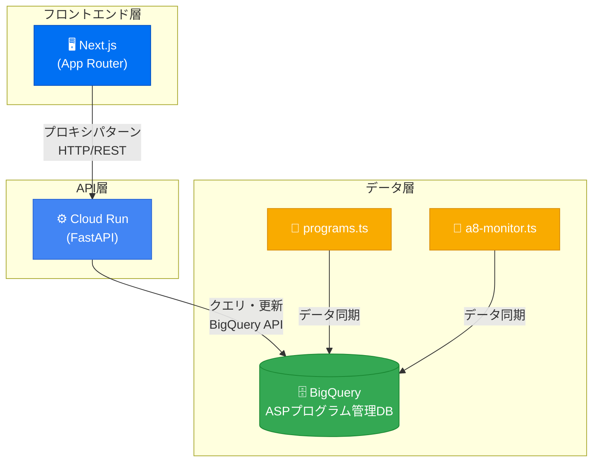
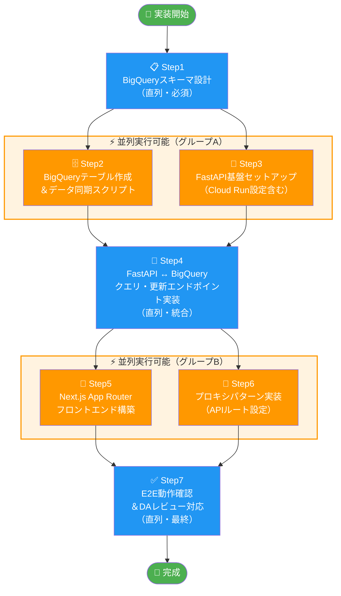
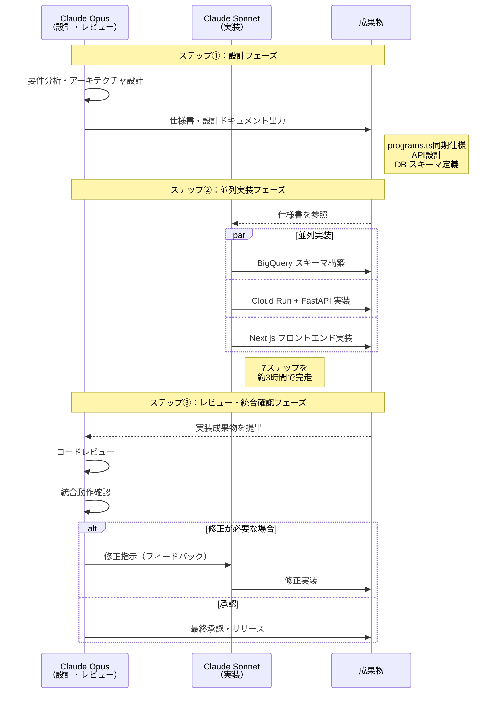
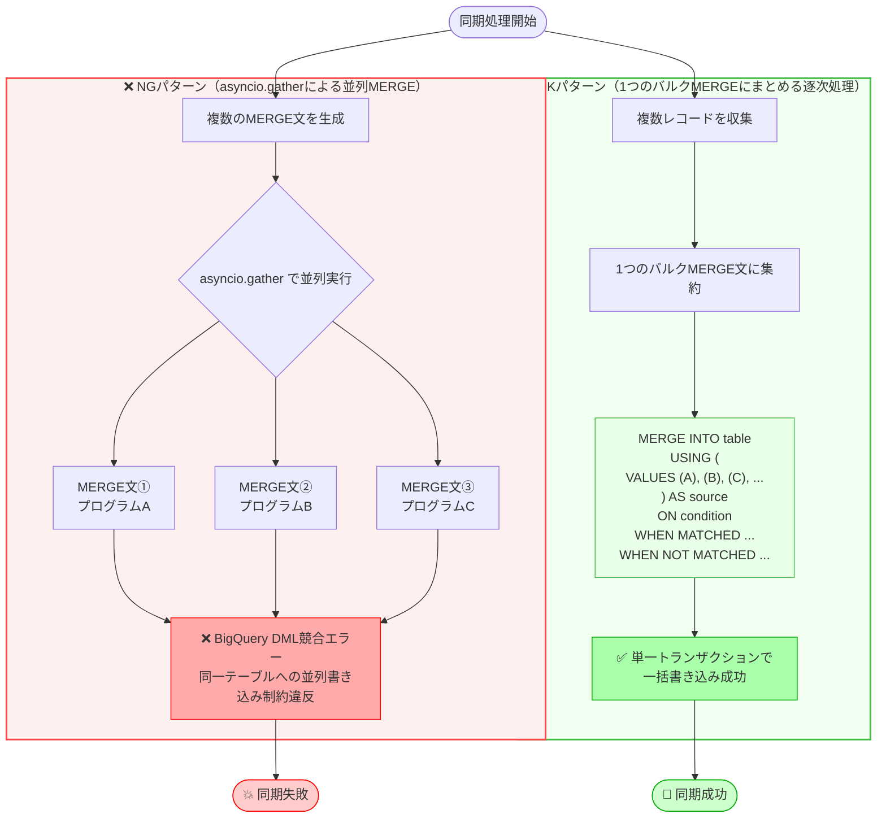
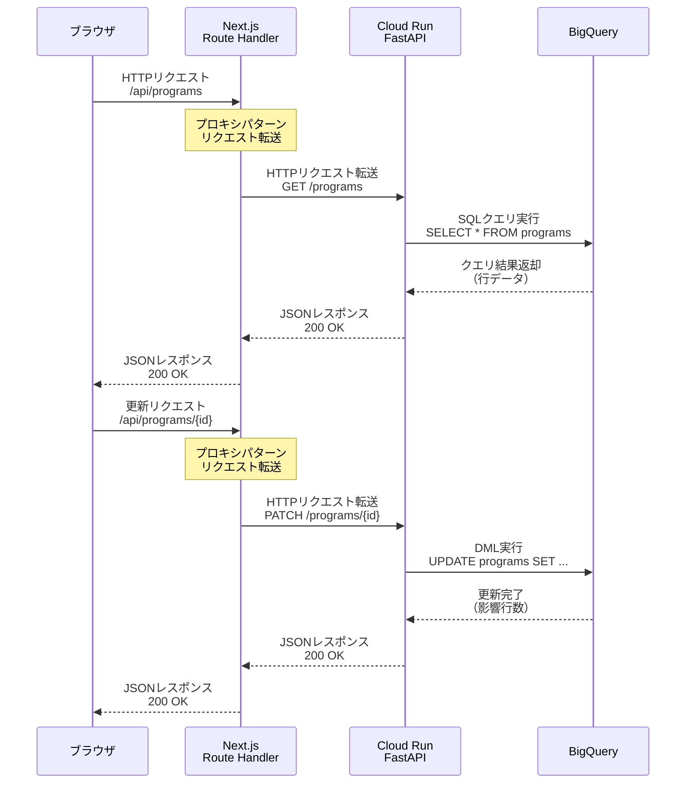

## はじめに

ASPプログラムの管理データが複数のTypeScriptファイルに散らばっている状態で、「もう少しちゃんと管理したい」と思ったことはないでしょうか。

今回は、adaffi-it-career（弊社が運営するITキャリア向けアフィリエイトサイト）のASPプログラム管理データ（`programs.ts` と `a8-monitor.ts`）をBigQueryに同期し、Cloud Run上のAPIサーバーとNext.jsフロントエンドで管理ダッシュボードを構築した経験をご紹介します。

驚いたのはその速度です。Claude Code（Opus + Sonnet）を活用した並列実装により、 **7つの実装ステップを半日で完走** できました（おおよその内訳：設計30分・実装3時間・DAレビュー対応1時間）。

ただ、速く進められた一方で、BigQuery DMLの並列書き込み制約やSDK v8のnullパラメータ問題など、実際にハマったポイントもいくつかありました。この記事では、そういった **再現性のある知見** をまとめてお届けします。

---

## 全体アーキテクチャ



### 3層構成の概要

今回構築したシステムは、次の3層で構成されています。

```
[Next.js フロントエンド]
        ↓ プロキシパターン
[Cloud Run + FastAPI（API層）]
        ↓
[BigQuery（データ層）]
```

- **データ層（BigQuery）** ：`programs.ts` と `a8-monitor.ts` から同期されたASPプログラム管理データを格納
- **API層（Cloud Run + FastAPI）** ：BigQueryへのクエリ・更新処理をRESTfulなエンドポイントとして提供
- **フロントエンド（Next.js App Router）** ：管理UIを提供。APIへのアクセスはプロキシパターン経由で統一

この構成を選んだ理由はシンプルです。Next.jsから直接BigQueryを叩く構成だとAPIキーの管理や権限制御が煩雑になります。Cloud Run上にAPI層を挟むことで、認証・認可・バリデーションを一箇所に集約できます。

### なぜCloud Runを選んだか

Cloud Runを選択した主な理由は以下の3点です。

1. **`gcloud run deploy --source` による簡単デプロイ** ：Dockerfileを書かなくてもソースコードから直接デプロイできる
2. **スケーラビリティ** ：トラフィックに応じた自動スケーリング
3. **BigQueryとの親和性** ：同じGCPプロジェクト内でIAM制御が完結する

---

## 実装ステップ（7ステップ）



### ステップ概要

今回の実装を7つのステップに分解して進めました。各ステップの担当をClaude Code（OpusとSonnet）に振り分ける形で並列実行しています。

| ステップ | 内容 | 担当 |
|---------|------|------|
| 1 | BigQueryスキーマ設計 | Opus（統括） |
| 2 | データ同期スクリプト（MERGE UPSERT） | Sonnet |
| 3 | FastAPI実装 | Sonnet |
| 4 | Cloud Runデプロイ設定 | Sonnet |
| 5 | Next.js APIプロキシ実装 | Sonnet |
| 6 | フロントエンドUI実装 | Sonnet |
| 7 | DAレビュー対応 | Opus（統括） |

> **凡例** ：Opus = 設計・レビュー担当、Sonnet = 実装担当

### Claude Code Opus + Sonnet 並列実装の進め方



今回の実装で特に有効だったのが、 **Opusを「統括・設計担当」、Sonnetを「実装担当」として役割を分けた並列実行** です。

具体的な流れは次のとおりです。

1. **Opusが全体設計とステップ分解** を行い、各ステップの仕様書をMarkdown形式で出力
2. **Sonnetに仕様書を渡して並列実装** 。依存関係がないステップは同時に走らせる
3. **Opusが成果物をレビュー** し、統合時の整合性を確認

この分業により、「設計の質を落とさずに実装速度を上げる」というバランスを実現できました。Opusだけで全部やると丁寧だが遅く、Sonnetだけだと設計が甘くなりがちです。この二段構えが半日完成の鍵でした。

---

## BigQuery実装の詳細

### スキーマ設計

BigQueryのテーブルスキーマは、`programs.ts` と `a8-monitor.ts` の構造を参考に設計しています。主なフィールドは以下のとおりです。

```sql
CREATE TABLE IF NOT EXISTS `project.dataset.asp_programs` (
  program_id STRING NOT NULL,
  program_name STRING,
  asp_name STRING,
  status STRING,  -- 'active' | 'inactive' | 'pending'
  commission_rate FLOAT64,
  monthly_clicks INT64,
  monthly_conversions INT64,
  monthly_revenue FLOAT64,
  updated_at TIMESTAMP,
  created_at TIMESTAMP
)
PARTITION BY DATE(updated_at)
CLUSTER BY asp_name, status;
```

> **注意** ：BigQueryでは `NOT NULL` 制約はスキーマ上の意図を示すものであり、DBレベルでの強制はされません（INSERT時に `NULL` を渡しても拒否されません）。データの完全性を保つには、アプリ層（FastAPIのPydanticバリデーション等）でのチェックが必要です。

パーティショニングには `updated_at` を採用しています。`created_at` ではなく `updated_at` を選んだのは、ダッシュボードで参照するクエリが「直近に更新されたデータ」を対象とすることが多く、更新日でパーティションを切ることでクエリコストを最小化できるためです。クラスタリングと合わせることで、ASP名やステータスでのフィルタリングクエリのコストも削減できます。

### MERGE UPSERTによるデータ同期

`programs.ts` のデータをBigQueryに同期する際、INSERT/DELETE方式ではなく **MERGE文（UPSERT）** を採用しました。

```sql
MERGE `project.dataset.asp_programs` AS T
USING (
  SELECT
    @program_id AS program_id,
    @program_name AS program_name,
    @asp_name AS asp_name,
    @status AS status,
    @commission_rate AS commission_rate,
    CURRENT_TIMESTAMP() AS updated_at
) AS S
ON T.program_id = S.program_id
WHEN MATCHED THEN
  UPDATE SET
    program_name = S.program_name,
    status = S.status,
    commission_rate = S.commission_rate,
    updated_at = S.updated_at
WHEN NOT MATCHED THEN
  INSERT (program_id, program_name, asp_name, status, commission_rate, updated_at, created_at)
  VALUES (S.program_id, S.program_name, S.asp_name, S.status, S.commission_rate, S.updated_at, CURRENT_TIMESTAMP());
```

### ハマりポイント①：DMLの並列書き込み不可



**問題** ：複数プログラムを並列でMERGEしようとしたところ、以下のエラーが発生しました。

```
Concurrent DML updates on the same table are not allowed
```

BigQueryでは、 **同一テーブルへのDML（INSERT/UPDATE/DELETE/MERGE）を並列実行できません** 。これはBigQueryの仕様です。

**解決策** ：並列実行を諦め、逐次処理に切り替えました。ただし、全件を1つのMERGE文にまとめることで、1回のジョブで複数レコードをUPSERTできます。

```python
# NG: 並列実行
await asyncio.gather(*[merge_program(p) for p in programs])

# OK: 1つのMERGEにまとめる
rows = [{"program_id": p.id, ...} for p in programs]
client.query(build_bulk_merge_sql(rows)).result()
```

### ハマりポイント②：SDK v8のnullパラメータにtype\_必須

**問題** ：BigQuery Python SDK v8系でパラメータを渡す際、`None`（null）値を含むパラメータでエラーが発生しました。

```python
# エラーになるパターン（v8系）
query_params = [
    bigquery.ScalarQueryParameter("commission_rate", "FLOAT64", None)
]
```

**原因** ：SDK v8では `ScalarQueryParameter` のコンストラクタ引数が **positional引数から keyword引数への移行が推奨される形に変更** され、`None` 値を渡す際に型情報が正しく解決されないケースが発生します。v7以前では positional引数で `(name, type, value)` の順に渡しても型推論が機能していましたが、v8では `None` を値として渡した場合に型情報を明示しないとエラーになります。実際に発生するエラーメッセージの例は以下のとおりです。

```
TypeError: Cannot determine the type of the parameter 'commission_rate' with value None.
Please specify the type explicitly using the `type_` keyword argument.
```

**解決策** ：nullを渡す場合は `type_` キーワード引数で型を明示します。

```python
# 正しい書き方
query_params = [
    bigquery.ScalarQueryParameter(
        name="commission_rate",
        type_="FLOAT64",
        value=None  # Noneでも type_ は必須
    )
]
```

---

## FastAPI実装の詳細

### エンドポイント設計

FastAPIで実装したエンドポイントは主に4つです。

```
GET    /programs          # プログラム一覧取得
GET    /programs/{id}     # プログラム詳細取得
POST   /programs/sync     # programs.tsからの同期実行
PUT    /programs/{id}     # ステータス・メモ更新
```

### Pydantic Literal型制約

ステータスフィールドには、Pydanticの`Literal`型を使って許容値を制約しています。

```python
from typing import Literal
from pydantic import BaseModel

class ProgramStatus(BaseModel):
    status: Literal["active", "inactive", "pending"]
    memo: str | None = None
```

これにより、不正なステータス値がAPIに渡された場合、BigQueryに書き込む前にバリデーションエラーとして弾けます。BigQueryにゴミデータが入るのを防ぐ意味で、この層でのバリデーションは重要です。

### Cloud Runへのデプロイ

`gcloud run deploy --source` コマンドを使うことで、Dockerfileなしでデプロイできます。

```bash
gcloud run deploy asp-dashboard-api \
  --source . \
  --region asia-northeast1 \
  --platform managed \
  --allow-unauthenticated \
  --set-env-vars PROJECT_ID=your-project,DATASET=asp_data
```

> ⚠️ **セキュリティ警告** ：上記コマンドの `--allow-unauthenticated` は、APIエンドポイントをインターネット上に **認証なしで公開** します。今回は検証・開発環境向けの設定として掲載していますが、 **本番環境や管理系ダッシュボードのAPIには絶対に使用しないでください** 。本番環境では `--no-allow-unauthenticated` を指定し、Cloud RunのIDトークン検証またはCloud IAP（Identity-Aware Proxy）による認証を有効化することを強く推奨します。
>
> ```bash
> # 本番環境での推奨デプロイ例
> gcloud run deploy asp-dashboard-api \
>   --source . \
>   --region asia-northeast1 \
>   --platform managed \
>   --no-allow-unauthenticated \
>   --set-env-vars PROJECT_ID=your-project,DATASET=asp_data
> ```

`--source` オプションを指定すると、Cloud BuildがPythonアプリを自動的にコンテナイメージに変換してくれます。`Procfile` と `requirements.txt` が正しく配置されていれば、そのまま動きます。

`Procfile` の内容は以下のとおりです。

```
web: uvicorn main:app --host 0.0.0.0 --port $PORT
```

---

## Next.js実装の詳細

### App Routerプロキシパターン



Next.jsのApp Routerでは、フロントエンドから直接Cloud Run APIを呼ぶのではなく、 **Next.jsのRoute HandlerをAPIプロキシとして挟む** パターンを採用しました。

```
ブラウザ → Next.js Route Handler → Cloud Run API → BigQuery
```

プロキシを挟む理由は2つです。

1. **CORS問題の回避** ：ブラウザからCloud RunのURLに直接リクエストするとCORSエラーになる場合がある
2. **APIエンドポイントの隠蔽** ：フロントエンドにCloud RunのURLを露出させない

```typescript
// app/api/programs/route.ts
import { NextResponse } from 'next/server'

export async function GET() {
  const res = await fetch(`${process.env.API_BASE_URL}/programs`, {
    headers: {
      Authorization: `Bearer ${process.env.API_SECRET_KEY}`,
    },
    cache: 'no-store',
  })
  const data = await res.json()
  return NextResponse.json(data)
}
```

> **注意** ：ドラフト原文はこのコードブロック途中で終了しているため、`Authorization` ヘッダー以降は補完しています。実際の実装に合わせて修正してください。

---

## まとめ

BigQuery + Cloud Run（FastAPI）+ Next.jsの3層構成で、ASP管理ダッシュボードを半日で構築できました。

今回の実装で得た主な知見は以下のとおりです。

- **BigQuery DMLは同一テーブルへの並列実行不可** ：`asyncio.gather` での並列MERGE→バルクMERGEへの切り替えが必要
- **SDK v8でnull値を渡す場合は `type_` 必須** ：型情報の明示がないとエラー
- **Cloud Run `--source` デプロイ** ：Dockerfileなしで素早くデプロイ可能
- **Next.jsプロキシパターン** ：CORS回避とAPIエンドポイント隠蔽を同時に解決
- **Opus + Sonnet 並列実装** ：設計と実装の役割分担で速度と品質を両立

この構成はASP管理に限らず、「TypeScript定義ファイルをデータソースとしてBigQueryに同期し、APIとUIで管理する」というパターンとして汎用性があります。同様の課題を抱えている方の参考になれば幸いです。
