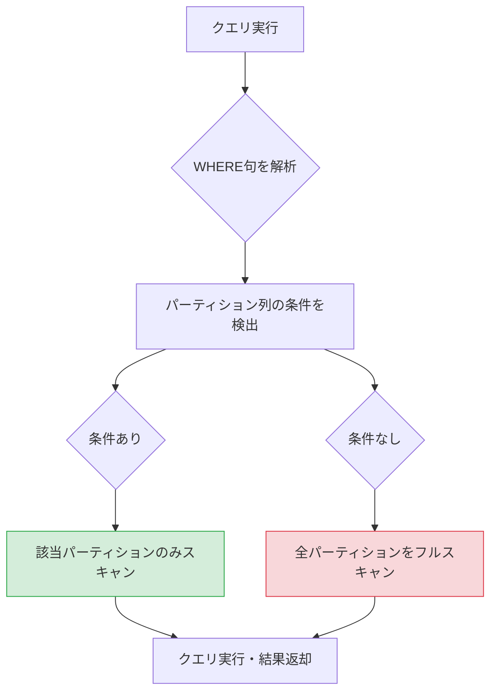
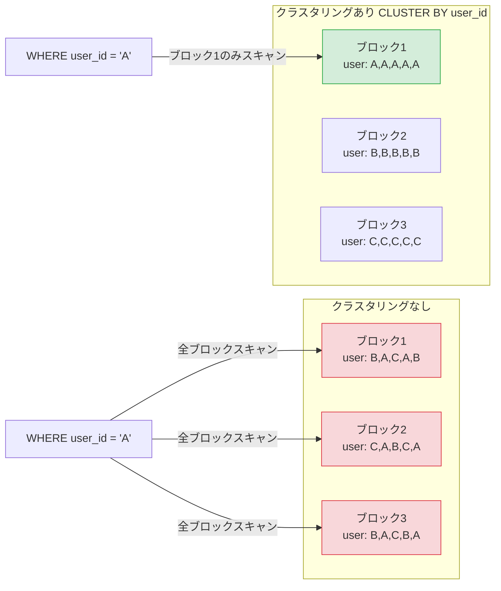

## はじめに

BigQuery はフルマネージドのデータウェアハウスとして非常に強力ですが、何も考えずにテーブルにクエリを投げ続けると、月末に予想外のクラウド費用が発生することがあります。

「なぜこんなにコストがかかっているのか」と調べると、多くの場合は毎回テーブル全体をスキャンしているフルスキャンが原因です。100GBのテーブルを1日100回クエリするだけで、月間の処理量は約300TBに達します。BigQuery のオンデマンド料金は1TBあたり $6.25 ですので、その分のコストは約 $1,875 にもなります。

これを解決するのが、パーティションとクラスタリングの2つの機能です。

この2つは別々に説明されることが多いですが、組み合わせて使うことで相乗効果が得られます。本記事では「両者の組み合わせパターン」「実際のコスト削減計算」「INFORMATION_SCHEMAでの効果確認」まで実践的に解説します。

---

## パーティションの種類と選び方

BigQuery のパーティションには4種類あります。用途に応じて適切なものを選んでください。

### 1. DATE/TIMESTAMP パーティション（最も一般的）

日付または時刻でテーブルを分割します。ログデータや時系列データに最適です。

```sql
-- DATE パーティション
CREATE TABLE `project.dataset.access_logs` (
  log_id      STRING NOT NULL,
  log_date    DATE   NOT NULL,
  user_id     STRING,
  endpoint    STRING,
  status_code INT64,
  response_ms INT64
)
PARTITION BY log_date
OPTIONS (
  partition_expiration_days = 365  -- 1年以上古いパーティションを自動削除
);

-- TIMESTAMP パーティション（時間単位まで指定可能）
CREATE TABLE `project.dataset.event_stream` (
  event_id        STRING    NOT NULL,
  event_timestamp TIMESTAMP NOT NULL,
  user_id         STRING,
  event_type      STRING,
  properties      JSON
)
PARTITION BY DATE(event_timestamp)
OPTIONS (
  require_partition_filter = TRUE  -- パーティション条件なしのクエリをブロック
);
```

`require_partition_filter = TRUE` を設定すると、WHERE 句にパーティション列の条件を含まないクエリがエラーになります。誤ってフルスキャンを実行することを防ぐ安全装置として有効です。

### 2. 整数範囲パーティション

数値 ID などの整数カラムで分割します。顧客 ID やユーザー ID がある程度の範囲に収まる場合に使います。

```sql
CREATE TABLE `project.dataset.user_activity` (
  user_id     INT64  NOT NULL,
  activity_date DATE,
  action_type STRING,
  created_at  TIMESTAMP
)
PARTITION BY RANGE_BUCKET(user_id, GENERATE_ARRAY(0, 1000000, 10000));
-- user_id を 10,000 単位でパーティション分割
```

### 3. 取り込みタイムパーティション

データが BigQuery に取り込まれた時刻（`_PARTITIONTIME`）で自動的に分割されます。テーブルにパーティション列を追加したくない場合に便利です。

```sql
CREATE TABLE `project.dataset.raw_events`
PARTITION BY _PARTITIONDATE
OPTIONS (
  partition_expiration_days = 90
);
```

取り込みタイムパーティションは `_PARTITIONTIME` または `_PARTITIONDATE` という擬似列でフィルタリングします。

```sql
-- 取り込みタイムパーティションへのクエリ
SELECT *
FROM `project.dataset.raw_events`
WHERE _PARTITIONDATE = '2026-02-23'
```

### パーティション種別の選び方

| データの特性 | 推奨パーティション |
|------------|----------------|
| イベントログ・アクセスログ | DATE/TIMESTAMP |
| バッチ取り込みデータ（日付カラムあり） | DATE |
| リアルタイムストリーム | TIMESTAMP |
| スキーマ変更が多い生データ | 取り込みタイム |
| 整数 ID による分割が有効な場合 | 整数範囲 |

---

## パーティション刈り込みの仕組み

パーティション刈り込み（Partition Pruning）とは、クエリの WHERE 句の条件を解析して、スキャンが不要なパーティションを処理前に除外する仕組みです。



刈り込みが効くクエリと効かないクエリの違いを見てみましょう。

```sql
-- 刈り込みが効く（コスト低）
SELECT
  user_id,
  COUNT(*) AS event_count
FROM `project.dataset.access_logs`
WHERE log_date = '2026-02-23'         -- パーティション列を直接指定
  AND log_date BETWEEN '2026-02-01' AND '2026-02-28'  -- 範囲指定も有効
GROUP BY user_id;

-- 刈り込みが効かない（コスト高）
SELECT
  user_id,
  COUNT(*) AS event_count
FROM `project.dataset.access_logs`
WHERE DATE(created_at) = '2026-02-23'  -- 関数で包むと刈り込み無効
GROUP BY user_id;
```

パーティション列を関数で包む（`DATE(created_at)` や `TIMESTAMP_TRUNC(ts, DAY)` など）と、刈り込みが効かなくなることに注意してください。カラム自体が `DATE` 型であれば、直接 `WHERE log_date = '...'` と書く必要があります。

---

## クラスタリングの仕組みと選択基準

クラスタリングとは、指定したカラムの値でテーブル内のデータを物理的にソート・グループ化する機能です。BigQuery は1つのパーティション（またはテーブル全体）を複数の「ブロック」に分割して管理しており、クラスタリングカラムの値に基づいてブロックを整理します。



クラスタリングカラムの選択基準は以下のとおりです。

1. WHERE 句や JOIN 条件で頻繁に使うカラム
2. GROUP BY で使うカラム
3. カーディナリティが高すぎず・低すぎないカラム（user_id、campaign_id、event_type など）

最大4カラムまで指定でき、指定した順序が重要です。最初のカラムが最も選択性の高いフィルタに使われる前提で設計してください。

```sql
-- 良い例: WHERE句での利用頻度が高い順に並べる
CLUSTER BY user_id, event_type, status

-- 悪い例: カーディナリティが極端に低いカラムを先頭に
CLUSTER BY is_active, user_id  -- is_active は TRUE/FALSE の2値 → 刈り込み効果が薄い
```

---

## 組み合わせパターン

パーティションとクラスタリングを組み合わせることで、2段階のスキャン削減が実現します。

### パターン1: 時系列ログテーブル

アクセスログ、イベントログ、アプリケーションログなど日付ごとに蓄積するデータの標準構成です。

```sql
CREATE TABLE `project.dataset.app_events` (
  event_id        STRING    NOT NULL,
  event_date      DATE      NOT NULL,
  event_timestamp TIMESTAMP NOT NULL,
  user_id         STRING    NOT NULL,
  session_id      STRING,
  event_type      STRING    NOT NULL,  -- 'click', 'view', 'purchase' など
  page_path       STRING,
  properties      JSON,
  created_at      TIMESTAMP
)
PARTITION BY event_date
CLUSTER BY user_id, event_type
OPTIONS (
  partition_expiration_days = 730,  -- 2年保持
  require_partition_filter  = TRUE
);
```

典型的なクエリとその効果を確認します。

```sql
-- 特定日・特定ユーザーの行動履歴
-- パーティション刈り込み: 1日分のみスキャン
-- クラスタリング: user_id ブロックのみスキャン
SELECT
  event_type,
  page_path,
  event_timestamp
FROM `project.dataset.app_events`
WHERE event_date = '2026-02-23'
  AND user_id    = 'usr_12345'
ORDER BY event_timestamp;
```

### パターン2: IoTセンサーデータ

デバイスID とセンサー種別で検索が多いパターンです。

```sql
CREATE TABLE `project.dataset.sensor_readings` (
  reading_id    STRING    NOT NULL,
  reading_date  DATE      NOT NULL,
  recorded_at   TIMESTAMP NOT NULL,
  device_id     STRING    NOT NULL,
  sensor_type   STRING    NOT NULL,  -- 'temperature', 'humidity', 'pressure'
  value         FLOAT64,
  unit          STRING,
  location_id   STRING
)
PARTITION BY reading_date
CLUSTER BY device_id, sensor_type, location_id
OPTIONS (
  partition_expiration_days = 1095  -- 3年保持
);
```

### パターン3: 広告パフォーマンスデータ

日次で集計される広告指標をキャンペーン・広告グループ軸で高速に集計するパターンです。

```sql
CREATE TABLE `project.dataset.ad_performance_daily` (
  stats_date    DATE   NOT NULL,
  account_id    STRING NOT NULL,
  campaign_id   STRING NOT NULL,
  ad_group_id   STRING NOT NULL,
  ad_id         STRING,
  impressions   INT64,
  clicks        INT64,
  cost_micros   INT64,  -- マイクロ円（1円 = 1,000,000 マイクロ円）
  conversions   FLOAT64,
  conv_value    FLOAT64
)
PARTITION BY stats_date
CLUSTER BY account_id, campaign_id, ad_group_id;
```

```sql
-- キャンペーン別の月次集計
-- パーティション: 当月31日分のみスキャン
-- クラスタリング: account_id → campaign_id でブロックを絞り込み
SELECT
  campaign_id,
  SUM(impressions)                                       AS total_impressions,
  SUM(clicks)                                            AS total_clicks,
  SAFE_DIVIDE(SUM(clicks), SUM(impressions)) * 100       AS ctr,
  SUM(cost_micros) / 1000000.0                           AS total_cost,
  SAFE_DIVIDE(SUM(conversions), SUM(clicks)) * 100       AS cvr
FROM `project.dataset.ad_performance_daily`
WHERE stats_date BETWEEN '2026-02-01' AND '2026-02-28'
  AND account_id = 'acc_9876'
GROUP BY campaign_id
ORDER BY total_cost DESC;
```

### パターン4: マスターデータ（パーティションなし）

パーティションを使わず、クラスタリングのみを設定するパターンです。更新頻度が低く、件数が少ない（数百万行以下）マスターデータに適します。

```sql
CREATE TABLE `project.dataset.product_master` (
  product_id   STRING  NOT NULL,
  product_name STRING,
  category     STRING  NOT NULL,
  subcategory  STRING,
  brand        STRING,
  price        NUMERIC,
  is_active    BOOL,
  created_at   TIMESTAMP,
  updated_at   TIMESTAMP
)
CLUSTER BY category, subcategory, brand;
-- パーティションなし＋クラスタリングのみ
-- 数百万件以下であればこの構成が最もシンプル
```

---

## テーブル定義例: 本番で使える完全版

実際のプロダクションで使える、パーティション+クラスタリング+オプションをすべて設定したテーブル定義例を紹介します。

```sql
-- SaaS プロダクトのユーザーイベントテーブル
CREATE TABLE IF NOT EXISTS `project.analytics.user_events` (
  -- 主キー相当
  event_id        STRING    NOT NULL,
  event_date      DATE      NOT NULL,  -- パーティション列（必須）

  -- イベント情報
  event_timestamp TIMESTAMP NOT NULL,
  event_type      STRING    NOT NULL,  -- 'page_view', 'click', 'form_submit' など
  event_category  STRING,

  -- ユーザー情報
  user_id         STRING,
  session_id      STRING,
  anonymous_id    STRING,

  -- コンテキスト
  page_path       STRING,
  referrer        STRING,
  utm_source      STRING,
  utm_medium      STRING,
  utm_campaign    STRING,

  -- デバイス情報
  device_type     STRING,  -- 'desktop', 'mobile', 'tablet'
  browser         STRING,
  os              STRING,
  country_code    STRING,

  -- メトリクス
  duration_ms     INT64,
  scroll_depth    FLOAT64,

  -- メタデータ
  properties      JSON,
  created_at      TIMESTAMP NOT NULL
)
PARTITION BY event_date
CLUSTER BY user_id, event_type, event_category
OPTIONS (
  partition_expiration_days = 730,   -- 2年でパーティション自動削除
  require_partition_filter  = TRUE,  -- フルスキャン禁止
  description = 'ユーザーイベントテーブル。パーティション: event_date（日単位）, クラスタ: user_id, event_type, event_category'
);
```

テーブル作成後、既存テーブルにパーティションとクラスタリングを追加する場合は `CREATE OR REPLACE TABLE` を使用するか、DDL の `ALTER TABLE` でオプションを変更します。ただし、パーティション定義はテーブル作成時にしか指定できないため、既存テーブルに後から追加することはできません。

---

## コスト削減計算（Before/After）

実際の数値でコスト削減効果を試算します。

### 前提条件

- テーブルサイズ: 1TB（1日 5GB × 200日分）
- 日次クエリ実行回数: 50回
- クエリは常に「特定日 + 特定ユーザーの集計」

### Before: パーティション・クラスタリングなし

```
1回のクエリスキャン量 = 1TB（テーブル全体）
1日のスキャン量      = 1TB × 50回 = 50TB
1ヶ月のスキャン量    = 50TB × 30日 = 1,500TB
月間コスト           = 1,500TB × $6.25/TB = $9,375
```

### After: パーティション（日付）+ クラスタリング（user_id, event_type）

```
パーティション刈り込み効果: 200日分 → 1日分 = 1/200
クラスタリング効果:         全ユーザー → 特定ユーザーブロックのみ = 約 1/50（仮定）

1回のクエリスキャン量 = 1TB × (1/200) × (1/50) ≒ 0.0001TB = 100MB
1日のスキャン量      = 100MB × 50回 = 5GB
1ヶ月のスキャン量    = 5GB × 30日 = 150GB = 0.15TB
月間コスト           = 0.15TB × $6.25/TB ≒ $0.94
```

| 項目 | Before | After | 削減率 |
|------|--------|-------|--------|
| 1回クエリスキャン量 | 1TB | 100MB | 99.99% |
| 月間スキャン量 | 1,500TB | 0.15TB | 99.99% |
| 月間コスト | $9,375 | $0.94 | 99.99% |

実際の削減効果はデータの分布やクエリパターンによりますが、「日付フィルタ＋特定カラムフィルタ」というよくあるクエリパターンでは、パーティションとクラスタリングの組み合わせによって大幅なコスト削減が見込めます。

クラスタリングによる削減率は保証値ではなく、データの分布（cluster cardinality）やクエリの選択性によって変わります。公式ドキュメントでは「クラスタリング対象カラムにフィルタがある場合、スキャン量が削減される」と説明されており、実際の削減率はクエリを実行してみて確認してください。

---

## INFORMATION_SCHEMA で効果を確認

設定した内容が実際に効いているかを確認するために、`INFORMATION_SCHEMA` を活用します。

### パーティション情報の確認

```sql
-- テーブルのパーティション一覧とサイズを確認
SELECT
  table_name,
  partition_id,
  total_rows,
  total_logical_bytes / POW(1024, 3) AS size_gb,
  last_modified_time
FROM `project.dataset.INFORMATION_SCHEMA.PARTITIONS`
WHERE table_name = 'app_events'
ORDER BY partition_id DESC
LIMIT 30;
```

### クエリのスキャン量を確認

```sql
-- 過去1日のクエリとスキャン量（プロジェクト全体）
SELECT
  job_id,
  query,
  ROUND(total_bytes_processed / POW(1024, 3), 2)  AS processed_gb,
  ROUND(total_bytes_billed    / POW(1024, 3), 2)  AS billed_gb,
  ROUND(total_bytes_billed / POW(1024, 4) * 6.25, 4) AS estimated_cost_usd,
  creation_time,
  end_time,
  TIMESTAMP_DIFF(end_time, creation_time, SECOND) AS duration_sec
FROM `region-asia-northeast1`.INFORMATION_SCHEMA.JOBS_BY_PROJECT
WHERE creation_time > TIMESTAMP_SUB(CURRENT_TIMESTAMP(), INTERVAL 1 DAY)
  AND statement_type = 'SELECT'
  AND error_result IS NULL
ORDER BY total_bytes_processed DESC
LIMIT 20;
```

### パーティション刈り込みが効いているかの確認

```sql
-- 同じテーブルへのクエリを比較する
-- 刈り込みが効いていれば total_bytes_processed が少ない

WITH recent_queries AS (
  SELECT
    job_id,
    SUBSTR(query, 1, 200)                               AS query_preview,
    total_bytes_processed / POW(1024, 3)                AS processed_gb,
    total_bytes_billed    / POW(1024, 3)                AS billed_gb,
    creation_time
  FROM `region-asia-northeast1`.INFORMATION_SCHEMA.JOBS_BY_PROJECT
  WHERE creation_time > TIMESTAMP_SUB(CURRENT_TIMESTAMP(), INTERVAL 7 DAY)
    AND REGEXP_CONTAINS(query, r'app_events')
    AND statement_type = 'SELECT'
    AND error_result IS NULL
)
SELECT
  query_preview,
  ROUND(AVG(processed_gb), 3) AS avg_processed_gb,
  ROUND(MIN(processed_gb), 3) AS min_processed_gb,
  ROUND(MAX(processed_gb), 3) AS max_processed_gb,
  COUNT(*)                    AS query_count
FROM recent_queries
GROUP BY query_preview
ORDER BY avg_processed_gb DESC;
```

### テーブルストレージの確認

```sql
-- データセット内のテーブル一覧とストレージサイズ
SELECT
  table_name,
  ROUND(size_bytes / POW(1024, 3), 2) AS size_gb,
  row_count,
  ROUND(size_bytes / NULLIF(row_count, 0), 0) AS bytes_per_row
FROM (
  SELECT
    table_id                        AS table_name,
    SUM(size_bytes)                 AS size_bytes,
    SUM(row_count)                  AS row_count
  FROM `project.dataset.__TABLES__`
  GROUP BY table_id
)
ORDER BY size_bytes DESC;
```

---

## よくある間違いと対処法

### 間違い1: パーティション列を関数で包む

```sql
-- NG: 刈り込みが効かない
WHERE DATE(event_timestamp) = '2026-02-23'
WHERE CAST(event_date AS STRING) = '2026-02-23'

-- OK: パーティション列を直接フィルタリング
WHERE event_date = '2026-02-23'
WHERE event_date BETWEEN '2026-02-01' AND '2026-02-28'
```

パーティション列が `TIMESTAMP` 型の場合は `DATE(event_timestamp)` を使わず、`event_timestamp >= '2026-02-23' AND event_timestamp < '2026-02-24'` のように範囲指定します。

### 間違い2: MERGE の ON 条件にパーティション列を含めない

MERGE 文でも、ターゲットテーブルにパーティション刈り込みを効かせるには ON 条件にパーティション列を含める必要があります。

```sql
-- NG: 全パーティションをスキャン（コスト高）
MERGE `project.dataset.app_events` AS T
USING staging AS S
ON T.event_id = S.event_id

-- OK: ON条件にパーティション列を含める
MERGE `project.dataset.app_events` AS T
USING staging AS S
ON T.event_id   = S.event_id
   AND T.event_date = S.event_date  -- パーティション列を必ず含める
```

### 間違い3: クラスタリングカラムの順序を間違える

クラスタリングカラムは「クエリで最も絞り込み効果が高い順」に指定します。

```sql
-- NG: 選択性の低いカラムを先頭に
CLUSTER BY is_active, user_id, event_type
-- is_active は TRUE/FALSE の2値しかないため先頭に置いても効果が薄い

-- OK: 選択性の高いカラムを先頭に
CLUSTER BY user_id, event_type, is_active
```

### 間違い4: 件数が少ないテーブルにパーティションを設定する

パーティションの恩恵を受けるには、ある程度のデータ量が必要です。数万件程度のテーブルにパーティションを設定しても、管理コストが増えるだけでほとんどメリットはありません。目安として、1GB 以上のテーブルからパーティションを検討してください。

### 間違い5: クラスタリングを設定したが刈り込みを確認しない

クラスタリングは設定するだけでは不十分です。INFORMATION_SCHEMA でスキャン量を確認し、期待どおりに削減されているかを必ず検証してください。

```sql
-- クラスタリング前後のクエリスキャン量を比較
SELECT
  total_bytes_processed / POW(1024, 3) AS processed_gb
FROM `region-asia-northeast1`.INFORMATION_SCHEMA.JOBS_BY_PROJECT
WHERE job_id = 'your-job-id';
```

---

## まとめ

BigQuery のパーティションとクラスタリングを組み合わせると、「パーティション刈り込みで対象日付を絞る → クラスタリングで対象ブロックをさらに絞る」という2段階のスキャン削減が実現します。

設定のポイントを以下にまとめます。

- パーティション: 時系列データには DATE/TIMESTAMP を使う。`require_partition_filter` でフルスキャンを禁止する
- クラスタリング: WHERE/JOIN/GROUP BY で頻繁に使うカラムを選択性の高い順に最大4カラム指定する
- クエリ: パーティション列は関数で包まず直接フィルタリングする。MERGE の ON 条件にもパーティション列を含める
- 検証: INFORMATION_SCHEMA.JOBS_BY_PROJECT でスキャン量を定期的に確認する

パーティションとクラスタリングは設定すれば終わりではなく、実際のクエリパターンに合わせて継続的に調整することが重要です。INFORMATION_SCHEMA を活用して効果を数値で確認しながら、コストと速度の最適化を進めてみてください。

---

## 参考リンク

- [BigQuery パーティション分割テーブルの概要](https://cloud.google.com/bigquery/docs/partitioned-tables)
- [BigQuery クラスタ化テーブルの概要](https://cloud.google.com/bigquery/docs/clustered-tables)
- [INFORMATION_SCHEMA の概要](https://cloud.google.com/bigquery/docs/information-schema-intro)
- [BigQuery の料金](https://cloud.google.com/bigquery/pricing)
