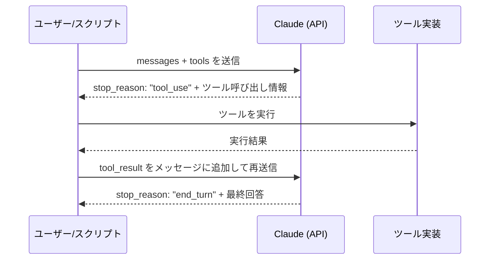
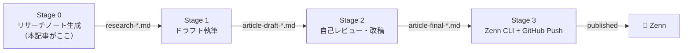

## はじめに

「Claude Code でエージェントを作る」という言葉を聞いて、実際に何が動くのかイメージできるでしょうか。

チュートリアルの `hello world` 的な例は増えてきましたが、「実際に運用して価値が出ている」実装の話はまだ少ない印象です。本記事では、筆者が実際に動かしている3つのエージェントを、コードとともに紹介します。

なお、**この記事自体が Zenn 自動公開パイプラインのアウトプット**です。リサーチノート生成（Stage 0）から記事執筆（Stage 1）、レビュー（Stage 2）、公開（Stage 3）まで、Claude Code のエージェントループで処理されています。「自分自身を公開するパイプライン」という少しメタな構造ですが、それ自体が最も正直な実証になると考えました。

---

## 前提知識 ─ Claude Code のエージェントループを5分で理解する

### tool_use の仕組み

Claude Code（ここでは Anthropic Python SDK を使った API 実装を指します）のエージェント動作の核心は、`tool_use` と `tool_result` のメッセージサイクルです。



Claude は「次にどのツールを呼ぶか」を判断し、スクリプト側がそれを実行して結果を返す。このサイクルを `end_turn` が返るまで繰り返すのが基本パターンです。

最小構成のエージェントループはこうなります。

```python
import anthropic

client = anthropic.Anthropic()

def run_agent(system_prompt: str, user_message: str, tools: list) -> str:
    messages = [{"role": "user", "content": user_message}]
    max_iterations = 10

    for _ in range(max_iterations):
        response = client.messages.create(
            model="claude-sonnet-4-5",
            max_tokens=4096,
            system=system_prompt,
            tools=tools,
            messages=messages,
        )

        # end_turn なら完了
        if response.stop_reason == "end_turn":
            return response.content[0].text

        # tool_use なら実行してループ継続
        if response.stop_reason == "tool_use":
            # Claude の応答をメッセージ履歴に追加
            messages.append({"role": "assistant", "content": response.content})

            # ツール呼び出しを処理
            tool_results = []
            for block in response.content:
                if block.type == "tool_use":
                    result = execute_tool(block.name, block.input)
                    tool_results.append({
                        "type": "tool_result",
                        "tool_use_id": block.id,
                        "content": result,
                    })

            messages.append({"role": "user", "content": tool_results})

    raise RuntimeError("max_iterations に達しました")
```

### 設計前に決めておく3つのこと

エージェントを作り始める前に、必ず以下3点を決めておくことをお勧めします。筆者はこれを後回しにして痛い目を見ました。

1. **ループ終了条件** ─ `max_iterations` は必ず設定する。「いつか止まるだろう」は甘い
2. **Human-in-the-loop の粒度** ─ どのタイミングで人間の確認を挟むか。削りすぎると取り返しのつかない操作が起きる
3. **ツールスコープの最小化** ─ ファイル書き込みや API 呼び出しは、本当に必要な権限だけに絞る

---

## 事例① Zenn 自動公開パイプライン ─ Stage 0〜3の全体像

### なぜ自動化したのか

Zenn への記事公開は、一見シンプルに見えて実は多くのステップがあります。

- テーマ選定・競合記事調査
- リサーチノート作成
- ドラフト執筆（目次作成→本文執筆）
- 自己レビュー・改稿
- frontmatter 設定（title / emoji / topics）
- zenn-cli でのプレビュー確認
- GitHub へのコミット・プッシュ

これを毎回手動でやっていると、「書くことへのエネルギー」より「作業管理のエネルギー」のほうが大きくなってしまいます。「仕組みを作れる自分が、仕組みを作らずに手作業している」という矛盾を解消したくて、パイプライン化に踏み切りました。

### パイプラインの全体アーキテクチャ



各 Stage は独立した Claude エージェントとして動作し、frontmatter の `status` フィールドでステータスを引き継ぎます。

```yaml
# Stage 0 完了後の frontmatter
status: "research_complete"
research_path: "research/research-claude-code-3-zenn.md"
target_keywords: ["Claude Code エージェント 実装", "tool_use 実例"]
```

### Stage 0 ─ リサーチエージェントの実装

Stage 0 のエージェントは、テーマに対して競合記事・公式ドキュメント・関連技術を調査し、構造化されたリサーチノートを生成します。

```python
# content_pipeline_auto.py (Stage 0 抜粋)

RESEARCH_TOOLS = [
    {
        "name": "web_search",
        "description": "Webを検索してページのコンテンツを取得する",
        "input_schema": {
            "type": "object",
            "properties": {
                "query": {"type": "string", "description": "検索クエリ"},
                "num_results": {"type": "integer", "default": 5},
            },
            "required": ["query"],
        },
    },
    {
        "name": "write_research_note",
        "description": "リサーチノートをMarkdownファイルとして書き出す",
        "input_schema": {
            "type": "object",
            "properties": {
                "filename": {"type": "string"},
                "content": {"type": "string"},
            },
            "required": ["filename", "content"],
        },
    },
]

STAGE_0_SYSTEM = """
あなたはZenn技術記事のリサーチアナリストです。
以下の観点でリサーチノートを作成してください:

1. ターゲット読者の明確化（セグメント別）
2. 既存記事との差別化ポイント
3. 必要なコード例・図解のリスト
4. 目次案（H2/H3レベル）
5. SEOキーワードマッピング

必ず write_research_note ツールでファイルを保存して終了すること。
"""

def run_stage_0(theme: str, output_dir: str) -> str:
    """Stage 0: リサーチノート生成"""
    user_message = f"""
    以下のテーマでZenn技術記事のリサーチノートを作成してください。
    テーマ: {theme}
    出力先: {output_dir}
    """
    return run_agent(STAGE_0_SYSTEM, user_message, RESEARCH_TOOLS)
```

### ハマりどころと解決策

**問題1: ループが止まらない**

最初の実装では `max_iterations` を設定しておらず、Claude がツールを呼び続けて API コストが膨れました。今は `max_iterations=15` を上限とし、超えた場合は例外を投げて Slack に通知する設計にしています。

**問題2: frontmatter の破壊**

Stage 1 のエージェントが「記事を書き直す」際に、frontmatter ごと上書きしてしまうことがありました。解決策は、ファイル書き込みツールを「frontmatter を分離してから書き込む」仕様にすることです。

```python
import frontmatter  # python-frontmatter

def safe_write_article(filepath: str, new_body: str, preserve_keys: list[str]):
    """frontmatterを保護しながら本文を更新する"""
    with open(filepath, "r") as f:
        post = frontmatter.load(f)

    # 保護フィールドを退避
    preserved = {k: post[k] for k in preserve_keys if k in post}

    # 本文を更新
    post.content = new_body

    # 保護フィールドを復元
    for k, v in preserved.items():
        post[k] = v

    with open(filepath, "wb") as f:
        frontmatter.dump(post, f)
```

**問題3: 冪等性の確保**

ネットワークエラー等で途中から再実行したとき、Stage 0 が再度実行されて別のリサーチノートが生成されてしまいました。各 Stage の開始時に `status` フィールドを確認し、完了済みならスキップする仕組みを追加しています。

---

## 事例② 業務自動化エージェント ─ 週次レポートの自動生成

### ユースケースの概要

複数の API（Google Analytics、BigQuery、freee）からデータを収集し、週次レポートを Markdown で生成して Slack に通知するエージェントです。以前は手作業で1〜2時間かかっていた作業が、5分程度で完了するようになりました。

### ツール設計の実装例

```python
REPORT_TOOLS = [
    {
        "name": "fetch_analytics_data",
        "description": "Google Analytics 4からサイト指標を取得する",
        "input_schema": {
            "type": "object",
            "properties": {
                "property_id": {"type": "string"},
                "start_date": {"type": "string", "description": "YYYY-MM-DD形式"},
                "end_date": {"type": "string", "description": "YYYY-MM-DD形式"},
                "metrics": {
                    "type": "array",
                    "items": {"type": "string"},
                    "description": "例: ['sessions', 'users', 'bounceRate']",
                },
            },
            "required": ["property_id", "start_date", "end_date", "metrics"],
        },
    },
    {
        "name": "query_bigquery",
        "description": "BigQueryに対してSQLを実行する（副作用なし: SELECTのみ許可）",
        "input_schema": {
            "type": "object",
            "properties": {
                "sql": {"type": "string"},
                "project_id": {"type": "string"},
            },
            "required": ["sql", "project_id"],
        },
    },
    {
        "name": "post_slack_message",
        "description": "Slackチャンネルにメッセージを投稿する（破壊的操作）",
        "input_schema": {
            "type": "object",
            "properties": {
                "channel": {"type": "string"},
                "message": {"type": "string"},
                "require_confirmation": {
                    "type": "boolean",
                    "description": "trueの場合、投稿前に人間の確認を求める",
                },
            },
            "required": ["channel", "message"],
        },
    },
]
```

ツール定義で重要なのが、`"副作用なし: SELECTのみ許可"` のような制約を description に明記することです。Claude はこの記述を読んで、DML を実行しようとする自分を抑制します。実際に効果があることを確認しています。

### エージェントの「思考プロセス」を見る

拡張思考（extended thinking）を有効にすると、Claude の推論過程を確認できます。デバッグ時に非常に役立ちます。

```python
response = client.messages.create(
    model="claude-sonnet-4-5",
    max_tokens=16000,
    thinking={
        "type": "enabled",
        "budget_tokens": 10000,  # 思考に使うトークン上限
    },
    messages=messages,
    tools=tools,
)

# thinking ブロックを取り出す
for block in response.content:
    if block.type == "thinking":
        print(f"[THINKING]\n{block.thinking}\n")
    elif block.type == "tool_use":
        print(f"[TOOL] {block.name}({block.input})")
```

実際の思考ログ（匿名化・要約済み）:

```
[THINKING]
まず先週のセッション数を取得する必要がある。
GA4 から fetch_analytics_data を呼ぶ。日付は...今日が月曜なので
start_date は先週月曜、end_date は先週日曜だ。

次に BigQuery で売上データを取得する。SELECTのみなので安全。
最後に Slack に投稿するが、require_confirmation: true にして
人間に確認させてから投稿する。

[TOOL] fetch_analytics_data({"start_date": "2025-06-30", ...})
[TOOL] query_bigquery({"sql": "SELECT ...", ...})
[TOOL] post_slack_message({"require_confirmation": true, ...})
```

### コスト試算

週次レポート1回あたりのトークン消費（実測値）:

| 処理 | 入力トークン | 出力トークン | 概算コスト |
|------|------------|------------|----------|
| システムプロンプト | 1,200 | - | - |
| ツール定義 | 800 | - | - |
| データ取得ループ（3回） | 6,000 | 1,800 | $0.03 |
| レポート生成 | 4,000 | 2,500 | $0.04 |
| **合計** | **12,000** | **4,300** | **≈$0.07** |

週52回実行しても年間 $3.64。手作業の時間コストと比較すれば圧倒的に安価です。

---

## 事例③ コードレビューエージェント ─ PR差分を読んで自動コメント

### GitHub Actions との統合

PR が open または synchronize されたとき、自動的にコードレビューコメントを投稿するエージェントです。

```yaml
# .github/workflows/ai-review.yml
name: AI Code Review

on:
  pull_request:
    types: [opened, synchronize]

jobs:
  review:
    runs-on: ubuntu-latest
    permissions:
      pull-requests: write  # コメント投稿に必要
      contents: read        # 差分取得に必要（writeは不要）

    steps:
      - uses: actions/checkout@v4
        with:
          fetch-depth: 0

      - name: Run AI Review
        env:
          ANTHROPIC_API_KEY: ${{ secrets.ANTHROPIC_API_KEY }}
          GITHUB_TOKEN: ${{ secrets.GITHUB_TOKEN }}
          PR_NUMBER: ${{ github.event.pull_request.number }}
          REPO: ${{ github.repository }}
        run: python scripts/ai_review.py
```

### 差分読み込み → レビュー生成 → コメント投稿のフロー

```python
# scripts/ai_review.py

REVIEW_TOOLS = [
    {
        "name": "get_pr_diff",
        "description": "PRの差分をunified diff形式で取得する（読み取り専用）",
        "input_schema": {
            "type": "object",
            "properties": {
                "max_lines": {
                    "type": "integer",
                    "description": "取得する差分の最大行数",
                    "default": 500,
                },
            },
        },
    },
    {
        "name": "post_review_comment",
        "description": "PRにレビューコメントを投稿する（破壊的操作）",
        "input_schema": {
            "type": "object",
            "properties": {
                "body": {"type": "string", "description": "Markdownで記述したコメント本文"},
            },
            "required": ["body"],
        },
    },
]

REVIEW_SYSTEM = """
あなたはシニアソフトウェアエンジニアとして、PRのコードレビューを行います。

レビューは以下の分類で行ってください：
- 🔴 MUST: バグ・セキュリティリスク・データ破損の可能性があるもの
- 🟡 SHOULD: パフォーマンス改善・可読性向上・ベストプラクティス
- 🟢 NITS: スタイル・命名・軽微な提案

制約:
- 設計意図が不明な場合は「設計意図を確認したい」とコメントし、断言しない
- チームの文脈が必要な判断（命名規則・アーキテクチャ方針）はコメントを控える
- コメントの先頭に「[AI Review]」を付けること

必ず get_pr_diff でコードを取得してからレビューを実施してください。
"""
```

### レビュー品質を上げるプロンプト設計

Few-shot でレビュースタイルを統一する例:

```python
FEW_SHOT_EXAMPLES = """
## レビューコメントの例

### 良いコメントの例

🔴 MUST: SQLインジェクションの可能性があります

```python
# Before（危険）
query = f"SELECT * FROM users WHERE id = {user_id}"

# After（安全）
query = "SELECT * FROM users WHERE id = %s"
cursor.execute(query, (user_id,))
```

`user_id` が外部入力の場合、パラメータ化クエリを使用してください。

---

🟡 SHOULD: N+1クエリの可能性があります

ループ内でDBクエリが発生しています。
`select_related()` または `prefetch_related()` での最適化を検討してください。

---

### 避けるべきコメントの例（理由付き）

❌「この実装は間違っています」── 何が間違いか具体的に示す
❌「なぜこう書いたのですか？」── 否定的なニュアンスが生まれる
❌「こう書くべきです」── チームの方針確認なしに断言しない
"""
```

### 限界と人間レビューとの共存設計

エージェントが苦手なこと、正直に書いておきます。

| 得意 | 苦手 |
|------|------|
| バグパターンの検出 | 設計意図の把握 |
| セキュリティリスクの指摘 | チームの文脈・暗黙知 |
| コードスタイルの統一 | 「なぜそのアーキテクチャか」の評価 |
| ドキュメント抜けの検出 | 非機能要件（運用性・拡張性）の深い評価 |

AI レビューを導入して最初に感じたエンジニアの抵抗は、「AI に指摘されたくない」という心理でした。`[AI Review]` プレフィックスを付けて「これはAIの意見」と明示し、かつ `MUST` の指摘は人間レビュアーが必ず確認するフローにすることで、2週間ほどで抵抗感が薄れました。

---

## 3事例を通じて見えたエージェント設計の原則

### ツールは「動詞」で命名し、副作用を明示せよ

`get_data` より `fetch_analytics_metrics_readonly`、`write_file` より `overwrite_article_body` のほうが、Claude が意図を正確に把握します。副作用のあるツール（POST系、ファイル書き込み、DB更新）は description に `（破壊的操作）` と明記する習慣をつけると、Claude が慎重に扱うようになります。

### ループ制御は「楽観的スタート、悲観的終了」で設計せよ

エージェントに「まず試してみて」と言いつつ、終了条件は厳しく設定する。具体的には:

- `max_iterations` は必ず設定（デフォルト: 10〜15）
- ループ上限に達したら例外を投げ、ログに残す
- タイムアウトも設定する（長時間実行はコスト爆発の温床）

```python
import signal

class TimeoutError(Exception):
    pass

def run_agent_with_timeout(timeout_seconds: int, *args, **kwargs):
    def handler(signum, frame):
        raise TimeoutError(f"{timeout_seconds}秒でタイムアウトしました")

    signal.signal(signal.SIGALRM, handler)
    signal.alarm(timeout_seconds)
    try:
        return run_agent(*args, **kwargs)
    finally:
        signal.alarm(0)
```

### Human-in-the-loop は削るな ─ 介入コストより信頼コストのほうが高い

「自動化率を上げたい」という欲求から Human-in-the-loop を削ってしまいがちです。しかし、エージェントが1度でも意図しない操作をすると、チーム全体の信頼が失われます。信頼回復のコストは、人間確認の手間より遥かに高くつきます。

筆者のルール: **取り消せない操作（本番DB更新・外部API POST・Push）の前には必ず人間確認を挟む**

---

## まとめ ─ 3事例のパターン比較

| 事例 | 入力タイプ | 出力タイプ | 自律度 | Human-in-the-loop |
|------|----------|----------|--------|-------------------|
| Zenn パイプライン | テキスト（テーマ） | Markdownファイル | 高 | Stage間で確認 |
| 週次レポート | 複数API | Slack通知 | 中 | Slack投稿前に確認 |
| PR レビュー | コード差分 | GitHubコメント | 高 | MUSTのみ人間確認 |

エージェントを作るとき、筆者がいつも自分に問いかけるのは「**あなたの業務でループしている作業はどれか？**」という問いです。

同じ手順を毎週繰り返している・入力と出力の形式が決まっている・判断より手順の割合が大きい、この3つが揃っているタスクは、エージェント化の有力候補です。

次回は、このパイプラインの Stage 1〜3（ドラフト執筆・レビュー・GitHub Push）の詳細実装を紹介する予定です。

---

## 参考リンク

- [Anthropic Python SDK ドキュメント](https://github.com/anthropic-ai/anthropic-sdk-python)
- [Tool use (function calling) ─ Anthropic Docs](https://docs.anthropic.com/en/docs/tool-use)
- [Extended thinking ─ Anthropic Docs](https://docs.anthropic.com/en/docs/extended-thinking)
- [Zenn CLI の使い方](https://zenn.dev/zenn/articles/zenn-cli-guide)
