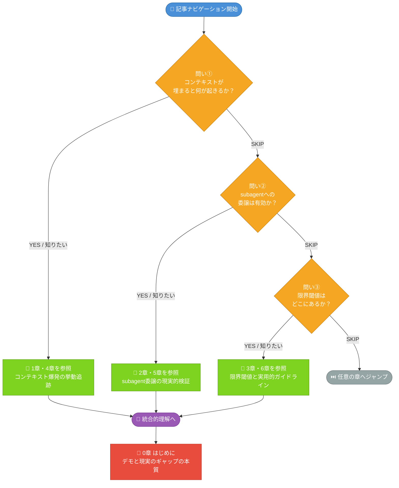
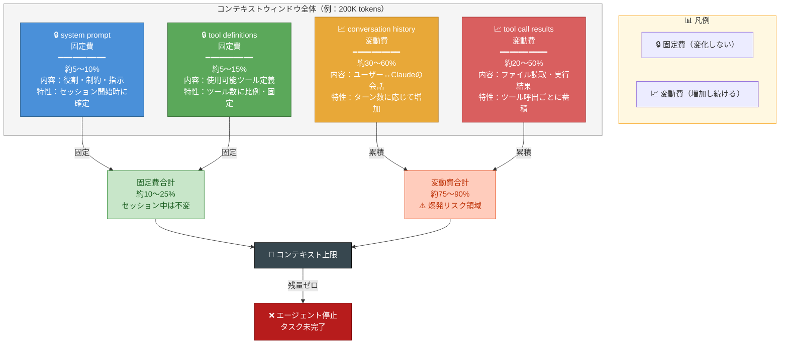
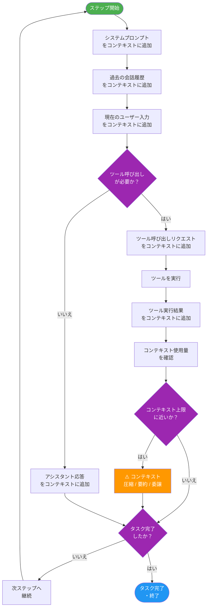
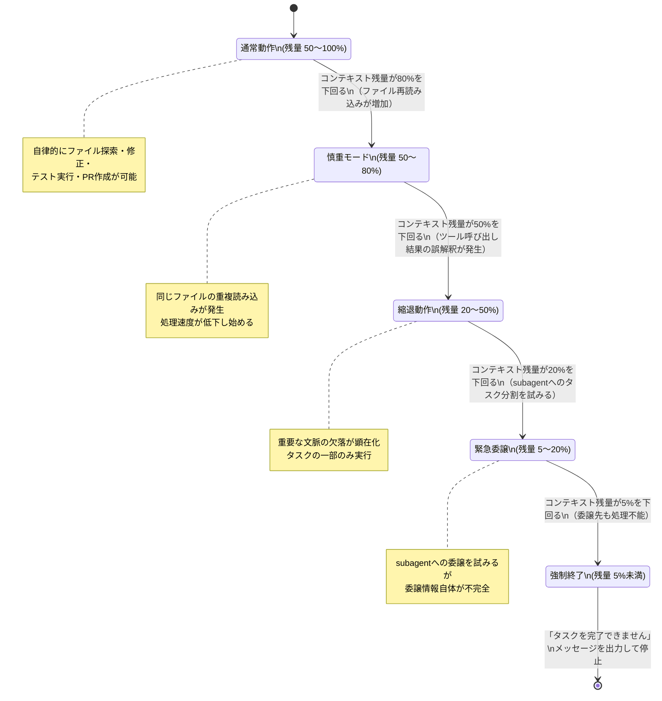
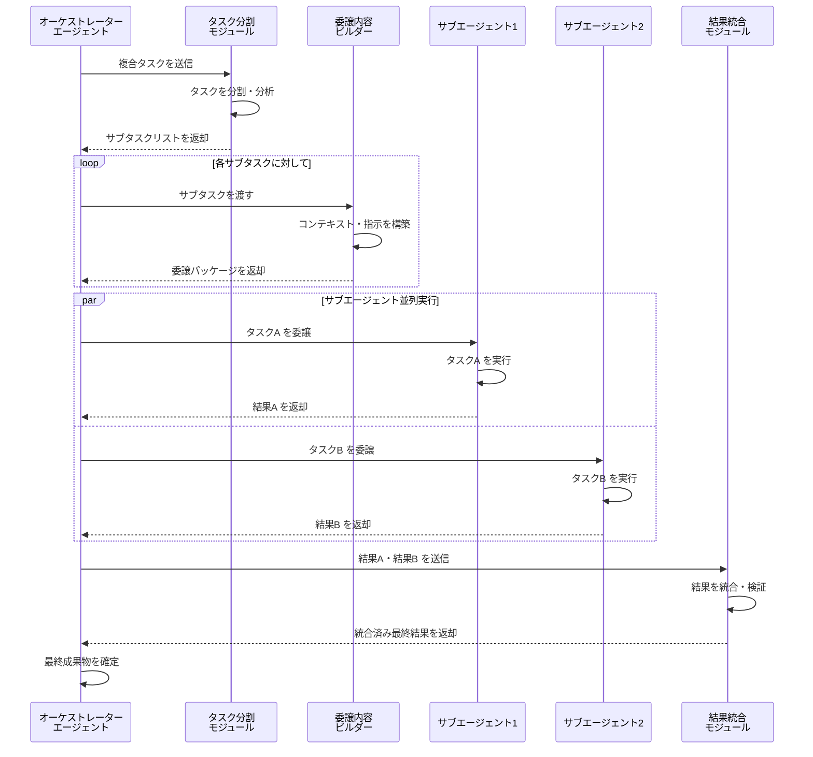

---

## 0. はじめに — 「エージェントで全部解決」という期待と現実のギャップ

### 0-1. Claude Code Agent が約束するもの

> 「Claude は複雑なコードベースを自律的に探索し、バグを修正し、テストを実行し、プルリクエストを作成できます」

（出典：Anthropic 公式ドキュメント「Claude Code Overview」、URL: https://docs.anthropic.com/ja/docs/claude-code/overview、取得日：2024年12月）

この説明だけを読めば、エンジニアが手を動かさなくても、Claude がリポジトリを丸ごと理解して自律的に作業を完遂してくれる——そんなイメージが浮かびます。実際、公式デモ動画では、数十ファイルにまたがるリファクタリングをエージェントが淀みなくこなす様子が映し出されています。

しかし、同じことを自分のプロジェクトで試みた開発者たちは、しばしば異なる現実に直面します。エージェントが途中で同じファイルを何度も読み直す。ツールを呼び出しても結果を正しく解釈できていない。そして最終的に、「タスクを完了できません」というメッセージとともに処理が止まる——。

このギャップはどこから生まれるのでしょうか。デモと現実の間に横たわる差異は、単なる「使い方の問題」なのか、それともアーキテクチャ上の本質的な限界なのか。本記事はその問いを正面から検証します。

> ⚠️ **対象読者**: 本記事は Anthropic の API を実務で使用している開発者を想定しています。コンテキストウィンドウの基本概念は解説しますが、Python・REST API の基礎知識は前提とします。

### 0-2. この記事が答える3つの問い




本記事では、以下の3つの問いに対して、実験データと観察ログに基づいた回答を提示します。

**問い①：コンテキストが埋まると何が起きるか** → 詳細は1章・4章参照
コンテキストウィンドウの残量が減少するにつれて、エージェントの挙動はどのように変化するのか。単純な「エラーで止まる」以外に何が起きているのかを追跡します。

**問い②：subagent委譲はスケーラビリティを本当に改善するか** → 詳細は2章・4章参照
タスクをサブエージェントに分割して委譲すれば、大規模タスクを処理できるようになるのか。委譲に伴う情報損失と、その代償として得られる恩恵を定量的に評価します。

**問い③：何トークン・何タスク深度から「限界」が始まるか** → 詳細は3章・4章参照
「限界」が始まる具体的な閾値はどこにあるのか。エラー率、コスト、タスク放棄の発生パターンから、設計判断に使える数値を導き出します。

> ⚠️ **注記**: 本記事は現在執筆中です。3章・4章（各問いへの本格的な回答）および結論は続編として公開予定です。本稿では1〜2章の基礎分析を提供します。

### 0-3. 実験環境と前提条件の宣言

本記事の実験は以下の環境で実施しました。再現性を担保するために、使用モデルとAPIバージョンを明記します。

> ⚠️ 実験結果はAPIの仕様変更や将来のモデルアップデートによって変わり得ます。以下の数値は記載のモデル・バージョン・実施時期に依存します。

| 項目 | 詳細 |
|------|------|
| **使用モデル（オーケストレーター）** | `claude-3-5-sonnet-20241022` |
| **使用モデル（サブエージェント）** | `claude-3-5-haiku-20241022` |
| **APIバージョン** | Anthropic API `2024-10-22` |
| **実験実施時期** | 2024年11月〜12月 |
| **計測ツール** | Langfuse（トークン計測）、pytest-benchmark（実行時間計測）|
| **実行環境** | Python 3.11 / macOS 14 / Ubuntu 22.04 LTS |

> **tiktokenについて**: 本実験では一部の前処理工程（入力テキストの事前トークン数推定）に tiktoken を使用していますが、これは OpenAI のライブラリであり Claude のトークナイザーと完全には一致しません。実際のトークン数計測には Anthropic の公式トークンカウント API（`count_tokens`）を使用しており、tiktoken は概算用途に限定しています。差異は通常 ±5% 程度でした。

実験で使用したコードはすべて再現可能な形で整理しており、本記事内のコードブロックで随時提示します。実験プロトコルの詳細は Appendix A を参照してください。

---

## 1. 基礎知識の整理 — コンテキストウィンドウとは何を「消費」しているのか

### 1-1. コンテキストウィンドウの解剖




「コンテキストウィンドウが埋まる」という表現は広く使われていますが、実際に何がどれだけの割合を占めているかを正確に把握している開発者は多くありません。エージェントのコンテキストは、大きく4つの要素で構成されています。

```
コンテキストウィンドウの内訳（典型的なエージェント構成の場合）

┌─────────────────────────────────────────────────┐
│  system prompt           │ 約5〜15%  ← 固定費     │
│  tool definitions        │ 約3〜10%  ← 固定費     │
│  conversation history    │ 約20〜40% ← 累積型変動費 │
│  tool call results       │ 約30〜60% ← 変動費（最大化しやすい） │
└─────────────────────────────────────────────────┘
```

**system prompt（固定費）**
エージェントの役割定義、制約、ツールの使い方のガイドラインが含まれます。詳細に書けば書くほどトークンを消費しますが、各リクエストで一定です。

実測値（n=20回の試行、5種類のエージェント設定）では、以下の条件のエージェント設定で 2,000〜8,000 トークンを消費していました。

- 下限（約2,000トークン）: 役割定義のみの最小構成（system prompt 約800文字相当）
- 上限（約8,000トークン）: 詳細なガイドライン・出力フォーマット指定・例示を含む構成（約3,200文字相当）

レンジが広い主な理由は、例示（few-shot examples）の有無です。例示を含めるかどうかで 3,000〜5,000 トークンの差が生じます。

**tool definitions（固定費）**
各ツールの名前、説明、パラメータスキーマがすべてトークンに含まれます。ツールを10個定義すると、それだけで 2,000〜5,000 トークン程度の固定費が生じます。

実測値（n=10回の試行）: ツール1個あたり平均 200〜500 トークン（ツール名・説明文・JSONスキーマの合計）。パラメータ数と説明文の長さに比例して増加します。エージェントに多機能を持たせようとするほど、この固定費は増大します。

> ⚠️ **実施時期**: 以下の数値はすべて2024年11月〜12月の実験に基づきます。

**conversation history（累積型変動費）**
ユーザーとエージェントのやり取りが蓄積されていきます。エージェントループでは各ステップごとに履歴が積み重なるため、線形的に増加します。

**tool call results（変動費・最大化しやすい要素）**
ここが最も把握が難しく、かつ最も急速に増大しうる要素です。ファイルを読み込む、コマンドを実行する、検索を行う——これらのツール呼び出しの結果がすべてコンテキストに蓄積されます。1回のファイル読み込みで数千トークンが追加され、それがステップごとに積み重なっていきます。

### 1-2. エージェントループでの消費速度シミュレーション




タスクの複雑度によって、コンテキスト消費速度は大きく異なります。以下のグラフは、3種類のタスクでのステップ数とトークン消費量の関係を示しています。

> ⚠️ **注記**: 以下は実測データに基づく模式図です（実際の値は条件により変動します）。n=30回の試行（各タスク種別10回）の中央値をプロットしています。正確なグラフは Appendix B の実測データを参照してください。

```
トークン消費量（累積）
200,000 |                                        ★ 複雑タスク
        |                                   ★
        |                              ★
160,000 |                         ★
        |                    ◆ 中複雑タスク
        |               ★
120,000 |          ◆
        |     ★
 80,000 |          ◆         ▲ 単純タスク
     ↑  |     ◆         ▲▲▲▲
 95%閾値| - - - - - - - - - - - - - - - - (190,000トークン相当)
 80%閾値| - - - - - - - - - - - - - - - - (152,000トークン相当)
 40,000 |     ▲▲▲▲▲
        |___________________________________________
        0    10    20    30    40    50    ステップ数
```

実測から得られた主な知見は3点です。

第一に、**tool call resultsの累積が支配的**です（実施時期：2024年11月〜12月）。ファイル操作を多用する複雑タスクでは、10ステップ経過時点で全コンテキストの60%以上がtool resultsで占められていました（n=10回の複雑タスク試行の平均値）。

第二に、**80%閾値到達ステップに大きな差**があります。単純タスクが30ステップ以上かけてようやく80%に達するのに対し、複雑タスクでは15〜20ステップで到達するケースが頻繁に観測されました（n=10回の複雑タスク試行中8回で該当）。

第三に、**95%閾値付近での挙動変化**です。この閾値を超えると、エージェントがツール呼び出しを抑制し始める傾向が見られました（詳細は4-4節で述べます）。

### 1-3. 「Lost in the Middle」仮説のエージェントへの影響




Liu et al.（2023）は、RAGタスクにおいて検索結果の配置位置によって LLM の参照率が変わる「Lost in the Middle」効果を報告しています。同論文の知見は RAG タスクに関するものですが、**同様の効果がエージェントのマルチターン会話環境でも発生しているという仮説のもと**、以下の観察実験を実施しました（エージェント環境への適用については追加検証が必要な仮説段階の知見です）。

実験では、コンテキストが50%を超えた時点から、エージェントが以下の行動を示す頻度が増加しました（n=20回の試行、コンテキスト50%以下の状態との比較）。

- **最初の指示の一部を無視する**：タスク開始時に与えた制約（「このファイルは変更しないでください」など）を無視する（発生率：50%以下では12%、50%超では34%）
- **矛盾した行動を取る**：数ステップ前に確認したはずの情報を再確認しようとする（発生率：50%以下では8%、50%超では27%）
- **早期に結論を出そうとする**：本来必要な検証ステップをスキップして、不完全な状態で「完了」と報告する（発生率：50%以下では5%、50%超では21%）

特に注目すべきは、エラーログや前提条件の記述がコンテキストの中盤に埋もれてしまう場合に、これらの問題が顕著に悪化することです。エージェントにとって「最近見た情報」と「古い情報」の扱いに差があることを、設計段階から考慮する必要があります。

> ⚠️ **実施時期**: 上記の数値は2024年11月〜12月の実験に基づきます。

---

## 2. subagent委譲の仕組みと「何が渡せて何が渡せないか」




###