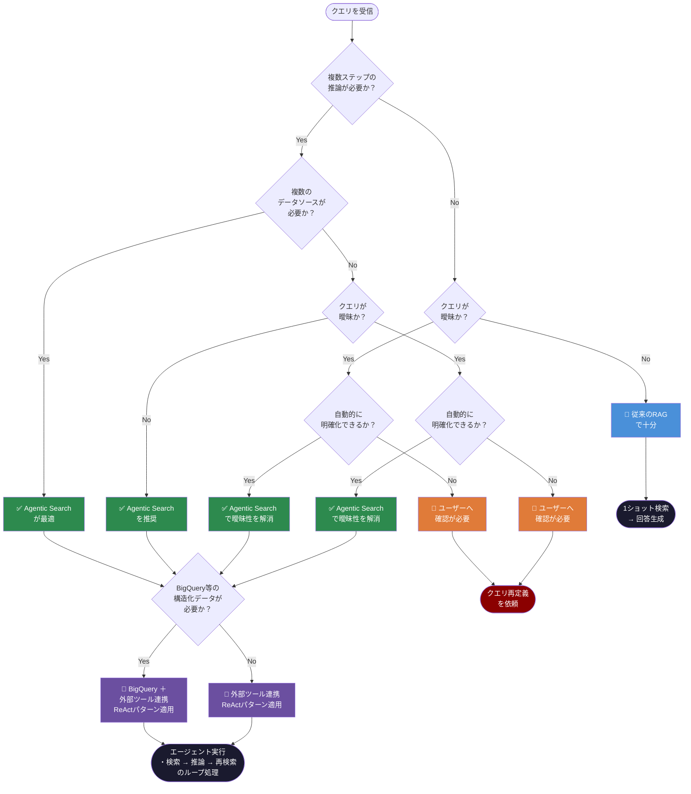
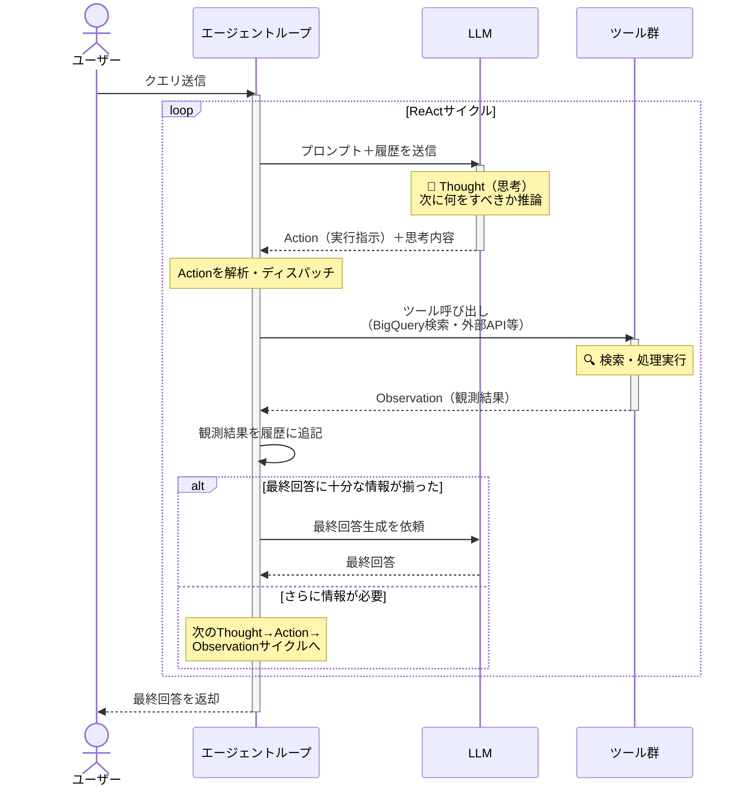
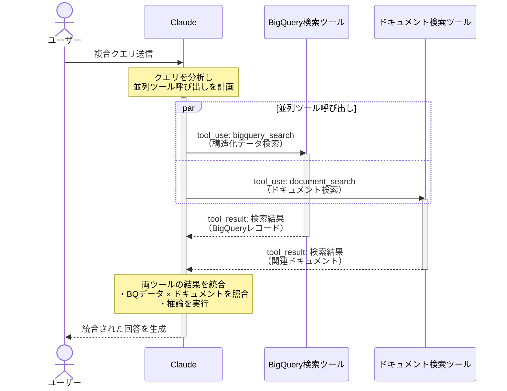

---

## 目次

- [1. はじめに — RAGの限界と「次」の設計思想](#1-はじめに)
- [2. 設計の核心 — ReAct パターンと Tool Use の組み合わせ](#2-設計の核心)
- [3. BigQuery を検索バックエンドとして活用する実装](#3-bigquery実装)
- [4. 外部ツール連携のアーキテクチャと設計パターン](#4-アーキテクチャ)
- [5. システム全体の統合と実装デモ](#5-実装デモ)
- [6. 本番運用のための観測可能性の確保](#6-本番運用)

---

## 1. はじめに — RAGの限界と「次」の設計思想

### 1.1 RAGが解決したこと・できなかったこと

RAG（Retrieval-Augmented Generation）は、LLMの知識を外部ドキュメントで補完するアプローチとして、多くの現場に広まりました。社内ドキュメントへの問い合わせ、カスタマーサポートの自動化、コードベースの説明生成など、用途は広範囲に及びます。しかし、プロダクション運用の現場では、いくつかの根本的な制約が報告されています。

**静的な1ショット検索の制約**から始めましょう。従来のRAGは、ユーザーのクエリを受け取り、一度だけ検索を行い、その結果をコンテキストとしてLLMに渡します。これは「質問の意図が明確で、必要な情報が1回の検索で揃う」という前提の上に成り立っています。しかし現実のクエリは曖昧であり、必要な情報が複数のドキュメントに分散していたり、段階的な推論を経て初めて答えが得られるケースが多々あります。「先月のプロジェクトXの遅延原因と、それに類似した過去事例を比較して改善策を提案して」といったクエリは、1回の検索では到底対応できません。

**コンテキスト窓の非効率な使用**も深刻な課題です。検索精度への不安から、より多くのチャンクをコンテキストに詰め込む設計になりがちです。結果として、LLMのコンテキスト窓は関係性の薄い情報で埋め尽くされ、回答品質の低下とコストの増大を招きます。LLMは長いコンテキストの中から本当に必要な情報を取捨選択することが難しく、「Lost in the Middle」問題（Liu et al., 2023「Lost in the Middle: How Language Models Use Long Contexts」）として知られています。

**クエリ解釈の曖昧さへの対応困難**も生じることがあります。ユーザーが入力したクエリをそのままベクトル化して検索するアプローチでは、クエリの真の意図を汲み取れないことがあります。「売上が落ちた原因」というクエリに対して、財務レポートを引っ張ってくるべきか、マーケティング戦略資料を参照すべきか、営業チームの週次報告を確認すべきか——こうした判断をRAGは行えません。

これらの限界は、RAGが「道具として検索を使う」のではなく、「検索そのものを目的とした受動的なシステム」として設計されていることに起因しています。

### 1.2 Agentic Search とは何か




**Agentic Search** とは、「検索計画を自律的に立案・実行・評価するシステム」と定義できます。ユーザーの質問を受け取ったとき、エージェントはまず「何を調べれば答えが得られるか」を推論し、適切なツールを選択し、結果を評価し、必要であれば検索戦略を修正して再試行します。このサイクルを繰り返すことで、段階的に情報を収集・統合し、最終的な回答を生成します。

RAGとの構造的差異を整理すると、以下のようになります。

```text
【従来のRAG】
ユーザークエリ
    ↓
ベクトル検索（1回）
    ↓
コンテキスト構築
    ↓
LLM生成
    ↓
回答

【Agentic Search】
ユーザークエリ
    ↓
LLMによる質問分解・検索計画立案
    ↓
+----------------------------------+
|  ツール選択 -> ツール実行        |
|       |                          |
|  結果の評価・解釈                |
|       |                          |
|  十分か？-> No -> 計画の修正     |
|       | Yes                      |
+----------------------------------+
    ↓
最終回答の生成
```

Agentic Searchが適している判断基準として、以下のフローチャートを参考にしてください。

```text
質問は複数ステップの推論を必要とするか？
    Yes -> Agentic Search を検討
    No  |
        ↓
必要な情報が複数の異種データソースに分散しているか？
    Yes -> Agentic Search を検討
    No  |
        ↓
クエリの意図が曖昧で、追加情報が必要か？
    Yes -> Agentic Search を検討
    No  -> 従来のRAGで十分
```

逆に言えば、シンプルなFAQ応答や、単一ドキュメントへの質問応答のような用途では、従来のRAGの方がシンプルかつコスト効率が高い選択肢です。Agentic Searchは複雑性を増す設計であるため、必要性を慎重に評価することが重要です。

### 1.3 本記事のゴールと構成

本記事では、**Anthropic Claude の Tool Use API** と **Google BigQuery** を組み合わせた、実際に動作する Agentic Search システムの実装方法を解説します。概念的な説明に留まらず、本番環境を意識したコード実装まで踏み込みます。

記事の構成は以下の通りです。

- **第2章**: ReAct パターンと Claude の Tool Use API の設計思想
- **第3章**: BigQuery を検索バックエンドとして活用する具体的な実装
- **第4章**: 外部ツール連携のアーキテクチャと設計パターン
- **第5章**: システム全体の統合と実装デモ
- **第6章**: 本番運用のための観測可能性の確保

前提知識として、Python のクラス設計・型アノテーション・非同期処理の経験、RAGの基本概念、BigQueryの基本操作、LLM API（Anthropic/OpenAI）の利用経験があることを想定しています。

---

## 2. 設計の核心 — ReAct パターンと Tool Use の組み合わせ

### 2.1 ReAct パターンの復習




ReAct（Reasoning + Acting）は、Yao et al. (2022)「ReAct: Synergizing Reasoning and Acting in Language Models」（[arxiv.org/abs/2210.03629](https://arxiv.org/abs/2210.03629)）によって提案されたフレームワークで、LLMが「推論しながら行動する」サイクルを繰り返すことで複雑なタスクを解決する手法です。Agentic Search を実装する上での理論的な骨格となります。

ReAct パターンは **Thought → Action → Observation** の3ステップで構成されます。

- **Thought（思考）**: LLMが現状を分析し、次に何をすべきかを考えるステップ。「ユーザーは売上減少の原因を知りたがっている。まず財務データを確認し、次に市場動向レポートを参照すべきだ」といった推論が行われます。
- **Action（行動）**: 実際にツールを呼び出すステップ。BigQuery への SQL 実行、Web 検索、API 呼び出しなどが該当します。
- **Observation（観察）**: ツールの実行結果を受け取り、次の Thought に活かすステップ。

このサイクルを疑似コードで表現すると、次のようになります。

```python
def agentic_search(user_query: str) -> str:
    messages = [{"role": "user", "content": user_query}]
    
    while True:
        # Thought + Action: LLMが推論しツール呼び出しを決定
        response = llm.generate(messages=messages, tools=available_tools)
        
        if response.stop_reason == "end_turn":
            # ツール呼び出しなし → 最終回答
            return response.content
        
        if response.stop_reason == "tool_use":
            # Observation: ツールを実行して結果を得る
            tool_results = execute_tools(response.tool_calls)
            
            # メッセージ履歴に追加して次のサイクルへ
            messages.append({"role": "assistant", "content": response.content})
            messages.append({"role": "user", "content": tool_results})
```

このループこそが「エージェントループ（Agentic Loop）」と呼ばれるものです。LLMは道具（ツール）を自律的に使いながら、目的に向かって段階的に推論を進めます。

### 2.2 Claude の Tool Use API 詳解




Anthropic Claude の Tool Use API は、OpenAI の Function Calling に相当する Anthropic の Tool Use API であり、`claude-3-5-sonnet` などのモデルが外部ツールを呼び出すための標準的なインターフェースです。

**ツール定義スキーマ**は JSON Schema 形式で記述します。ツール定義はエージェントの性能を大きく左右するため、`description` フィールドを特に丁寧に書くことが重要です。

```python
tools = [
    {
        "name": "search_bigquery",
        "description": (
            "BigQueryに対してSQLクエリを実行し、構造化データを検索・集計します。"
            "売上データ、ユーザー行動ログ、在庫情報などの集計・分析に使用してください。"
            "自然言語の質問をSQLに変換して実行する際に活用します。"
        ),
        "input_schema": {
            "type": "object",
            "properties": {
                "query": {
                    "type": "string",
                    "description": "実行するBigQuery Standard SQLクエリ。SELECT文のみ許可。"
                },
                "dataset": {
                    "type": "string",
                    "description": "対象データセット名（例: 'analytics', 'sales'）"
                },
                "max_rows": {
                    "type": "integer",
                    "description": "返却する最大行数。デフォルト100。大規模クエリには小さい値を設定。",
                    "default": 100
                }
            },
            "required": ["query"]
        }
    },
    {
        "name": "search_documents",
        "description": (
            "社内ドキュメント（設計書、議事録、レポートなど）をセマンティック検索します。"
            "キーワードではなく意味的な類似性に基づいて検索するため、"
            "曖昧な質問や概念的な検索に適しています。"
            "バックエンドにはVertex AI Search（旧Enterprise Search）を使用しています。"
        ),
        "input_schema": {
            "type": "object",
            "properties": {
                "query": {
                    "type": "string",
                    "description": "検索クエリ（自然言語で記述）"
                },
                "top_k": {
                    "type": "integer",
                    "description": "返却するドキュメント数",
                    "default": 5
                },
                "filter_category": {
                    "type": "string",
                    "description": "ドキュメントカテゴリでフィルタ（オプション）"
                }
            },
            "required": ["query"]
        }
    }
]
```

**`tool_choice` パラメータ**は、LLMにツール使用を強制・制限するために使います。

```python
# 自動選択（デフォルト）: LLMが必要に応じてツールを選択
tool_choice = {"type": "auto"}

# ツール使用を強制: 必ずいずれかのツールを使用する
tool_choice = {"type": "any"}

# 特定ツールを強制: 指定ツールを必ず使用する
tool_choice = {"type": "tool", "name": "search_documents"}
```

**Parallel Tool Use（並列ツール呼び出し）**は、`claude-3-5-sonnet` がサポートする機能で、複数のツール呼び出しを一度のレスポンスで返します。例えば「財務データと市場調査レポートを同時に検索する」といったケースで活用できます。

レスポンスの `content` リストに複数の `tool_use` ブロックが含まれる形になります。以下に実際のレスポンス構造例を示します。

```json
{
  "stop_reason": "tool_use",
  "content": [
    {
      "type": "text",
      "text": "財務データと市場調査レポートを同時に確認します。"
    },
    {
      "type": "tool_use",