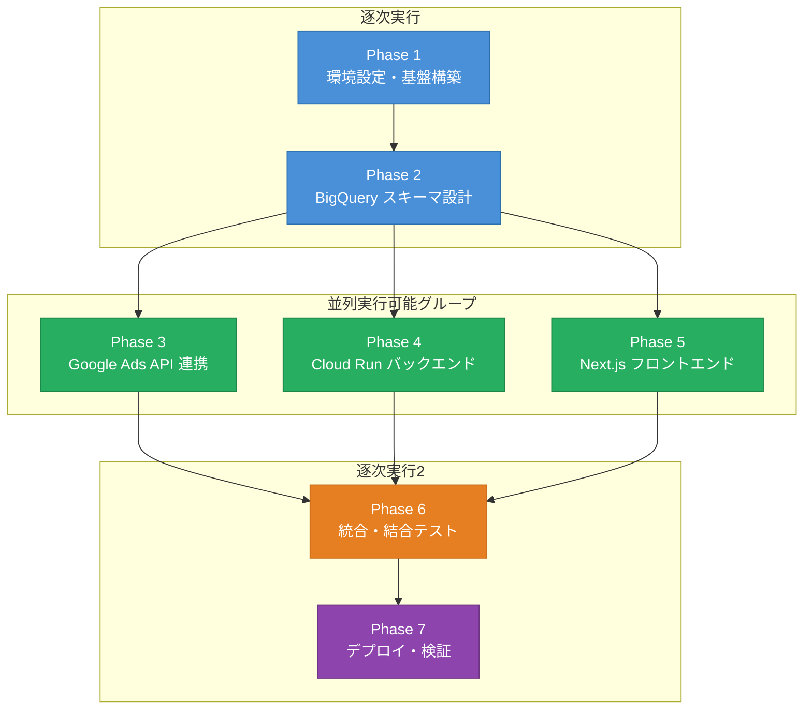
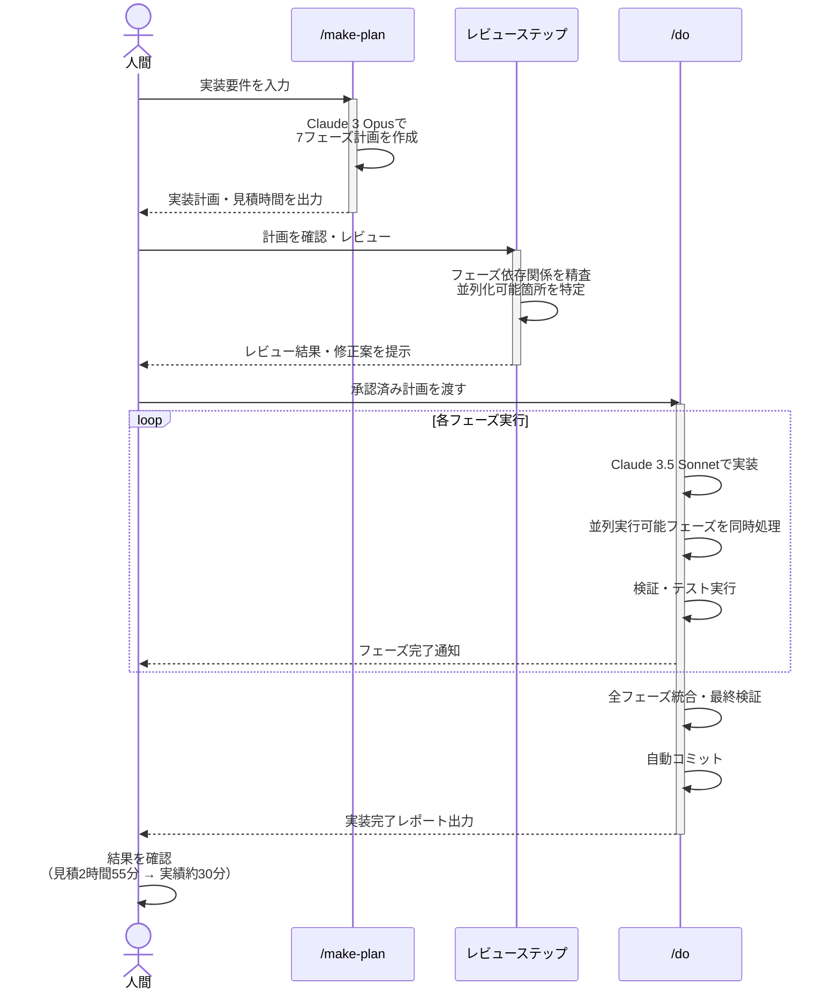
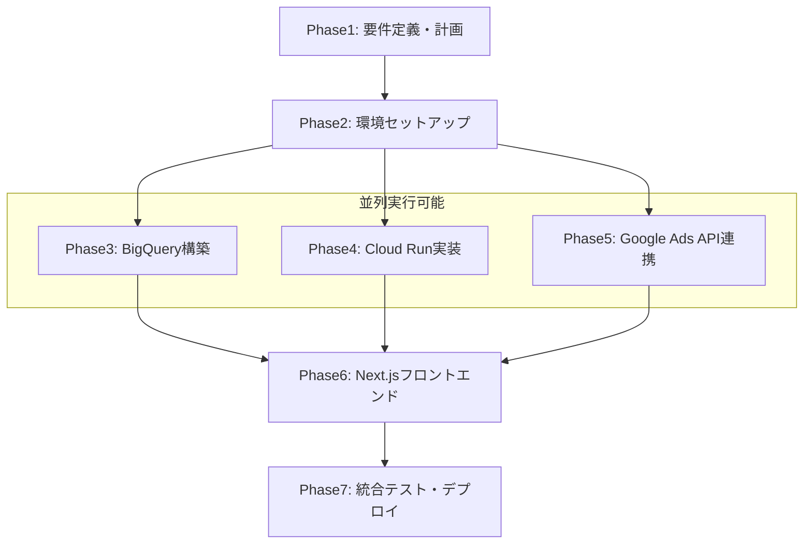

## はじめに

「見積2時間55分の実装が、約30分で終わった」

これは誇張でも偶然でもありません。Claude Codeのカスタムスキル `/make-plan` と `/do` を組み合わせたオーケストレーション構成を使った、実際のセッション記録に基づく話です。

本記事では、Google Ads自動化パイプライン（BigQuery・Cloud Run・Next.jsを含む7フェーズ構成）をどのように設計・実行したか、具体的なスキル定義の考え方から並列実行の実装パターン、そして時間短縮の定量データまでを順に説明します。

> **注記**：本記事では設計思想と動作原理の解説を中心に扱います。スキル定義ファイルの実物（`/make-plan` および `/do`）は別途公開予定です。

---

## この記事で扱うこと・扱わないこと

**扱うこと**

- `/make-plan` と `/do` というカスタムスキルの役割と設計思想
- Claude 3 OpusとClaude 3.5 Sonnetの使い分け基準
- 並列実行できるフェーズとそうでないフェーズの見極め方
- 計画作成→設計レビュー→実装→検証→コミットの自動化フロー全体像
- 実際の時間データ（見積対比）

**扱わないこと**

- Claude Codeのインストール手順や基本操作
- Google Ads APIの詳細な仕様説明
- BigQuery・Cloud Runの環境構築手順

既にClaude Codeを日常的に使っており、「もっと大きな実装をまとめて任せたい」と思っている方を主な読者として想定しています。

---

## Claude Codeカスタムスキルの動作基盤

本記事で扱う `/make-plan` や `/do` は、Claude Codeのカスタムスラッシュコマンド機能を使って定義しています。`~/.claude/commands/` 以下にMarkdownファイルを配置することで、独自のスラッシュコマンドとして呼び出せるようになります。たとえば `~/.claude/commands/make-plan.md` を作成すれば、Claude Code上で `/make-plan` が使えるようになります。カスタムコマンドを使ったことがない方は、まずこの仕組みを把握しておくと本記事の内容が理解しやすくなります。

---

## 背景：なぜカスタムスキルが必要だったか



### Google Ads自動化パイプラインの全体像

今回実装したのは、以下の7フェーズで構成されるパイプラインです。

| フェーズ | 内容 | 依存するフェーズ |
|---------|------|---------|
| Phase 1 | Google Ads APIクライアント設定 | なし |
| Phase 2 | BigQueryスキーマ設計とデータ取り込み | Phase 1 |
| Phase 3 | Cloud Runジョブ定義とスケジューラー設定 | Phase 2 |
| Phase 4 | レポート集計ロジック | Phase 2 |
| Phase 5 | アラート通知モジュール | Phase 2 |
| Phase 6 | Next.jsダッシュボード（API層） | Phase 4 |
| Phase 7 | Next.jsダッシュボード（UI層） | Phase 6 |

依存グラフを整理すると、Phase 3・4・5はいずれもPhase 2にのみ依存しており互いに独立しているため、並列実行が可能です。この構造が、後述するオーケストレーション設計の核心になります。

### 通常のClaude Code利用との違い

Claude Codeを使ったことがある方なら、こんな経験があるはずです。「1つのタスクをお願いして、完成したら次のタスクをお願いして……」という逐次的なやり取りです。

これでも十分便利ですが、フェーズが7つあると話が変わります。毎回コンテキストを渡し、前フェーズの成果物を確認してもらい、次の指示を出す——このオーバーヘッドが積み重なります。

カスタムスキルを使った今回のアプローチでは、**計画を一度作れば、あとはオーケストレーターが自律的に実行を管理します**。人間が介入するのは計画のレビューと最終確認のみです。

---

## 構成の核心：Claude 3 Opus × Claude 3.5 Sonnet の役割分担

### なぜ2つのモデルを使い分けるか

今回のセッションでは、次のような役割分担を採用しました。

- **Claude 3 Opus**：オーケストレーター（計画読み込み・進捗管理・コミット判断）
- **Claude 3.5 Sonnet**：サブエージェント7体（各フェーズの実装担当）

この使い分けには明確な理由があります。

オーケストレーターに求められるのは、**全体を俯瞰する判断力**です。「このフェーズは完了したか」「次にどのフェーズを起動するか」「並列実行できる条件が揃ったか」「コミットのタイミングはいつか」——これらはコンテキスト依存の複合的な判断であり、推論能力の高いOpusが適しています。

一方、サブエージェントに求められるのは、**与えられた仕様に対して正確・高速に実装を完了する能力**です。スコープが明確に限定されているため、Claude 3.5 Sonnetの処理速度とコスト効率が活きます。

### オーケストレーターが持つ責務

Claude 3 Opusが担うオーケストレーターの主な責務は以下の通りです。

1. `/make-plan` が生成した計画ファイルの読み込みと解釈
2. フェーズ間の依存グラフの評価
3. 実行可能なフェーズのサブエージェントへの委任
4. 各サブエージェントからの完了報告の受け取りと検証
5. 全フェーズ完了後のコミット実行

この責務をスキル定義ファイルに明記することが、安定した動作の前提になります。

---

## /make-plan スキルの設計

### スキルの役割

`/make-plan` は、実装の「設計図」を作るスキルです。このスキルを呼び出すと、次のような成果物が生成されます。

- フェーズ一覧と各フェーズの実装仕様
- フェーズ間の依存関係マップ
- 並列実行可能なフェーズのグループ定義
- 各フェーズの見積時間
- 設計レビューのチェックポイント

計画ファイルはMarkdown形式で出力され、後続の `/do` スキルから参照されます。

### スキル定義で指定すべき項目

`/make-plan` のスキル定義ファイルには、以下の項目を含めることが重要です。

**入力として受け取るもの**

- 実装したい機能の概要（自然言語）
- 使用技術スタックの一覧
- 既存コードベースのパス情報
- 優先度や制約条件（あれば）

**出力として生成するもの**

- フェーズ定義ブロック（各フェーズに一意のIDを付与）
- 依存関係の明示（`depends_on: [phase_id]` 形式が扱いやすい）
- 並列実行グループの定義
- 各フェーズの受け入れ条件（何をもって完了とするか）

**特に重要な点**：受け入れ条件を事前に定義しておくことで、オーケストレーターが「このフェーズは本当に完了したか」を自律的に判断できるようになります。曖昧な完了条件はオーケストレーターの判断ミスにつながるため、できるだけ具体的に記述します。

### 計画作成→レビュー→実行のフロー



計画生成後、すぐに実装を始めるのではなく、**設計レビューのステップを挟む**ことを強く推奨します。

今回のセッションでは、計画ファイルが生成された時点で一度人間がレビューし、フェーズ間の依存関係に誤りがないか、見落としているエッジケースがないかを確認しました。このレビューに要した時間は約5分でしたが、実装中のやり直しリスクを大幅に低減する効果があります。レビューが完了したら `/do` を起動し、オーケストレーションループに移行します。

---

## /do スキルの設計

### スキルの役割

`/do` は、`/make-plan` が生成した計画ファイルを読み込み、実装を自動実行するスキルです。このスキルがオーケストレーションの本体です。

### オーケストレーションループの動作

`/do` が起動すると、Claude 3 Opusは以下のループを実行します。

```
1. 計画ファイルを読み込む
2. 依存関係グラフを評価し、実行可能なフェーズを特定する
3. 実行可能なフェーズをClaude 3.5 Sonnetサブエージェントに委任する
4. 委任は並列実行可能なフェーズを同時に起動する
5. 各サブエージェントからの完了報告を待機・受信する
6. 受け入れ条件に照らして完了を検証する
7. 新たに実行可能になったフェーズがあれば3に戻る
8. 全フェーズが完了したらコミットを実行する
```

このループをスキル定義に明記することで、オーケストレーターは人間の追加指示なしにループを継続します。

### サブエージェントへの委任パターン

オーケストレーターがサブエージェントに渡す情報は、以下の3点です。

1. **実装仕様**：計画ファイルの該当フェーズのブロック
2. **コンテキスト**：依存するフェーズの成果物パス
3. **受け入れ条件**：完了の判定基準

この3点が揃っていれば、Claude 3.5 Sonnetは追加の指示なしに実装を完了し、完了報告を返すことができます。

---

## 並列実行の実装パターン



### 依存グラフの評価方法

今回の7フェーズ構成では、依存グラフは以下のような構造でした。

```
Phase 1
  └─ Phase 2
       ├─ Phase 3
       ├─ Phase 4 ──→ Phase 6
       │                  └─ Phase 7
       └─ Phase 5
```

Phase 3・4・5はいずれもPhase 2の完了を待ちますが、互いには依存していません。したがって、Phase 2完了後にPhase 3・4・5は並列実行できます。また、Phase 7はPhase 6の完了のみを待てばよいため、Phase 3・4・5の完了を待つ必要はありません。

オーケストレーターは、この依存グラフを評価するたびに「今この瞬間に実行可能なフェーズ」を列挙し、それをすべて同時に起動します。

### Phase 3・4・5を並列で走らせた実際の挙動

セッション記録によると、実際の実行順序は以下の通りでした。

1. Phase 1実行（順次）
2. Phase 2実行（順次、Phase 1完了後）
3. Phase 3・4・5を並列起動（Phase 2完了後）
4. Phase 3完了を確認（Phase 4・5は引き続き実行中）
5. Phase 4完了を確認 → Phase 6を起動
6. Phase 5完了を確認（Phase 6は実行中）
7. Phase 6完了を確認 → Phase 7を起動
8. Phase 7完了を確認 → 全フェーズ完了

並列実行により、Phase 3・4・5の実行時間がオーバーラップしたことが、全体の短縮に大きく貢献しています。

---

## 実際のセッション：計画から完了まで

### タイムライン概要

以下は実際のセッション記録をもとに再構成したタイムラインです。

| ステップ | 内容 | 所要時間 |
|---------|------|---------|
| `/make-plan` 実行 | 7フェーズの計画ファイル生成 | 約3分 |
| 設計レビュー | 依存関係・受け入れ条件の確認 | 約5分 |
| `/do` 実行開始 | オーケストレーター起動 | 即時 |
| Phase 1〜2順次実行 | 基盤層の実装 | 約10分 |
| Phase 3・4・5並列実行 | インフラ設定＋集計ロジック＋アラートモジュール | 約6分 |
| Phase 6・7実行 | ダッシュボード実装 | 約4分 |
