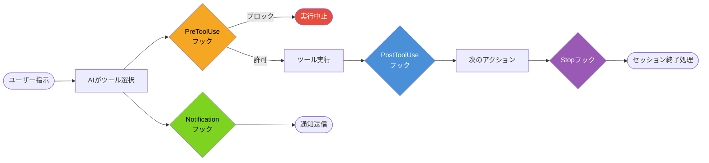
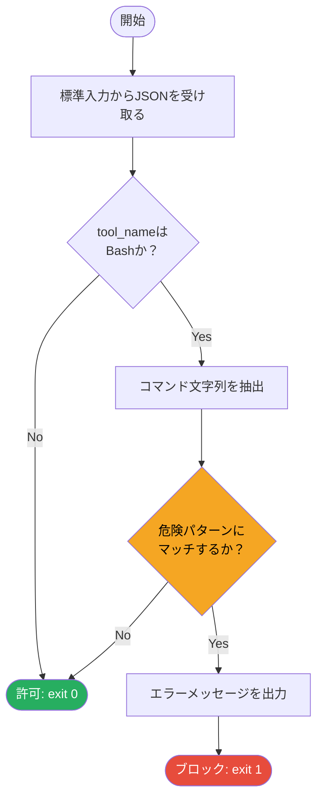
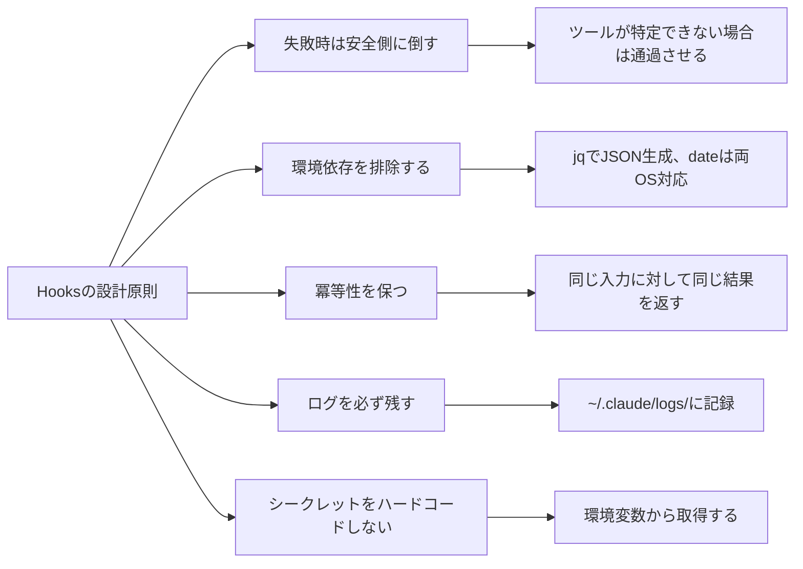

## はじめに

Claude Codeを使い始めると、AIが自由にファイルを書き換えたりコマンドを実行したりすることへの不安を感じることがあります。「意図していないコマンドを実行してほしくない」「長時間タスクが完了したら通知を受け取りたい」「コミット前に必ずLintを通してほしい」──こうした要求に応えるのが Claude Code Hooks です。

Hooksは、AIのツール実行ライフサイクルにシェルスクリプトを差し込む仕組みです。プロンプトへの指示（「絶対に〇〇するな」）と異なり、ツール呼び出しのレイヤーでコードが実行されるため、機械的な強制力を持ちます。

本記事では、4種類のフック（PreToolUse / PostToolUse / Notification / Stop）それぞれの設計パターンを、コピーして使えるbashスクリプト例とともに解説します。

なお、PreToolUseを使ったセッション管理の詳細については、関連記事 [Claude CodeのセッションをHooksで機械的に守る](https://zenn.dev/correlate_dev/articles/claude-code-hooks-session-guard) で深く掘り下げています。本記事はHooks全体の設計パターンを網羅する完全ガイドとして位置づけています。

### 動作要件

- bash 4.x 以上
- jq 1.6 以上（JSON パースに使用）
- curl（Discord/Slack通知に使用）

macOS では `brew install jq`、Linux では `apt install jq` でインストールしてください。

---

## Hooksの4種類

Claude Code Hooksには現在、以下の4種類があります。



| フックタイプ | 実行タイミング | 主な用途 |
|---|---|---|
| PreToolUse | ツール実行前 | バリデーション、ブロック、事前チェック |
| PostToolUse | ツール実行後 | ログ記録、後処理、テスト実行 |
| Notification | AIからの通知発生時 | Discord/Slack転送、ログ記録 |
| Stop | セッション終了時 | クリーンアップ、コスト集計、後片付け |

---

## 設定方法

Hooksの設定は `~/.claude/settings.json`（グローバル）またはプロジェクトの `.claude/settings.json`（ローカル）に記述します。

```json
{
  "hooks": {
    "PreToolUse": [
      {
        "matcher": "Bash",
        "hooks": [
          {
            "type": "command",
            "command": "~/.claude/hooks/pre-bash-guard.sh"
          }
        ]
      }
    ],
    "PostToolUse": [
      {
        "matcher": "Write|Edit|MultiEdit",
        "hooks": [
          {
            "type": "command",
            "command": "~/.claude/hooks/post-file-change.sh"
          }
        ]
      }
    ],
    "Notification": [
      {
        "matcher": "",
        "hooks": [
          {
            "type": "command",
            "command": "~/.claude/hooks/notify-discord.sh"
          }
        ]
      }
    ],
    "Stop": [
      {
        "matcher": "",
        "hooks": [
          {
            "type": "command",
            "command": "~/.claude/hooks/session-cleanup.sh"
          }
        ]
      }
    ]
  }
}
```

### フック共通のI/O仕様

フックスクリプトは標準入力からJSON形式のコンテキストを受け取ります。

```json
{
  "tool_name": "Bash",
  "tool_input": {
    "command": "rm -rf ./dist"
  },
  "session_id": "abc123"
}
```

PreToolUseフックの終了コードによって、ツール実行の可否が決まります。

- 終了コード 0: ツール実行を許可
- 終了コード 1 以上: ツール実行をブロック（標準エラー出力のメッセージがAIに通知されます）

PostToolUse / Notification / Stop フックの終了コードは無視されます（ブロック機能を持ちません）。

---

## PreToolUse パターン1: 危険コマンドのブロック

最初のパターンは、Bashツールで実行されるコマンドを事前にチェックし、危険なものをブロックする実装です。



`~/.claude/hooks/pre-bash-guard.sh` を以下の内容で作成します。

```bash
#!/usr/bin/env bash
# pre-bash-guard.sh - 危険なBashコマンドをブロックするPreToolUseフック

set -euo pipefail

INPUT=$(cat)
TOOL_NAME=$(echo "$INPUT" | jq -r '.tool_name // empty')

# Bashツール以外はスキップ
if [ "$TOOL_NAME" != "Bash" ]; then
  exit 0
fi

COMMAND=$(echo "$INPUT" | jq -r '.tool_input.command // empty')

if [ -z "$COMMAND" ]; then
  exit 0
fi

# 危険パターンの定義
DANGEROUS_PATTERNS=(
  "rm\s+-rf\s+/"
  "rm\s+-rf\s+\*"
  "rm\s+--no-preserve-root"
  "git\s+push\s+.*--force\s+.*main"
  "git\s+push\s+.*--force\s+.*master"
  "git\s+push\s+-f\s+.*main"
  "git\s+push\s+-f\s+.*master"
  "DROP\s+TABLE"
  "DROP\s+DATABASE"
  "TRUNCATE\s+TABLE"
  "chmod\s+-R\s+777\s+/"
  "dd\s+if=.*of=/dev/"
  "mkfs\."
  "shutdown\s+-h"
  "poweroff"
  "reboot"
)

for PATTERN in "${DANGEROUS_PATTERNS[@]}"; do
  if echo "$COMMAND" | grep -qiE "$PATTERN"; then
    echo "[pre-bash-guard] ERROR: 危険なコマンドパターンを検出しました。" >&2
    echo "[pre-bash-guard] パターン: ${PATTERN}" >&2
    echo "[pre-bash-guard] コマンド: ${COMMAND}" >&2
    echo "[pre-bash-guard] このコマンドを実行する必要がある場合は、手動でターミナルから実行してください。" >&2
    exit 1
  fi
done

exit 0
```

スクリプトに実行権限を付与します。

```bash
chmod +x ~/.claude/hooks/pre-bash-guard.sh
```

これで `git push --force origin main` のようなコマンドをAIが実行しようとすると、ブロックされてAIにエラーメッセージが通知されます。

---

## PreToolUse パターン2: コミット前バリデーション

2つ目のパターンは、Bashツールで `git commit` が実行されようとしたときに、コミット前の条件を機械的にチェックする実装です。ここでは「セッション記録ファイルが最終更新から5分以内に更新されているか」を確認します。

```bash
#!/usr/bin/env bash
# pre-commit-guard.sh - コミット前バリデーションフック

set -euo pipefail

INPUT=$(cat)
TOOL_NAME=$(echo "$INPUT" | jq -r '.tool_name // empty')

if [ "$TOOL_NAME" != "Bash" ]; then
  exit 0
fi

COMMAND=$(echo "$INPUT" | jq -r '.tool_input.command // empty')

# git commitコマンドでなければスキップ
if ! echo "$COMMAND" | grep -q "git commit"; then
  exit 0
fi

# --allow-emptyや--amend時もチェックを実施
SESSION_DIR="${HOME}/dev/Obsidian/06_sessions"

if [ ! -d "$SESSION_DIR" ]; then
  # セッションディレクトリが存在しない場合はスキップ
  exit 0
fi

# 最近更新されたセッションファイルを検索（5分以内）
RECENT_SESSION=$(find "$SESSION_DIR" -name "*.md" -newer <(date -v -5M +%s 2>/dev/null || date -d "5 minutes ago" 2>/dev/null || echo "") -maxdepth 2 2>/dev/null | head -1)

# findがエラーを返した場合（date非対応など）はスキップ
if [ $? -ne 0 ]; then
  exit 0
fi

if [ -z "$RECENT_SESSION" ]; then
  echo "[pre-commit-guard] WARNING: 直近5分以内に更新されたセッション記録が見つかりません。" >&2
  echo "[pre-commit-guard] コミット前にセッション記録を更新してください: ${SESSION_DIR}" >&2
  echo "[pre-commit-guard] セッション記録の更新が不要な場合は、手動でgit commitを実行してください。" >&2
  exit 1
fi

exit 0
```

このスクリプトの設定は、matcherをBashに限定した PreToolUse フックとして追加します。

```json
{
  "hooks": {
    "PreToolUse": [
      {
        "matcher": "Bash",
        "hooks": [
          {
            "type": "command",
            "command": "~/.claude/hooks/pre-bash-guard.sh"
          },
          {
            "type": "command",
            "command": "~/.claude/hooks/pre-commit-guard.sh"
          }
        ]
      }
    ]
  }
}
```

同一のmatcherに対して複数のフックを配列で定義すると、上から順に実行されます。いずれかが exit 1 を返した時点でブロックが発動します。

---

## PostToolUse パターン: 自動テスト実行

PostToolUse フックはツール実行後に走るため、ブロック機能はありませんが「書き込みが発生したら何かを実行する」後処理に適しています。

ここでは、TypeScript/JavaScript ファイルが変更されたときに型チェックを自動実行する例を示します。

```bash
#!/usr/bin/env bash
# post-file-typecheck.sh - ファイル変更後に型チェックを実行するPostToolUseフック

set -uo pipefail

INPUT=$(cat)
TOOL_NAME=$(echo "$INPUT" | jq -r '.tool_name // empty')

# Write/Edit/MultiEdit以外はスキップ
case "$TOOL_NAME" in
  Write|Edit|MultiEdit) ;;
  *) exit 0 ;;
esac

FILE_PATH=$(echo "$INPUT" | jq -r '.tool_input.file_path // empty')

if [ -z "$FILE_PATH" ]; then
  exit 0
fi

# TypeScript/JavaScriptファイルでなければスキップ
if ! echo "$FILE_PATH" | grep -qE "\.(ts|tsx|js|jsx)$"; then
  exit 0
fi

# プロジェクトルートを特定（tsconfig.jsonを探す）
PROJECT_ROOT=""
SEARCH_DIR=$(dirname "$FILE_PATH")

while [ "$SEARCH_DIR" != "/" ]; do
  if [ -f "${SEARCH_DIR}/tsconfig.json" ]; then
    PROJECT_ROOT="$SEARCH_DIR"
    break
  fi
  SEARCH_DIR=$(dirname "$SEARCH_DIR")
done

if [ -z "$PROJECT_ROOT" ]; then
  # tsconfig.jsonが見つからない場合はスキップ
  exit 0
fi

# 型チェックを実行（バックグラウンドで結果をログに保存）
LOG_FILE="${HOME}/.claude/logs/typecheck-$(date +%Y%m%d-%H%M%S).log"
mkdir -p "$(dirname "$LOG_FILE")"

cd "$PROJECT_ROOT" && npx tsc --noEmit 2>&1 | tee "$LOG_FILE"

if [ ${PIPESTATUS[0]} -ne 0 ]; then
  echo "[post-file-typecheck] 型エラーが検出されました: ${LOG_FILE}" >&2
fi

exit 0
```

PostToolUse フックは exit コードによるブロック機能がないため、型エラーを検出しても実行は続行されます。ただし標準エラー出力のメッセージはAIが参照できるため、次のアクションで自動修正を促すことができます。

---

## Notification パターン: Discord/Slack通知

Notification フックは、AIがユーザーへの通知を発する際に実行されます。長時間タスクの完了通知を外部サービスに転送するのに適しています。

```bash
#!/usr/bin/env bash
# notify-discord.sh - NotificationをDiscordに転送するフック

set -uo pipefail

INPUT=$(cat)

MESSAGE=$(echo "$INPUT" | jq -r '.message // empty')
SESSION_ID=$(echo "$INPUT" | jq -r '.session_id // "unknown"')

if [ -z "$MESSAGE" ]; then
  exit 0
fi

# Discord Webhook URLは環境変数から取得
WEBHOOK_URL="${CLAUDE_DISCORD_WEBHOOK_URL:-}"

if [ -z "$WEBHOOK_URL" ]; then
  # Webhook URLが未設定の場合はスキップ
  exit 0
fi

# jqで安全にJSONを生成
PAYLOAD=$(jq -n \
  --arg content "Claude Code からの通知 [session: ${SESSION_ID}]" \
  --arg message "$MESSAGE" \
  '{
    content: $content,
    embeds: [
      {
        description: $message,
        color: 5763719
      }
    ]
  }')

curl -s -X POST \
  -H "Content-Type: application/json" \
  -d "$PAYLOAD" \
  "$WEBHOOK_URL" > /dev/null 2>&1

exit 0
```

Discord Webhook URL は環境変数 `CLAUDE_DISCORD_WEBHOOK_URL` から取得します。`.env` ファイルに記述する場合は、Gitに含めないよう注意してください。

### Slack版

Slack Incoming Webhooks の場合は、ペイロードのフォーマットを変更するだけです。

```bash
#!/usr/bin/env bash
# notify-slack.sh - NotificationをSlackに転送するフック

set -uo pipefail

INPUT=$(cat)
MESSAGE=$(echo "$INPUT" | jq -r '.message // empty')

if [ -z "$MESSAGE" ]; then
  exit 0
fi

WEBHOOK_URL="${CLAUDE_SLACK_WEBHOOK_URL:-}"

if [ -z "$WEBHOOK_URL" ]; then
  exit 0
fi

PAYLOAD=$(jq -n \
  --arg text "*Claude Code からの通知*\n${MESSAGE}" \
  '{ text: $text }')

curl -s -X POST \
  -H "Content-Type: application/json" \
  -d "$PAYLOAD" \
  "$WEBHOOK_URL" > /dev/null 2>&1

exit 0
```

---

## Stop パターン: セッション終了処理

Stop フックはセッションが終了するとき（AIが応答を完了したとき）に実行されます。ログの保存やコスト集計、一時ファイルの削除などに使います。

```bash
#!/usr/bin/env bash
# session-cleanup.sh - セッション終了時のクリーンアップフック

set -uo pipefail

INPUT=$(cat)
SESSION_ID=$(echo "$INPUT" | jq -r '.session_id // "unknown"')

LOG_DIR="${HOME}/.claude/logs/sessions"
mkdir -p "$LOG_DIR"

# セッション終了ログを記録
LOG_FILE="${LOG_DIR}/${SESSION_ID}.json"

ENDED_AT=$(date -u +"%Y-%m-%dT%H:%M:%SZ")

# 既存のセッションログがあれば読み込み、なければ新規作成
if [ -f "$LOG_FILE" ]; then
  UPDATED=$(jq \
    --arg ended_at "$ENDED_AT" \
    '.ended_at = $ended_at' \
    "$LOG_FILE")
  echo "$UPDATED" > "$LOG_FILE"
else
  jq -n \
    --arg session_id "$SESSION_ID" \
    --arg ended_at "$ENDED_AT" \
    '{
      session_id: $session_id,
      ended_at: $ended_at
    }' > "$LOG_FILE"
fi

# staleなアンカーファイルを削除
ANCHOR_DIR="${HOME}/.claude/anchors"
if [ -d "$ANCHOR_DIR" ]; then
  # 24時間以上前のアンカーファイルを削除
  find "$ANCHOR_DIR" -name "*.json" -mtime +1 -delete 2>/dev/null || true
fi

# 一時ファイルの削除
TMP_DIR="${HOME}/.claude/tmp"
if [ -d "$TMP_DIR" ]; then
  find "$TMP_DIR" -name "*.tmp" -mtime +0 -delete 2>/dev/null || true
fi

exit 0
```

---

## Hooks設計のベストプラクティス

実際にHooksを運用して見えてきた設計原則をまとめます。



### 1. 失敗時は安全側に倒す

フックスクリプトがクラッシュしたり、予期しない入力を受け取ったりしても、AIの通常作業を妨げないようにします。必要な情報が取得できない場合は `exit 0`（許可）を返してください。

```bash
TARGET=$(echo "$INPUT" | jq -r '.tool_input.file_path // empty')
if [ -z "$TARGET" ]; then
  exit 0  # パスが取得できない場合は通過させる
fi
```

### 2. jqでJSON生成を安全に行う

シェル変数をJSONに直接埋め込むとエスケープの問題が発生します。常にjqの `--arg` / `--argjson` オプションを使ってください。

```bash
# 悪い例
echo "{\"message\": \"$MESSAGE\"}"

# 良い例
jq -n --arg message "$MESSAGE" '{ message: $message }'
```

### 3. 環境変数でシークレットを管理する

Webhook URLやAPIキーはスクリプトにハードコードせず、環境変数から取得してください。`~/.zshrc` や `~/.bashrc` に定義するか、`~/.claude/.env` ファイルに記述して読み込みます。

```bash
# ~/.zshrc に追加
export CLAUDE_DISCORD_WEBHOOK_URL="https://discord.com/api/webhooks/..."
export CLAUDE_SLACK_WEBHOOK_URL="https://hooks.slack.com/services/..."
```

### 4. matcherで対象を絞る

すべてのツール実行にフックをかけると、処理が遅くなります。matcherで対象を絞ることでオーバーヘッドを最小化してください。

```json
{
  "matcher": "Write|Edit|MultiEdit"
}
```

matcherに空文字列 `""` を指定するとすべてのツールにマッチします。Notification と Stop は通常 `""` で問題ありません。

### 5. set -uo pipefail で未定義変数を検出する

`set -euo pipefail` をスクリプト冒頭に記述することで、未定義変数の参照やコマンドの失敗を検出できます。ただし `set -e` は予期しない箇所でスクリプトを終了させることがあるため、クリーンアップ処理では `set +e` を局所的に使用するか、コマンドの末尾に `|| true` を添えてください。

```bash
#!/usr/bin/env bash
set -uo pipefail  # -e は状況に応じて使用

# エラーを無視したいコマンド
find /tmp -name "*.tmp" -delete 2>/dev/null || true
```

### 6. グローバルとローカルを使い分ける

`~/.claude/settings.json`（グローバル）にはすべてのプロジェクトに共通するガード（危険コマンドブロック、通知連携）を配置し、`.claude/settings.json`（ローカル）にはプロジェクト固有の品質ゲート（テスト実行、Lint強制）を配置します。

```
~/.claude/settings.json        ← 全プロジェクト共通（セキュリティ、通知）
プロジェクト/.claude/settings.json ← プロジェクト固有（品質ゲート）
```

---

## ディレクトリ構成の全体像

本記事で紹介したすべてのフックを配置した構成例です。

```
~/.claude/
├── settings.json                    # グローバルフック設定
├── anchors/                         # PIDアンカーファイル（session-guardで使用）
│   └── 12345.json
├── hooks/
│   ├── pre-bash-guard.sh            # 危険コマンドブロック
│   ├── pre-commit-guard.sh          # コミット前バリデーション
│   ├── post-file-typecheck.sh       # 型チェック自動実行
│   ├── notify-discord.sh            # Discord通知
│   ├── notify-slack.sh              # Slack通知
│   └── session-cleanup.sh           # セッション終了処理
└── logs/
    ├── sessions/                    # セッションログ
    └── typecheck-*.log              # 型チェックログ
```

---

## まとめ

Claude Code Hooksを活用することで、AIエージェントの動作に機械的な安全ガードを設けることができます。

| フックタイプ | 主な活用場面 |
|---|---|
| PreToolUse | 危険コマンドのブロック、コミット前バリデーション |
| PostToolUse | 自動テスト実行、型チェック、ログ記録 |
| Notification | Discord/Slack通知転送 |
| Stop | ログ保存、一時ファイル削除、コスト集計 |

プロンプトへの指示（「絶対に〇〇するな」）はAIへのお願いにすぎません。重要なルールはコードで強制する。Hooksはこの原則を実現する仕組みです。

セッション混在問題への具体的な対処については、関連記事 [Claude CodeのセッションをHooksで機械的に守る](https://zenn.dev/correlate_dev/articles/claude-code-hooks-session-guard) もあわせてご覧ください。
