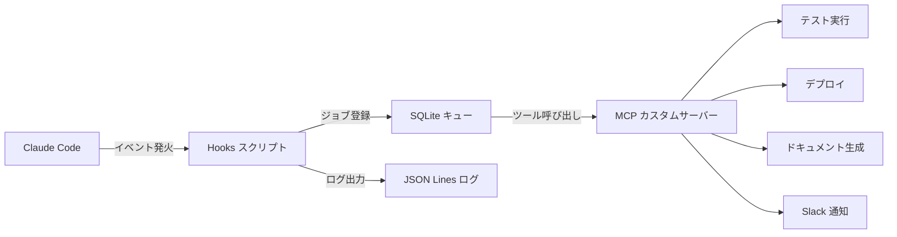

## はじめに ── 「書けるのに、その後が手動」という矛盾

Claude Code を使うと、コードを書く速度は劇的に上がります。しかし、こんな経験はないでしょうか。

- コード修正後、手動でターミナルに切り替えてテストを実行している
- ビルドが通ったら Vercel CLI を叩いてデプロイ、という手順を毎回繰り返している
- セッションが終わったあと、「今日何を変えたっけ？」と Git ログを掘り返している
- Slack への作業報告を手書きしている

AI がコードを書いてくれるようになっても、**その前後の作業は依然として手動**というケースが多いです。これは「Claude Code を使っている」状態であって、「Claude Code に飼いならされている（= 組み込んでいる）」状態ではありません。

この記事では、**Claude Code Hooks** と **MCP（Model Context Protocol）カスタムサーバー**を組み合わせることで、個人開発における反復作業を自動化するパイプラインの設計・実装方法を解説します。

### この記事で構築するパイプラインの全体像



実装するユースケースは4つです。

1. コード保存時に自動テスト実行 → 失敗時は Claude へフィードバック
2. ビルド成功後に自動デプロイ（Vercel / Fly.io）
3. セッション終了時にドキュメント自動更新（README / CHANGELOG）
4. 作業サマリーを Slack へ自動通知

---

## Claude Code Hooks の基礎を固める

### Hooks とは何か

Claude Code Hooks は、**Claude の行動（ツール実行）に割り込んでスクリプトを実行できる仕組み**です。Claude がファイルを編集する前後、bash コマンドを実行した後、セッションが終了したときなど、特定のイベントにスクリプトをフックできます。

イメージとしては、Git の pre-commit フックや npm scripts の `preinstall` に近い概念です。ただし対象が「Claude の行動」全般に拡張されています。

### 4種類のフックイベント

| イベント | 発火タイミング | 主な用途 |
|---------|--------------|---------|
| `PreToolUse` | ツール実行**前** | 承認・拒否・引数の変換 |
| `PostToolUse` | ツール実行**後** | 結果のキャプチャ・後処理 |
| `Notification` | Claude が通知を送るとき | 外部へのアラート転送 |
| `Stop` | セッション終了時 | クリーンアップ・サマリー生成 |

**ブロッキング vs ノンブロッキング**の使い分けも重要です。

- `PreToolUse`: 終了コード `0` で許可、`2` で拒否（ブロッキング）
- `PostToolUse` / `Stop`: 結果は Claude に渡されますが処理をブロックしない（ノンブロッキング）

### 設定ファイルの書き方（settings.json）

Hooks の設定は `~/.claude/settings.json`（グローバル）または `.claude/settings.json`（プロジェクトローカル）に記述します。

```json
{
  "hooks": {
    "PostToolUse": [
      {
        "matcher": "Write|Edit",
        "hooks": [
          {
            "type": "command",
            "command": "python3 ~/.claude/hooks/post_write.py"
          }
        ]
      }
    ],
    "Stop": [
      {
        "hooks": [
          {
            "type": "command",
            "command": "python3 ~/.claude/hooks/session_end.py"
          }
        ]
      }
    ]
  }
}
```

`matcher` は正規表現で、ツール名にマッチしたときだけフックが発火します。`Write|Edit` と書けばファイル書き込み系のツール全般が対象になります。

### フックスクリプトが受け取るペイロード

フックスクリプトは標準入力（stdin）から JSON ペイロードを受け取ります。

```python
# post_write.py の冒頭
import json
import sys

payload = json.load(sys.stdin)

# ペイロードの構造（PostToolUse の場合）
# {
#   "tool_name": "Write",
#   "tool_input": {"file_path": "/path/to/file.py", "content": "..."},
#   "tool_response": {"type": "result", ...},
#   "session_id": "abc123"
# }

tool_name = payload.get("tool_name")
file_path = payload.get("tool_input", {}).get("file_path", "")
```

`tool_input` にはツールへの引数、`tool_response` には実行結果が入ります。これを使って「どのファイルが変更されたか」「bash コマンドの出力は何か」などを取得できます。

---

## MCP カスタムサーバーを自作する

### MCP の設計思想

MCP（Model Context Protocol）は、Anthropic が策定した**AI モデルと外部ツールの標準通信プロトコル**です。三層構造で設計されています。

- **Tool**: Claude が呼び出せる関数（テスト実行・デプロイ・通知など）
- **Resource**: Claude が読み取れるデータソース（ファイル・DB・API レスポンスなど）
- **Prompt**: 再利用可能なプロンプトテンプレート

Hooks はファイルシステムやプロセスに直接触れる「ローカル処理」に向いています。一方 MCP はツールを**型安全に定義して Claude から呼び出せる**点が強みです。Hooks から MCP ツールを呼び出すことで、処理の責務を分離できます。

### 最小構成の MCP サーバーを TypeScript で書く

まず開発環境を整えます。

```bash
mkdir my-pipeline-mcp && cd my-pipeline-mcp
npm init -y
npm install @modelcontextprotocol/sdk
npm install -D typescript @types/node ts-node
npx tsc --init
```

最小構成のサーバーはこれだけです。

```typescript
// src/index.ts
import { McpServer } from "@modelcontextprotocol/sdk/server/mcp.js";
import { StdioServerTransport } from "@modelcontextprotocol/sdk/server/stdio.js";
import { z } from "zod";
import { execSync } from "child_process";

// サーバーの初期化
const server = new McpServer({
  name: "my-pipeline",
  version: "1.0.0",
});

// ツール定義：テスト実行
server.tool(
  "run_tests",
  "プロジェクトのテストを実行する",
  {
    // JSON Schema で入出力を型安全に定義
    project_path: z.string().describe("テスト対象のプロジェクトパス"),
    test_command: z
      .string()
      .optional()
      .default("npm test")
      .describe("テスト実行コマンド"),
  },
  async ({ project_path, test_command }) => {
    try {
      const output = execSync(test_command, {
        cwd: project_path,
        encoding: "utf-8",
        timeout: 60000, // 60秒タイムアウト
      });
      return {
        content: [
          {
            type: "text",
            text: `テスト成功:\n${output}`,
          },
        ],
      };
    } catch (error: any) {
      // エラー時は isError フラグを立てる
      return {
        content: [
          {
            type: "text",
            text: `テスト失敗:\n${error.stdout}\n${error.stderr}`,
          },
        ],
        isError: true,
      };
    }
  }
);

// stdio transport でローカル動作
const transport = new StdioServerTransport();
await server.connect(transport);
```

### Claude Code への MCP サーバー登録

`~/.claude/settings.json` に追記します。

```json
{
  "mcpServers": {
    "my-pipeline": {
      "command": "node",
      "args": ["/absolute/path/to/my-pipeline-mcp/dist/index.js"],
      "env": {
        "SLACK_WEBHOOK_URL": "${SLACK_WEBHOOK_URL}"
      }
    }
  }
}
```

登録後に Claude Code を再起動すると、`my-pipeline` サーバーのツールが利用可能になります。

---

## Hooks × MCP を繋いでパイプラインを設計する

### 設計の基本方針

Hooks スクリプトから MCP ツールを直接呼ぶのではなく、**ジョブキュー（SQLite）を挟む**のがポイントです。

```
Claude Code
    ↓ イベント発火
PostToolUse フック（Python）
    ↓ ジョブ登録（非同期）
SQLite キュー
    ↑ ポーリング
MCP サーバー（Node.js）
    ↓ ツール実行
外部サービス（テスト・デプロイ・Slack）
```

この設計には3つのメリットがあります。

1. **フックの応答速度を保てる**: SQLite への書き込みは数ミリ秒で終わるため、Claude の処理を遅延させない
2. **リトライが容易**: 失敗ジョブをキューに残してリトライできる
3. **冪等性の確保**: 同じジョブが二重に実行されるのを防げる

### SQLite によるジョブキュー実装

```python
# ~/.claude/hooks/queue.py
import sqlite3
import json
import time
import hashlib
from pathlib import Path

DB_PATH = Path.home() / ".claude" / "pipeline_jobs.db"

def init_db():
    """DBとテーブルを初期化する（冪等）"""
    conn = sqlite3.connect(DB_PATH)
    conn.execute("""
        CREATE TABLE IF NOT EXISTS jobs (
            id TEXT PRIMARY KEY,
            job_type TEXT NOT NULL,
            payload TEXT NOT NULL,
            status TEXT DEFAULT 'pending',
            retry_count INTEGER DEFAULT 0,
            created_at REAL,
            updated_at REAL
        )
    """)
    conn.commit()
    return conn

def enqueue(job_type: str, payload: dict) -> str:
    """ジョブをキューに積む（重複登録を防ぐためペイロードのハッシュをIDにする）"""
    payload_str = json.dumps(payload, sort_keys=True)
    job_id = hashlib.sha256(
        f"{job_type}:{payload_str}:{time.time()}".encode()
    ).hexdigest()[:16]

    conn = init_db()
    conn.execute(
        """
        INSERT OR IGNORE INTO jobs
        (id, job_type, payload, status, created_at, updated_at)
        VALUES (?, ?, ?, 'pending', ?, ?)
        """,
        (job_id, job_type, payload_str, time.time(), time.time())
    )
    conn.commit()
    conn.close()
    return job_id

def update_status(job_id: str, status: str):
    """ジョブのステータスを更新する"""
    conn = init_db()
    conn.execute(
        "UPDATE jobs SET status=?, updated_at=? WHERE id=?",
        (status, time.time(), job_id)
    )
    conn.commit()
    conn.close()
```

### エラーハンドリングとリトライ設計

リトライは指数バックオフで実装します。無限ループを防ぐために最大リトライ回数（3回）を設けます。

```python
# queue_worker.py（バックグラウンドで常駐するワーカー）
import time

MAX_RETRY = 3
BACKOFF_BASE = 2  # 秒

def process_job(job: dict):
    """ジョブを処理し、失敗時はリトライカウントを増やす"""
    job_id = job["id"]
    retry_count = job["retry_count"]

    if retry_count >= MAX_RETRY:
        update_status(job_id, "dead")  # DLQ 相当
        return

    try:
        # ジョブタイプに応じた処理を実行
        dispatch(job)
        update_status(job_id, "success")
    except Exception as e:
        # リトライカウントを増やし、一定時間後に再処理
        conn = init_db()
        wait = BACKOFF_BASE ** retry_count
        conn.execute(
            """
            UPDATE jobs
            SET status='pending', retry_count=retry_count+1, updated_at=?
            WHERE id=?
            """,
            (time.time() + wait, job_id)
        )
        conn.commit()
        log_error(job_id, str(e))
```

---

## ユースケース実装 ── 4つの自動化シナリオ

### ユースケース① コード保存時に自動テスト実行

`PostToolUse` で `Write|Edit` をキャッチし、テストジョブをキューに積みます。

```python
# ~/.claude/hooks/post_write.py
import json
import sys
from queue import enqueue
from logger import log_event

def main():
    payload = json.load(sys.stdin)
    file_path = payload.get("tool_input", {}).get("file_path", "")

    # テスト対象のファイルのみ処理（src/ 配下の .py/.ts）
    if not any(file_path.endswith(ext) for ext in [".py", ".ts", ".tsx"]):
        return

    # プロジェクトルートを検出
    import subprocess
    project_root = subprocess.run(
        ["git", "rev-parse", "--show-toplevel"],
        capture_output=True, text=True,
        cwd=str(Path(file_path).parent)
    ).stdout.strip()

    if not project_root:
        return

    job_id = enqueue("run_tests", {
        "project_path": project_root,
        "changed_file": file_path
    })

    log_event("test_enqueued", {"job_id": job_id, "file": file_path})

if __name__ == "__main__":
    main()
```

MCP サーバー側でテストを実行し、失敗時は Claude にフィードバックします。

```typescript
// MCP ツール: run_tests（失敗時のフィードバック機能付き）
server.tool(
  "run_tests",
  "テストを実行し、失敗時は修正候補を返す",
  {
    project_path: z.string(),
    changed_file: z.string().optional(),
  },
  async ({ project_path, changed_file }) => {
    const result = runTests(project_path);

    if (!result.success) {
      // テスト失敗時はエラー内容を構造化して返す
      // Claude はこの内容を受け取り、自動修正を試みる
      return {
        content: [
          {
            type: "text",
            text: JSON.stringify({
              status: "failed",
              failed_tests: result.failedTests,
              error_output: result.stderr,
              suggestion:
                "上記のテストエラーを修正してください。changed_file を優先的に確認してください。",
              changed_file,
            }),
          },
        ],
        isError: true,
      };
    }

    return {
      content: [{ type: "text", text: `全テスト通過 (${result.count} 件)` }],
    };
  }
);
```

### ユースケース② ビルド成功後に自動デプロイ

`PostToolUse` で `Bash` ツールをキャッチし、ビルドコマンドの成功を検知したらデプロイジョブを積みます。

```python
# ~/.claude/hooks/post_bash.py
import json
import sys
import re

def main():
    payload = json.load(sys.stdin)
    command = payload.get("tool_input", {}).get("command", "")
    output = payload.get("tool_response", {}).get("output", "")

    # ビルドコマンドの成功を検知
    is_build_command = re.search(r"\b(build|tsc|next build|vite build)\b", command)
    is_success = "error" not in output.lower() and "failed" not in output.lower()

    if is_build_command and is_success:
        from queue import enqueue
        enqueue("deploy", {
            "project_path": extract_cwd(command),
            "platform": detect_platform(command),
        })

def detect_platform(command: str) -> str:
    if "vercel" in command or "next" in command:
        return "vercel"
    if "fly" in command:
        return "fly"
    return "unknown"

if __name__ == "__main__":
    main()
```

```typescript
// MCP ツール: deploy
server.tool(
  "deploy",
  "プロジェクトをデプロイする",
  {
    project_path: z.string(),
    platform: z.enum(["vercel", "fly", "unknown"]),
    environment: z.enum(["preview", "production"]).default("preview"),
  },
  async ({ project_path, platform, environment }) => {
    const commands: Record<string, string> = {
      vercel:
        environment === "production"
          ? "vercel --prod --yes"
          : "vercel --yes",
      fly: "fly deploy",
    };

    const cmd = commands[platform];
    if (!cmd) {
      return {
        content: [{ type: "text", text: `未対応のプラットフォーム: ${platform}` }],
        isError: true,
      };
    }

    try {
      const output = execSync(cmd, { cwd: project_path, encoding: "utf-8" });
      // デプロイURLを抽出して返す
      const url = extractDeployUrl(output, platform);
      return {
        content: [{ type: "text", text: `デプロイ完了: ${url}` }],
      };
    } catch (error: any) {
      return {
        content: [{ type: "text", text: `デプロイ失敗:\n${error.stderr}` }],
        isError: true,
      };
    }
  }
);
```

### ユースケース③ ドキュメントの自動生成・更新

`Stop` フックでセッション終了を検知し、変更ファイルの差分を元に README や CHANGELOG を更新します。

```python
# ~/.claude/hooks/session_end.py
import json
import sys
import subprocess
from pathlib import Path

def main():
    payload = json.load(sys.stdin)
    session_id = payload.get("session_id", "unknown")

    # セッション中に変更されたファイルを Git で取得
    changed_files = subprocess.run(
        ["git", "diff", "--name-only", "HEAD"],
        capture_output=True, text=True
    ).stdout.strip().splitlines()

    if not changed_files:
        return

    from queue import enqueue
    enqueue("generate_docs", {
        "session_id": session_id,
        "changed_files": changed_files,
        "project_path": str(Path.cwd()),
    })

if __name__ == "__main__":
    main()
```

```typescript
// MCP ツール: generate_docs
server.tool(
  "generate_docs",
  "変更差分を元にドキュメントを自動更新する",
  {
    session_id: z.string(),
    changed_files: z.array(z.string()),
    project_path: z.string(),
  },
  async ({ session_id, changed_files, project_path }) => {
    // git diff でコンテキストを取得
    const diff = execSync("git diff HEAD -- " + changed_files.join(" "), {
      cwd: project_path,
      encoding: "utf-8",
    });

    // CHANGELOG を更新（簡易実装）
    const changelogPath = `${project_path}/CHANGELOG.md`;
    const date = new Date().toISOString().split("T")[0];
    const entry = `\n## [Unreleased] - ${date}\n\n### Changed\n${changed_files
      .map((f) => `- ${f}`)
      .join("\n")}\n`;

    const existing = fs.readFileSync(changelogPath, "utf-8").catch(() => "");
    fs.writeFileSync(changelogPath, entry + existing);

    return {
      content: [
        {
          type: "text",
          text: `CHANGELOG 更新完了 (${changed_files.length} ファイル)`,
        },
      ],
    };
  }
);
```

### ユースケース④ Slack への作業サマリー通知

セッション終了時に今日の作業内容をまとめて Slack に投稿します。

```python
# ~/.claude/hooks/notify_slack.py（session_end.py から呼ばれる）
from queue import enqueue
import subprocess

def enqueue_slack_summary(session_id: str, changed_files: list):
    # コミット数・テスト結果をセッションログから取得
    job_summary = get_job_summary(session_id)

    enqueue("notify_slack", {
        "session_id": session_id,
        "changed_files": changed_files,
        "test_results": job_summary.get("test_results", {}),
        "deploy_url": job_summary.get("deploy_url", ""),
    })
```

```typescript
// MCP ツール: notify_slack
server.tool(
  "notify_slack",
  "作業サマリーを Slack に通知する",
  {
    session_id: z.string(),
    changed_files: z.array(z.string()),
    test_results: z
      .object({
        passed: z.number().optional(),
        failed: z.number().optional(),
      })
      .optional(),
    deploy_url: z.string().optional(),
  },
  async ({ session_id, changed_files, test_results, deploy_url }) => {
    const webhookUrl = process.env.SLACK_WEBHOOK_URL;
    if (!webhookUrl) {
      return {
        content: [{ type: "text", text: "SLACK_WEBHOOK_URL が未設定です" }],
        isError: true,
      };
    }

    // Slack Block Kit でリッチなメッセージを組み立てる
    const blocks = [
      {
        type: "header",
        text: { type: "plain_text", text: "📋 作業サマリー" },
      },
      {
        type: "section",
        fields: [
          {
            type: "mrkdwn",
            text: `*変更ファイル数*\n${changed_files.length} 件`,
          },
          {
            type: "mrkdwn",
            text: `*テスト*\n✅ ${test_results?.passed ?? 0} / ❌ ${
              test_results?.failed ?? 0
            }`,
          },
        ],
      },
      ...(deploy_url
        ? [
            {
              type: "section",
              text: {
                type: "mrkdwn",
                text: `*デプロイ先*\n<${deploy_url}|プレビューを確認>`,
              },
            },
          ]
        : []),
    ];

    await fetch(webhookUrl, {
      method: "POST",
      headers: { "Content-Type": "application/json" },
      body: JSON.stringify({ blocks }),
    });

    return {
      content: [{ type: "text", text: "Slack 通知送信完了" }],
    };
  }
);
```

---

## パイプラインの観測性を高める

### 構造化ログ（JSON Lines）

何が起きたかを追跡するために、全イベントを JSON Lines 形式で記録します。

```python
# ~/.claude/hooks/logger.py
import json
import time
from pathlib import Path

LOG_PATH = Path.home() / ".claude" / "pipeline.jsonl"

def log_event(event_type: str, data: dict):
    """構造化ログを追記する"""
    entry = {
        "ts": time.time(),
        "event": event_type,
        "data": data,
    }
    with open(LOG_PATH, "a") as f:
        f.write(json.dumps(entry, ensure_ascii=False) + "\n")
```

ログの確認はこれだけでできます。

```bash
# 最新10件を確認
tail -n 10 ~/.claude/pipeline.jsonl | python3 -m json.tool

# テスト失敗のみ抽出
grep '"test_failed"' ~/.claude/pipeline.jsonl | jq '.data'
```

### アラートの設計

すべての失敗を通知すると通知疲れが起きます。以下の基準で絞ります。

| 状況 | 対応 |
|-----|------|
| テスト失敗 | Claude へのフィードバックのみ（Slack 通知なし） |
| デプロイ失敗 | Slack に即時通知 |
| 3回リトライ失敗（DLQ） | Slack にエラー詳細を通知 |
| セッション終了 | Slack にサマリー通知（成功時のみ） |

---

## よくある落とし穴とトラブルシューティング

### フックが発火しない

**チェックリスト:**

1. `settings.json` の JSON 構文が正しいか確認（コメントは書けません）
2. `matcher` の正規表現が意図通りか確認 → Claude Code のログで発火したツール名を確認
3. スクリプトに実行権限があるか: `chmod +x ~/.claude/hooks/*.py`
4. Python のパスが正しいか: shebang を `#!/usr/bin/env python3` にする

```bash
# Claude Code のデバッグログを有効化
CLAUDE_DEBUG=1 claude
```

### MCP サーバーが応答しない

stdio transport のデバッグは少しコツが必要です。

```bash
# サーバー単体でテスト（手動でリクエストを送る）
echo '{"jsonrpc":"2.0","id":1,"method":"tools/list","params":{}}' \
  | node dist/index.js

# プロセスが生きているか確認
ps aux | grep "node.*index.js"
```

よくある原因: `console.log` を使っていると stdio を汚染してプロトコルが壊れます。デバッグ出力は必ず `console.error` または専用のログファイルに出力してください。

```typescript
// NG: stdio を汚染する
console.log("デバッグ:", data);

// OK: stderr に出力する
console.error("デバッグ:", data);
```

### パイプラインが無限ループする

最も多いケースは「ドキュメント更新 → Write イベント → テスト実行 → ドキュメント更新 → ...」です。

対策は2つです。

1. フックスクリプト側で **自動生成ファイルをスキップ**する

```python
# 自動生成ファイルは処理しない
SKIP_PATTERNS = ["CHANGELOG.md", "README.md", "*.generated.*", "dist/"]

def should_skip(file_path: str) -> bool:
    return any(
        fnmatch(file_path, pattern)
        for pattern in SKIP_PATTERNS
    )
```

2. SQLite のジョブ ID に**ファイルパス + 最終更新時刻**を含めて重複排除する

### セキュリティ考慮事項

フックスクリプトは Claude Code と同じ権限で実行されます。以下を守ってください。

- `SLACK_WEBHOOK_URL` などのシークレットは `.env` ファイルに記述し、スクリプト内では `python-dotenv` で読み込む
- ハードコードは絶対にしない
- フックスクリプト自体を Git 管理する場合、`.env` は `.gitignore` に追加する

```python
# シークレットの読み込み（python-dotenv）
from dotenv import load_dotenv
import os

load_dotenv(Path.home() / ".claude" / ".env")
SLACK_WEBHOOK_URL = os.getenv("SLACK_WEBHOOK_URL")
```

---

## まとめと次のステップ

この記事では以下を実装しました。

- **Claude Code Hooks** で Claude の行動（Write / Bash / Stop）を検知
- **SQLite ジョブキュー** で非同期・冪等な処理を実現
- **MCP カスタムサーバー**でテスト・デプロイ・通知ツールを型安全に定義
- **4つのユースケース**（テスト・デプロイ・ドキュメント・Slack 通知）を完全実装

ポイントは「Claude Code を使う」から「Claude Code の行動にフックして自分のフローに組み込む」への発想転換です。

### さらに拡張するためのアイデア

**GitHub Actions との連携**  
MCP ツールから `gh` CLI を叩き、PR 作成やワークフロー起動をトリガーできます。ローカルの品質チェックをパスしたものだけ CI に流す、という二段構えの自動化が実現します。

**複数エージェント協調（Multi-Agent）**  
別の Claude Code セッションに MCP 経由でジョブを投げる実験をしています。コードレビュー専用エージェント、テスト修正専用エージェントを常駐させる構成です。

**チーム開発への適用**  
stdio ではなく HTTP+SSE transport に切り替えることで、チームメンバー全員が同じ MCP サーバーを共有できます。ジョブキューを Redis に置き換えることで分散処理も可能です。

実装コードの全文は GitHub で公開予定です。試してみた感想や改善点があればコメントで教えてください。

---

## 参考リンク

- [Claude Code Hooks 公式ドキュメント](https://docs.anthropic.com/ja/docs/claude-code/hooks)
- [Model Context Protocol 仕様](https://modelcontextprotocol.io/)
- [MCP TypeScript SDK](https://github.com/modelcontextprotocol/typescript-sdk)
- [MCP Python SDK](https://github.com/modelcontextprotocol/python-sdk)
