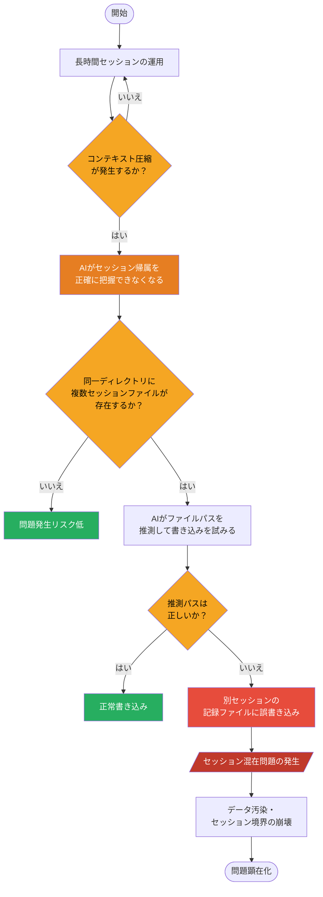
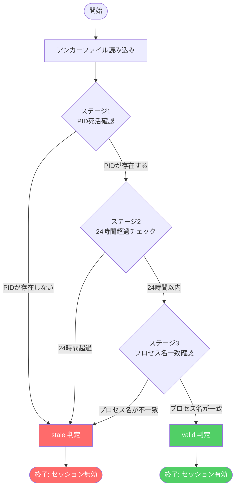

## はじめに

Claude Codeを複数のプロジェクトで並列運用していると、ある厄介な問題に直面することがあります。コンテキスト圧縮が走ったタイミングで、AIが別セッションの記録ファイルに誤って書き込んでしまう「セッション混在」問題です。

この問題に対して、最初に思いつくアプローチは行動ルール（MUST規則）をプロンプトに追加することでしょう。「絶対に他のセッションファイルに書き込むな」という指示を加えれば解決するように見えます。しかし実際には、コンテキスト圧縮後にAIがルールを「忘れる」ことがあり、プロンプトベースの対策には限界があります。

本記事では、Claude Code Hooksを使ってセッション混在を **機械的に防止する** アンカーシステムの設計と実装を紹介します。PreToolUseフックでWrite/Edit操作をガードし、プロセスツリーの遡行によってセッションとPIDを紐付ける手法です。コードはすべて公開します。

### 動作要件

本実装を使用するには以下が必要です。

- **bash** 4.x以上
- **jq** 1.6以上（JSONの生成・パースに使用）
- **ps** コマンド（macOS / Linux 両対応）

macOSでは`brew install jq`、Linuxでは`apt install jq`などでインストールしてください。

---

## セッション混在問題とは何か



### 問題の発生条件

Claude Codeで複数セッションを並列運用する場合、通常は各セッションが独立したコンテキストを持ちます。しかし以下の条件が重なったとき、セッション間の境界が曖昧になります。

- 長時間のセッションでコンテキスト圧縮が発生する
- 複数のセッション記録ファイルが同一ディレクトリに存在する
- AIがファイルパスを「推測」して書き込みを試みる

コンテキスト圧縮後、AIは自身がどのセッションに属しているかを正確に把握できなくなることがあります。その結果、直近で参照したファイル名や類似したパスのファイルに誤って書き込みが発生します。

### 行動ルールでは防げない理由

MUST規則（「絶対に〇〇しろ」という形式の強い指示）をシステムプロンプトに追加しても、根本的な解決にはなりません。理由は単純で、コンテキスト圧縮によってその規則自体が圧縮・省略される可能性があるからです。

プロンプトはAIへの「お願い」にすぎません。AIが規則を保持していても、判断を誤ることはあります。機械的な強制力がなければ、問題は再発します。

### 解決の方針：フックによる機械的ガード

```mermaid
sequenceDiagram
    participant AI as AI (Claude Code)
    participant Hook as PreToolUseフック
    participant Guard as session-guard.sh
    participant Tool as Write/Editツール

    AI->>Hook: Write/Editツールを呼び出す
    activate Hook
    Hook->>Guard: session-guard.sh を実行
    activate Guard
    Guard->>Guard: セッションとPIDを照合
    Guard->>Guard: 許可/ブロックを判定

    alt 許可の場合
        Guard-->>Hook: 許可を返す
        deactivate Guard
        Hook-->>AI: 実行を許可
        deactivate Hook
        AI->>Tool: ツール実行
        activate Tool
        Tool-->>AI: 書き込み完了
        deactivate Tool
    else ブロックの場合
        Guard-->>Hook: ブロックを返す
        deactivate Guard
        Hook-->>AI: 実行を中断
        deactivate Hook
        AI->>AI: エラー通知を受け取り処理を中止
    end
```

Claude Code Hooksは、AIがツールを呼び出す前後にシェルスクリプトを実行できる仕組みです。PreToolUseフックを使えば、Write/Edit操作が実行される前に「このファイルへの書き込みは許可されているか」を機械的にチェックできます。

AIの判断を信頼するのではなく、ツール呼び出しのレイヤーでインターセプトする。これがアンカーシステムの基本思想です。

---

## Claude Code Hooksの仕組みと入出力仕様

### Hooksとは

Claude Code Hooksは、AIのツール実行ライフサイクルにスクリプトを差し込む機能です。現時点で利用できる主なフックタイプは以下のとおりです。

| フックタイプ | タイミング | 主な用途 |
|---|---|---|
| PreToolUse | ツール実行前 | バリデーション、ブロック |
| PostToolUse | ツール実行後 | ログ記録、後処理 |

設定は`~/.claude/settings.json`（グローバル）またはプロジェクトの`.claude/settings.json`（ローカル）に記述します。

```json
{
  "hooks": {
    "PreToolUse": [
      {
        "matcher": "Write|Edit|MultiEdit",
        "hooks": [
          {
            "type": "command",
            "command": "/path/to/session-guard.sh"
          }
        ]
      }
    ]
  }
}
```

### PreToolUseの入出力

PreToolUseフックが呼び出されるとき、フックスクリプトは標準入力からJSON形式のコンテキスト情報を受け取ります。

```json
{
  "tool_name": "Write",
  "tool_input": {
    "file_path": "/path/to/file.md",
    "content": "書き込む内容..."
  },
  "session_id": "abc123"
}
```

フックスクリプトの終了コードによって、ツール実行の可否が決まります。

- **終了コード0**: ツール実行を許可
- **終了コード1（またはそれ以外）**: ツール実行をブロック、エラーメッセージを標準エラー出力へ

> **注意**: 上記は本実装の動作確認時点での仕様です。Claude Codeのバージョンアップにより仕様が変わる可能性があります。最新の仕様は[公式ドキュメント](https://docs.anthropic.com/ja/docs/claude-code)を参照してください。

この仕組みを使って、「許可されていないファイルへの書き込みをブロックする」ガードを実装します。

---

## アンカーシステムの設計

### 設計の全体像

アンカーシステムは以下の3要素で構成されます。

```
[Claude Code プロセス]
        ↓ PreToolUse
[session-guard.sh]  ←→  [アンカーファイル]
        ↓ PID照合
[プロセスツリー遡行]
```

1. **アンカーファイル**: セッションファイルのパスとClaude Code PIDを紐付けて記録する
2. **セッションガードスクリプト**: Write/Edit時にアンカーファイルを参照し、書き込み先が正当かチェックする
3. **プロセスツリー遡行**: フックスクリプトの実行PIDから親プロセスを遡り、Claude Code本体のPIDを特定する

### アンカーファイルの構造

アンカーファイルはJSONで管理します。

```json
{
  "session_file": "/path/to/2026-02-16-1835-adaffi-it-career-resume.md",
  "claude_pid": 12345,
  "created_at": "2026-02-16T18:35:00Z",
  "process_name": "claude"
}
```

アンカーファイルは`~/.claude/anchors/`ディレクトリに、PIDをファイル名として保存します（例: `12345.json`）。

### アンカー未登録セッションの扱いについて

**重要な設計上の制約**: アンカーが登録されていないセッションはガードの保護対象外となり、無条件で通過します。これは意図的なフォールバック設計ですが、「登録し忘れたセッションは保護されない」ことを意味します。

アンカー未登録のセッションが混在した場合、そのセッションからの書き込みはすべて許可されます。セッション保護を確実に機能させるには、 **すべてのセッション開始時にアンカーを登録する** 運用が前提となります。登録手順については後述の「アンカーの登録手順」セクションを参照してください。

### プロセスツリー遡行の考え方

フックスクリプトが実行されるとき、そのプロセスはClaude Codeの子プロセスとして起動されます。`$$`（現在のシェルPID）から`ppid`を辿っていくと、最終的にClaude Code本体のプロセスに到達します。

```
bash (フックスクリプト) PID: 99999
  └─ node (claude-code)  PID: 12345  ← これを特定したい
       └─ ...
```

`ps`コマンドでプロセス名を確認しながら遡行し、`claude`または`node`プロセスのうち、最も根本に近いものをClaude Code PIDとして採用します。

---

## 実装：session-guard.sh

### ディレクトリ構成

```
~/.claude/
├── settings.json          # フック設定
├── anchors/               # アンカーファイル置き場
│   └── 12345.json
└── hooks/
    ├── session-guard.sh   # PreToolUseガード
    └── anchor-register.sh # アンカー登録スクリプト
```

### staleチェックの3段階実装



アンカーファイルが残っているとき、そのPIDがまだ有効かどうかを確認する必要があります。PIDは再利用されるため、単純に「PIDが存在するか」だけでは不十分です。3段階のstaleチェックを実装します。3段階のいずれかに該当するとstaleと判定します。

```bash
is_stale_anchor() {
  local anchor_file="$1"
  local claude_pid
  local created_at
  local process_name

  claude_pid=$(jq -r '.claude_pid' "$anchor_file")
  created_at=$(jq -r '.created_at' "$anchor_file")
  process_name=$(jq -r '.process_name' "$anchor_file")

  # ステージ1: PIDが死亡しているか
  if ! kill -0 "$claude_pid" 2>/dev/null; then
    return 0  # stale
  fi

  # ステージ2: 作成から24時間超過しているか
  local now
  now=$(date +%s)
  local created_epoch
  created_epoch=$(date -d "$created_at" +%s 2>/dev/null || date -j -f "%Y-%m-%dT%H:%M:%SZ" "$created_at" +%s 2>/dev/null || echo "")

  if [ -z "$created_epoch" ]; then
    # 日時パースに失敗した場合はstaleとして扱う
    return 0
  fi

  if [ $((now - created_epoch)) -gt 86400 ]; then
    return 0  # stale
  fi

  # ステージ3: プロセス名が一致するか
  local current_name
  current_name=$(ps -o comm= -p "$claude_pid" 2>/dev/null | tr -d ' ')

  if [ "$current_name" != "$process_name" ]; then
    return 0  # stale（PID再利用の疑い）
  fi

  return 1  # valid
}
```

**ステージ1** はPIDの死活確認、 **ステージ2** は時間による失効、 **ステージ3** はPID再利用の検出です。

> **macOS / Linux 両対応について**: ステージ2の`date`コマンドはLinux向けの`-d`オプションとmacOS向けの`-j -f`オプションを`||`でフォールバックしています。両方失敗した場合は安全側（stale扱い）に倒します。

### session-guard.shの全体実装

`find_claude_pid`関数はこのスクリプト内にインラインで定義しています。

```bash
#!/usr/bin/env bash
# session-guard.sh - PreToolUseガード本体

set -euo pipefail

ANCHOR_DIR="${HOME}/.claude/anchors"
INPUT=$(cat)  # 標準入力からJSONを受け取る

# -------------------------------------------
# find_claude_pid: プロセスツリーを遡行して
# Claude Code本体のPIDを特定する
# -------------------------------------------
find_claude_pid() {
  local pid=$$
  local claude_pid=""

  while [ "$pid" -gt 1 ]; do
    local ppid
    ppid=$(ps -o ppid= -p "$pid" 2>/dev/null | tr -d ' ')

    if [ -z "$ppid" ] || [ "$ppid" -eq 0 ]; then
      break
    fi

    local pname
    pname=$(ps -o comm= -p "$ppid" 2>/dev/null | tr -d ' ')

    # claudeまたはnodeプロセスを候補とする
    if [[ "$pname" == "claude" ]] || [[ "$pname" == "node" ]]; then
      claude_pid="$ppid"
    fi

    pid="$ppid"
  done

  echo "$claude_pid"
}

# -------------------------------------------
# is_stale_anchor: アンカーが無効かどうかを判定する
# 戻り値: 0=stale（無効）, 1=valid（有効）
# -------------------------------------------
is_stale_anchor() {
  local anchor_file="$1"
  local claude_pid
  local created_at
  local process_name

  claude_pid=$(jq -r '.claude_pid' "$anchor_file")
  created_at=$(jq -r '.created_at' "$anchor_file")
  process_name=$(jq -r '.process_name' "$anchor_file")

  if ! kill -0 "$claude_pid" 2>/dev/null; then
    return 0
  fi

  local now
  now=$(date +%s)
  local created_epoch
  created_epoch=$(date -d "$created_at" +%s 2>/dev/null || date -j -f "%Y-%m-%dT%H:%M:%SZ" "$created_at" +%s 2>/dev/null || echo "")

  if [ -z "$created_epoch" ]; then
    return 0
  fi

  if [ $((now - created_epoch)) -gt 86400 ]; then
    return 0
  fi

  local current_name
  current_name=$(ps -o comm= -p "$claude_pid" 2>/dev/null | tr -d ' ')

  if [ "$current_name" != "$process_name" ]; then
    return 0
  fi

  return 1
}

# 操作対象ファイルパスを取得
TARGET_FILE=$(echo "$INPUT" | jq -r '.tool_input.file_path // empty')

if [ -z "$TARGET_FILE" ]; then
  # file_pathがない操作は通過
  exit 0
fi

# Claude Code PIDを特定
CLAUDE_PID=$(find_claude_pid)

if [ -z "$CLAUDE_PID" ]; then
  # PIDが特定できない場合は通過（安全側に倒す）
  exit 0
fi

# 対応するアンカーファイルを検索
ANCHOR_FILE="${ANCHOR_DIR}/${CLAUDE_PID}.json"

if [ ! -f "$ANCHOR_FILE" ]; then
  # アンカーが存在しない場合は通過
  exit 0
fi

# staleチェック
if is_stale_anchor "$ANCHOR_FILE"; then
  rm -f "$ANCHOR_FILE"
  exit 0
fi

# 許可されたセッションファイルを取得
ALLOWED_SESSION=$(jq -r '.session_file' "$ANCHOR_FILE")

# ターゲットファイルと許可ファイルを比較
if [ "$TARGET_FILE" = "$ALLOWED_SESSION" ]; then
  exit 0  # 許可
fi

# セッションファイル以外へのアクセスは通常通り許可
# 同一ディレクトリの別セッションファイルへの書き込みのみを制限する
SESSION_DIR=$(dirname "$ALLOWED_SESSION")
TARGET_DIR=$(dirname "$TARGET_FILE")

if [ "$TARGET_DIR" = "$SESSION_DIR" ] && [ "$TARGET_FILE" != "$ALLOWED_SESSION" ]; then
  # 同じディレクトリの別ファイルへの書き込みをブロック
  echo "[session-guard] ERROR: 別セッションファイルへの書き込みをブロックしました。" >&2
  echo "[session-guard] 許可: ${ALLOWED_SESSION}" >&2
  echo "[session-guard] 試行: ${TARGET_FILE}" >&2
  exit 1
fi

exit 0
```

### jqによる安全なJSON生成

アンカーファイルを生成する際、シェル変数を直接JSON文字列に埋め込むとエスケープの問題が発生します。`jq`を使って安全に生成します。

```bash
#!/usr/bin/env bash
# anchor-register.sh - アンカー登録スクリプト

SESSION_FILE="$1"
CLAUDE_PID="$2"
ANCHOR_DIR="${HOME}/.claude/anchors"

if [ -z "$SESSION_FILE" ] || [ -z "$CLAUDE_PID" ]; then
  echo "Usage: anchor-register.sh <session_file> <claude_pid>" >&2
  exit 1
fi

mkdir -p "$ANCHOR_DIR"

PROCESS_NAME=$(ps -o comm= -p "$CLAUDE_PID" 2>/dev/null | tr -d ' ')
NOW=$(date -u +"%Y-%m-%dT%H:%M:%SZ")

# jqで安全にJSONを生成（シェル変数の直接埋め込みを避ける）
jq -n \
  --arg session_file "$SESSION_FILE" \
  --argjson claude_pid "$CLAUDE_PID" \
  --arg created_at "$NOW" \
  --arg process_name "$PROCESS_NAME" \
  '{
    session_file: $session_file,
    claude_pid: $claude_pid,
    created_at: $created_at,
    process_name: $process_name
  }' > "${ANCHOR_DIR}/${CLAUDE_PID}.json"

echo "[anchor-register] 登録完了: ${ANCHOR_DIR}/${CLAUDE_PID}.json"
```

---

## アンカーの登録手順

セッション開始時に以下の手順でアンカーを登録します。

### 1. フックの設定

`~/.claude/settings.json`にPreToolUseフックを追加します。

```json
{
  "hooks": {
    "PreToolUse": [
      {
        "matcher": "Write|Edit|MultiEdit",
        "hooks": [
          {
            "type": "command",
            "command": "/Users/yourname/.claude/hooks/session-guard.sh"
          }
        ]
      }
    ]
  }
}
```

`/path/to/session-guard.sh`は実際のスクリプト配置パスに置き換えてください。

### 2. スクリプトへの実行権限付与

```bash
chmod +x ~/.claude/hooks/session-guard.sh
chmod +x ~/.claude/hooks/anchor-register.sh
mkdir -p ~/.claude/anchors
```

### 3. セッション開始時のアンカー登録

Claude Codeを起動したら、セッション記録ファイルとClaude CodeのPIDをアンカーに登録します。

Claude CodeのPIDは以下で確認できます。

```bash
pgrep -n claude
# または
ps aux | grep claude | grep -v grep
```

アンカーを登録します。

```bash
~/.claude/hooks/anchor-register.sh \
  /path/to/your/session-file.md \
  <claude_pid>
```

登録後、`~/.claude/anchors/<pid>.json`が作成されていれば完了です。

### 4. 動作確認

別のセッションファイルへの書き込みを試みると、ガードが機能してブロックされます。

```
[session-guard] ERROR: 別セッションファイルへの書き込みをブロックしました。
[session-guard] 許可: /path/to/session-A.md
[session-guard] 試行: /path/to/session-B.md
```

---

## 設計上の制約とトレードオフ

本実装にはいくつかの既知の制約があります。

### アンカー未登録セッションは保護されない

前述のとおり、アンカー未登録のセッションはガードの対象外です。セッション管理を自動化するスクリプトやClaude Codeのスタートアップフックと組み合わせて、登録漏れを防ぐことを推奨します。

### node PIDの曖昧性

Claude Codeはnodeプロセスとして動作するため、他のnodeプロセスが存在する環境では誤検出の可能性があります。`claude`という名前のプロセスが存在する場合はそちらが優先されますが、nodeのみの場合は最も根本に近いnodeプロセスをClaude Code PIDとして採用します。

### セッションディレクトリ外のファイルはガード対象外

本実装では、許可されたセッションファイルと **同一ディレクトリ** にある別のファイルへの書き込みのみをブロックします。異なるディレクトリへの書き込みはチェックしません。これは誤検知を避けるための意図的な設計です。

---

## まとめ

Claude Code Hooksを使ったアンカーシステムにより、プロンプトベースでは防げなかったセッション混在問題を機械的に防止できます。

- **PreToolUseフック** でWrite/Edit操作をインターセプト
- **アンカーファイル** でセッションとClaude PIDを紐付け
- **3段階staleチェック** でPID再利用に対応
- **プロセスツリー遡行** でフックスクリプトからClaude PIDを特定

プロンプトはAIへのお願いにすぎません。重要なルールはコードで強制する。この原則がセッション管理の信頼性を大きく高めます。
