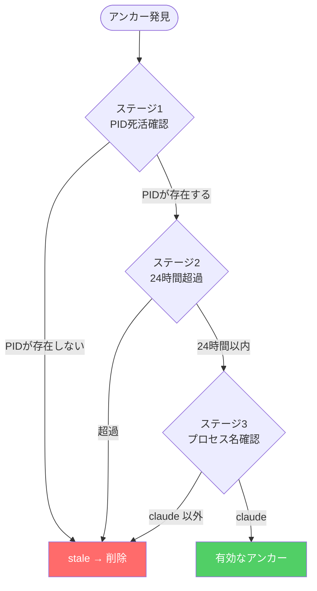

## はじめに

Claude Codeを複数のプロジェクトで並列運用していると、ある厄介な問題に直面することがあります。コンテキスト圧縮が走ったタイミングで、AIが別セッションの記録ファイルに誤って書き込んでしまう——「セッション混在」問題です。

私自身、ISVDサイトの記事制作セッションとクライアント案件のセッションを同時に走らせていたとき、この問題に遭遇しました。コンテキスト圧縮が入った直後、クライアント案件のセッションがISVD側のセッション記録ファイルに作業ログを書き込み始めたのです。2つのセッション記録が混在し、どの作業がどのセッションに属するのか判別不能。手動での分離に30分以上——セッション記録の信頼性が根底から揺らぐ経験となりました。

この問題に対して、最初に試したのは行動ルール（MUST規則）の追加でした。「絶対に他のセッションファイルに書き込むな」という指示をシステムプロンプトに加えれば解決するように見えましたが、コンテキスト圧縮後にAIがルールを「忘れる」ことがあり、プロンプトベースの対策には限界がありました。

本記事では、Claude Code Hooksを使ってセッション混在を **機械的に防止する** アンカーシステムの設計と実装を紹介します。プロセスツリーの遡行によってセッションとPIDを紐付け、PreToolUseフックでWrite/Edit操作をガードする手法——コードはすべて公開します。

### 動作要件

本実装を使用するには以下が必要です。

- **bash** 3.2以上（macOS標準で動作確認済み）
- **jq** 1.6以上（JSONの生成・パースに使用）
- **ps** コマンド（macOS / Linux 両対応）

macOSでは`brew install jq`、Linuxでは`apt install jq`などでインストールしてください。

---

## セッション混在問題とは何か

### 問題の発生条件

Claude Codeで複数セッションを並列運用する場合、通常は各セッションが独立したコンテキストを持ちます。しかし以下の条件が重なったとき、セッション間の境界が曖昧になります。

- 長時間のセッションでコンテキスト圧縮が発生する
- 複数のセッション記録ファイルが同一ディレクトリに存在する
- AIがファイルパスを「推測」して書き込みを試みる

コンテキスト圧縮後、AIは自身がどのセッションに属しているかを正確に把握できなくなることがあります。直近で参照したファイル名や類似したパスのファイルに、誤って書き込みが発生する——これがセッション混在の正体です。

### 行動ルールでは防げない理由

MUST規則（「絶対に〇〇しろ」という形式の強い指示）をシステムプロンプトに追加しても、根本的な解決にはなりません。コンテキスト圧縮によってその規則自体が圧縮・省略される可能性があるからです。

プロンプトはAIへの「お願い」にすぎません。規則を保持していても判断を誤ることはある。機械的な強制力がなければ、問題の再発は避けられません。

### 解決の方針：フックによる機械的ガード

```mermaid
sequenceDiagram
    participant AI as AI (Claude Code)
    participant Hook as PreToolUseフック
    participant Guard as session-guard.sh
    participant Tool as Write/Editツール

    AI->>Hook: Write/Editツールを呼び出す
    activate Hook
    Hook->>Guard: session-guard.sh を実行
    activate Guard
    Guard->>Guard: アンカー照合 + PID検証

    alt 許可の場合
        Guard-->>Hook: {"decision":"approve"}
        deactivate Guard
        Hook-->>AI: 実行を許可
        deactivate Hook
        AI->>Tool: ツール実行
        activate Tool
        Tool-->>AI: 書き込み完了
        deactivate Tool
    else ブロックの場合
        Guard-->>Hook: {"decision":"block","reason":"..."}
        deactivate Guard
        Hook-->>AI: ブロック理由を通知
        deactivate Hook
        AI->>AI: 理由を受け取り処理を中止
    end
```

Claude Code Hooksは、AIがツールを呼び出す前後にシェルスクリプトを実行できる仕組みです。PreToolUseフックを使えば、Write/Edit操作の実行前に「このファイルへの書き込みは許可されているか」を機械的にチェックできます。

AIの判断を信頼するのではなく、ツール呼び出しのレイヤーでインターセプトする。これがアンカーシステムの基本思想です。

---

## Claude Code Hooksの仕組みと入出力仕様

### Hooksとは

Claude Code Hooksは、AIのツール実行ライフサイクルにスクリプトを差し込む機能です。現時点で利用できる主なフックタイプは以下のとおりです。

| フックタイプ | タイミング | 主な用途 |
|---|---|---|
| PreToolUse | ツール実行前 | バリデーション、ブロック |
| PostToolUse | ツール実行後 | ログ記録、後処理 |

設定は`~/.claude/settings.json`（グローバル）またはプロジェクトの`.claude/settings.json`（ローカル）に記述します。

```json
{
  "hooks": {
    "PreToolUse": [
      {
        "matcher": "Write|Edit",
        "hooks": [
          {
            "type": "command",
            "command": "$HOME/.claude/hooks/session-guard.sh"
          }
        ]
      }
    ]
  }
}
```

`matcher`は正規表現で、対象ツール名を指定します。`Write|Edit`はWriteツールまたはEditツールの呼び出し時にフックが発火する設定です。

### PreToolUseの入出力

PreToolUseフックが呼び出されるとき、フックスクリプトは標準入力からJSON形式のコンテキスト情報を受け取ります。

```json
{
  "session_id": "abc123",
  "transcript_path": "/Users/.../.claude/projects/.../session.jsonl",
  "cwd": "/Users/yourname/project",
  "permission_mode": "default",
  "hook_event_name": "PreToolUse",
  "tool_name": "Write",
  "tool_input": {
    "file_path": "/path/to/file.md",
    "content": "書き込む内容..."
  },
  "tool_use_id": "toolu_01ABC123..."
}
```

本実装で使うのは`tool_input.file_path`のみです。書き込み先のパスさえ分かれば、アンカーとの照合が可能になります。

フックの応答は **標準出力にJSONを返す** 方式で制御します。

| 応答 | 意味 |
|---|---|
| `{"decision":"approve"}` | ツール実行を許可 |
| `{"decision":"block","reason":"理由"}` | ツール実行をブロック。理由がAIに通知される |

終了コードの仕様は以下のとおりです。

| 終了コード | 挙動 |
|---|---|
| 0 | 標準出力のJSONを解析して判定（approve/block） |
| 2 | 強制ブロック（JSONを無視し、stderrの内容をエラーとしてAIに通知） |
| 1（その他） | 非ブロッキングエラー。stderrはverboseモードでのみ表示。実行は継続 |

**重要**: `exit 1`ではブロックされません。ブロックするには `exit 0` + `{"decision":"block"}` または `exit 2` の二択。初見で間違えやすいポイントで、私も最初は`exit 1`でブロックできると思い込んでいました。

> **注意**: 上記は2026年3月時点での仕様です。Claude Codeのバージョンアップにより変わる可能性があります。最新の仕様は[公式ドキュメント](https://docs.anthropic.com/en/docs/claude-code/hooks)を参照してください。

---

## アンカーシステムの設計

### 設計の全体像

アンカーシステムは以下の3要素で構成されます。

```
[Claude Code プロセス]
        ↓ PreToolUse
[session-guard.sh]  ←→  [アンカーファイル (.anchor)]
        ↓ PID照合
[get-session-id.sh（プロセスツリー遡行）]
```

1. **アンカーファイル**: セッションファイルのパスをClaude Code PIDに紐付けたテキストファイル
2. **セッションガードスクリプト**: Write/Edit時にアンカーを参照し、書き込み先の正当性をチェック
3. **PID特定ヘルパー**: プロセスツリーを遡行してClaude Code本体のPIDを特定する共通ライブラリ

### アンカーファイルの構造

初期設計ではJSON形式のアンカーを検討しましたが、実運用を経てテキストファイルに簡素化しました。アンカーに必要な情報はセッションファイルのパスだけで、PIDはファイル名自体がキーになるためです。

```
~/.claude/session-anchors/
├── 12345.anchor    # 内容: /path/to/2026-03-30-session-A.md
├── 67890.anchor    # 内容: /path/to/2026-03-30-session-B.md
└── guard.log       # デバッグログ（最新100行のみ保持）
```

各`.anchor`ファイルには、そのPIDのClaude Codeセッションが使用するセッション記録ファイルの絶対パスが1行だけ書かれています。JSON解析が不要なため、フックの実行速度に影響しません。

### アンカーの自動登録

当初はセッション開始時に手動でアンカーを登録する運用でしたが、登録し忘れが頻発したため **自動登録方式** に移行しました。セッション記録ファイルへの最初の書き込み時に、ガードスクリプトがアンカーを自動生成します。

```
Case 1: アンカーあり + パス一致      → 許可
Case 2: アンカーあり + パス不一致    → ブロック
Case 3: アンカーなし + 未使用ファイル → 自動登録して許可
Case 4: アンカーなし + 他が使用中    → ブロック
```

Case 3が自動登録に該当する仕組みです。ただし、明示的に登録する方法も残しており、セッション開始スクリプト（`/session-start`等）と組み合わせることでより確実な紐付けが可能になります。

### プロセスツリー遡行の考え方

フックスクリプトが実行されるとき、そのプロセスはClaude Codeの子プロセスとして起動されます。`$PPID`から親プロセスを辿っていくと、最終的にClaude Code本体に到達します。

```
bash (フックスクリプト) PID: 99999
  └─ claude              PID: 12345  ← これを特定したい
       └─ terminal
```

`ps -o comm=`でプロセス名（コマンド名）を確認しながら遡行し、`claude`という名前のプロセスが見つかればそのPIDを返す仕組みです。

**なぜ `node` ではなく `claude` だけを見るのか**: Claude Codeはnodeプロセスとしても動作しますが、開発環境にはVSCodeのLanguage Server、Next.js dev server、その他多数のnodeプロセスが存在します。`node`にもマッチさせると誤検出のリスクが高く、本実装では`claude`コマンド名のみを候補に。`claude`が見つからなかった場合は`$PPID`をフォールバックとして返します。

---

## 実装

### ディレクトリ構成

```
~/.claude/
├── settings.json              # フック設定
├── session-anchors/           # アンカーファイル置き場
│   ├── 12345.anchor
│   └── guard.log
└── hooks/
    ├── session-guard.sh       # PreToolUseガード
    └── lib/
        └── get-session-id.sh  # PID特定ヘルパー
```

### get-session-id.sh — PID特定ヘルパー

プロセスツリーを遡行してClaude Code PIDを返す共通ヘルパーです。フックスクリプトからもBashツールからも同じ結果を返すよう設計しています。

```bash
#!/bin/bash
# get-session-id.sh - Claude Code PID を取得する共通ヘルパー
# 用途: セッションアンカーの一意キーとして使用
# 呼び出し: MY_ID=$("$HOME/.claude/hooks/lib/get-session-id.sh")

pid=$PPID
max=15
i=0
while [ "$pid" -gt 1 ] && [ "$i" -lt "$max" ]; do
  comm=$(ps -o comm= -p "$pid" 2>/dev/null)
  comm="${comm##*/}"           # パスを除去してコマンド名のみ取得
  comm=$(echo "$comm" | tr -d '[:space:]')

  if [ "$comm" = "claude" ]; then
    echo "$pid"
    exit 0
  fi

  pid=$(ps -o ppid= -p "$pid" 2>/dev/null | tr -d ' ')
  [ -z "$pid" ] && break
  i=$((i + 1))
done

# フォールバック: claude が見つからなければ PPID を返す
echo "$PPID"
exit 0
```

**設計上のポイント**:

- `ps -o comm=`を使い、コマンド名のみでマッチ。`ps -o args=`を使うと`~/.claude/hooks/...`というパスが引数に含まれ、パス内の`.claude`に誤マッチする問題がありました
- 最大15回の遡行制限。無限ループ防止
- `claude`プロセスが見つからない場合でもフォールバック値を返し、スクリプトは正常終了

### session-guard.sh — ガード本体

```bash
#!/bin/bash
# session-guard.sh - PreToolUseガード本体
# セッション記録ファイルへの書き込みをアンカーで検証する

INPUT=$(cat)  # 標準入力からJSONを受け取る

# 操作対象ファイルパスを取得
FILE_PATH=$(echo "$INPUT" | jq -r '.tool_input.file_path // ""' 2>/dev/null)

# --- Fast path: ガード対象外のファイルは即承認 ---
# セッション記録ファイル（日付形式のMarkdown）のみをガード対象とする
# この正規表現はディレクトリ構造に合わせてカスタマイズしてください
if ! echo "$FILE_PATH" | grep -qE '/sessions/[0-9]{4}/[0-9]{2}/[0-9]{4}-[0-9]{2}-[0-9]{2}-.*\.md$'; then
  echo '{"decision":"approve"}'
  exit 0
fi

# --- セッションファイルへの書き込みを検証 ---

ANCHOR_DIR="$HOME/.claude/session-anchors"
LOG_FILE="$ANCHOR_DIR/guard.log"
mkdir -p "$ANCHOR_DIR"

# Claude Code PID を取得
MY_ID=$("$HOME/.claude/hooks/lib/get-session-id.sh")

# デバッグログ（最新100行のみ保持）
echo "$(date '+%Y-%m-%d %H:%M:%S') [CHECK] ID=$MY_ID file=$(basename "$FILE_PATH")" \
  >> "$LOG_FILE" 2>/dev/null
tail -100 "$LOG_FILE" > "$LOG_FILE.tmp" 2>/dev/null && mv "$LOG_FILE.tmp" "$LOG_FILE" 2>/dev/null

MY_ANCHOR="$ANCHOR_DIR/${MY_ID}.anchor"

# ブロック応答を安全に出力するヘルパー
block_json() {
  jq -n --arg r "$1" '{"decision":"block","reason":$r}'
}

# --- Case 1: このセッションのアンカーが存在する ---
if [ -f "$MY_ANCHOR" ]; then
  EXPECTED=$(cat "$MY_ANCHOR" 2>/dev/null)
  if [ "$FILE_PATH" = "$EXPECTED" ]; then
    # パス一致 → 許可
    echo '{"decision":"approve"}'
    exit 0
  else
    # パス不一致 → ブロック
    EXPECTED_NAME=$(basename "$EXPECTED")
    TARGET_NAME=$(basename "$FILE_PATH")
    echo "$(date '+%Y-%m-%d %H:%M:%S') [BLOCKED] ID=$MY_ID expected=$EXPECTED_NAME target=$TARGET_NAME" \
      >> "$LOG_FILE" 2>/dev/null
    block_json "セッション混在防止: このセッションの記録ファイルは ${EXPECTED_NAME} です。${TARGET_NAME} への書き込みをブロックしました。正しいファイル: ${EXPECTED}"
    exit 0
  fi
fi

# --- Case 2+クリーンアップ: アンカーなし → 他セッションの確認とstaleアンカー削除 ---
FILE_CLAIMED_BY=""
NOW=$(date +%s)
for anchor in "$ANCHOR_DIR"/*.anchor; do
  [ -f "$anchor" ] || continue
  anchor_pid=$(basename "$anchor" .anchor)

  # --- staleアンカー判定（3段階） ---

  # ステージ1: PIDが死亡しているか
  if ! kill -0 "$anchor_pid" 2>/dev/null; then
    rm -f "$anchor"
    continue
  fi

  # ステージ2: 24時間超過（PID再利用の安全弁）
  if [ "$(uname)" = "Darwin" ]; then
    anchor_age=$(( NOW - $(stat -f %m "$anchor" 2>/dev/null || echo 0) ))
  else
    anchor_age=$(( NOW - $(stat -c %Y "$anchor" 2>/dev/null || echo 0) ))
  fi
  if [ "$anchor_age" -gt 86400 ]; then
    rm -f "$anchor"
    continue
  fi

  # ステージ3: プロセス名が claude でない → PID再利用の疑い
  anchor_comm=$(ps -o comm= -p "$anchor_pid" 2>/dev/null)
  anchor_comm="${anchor_comm##*/}"
  anchor_comm=$(echo "$anchor_comm" | tr -d '[:space:]')
  if [ "$anchor_comm" != "claude" ]; then
    rm -f "$anchor"
    continue
  fi

  # --- 有効なアンカー: このファイルを主張しているか確認 ---
  claimed_path=$(cat "$anchor" 2>/dev/null)
  if [ "$FILE_PATH" = "$claimed_path" ]; then
    FILE_CLAIMED_BY="$anchor_pid"
  fi
done

# 別セッションがこのファイルを使用中 → ブロック
if [ -n "$FILE_CLAIMED_BY" ]; then
  CLAIMED_NAME=$(basename "$FILE_PATH")
  echo "$(date '+%Y-%m-%d %H:%M:%S') [BLOCKED-OTHER] ID=$MY_ID owner=$FILE_CLAIMED_BY file=$CLAIMED_NAME" \
    >> "$LOG_FILE" 2>/dev/null
  block_json "セッション混在防止: ${CLAIMED_NAME} は別のセッション(PID:${FILE_CLAIMED_BY})が使用中です。"
  exit 0
fi

# --- Case 3: どのアンカーにも該当しない → 新しいセッション → 自動登録 ---
echo "$FILE_PATH" > "$MY_ANCHOR"
echo "$(date '+%Y-%m-%d %H:%M:%S') [REGISTER] ID=$MY_ID file=$(basename "$FILE_PATH")" \
  >> "$LOG_FILE" 2>/dev/null
echo '{"decision":"approve"}'
exit 0
```

### staleチェックの3段階設計


```mermaid
flowchart TD
    A([アンカー発見]) --> C{ステージ1\nPID死活確認}
    C -->|PIDが存在しない| D[stale → 削除]
    C -->|PIDが存在する| E{ステージ2\n24時間超過}
    E -->|超過| D
    E -->|24時間以内| F{ステージ3\nプロセス名確認}
    F -->|claude 以外| D
    F -->|claude| G[有効なアンカー]

    style D fill:#ff6b6b,color:#fff
    style G fill:#51cf66,color:#fff
```

PIDはOSによって再利用されるため、「PIDが生きている」だけでは不十分です。3つの検証を段階的に適用し、staleアンカーを確実に排除します。

- **ステージ1**（PID死活確認）: `kill -0`でプロセスの存在を確認
- **ステージ2**（時間による失効）: ファイルの更新日時が24時間を超えていれば強制失効。`stat`コマンドはmacOS / Linux で構文が異なるため、`uname`で分岐
- **ステージ3**（プロセス名一致確認）: PIDが生きていても、そのプロセスが`claude`でなければ別のプロセスにPIDが再利用されたと判断

> **設計判断**: ステージ2で`created_at`のようなタイムスタンプをアンカー内に持つ方法も検討しましたが、ファイルシステムの更新日時（`stat`）で十分であり、アンカー形式をテキスト1行に保てるメリットの方が大きいと判断しました。

---

## セットアップ手順

### 1. ファイルの配置と権限

```bash
mkdir -p ~/.claude/hooks/lib ~/.claude/session-anchors
# get-session-id.sh と session-guard.sh を配置後:
chmod +x ~/.claude/hooks/session-guard.sh
chmod +x ~/.claude/hooks/lib/get-session-id.sh
```

### 2. settings.jsonにフックを登録

```json
{
  "hooks": {
    "PreToolUse": [
      {
        "matcher": "Write|Edit",
        "hooks": [
          {
            "type": "command",
            "command": "$HOME/.claude/hooks/session-guard.sh"
          }
        ]
      }
    ]
  }
}
```

### 3. 動作確認

セットアップ後、Claude Codeでセッション記録ファイルに書き込みを行うと、自動的にアンカーが登録されます。

```bash
# アンカーの登録状況を確認
ls -la ~/.claude/session-anchors/*.anchor

# ガードログを確認
tail -20 ~/.claude/session-anchors/guard.log
```

別のClaude Codeセッションから同じファイルへの書き込みを試みると、ブロックされます。

```
セッション混在防止: 2026-03-30-session-A.md は別のセッション(PID:12345)が使用中です。
```

### 4. 明示的なアンカー登録（オプション）

自動登録に加え、セッション開始時に明示的に登録する方法もあります。セッション管理スクリプトと組み合わせると、最初の書き込みを待たずにアンカーが確定します。

```bash
# セッション開始スクリプト内で:
MY_ID=$("$HOME/.claude/hooks/lib/get-session-id.sh")
echo "/path/to/session-file.md" > "$HOME/.claude/session-anchors/${MY_ID}.anchor"
```

---

## 設計上の制約とトレードオフ

### ガード対象はファイルパスの正規表現で絞る

本実装では、セッション記録ファイル（`/sessions/YYYY/MM/YYYY-MM-DD-*.md`）への書き込みのみをガード対象としています。すべてのWrite/Editをチェックするのではなく、正規表現でFast pathを設けることで、通常のコード編集にオーバーヘッドを与えない設計です。

この正規表現はディレクトリ構造に依存するため、自身の環境に合わせたカスタマイズが必要です。

### プロセス名 `claude` の環境依存

`ps -o comm=`で取得するプロセス名が`claude`であることを前提としています。macOSのHomebrew経由でインストールした場合は`claude`ですが、他の環境やパッケージマネージャーによっては異なる可能性があります。`get-session-id.sh`の`comm = "claude"`部分を環境に合わせて調整してください。

### パスの正規化は行わない

アンカーに記録されたパスと書き込み先パスの比較は文字列の完全一致です。`./file.md`と`/absolute/path/file.md`は異なるファイルとして扱われるため要注意。Claude Codeが渡す`file_path`は常に絶対パスなので、アンカー登録時にも絶対パスを使えば問題は起きません。

---

## まとめ

Claude Code Hooksを使ったアンカーシステムにより、プロンプトベースでは防げなかったセッション混在問題を機械的に防止できます。

- **PreToolUseフック** でWrite/Edit操作をインターセプトし、JSON応答で許可/ブロックを制御
- **テキストベースのアンカーファイル** でセッションとClaude PIDを紐付け。シンプルさが運用の安定性に直結
- **3段階staleチェック** でPID再利用による誤判定を防止
- **自動登録** で登録し忘れのリスクを解消。明示的な登録との併用も可能

プロンプトはAIへのお願いにすぎません。重要なルールはコードで強制する——この原則がセッション管理の信頼性を大きく高めます。
