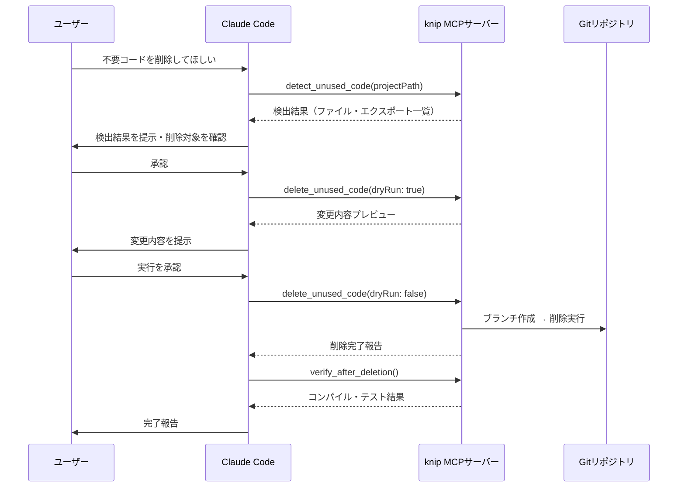

## はじめに ─ 「誰も触れない死んだコード」問題

長期運用のTypeScriptプロジェクトには、必ずと言っていいほど「使われていないコード」が蓄積します。

かつて必要だった機能、リファクタリングで置き換えられた古い関数、実験的に作ったが本番に入らなかったコンポーネント。それらは静かに残り続け、バンドルサイズを膨らませ、コードリーディングのノイズになります。

問題は「存在はわかっているが、削除する勇気が出ない」という心理的障壁です。IDEの「Find Usages」でゼロ件になっても、「もしかしてどこかで動的に参照されているかも」という不安が消えない。その不安に負けて、Todoコメントだけ付けて放置する ── という経験、心当たりはありませんか。

本記事では、この課題を3つのツールを組み合わせて解決した実装を紹介します。

- **knip**: エントリーポイント起点の静的解析で不要コードを検出
- **MCP（Model Context Protocol）カスタムツール **: Claude CodeからknipをAIネイティブに呼び出す橋渡し
- **ts-morph**: AST操作で安全に不要コードを削除

「検出して終わり」ではなく、検出→判断→削除→検証の一気通貫パイプラインの実装までカバーします。

---

## knip とは ─ ts-prune との決定的な違い

まずknipの基礎を整理します。

### エントリーポイント起点の到達可能性解析

従来の `ts-prune` や `ts-unused-exports` は「エクスポートされているが、他からインポートされていないシンボル」を検出するアプローチでした。これには限界があります。インポートされていても実際には呼ばれない関数や、ダイナミックインポートで条件分岐された未到達コードは見逃してしまう。

knipはアプローチが異なります。`package.json` のエントリーポイントから始めて、実際にコードグラフをトレースし、到達できないファイル・エクスポート・依存関係を洗い出します。

検出できる対象は以下です。

| 対象 | 内容 |
|------|------|
| `files` | どこからも参照されていないファイル |
| `exports` | エクスポートされているが使われていない関数・型 |
| `types` | 未使用の型定義 |
| `dependencies` | `package.json` にあるが実際には使われていないパッケージ |
| `devDependencies` | 不要な開発依存 |
| `unlisted` | コードで使われているが `package.json` に記載されていないパッケージ |

### インストールと基本設定

```bash
npm install -D knip
# または
pnpm add -D knip
```

`knip.config.ts` をプロジェクトルートに作成します。

```typescript
// knip.config.ts
import type { KnipConfig } from 'knip';

const config: KnipConfig = {
  entry: ['src/index.ts', 'src/app/**/{page,layout,route}.tsx'],
  project: ['src/**/*.{ts,tsx}'],
  ignore: [
    'src/**/*.stories.tsx',
    'src/**/*.test.ts',
  ],
  ignoreDependencies: [
    'typescript',  // tsconfig経由で使用
  ],
};

export default config;
```

Next.js プロジェクトの場合は、専用のプラグインが用意されています。

```typescript
// knip.config.ts（Next.js）
import type { KnipConfig } from 'knip';

const config: KnipConfig = {
  next: {
    entry: [
      'next.config.{js,ts}',
      'src/app/**/{page,layout,route,middleware,not-found,error,loading,template,global-error}.{tsx,ts}',
      'src/instrumentation.ts',
    ],
  },
  project: ['src/**/*.{ts,tsx}'],
};

export default config;
```

### JSON出力を使いこなす

MCP連携の前提として、knipのJSON出力フォーマットを理解しておく必要があります。

```bash
npx knip --reporter json > knip-result.json
```

出力されるJSONの構造は以下の通りです。

```json
{
  "files": [
    "src/utils/deprecated-helper.ts"
  ],
  "issues": {
    "files": [
      {
        "file": "src/utils/deprecated-helper.ts"
      }
    ],
    "exports": [
      {
        "file": "src/components/OldButton.tsx",
        "symbols": [
          {
            "name": "OldButton",
            "line": 12,
            "col": 0
          }
        ]
      }
    ],
    "types": [...],
    "dependencies": [...]
  }
}
```

このJSON構造がMCPツール実装のインターフェース設計の起点になります。

---

## MCP カスタムツールの実装

### MCPとは何か

MCP（Model Context Protocol）は、Claude CodeなどのAIモデルが外部ツールを呼び出すための標準プロトコルです。Claude Codeに組み込まれている `Read`、`Bash`、`Edit` などのツールと同じインターフェースで、自作のツールを追加できます。

MCPサーバーの実装方式は2つあります。

| 方式 | 特徴 | 用途 |
|------|------|------|
| `stdio` | 標準入出力でやり取り | ローカル開発ツール（今回はこちら） |
| `http` | HTTPエンドポイントとして公開 | チーム共有・リモートサーバー |

### プロジェクト構成

```
knip-mcp-server/
├── package.json
├── tsconfig.json
├── src/
│   ├── index.ts          # MCPサーバーエントリーポイント
│   ├── tools/
│   │   ├── detect.ts     # knip実行・結果返却ツール
│   │   ├── delete.ts     # 不要コード削除ツール
│   │   └── verify.ts     # 削除後検証ツール
│   └── utils/
│       ├── knip-runner.ts # knip実行ラッパー
│       └── ast.ts         # ts-morph操作ユーティリティ
```

### knip 検出ツールの実装

まず、knipを実行して結果を返すMCPツールを実装します。

```typescript
// src/utils/knip-runner.ts
import { execSync } from 'child_process';
import path from 'path';

export interface KnipResult {
  files: string[];
  exports: Array<{
    file: string;
    symbols: Array<{ name: string; line: number }>;
  }>;
  types: Array<{
    file: string;
    symbols: Array<{ name: string; line: number }>;
  }>;
  dependencies: string[];
}

export function runKnip(projectPath: string): KnipResult {
  const command = `npx knip --reporter json --no-progress`;

  try {
    const output = execSync(command, {
      cwd: projectPath,
      encoding: 'utf-8',
      timeout: 120_000, // 2分タイムアウト
    });
    return JSON.parse(output).issues as KnipResult;
  } catch (error: unknown) {
    // knipは問題検出時に終了コード1を返すが、JSONは出力される
    const execError = error as { stdout?: string; message: string };
    if (execError.stdout) {
      try {
        return JSON.parse(execError.stdout).issues as KnipResult;
      } catch {
        // JSONパース失敗は本当のエラー
      }
    }
    throw new Error(`knip実行エラー: ${execError.message}`);
  }
}
```

```typescript
// src/tools/detect.ts
import { z } from 'zod';
import { runKnip } from '../utils/knip-runner.js';

export const detectSchema = z.object({
  projectPath: z.string().describe('解析対象プロジェクトの絶対パス'),
  includeTypes: z.boolean().default(true).describe('型定義の未使用チェックを含める'),
  includeDeps: z.boolean().default(true).describe('未使用依存関係のチェックを含める'),
});

export async function detectUnusedCode(
  input: z.infer<typeof detectSchema>
): Promise<string> {
  const result = await Promise.resolve(runKnip(input.projectPath));

  const lines: string[] = [];

  if (result.files.length > 0) {
    lines.push(`## 未使用ファイル (${result.files.length}件)`);
    result.files.forEach((f) => lines.push(`- ${f}`));
  }

  if (result.exports.length > 0) {
    lines.push(`\n## 未使用エクスポート (${result.exports.length}ファイル)`);
    result.exports.forEach((e) => {
      lines.push(`\n### ${e.file}`);
      e.symbols.forEach((s) => lines.push(`- \`${s.name}\` (L${s.line})`));
    });
  }

  if (input.includeTypes && result.types.length > 0) {
    lines.push(`\n## 未使用型定義 (${result.types.length}ファイル)`);
    result.types.forEach((t) => {
      lines.push(`\n### ${t.file}`);
      t.symbols.forEach((s) => lines.push(`- \`${s.name}\` (L${s.line})`));
    });
  }

  if (input.includeDeps && result.dependencies.length > 0) {
    lines.push(`\n## 未使用依存パッケージ (${result.dependencies.length}件)`);
    result.dependencies.forEach((d) => lines.push(`- ${d}`));
  }

  if (lines.length === 0) {
    return '不要コードは検出されませんでした。';
  }

  return lines.join('\n');
}
```

### MCPサーバーエントリーポイント

```typescript
// src/index.ts
import { McpServer } from '@modelcontextprotocol/sdk/server/mcp.js';
import { StdioServerTransport } from '@modelcontextprotocol/sdk/server/stdio.js';
import { detectSchema, detectUnusedCode } from './tools/detect.js';
import { deleteSchema, deleteUnusedCode } from './tools/delete.js';
import { verifySchema, verifyAfterDeletion } from './tools/verify.js';

const server = new McpServer({
  name: 'knip-mcp-server',
  version: '1.0.0',
});

// ツール1: 不要コード検出
server.tool(
  'detect_unused_code',
  'knipを使ってTypeScriptプロジェクトの不要コード（ファイル・エクスポート・型・依存関係）を検出する',
  detectSchema.shape,
  async (input) => {
    const result = await detectUnusedCode(detectSchema.parse(input));
    return { content: [{ type: 'text', text: result }] };
  }
);

// ツール2: 不要コード削除
server.tool(
  'delete_unused_code',
  'knipの検出結果に基づいて不要なエクスポートまたはファイルを安全に削除する（dry-runモード対応）',
  deleteSchema.shape,
  async (input) => {
    const result = await deleteUnusedCode(deleteSchema.parse(input));
    return { content: [{ type: 'text', text: result }] };
  }
);

// ツール3: 削除後検証
server.tool(
  'verify_after_deletion',
  '削除後にTypeScriptコンパイルとテスト実行を行い、整合性を確認する',
  verifySchema.shape,
  async (input) => {
    const result = await verifyAfterDeletion(verifySchema.parse(input));
    return { content: [{ type: 'text', text: result }] };
  }
);

const transport = new StdioServerTransport();
await server.connect(transport);
```

### Claude Codeへの登録

`~/.claude/claude_desktop_config.json`（またはプロジェクトルートの `.mcp.json`）に以下を追記します。

```json
{
  "mcpServers": {
    "knip": {
      "command": "node",
      "args": ["/path/to/knip-mcp-server/dist/index.js"],
      "env": {}
    }
  }
}
```

Bunを使う場合はビルドを省略できます。

```json
{
  "mcpServers": {
    "knip": {
      "command": "bun",
      "args": ["run", "/path/to/knip-mcp-server/src/index.ts"]
    }
  }
}
```

登録後、Claude Codeを再起動すると `detect_unused_code`、`delete_unused_code`、`verify_after_deletion` の3ツールが使えるようになります。

---

## 自動削除パイプライン

### 削除前の安全設計

不要コードの削除で最も重要なのは「元に戻せる」設計です。削除ツールを実装する前に、安全設計の方針を決めておきます。

```typescript
// src/tools/delete.ts（安全設計部分）
import { execSync } from 'child_process';
import { z } from 'zod';
import { Project } from 'ts-morph';

export const deleteSchema = z.object({
  projectPath: z.string().describe('プロジェクトの絶対パス'),
  targetFiles: z.array(z.string()).describe('削除対象ファイルのパス一覧'),
  targetExports: z
    .array(
      z.object({
        file: z.string(),
        symbolName: z.string(),
      })
    )
    .default([])
    .describe('削除対象エクスポートシンボル一覧'),
  dryRun: z.boolean().default(true).describe('trueの場合は削除せず変更内容のみ表示'),
  createBranch: z
    .boolean()
    .default(true)
    .describe('削除前に専用ブランチを作成するか'),
});

function createSafetyBranch(projectPath: string): string {
  const timestamp = new Date().toISOString().replace(/[:.]/g, '-');
  const branchName = `cleanup/knip-${timestamp}`;

  execSync(`git checkout -b ${branchName}`, { cwd: projectPath });
  return branchName;
}
```

```typescript
export async function deleteUnusedCode(
  input: z.infer<typeof deleteSchema>
): Promise<string> {
  const lines: string[] = [];

  // dry-runモードの早期リターン
  if (input.dryRun) {
    lines.push('**[dry-run] 以下の変更が実行されます（実際の削除はされていません）:**\n');
    input.targetFiles.forEach((f) => lines.push(`- ファイル削除: ${f}`));
    input.targetExports.forEach((e) =>
      lines.push(`- エクスポート削除: ${e.file} の \`${e.symbolName}\``)
    );
    lines.push(
      '\n`dryRun: false` を指定して再度実行すると実際に削除されます。'
    );
    return lines.join('\n');
  }

  // 安全ブランチの作成
  if (input.createBranch) {
    const branch = createSafetyBranch(input.projectPath);
    lines.push(`ブランチ \`${branch}\` を作成しました。\n`);
  }

  // ts-morphによるエクスポート削除
  if (input.targetExports.length > 0) {
    const project = new Project({
      tsConfigFilePath: `${input.projectPath}/tsconfig.json`,
    });

    for (const target of input.targetExports) {
      const sourceFile = project.getSourceFile(target.file);
      if (!sourceFile) continue;

      const exportedDeclarations = sourceFile.getExportedDeclarations();
      const declarations = exportedDeclarations.get(target.symbolName);

      if (declarations && declarations.length > 0) {
        declarations[0].remove();
        lines.push(`✓ エクスポート削除: ${target.file} の \`${target.symbolName}\``);
      }
    }

    await project.save();
  }

  // ファイル削除
  for (const filePath of input.targetFiles) {
    const fs = await import('fs/promises');
    await fs.rm(filePath, { force: true });
    lines.push(`✓ ファイル削除: ${filePath}`);
  }

  return lines.join('\n');
}
```

### 削除後の整合性検証

削除後に自動でコンパイルとテストを実行します。失敗した場合はブランチを切り替えるだけで元の状態に戻せます。

```typescript
// src/tools/verify.ts
import { execSync } from 'child_process';
import { z } from 'zod';

export const verifySchema = z.object({
  projectPath: z.string(),
  runTests: z.boolean().default(true).describe('テストも実行するか'),
  testCommand: z
    .string()
    .default('npx vitest run')
    .describe('テスト実行コマンド'),
});

export async function verifyAfterDeletion(
  input: z.infer<typeof verifySchema>
): Promise<string> {
  const results: string[] = [];

  // TypeScriptコンパイルチェック
  try {
    execSync('npx tsc --noEmit', {
      cwd: input.projectPath,
      encoding: 'utf-8',
      timeout: 60_000,
    });
    results.push('✅ TypeScriptコンパイル: 成功');
  } catch (error: unknown) {
    const execError = error as { stdout?: string; stderr?: string };
    const output = execError.stdout ?? execError.stderr ?? '';
    results.push(`❌ TypeScriptコンパイル: 失敗\n\`\`\`\n${output}\n\`\`\``);
    results.push(
      '\n** コンパイルエラーが発生しました。`git checkout main` で元のブランチに戻せます。 **'
    );
    return results.join('\n');
  }

  // テスト実行（オプション）
  if (input.runTests) {
    try {
      const testOutput = execSync(input.testCommand, {
        cwd: input.projectPath,
        encoding: 'utf-8',
        timeout: 300_000, // 5分
      });
      const passLine = testOutput.match(/(\d+) passed/)?.[0] ?? '完了';
      results.push(`✅ テスト: ${passLine}`);
    } catch (error: unknown) {
      const execError = error as { stdout?: string };
      const output = execError.stdout ?? '';
      results.push(`❌ テスト失敗:\n\`\`\`\n${output.slice(0, 2000)}\n\`\`\``);
    }
  }

  return results.join('\n');
}
```

---

## Claude Codeからの実際の使用フロー

MCPサーバーを登録後、Claude Codeで以下のようにプロンプトを書くだけでパイプライン全体が動きます。

```
このプロジェクト（/Users/naoya/dev/my-app）の不要コードを検出して、
安全に削除してください。まず dry-run で確認してから実行してください。
```

Claude Codeの内部では次のシーケンスで処理されます。



重要な設計ポイントは、Claude Codeが自動で削除を判断するのではなく、必ず人間の承認を挟む点です。AIは「削除できるもの」を提示する役割に徹し、「削除すべきかどうか」の最終判断は人間が行います。

---

## 実運用のパターンと注意点

### false positiveへの対処

knipは静的解析のため、動的参照（`require(variableName)`、プラグインシステム、ゾウの踏み台的な型エクスポート）を見逃すことがあります。よく遭遇するパターンと対処法を紹介します。

** パターン1: CLIから直接実行されるスクリプト **

```typescript
// knip.config.ts
const config: KnipConfig = {
  entry: [
    'src/index.ts',
    'scripts/*.ts',  // スクリプト群をエントリーに追加
  ],
};
```

** パターン2: テストユーティリティ・フィクスチャ **

```typescript
const config: KnipConfig = {
  ignore: [
    'src/test-utils/**',
    'src/**/__fixtures__/**',
  ],
};
```

** パターン3: プラグインシステムで動的に参照される型 **

```typescript
const config: KnipConfig = {
  ignoreExportsUsedInFile: true, // ファイル内でのみ使われるエクスポートは無視
  ignoreDependencies: [
    '@types/*',  // 型定義パッケージはすべて無視
  ],
};
```

### モノレポ対応

Turborepoを使ったモノレポの場合、ルートに `knip.config.ts` を配置してワークスペースを明示します。

```typescript
// knip.config.ts（モノレポルート）
import type { KnipConfig } from 'knip';

const config: KnipConfig = {
  workspaces: {
    'apps/web': {
      entry: ['src/app/**/{page,layout}.tsx'],
      project: ['src/**/*.{ts,tsx}'],
    },
    'apps/api': {
      entry: ['src/index.ts'],
      project: ['src/**/*.ts'],
    },
    'packages/ui': {
      entry: ['src/index.ts'],
      project: ['src/**/*.{ts,tsx}'],
      // ライブラリパッケージはエクスポート全体がエントリー
      ignore: [],
    },
  },
};

export default config;
```

### CI/CDへの組み込み

定期的な不要コード検出をGitHub Actionsで自動化する例です。

```yaml
# .github/workflows/knip-report.yml
name: Knip Dead Code Report

on:
  schedule:
    - cron: '0 9 * * 1'  # 毎週月曜9時
  workflow_dispatch:

jobs:
  knip:
    runs-on: ubuntu-latest
    steps:
      - uses: actions/checkout@v4
      - uses: pnpm/action-setup@v4
      - uses: actions/setup-node@v4
        with:
          node-version: '20'
          cache: 'pnpm'
      - run: pnpm install
      - name: Run knip
        id: knip
        run: |
          npx knip --reporter json > knip-result.json || true
          echo "result=$(cat knip-result.json | jq -r '.issues.files | length') files detected" >> $GITHUB_OUTPUT
      - name: Post to Slack
        if: always()
        uses: slackapi/slack-github-action@v1
        with:
          payload: |
            {"text": "📊 週次knipレポート: ${{ steps.knip.outputs.result }}"}
        env:
          SLACK_WEBHOOK_URL: ${{ secrets.SLACK_WEBHOOK_URL }}
```

---

## まとめ

本記事では、knip × MCP × ts-morphを組み合わせた不要コード自動削除パイプラインの実装を解説しました。

振り返ると、今回の実装で一番価値があったのは「MCP化」です。knip単体なら `npx knip` で十分ですが、MCPツールにすることで以下が変わります。

- Claude Codeが検出結果を自然言語で解釈し、「このファイルは見た感じ移行済みのコードですね」という文脈を加えて提示できる
- 複数ツールの連携（検出→削除→検証）を単一の会話の中で完結できる
- dry-runと本番実行の切り替えをプロンプトで指示できる

ただし、AIに削除を「丸投げ」するのは危険です。本記事の実装でも意図的に ** 人間の承認を必須のゲート ** として設計しています。knipが「削除候補」を出し、人間が判断し、AIが実行する ── このサイクルこそが「怖くて消せない」問題からの解放策。

** 次のアクション:**

- [ ] `npx knip` を今のプロジェクトで一度実行してみる
- [ ] 検出された件数を記録して、1ヶ月後と比較する
- [ ] MCPサーバーをローカルに立てて、Claude Codeから呼び出してみる
- [ ] CIに組み込んで定期レポートを設定する

不要コードゼロは、一度達成しても継続的な取り組みが必要です。このパイプラインを定期実行の仕組みに組み込み、技術的負債を溜め込まない開発文化を作っていきましょう。

---

## 参考リンク

- [knip 公式ドキュメント](https://knip.dev)
- [Model Context Protocol 仕様](https://modelcontextprotocol.io)
- [MCP SDK（TypeScript）](https://github.com/modelcontextprotocol/typescript-sdk)
- [ts-morph ドキュメント](https://ts-morph.com)
