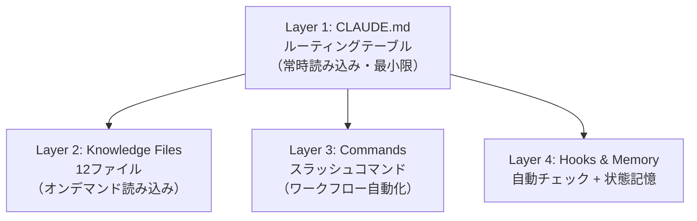

## はじめに

SNSでこんなCLAUDE.mdを見かけました。

```markdown
# IMPORTANT: When creating repos, remember to create them
# using Master Branch instead of Main Branch naming scheme!
```

1行だけ。これはこれで動きますが、CLAUDE.mdの本来のポテンシャルを考えると、もったいない使い方です。一方で、前回の記事「[CLAUDE.md設計ガイド - AIエージェントに環境を理解させる15セクション](https://zenn.dev/correlate_dev/articles/claude-md-guide)」では逆の極端に振っていました。15セクション、300行超。あらゆる情報を1ファイルに詰め込んだ「全部入り」です。

1行だけのCLAUDE.mdと、300行の全部入りCLAUDE.md。どちらも最適解ではありませんでした。

運用を続けて気づいたのは、15セクション構成にも問題があるということです。BigQuery操作をしている最中にfreee APIのルールが読み込まれ、セッション管理の作業中にCSS命名規則がコンテキストを占有する。15セクション全てが常時読み込まれるため、今の作業に関係ない情報が毎回コンテキストウィンドウを消費している状態でした。

:::message
CLAUDE.mdの役割は、全情報を詰め込むことでも、設定を1行メモすることでもありません。必要な知識に最短でたどり着くための**ルーティングテーブル**です。
:::

本記事では、15セクション構成のCLAUDE.mdをルーティングテーブルに進化させ、12個のKnowledge Filesに知識を分離した実践記録を共有します。

## Before: 15セクション構成の限界

前回の記事で紹介した構成は、以下のようなものでした。

```
~/dev/CLAUDE.md（15セクション、300+行）
├── 作業者情報
├── フォルダ構成
├── 開発環境
├── コーディング規約（JS/TS/CSS/PHP全て）
├── Git運用
├── 禁止事項
├── エラー対処方針
├── セッション管理ルール（開始/作業中/終了）
├── 記録ルール（強化版）
├── 連携サービス
├── FIRE基準
├── コンテンツパイプライン
├── 情報収集ルール
├── チーム編成ルール
└── 同期構成
```

この構成には2つの問題がありました。

### 問題1: 常時読み込みのコスト

Claude Codeは起動時にCLAUDE.mdを読み込みます。15セクション全てが毎回コンテキストに入るため、BigQuery操作中にWordPressのコーディング規約が、エラー対処中にコンテンツパイプラインのワークフローが、それぞれコンテキストウィンドウを消費していました。

これは単なるトークン効率の問題ではありません。LLMには「提示された情報は全て使うべき」と解釈する傾向があります（いわばチェーホフの銃[^2]の効果です）。BigQueryの作業中にCSS命名規則が目に入ると、関係ないのに考慮しようとする。情報が多すぎると、かえって意味的な干渉が発生するのです。

[^2]: 「物語に登場した銃は必ず発砲されなければならない」という創作原則。LLMもコンテキストに含まれた情報を「使おうとする」傾向がある。この問題は「[脱・ファット・CLAUDE.md](https://zenn.dev/smartshopping/articles/refactor-fat-claude-md)」でも「チェーホフの銃の誤謬」として指摘されている

### 問題2: メンテナンスの困難さ

1ファイル300行超になると、特定のセクションを見つけて更新するだけでも手間がかかります。さらに`~/.claude/CLAUDE.md`（グローバル設定）と`~/dev/CLAUDE.md`（ワークスペース設定）の2つを管理していたため、同じ情報が2箇所に分散して整合性が取れなくなるケースが出始めていました。

## ルーティングテーブル設計とは

解決のヒントはネットワーク設計にありました。

ネットワークのルーターは、パケットの宛先に応じて転送先を決定するルーティングテーブルを持っています。全てのデータを保持するのではなく、「このパケットはこの経路に送る」という振り分けルールだけを保持する仕組みです。この発想をCLAUDE.mdに応用します。

```
Before: CLAUDE.md = 全データを持つ単一ファイル
After:  CLAUDE.md = ルーティングテーブル（振り分けルール）
        Knowledge Files = 実データ（オンデマンド取得）
```

ルーティングテーブルとは、「どの作業をしている時に、どのファイルを読むべきか」だけを記述したテーブルです。詳細な知識は全て別ファイル（Knowledge Files）に移動します。

```markdown
| トリガー | ファイル | 内容 |
|----------|---------|------|
| BigQuery操作時 | bigquery-patterns.md | スキーマ、冪等INSERT、ビュー |
| Vercel操作時 | vercel-patterns.md | prebuiltデプロイ、OIDC |
| コード記述時 | coding-standards.md | 命名規則、Git運用、禁止事項 |
```

Claude Codeは起動時にCLAUDE.mdを読み、ルーティングテーブルを把握します。そしてBigQuery操作が必要になった時点で初めて`bigquery-patterns.md`を読む。必要な時に必要な知識だけをロードする設計です。

### @import構文との違い

Claude Codeには`@path/to/file`でファイルをインポートする`@import`構文があります。これを使えばKnowledge Filesを常時読み込ませることもできますが、本記事のアプローチでは@importを使いません。

```markdown
# @importを使う場合（常時読み込み）
@~/.claude/knowledge/bigquery-patterns.md  ← 毎回コンテキストに入る
@~/.claude/knowledge/vercel-patterns.md    ← 毎回コンテキストに入る

# ルーティングテーブル方式（オンデマンド）
BigQuery操作時 → bigquery-patterns.md を読むこと  ← 必要な時だけ
```

@importは便利ですが、ファイル数が増えると結局Before（全情報常時読み込み）と同じ状態になります。ルーティングテーブル方式では、CLAUDE.mdに書かれた「トリガー条件」をエージェントが判断して、該当するKnowledge Fileだけを`Read`ツールで読みます。つまり読み込みの判断をエージェント自身に委ねるのがポイントです。

## 4層アーキテクチャ

ルーティングテーブル設計を実現するために、情報を4つのレイヤーに分離しました。



### Layer 1: CLAUDE.md（ルーティングテーブル）

CLAUDE.mdには以下の4つだけを記述します。

1. MUST Rules（5〜7項目） -- 常に遵守すべき最低限のルール
2. Knowledge Files ルーティングテーブル -- トリガー→ファイルの対応表
3. Commands リスト -- 利用可能なスラッシュコマンド
4. 環境概要 -- 最小限の環境情報

MUST Rulesは「常にコンテキストに入っていて欲しい」最重要ルールです。私の場合は以下の7つです。

```markdown
## MUST Rules（常に遵守）
1. 全セッションで /session-start を実行
2. セッション記録の逐次更新: git commit前に必ずセッション記録を更新
3. セッション終了時にコンテンツ候補を自動抽出
4. 記事執筆前にDeep Research必須: リサーチノートなしで執筆禁止
5. Agent Teamsに必ずDA（デビルズアドボケイト）を含める
6. APIキー・シークレットのハードコード禁止
7. 本番環境への直接操作禁止
```

MUST Rulesは5〜7項目程度に絞るのがポイントです。最初は5項目でしたが、運用で「抜け漏れが起きた項目」を追加して現在7項目になりました。多すぎると「全部重要 = 何も重要でない」になるため、10項目は超えないようにしています。

### Layer 2: Knowledge Files（12ファイル）

`~/.claude/knowledge/`ディレクトリに、ドメインごとのナレッジファイルを配置します。

```
~/.claude/knowledge/
├── bigquery-patterns.md      # BQスキーマ、冪等INSERT、ビュー
├── cloud-run-patterns.md     # デプロイ、URL管理、Scheduler連携
├── vercel-patterns.md        # prebuiltデプロイ、OIDC
├── freee-api.md              # トークン管理、API制約
├── zenn-publishing.md        # レートリミット、Publication
├── content-pipeline.md       # Deep Researchゲート、配信先
├── fire-criteria.md          # 案件判断基準、KPI設定
├── coding-standards.md       # 命名規則、Git運用、禁止事項
├── debugging-protocol.md     # エラー対処フロー
├── decision-protocol.md      # Three Options Rule
├── session-management.md     # セッション記録ルール
└── agent-teams.md            # DA運用、並列実行
```

各ファイルのサイズは平均1,117バイト（約27行）です。1ファイル約1KBを目安にしています。

実際のファイルの例を示します。

```markdown
<!-- 最終更新: 2026-02-10 -->
# BigQuery Patterns

## プロジェクト
- GCPプロジェクト: `correlate-workspace`
- データセット: `workspace`
- 25テーブル + 4ビュー（2026-02-10時点）

## データ投入パターン
- 冪等INSERT: DELETE WHERE source=X + INSERT（重複防止）
- MERGE (upsert): 複数ソースが同テーブルに書く場合
- ストリーミングAPI禁止: バッファ最大90分、DMLと競合
- バッチサイズ: 1000件/バッチ

## スキーマ変更
- ADD COLUMNはDEFAULT句を同時指定不可
- 手順: ADD COLUMN → ALTER COLUMN SET DEFAULT → UPDATE WHERE NULL

## SQL安全
- f-stringでパラメータ埋め込み禁止（SQLインジェクション）
- bq showでスキーマ確認してからSQL書く
```

設計指針として、3つの点を意識しています。1ファイル1ドメイン（BigQuery、Vercel等、明確に分かれるもの）であること。概念の説明は不要で（エージェントは知っている）、自分の環境固有の情報を書くこと。先頭に`<!-- 最終更新: YYYY-MM-DD -->`を入れて鮮度を管理すること。

### Layer 3: Commands（スラッシュコマンド）

`.claude/commands/`に定型ワークフローをMarkdownで定義します。

```
~/.claude/commands/
├── session-start.md     # セッション開始ルーチン
├── session-end.md       # セッション終了ルーチン
├── da-review.md         # デビルズアドボケイトレビュー
├── content-research.md  # Deep Research実施
├── content-scout.md     # 競合記事分析
├── news-scan.md         # ニュース速報スキャン
├── workspace-improve.md # ワークスペース改善適用
└── design-implement.md  # デザイン分析→実装
```

現在8つのコマンドを運用しています。例えば`/session-start`は、前回セッション確認→Daily Note作成→セッション記録作成→タスク宣言という一連の手順を自動化します。`$ARGUMENTS`プレースホルダで引数も受け取れるため、`/da-review Knowledge Files`のように対象を指定できます。

### Layer 4: Hooks & Auto Memory

HooksはClaude Codeのイベントに反応して自動実行されるスクリプトです。

以下は`~/.claude/settings.json`の設定例です。

```json
{
  "hooks": {
    "PreToolUse": [{
      "matcher": "Write|Edit",
      "hooks": [{"type": "command", "command": "~/.claude/hooks/check-domain.sh"}]
    }],
    "Stop": [{
      "matcher": "",
      "hooks": [{"type": "command", "command": "~/.claude/hooks/session-reminder.sh"}]
    }]
  }
}
```

私は主に2つのHookを運用しています。

1. `check-domain.sh` -- Write/Edit操作時に、廃止済みドメインの誤使用を検知してブロック
2. `session-reminder.sh` -- セッション終了時に、Handoffセクション未記入をリマインド

Hookのレスポンスは`{"decision":"approve"}`または`{"decision":"block","reason":"理由"}`のJSON形式です。blockを返すとその操作が中止されます。

Auto Memory（`~/.claude/projects/<project>/memory/`）は、プロジェクトごとの状態を記録します。MEMORY.mdの先頭200行が自動読み込みされるため、ここには現在の状態・進捗・Pending Itemsだけを書き、詳細はトピック別ファイルに分離します。

## After: 数値で見る改善効果

以下は移行直後（2026-02-10）の実測値です。Beforeは移行前の推定値（15セクション構成時にCLAUDE.md 2ファイルの全行数を合算）です。

### ファイルサイズ比較

| ファイル | Before（推定） | After（実測） | 削減率 |
|---------|---------------|--------------|--------|
| `~/.claude/CLAUDE.md` | 200+行 | 65行 / 3,097B | **約67%** |
| `~/dev/CLAUDE.md` | 300+行 | 108行 / 4,121B | **約64%** |

### Knowledge Files（新規作成・初期12ファイル）

| 指標 | 数値 |
|------|------|
| ファイル数 | 12 |
| 合計サイズ | 13,407バイト |
| 平均サイズ | 1,117バイト/ファイル |
| 平均行数 | 約27行/ファイル |

### コンテキスト消費の変化

| シナリオ | Before | After |
|---------|--------|-------|
| 起動時（常時読み込み） | 500+行（全情報） | 173行 / 7,218B（CLAUDE.md 2ファイル + MEMORY.md先頭200行） |
| BigQuery作業時 | 同上（変化なし） | +25行 / ~1KB（bigquery-patterns.md追加） |
| 通常作業（1-2ファイル参照） | 同上 | ~9.4KB |
| 最悪ケース（全12ファイル参照） | 同上 | ~20.6KB |

起動時の常時読み込みが大幅に削減され、必要な時に必要な知識だけをロードする形になりました。なお、Auto MemoryのMEMORY.md（先頭200行）も常時読み込み対象ですが、ここには「現在の状態」だけを書くため追加コストは小さくなります。

英語圏でも同様のアプローチで54%のコンテキスト削減が報告されており[^1]、この設計パターンの有効性を裏付けています。

[^1]: [Claude Code Context Optimization: 54% reduction](https://gist.github.com/johnlindquist/849b813e76039a908d962b2f0923dc9a)

## .claude/rules/ との使い分け

Claude Codeには`.claude/rules/`というモジュラールールの仕組みもあります。Knowledge Filesとの違いを整理します。

| 観点 | .claude/rules/ | Knowledge Files |
|------|---------------|----------------|
| トリガー | **ファイルパス**（YAMLのpaths指定） | **作業コンテキスト**（ルーティングテーブル） |
| 例 | `*.tsx`操作時にReactルール適用 | BigQuery作業時にBQパターン適用 |
| 読み込み | paths指定で自動読み込み | CLAUDE.mdの指示に基づきエージェントが判断 |
| 共有 | Git管理（チーム共有向き） | ~/.claude/配下（個人向き） |

`.claude/rules/`ではYAMLフロントマターの`paths`指定が重要です。`paths`を指定しないとCLAUDE.mdと同様に起動時に常時読み込まれますが、`paths: ["src/**/*.ts"]`のように指定すると対象ファイル操作時にのみ動的にロードされます。実測で200KBのルールを動的ロードした場合、コンテキスト消費が+17%増加するという報告もあり[^3]、常時読み込みのコストは無視できません。

使い分けの指針としては、ファイル種別に紐づくルール（TypeScript記法、CSS命名規則等）は`.claude/rules/`へ、作業タスクに紐づく知識（BigQueryのデータ投入パターン、freee APIの制約等）はKnowledge Filesへ配置します。両者は排他ではなく、補完関係にあります。

[^3]: [CLAUDE.mdの肥大化を防ぐ！.claude/rules/で動的にルールを読み込む方法 - Zenn](https://zenn.dev/tmasuyama1114/articles/claude_code_dynamic_rules)

## 設計のアンチパターン

Knowledge Files分離で陥りやすいアンチパターンを5つ紹介します。

### 1. Knowledge Fileが巨大すぎる

1ファイルが50KBを超えると、読み込んだ時点でコンテキストを大量消費します。1ファイル1KB前後を目安に分割してください。

### 2. ルーティングテーブルに詳細を書く

CLAUDE.mdのルーティングテーブルに「BigQueryではバッチサイズ1000件で...」のような詳細を書くと、インデックスが肥大化してBeforeの状態に逆戻りします。テーブルにはトリガーとファイル名だけを書きます。

### 3. 全ファイルを@importで常時読み込む

Claude Codeの`@import`構文を使って全Knowledge Filesを`CLAUDE.md`にimportすると、分離した意味がなくなります。@importは「ほぼ毎回必要なファイル」にのみ使い、残りはオンデマンド参照にします。

### 4. ファイル間に重複情報を持つ

同じ情報をKnowledge FilesとMEMORY.mdの両方に書くと、更新時に片方だけ修正して矛盾が生じます。Single Source of Truthを原則に、1つの情報は1つのファイルにだけ書き、他からは参照します。

:::message
実際にこのアンチパターン#4を犯しました。DAレビューで「Cloud Runサービス名が3箇所に記載されており、URL変更時に全箇所の更新が必要」と指摘を受け、重複を削除しました。
:::

### 5. CLAUDE.mdをAIに自動生成させる

「CLAUDE.mdを作って」とClaudeに丸投げすると、汎用的で冗長な内容が生成されがちです。Claude Code公式ドキュメントでも、CLAUDE.mdの内容は手動でキュレーションすることが推奨されています[^4]。ルーティングテーブルもKnowledge Filesも、自分の環境固有の知見を自分で書くことに価値があります。

[^4]: [Manage Claude's memory - Claude Code公式ドキュメント](https://code.claude.com/docs/en/memory) 「Best practices」セクション参照

## まとめ: ルーティングテーブル設計の3原則

1. CLAUDE.mdは「何を・いつ読むか」だけを書く -- インデックスに徹する
2. Knowledge Filesは「1トピック1ファイル・~1KB」 -- 小さく分けて必要な時だけロード
3. 起動時読み込みは最小限に、残りはオンデマンド -- 常時コンテキストはMUST Rulesだけ

「Context Engineering」という言葉が注目を集めています。適切なコンテキストを、適切なタイミングで、適切な量だけ提供する。ルーティングテーブル設計は、そのための実践的なパターンの1つです。

前回の記事で「15セクション構成」を紹介しましたが、運用が進むにつれてCLAUDE.mdも進化する必要がありました。皆さんの環境でも、CLAUDE.mdが300行を超えてきたら、ルーティングテーブル化を検討してみてください。

---

この記事は「CLAUDE.md設計ガイド」シリーズの第2弾です。

- 第1弾: [CLAUDE.md設計ガイド - AIエージェントに環境を理解させる15セクション](https://zenn.dev/correlate_dev/articles/claude-md-guide)

:::message
補記（2026-02-11時点）: 本記事で紹介した12ファイル構成は初期設計時（2026-02-10）の状態です。その後の運用で`scout-topics.md`（情報収集トピック定義）と`design-implementation.md`（デザイン実装プロトコル）を追加し、14ファイルになっています。ルーティングテーブルに1行追加するだけで拡張できるのが、この設計パターンの利点です。
:::

参考資料:
- [Manage Claude's memory - Claude Code公式ドキュメント](https://code.claude.com/docs/en/memory)
- [Create plugins - Claude Code公式ドキュメント](https://code.claude.com/docs/en/plugins)
- [Context Engineering for Coding Agents - Martin Fowler](https://martinfowler.com/articles/exploring-gen-ai/context-engineering-coding-agents.html)
- [Claude Codeで効率的に開発するための知見管理 - driller](https://zenn.dev/driller/articles/2a23ef94f1d603)
- [脱・ファット・CLAUDE.md - hono3bono3](https://zenn.dev/smartshopping/articles/refactor-fat-claude-md)
- [CLAUDE.mdの肥大化を防ぐ！.claude/rules/で動的にルールを読み込む方法 - tmasuyama1114](https://zenn.dev/tmasuyama1114/articles/claude_code_dynamic_rules)
