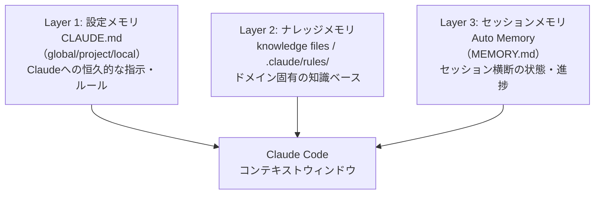

## はじめに

Claude Codeを使い始めて数週間が経ったころ、こんな経験をしました。

「先週Claudeに伝えたはずのプロジェクト固有のルール、また無視された」

「前回のセッションで途中まで進めた実装、Claudeに説明するところから始めないといけない」

Claude Codeはセッションをまたぐと記憶が消える。これはLLMの基本的な制約です。しかし「記憶が消える」と諦める必要はありません。Claude Codeには、情報の性質に応じた複数のメモリ機構が用意されています。

本記事では、Claude Codeのメモリを3つの層に整理し、それぞれの仕組みと使い分け基準を解説します。

:::message
本記事は「CLAUDE.md設計ガイド」シリーズの第3弾です。第1弾（[CLAUDE.md設計ガイド](https://zenn.dev/correlate_dev/articles/claude-md-guide)）でCLAUDE.mdの設計思想、第2弾（[Knowledge Files分離](https://zenn.dev/correlate_dev/articles/claude-code-knowledge-files)）でルーティングテーブル設計を扱いました。本記事ではそれらを踏まえ、3種類のメモリ機構を組み合わせた「長期記憶設計」に焦点を当てます。
:::

## Claude Codeのメモリ階層

Claude Codeの公式ドキュメントでは、6種類のメモリファイルが定義されています。

| メモリ種別 | ファイルパス | スコープ | 共有範囲 |
|-----------|-------------|---------|----------|
| Managed policy | `/Library/Application Support/ClaudeCode/CLAUDE.md` | 組織全体 | IT管理者が設定 |
| User memory | `~/.claude/CLAUDE.md` | 全PJ共通 | 自分のみ |
| Project memory | `./CLAUDE.md` または `./.claude/CLAUDE.md` | プロジェクト | チーム（Git管理） |
| Project rules | `./.claude/rules/*.md` | トピック別 | チーム（Git管理） |
| Local memory | `./CLAUDE.local.md` | PJ個人 | 自分のみ（Git管理外） |
| Auto memory | `~/.claude/projects/<hash>/memory/` | PJ自動 | 自分のみ |

これらを一度に把握しようとすると複雑に見えますが、情報の性質で整理すると3つの層に収まります。



3層の違いを一言で表すなら、次のようになります。

- 設定メモリ: 「どう動くべきか」のルール（人間が書き、永続する）
- ナレッジメモリ: 「何を知っているか」の知識（人間が書き、中期間持続する）
- セッションメモリ: 「今どこにいるか」の状態（Claudeと人間が書き、タスクが完了するまで持続する）

## 第1層: 設定メモリ（CLAUDE.md群）

設定メモリはClaude Codeへの恒久的な指示です。エージェントの振る舞いを制御する「ルールブック」として機能します。

### globalとprojectとlocalの使い分け

CLAUDE.mdには3つのスコープがあります。

#### global（`~/.claude/CLAUDE.md`）

全プロジェクト・全セッションに適用されます。ここには「どのプロジェクトでも絶対に変えたくないルール」だけを書きます。

```markdown
## MUST Rules（常に遵守）

1. 全セッションで /session-start を実行
2. セッション記録の逐次更新: git commit前に必ずセッション記録を更新
3. 記事執筆前にDeep Research必須: リサーチノートなしで執筆禁止
4. APIキー・シークレットのハードコード禁止
5. 本番環境への直接操作禁止（ステージング経由必須）
```

globalに書くルールは5〜7項目程度に絞るのが重要です。「全部重要 = 何も重要でない」になるため、本当に外せないルールだけに絞ります。

#### project（`~/dev/CLAUDE.md` や `./CLAUDE.md`）

プロジェクト固有の情報を書きます。ワークスペース全体をカバーする`~/dev/CLAUDE.md`を一段上の「中間レイヤー」として使うのが、複数プロジェクトを横断する際に有効なパターンです。

```markdown
## 開発環境

| ツール | バージョン |
|--------|-----------|
| Node.js | v24.2.0 |
| Python | 3.12.0 (pyenv) |
| Docker/DDEV | 28.5.2 / v1.24.10 |

マシン: Mac mini M4 Pro 64GB（メイン）/ MacBook Pro M2（モバイル）
```

#### local（`./CLAUDE.local.md`）

個人専用・一時的な設定を書きます。このファイルはGit管理外にしておくことが推奨されています（プロジェクトの`.gitignore`に追加されます）。

```markdown
# このスプリントの作業制約

- src/auth/ ディレクトリは今回の作業スコープ外。触れない
- パフォーマンス最適化は次スプリントに先送り
- 現在テスト環境がダウン中。テスト実行は不要
```

### 重要な仕様: より具体的な指示が優先される

globalに書いたルールは、projectのCLAUDE.mdで上書きできます。この仕様を理解していないと「globalに書いたのに効かない」という混乱が起きます。

例えば、globalで「コメントは日本語で書く」と指定していても、英語圏チームのプロジェクトCLAUDE.mdで「コメントは英語で書く」と書けば、そのプロジェクトでは英語が優先されます。globalには「どのプロジェクトでも上書きしたくない」制約だけを置くべきです。

## 第2層: ナレッジメモリ（knowledge files）

ナレッジメモリは「ドメイン固有の知識ベース」です。設定メモリとの違いは、Claudeへの「ルール」ではなく「情報」を提供する点にあります。

### knowledge filesとは

`~/.claude/knowledge/`に配置するMarkdownファイル群です。詳しい設計パターンは第2弾記事で解説していますが、要点は「ルーティングテーブル方式」と「1ファイル1ドメイン」の2点です。

```
~/.claude/knowledge/
├── bigquery-patterns.md      # BQスキーマ、冪等INSERT、ビュー
├── cloud-run-patterns.md     # デプロイ、URL管理、Scheduler連携
├── vercel-patterns.md        # prebuiltデプロイ、OIDC
├── freee-api.md              # トークン管理、API制約
├── zenn-publishing.md        # レートリミット、Publication
├── content-pipeline.md       # Deep Researchゲート、配信先
├── coding-standards.md       # 命名規則、Git運用、禁止事項
├── debugging-protocol.md     # エラー対処フロー
└── session-management.md     # セッション記録ルール
```

各ファイルの平均サイズは約1KB。「エージェントがすでに知っている概念の説明」は書かず、「自分の環境固有の情報」だけを記述します。

### .claude/rules/ との住み分け

ナレッジメモリの実現方法は2つあります。

| 観点 | knowledge files | .claude/rules/ |
|------|----------------|----------------|
| ロードのトリガー | 作業コンテキスト（ルーティングテーブル） | ファイルパス（YAMLのpaths指定） |
| 例 | BigQuery操作時にBQパターンを読む | `*.tsx` 操作時にReactルールを適用 |
| 管理場所 | `~/.claude/knowledge/`（個人） | `.claude/rules/`（プロジェクト・チーム） |
| Git管理 | 管理外（個人設定） | 管理対象（チーム共有可） |

ファイル種別に紐づくルール（TypeScriptの記法、CSSの命名規則など）は`.claude/rules/`へ、作業タスクに紐づく知識（BigQueryのデータ投入パターン、freee APIの制約など）は`knowledge files`へ配置するのが目安です。

`.claude/rules/`でよく使うpaths指定のパターンを示します。

```yaml
---
paths:
  - "src/**/*.ts"
  - "src/**/*.tsx"
---
# TypeScript/React ルール

- Propsの型定義は必ずinterfaceを使う（typeエイリアスでなく）
- コンポーネントの命名はPascalCase
```

`paths`を指定しないと、そのルールファイルは常時読み込まれます。ルールの数が増えてきたら、`paths`指定を活用して動的ロードに切り替えることを検討してください。

## 第3層: セッションメモリ（auto memory）

セッションメモリは「今どこにいるか」の状態を記録するメモリです。設定メモリやナレッジメモリが「変わらない情報」を保持するのに対し、セッションメモリは「現在の状態」を追跡します。

### auto memoryの仕組み

auto memoryは`~/.claude/projects/<hash>/memory/`に保存されます。`<hash>`はプロジェクトパスから生成されるため、プロジェクトごとに独立したメモリ領域を持ちます。

```
~/.claude/projects/
└── <project-hash>/
    └── memory/
        ├── MEMORY.md          # 先頭200行が常時読み込み
        ├── design-decisions.md # 設計決定の記録（オンデマンド）
        └── error-log.md       # エラー記録（オンデマンド）
```

MEMORY.mdの先頭200行は、セッション開始時にシステムプロンプトへ自動的に読み込まれます。200行を超えた部分は読み込まれません。トピック別ファイルはClaude自身が「これが必要だ」と判断した時にオンデマンドで読みます。

### MEMORY.mdに書くべき内容

200行という制限があるため、MEMORY.mdには「現在の状態」に絞った情報を書きます。

```markdown
# Project Memory

## 現在の作業状態（2026-02-23更新）

### 進行中のタスク
- [ ] APIレート制限エラーの修正（src/api/client.ts）
- [ ] BigQueryのMERGE文をべき等化に変更

### 直近の重要な決定
- Cloud Run のインスタンス数を最小0→1に変更（コールドスタート対策、2026-02-20）
- freee APIのトークンリフレッシュはバックエンド側で管理することに決定

### 未解決の問題
- Vercelのビルドが週1回タイムアウトする（調査中）

## 完了済み（削除候補）
- [x] 認証フローのリファクタリング（2026-02-15完了）
```

「完了済み」の情報は定期的に削除することが重要です。放置すると200行がすぐに埋まり、重要な現在情報が読み込まれなくなります。

### メモリへの書き込み方法

Claudeがauto memoryに書き込む方法は2つあります。

1つ目は`#`プレフィックスです。プロンプトの先頭に`#`を入力すると、保存先のメモリファイルを選択するUIが起動します。

```
# この実装ではリトライ回数を3回に固定している（仕様）
```

2つ目は、Claudeが作業中に自律的にメモリへ保存する動作です。設定メモリやコマンドで「重要な決定はMEMORY.mdに記録する」と指示しておくと、Claudeが自動的にメモリを更新します。

## 3層の使い分け基準

3層のどこに何を書くかを整理します。

| 情報の種類 | 書く場所 | 理由 |
|-----------|---------|------|
| 全PJ共通の絶対ルール | global CLAUDE.md | どのPJでも常時適用、上書き不可にしたい |
| 環境情報・チームルール | project CLAUDE.md | PJ固有だが全セッションで必要 |
| 個人的な一時制約 | CLAUDE.local.md | Git管理外・個人専用・一時的 |
| ファイルパス紐づきルール | .claude/rules/（paths指定） | 対象ファイル操作時のみロード |
| タスク紐づき知識 | knowledge files | ルーティングテーブルでオンデマンド |
| 現在のタスク進捗・状態 | MEMORY.md（先頭部） | セッション横断の状態記憶 |
| タスクの設計決定・詳細記録 | MEMORY.mdトピックファイル | オンデマンド読み込み |

情報の「変化する頻度」と「スコープ」で判断するのが実践的です。

- 変化しない × 全PJ共通 → global CLAUDE.md
- 変化しない × PJ固有 → project CLAUDE.md
- 変化しない × 個人的 → knowledge files
- 変化する × 現在の状態 → MEMORY.md

## 実際の運用例（コラレイトデザインのパターン）

ここでは私の実際の設定構成を紹介します。

### global CLAUDE.md（~/.claude/CLAUDE.md）

```markdown
## MUST Rules（常に遵守）

1. 全セッションで /session-start を実行
2. セッション記録の逐次更新: git commit前に必ずセッション記録を更新
3. セッション終了時にコンテンツ候補を自動抽出
4. 記事執筆前にDeep Research必須
5. Agent Teamsは4性格体制を推奨
6. APIキー・シークレットのハードコード禁止
7. 本番環境への直接操作禁止（ステージング経由必須）

## Knowledge Files ルーティング

作業内容に応じて `~/.claude/knowledge/` の該当ファイルを読むこと:

| トリガー | ファイル | 内容 |
|----------|---------|------|
| BigQuery操作時 | `bigquery-patterns.md` | スキーマ、冪等INSERT、ビュー |
| Cloud Run操作時 | `cloud-run-patterns.md` | デプロイ、URL管理 |
| Zenn記事公開時 | `zenn-publishing.md` | レートリミット、Publication |
| コード記述時 | `coding-standards.md` | 命名規則、Git運用 |
```

このファイルは65行 / 約3KB。MUST Rulesとルーティングテーブルに絞ることで、全プロジェクトで常時読み込まれても許容できるサイズを維持しています。

### project CLAUDE.md（~/dev/CLAUDE.md）

ワークスペース全体をカバーする中間レイヤーとして機能します。

```markdown
## 開発環境

| ツール | バージョン |
|--------|-----------|
| Node.js | v24.2.0 |
| pnpm | 10.28.2 |
| Python | 3.12.0 (pyenv) |

マシン: Mac mini M4 Pro 64GB（メイン）/ MacBook Pro M2（モバイル）

## フォルダ構成

~/dev/
├── projects/client/      ← クライアント案件
├── projects/self/        ← 自社PJ
├── correlate-workspace/  ← メインリポジトリ
└── Obsidian/             ← ナレッジベース
```

このファイルは108行 / 約4KB。環境情報とフォルダ構成に絞ることで、常時読み込みのコストを抑えています。

### MEMORY.md（~/.claude/projects/.../memory/MEMORY.md）

```markdown
# Workspace Memory

## 進行中のタスク（2026-02-23）

- Zenn記事「claude-code-memory-design」執筆中
- BantouAI: 検索機能の実装（src/features/search/）

## 直近の決定事項

- Zennシリーズは週1本ペースで公開（月曜午前）
- Cloud Run: 最小インスタンス数を0→1に変更（2026-02-20）

## 未解決事項

- Google Analytics 4 のイベント設計レビュー待ち
```

MEMORY.mdには「今週のタスク状態」だけを書き、完了したタスクは週次で削除します。詳細な設計記録はトピックファイルに移動します。

## よくある失敗パターン

3層設計を導入する際に陥りやすい失敗を4つ紹介します。

### 失敗1: globalとprojectの書き分けを誤る

globalに書いたルールがprojectのCLAUDE.mdで上書きされていることに気づかず「Claudeがルールを無視している」と感じるパターンです。

原因は「より具体的な指示が優先される」というClaude Codeの仕様です。globalに書いた指示はprojectのCLAUDE.mdで上書きできます。globalには「絶対に上書きしたくないルール」だけを書き、プロジェクト固有の設定はprojectに書きましょう。

### 失敗2: CLAUDE.local.mdのコミット

CLAUDE.local.mdは「Git管理外にしたい個人設定」のためのファイルです。しかしプロジェクトの`.gitignore`への追加は自動ではありません（Claude Codeが`.gitignore`への追記を提案しますが、実行するかどうかは自分次第です）。

グローバルの`.gitignore`に`CLAUDE.local.md`を追加しておくと安全です。

```bash
echo "CLAUDE.local.md" >> ~/.gitignore_global
git config --global core.excludesfile ~/.gitignore_global
```

### 失敗3: MEMORY.mdの200行超過放置

MEMORY.mdの先頭200行しか自動読み込みされません。完了したタスクや古い状態を放置すると、200行がすぐに埋まり、現在進行中の重要情報がシステムプロンプトに入らなくなります。

週次でMEMORY.mdの棚卸しをする習慣を付けましょう。完了タスクは削除、詳細な設計記録はトピックファイルへ移動します。

### 失敗4: knowledge fileとMEMORY.mdの情報重複

knowledge fileに「BigQueryの現在のテーブル数は25」と書き、MEMORY.mdにも同じ情報を書くパターンです。どちらかを更新した時に矛盾が生じます。

knowledge fileには「変わらない仕様・パターン」を書き、MEMORY.mdには「現在の状態（いつ変わるかわからない情報）」を書く、という役割分担を意識してください。

## まとめ

Claude Codeのメモリを3層で整理すると、「何をどこに書くべきか」の判断が明確になります。

- 設定メモリ（CLAUDE.md群）: 「どう動くべきか」のルール。globalはMUST Rulesに絞り、projectには環境情報、localには一時的な個人制約を書く
- ナレッジメモリ（knowledge files / .claude/rules/）: 「何を知っているか」の知識。作業コンテキストやファイルパスをトリガーにオンデマンドロード
- セッションメモリ（auto memory）: 「今どこにいるか」の状態。MEMORY.mdの先頭200行が常時読み込まれるため、現在の状態だけを書き、定期的に棚卸しする

3層を意識した設計で、セッションをまたいでもコンテキストが持続するClaude Code環境を構築できます。

---

本シリーズの構成:

- 第1弾: [CLAUDE.md設計ガイド - AIエージェントに環境を理解させる15セクション](https://zenn.dev/correlate_dev/articles/claude-md-guide)
- 第2弾: [CLAUDE.mdを「ルーティングテーブル」に進化させる - 12のKnowledge Filesで67%スリム化した実践記録](https://zenn.dev/correlate_dev/articles/claude-code-knowledge-files)
- 第3弾: 本記事

参考資料:

https://code.claude.com/docs/en/memory

https://code.claude.com/docs/en/best-practices

https://zenn.dev/correlate_dev/articles/claude-md-guide

https://zenn.dev/correlate_dev/articles/claude-code-knowledge-files
