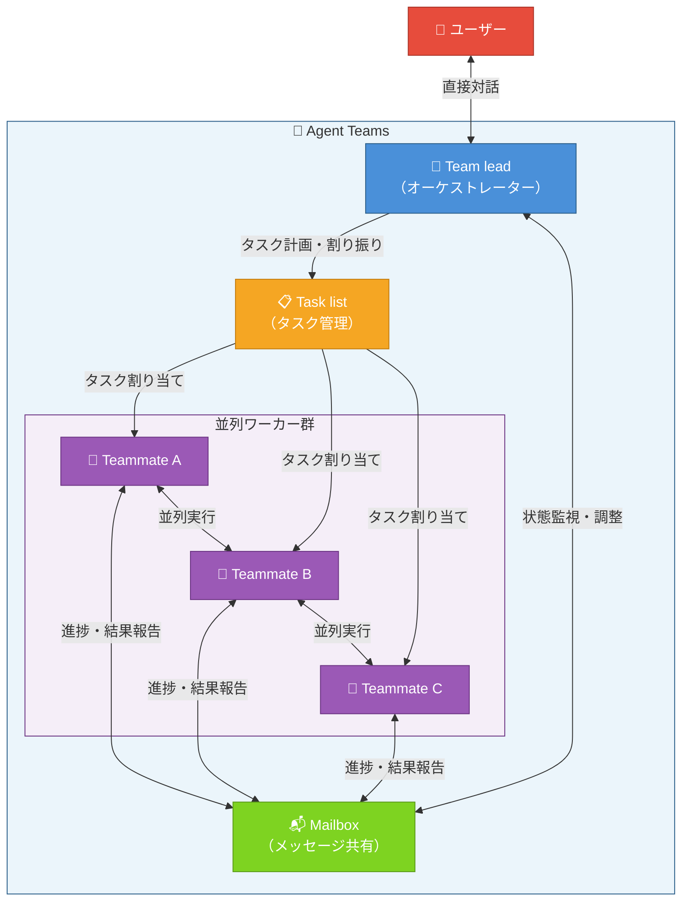
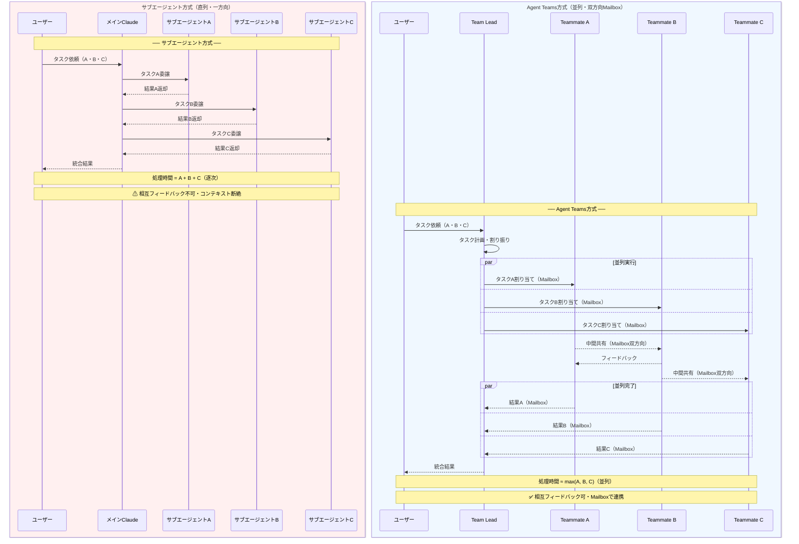
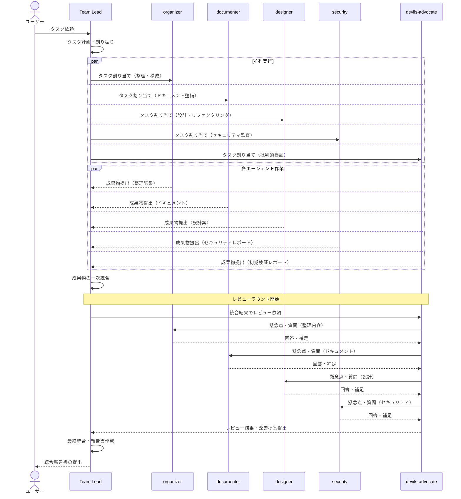
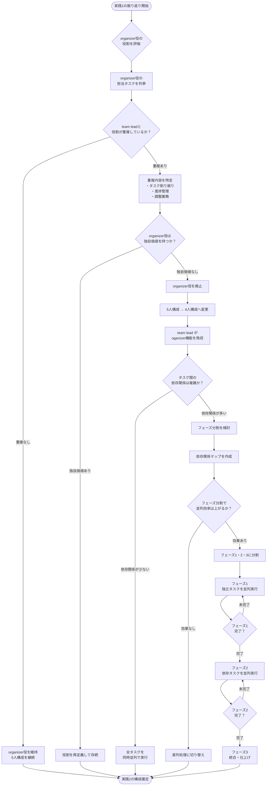

## はじめに - なぜAgent Teamsを使ったのか

Mac mini M4 Proの環境構築を始めたとき、やるべきタスクの多さに圧倒されました。

セキュリティ設定の監査、ドキュメントの整備、既存スクリプトのリファクタリング、依存パッケージの整理——これらを順番にこなしていくだけでは、何日あっても足りません。「同時に複数のことを進められないか」という課題感が、Claude Code Agent Teamsを試してみた直接のきっかけです。

### サブエージェントでは不十分だった理由

Claude Codeには、以前からサブエージェント機能があります。メインのClaudeが必要に応じてサブエージェントを呼び出し、特定のタスクを委譲できる仕組みです。

しかしサブエージェントには、実際に使っていて気になる制約がありました。

- **直列処理が基本**: サブエージェントは基本的に順番に呼ばれるため、「AとBを同時に進める」が難しい
- **コンテキストの断絶**: 各サブエージェントは独立したコンテキストで動くため、相互フィードバックができない
- **オーケストレーションの限界**: 複数タスクの依存関係を管理するロジックを自分で書く必要がある

Agent Teamsは、これらの課題に直接対応する機能として登場しました。本記事執筆時点（2025-07-14）の情報であり、モデル名・機能仕様は公式リリースノートを必ずご確認ください。実際に2回のAgent Teams運用を経験してみて、「サブエージェントとは明らかに違う使い心地」を体感できたので、その記録を共有します。

---

## Agent Teamsの基本 - 基本アーキテクチャと構成要素



### Team lead / Teammates / Task list / Mailboxの構成

Agent Teamsは以下の4つのコンポーネントで構成されています。

| コンポーネント | 役割 |
|---|---|
| Team lead | チーム全体のタスクを計画・割り振りするオーケストレーター。ユーザーと直接対話する |
| Teammates | Team leadから割り当てられたタスクを実行する個別エージェント |
| Task list | Team leadが管理するタスクの一覧。各Teammateの進捗が反映される |
| Mailbox | Team leadとTeammatesの間でメッセージをやり取りする非同期通信の仕組み |

動作の流れはシンプルです。ユーザーがTeam leadに指示を出す → Team leadがタスクを分解してTask listに登録する → 各TeammateがMailbox経由でタスクを受け取り並列実行する → 結果がMailbox経由でTeam leadに返ってくる → Team leadが統合してユーザーに報告する。

### サブエージェントとの違い



以下はサブエージェントとAgent Teamsを筆者の理解に基づいて整理した比較表です（公式ドキュメントは[Anthropic公式サイト](https://docs.anthropic.com)をご参照ください）。

| 観点 | サブエージェント | Agent Teams |
|---|---|---|
| 並列実行 | 基本的に直列 | ネイティブに並列 |
| コミュニケーション | 呼び出し元→サブエージェントの一方向 | Mailboxを介した双方向 |
| タスク管理 | なし | Task listで可視化 |
| 役割の明示性 | なし | Teammateごとに役割を定義できる |
| 適したユースケース | 単一の明確なサブタスク | 複数の関連タスクの並列処理 |

Agent Teamsは「チームとして仕事をする」のに対して、サブエージェントは「手伝いを頼む」イメージです。

---

## 環境セットアップ

### 前提条件

Agent Teamsを使用するには以下が必要です。

- Claude Code（最新版）
- Opus系の最新モデルへのアクセス（利用可能なモデルは[公式ドキュメント](https://docs.anthropic.com)を参照）
- split-paneモードを使う場合: tmuxまたはiTerm2

:::message

**実験的機能について**
Agent Teamsは本記事執筆時点で「Research Preview（実験的機能）」です。仕様は予告なく変更される可能性があります。

**利用にあたっての注意事項:**
- 本番環境への適用前に、必ずステージング環境またはテスト用ディレクトリで動作を確認してください
- ファイル操作・ディレクトリ操作を伴うタスクは、必ずgit管理下のリポジトリで実施し、実行前にコミットしておくことを強く推奨します
- cronジョブや他のスクリプトから参照されているファイルを対象とする場合は、依存関係を事前に洗い出してください
- 本番環境での利用は自己責任となります
:::

### 有効化設定

Agent Teamsは環境変数または`settings.json`で有効化します。

**環境変数で有効化する場合:**

```bash
export CLAUDE_CODE_EXPERIMENTAL_AGENT_TEAMS=true
```

**`settings.json`で有効化する場合（`.claude/settings.json`）:**

```json
{
  "env": {
    "CLAUDE_CODE_EXPERIMENTAL_AGENT_TEAMS": "true"
  }
}
```

設定後、Claude Codeを起動すると `/team` コマンドが使えるようになります。

### tmux/iTerm2の設定（split-paneモード）

Agent Teamsの表示モードは2種類あります。

| モード | 説明 | 必要なもの |
|---|---|---|
| in-process（デフォルト） | メインのターミナルウィンドウ内に出力が流れる | 特になし |
| split-panes | 各Teammateが独立したペインに表示される | tmuxまたはiTerm2 |

split-panesモードはTeammateの動作をリアルタイムで個別に確認できるため、デバッグや学習目的には特に有用です。

tmuxを使う場合は、tmuxセッション内でClaude Codeを起動するだけで自動的にsplit-panesモードが有効になります。

```bash
# tmuxセッションを起動してからClaude Codeを起動する
tmux new-session -s dev
claude
```

### CLAUDE.mdの準備 - Agent Teamsの土台

ここが最も重要な点です。Agent Teamsの各Teammateは、 **CLAUDE.mdの内容を共有コンテキストとして読み込みます** 。つまり、CLAUDE.mdが不十分だと各Teammateの動作が意図とずれる可能性があります。

筆者の`CLAUDE.md`には、Agent Teams運用のために以下のセクションを追加しました。なお、以下は抜粋であり、実際のファイルには各役割の詳細定義が含まれています。

```markdown
## Agent Teams運用ルール

### 必須メンバー
すべてのAgent Teamsセッションにはdevils-advocate役を含めること。

### 役割定義
- **organizer**: タスク全体の整理・優先順位付け・ドキュメント構造の設計
- **documenter**: 既存ドキュメントの棚卸しと不足箇所の特定
- **designer**: 設定ファイルの構造レビューと改善提案
- **security**: セキュリティ設定の監査（パーミッション、シークレット管理等）
- **devils-advocate**: 批判的レビュー役として悪魔の代弁者（devil's advocate）の名を付けた役割。他のエージェントの出力を批判的に評価し、見落としリスク・セキュリティ上の問題を指摘する

### devils-advocate役の責務
- 他のエージェントの出力を批判的に評価する
- 見落としリスク・セキュリティ上の問題を指摘する
- 「なぜそうするのか」を常に問い直す
- 最終的な統合前に必ずレビューラウンドを実施する

### タスク設計の原則
- 各Teammateへのタスクは独立して完結できる粒度にする
- 共有ファイルへの同時書き込みを避ける
- タスク間の依存関係がある場合は順序を明示する
```

CLAUDE.mdにAgent Teams用のルールを書いておくことで、毎回のプロンプトで同じことを説明する手間が省けます。

---

## 実践1: 5エージェントチームで環境監査



### チーム構成と役割設計

最初のAgent Teamsセッションは、Mac mini M4 Pro環境の包括的な監査でした。以下の5エージェント構成を設計しました。

| エージェント名 | 役割 |
|---|---|
| organizer | タスク全体の整理・優先順位付け・ドキュメント構造の設計 |
| documenter | 既存ドキュメントの棚卸しと不足箇所の特定 |
| designer | 設定ファイルの構造レビューと改善提案 |
| security | セキュリティ設定の監査（パーミッション、シークレット管理等） |
| devils-advocate | 批判的レビュー役として悪魔の代弁者（devil's advocate）の名を付けた役割。他の4エージェントの出力を批判的にレビューする |

Team leadへの指示はこのように渡しました。

```
/team
5人チームで現在の環境を監査してください。
メンバー: organizer, documenter, designer, security, devils-advocate

各メンバーの役割はCLAUDE.mdを参照してください。
devils-advocateは最後に全員の出力をレビューしてください。
```

### 実行結果と各エージェントの出力

実行後、各エージェントは並列に動作し始めました。in-processモードでは出力が混ざって見えますが、各Teammateの識別子が冒頭に付くため判別はできます。

- **organizer**: プロジェクト全体のタスクリストを`TODO.md`として生成。優先度別に整理された37項目が出力されました
- **documenter**: `README.md`の古い記述、リンク切れ、未記載の設定項目を12箇所特定
- **designer**: dotfilesの設定ファイル群を分析し、重複設定3箇所と命名規則の不統一を報告
- **security**: `.env`ファイルのパーミッション設定、シェルヒストリーへのシークレット混入リスク、SSH設定の2点を指摘

5エージェントが並列で動いた結果、体感として1エージェントが順番に処理した場合と比べて3〜4倍のスループットに感じました（実際の処理時間は計測していないため印象ベースの数値です）。

### デビルズアドボケイトの効果

devils-advocateの最終レビューは特に価値がありました。他の4エージェントの出力に対して以下の指摘がありました。

- organizerのTODOリスト: 「セキュリティ関連タスクの優先度が低すぎる。securityエージェントの指摘2点は最優先にすべき」
- documenterの指摘: 「リンク切れとして報告された3箇所のうち1箇所は内部リンクであり、相対パスの問題。削除ではなく修正が正しい対応」
- designerの提案: 「命名規則の統一は良い提案だが、既存スクリプトとの後方互換性を確認してから実施すること」

devils-advocateがいなければ、優先度の誤りや誤判定をそのまま採用していた可能性があります。このレビューラウンドで実際の作業の質が上がると印象として感じました。

---

## 実践2: 4エージェント並列タスクチーム



### 実践1からの改善点

2回目のセッションでは、実践1の反省を以下のように反映しました。

- organizerとteam leadの役割重複を解消するためorganizer役を廃止
- フェーズ分割による依存関係管理を明示的に指示に組み込む

### チーム構成の変更理由

2回目のAgent Teamsは、環境構築の中盤に実施した並列タスク処理セッションです。チーム名を`parallel-tasks`と名付け、構成を5人から4人に変更しました。

変更の理由は2つです。

1. **organizerとteam leadの役割が重複していた**: 1回目のセッションでorganizer役はteam lead（Claude Code自身）がやっていることと実質同じ作業になっており、リソースの無駄でした
2. **コスト効率の改善**: 5エージェント構成では理論上5つ分のトークンを消費します。1エージェント削減（5→4）することで、コスト効率の向上が見込めます
