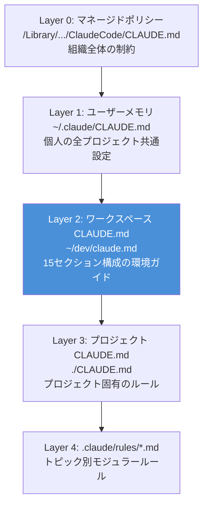
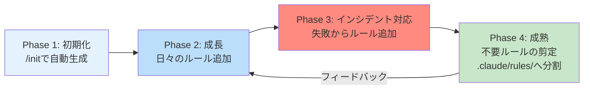

## はじめに

Claude Codeを使い始めると、最初に出会うのがCLAUDE.mdファイル。`/init`コマンドで自動生成して、何となく追記して――そんな運用をしていませんか。

:::message
CLAUDE.mdは「設定ファイル」ではなくAIエージェントとの契約書。書き方ではなく「設計」の視点で捉え直すと、エージェントの挙動が劇的に安定する。
:::

私はワークスペース全体をカバーする15セクション構成のCLAUDE.mdを運用しています。本記事では、その設計思想と、複数プロジェクトを横断してきた中で見えてきたアンチパターン、さらにAgent Teams連携の基盤としてCLAUDE.mdを活用する方法まで解説します。

「とりあえず書く」から「意図を持って設計する」へ -- その転換点になれば幸いです。

## CLAUDE.mdとclaude.mdの違い -- メモリ階層を理解する

まず前提として、CLAUDE.md（大文字）とclaude.md（小文字）はClaude Codeでは同一ファイルとして扱われます。macOSのファイルシステム（APFS）がケース非感知のため、どちらの表記でも同じファイルとして認識される仕組みです。私の環境では`~/dev/claude.md`（小文字）を使っていますが、機能的にはCLAUDE.mdと同一です。

Claude Codeには複数のメモリファイルが存在し、それぞれスコープと用途が異なります。まずはこの全体像を押さえておきたい。

| メモリ種別 | ファイルパス | スコープ | 共有範囲 |
|-----------|-------------|---------|----------|
| マネージドポリシー | `/Library/Application Support/ClaudeCode/CLAUDE.md` | 組織全体 | IT/DevOps管理 |
| ユーザーメモリ | `~/.claude/CLAUDE.md` | 全プロジェクト共通 | 自分のみ |
| プロジェクトメモリ | `./CLAUDE.md` | プロジェクト | チーム（Git管理） |
| プロジェクトルール | `./.claude/rules/*.md` | トピック別 | チーム（Git管理） |
| ローカルメモリ | `./CLAUDE.local.md` | プロジェクト | 自分のみ |
| 自動メモリ | `~/.claude/projects/<project>/memory/` | プロジェクト | 自分のみ |

### 読み込み順序のポイント

起動時にClaude Codeは作業ディレクトリからルートまで再帰的にCLAUDE.mdを探索する。子ディレクトリのCLAUDE.mdはオンデマンド読み込み[^1]。そしてより具体的な指示が広い指示より優先される仕組み。

[^1]: 子ディレクトリ内のファイルをClaudeが読み書きする際に、そのディレクトリのCLAUDE.mdが読み込まれる。

これを理解すると、自然と階層設計が見えてきます。



私の環境では、Layer 2にあたる`~/dev/claude.md`が今回の主役。ワークスペース全体の「環境ガイド」として機能し、どのプロジェクトでClaude Codeを起動しても読み込まれるようになっています。

### AGENTS.mdとの関係

OpenAIが提唱するAGENTS.mdやGoogleのGEMINI.mdも同様の目的を持つファイルですが、Claude CodeはAGENTS.mdを読み込みません。ツールごとに専用のファイルが必要というのが現状の制約です。

| 項目 | CLAUDE.md | AGENTS.md | GEMINI.md |
|------|-----------|-----------|-----------|
| 提唱 | Anthropic | OpenAI | Google |
| 対応ツール | Claude Code専用 | Codex, Cursor等 | Gemini CLI等 |
| 特徴 | @import、ツール認証等の独自機能 | ベンダー中立を標榜 | AGENTS.mdフォールバックあり |

## 15セクション構成の設計思想

ここからが本記事の核心部分。実際に運用している`~/dev/claude.md`は15セクションで構成されています。「なぜこの構成にしたか」の設計判断を、カテゴリ別に解説します。

### セクション一覧と設計意図

15セクションは大きく4つのカテゴリに分類できます。

| カテゴリ | セクション | 目的 |
|---------|-----------|------|
| WHO（誰が） | 1. 作業者情報 / 15. 連絡先・アカウント | AIに「誰のために働くか」を伝える |
| WHERE（どこで） | 2. フォルダ構成 / 3. 開発環境 / 4. 使用サービス / 5. 同期構成 | 物理的・論理的な環境の把握 |
| HOW（どうやって） | 6. コマンド・スクリプト / 7. コーディング規約 / 8. Git運用ルール / 9. 命名規則 / 12. 作業開始・終了ルール | 手を動かすときのルール |
| WHAT NOT（何をしないか） | 10. セキュリティ / 11. エラー対処方針 / 13. FIRE基準 / 14. 関連ドキュメント | 制約と判断基準 |


:::message
Anthropic公式が推奨するWHAT/WHY/HOWフレームワークに加え、WHAT NOT（やらないこと）を明示する設計にした。AIエージェントは「やること」は得意だが「やらないこと」の判断が苦手なため。
:::

### WHO -- 作業者情報と連絡先

```markdown
## 1. 作業者情報
| 項目 | 内容 |
|------|------|
| 名前 | Naoya |
| 会社 | 合同会社コラレイトデザイン / 一般社団法人ISVD |
| タイムゾーン | Asia/Tokyo |
| GitHub | correlate000 |
| 稼働時間 | 夜勤シフト中心 |
```

一見不要に思えるかもしれない。しかし「夜勤シフト中心」の一行があるだけで、AIがスケジュール提案をする際に深夜帯を考慮するようになる。コンテキストは少ないほどいいという定説はありますが、判断に影響する属性情報は書くべきというのが実感です。

### WHERE -- 環境の全体像

フォルダ構成（セクション2）は最も長いセクションですが、省略できません。

```markdown
~/dev/
├── projects/                ← プロジェクト管理
│   ├── client/              ← クライアント案件
│   ├── self/                ← 自社プロジェクト
│   └── archived/            ← 完了プロジェクト
├── shared/                  ← 複数プロジェクト共通サービス
├── knowledge_base/          ← 自作ナレッジ
├── Obsidian/                ← ナレッジベース（Syncthing同期）
└── claude.md                ← このファイル
```

AIエージェントはファイルシステムを「手探り」で探索します。この地図がないと、無関係なディレクトリを延々と`ls`し続ける非効率な動きをするわけです。

開発環境（セクション3）はテーブル形式で簡潔にまとめるのがコツ。

| ツール | バージョン | 用途 |
|--------|-----------|------|
| Node.js | v24.2.0 | JS実行環境 |
| Python | 3.12.0 (pyenv) | スクリプト |
| Docker | 28.5.2 | コンテナ |
| DDEV | v1.24.10 | WordPress開発 |

バージョン情報を明記する理由は明確で、AIが古いバージョンの構文やAPIを提案するのを防ぐため。「Node.js v24.2.0」と書けば、ES2025+の構文が使えることをAIが理解する。

### HOW -- 実作業のルール

コーディング規約（セクション7）について、Anthropic公式は「LLMにリンターの仕事をさせるな」と述べています[^2]。これは正しい指摘です。しかし、リンターでカバーできない規約は書く必要があります。

[^2]: [Best practices for agentic coding](https://www.anthropic.com/engineering/claude-code-best-practices) -- Anthropic公式ブログ

例えば「日本語コメント可」という一行。これがないとAIは英語コメントで統一しようとします。`!important`の禁止もStylelintで検出可能ですが、そもそも書かせない方が修正コストが低いです。

作業開始・終了ルール（セクション12）は他の記事では見かけないセクション。

```markdown
### 12.1 作業開始時
- **タスク種別**: マークアップ修正 / バグ修正 / 新機能実装 ...
- **対象ファイル**: 主要な変更対象
- **期待する結果**: 完了条件を具体的に

### 12.2 作業終了時
- **実施内容**: 箇条書きで具体的に
- **変更ファイル数**: 概算
- **次回への申し送り**: あれば
```

セッション間のコンテキスト引き継ぎを仕組み化したもの。Claudeのコンテキストウィンドウは有限なので、次のセッションで「前回どこまでやったか」を確認できる仕組みが必要になります。

### WHAT NOT -- 制約と判断基準

セキュリティ（セクション10）の禁止事項はチェックリスト形式で記述します。

:::message alert
以下の禁止事項は、実際にAIがやらかした事例から追加されたもの。「常識的にやらないだろう」は通用しない。
:::

- 本番環境への直接操作（ステージング経由必須）
- APIキー・シークレットのハードコード
- node_modules / vendorの直接編集
- console.log / printのデバッグコードを本番に残す

そしてFIRE基準（セクション13）。Financial Independence, Retire Earlyの考え方に基づく案件判断基準で、技術ブログでは珍しい項目。AIにビジネス判断の相談をする場面が増えた今、案件の受諾基準を明示しておくのは合理的です。

```markdown
- 粗利率35%未満の案件は慎重に
- 自分が実装担当になる構造は避ける
- 「次につながる」だけを理由にしない
```

## アンチパターン -- やってはいけないCLAUDE.mdの書き方

15セクション構成を示したところで、逆に「こう書いてはいけない」パターンも整理します。複数プロジェクトでの運用から学んだ実例です。

### 1. 長すぎるCLAUDE.md

:::message alert
Anthropic公式の指摘通り、長すぎるCLAUDE.mdはAIに無視される。自動メモリのMEMORY.mdですら先頭200行のみがシステムプロンプトに読み込まれる仕様。
:::

対策は`.claude/rules/`への分割。パス限定ルールのYAMLフロントマターを活用すれば、関連ファイルを触るときだけルールが適用される。

```yaml
---
paths:
  - "src/components/**"
---
# フロントエンドコンポーネントのルール
- Storybookのストーリーを必ず併記する
- Props型定義はinterface推奨
```

### 2. コードスタイルをCLAUDE.mdに書く

「インデントは2スペース」「セミコロンあり」といったルールは、ESLintやPrettierに任せるべきです。CLAUDE.mdに書くと二重管理になり、設定が乖離するリスクが生まれます。

ただし前述の通り、リンターでカバーできない規約（日本語コメントの可否、BEM命名の採用方針など）はCLAUDE.mdの守備範囲。

### 3. 「キャッシュのせいにしない」が必要になった理由

実際に起きた事例。Claudeがバグの原因をブラウザキャッシュのせいにして、自分のコードを疑いませんでした。

> 「ブラウザのキャッシュをクリアすれば直ります」

これを3回繰り返されて、結局コードにバグがあったというオチです。以降、プロジェクトのCLAUDE.mdに以下を追加しました。

```markdown
- キャッシュのせいにしない -- 自分のコードを疑う
- 断言する前に必ずGrep/Readで確認する
- 「ローカルでは確認できない」と言わない
```

### 4. その他の実例アンチパターン

| アンチパターン | 追加されたルール | 原因 |
|---------------|-----------------|------|
| 認証コードの不用意な変更 | 認証関連ファイルは原則変更禁止 | ログイン機能が壊れた |
| CSSの重複定義 | CSSチェックリスト3項目の導入 | レイアウトが崩れた |
| 指示外の作業を勝手に実行 | 指示されていないことは勝手にやらない | 意図しないリファクタが発生 |
| 「できない」と嘘をつく | 不可能と判断する前に3つの代替案を提示 | 実際は可能だった |

:::details Claudeに自己修正させるTips
Boris Cherny（Claude Code創設者）が推奨する運用として、Claudeが間違えたら「Update your CLAUDE.md so you don't make that mistake again」と指示する方法がある。AIに自分のルールブックを育てさせる発想。
:::

## チーム編成ルールの自動化 -- Agent Teams連携

CLAUDE.mdの真価は、個人利用だけでなくAgent Teamsの基盤としても発揮される。

### DA必須ルールの定着

前回の記事「[デビルズアドボケイトをAI開発チームに入れたら品質が劇的に改善した話](https://zenn.dev/and_and/articles/devils-advocate-ai-team)」で紹介した通り、Agent Teamsには批判的レビュアー（DA）を必ず含めるべき。このルールをCLAUDE.mdに書くことで、チーム編成時に自動的にDAが考慮される。

```markdown
## チーム編成ルール
- Agent Teamsでチームを編成する場合、必ず
  **デビルズアドボケイト（批判的レビュアー）**を1名含めること
- 他のエージェントのタスク完了後にレビューを開始する
- レビュー結果は記録・保存する
```

### DOD（Definition of Done）の組み込み

CLAUDE.mdにDODを定義しておけば、エージェントが「完了」と判断する基準が明確になる。

```markdown
## 完了定義（DOD）
- [ ] 全テストがパスしている
- [ ] DAレビューで高重要度の指摘が0件
- [ ] ドキュメントが更新されている
- [ ] git diffに意図しない変更が含まれていない
```


:::message
CLAUDE.mdは「AIに読ませるドキュメント」から「AIチームのルールブック」へと進化する。個人の設定ファイルだった時代から、チーム全体のガバナンスツールへ。この視点の転換が、CLAUDE.md設計の次のステージ。
:::

## 「育てる」CLAUDE.md -- 静的ファイルからの脱却

最後に、CLAUDE.mdのライフサイクルについて触れておきます。

### 4つのフェーズ



1. Phase 1 -- 初期化: `/init`で基本構造を生成。ここで終わる人が多いのが現状です
2. Phase 2 -- 成長: 開発中に気づいたルールを追記していく。コミットメッセージの規約、特定ライブラリの使い方など
3. Phase 3 -- インシデント対応: Claudeがやらかした時こそ成長のチャンス。「キャッシュのせいにするな」はこのフェーズで生まれました
4. Phase 4 -- 成熟: 肥大化したCLAUDE.mdを`.claude/rules/`に分割。パス限定ルールで必要なときだけ読み込まれるように最適化する

### プロジェクト種別による詳細度の違い

複数プロジェクトを運用してわかったことがあります。プロジェクトの複雑さとCLAUDE.mdの詳細度は比例します。

| プロジェクト種別 | セクション数目安 | 特徴 |
|-----------------|-----------------|------|
| 静的サイト | 1-4 | CSSチェックリスト程度で十分 |
| WordPressテーマ | 4-6 | DDEV設定 + テーマ構造の説明 |
| フルスタックアプリ | 8-15 | 認証、API、DB、デプロイ等の包括的ルール |
| ワークスペース全体 | 15 | 環境ガイドとして全セクション必要 |


静的サイトに15セクションは過剰。フルスタックアプリに1セクションでは不足。プロジェクトに合わせて設計するのが本記事の最大のメッセージ。

## まとめ

CLAUDE.mdの設計で押さえるべきポイントを振り返ると、以下の通り。

- メモリ階層を理解する -- 6種類のメモリファイルにはそれぞれスコープがある。ワークスペース全体 → プロジェクト → ディレクトリの階層設計が重要
- 15セクションはWHO/WHERE/HOW/WHAT NOTで分類 -- 特に「やらないこと」の明示がAIの暴走を防ぐ
- インシデント駆動で育てる -- 完璧なCLAUDE.mdを最初から書こうとしない。失敗から学んでルールを追加する
- リンターの仕事を奪わない -- コードスタイルはツールに任せ、CLAUDE.mdには判断基準を書く
- Agent Teamsの基盤にする -- DA必須ルール、DOD定義をCLAUDE.mdに組み込み、チームのガバナンスツールとして活用する

> CLAUDE.mdは「AIへの指示書」ではなく「AIとの契約書」。設計の視点で書き直してみると、エージェントとの協業が一段階上のレベルに到達する。

## 参考資料

https://code.claude.com/docs/en/memory

https://www.anthropic.com/engineering/claude-code-best-practices

https://code.claude.com/docs/en/best-practices

https://claude.com/blog/using-claude-md-files

https://x.com/bcherny/status/2017742741636321619

https://zenn.dev/and_and/articles/devils-advocate-ai-team
