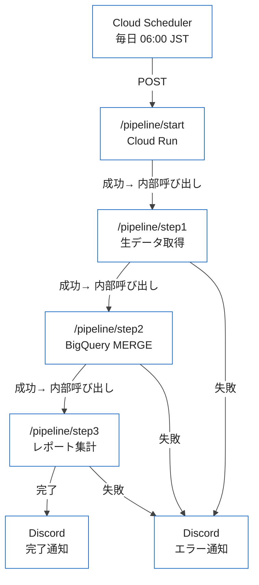

## はじめに

「毎朝6時にデータを同期したい」「月初だけ集計バッチを走らせたい」──GCPでバッチ処理を組む場面で必ず登場するのが Cloud Scheduler です。

サーバーに crontab を書く方法と比べると、Cloud Scheduler には大きな優位点があります。ジョブの管理・確認・手動実行がコンソールやCLIから行えること、Cloud Monitoring との統合でジョブの成否が可視化できること、そして IAM ベースの認証で Cloud Run との連携が安全に行えることです。

しかし実際に本番で運用するとなると、「基本設定はできたけれど、失敗したときの通知は？」「同じジョブが重複実行されてデータが壊れないか？」「依存関係のある複数ジョブをどう管理するか？」という問題が出てきます。

この記事では、Cloud Scheduler × Cloud Run の実践的なパターンとして、冪等バッチの設計・Discord による失敗通知・ジョブチェーンの3点に絞って解説します。

## 基本設定：ジョブ作成とタイムゾーン

まず基本的なジョブ作成から確認します。Cloud Scheduler のジョブは gcloud コマンドで作成できます。

```bash
# HTTP ジョブを作成する（最小構成）
gcloud scheduler jobs create http sync-daily-data \
  --location=asia-northeast1 \
  --schedule="0 6 * * *" \
  --uri="https://your-cloud-run-url/sync" \
  --http-method=POST \
  --time-zone="Asia/Tokyo"
```

`--schedule` には Unix cron 形式を使います。`0 6 * * *` は「毎日6時0分」を意味します。

タイムゾーンのデフォルトは UTC です。日本時間で設定したい場合は `--time-zone="Asia/Tokyo"` を忘れずに指定してください。IANA タイムゾーンデータベースの文字列がそのまま使えます。

```bash
# cron 式のよく使うパターン
# 毎日 06:00 JST
--schedule="0 6 * * *" --time-zone="Asia/Tokyo"

# 毎月1日 08:00 JST
--schedule="0 8 1 * *" --time-zone="Asia/Tokyo"

# 月曜〜金曜 09:00 JST
--schedule="0 9 * * 1-5" --time-zone="Asia/Tokyo"

# 4時間ごと（0時・4時・8時・12時・16時・20時）
--schedule="0 */4 * * *"
```

ジョブの一覧と状態確認はこのコマンドです。

```bash
gcloud scheduler jobs list --location=asia-northeast1
gcloud scheduler jobs describe sync-daily-data --location=asia-northeast1
```

手動実行（テスト時に便利）は次のコマンドです。

```bash
gcloud scheduler jobs run sync-daily-data --location=asia-northeast1
```

## Cloud Run との OIDC トークン認証

Cloud Run にデプロイしたエンドポイントは、デフォルトで未認証アクセスを拒否します。Cloud Scheduler から安全に呼び出すには OIDC トークン認証を使います。

まず、専用のサービスアカウントを作成して `roles/run.invoker` を付与します。

```bash
# サービスアカウント作成
gcloud iam service-accounts create scheduler-sa \
  --display-name="Cloud Scheduler Service Account"

# Cloud Run の呼び出し権限を付与
gcloud projects add-iam-policy-binding YOUR_PROJECT_ID \
  --member="serviceAccount:scheduler-sa@YOUR_PROJECT_ID.iam.gserviceaccount.com" \
  --role="roles/run.invoker"
```

次に、OIDC 認証を使ったジョブを作成します。

```bash
gcloud scheduler jobs create http sync-daily-data \
  --location=asia-northeast1 \
  --schedule="0 6 * * *" \
  --uri="https://your-service-abc123-an.a.run.app/sync" \
  --http-method=POST \
  --time-zone="Asia/Tokyo" \
  --oidc-service-account-email="scheduler-sa@YOUR_PROJECT_ID.iam.gserviceaccount.com" \
  --oidc-token-audience="https://your-service-abc123-an.a.run.app"
```

`--oidc-token-audience` は Cloud Run のサービス URL と完全に一致させる必要があります。末尾スラッシュの有無も含めて一致していないと 403 エラーになります。

Cloud Run の URL が変わった場合（`--source` 再デプロイで URL が変わることがあります）は、`--uri` と `--oidc-token-audience` の両方を更新してください。

```bash
# 既存ジョブの URI と audience を更新
gcloud scheduler jobs update http sync-daily-data \
  --location=asia-northeast1 \
  --uri="https://new-service-url.a.run.app/sync" \
  --oidc-token-audience="https://new-service-url.a.run.app"
```

ローカル開発時に同じエンドポイントを手動で叩く場合は、次のようにトークンを取得して渡します。

```bash
TOKEN=$(gcloud auth print-identity-token \
  --audiences="https://your-service-abc123-an.a.run.app")

curl -H "Authorization: Bearer $TOKEN" \
  -X POST https://your-service-abc123-an.a.run.app/sync
```

## 冪等バッチの設計

Cloud Scheduler は「少なくとも1回の実行」を保証するサービスです。これは、まれに同じジョブが2回実行される可能性があることを意味します。ネットワーク障害後のリトライ、一時的な Cloud Scheduler の二重トリガーなど、原因はさまざまです。

冪等性（idempotency）とは、同じ操作を何度繰り返しても結果が変わらない性質のことです。バッチ処理では、重複実行が発生しても「データが壊れない」「二重課金が起きない」状態を保つことが重要です。

### BigQuery を使った実行ログテーブル

実行の冪等性を担保するシンプルな方法は、実行ログをテーブルに記録することです。

```sql
-- 実行ログテーブル
CREATE TABLE IF NOT EXISTS `your_project.batch_logs.job_executions` (
  job_id      STRING    NOT NULL,   -- ジョブ名 + 実行日のハッシュ等
  job_name    STRING    NOT NULL,
  run_date    DATE      NOT NULL,
  status      STRING    NOT NULL,   -- running / success / failed
  started_at  TIMESTAMP NOT NULL,
  finished_at TIMESTAMP,
  error_msg   STRING,
  row_count   INT64
)
PARTITION BY run_date
CLUSTER BY job_name, status;
```

Python での利用例です。

```python
from google.cloud import bigquery
from datetime import date, datetime, timezone
import hashlib

BQ_PROJECT = "your-project"
BQ_DATASET = "batch_logs"

def get_job_id(job_name: str, run_date: date) -> str:
    """ジョブ名と実行日から一意のIDを生成"""
    raw = f"{job_name}:{run_date.isoformat()}"
    return hashlib.sha256(raw.encode()).hexdigest()[:16]


def is_already_executed(job_name: str, run_date: date) -> bool:
    """同じジョブが当日既に成功済みか確認"""
    client = bigquery.Client(project=BQ_PROJECT)
    job_id = get_job_id(job_name, run_date)

    query = f"""
    SELECT COUNT(*) AS cnt
    FROM `{BQ_PROJECT}.{BQ_DATASET}.job_executions`
    WHERE job_id = '{job_id}'
      AND status = 'success'
      AND run_date = '{run_date.isoformat()}'
    """
    result = client.query(query).result()
    for row in result:
        return row.cnt > 0
    return False


def record_job_start(job_name: str, run_date: date) -> str:
    """ジョブ開始を記録。job_id を返す"""
    client = bigquery.Client(project=BQ_PROJECT)
    job_id = get_job_id(job_name, run_date)

    rows = [{
        "job_id": job_id,
        "job_name": job_name,
        "run_date": run_date.isoformat(),
        "status": "running",
        "started_at": datetime.now(timezone.utc).isoformat(),
    }]
    client.insert_rows_json(
        f"{BQ_PROJECT}.{BQ_DATASET}.job_executions", rows
    )
    return job_id


def record_job_finish(job_id: str, status: str,
                      row_count: int = 0, error_msg: str = None) -> None:
    """ジョブ完了を記録"""
    client = bigquery.Client(project=BQ_PROJECT)
    now = datetime.now(timezone.utc).isoformat()

    update_sql = f"""
    UPDATE `{BQ_PROJECT}.{BQ_DATASET}.job_executions`
    SET status = '{status}',
        finished_at = '{now}',
        row_count = {row_count},
        error_msg = {f"'{error_msg}'" if error_msg else 'NULL'}
    WHERE job_id = '{job_id}'
    """
    client.query(update_sql).result()
```

Cloud Run のエンドポイントにこのロジックを組み込みます。

```python
from fastapi import FastAPI
from datetime import date

app = FastAPI()

@app.post("/sync")
async def sync_handler():
    job_name = "sync-daily-data"
    today = date.today()

    # 重複実行チェック
    if is_already_executed(job_name, today):
        return {"status": "skipped", "reason": "already executed today"}

    job_id = record_job_start(job_name, today)

    try:
        row_count = run_sync_logic()  # 実際のバッチ処理
        record_job_finish(job_id, "success", row_count=row_count)
        return {"status": "success", "rows": row_count}

    except Exception as e:
        record_job_finish(job_id, "failed", error_msg=str(e))
        raise  # 5xx を返して Cloud Scheduler にリトライさせる
```

例外をそのまま raise することで Cloud Run が 500 系レスポンスを返し、Cloud Scheduler のリトライポリシーが機能します。

## Discord Webhook によるエラー通知

バッチが失敗したとき、Cloud Monitoring のアラートでも気づけますが、Discord への即時通知を入れておくと運用が格段に楽になります。

```bash
# Webhook URL は環境変数で管理
gcloud run services update your-service \
  --update-env-vars="DISCORD_WEBHOOK_URL=https://discord.com/api/webhooks/..."
```

コードでの実装例です。

```python
import httpx
import os
from datetime import datetime, timezone

DISCORD_WEBHOOK_URL = os.environ.get("DISCORD_WEBHOOK_URL")


async def notify_discord(message: str, is_error: bool = False) -> None:
    """Discord に通知を送る"""
    if not DISCORD_WEBHOOK_URL:
        return

    color = 0xFF0000 if is_error else 0x00CC44  # 赤 or 緑
    payload = {
        "embeds": [{
            "title": "バッチ失敗" if is_error else "バッチ完了",
            "description": message,
            "color": color,
            "timestamp": datetime.now(timezone.utc).isoformat(),
        }]
    }

    async with httpx.AsyncClient() as client:
        await client.post(DISCORD_WEBHOOK_URL, json=payload)


@app.post("/sync")
async def sync_handler():
    job_name = "sync-daily-data"
    today = date.today()

    if is_already_executed(job_name, today):
        return {"status": "skipped"}

    job_id = record_job_start(job_name, today)

    try:
        row_count = run_sync_logic()
        record_job_finish(job_id, "success", row_count=row_count)
        await notify_discord(f"sync-daily-data 完了: {row_count} 件処理")
        return {"status": "success", "rows": row_count}

    except Exception as e:
        error_msg = str(e)
        record_job_finish(job_id, "failed", error_msg=error_msg)
        await notify_discord(
            f"sync-daily-data 失敗\n```{error_msg}```",
            is_error=True,
        )
        raise
```

Cloud Scheduler のリトライ設定は `--max-retry-attempts` で指定します。デフォルトは 0（リトライなし）なので、明示的に設定しておくことを推奨します。

```bash
gcloud scheduler jobs create http sync-daily-data \
  --location=asia-northeast1 \
  --schedule="0 6 * * *" \
  --uri="https://your-service.a.run.app/sync" \
  --oidc-service-account-email="scheduler-sa@YOUR_PROJECT_ID.iam.gserviceaccount.com" \
  --oidc-token-audience="https://your-service.a.run.app" \
  --time-zone="Asia/Tokyo" \
  --max-retry-attempts=3 \
  --min-backoff-duration=10s \
  --max-backoff-duration=5m
```

## 依存関係のある複数ジョブのチェーン

「ジョブAが成功したらジョブBを実行する」という依存関係は、Cloud Scheduler 単体では表現できません。Cloud Scheduler はあくまで「特定の時刻に HTTP リクエストを送る」ツールです。

依存関係を表現するには、以下のようにジョブ内からチェーン呼び出しを行います。



このパターンでは、`/pipeline/start` が全体のオーケストレーターになります。

```python
import httpx
import os

CLOUD_RUN_BASE_URL = os.environ.get("CLOUD_RUN_BASE_URL", "")

# Cloud Run 内部呼び出し用のヘッダーを取得
async def get_internal_auth_header() -> dict:
    """同一サービス内の内部呼び出し用トークンを取得"""
    # メタデータサーバーからトークンを取得
    async with httpx.AsyncClient() as client:
        resp = await client.get(
            "http://metadata.google.internal/computeMetadata/v1/instance/service-accounts/default/identity",
            params={"audience": CLOUD_RUN_BASE_URL},
            headers={"Metadata-Flavor": "Google"},
        )
        token = resp.text
    return {"Authorization": f"Bearer {token}"}


@app.post("/pipeline/start")
async def pipeline_start():
    """パイプラインのエントリーポイント"""
    steps = ["/pipeline/step1", "/pipeline/step2", "/pipeline/step3"]

    for step in steps:
        headers = await get_internal_auth_header()
        async with httpx.AsyncClient(timeout=300) as client:
            resp = await client.post(
                f"{CLOUD_RUN_BASE_URL}{step}",
                headers=headers,
            )
        if resp.status_code != 200:
            await notify_discord(
                f"パイプライン中断: {step} が失敗\n"
                f"ステータス: {resp.status_code}\n"
                f"詳細: {resp.text[:200]}",
                is_error=True,
            )
            raise RuntimeError(f"Step {step} failed: {resp.status_code}")

    await notify_discord("パイプライン完了: 全ステップ成功")
    return {"status": "success"}
```

時間差で実行するだけでよい（依存関係が緩い）場合は、複数のジョブを5分刻みで設定するシンプルな方法も有効です。

```bash
gcloud scheduler jobs create http pipeline-step1 \
  --schedule="0 6 * * *" --time-zone="Asia/Tokyo" \
  --uri="https://your-service.a.run.app/pipeline/step1" ...

gcloud scheduler jobs create http pipeline-step2 \
  --schedule="5 6 * * *" --time-zone="Asia/Tokyo" \
  --uri="https://your-service.a.run.app/pipeline/step2" ...

gcloud scheduler jobs create http pipeline-step3 \
  --schedule="10 6 * * *" --time-zone="Asia/Tokyo" \
  --uri="https://your-service.a.run.app/pipeline/step3" ...
```

ただしこの場合、step1 が失敗しても step2 が実行されてしまいます。冪等設計（実行ログチェック）と組み合わせて「前ステップが成功していなければスキップ」ロジックを入れることで対処できます。

## Terraform / IaC での管理

ジョブ数が増えてくると、gcloud コマンドによる手動管理は辛くなります。Terraform でコード化しておくことを推奨します。

```hcl
resource "google_cloud_scheduler_job" "sync_daily_data" {
  name      = "sync-daily-data"
  region    = "asia-northeast1"
  schedule  = "0 6 * * *"
  time_zone = "Asia/Tokyo"

  retry_config {
    retry_count          = 3
    min_backoff_duration = "10s"
    max_backoff_duration = "5m"
  }

  http_target {
    http_method = "POST"
    uri         = var.cloud_run_url

    oidc_token {
      service_account_email = google_service_account.scheduler_sa.email
      audience              = var.cloud_run_url
    }
  }
}

resource "google_service_account" "scheduler_sa" {
  account_id   = "scheduler-sa"
  display_name = "Cloud Scheduler Service Account"
}

resource "google_cloud_run_service_iam_member" "scheduler_invoker" {
  service  = google_cloud_run_v2_service.api.name
  location = "asia-northeast1"
  role     = "roles/run.invoker"
  member   = "serviceAccount:${google_service_account.scheduler_sa.email}"
}
```

変数ファイルで URL を管理することで、ステージング・本番の切り替えも容易になります。

## モニタリングとアラート

Cloud Scheduler のジョブ失敗は Cloud Monitoring で検出できます。

```bash
# ジョブ失敗時のアラートポリシーを作成
gcloud alpha monitoring policies create \
  --policy-from-file=scheduler-alert-policy.json
```

`scheduler-alert-policy.json` の例です。

```json
{
  "displayName": "Cloud Scheduler ジョブ失敗",
  "conditions": [{
    "displayName": "scheduler job failed",
    "conditionThreshold": {
      "filter": "resource.type=\"cloud_scheduler_job\" AND metric.type=\"cloudscheduler.googleapis.com/job/attempt_count\" AND metric.labels.status=\"FAILED\"",
      "comparison": "COMPARISON_GT",
      "thresholdValue": 0,
      "duration": "0s",
      "aggregations": [{
        "alignmentPeriod": "300s",
        "perSeriesAligner": "ALIGN_SUM"
      }]
    }
  }],
  "alertStrategy": {
    "notificationRateLimit": {
      "period": "300s"
    }
  }
}
```

ログエクスプローラーでのフィルタは次のとおりです。

```
resource.type="cloud_scheduler_job"
resource.labels.job_id="sync-daily-data"
severity="ERROR"
```

BigQuery に蓄積した実行ログは、ダッシュボードでの可視化にも使えます。

```sql
-- 過去7日間のジョブ成功率
SELECT
  job_name,
  COUNT(*) AS total_runs,
  COUNTIF(status = 'success') AS success_count,
  ROUND(COUNTIF(status = 'success') / COUNT(*) * 100, 1) AS success_rate_pct,
  AVG(TIMESTAMP_DIFF(finished_at, started_at, SECOND)) AS avg_duration_sec
FROM `your_project.batch_logs.job_executions`
WHERE run_date >= DATE_SUB(CURRENT_DATE('Asia/Tokyo'), INTERVAL 7 DAY)
GROUP BY job_name
ORDER BY job_name;
```

## まとめ：ジョブ設計チェックリスト

Cloud Scheduler × Cloud Run でバッチ処理を本番運用するためのチェックリストです。

| カテゴリ | 確認項目 |
|---------|---------|
| 認証 | OIDC サービスアカウントに `roles/run.invoker` を付与済みか |
| 認証 | `--oidc-token-audience` が Cloud Run URL と完全一致しているか |
| タイムゾーン | `--time-zone="Asia/Tokyo"` を明示指定しているか |
| 冪等性 | 同じジョブが2回実行されても安全か（実行ログで重複チェック済みか） |
| 冪等性 | DB/BQ 書き込みが MERGE または INSERT IF NOT EXISTS になっているか |
| エラー通知 | バッチ失敗時に Discord 等で即時通知が届くか |
| リトライ | `--max-retry-attempts` を設定しているか（デフォルト 0） |
| ジョブチェーン | 依存関係のあるジョブで「前ステップ成功チェック」を入れているか |
| IaC | Terraform でコード管理されているか |
| モニタリング | Cloud Monitoring のアラートポリシーが設定済みか |

Cloud Scheduler は単純な HTTP トリガーサービスですが、OIDC 認証・冪等設計・通知・チェーン実行を組み合わせることで、本番に耐える定期バッチ基盤を構築できます。

設定量は多く見えますが、一度パターンとして Terraform にまとめてしまえば、2本目以降のジョブは数分で追加できます。ぜひ本記事のパターンを活用してみてください。

## 参考リンク

- [Cloud Scheduler 公式ドキュメント](https://cloud.google.com/scheduler/docs)
- [Cloud Run サービス間認証](https://cloud.google.com/run/docs/authenticating/service-to-service)
- [Terraform: google_cloud_scheduler_job](https://registry.terraform.io/providers/hashicorp/google/latest/docs/resources/cloud_scheduler_job)
- [Cloud Monitoring アラートポリシー](https://cloud.google.com/monitoring/alerts/using-alerting-ui)
