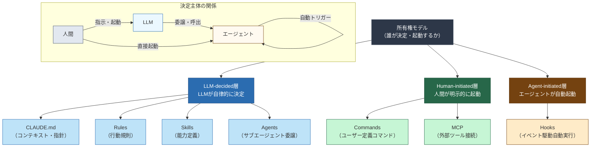
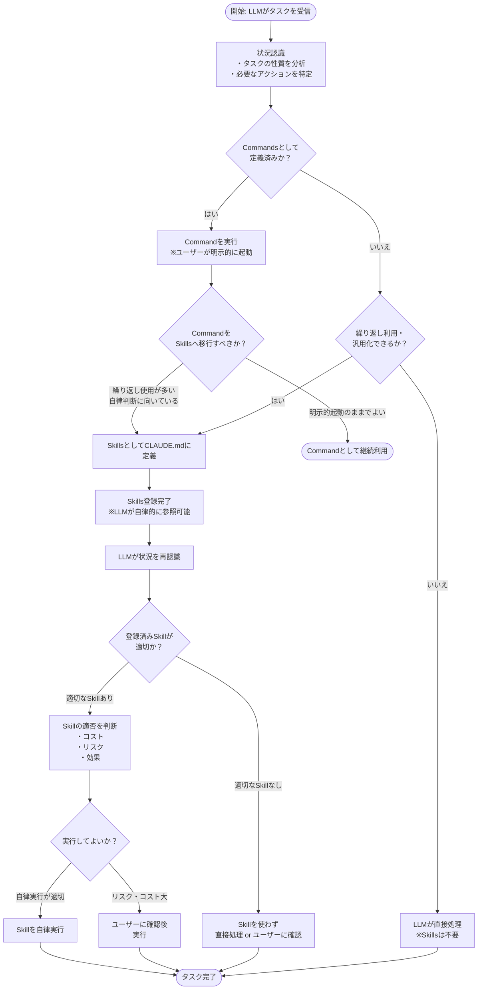
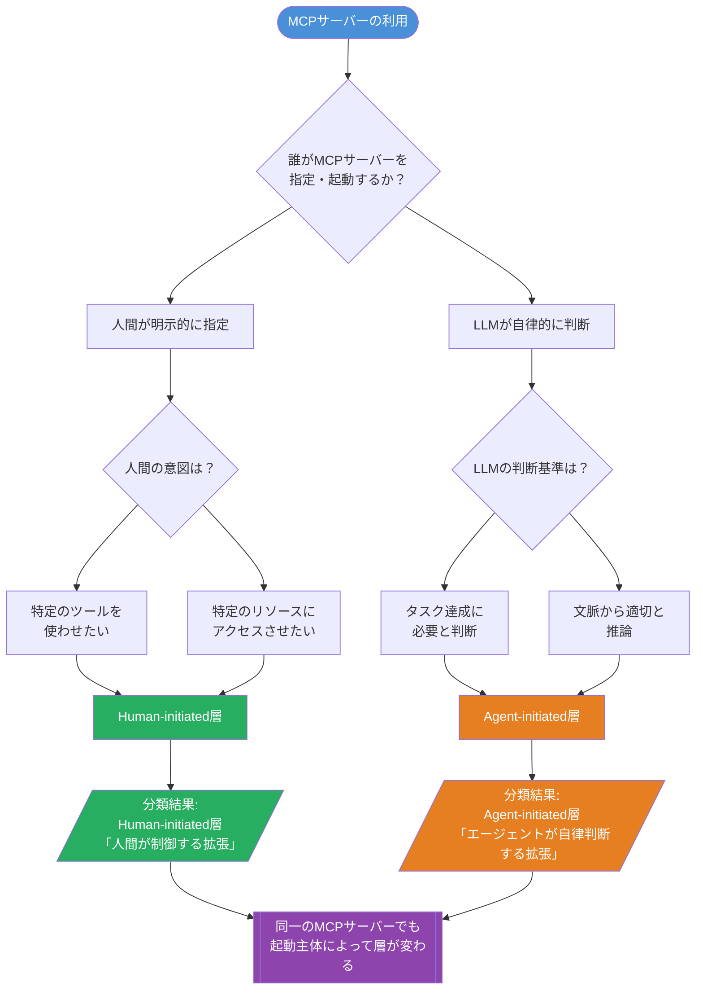
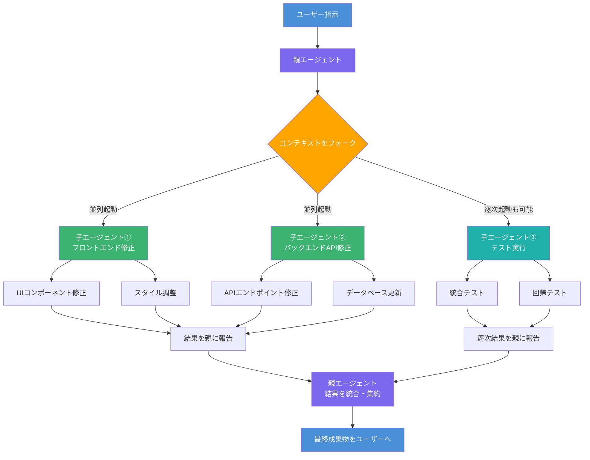

## はじめに

Claude Codeには、エージェントの動作をカスタマイズするための拡張機能が7つ存在します。CLAUDE.md、Rules、Skills、Commands、Hooks、MCP、Agentsです。これらをどう使い分けるかは、実際に導入しようとすると意外と悩むポイントです。

本記事はClaude Codeを使い始めて拡張機能の使い分けに迷っている方を主な対象としています。Fowlerの論文を読んだことがなくても理解できるよう構成しています。

日本語の解説記事はいくつか存在しますが、多くは「何ができるか」の紹介にとどまっています。本記事では、Martin FowlerがコーディングエージェントについてまとめたContext Engineering for Coding Agentsを参考に、 **本記事の整理軸として再構成した「所有権モデル」** （「誰がその動作を決定・起動するか」という観点によるフレーム）を軸に据え、7つの拡張機能を体系的に整理します。なお、原論文において "Ownership Model" という用語が同一の形式で使われているかは未確認であり、本記事における「所有権モデル」はFowlerの議論を参考に著者が再構成したフレームワークとして扱ってください。

所有権モデルをこの形で日本語解説した記事は現時点でほぼ存在しません。海外の理論的フレームワークと、Zennで多くの支持を集めている実践的な分類（tmasuyama氏の2軸分類、kazu1氏の3カテゴリ分類）を統合することで、 **「なぜその拡張機能を使うのか」** が自然に導き出せる整理軸を提示します。

---

## Martin Fowlerの議論を参考にした「所有権モデル」とは



Martin FowlerはContext Engineering for Coding Agentsの中で、コンテキストエンジニアリングの構造についての議論を展開しています。本記事ではその議論を参考に、「誰がその動作を決定・起動するか」という観点からエージェントの拡張要素を3層に分類するフレームを「所有権モデル」として構成しました。

| 分類 | 起動・決定の主体 | 概要 |
|------|----------------|------|
| LLM-decided | LLM（モデル）が自律的に判断 | モデルが状況を読んで動作を決める |
| Human-initiated | 人間が明示的に起動 | ユーザーが指示・選択して動作する |
| Agent-initiated | エージェント自身が起動 | ワークフローの中でエージェントが自動発火 |

このモデルが有用なのは、「どの拡張機能を使えばいいか」という選択に **原則** を与えてくれるからです。たとえば「毎回人間が起動するのは手間なので自動化したい」と感じたとき、Agent-initiatedの領域を探せばよいとわかります。

---

## 2つの日本語分類との比較

### tmasuyama氏の2軸分類

tmasuyama氏（Zennで153いいね、2025年7月時点）は、Claude Codeの拡張機能を「 **読込タイミング** 」と「 **実行主体** 」の2軸で整理しています。縦横のマトリクスで視覚的に把握しやすく、実務で「どのタイミングで効くか」を直感的に判断できる整理です。

一方で、各軸の背景にある設計思想——なぜその実行主体に委ねるのか——については、フレームワーク内では説明されていません。

### kazu1氏の3カテゴリ分類

kazu1氏（Zennで412いいね、2025年7月時点）は、拡張機能を「コンテキスト注入系」「アクション系」「エージェント系」の3カテゴリで整理しています。直感的でわかりやすく、初めてClaude Codeを触る方への導線として優れています。

ただし、カテゴリの境界線が機能の形状（何ができるか）に基づいており、 **設計時の判断基準** （なぜこちらではなくあちらか）は補足が必要な構造です。

### 3つの視点を統合する

本記事では、以下の統合フレームワークを用います。

- **縦軸**: 本記事の所有権モデル（LLM-decided / Human-initiated / Agent-initiated）
- **横軸**: tmasuyama氏の読込タイミング（事前 / 実行時）
- **分類ラベル**: kazu1氏の3カテゴリをマッピングの補助線として使用

---

## 7つの拡張機能を所有権モデルで整理する

### 全体マップ

MCPは起動主体によって所有権層が変わる唯一の拡張機能であるため、以下のマトリクスでは両層に記載しています。詳細は後述の各セクションで解説します。

```
                  ┌─────────────────────────────────────────┐
                  │           読込タイミング                 │
                  │     事前（静的）    実行時（動的）       │
  ┌───────────────┼─────────────────┬───────────────────────┤
  │ LLM-decided  │  CLAUDE.md      │  Skills               │
  │              │  Rules          │                       │
  ├───────────────┼─────────────────┼───────────────────────┤
  │Human-        │                 │  Commands             │
  │initiated     │                 │  MCP（手動起動時）    │
  ├───────────────┼─────────────────┼───────────────────────┤
  │Agent-        │                 │  Hooks                │
  │initiated     │                 │  Agents               │
  │              │                 │  MCP（自動呼出時）    │
  └───────────────┴─────────────────┴───────────────────────┘
```

### LLM-decided：モデルが自律的に判断する層

この層の拡張機能は、人間が都度指示しなくてもLLMが内容を参照・判断しながら動作します。判断の主導権はモデル側にあります。

#### CLAUDE.md

CLAUDE.mdは、プロジェクトのルートや設定ディレクトリに置くMarkdownファイルです。Claude Codeはセッション開始時にこのファイルを読み込み、以降の判断の基準として参照します。

所有権モデルでいえば「LLM-decided」の典型です。コーディング規約、使用言語のバージョン、テスト方針といった **恒常的なコンテキスト** をここに記述しておくと、人間が毎回指示しなくてもモデルがその方針に従って動作します。

書くべき内容の目安は次の通りです。

- プロジェクト固有の技術スタック・バージョン
- コミットメッセージの形式
- テストを書く際のフレームワークと方針
- 避けるべきパターン（チームの慣習的なアンチパターンなど）

#### Rules

RulesはCLAUDE.mdと似た役割を持ちますが、より粒度の細かい、かつ **再利用可能なルールセット** として定義できます。

技術的には、RulesはCLAUDE.mdとは独立したファイルとして定義され、複数のプロジェクトやリポジトリをまたいで適用できる形式で管理されます。セキュリティに関するガイドライン、アクセシビリティ基準など、モノレポ内の複数プロジェクトや別リポジトリでも統一したいポリシーをRulesとして切り出しておくと、一貫性が保ちやすくなります。

CLAUDE.mdとRulesの使い分けの原則は「スコープ」です。特定のプロジェクト固有の文脈にしか適用しないものであればCLAUDE.md、複数のプロジェクトやリポジトリをまたいで横断的に使い回すものはRulesとして切り出す判断が自然です。

#### Skills



Skillsは、LLMが自律的に呼び出せる再利用可能な処理単位です。Commands（後述）が「人間がスラッシュコマンドで明示的に呼び出す」のに対し、Skillsは「LLMが状況を判断して自律的に実行する」点が大きな違いです。

Skillsとして定義しておくと、LLMは「このタスクにはこのSkillが適切だ」と判断して自律的に実行します。定義の形式としては、特定の処理手順や判断ロジックを記述したテンプレートをLLMが参照できる形で配置します。

Skillsとして定義するのが適切なケースは以下の通りです。

- 特定の状況になったらLLMに自動的に実行してほしい処理がある
- CommandsとしてしばらくA運用したが、毎回呼び出すのを忘れて手間になっている
- チームメンバーがCommandsの存在を把握していなくても、LLMに判断させたい

CLAUDE.mdやRulesとの違いは「何を記述するか」にあります。CLAUDE.mdやRulesは方針・制約・コンテキストを記述する場所ですが、Skillsは「この状況でこの処理を行う」という **実行可能な手順そのもの** を定義する場所です。

### Human-initiated：人間が明示的に起動する層

この層の拡張機能は、人間が能動的に呼び出すことで動作します。LLMが自動で実行することはありません。

#### Commands

CommandsはClaude Codeに対してユーザーが明示的に呼び出すカスタムコマンドです。スラッシュコマンド（`/コマンド名`）の形式で実行します。ファイルとしては、`.claude/commands/` ディレクトリ以下にMarkdownファイルとして定義するのが一般的な構造です。

「毎回同じ指示を書いているな」と感じる操作がCommandsの候補です。たとえば以下のようなケースです。

- プルリクエストの説明文を生成する
- 特定のフォーマットでリリースノートを作成する
- コードレビューのチェックリストを流す

所有権モデルでいえば、 **起動の主導権は常に人間にある** という点がCommandsの特徴です。LLMが勝手に実行することはありません。

#### MCP（起動主体による所有権の変化）



MCP（Model Context Protocol）は外部ツールやサービスをClaude Codeと接続するプロトコルです。MCPは本フレームワークにおいて **起動主体によって所有権層が変わる唯一の拡張機能** です。

**Human-initiated（手動起動時）**: 人間がツールの使用を明示的に指定する場合は、Human-initiated層に位置します。たとえば「このSlackチャンネルのログを参照しながら回答して」のように、特定のMCPサーバーを明示して呼び出すケースが該当します。

**Agent-initiated（自動呼出時）**: LLMが状況を判断して自律的にツールを呼び出す場合は、Agent-initiated層に位置します。「このタスクにはWebSearchが必要だ」とモデルが判断してMCPサーバーを呼び出すケースがこれにあたります。

どちらの層に置くかは、 **誰が起動を決定したか** で判断してください。同じMCPサーバーであっても、呼び出しの文脈によって所有権上の位置が変わります。

### Agent-initiated：エージェントが自律的に起動する層

この層の拡張機能は、人間が指示しなくてもワークフロー内の特定タイミングや条件でエージェントが自動的に動作します。

#### Hooks

Hooksは、特定のイベント（ファイル保存、コマンド実行前後など）をトリガーにして自動的に実行されるスクリプトです。

所有権モデルでいえば **Agent-initiated** の典型であり、人間が指示しなくても、ワークフロー内の特定タイミングで自動発火します。活用例としては次のようなものがあります。

- ファイル変更後に自動でlintを走らせる
- コミット前にテストを実行する
- 特定の拡張子のファイルが生成されたら自動フォーマットをかける

Hooksを使いすぎると動作が複雑になるため、「なぜここを自動化するのか」を明確にした上で導入することが重要です。

#### Agents（サブエージェント）



Agentsは、親エージェントから子エージェントを起動する仕組みです。Fowlerの論文では「context fork」という概念で説明されており、 **コンテキストを分岐させながら並列・逐次的にサブタスクを処理** します。

たとえば「フロントエンドのコード修正」と「バックエンドのAPI修正」を独立したコンテキストで並列処理させることで、コンテキスト汚染を防ぎながら効率的にタスクを進めることができます。
