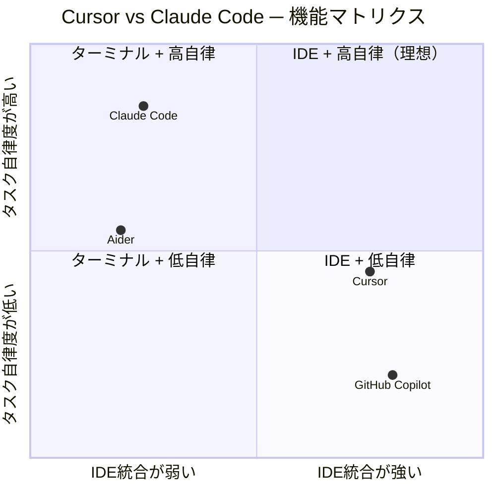
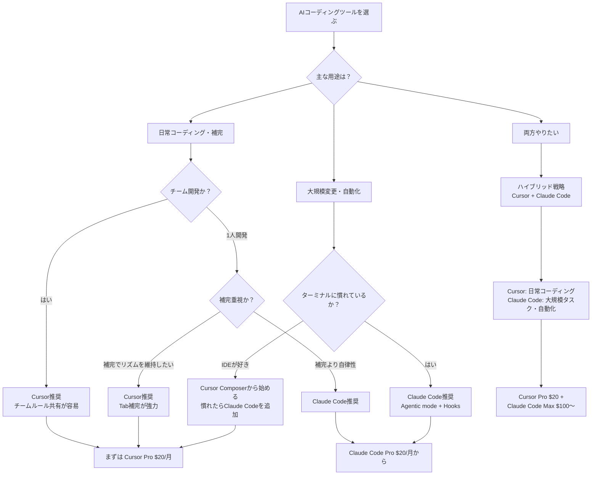

## はじめに

「CursorとClaude Code、どちらを使えばいいですか？」

この質問は、2026年現在のエンジニアコミュニティで最もよく聞かれる問いのひとつです。どちらもAIを活用したコーディング支援ツールですが、設計思想も使い心地も根本的に異なります。

- **Cursor** は VSCode をベースにしたAI統合IDEです。コードを書きながらTab補完でAIの提案を受け取り、Composerでマルチファイル編集を指示できます。
- **Claude Code** は Anthropic が提供するターミナルベースのエージェントです。CLIから起動し、ファイル操作・git操作・テスト実行まで自律的にこなします。

「どちらが優れているか」という問いへの答えは単純ではありません。使い方・チーム構成・作業の規模によって、最適解は変わります。本記事では両者を客観的に比較し、「どのような場面でどちらを選ぶべきか」を整理します。さらに、両方を組み合わせる **ハイブリッド戦略** についても解説します。

---

## Cursorの特徴・強み・弱み

### Cursorとは

CursorはAnysphere社が開発するAI統合IDEです。VSCodeをフォークしており、既存のVSCode拡張機能をほぼそのまま利用できます。2023年の公開以降、急速に普及し、2026年時点ではAIコーディングツールの代名詞のひとつとなっています。

### 主要機能

**Tab補完（インライン補完）**

Cursorの最大の特徴のひとつがリアルタイムのコード補完です。コードを書いている最中に、次の行やブロックをGhost Textとして表示します。Tabキーで受け入れるだけで作業を続けられるため、コーディングのリズムを崩しません。

**Composer（エージェントモード）**

Composerはマルチファイル編集を指示できるエージェント機能です。「このコンポーネントをリファクタして、テストも更新して」といった自然言語の指示を受け取り、複数ファイルへの変更案を一括で提示します。

**Chat**

サイドパネルでAIと対話できます。コード選択範囲を含めて質問したり、ドキュメントを生成させたりと、IDEを離れずに使える点が便利です。

**MCP対応・Rulesカスタマイズ**

Model Context Protocol（MCP）でサードパーティツールとの統合が可能です。`.cursor/rules` でプロジェクト単位のカスタムインストラクションを設定でき、チームで共有できます。

### 対応モデル

CursorはClaude 3.5/3.7 Sonnet（Anthropic）、GPT-4o/o1/o3（OpenAI）、Gemini Pro（Google）など主要モデルをサポートしています。自前のAPIキーを持ち込む設定も可能です。

### 料金

| プラン | 価格 | 内容 |
|--------|------|------|
| Free | $0/月 | 月2,000回Tab補完、50回Slowリクエスト |
| Pro | $20/月 | 無制限Tab補完、500回Fastリクエスト |
| Business | $40/月/人 | チーム管理機能 + Pro相当 |

### 強み

- **コーディング中断ゼロ**: Tab補完はエディタを離れずにAIの支援を受けられます
- **VSCode互換**: 既存の拡張機能・設定がそのまま使えます
- **学習コスト低**: UIが直感的で、今日から使い始められます
- **チーム開発との相性**: `.cursor/rules` をGitで共有することでチーム全員が同じルールで動けます
- **コストパフォーマンス**: Pro $20/月で無制限Tab補完は費用対効果が高いです

### 弱み

- **インラインでの大規模変更**: アーキテクチャレベルの変更はコンテキスト制限に当たりやすいです
- **ターミナル統合の弱さ**: IDE内ターミナルはありますが、CLIツール群との自然な連携はClaude Codeに劣ります
- **エージェント自律度**: Composerは提案ベースで、Claude Codeほど自律的にタスクを完遂しません
- **カスタムワークフロー**: Hooksのような任意スクリプト挿入の仕組みがありません

---

## Claude Codeの特徴・強み・弱み

### Claude Codeとは

Claude CodeはAnthropicが提供するターミナルベースのAIコーディングエージェントです。`claude` コマンドで起動し、自然言語の指示を受け取ってファイル操作・コマンド実行・git操作まで自律的に行います。2025年にGA（一般提供）となり、エンジニアの自動化ニーズに応えるツールとして注目を集めています。

### 主要機能

**Agentic mode**

Claude Codeの核心機能です。ひとつの指示から複数ファイルの読み書き、テスト実行、gitコミットまでを一連のフローとして自律的に実行します。「このモジュールを分割してテストを追加して」という指示一本で、完了まで動き続けます。

```bash
# 基本的な起動
claude

# 指示をワンライナーで渡す（非インタラクティブ）
claude -p "src/utils.ts を責務ごとに分割して、既存テストが通ることを確認して"
```

**Agent Teams**

複数のClaude Codeインスタンスを並列・直列に組み合わせて大規模タスクを分割処理する機能です。Pragmatist（実装担当）、Skeptic（レビュー担当）、Idealist（設計担当）、Connector（統合担当）といった役割を持たせることで、チームに近い動きを実現できます。

**Hooks**

セッション開始/終了、ツール呼び出し前後などのライフサイクルイベントにカスタムスクリプトを挿入できます。「コミット前に必ずlintを実行」「特定ファイルを変更したらテストを自動起動」といった独自ルールをコード化できます。

```jsonc
// .claude/settings.json の Hooks 設定例
{
  "hooks": {
    "PostToolUse": [
      {
        "matcher": "Write|Edit",
        "hooks": [
          {
            "type": "command",
            "command": "npm run lint:fix"
          }
        ]
      }
    ]
  }
}
```

**CLAUDE.md + Knowledge Files**

プロジェクトルートや `~/.claude/` に置いた `CLAUDE.md` でAIへのルールを定義します。さらに Knowledge Files と組み合わせることで「BigQuery操作時はこのファイルを参照」というルーティングテーブルとして機能させられます。

### 料金（2026年2月時点）

| プラン | 価格 | 使用量目安 |
|--------|------|----------|
| Claude Pro | $20/月 | 基本的なClaude Code利用 |
| Claude Max 5x | $100/月 | Pro比5倍の使用量 |
| Claude Max 20x | $200/月 | ヘビーユーザー・自動化向け |
| API課金 | トークン従量 | 企業・自動化パイプライン向け |

### 強み

- **エージェント自律度が高い**: 長大なタスクを丸投げして完了を待てます
- **Agent Teams**: 並列処理・役割分担で大規模タスクに対応できます
- **Hooksで独自ワークフロー**: lintやテストの自動挿入など、精密なフロー制御が可能です
- **ターミナルネイティブ**: 既存CLI・シェルスクリプトと自然に統合できます
- **CLAUDE.md設計**: Knowledge Filesと組み合わせた精密なコンテキスト管理が可能です
- **1人開発・自動化との相性**: 夜間バッチやCI/CDパイプラインに組み込めます

### 弱み

- **インライン補完がない**: コーディング中のリアルタイム補完は提供していません
- **IDEのUIが使えない**: エディタは別途立ち上げる必要があります
- **学習コストが高い**: Hooks・Agent Teams・Knowledge Filesを使いこなすまでに時間がかかります
- **コスト管理が必要**: 自律エージェントは意図しないトークン消費が起きやすく、上限設定が重要です

---

## 機能比較表

| 機能 | Cursor | Claude Code |
|------|--------|-------------|
| インターフェース | IDE（VSCodeベース） | ターミナル（CLI） |
| インラインコード補完 | あり（Tab補完） | なし |
| エージェント機能 | Composer（提案型） | Agentic mode（自律型） |
| 並列エージェント | なし | Agent Teams |
| ライフサイクルHooks | なし | あり（フルカスタム） |
| MCP対応 | あり | あり |
| ルール定義 | .cursor/rules | CLAUDE.md + Knowledge Files |
| IDE統合 | ネイティブ | VSCode拡張経由（限定的） |
| ターミナル統合 | 弱（内蔵ターミナル） | ネイティブ |
| チームルール共有 | .cursor/rules（Git管理可） | CLAUDE.md（Git管理） |
| 対応モデル | Claude / GPT / Gemini他 | Claude系 |
| 最低コスト | $0（Free） | $20/月（Pro） |
| スタンダードコスト | $20/月（Pro） | $100/月（Max 5x） |



---

## ユースケース別の使い分け

### 日常的なコーディング（関数追加・バグ修正）

**推奨: Cursor**

コードを書きながらTab補完でAIの提案を受け取れるため、作業のテンポを維持できます。小さなバグ修正や機能追加は、IDEを離れずにChatやComposerで完結します。Claude Codeにはインライン補完がないため、「書きながら」というシーンではCursorが優位です。

### 大規模リファクタリング

**推奨: Claude Code**

「このモジュール全体を別のアーキテクチャパターンに移行する」といったスコープの広い変更は、Claude CodeのAgentic modeが力を発揮します。複数ファイルを横断して読み込み、変更を加え、テストを実行して確認するまでを自律的に進めます。Cursorのコンテキスト制限に当たりやすい作業でも、Claude Codeは長いタスクをこなせます。

### AIエージェント開発・ワークフロー自動化

**推奨: Claude Code**

Claude Code自体がエージェントとして動作するため、Agent TeamsやHooksを活用した複雑なワークフロー構築に向いています。「コミット前にlintを実行」「特定ディレクトリへの書き込み後にテストを起動」といったカスタムフローをHooksで定義できます。

### チーム開発

**推奨: Cursor（または両方の共存）**

`.cursor/rules` をGitリポジトリで管理することで、チームメンバー全員が同じルールでAIを使えます。CursorはVSCode互換のため、既存の開発環境に大きな変更なく導入できます。Claude Codeも `CLAUDE.md` をGit管理すれば共有可能ですが、ターミナルに慣れていないメンバーには敷居が高くなりがちです。

### 1人開発・自動化パイプライン

**推奨: Claude Code**

夜間バッチ処理やCI/CDパイプラインへの組み込み、定期レポート生成などの自動化シナリオには Claude Code が最適です。`-p` オプションで指示を渡すことでスクリプトから呼び出せます。

```bash
# CI/CDパイプラインからの呼び出し例
claude -p "変更されたファイルのユニットテストを生成して、既存テストと合わせて全テストを実行してください" \
  --allowedTools "Read,Write,Bash"
```

---

## コスト比較と費用対効果

### 単純コスト比較

| 用途 | Cursor | Claude Code |
|------|--------|-------------|
| ライトユーザー | $0/月（Free） | $20/月（Pro） |
| スタンダード | $20/月（Pro） | $100/月（Max 5x） |
| ヘビーユーザー | $40/月（Business） | $200/月（Max 20x） |
| 両方使う場合 | $20/月 | $100〜200/月 |

**合計: 両方使う場合 $120〜$220/月 程度**

### 費用対効果の考え方

Cursor Proは$20/月で無制限Tab補完が使えるため、コスパは非常に高いです。Tab補完で1日30分節約できると仮定すると、月20日稼働で10時間分。エンジニアの時給換算で元が取れます。

Claude Codeは単価は高いですが、Agent TeamsやAgentic modeで数時間かかる作業を自動化できれば十分に元が取れます。ただし、自律エージェントの暴走によるトークン消費には注意が必要で、使用量上限の設定を忘れずに行いましょう。

### 費用を抑えるポイント

- **Cursor**: FreeプランでもTab補完2,000回/月は使えます。使用量が少ないうちはFreeで十分です
- **Claude Code**: Proプラン$20/月から始めて、使い方が確立してから上位プランへ移行するのがおすすめです
- **API課金**: 自動化パイプラインにはAPIキー課金が向いているケースもあります

---

## 「両方使う」ハイブリッド戦略

CursorとClaude Codeは競合ではなく、補完関係にあります。それぞれの強みを活かした使い分けが、最も生産性を高めます。

### 役割分担の例

| シーン | ツール | 理由 |
|--------|--------|------|
| コード記述中の補完 | Cursor | Tab補完でリズムを維持 |
| 機能追加（小〜中） | Cursor Composer | IDE内で完結 |
| アーキテクチャ変更 | Claude Code | 大規模・自律的な変更 |
| 設計・要件整理 | Claude Code Chat | コンテキスト管理が優秀 |
| テスト生成 | Claude Code | ファイル横断・自律実行 |
| ドキュメント生成 | どちらでも可 | 好みで |
| CI/CD統合 | Claude Code | ターミナルネイティブ |
| チームルール共有 | Cursor | `.cursor/rules` が扱いやすい |

### 実際のワークフロー例

朝のコーディングはCursorで開始し、Tab補完とComposerを活用しながら機能を実装します。途中で大きなリファクタリングが必要になった場合、ターミナルでClaude Codeを起動して指示を出し、完了したらCursorに戻ります。夜間はClaude CodeのAgent Teamsにレポート生成や定期メンテナンスタスクを任せます。

```bash
# ハイブリッド運用でよく使うコマンド

# Claude Codeを起動（プロジェクト指定）
claude

# 非インタラクティブで一括タスク実行
claude -p "PRのdiffを確認して、レビューコメントをMarkdownで出力してください"

# Cursor側ではVSCodeのUIでコーディングを続ける
code .
```

---

## まとめ ─ あなたにはどちらが向いているか

2つのツールを正確に使い分けることが、2026年のAIネイティブな開発スタイルの核心です。以下のフローチャートで、あなたのユースケースに合ったツールを確認してみてください。



### 一言でまとめると

- **Cursor**: IDEを離れたくない、補完でリズムを維持したい、チームで同じルールを使いたい → **Cursor**
- **Claude Code**: 丸投げしたい、自動化したい、ターミナルが好き → **Claude Code**
- **両方**: 日常コーディングはCursor、大規模タスクはClaude Code → **ハイブリッド**

どちらのツールも急速に進化しています。今日の比較が半年後には変わっている可能性もあります。まずは自分のワークフローで試してみて、フィットするものを選んでいただければと思います。

---

:::message
本記事の情報は2026年2月時点のものです。料金・機能は各ツールの公式サイトで最新情報をご確認ください。
:::
