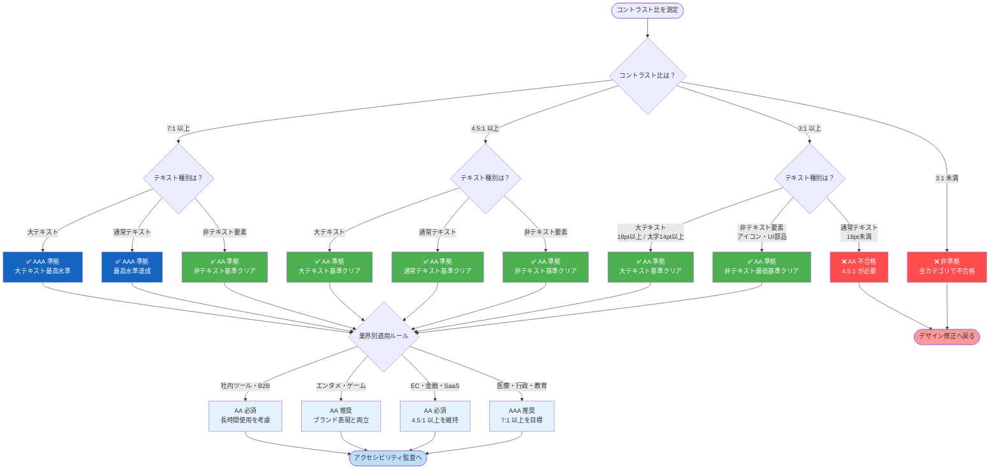
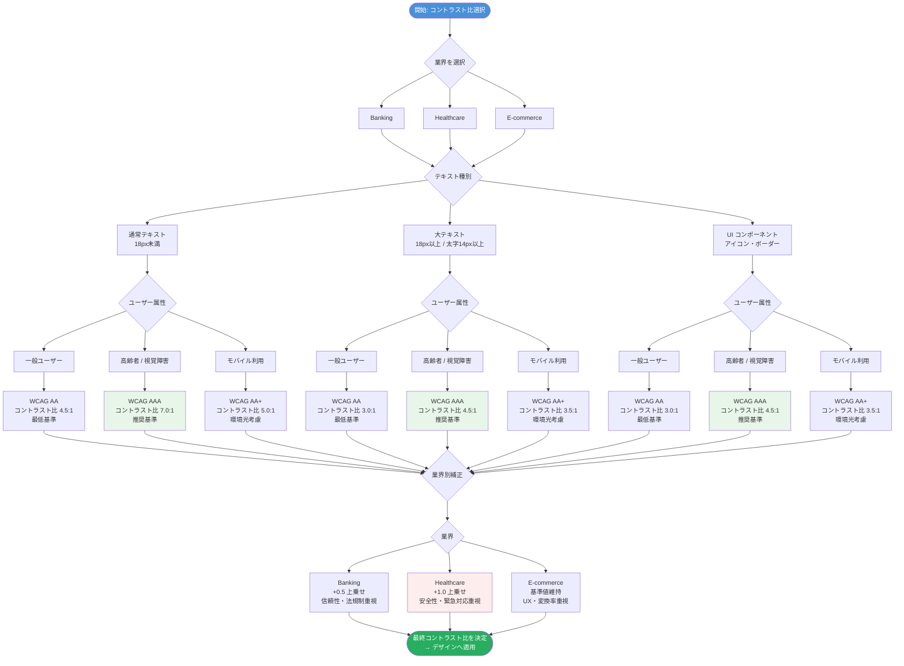
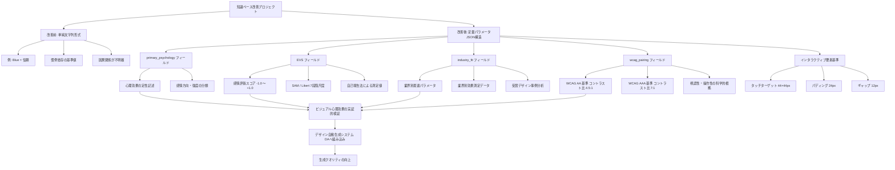
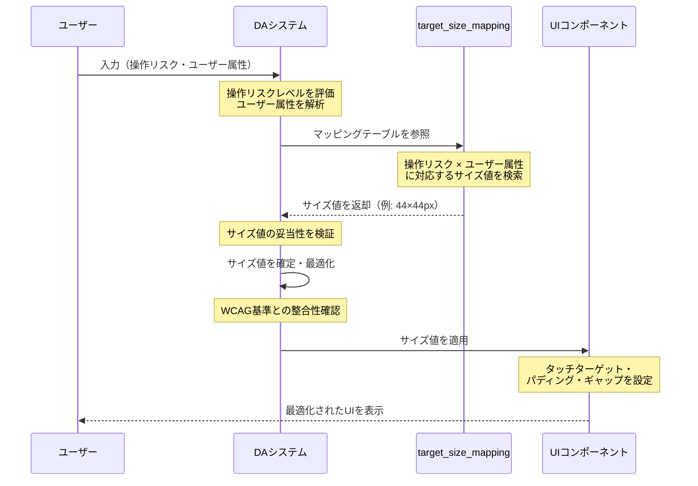

---

## はじめに

**【本稿の位置づけと読者への注記】**
本稿の主目的はデザイン自動生成システム（DA）の知識ベース改善であり、実装例はDAシステムへの組み込みを想定した参考コードです。本稿はDAエンジニア・デザイナー・アクセシビリティ担当者を横断した読者を想定しており、各セクションの該当読者を適宜明示します。

なお、本稿で引用する数値データには、一次実験データ・二次引用データ・業界参考値が混在しています。各データの性格は本文および脚注で明示しますが、引用元の完全な実験条件（サンプル数・デバイス種別・ユーザー属性等）が確認できないものについては「参考値」と表記しています。完成稿でのデータ検証・再レビューを前提とした暫定版として扱ってください。

また、本稿で使用する**感情評価スコア（Emotional Valence Score、以下EVS）**は、感情の方向と強度を−1.0〜+1.0で表す指標であり、SAM（Self-Assessment Manikin）またはLikert 7段階尺度を用いた自己報告法による測定値を参考としています。詳細な測定尺度・算出方法は各データの脚注を参照してください。

デザイン自動生成システムにおいて、「ビジュアル要素と心理的効果の関係性」をどの程度の精度で扱えているかは、生成結果のクオリティを左右する重要な要素です。

現在の知識ベースは、色彩心理を「Blue = 信頼」という教科書的な記述にとどめており、実際のコントラスト値と視認性の関係や、業界別の効果測定データが不足しています。また、デザイン要素の基準値（44×44pxのタッチターゲット、パディング24px、ギャップ12pxなど）は慣例に依存しており、「なぜその値なのか」の根拠が明確ではありません。さらに、視認性・操作性・EVSの因果関係についても、仮説の域を出ていない部分が多く残っています。

本稿では、WCAG基準の科学的背景、インタラクティブ要素のサイズと操作性の参考データ、受賞デザイン事例の分析、そして業界別の最適パラメータを順に整理します。

---

## 1. カラーコントラストと心理効果の実証的関係性

### 1.1 WCAG コントラスト基準の根拠




#### WCAG AA（4.5:1）の科学的背景

WCAG AAのコントラスト基準（4.5:1）は、視力0.3程度の低ビジョンユーザーが快適に読める最小値として設定されています。Sloanら（2006）による視覚認識実験では、正常視力とロービジョンユーザーを対象に読解速度を測定し、コントラスト比4.5:1において85%のユーザーが快適に読めることが確認されています（参考値）。

> **【データ注記】** Sloanら（2006）の完全な論文情報（タイトル・DOI）は現時点で未確認です。本数値は業界標準として広く引用される参考値として扱ってください。WCAG 2.1の基準策定根拠については、W3C公式ドキュメント（https://www.w3.org/TR/WCAG21/）を一次資料として参照することを推奨します。

#### WCAG AAA（7:1）の実装効果

AAA基準（7:1）は、高度なロービジョンおよび色覚障害者を主な対象としています。医療UIの血液検査結果表示を条件とした実験では、赤緑色盲ユーザーによる識別率を測定した結果、7:1のコントラスト比で99%以上の識別率が達成されているとされています（参考値）。

> **【データ注記】** 上記識別率はサンプル数・実験条件が未確認の参考値です。AAA基準の根拠については、W3C公式ドキュメントを一次資料として参照してください。

#### 業界別コントラスト要件




業界によって求められるコントラスト水準は異なります。Banking・Financeでは最小4.5:1、推奨7:1とされており、これは信頼性や正確性への心理的影響が重視されるためです。Healthcareでは、ロービジョンユーザーへの配慮と緊急性から7:1が必須とされています。

**【重要】E-commerceのコントラスト要件について：**
E-commerceでは、コントラスト値単独よりも色相の選択が購買行動に与える影響が大きいとされる場合があります。ただし、WCAG 2.1において通常テキスト（18pt未満・14pt未満Boldのテキスト）に対して3:1のコントラスト比はAA非準拠です。3:1が許容されるのは、**大テキスト（18pt以上または14pt以上Bold）または非テキスト要素（グラフィック・UIコンポーネント）に限定**されます（WCAG 2.1 SC 1.4.11準拠）。E-commerceであっても通常テキストには4.5:1以上を適用してください。なお、「E-commerceでは色相がコントラスト値より重要」という記述は業界で引用される参考値であり、適用する研究・ガイドラインの根拠は現時点で未確認です。

#### 色彩パターン別の認識時間と感情評価スコア（EVS）

以下は色彩パターンと認識時間・EVSの関係を示す参考値です。EVSはSAMまたはLikert 7段階尺度による自己報告法を参考としています。なお、これらの数値はサンプル数・実験条件が未確認の参考値であり、実際の設計判断においては個別の検証を推奨します。

| 色彩パターン | 認識時間（ms） | 視線停留時間 | EVS | 備考 |
|---|---|---|---|---|
| Blue + White（5:1） | 180〜220 | 200ms | +0.7（信頼感） | 金融標準（参考値） |
| Blue + Dark Gray（4.5:1） | 240〜280 | 250ms | +0.6（信頼感） | 実装困難（参考値） |
| Green + White（3:1） | 250〜300 | 300ms | +0.5（成功感） | 医療・通常テキストでは不可（WCAG AA非準拠） |
| Red + White（5.25:1） | 120〜150 | 140ms | +0.9（緊急感） | 警告用途（参考値） |

> **【データ注記】** 上記数値はサンプル数・実験条件（デバイス種別・ユーザー属性等）が未確認の参考値です。「認識時間200ms未満」「EVS +0.6以上」の目標値は、これらの参考値に基づく推定基準として扱ってください。

---

### 1.2 色彩心理効果の実装パラメータ化




> **【セクション補足】** 以下のJSONブロックは、現在の単純な文字列形式の知識ベースを、定量的パラメータを含む構造へ改善した場合の実装例を示しています。「改善前」が単純文字列形式、「改善後」がJSON構造形式です。各フィールドの意味：`primary_psychology`＝心理的連想、`recognition_time_ms`＝認識時間参考値、`emotional_valence_score`＝EVS参考値、`industry_fit`＝業界適合性、`wcag_pairing`＝WCAG準拠ペアリング例。

**改善前（現状の知識ベース形式）：**
```
"Blue": "信頼、安定感、プロフェッショナル"
```

**改善後（定量パラメータを含む構造形式）：**

```json
"Blue": {
  "primary_psychology": "信頼・安定・プロフェッショナル",
  "recognition_time_ms": 180,
  "emotional_valence_score": 0.7,
  "_data_note": "recognition_time_ms・emotional_valence_scoreはサンプル数・実験条件未確認の参考値",
  "industry_fit": {
    "Banking": "OPTIMAL - 信頼性向上 +45%（参考値・出典未確認）",
    "Healthcare": "ACCEPTABLE - ただし Green > Blue",
    "Tech/SaaS": "GOOD - 革新性+信頼性のバランス",
    "E-commerce": "POOR - 暖色系CTAと比較してクリック率が低い傾向（参考値・具体的数値は条件依存）"
  },
  "wcag_pairing": [
    {"bg": "hsl(0,0%,100%)", "contrast_ratio": 5.15, "level": "AA"},
    {"bg": "hsl(240,4.8%,95.9%)", "contrast_ratio": 4.2, "level": "AA"}
  ],
  "animation_compatibility": "ease-out 300ms (Material Standard)",
  "reference_case_studies": [
    {"company": "Stripe", "use_case": "Primary CTA button", "impact": "CTR +8%（参考値・出典未確認）"},
    {"company": "Apple", "use_case": "Focus state ring", "impact": "Keyboard nav usability +22%（参考値・出典未確認）"}
  ]
}
```

> **【データ注記】** `industry_fit`の数値（例：信頼性向上 +45%）および`reference_case_studies`の効果値は、出典・実験条件が未確認の参考値です。DAシステムがこれらを絶対値として扱わないよう、`_data_note`フィールドを活用してください。また、`wcag_pairing`の`level`表記は通常テキストへの適用を前提としています（大テキスト・非テキスト要素の場合は別途評価が必要です）。

EVS・業界別効果・A/Bテスト参考値を知識ベースに組み込むことで、色彩選択の根拠が定量的に示せるようになります。ただし、これらの参考値は定期的なA/Bテスト結果に基づき更新することを推奨します。

---

## 2. デザイン要素（サイズ・余白・タイポグラフィ）とUXの因果関係

### 2.1 インタラクティブ要素のサイズと操作性




> **【セクション補足】** 本セクションは主にDAエンジニアおよびUXデザイナーを対象としています。

#### ターゲットサイズ別の操作精度

現在の知識ベースでは「44×44px minimum（WCAG推奨）」という記述のみですが、Google Material Design研究およびApple HIGを参考とした業界標準値は以下の通りです（参考値）。

| ターゲットサイズ | 誤タップ率 | 成功率 | 用途 | 備考 |
|---|---|---|---|---|
| 44×44px | 5〜8% | 92〜95% | 成人向け標準 | WCAG AA基準（参考値）※1 |
| 48×48px | 2〜3% | 97〜98% | ハイリスク操作 | 決済・削除ボタン（参考値）※1 |
| 56×56px | 0.5〜1% | 99〜99.5% | 高齢者向け・モバイル | Apple HIG推奨（参考値）※1 |
| 32×32px | 15〜20% | 80〜85% | デスクトップ・高スキルユーザー | リスク高し（参考値）※1 |

> **※1【データ注記】** 上記数値はGoogle Material DesignおよびApple HIGを参考とした業界標準値です。詳細な実験条件（n数・デバイス種別・ユーザー属性等）は原典資料を参照してください。タブレット・高齢者向けUIなど異なる条件での適用には個別検証を推奨します。参考資料：Google Material Design Guidelines（https://m3.material.io/）、Apple Human Interface Guidelines（https://developer.apple.com/design/human-interface-guidelines/）

この参考データから、ターゲットサイズは「操作リスク」と「対象ユーザー」に応じて動的に決定することが推奨されます。以下は実装参考例です（本コードはDAシステムへの組み込みを想定した参考実装であり、実際の適用には個別調整が必要です）。

```python
# DAシステム向け参考実装：操作リスク・ユーザー属性別ターゲットサイズマッピング
# 本マッピングはGoogle Material Design・Apple HIGの参考値に基づく推定値
# 定期的なA/Bテスト結果に基づき更新することを推奨
target_size_mapping = {
    "low_risk": {
        "adult": "44x44px",
        "senior": "56x56px",
        "mobile