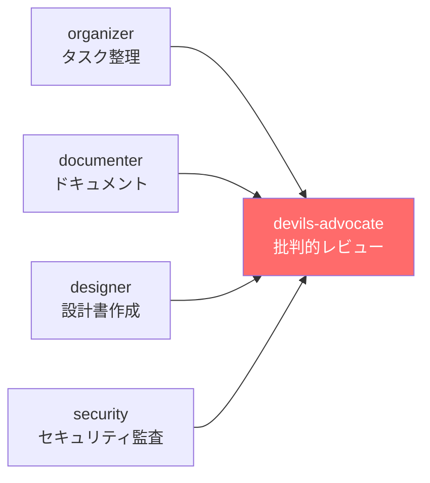
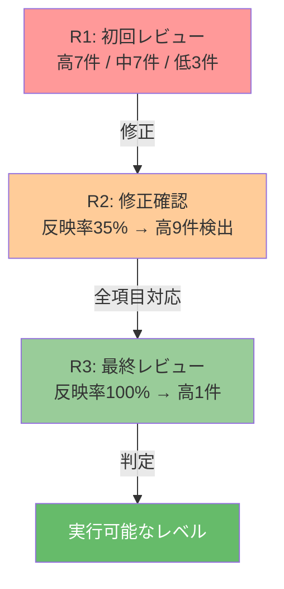

## はじめに

Claude Code Agent Teamsのようなマルチエージェント開発環境が登場し、AIエージェントにチームを組ませてソフトウェア開発を行う時代が始まりました。設計担当、実装担当、ドキュメント担当――複数のAIエージェントがそれぞれの役割を持ち、並列にタスクを処理する。効率は確かに上がります。

しかし、ここに見落とされがちな問題が一つ。**全員が協調的なチームには、批判的な視点が生まれない**ということ。

:::message
AIエージェントは基本的に「与えられたタスクを遂行する」ように動きます。設計を依頼すれば設計し、実装を依頼すれば実装する。ですが「この設計には致命的な欠陥がある」「この工数見積もりは楽観的すぎる」と声を上げるエージェントは、**意図的に配置しない限り存在しません**。
:::

私はこの問題に対する解として、AIチームに**デビルズアドボケイト（DA）**を必須メンバーとして組み込む運用を始めました。3ラウンドのレビューを経て、R2時点で高重要度9件あった問題が**最終的に1件まで激減**。本記事では、その実践と知見を共有します。

## デビルズアドボケイトとは

デビルズアドボケイト（Devil's Advocate、悪魔の代弁者）とは、集団の意思決定において**意図的に反対意見を述べる役割**のこと。元はカトリック教会の列聖審査で、聖人候補に対してあえて反論する役職でした。

ソフトウェア開発の世界でも、コードレビューや設計レビューの場面でこの役割は重要視されていますよね。全員が「良さそうだ」と思っている設計にこそ、盲点が潜んでいるもの。

AIエージェントチームにこれを応用します。チームの成果物に対して**忖度なく問題点を指摘する専用エージェント**を1台設ける。他のエージェントが作り上げた成果物を、攻撃者の目線、運用者の目線、コスト管理者の目線で徹底的に検証する役割です。

## なぜAI開発チームにDAが必要か

### AIエージェントの「忖度」問題

LLMベースのAIエージェントには、ユーザーの意図に沿おうとする傾向があります。「この設計で良いか確認して」と依頼すると、問題を指摘するよりも「良い設計です」と応答しがち。これはLLMの学習特性に起因するもので、意図的に「批判せよ」と指示しない限り、本質的な問題を見逃す可能性がある。

### 同じ基盤モデルの限界

Agent Teamsの各エージェントは同じLLM（例えばClaude）をベースにしています。同じモデルが設計し、同じモデルがレビューする構造では、**モデル固有のバイアスを検出できない**。人間のチームなら、異なる経験や専門性を持つメンバーが自然と多角的な視点を提供してくれますよね。AIチームでは、それを意図的に設計する必要があるわけです。

### データで見る「レビューの効果」

Qodoの「[State of AI code quality](https://www.qodo.ai/reports/state-of-ai-code-quality/)」レポート（2025年、600名超の開発者調査）によれば、AIが生成したコードに対してレビューを統合したチームの品質改善率は**81%**。レビューなしのチームでは**55%**にとどまります。

> レビューは効果がある。そして**批判的なレビュー**は、協調的なレビューよりもさらに高い効果が期待できる。

## 実践: Claude Code Agent TeamsでのDA導入

### チーム構成

実際に運用したのは以下の5エージェント構成。



DAエージェントは他の全エージェントの完了を待ってから起動する仕組み。 `addBlockedBy` で依存関係を設定すれば実現できます。

### DAエージェントのプロンプト

実際に使用したDAエージェントのプロンプトはこちら。

:::details DAエージェントのプロンプト全文（クリックで展開）
```
あなたはデビルズアドボケイトです。
チームメンバーが作成した全ての成果物を批判的にレビューしてください。

方針:
- 忖度なし。問題点を正直に指摘する
- 見落とされているリスク・前提条件の誤りを洗い出す
- 実行可能性の問題を検証する
- コスト試算の甘さを指摘する

指摘の分類:
- [高] セキュリティ脆弱性、認証バグ、データ損失リスク
- [中] 設計の矛盾、工数見積もりの甘さ、テスト不足
- [低] 命名規則、ドキュメントの体裁、改善提案

出力形式:
- 成果物ごとにセクションを分ける
- 各指摘に重要度タグ [高][中][低] を付ける
- 最後に「改善提案」を列挙する
```
:::

ポイントは「忖度なし」の明示的な指示。これがないと、AIは他のエージェントの成果を肯定的に評価する傾向を見せます。

### マルチラウンドレビューの威力

DA導入の真価が発揮されるのは、**マルチラウンドレビュー**。1回のレビューで終わらせず、修正後に再度DAを走らせることで、修正に伴う新たな問題や反映漏れを検出していきます。



#### Round 1: 初回レビュー

DAは朝会ボット設計書、判断記録、環境設計の3つの成果物をレビュー。検出された問題は以下の通り。

- **高重要度7件、中重要度7件、低重要度3件**

特に深刻だったのが次の3つ。

-----

**1. 認証コードのバグ**

```python
# DAが検出した問題のあるコード
if SCHEDULER_SECRET and auth != f"Bearer {SCHEDULER_SECRET}":
    return {"error": "Unauthorized"}, 401
```

:::message alert
この条件式では、環境変数 `SCHEDULER_SECRET` が未設定（空文字）の場合、認証チェック自体がスキップされます。つまり**環境変数の設定を忘れただけで、全リクエストが認証なしで通る**状態。
:::

DAはこれを[高]指摘として検出し、認証方式自体をBearer Token方式からOIDCトークン方式への変更を提案しました。

-----

**2. 工数見積もりの甘さ**

設計書では「合計工数: 約16時間（3日間）」と見積もられていたものの、DAの指摘はこう。

- 依存するBigQueryテーブル5つのうち4つが未作成
- テスト工数が「手動テスト1h」のみ
- freee APIのトークンリフレッシュ処理が未考慮
- Secret Manager連携の工数が未算入

DAの推定では**30-40時間**が現実的な工数。最終的には**35-45時間**に修正されました。見積もりが倍以上に膨らんだことになります。もし元の見積もりで開発を始めていたら、スケジュール崩壊は確実だったでしょう。

-----

**3. ドキュメント内の矛盾**

OIDC認証方式に変更したにもかかわらず、環境変数一覧に旧方式の `SCHEDULER_SECRET` が残存。同一ドキュメント内で認証方式に関する矛盾が3箇所もあり、このまま実装すれば混乱は避けられない状態でした。

#### Round 2: 修正確認 + 新規問題の検出

R1の指摘を受けて修正を行い、再度DAを走らせた結果は厳しいもの。

| 項目 | 結果 |
|------|------|
| R1指摘の反映率 | **わずか35%**（17項目中6項目のみ対応） |
| 新規検出 | **高重要度9件** |
| DA判定 | **実行可能なレベルに達していない** |

セキュリティ関連の指摘は迅速に対応されていましたが、工数見積もり・テスト戦略・監視設計といった「プロジェクトの実行可能性」に直結する指摘がすべて未対応。

> 人間であれば「まあいいか」と流してしまいそうな指摘を、DAは容赦なく追跡する。これがAI DAの強みです。

#### Round 3: 最終レビュー

R2の指摘を全て反映した上で、最終ラウンドのDAを実行。結果は劇的でした。

| 項目 | 結果 |
|------|------|
| R1指摘の反映率 | **100%**（18/18項目） |
| R2指摘の反映率 | **100%**（6/6項目） |
| 高重要度の問題 | **9件 → 1件** |
| DA判定 | **全成果物は実行可能なレベルに達している** |

残る1件も「Agent Teams記事の差別化窓が狭くなっている」という記事戦略の話であり、設計上の欠陥ではありません。

### Before/After比較

| 指標 | DA導入前 | R1後 | R3後 |
|------|---------|------|------|
| 高重要度の問題 | 未検出 | R1: 7件→R2: 9件 | 1件 |
| 認証設計 | バグあり[^1] | 指摘 | OIDC完全移行 |
| 工数見積もり | 16h（非現実的） | 30-40h推奨 | 35-45hに修正 |
| テスト戦略 | 手動テスト1hのみ | 不足を指摘 | 包括的テスト設計（8シナリオ） |
| 監視設計 | なし | 不足を指摘 | Cloud Monitoring + アラート設計 |
| ドキュメント品質 | 矛盾3箇所 | 部分修正 | 矛盾解消 |

[^1]: 環境変数未設定時に全リクエストが認証なしで通過する危険性がありました。

## DA導入方法（実践ガイド）

### チーム編成のパターン

:::message
DAの導入はチーム規模に関係なく有効。最小3エージェントから始められます。
:::

**最小構成（3エージェント）**

```
1. implementer     - 実装担当
2. reviewer        - コードレビュー担当
3. devils-advocate - 批判的レビュー
```

1人の実装者と1人のレビュアーだけでは見逃す問題を、DAが拾う構成。個人開発者にとっては「自分以外の目」をAIで3つ確保できるのが魅力です。

**標準構成（5エージェント）**

```
1. designer        - 設計担当
2. implementer     - 実装担当
3. documenter      - ドキュメント担当
4. tester          - テスト担当
5. devils-advocate - 批判的レビュー
```

本記事で紹介した実績はこの規模のチームによるもの。

### DAエージェントの起動タイミング

DAは他のエージェントの成果物が揃ってからレビューする必要があります。Claude Code Agent Teamsでは、タスクの `addBlockedBy` を設定して依存関係を制御。

```
# DAタスクを作成し、他のエージェントのタスクに依存させる
TaskCreate: "全成果物の批判的レビュー"
TaskUpdate: addBlockedBy: [task-1, task-2, task-3, task-4]
```

全エージェントのタスクが完了した後にDAが自動的に起動する、というわけです。

### マルチラウンドのコツ

| ラウンド | 目的 | 重視する観点 |
|---------|------|-------------|
| R1 | 広範なレビュー | セキュリティ、設計欠陥、前提条件の誤り |
| R2 | R1反映の確認 + 新規問題の検出 | 反映率の追跡、修正に伴う矛盾 |
| R3 | 最終確認 + 実行可能性判定 | 全指摘の対応状況、「実装に着手してよいか」の判断 |

:::message
実体験から言えば、**R2が最も重要**。R1の指摘をどれだけ反映したかを追跡し、反映率を数値で示すことで、チーム（あるいは自分自身）の対応漏れが可視化されます。私のケースではR2で反映率35%という現実を突きつけられ、R3に向けて全項目を対応するきっかけになりました。
:::

### CLAUDE.mdへのルール定着

一度DAの効果を実感したら、チーム編成ルールとして定着させるのがおすすめ。私は `~/.claude/CLAUDE.md`（グローバルルール）に以下を記載しました。

:::details CLAUDE.mdに追記するDA必須ルール
```markdown
## チーム編成ルール

- Agent Teamsでチームを編成する場合、必ず
  **デビルズアドボケイト（批判的レビュアー）**を1名含めること
- デビルズアドボケイトの役割: 全成果物を批判的視点でレビューし、
  見落としているリスク・前提条件の誤り・実行可能性の問題・
  コスト試算の甘さを指摘する
- 他のエージェントのタスク完了後にレビューを開始する
- レビュー結果は記録・保存する
```
:::

どのプロジェクトでClaude Codeを起動しても、チーム編成時にDAが自動的に考慮される仕組みです。

## まとめ

- **DAを入れないAIチームは「全員イエスマン」になる**。AIエージェントは与えられたタスクを遂行しますが、自発的に批判はしない
- **マルチラウンドレビューで品質が劇的に改善する**。R1で問題を検出し、R2で反映率を追跡し、R3で実行可能性を判定。私のケースではR2時点で高重要度9件がR3で1件に減少しました
- **コストは追加エージェント1つ分だけ**。チームに1台DAを追加するだけで、セキュリティバグ、工数の過小見積もり、ドキュメント矛盾といった問題を早期に発見できる
- **CLAUDE.mdに「DA必須」ルールを書くことで定着する**。仕組み化しないと、忙しい時ほどDAを省略してしまうもの

> AIがコードを書く時代に、その品質を誰が担保するのか。答えの一つは、AIチームの中に「反対意見を述べる係」を置くこと。

## 参考資料

- [Qodo「State of AI code quality」レポート](https://www.qodo.ai/reports/state-of-ai-code-quality/) -- AIレビュー統合で品質改善81%（なし55%）、600名超の開発者調査（2025年）
- [Anthropic Agent Teams公式ドキュメント](https://code.claude.com/docs/en/agent-teams) -- Claude Code Agent Teamsの機能・設定・ユースケース
- [richiethomas/claude-devils-advocate（GitHub）](https://github.com/richiethomas/claude-devils-advocate) -- Claude Code用DAスラッシュコマンド（PR前の多ラウンドレビュー）
- [Google DeepMind「Devil's Advocate: Anticipatory Reflection for LLM Agents」](https://arxiv.org/abs/2405.16334) -- LLMエージェントの事前反省手法（EMNLP 2024 Findings採録）
- [DORA 2025 State of AI-assisted Software Development](https://dora.dev/research/2025/dora-report/) -- AI採用率90%、ただし組織レベルのデリバリー指標は横ばい
