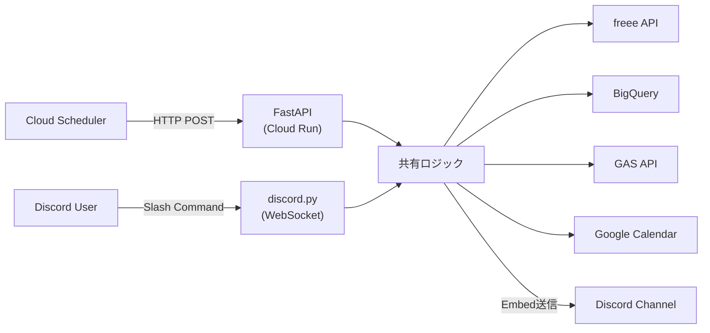

## 毎朝6つのサービスを開くところから始まっていた

合同会社を1人で回していると、朝の情報確認だけでかなりの時間を消費します。Google Calendar、freee、スプレッドシート、BigQuery、タスク管理ツール。それぞれブラウザのタブで開き、目視で確認し、優先順位を頭の中で組み立てる。毎朝30分以上、この「確認ルーティン」に費やしていました。

「全部Discordに集約すればいいのでは？」

その発想から始めたDiscord Botの業務活用が、想像以上に日常を変えてくれた話をします。

## なぜSlackではなくDiscordなのか

業務チャットツールの第一候補はSlackでしょう。しかし1人法人にとって、Discordには明確な優位性がありました。

| 項目 | Slack | Discord |
|:--|:--|:--|
| 無料プランのメッセージ保持 | 90日間 | 無制限 |
| Bot作成のAPI制限 | レートリミット厳しめ | 比較的緩い |
| Webhookの使いやすさ | チャンネルごとに設定 | チャンネルごとに設定 |
| 月額コスト（1人利用） | Pro $8.75/月 | 無料（Nitroなしで十分） |
| Embed（リッチメッセージ） | Block Kit | Embed（色分け・フィールド自在） |
| Bot常駐 | WebSocket対応 | WebSocket対応（Gateway） |

決め手になったのはコストとEmbed表現力の2点。Slackの Block Kit も強力ですが、DiscordのEmbedは色分けやフィールドのレイアウトが直感的で、業務ダッシュボード的な表示を作りやすい。何より、1人で使うのに月額$8.75を払う理由がありません。

:::message
Discordは「ゲーム用チャット」のイメージが強いかもしれませんが、コミュニティ運営や開発チームでの利用も増えています。Bot APIの機能は業務利用にも十分耐えうるものです。
:::

## 業務Botのコマンド設計

実際に業務で使っているコマンド群を紹介します。すべてDiscord上から実行可能で、結果はEmbedで返ってきます。

```
/売上確認          → freee APIから当月売上を取得
/経費 交通費 1500 電車代  → freeeに経費を自動登録
/請求書 [取引先ID] [金額]  → freeeで請求書ドラフト作成
/タスク            → GAS APIから優先タスク一覧
/案件              → 進行中案件の進捗サマリー
/kpi               → BigQueryからFIRE KPIを表示
```

これだけでも、ブラウザで6つのサービスを行き来する時間が大幅に減ります。

ただし、注意すべき設計判断が一つ。請求書や経費など金額に関わる操作は、必ず「ドラフト作成」に留めること。自動送信・自動確定にすると、入力ミスが即座に取引先に届くリスクがあります。Botでドラフトを作り、最終確認はfreee管理画面で行う。この「人間が最後に判断するフロー」が安全運用の鍵です。

## FastAPI + discord.py の統合アーキテクチャ

このBotの技術的な特徴は、FastAPI（HTTPサーバー）とdiscord.py（WebSocket Bot）を同一プロセスで動かしている点にあります。



通常、FastAPIとdiscord.pyは別プロセスで動かすケースが多いでしょう。しかし1人法人の業務Botでは、同一プロセスに統合することでメリットが生まれます。

1. 認証情報の共有 -- freee OAuth、BigQueryクライアント、GAS APIのトークンを一箇所で管理
2. デプロイの簡素化 -- Dockerコンテナ1つ、Cloud Runサービス1つで完結
3. コスト削減 -- Cloud Runの追加インスタンスが不要

```python
import asyncio
import discord
from fastapi import FastAPI
from contextlib import asynccontextmanager

bot = discord.Client(intents=discord.Intents.default())

@asynccontextmanager
async def lifespan(app: FastAPI):
    # FastAPI起動時にDiscord Botも起動
    asyncio.create_task(bot.start(DISCORD_BOT_TOKEN))
    yield
    await bot.close()

app = FastAPI(lifespan=lifespan)

@app.post('/api/morning-briefing')
async def morning_briefing():
    # HTTPエンドポイントからDiscordチャンネルに送信
    channel = bot.get_channel(CHANNEL_ID)
    embed = build_briefing_embed()
    await channel.send(embed=embed)
    return {'status': 'ok'}
```

:::message alert
discord.pyの`Client.start()`は内部でイベントループをブロックしようとするため、FastAPIの`lifespan`内で`asyncio.create_task()`として非同期タスクに渡す必要があります。`Client.run()`を使うとイベントループが競合してエラーになるので注意してください。
:::

## Cloud Run上でのBot運用

Cloud Run上でDiscord Botを常駐させるには、いくつか特有の課題があります。

### CPU常時割り当てが必須

Cloud Runはデフォルトでリクエスト処理中のみCPUを割り当てます。しかしdiscord.pyはWebSocket接続を常時維持する必要があるため、CPU常時割り当て（`--cpu-always-allocated`）の設定が不可欠。

```bash
gcloud run services update correlate-api \
  --project=correlate-workspace \
  --region=asia-northeast1 \
  --cpu-always-allocated \
  --min-instances=1
```

### コールドスタート対策

`min-instances=1`を設定しないと、アイドル時にインスタンスが0にスケールダウンします。その状態でCloud Schedulerからの朝会トリガーが来ると、コンテナ起動 + discord.pyの接続確立に時間がかかり、タイムアウトする可能性も。月額$0.50〜$2.00程度のコストで常時ウォーム状態を維持できるなら、安い保険でしょう。

### 認証設計

Cloud SchedulerからCloud RunへのHTTP呼び出しには、OIDCトークン認証を使っています。

```yaml
# Cloud Scheduler設定
http_target:
  uri: "https://correlate-api-xxxxx.a.run.app/api/morning-briefing"
  http_method: POST
  oidc_token:
    service_account_email: "scheduler-sa@project.iam.gserviceaccount.com"
    audience: "https://correlate-api-xxxxx.a.run.app"
```

Bearer Tokenのような共有シークレット方式は、ログへの漏洩やローテーション管理の煩雑さがあるため避けました。OIDCトークンならGCP IAMの仕組みで自動的に署名・検証が行われ、アプリケーション側で認証コードを書く必要がありません。

## SaaS連携の実装例

### freee連携: 売上確認と経費登録

freee APIとの連携は、OAuth2認証が最大のハードル。特にfreeeはリフレッシュトークンが使い捨て仕様なので、新しいトークンを確実に保存する仕組みが必要です。

:::message
freee APIのOAuth2連携の詳細は、別記事「[freee APIをCloud Runで動かして経理作業を月2時間に減らした話](https://zenn.dev/correlate/articles/freee-api-cloud-run)」で詳しく解説しています。
:::

経費登録コマンドの実装例はこのような形になります。

```python
@bot.tree.command(name='経費', description='freeeに経費を登録')
async def register_expense(
    interaction: discord.Interaction,
    category: str,
    amount: str,
    description: str
):
    parsed_amount = parse_amount(amount)  # '1500'や'1万5千'に対応
    result = await create_freee_expense(category, parsed_amount, description)

    if 'error' in result:
        await interaction.response.send_message(
            f'経費登録エラー: {result["error"]}',
            ephemeral=True
        )
        return

    embed = discord.Embed(
        title='経費登録完了',
        color=0x2ECC71,  # 緑
        description=f'{category}: {parsed_amount:,}円'
    )
    embed.add_field(name='内容', value=description)
    embed.add_field(name='ステータス', value='freeeに登録済み')
    await interaction.response.send_message(embed=embed)
```

金額の入力は「1500」のような数値だけでなく、「1万5千」のような日本語表記にも対応させています。毎日使うツールでは、こうした入力の柔軟性が継続利用に直結するもの。

### Google Calendar連携: 今日の予定確認

Google Calendar APIはサービスアカウント認証で接続し、今日のイベント一覧を取得します。

```python
async def fetch_calendar_events(self) -> list:
    """Google Calendar APIから今日の予定を取得"""
    service = build('calendar', 'v3', credentials=self.credentials)
    now = datetime.now(JST)
    start_of_day = now.replace(hour=0, minute=0, second=0).isoformat()
    end_of_day = now.replace(hour=23, minute=59, second=59).isoformat()

    events_result = service.events().list(
        calendarId=GOOGLE_CALENDAR_ID,
        timeMin=start_of_day,
        timeMax=end_of_day,
        singleEvents=True,
        orderBy='startTime'
    ).execute()

    return events_result.get('items', [])
```

取得した予定は、朝会ブリーフィングのEmbed内に時刻・件名・ビデオ会議リンク付きで表示されます。

## Embedで見やすいレスポンスを作る

Discord Botの真価はEmbed表現にあります。朝会ブリーフィングでは5つのEmbedを連結して送信しており、色分けで情報カテゴリを瞬時に判別できるようにしています。

| Embed | 色 | 内容 |
|:--|:--|:--|
| ヘッダー | 青 (`#3498DB`) | 今日のカレンダー予定 |
| アラート | 赤 (`#E74C3C`) | 未入金・納期超過・補助金期限 |
| KPI | 緑 (`#57F287`) | 可処分キャッシュ月数・売上・手残り率 |
| タスク | 黄 (`#FFFF00`) | 優先タスク・昨日の完了・遅延リスク |
| 案件 | 紫 (`#9B59B6`) | 進行中案件一覧・工数実績・今日の予定工数 |

実装のポイントは、Embedフィールドの`inline`パラメータの使い分けです。

```python
def build_kpi_embed(self, kpi: dict) -> discord.Embed:
    embed = discord.Embed(
        title='KPI サマリー',
        color=0x57F287  # 緑
    )
    embed.add_field(
        name='可処分キャッシュ月数',
        value=f'{kpi["cash_months"]:.1f}ヶ月',
        inline=True  # 横並び
    )
    embed.add_field(
        name='今月売上',
        value=f'¥{kpi["monthly_revenue"]:,}',
        inline=True  # 横並び
    )
    embed.add_field(
        name='手残り率',
        value=f'{kpi["net_margin_rate"]:.1f}%',
        inline=True  # 横並び
    )
    return embed
```

`inline=True`にすると、フィールドが横に並んで表示されます。KPIのように数値を並べて比較したい場合は横並び、タスク一覧のように縦に読みたい場合は`inline=False`にする。この使い分けだけで視認性が大きく変わります。

:::details 朝会ブリーフィングの全Embed構築コード（抜粋）
```python
def build_embeds(self, data: dict) -> list:
    embeds = []

    # 1. ヘッダー + カレンダー
    header = discord.Embed(
        title=f'おはようございます！ {today} の朝会',
        color=0x3498DB,
        description='今日のブリーフィングをお届けします。'
    )
    events = data.get('calendar', [])
    if events:
        event_text = '\n'.join(
            f'{e["start"]} {e["summary"]}'
            for e in events
        )
        header.add_field(
            name=f'今日の予定（{len(events)}件）',
            value=event_text,
            inline=False
        )
    embeds.append(header)

    # 2. アラート（赤）
    alerts = data.get('alerts', {})
    if alerts.get('unpaid') or alerts.get('deadlines'):
        alert_embed = discord.Embed(
            title='!! アラート',
            color=0xE74C3C
        )
        # ... フィールド追加
        embeds.append(alert_embed)

    # 3. KPI（緑）、4. タスク（黄）、5. 案件（紫）
    # ... 同様に構築

    return embeds
```
:::

### Discord Embed文字数制限への対応

運用していると地味にハマるのがEmbedの文字数制限。フィールド値は最大1024文字、descriptionは最大4096文字です。

```python
def _truncate_field(self, text: str, max_length: int = 1024) -> str:
    if len(text) <= max_length:
        return text
    suffix = '\n...（以下省略）'
    return text[:max_length - len(suffix)] + suffix
```

案件数やタスク数が多い日は上限を超える可能性があるため、切り詰め処理を全フィールドに適用しています。

## 運用で困ったこと・ハマりどころ

### 1. Cloud Runのコンテナ再起動でBotが切断される

Cloud Runのコンテナは予期せず再起動されることがあります。再起動後、discord.pyのWebSocket接続が再確立されるまでの間、Botがオフラインになる問題が発生しました。

対策として、discord.pyの自動再接続機能（デフォルト有効）に任せつつ、`bot.is_ready()`チェックを挟んで未接続時はHTTP 503を返す設計にしました。Cloud Schedulerのリトライ設定（最大3回、バックオフ30〜300秒）でカバーしています。

### 2. freeeリフレッシュトークンの消失

freee APIのリフレッシュトークンは使い捨て仕様のため、コンテナ再起動でメモリ上のトークンが失われるとAPI認証が不能に。長期運用ではSecret Managerへの保存が必須です。

:::message alert
Cloud Runの環境変数にリフレッシュトークンを設定している場合、トークンリフレッシュ後に環境変数は更新されません。コンテナが再起動すると古い（無効な）トークンが読み込まれます。Google Cloud Secret Managerに保存し、リフレッシュのたびに新バージョンを追加する仕組みが安全です。
:::

### 3. タイムゾーンの罠

Cloud Runのデフォルトタイムゾーンはutc。BigQueryのクエリで`CURRENT_DATE()`を使うとUTC基準になり、JST環境とで日付がずれます。

```python
# 全クエリでタイムゾーンを明示
JST = timezone(timedelta(hours=9))

# BigQuery
WHERE date = CURRENT_DATE('Asia/Tokyo')

# Python
datetime.now(JST)
```

「昨日のタスクが表示されない」という症状の原因がタイムゾーンだったときは、なかなか気づきにくいものです。

### 4. 朝会の重複配信

Cloud Schedulerのリトライ機能により、1回目のリクエストがタイムアウトした後に再試行されると、同じ日の朝会が2回配信される問題が発生。BigQueryの`morning_briefings`テーブルで当日の配信済みレコードをチェックする冪等性ガードで対処しました。

```python
async def is_already_delivered_today(self) -> bool:
    query = """
    SELECT COUNT(*) as cnt
    FROM `workspace.morning_briefings`
    WHERE date = CURRENT_DATE('Asia/Tokyo')
      AND status IN ('success', 'partial_failure')
    """
    result = self.bq.query(query).result()
    for row in result:
        return row.cnt > 0
    return False
```

## Before / After

| | Before | After |
|:--|:--|:--|
| 朝の情報確認 | 6サービスをブラウザで巡回（30分） | Discord朝会ブリーフィング（5分） |
| 経費登録 | freee管理画面で手入力（5分/件） | Discordコマンド（30秒/件） |
| 未入金チェック | 月末にfreee画面を目視確認 | 毎朝自動通知 |
| 案件状況の把握 | スプシを開いて確認（10分） | Discordコマンド（即時） |
| 月間の事務作業 | 約6時間 | 約2時間 |

数値以上に大きかったのは、心理的な変化です。「あの請求書、入金されたかな」「今日の予定なんだっけ」という小さなモヤモヤが、Discordを開くだけで解消される。業務ツールを「開きにいく」のではなく、普段使っているDiscordに情報が「来てくれる」。この受動的な情報取得が、1人法人の認知負荷を大きく下げてくれました。

## まとめ

Discord Botを業務ツールとして活用する具体的な実装方法を、FastAPI + discord.py + Cloud Runのアーキテクチャで紹介しました。

ポイントを振り返ります。

- Discordは無料で十分な業務Bot基盤になる -- Embed表現力、API制限の緩さ、Webhookの手軽さが1人法人に最適
- FastAPIとdiscord.pyの同一プロセス統合 -- 認証情報の共有とデプロイの簡素化が大きなメリット
- Cloud Runでの常駐運用 -- CPU常時割り当てとmin-instances設定が必須
- SaaS連携のコツ -- 金額操作は「ドラフト作成」に留め、最終確認は人間が行う
- Embedの色分け -- 5色の使い分けで情報カテゴリを視覚化

1人法人でなくても、小規模チームで「Slackに月額を払うほどではないが、業務を効率化したい」というケースには有効な選択肢になるはずです。まずはWebhookで簡単な通知Botを作るところから始めてみてはいかがでしょうか。

## 参考資料

https://discordpy.readthedocs.io/en/stable/

https://discord.com/developers/docs/resources/message#embed-object

https://fastapi.tiangolo.com/

https://cloud.google.com/run/docs

https://developer.freee.co.jp/reference/accounting/reference

https://developers.google.com/calendar/api/v3/reference

https://zenn.dev/correlate/articles/solo-corp-gcp
