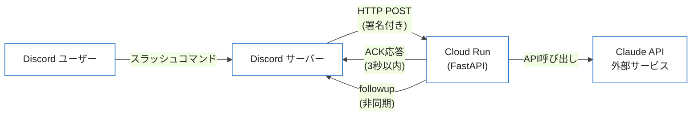
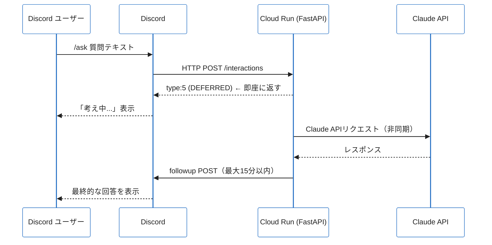

## はじめに

Discord BotをCloud Runにデプロイする記事を探すと、多くはHerokuやVPSでの「常時起動型」の解説です。常時起動型はWebSocket接続を維持し続けるため、Cloud Runのゼロスケール機能と相性が悪く、最小インスタンス数を1以上に設定しなければなりません。

本記事では、**HTTP Interaction型**と呼ばれる別のBotアーキテクチャを使い、Cloud Runのゼロスケールを活かしたコスト最小構成を実装します。さらにDiscordの3秒タイムアウト問題の解決策（deferred response）と、Claude APIを使ったAIコマンドの実装まで解説します。

### WebSocket型 vs HTTP型の違い

Discordのスラッシュコマンドには、2種類のホスト方式があります。

| 項目 | WebSocket型（Gateway） | HTTP Interaction型 |
|:--|:--|:--|
| 仕組み | 常時WebSocket接続を維持 | DiscordがHTTP POSTを送信 |
| ライブラリ | discord.py, hikari など | discord-interactions |
| コスト | 常時起動が必要 | リクエスト時のみ起動 |
| Cloud Run適性 | 低（接続が途切れる） | 高（ゼロスケール可） |
| 機能制限 | なし | スラッシュコマンドのみ |
| セキュリティ | Bot Tokenで認証 | 署名検証が必須 |

スラッシュコマンドだけを提供するBotであれば、HTTP型のほうが運用コストを大幅に削減できます。低頻度のコマンド実行なら、Cloud Runの無料枠でほぼカバーできます。



---

## 1. Discord Botのセットアップ

### Developer Portalでアプリを作成する

1. [Discord Developer Portal](https://discord.com/developers/applications) にアクセスし、「New Application」をクリックします
2. アプリ名を入力して作成します（例: `my-cloudrun-bot`）
3. 左メニューの「Bot」から「Add Bot」をクリックしてBotを追加します
4. 「TOKEN」セクションで「Reset Token」をクリックし、Bot Tokenを取得してメモします（この画面でしか表示されません）
5. 左メニューの「General Information」で `APPLICATION ID` と `PUBLIC KEY` を取得します

取得する3つの値:

```
APPLICATION_ID   = アプリケーションID（18桁の数字）
PUBLIC_KEY       = 公開鍵（64文字の16進数文字列）
BOT_TOKEN        = Botのアクセストークン（MTxxxxxxx...形式）
```

### BotをサーバーにINVITEする

「OAuth2 > URL Generator」から招待URLを生成します。

- Scopes: `bot`, `applications.commands`
- Bot Permissions: 最低限 `Send Messages`, `Use Slash Commands`

生成されたURLをブラウザで開き、Botを招待するサーバーを選択します。

---

## 2. HTTP Interaction型の仕組み

### Discordがリクエストを送信するフロー

HTTP Interaction型では、DiscordがBotの代わりに「中継サーバー」として機能します。ユーザーがスラッシュコマンドを実行すると、DiscordはDeveloper Portalに登録した「Interactions Endpoint URL」へHTTP POSTを送信します。

リクエストのボディはJSON形式で、コマンド名やオプション値が含まれます。アプリは**3秒以内**に応答を返す必要があります。

### ACK応答の種類

| type値 | 意味 | 使用場面 |
|:--|:--|:--|
| 1 | PONG | Discordの疎通確認（PING）への応答 |
| 4 | CHANNEL_MESSAGE_WITH_SOURCE | 即時メッセージ送信 |
| 5 | DEFERRED_CHANNEL_MESSAGE_WITH_SOURCE | 遅延応答（ローディング表示） |

---

## 3. プロジェクト構成

実装に使うファイル構成は以下のとおりです。

```
discord-bot/
├── main.py                  # FastAPIアプリ本体
├── commands/
│   ├── __init__.py
│   ├── ping.py              # /pingコマンド
│   ├── echo.py              # /echoコマンド
│   └── ask.py               # /ask（Claude AI連携）
├── utils/
│   ├── discord_verify.py    # 署名検証
│   └── discord_followup.py  # followup送信ユーティリティ
├── register_commands.py     # スラッシュコマンド登録スクリプト
├── Dockerfile
└── requirements.txt
```

`requirements.txt`:

```
fastapi>=0.110.0
uvicorn[standard]>=0.29.0
discord-interactions>=0.4.0
PyNaCl>=1.5.0
anthropic>=0.25.0
httpx>=0.27.0
```

---

## 4. 署名検証の実装（セキュリティ必須）

HTTP Interaction型で最も重要なのが**署名検証**です。DiscordはすべてのリクエストにEd25519署名を付与します。この検証を省略すると、悪意のある第三者が任意のデータをBotに送り込むことができてしまいます。

`utils/discord_verify.py`:

```python
import os
from nacl.signing import VerifyKey
from nacl.exceptions import BadSignatureError
from fastapi import Request, HTTPException


async def verify_discord_signature(request: Request) -> bytes:
    """
    Discordのリクエスト署名を検証する。
    検証失敗時は401を返す。
    """
    public_key = os.environ["DISCORD_PUBLIC_KEY"]

    signature = request.headers.get("X-Signature-Ed25519")
    timestamp = request.headers.get("X-Signature-Timestamp")

    if not signature or not timestamp:
        raise HTTPException(status_code=401, detail="Missing signature headers")

    body = await request.body()

    try:
        verify_key = VerifyKey(bytes.fromhex(public_key))
        verify_key.verify(
            (timestamp + body.decode("utf-8")).encode(),
            bytes.fromhex(signature),
        )
    except BadSignatureError:
        raise HTTPException(status_code=401, detail="Invalid signature")

    return body
```

:::message alert
署名検証は**絶対に省略しないでください**。Discordも公式ドキュメントで必須要件として明記しています。検証を省くと、不正なコマンドを外部から実行されるリスクがあります。
:::

---

## 5. FastAPIアプリの実装

`main.py`:

```python
import os
import json
from fastapi import FastAPI, Request, BackgroundTasks
from fastapi.responses import JSONResponse

from utils.discord_verify import verify_discord_signature
from commands.ping import handle_ping
from commands.echo import handle_echo
from commands.ask import handle_ask

app = FastAPI()

INTERACTION_TYPE_PING = 1
INTERACTION_TYPE_APPLICATION_COMMAND = 2


@app.post("/interactions")
async def interactions(request: Request, background_tasks: BackgroundTasks):
    # 署名検証（必須）
    body = await verify_discord_signature(request)
    data = json.loads(body)

    interaction_type = data.get("type")

    # PINGへの応答（Discordの疎通確認）
    if interaction_type == INTERACTION_TYPE_PING:
        return JSONResponse({"type": 1})

    # スラッシュコマンドの処理
    if interaction_type == INTERACTION_TYPE_APPLICATION_COMMAND:
        command_name = data["data"]["name"]

        if command_name == "ping":
            return handle_ping(data)

        if command_name == "echo":
            return handle_echo(data)

        if command_name == "ask":
            # 非同期処理が必要なコマンドはdeferred responseを返す
            return await handle_ask(data, background_tasks)

    return JSONResponse({"type": 1})


@app.get("/health")
def health():
    return {"status": "ok"}
```

---

## 6. スラッシュコマンドの実装

### /ping コマンド（即時応答）

`commands/ping.py`:

```python
from fastapi.responses import JSONResponse


def handle_ping(data: dict) -> JSONResponse:
    """即時応答のサンプル: /ping"""
    return JSONResponse({
        "type": 4,  # CHANNEL_MESSAGE_WITH_SOURCE
        "data": {
            "content": "Pong! Cloud Runは正常に動作しています。",
        },
    })
```

### /echo コマンド（オプション付き）

`commands/echo.py`:

```python
from fastapi.responses import JSONResponse


def handle_echo(data: dict) -> JSONResponse:
    """オプション値を使った応答: /echo text:<テキスト>"""
    options = data.get("data", {}).get("options", [])
    text = next((opt["value"] for opt in options if opt["name"] == "text"), "")

    return JSONResponse({
        "type": 4,
        "data": {
            "content": f"Echo: {text}",
        },
    })
```

---

## 7. 3秒タイムアウト問題とdeferred response

Claude APIや外部APIの呼び出しは通常3秒以上かかります。Discordの仕様では、受信から3秒以内に応答しないとユーザー側にエラーが表示されます。

**解決策: deferred response（遅延応答）パターン**



1. 受信直後に `type: 5` を返す（「考え中...」のローディング表示）
2. FastAPIの `BackgroundTasks` でAPI呼び出しをバックグラウンド実行
3. 完了後にDiscordの`followup` APIへPOSTして結果を送信

`utils/discord_followup.py`:

```python
import httpx
import os


async def send_followup(interaction_token: str, content: str) -> None:
    """
    Discord followup APIに結果を送信する。
    deferred response後に呼び出す。
    """
    application_id = os.environ["DISCORD_APPLICATION_ID"]
    url = f"https://discord.com/api/v10/webhooks/{application_id}/{interaction_token}"

    async with httpx.AsyncClient() as client:
        await client.post(url, json={"content": content})
```

---

## 8. Claude/Anthropic API連携（AIコマンドの実装）

`commands/ask.py`:

```python
import os
import anthropic
from fastapi import BackgroundTasks
from fastapi.responses import JSONResponse

from utils.discord_followup import send_followup


async def handle_ask(data: dict, background_tasks: BackgroundTasks) -> JSONResponse:
    """
    /ask コマンド: Claude APIに質問を投げ、結果をfollowupで返す。
    Claude APIの応答には時間がかかるためdeferred responseを使用。
    """
    options = data.get("data", {}).get("options", [])
    question = next((opt["value"] for opt in options if opt["name"] == "question"), "")
    interaction_token = data["token"]

    # バックグラウンドでClaude APIを呼び出す
    background_tasks.add_task(
        call_claude_and_followup,
        question=question,
        interaction_token=interaction_token,
    )

    # 即座にdeferred responseを返す（「考え中...」表示）
    return JSONResponse({
        "type": 5,  # DEFERRED_CHANNEL_MESSAGE_WITH_SOURCE
        "data": {"flags": 0},
    })


async def call_claude_and_followup(question: str, interaction_token: str) -> None:
    """
    バックグラウンド処理: Claude APIを呼び出してDiscordにfollowupを送信する。
    """
    api_key = os.environ["ANTHROPIC_API_KEY"]
    client = anthropic.Anthropic(api_key=api_key)

    try:
        message = client.messages.create(
            model="claude-3-5-haiku-20241022",
            max_tokens=1024,
            messages=[
                {
                    "role": "user",
                    "content": question,
                }
            ],
        )
        answer = message.content[0].text

        # Discordのメッセージ上限は2000文字
        if len(answer) > 1900:
            answer = answer[:1900] + "\n...(回答が長いため省略しました)"

        content = f"**質問:** {question}\n\n**回答:**\n{answer}"

    except Exception as e:
        content = f"エラーが発生しました: {str(e)}"

    await send_followup(interaction_token, content)
```

:::message
`BackgroundTasks` はFastAPIがレスポンスを返した**後に**実行されます。そのためCloud Runのリクエストタイムアウト設定に注意が必要です。デフォルトは300秒ですが、長い処理が必要な場合は `--timeout` オプションで延長できます（最大3600秒）。
:::

---

## 9. スラッシュコマンドの登録

スラッシュコマンドはDiscord APIに登録が必要です。**Guildコマンド**（特定サーバー限定）は即座に反映され、開発時に便利です。

`register_commands.py`:

```python
import os
import httpx

APPLICATION_ID = os.environ["DISCORD_APPLICATION_ID"]
BOT_TOKEN = os.environ["DISCORD_BOT_TOKEN"]
GUILD_ID = os.environ["DISCORD_GUILD_ID"]  # 開発用サーバーID

url = f"https://discord.com/api/v10/applications/{APPLICATION_ID}/guilds/{GUILD_ID}/commands"

commands = [
    {
        "name": "ping",
        "description": "Botの動作確認",
    },
    {
        "name": "echo",
        "description": "入力したテキストをそのまま返します",
        "options": [
            {
                "type": 3,  # STRING
                "name": "text",
                "description": "返すテキスト",
                "required": True,
            }
        ],
    },
    {
        "name": "ask",
        "description": "AIに質問します（Claude APIを使用）",
        "options": [
            {
                "type": 3,  # STRING
                "name": "question",
                "description": "AIへの質問",
                "required": True,
            }
        ],
    },
]

headers = {
    "Authorization": f"Bot {BOT_TOKEN}",
    "Content-Type": "application/json",
}

with httpx.Client() as client:
    for command in commands:
        response = client.post(url, json=command, headers=headers)
        print(f"{command['name']}: {response.status_code}")
```

実行方法:

```bash
export DISCORD_APPLICATION_ID=YOUR_APPLICATION_ID
export DISCORD_BOT_TOKEN=YOUR_BOT_TOKEN
export DISCORD_GUILD_ID=YOUR_GUILD_ID

python register_commands.py
```

:::message
グローバルコマンド（全サーバー対象）として登録する場合は、URLを `https://discord.com/api/v10/applications/{APPLICATION_ID}/commands` に変更します。ただし反映まで最大1時間かかります。
:::

---

## 10. Dockerfileの作成

```dockerfile
FROM python:3.12-slim

WORKDIR /app

# 依存関係を先にインストール（キャッシュ活用）
COPY requirements.txt .
RUN pip install --no-cache-dir -r requirements.txt

# ソースコードをコピー
COPY . .

# 非rootユーザーで実行（セキュリティ推奨）
RUN useradd -m appuser && chown -R appuser /app
USER appuser

# Cloud RunはPORT環境変数を使用する
CMD ["sh", "-c", "uvicorn main:app --host 0.0.0.0 --port ${PORT:-8080}"]
```

---

## 11. Secret Managerでのトークン管理

Bot TokenやAPIキーを環境変数に直接設定するのではなく、Google Cloud Secret Managerで管理します。

### シークレットの作成

```bash
# プロジェクトIDを設定
export PROJECT_ID=YOUR_GCP_PROJECT_ID

# シークレットの作成
echo -n "YOUR_BOT_TOKEN" | \
  gcloud secrets create discord-bot-token \
    --data-file=- \
    --project="${PROJECT_ID}"

echo -n "YOUR_PUBLIC_KEY" | \
  gcloud secrets create discord-public-key \
    --data-file=- \
    --project="${PROJECT_ID}"

echo -n "YOUR_APPLICATION_ID" | \
  gcloud secrets create discord-application-id \
    --data-file=- \
    --project="${PROJECT_ID}"

echo -n "YOUR_ANTHROPIC_API_KEY" | \
  gcloud secrets create anthropic-api-key \
    --data-file=- \
    --project="${PROJECT_ID}"
```

### Cloud RunサービスアカウントにSecret Managerの権限を付与

```bash
# サービスアカウントのメールアドレスを確認
gcloud run services describe discord-bot \
  --region=asia-northeast1 \
  --format="value(spec.template.spec.serviceAccountName)"

# Secret Managerアクセス権限を付与
gcloud projects add-iam-policy-binding "${PROJECT_ID}" \
  --member="serviceAccount:YOUR_SA_EMAIL" \
  --role="roles/secretmanager.secretAccessor"
```

---

## 12. Cloud Runへのデプロイ

### デプロイコマンド

```bash
export PROJECT_ID=YOUR_GCP_PROJECT_ID
export REGION=asia-northeast1
export SERVICE_NAME=discord-bot

gcloud run deploy "${SERVICE_NAME}" \
  --source . \
  --region "${REGION}" \
  --project "${PROJECT_ID}" \
  --platform managed \
  --allow-unauthenticated \
  --timeout 300 \
  --update-secrets="DISCORD_BOT_TOKEN=discord-bot-token:latest,DISCORD_PUBLIC_KEY=discord-public-key:latest,DISCORD_APPLICATION_ID=discord-application-id:latest,ANTHROPIC_API_KEY=anthropic-api-key:latest"
```

:::message
`--allow-unauthenticated` はDiscordからのリクエストを受け付けるために必須です。ただし、署名検証がアプリケーションレベルのセキュリティ層として機能します。
:::

### デプロイ後にInteractions Endpoint URLを登録

デプロイ完了後、表示されるURLをコピーします。

```
Service URL: https://discord-bot-xxxxxxxxxx-an.a.run.app
```

Discord Developer Portalの「General Information」>「Interactions Endpoint URL」に以下を登録します。

```
https://discord-bot-xxxxxxxxxx-an.a.run.app/interactions
```

Discordが疎通確認のPINGを送信するため、アプリが正しくデプロイされていれば「✅ Endpoint confirmed」と表示されます。

---

## 13. 動作確認

Discordサーバーで以下のコマンドを実行して動作確認します。

```
/ping
→ Pong! Cloud Runは正常に動作しています。

/echo text:Hello World
→ Echo: Hello World

/ask question:Pythonでリスト内包表記を使う利点を3つ教えてください
→ 「考え中...」（ローディング表示）
→ （数秒後）
→ **質問:** Pythonでリスト内包表記を使う利点を3つ教えてください
   **回答:** ...（Claudeからの回答）
```

---

## まとめ・運用Tips

### この構成のメリット

- **コスト**: スラッシュコマンドの実行回数が少なければ、ほぼ無料で運用可能
- **セキュリティ**: 署名検証 + Secret Managerで本番品質のセキュリティを確保
- **スケーラビリティ**: Cloud Runが自動でスケールアップ・ダウン
- **メンテナンス性**: Dockerコンテナ1つでシンプルな構成

### 運用時の注意点

**コールドスタート対策**

Cloud Runはリクエストがない時間が続くとコンテナを停止します（ゼロスケール）。コールドスタート時は起動に数秒かかることがあります。

`/ping`などの即時応答コマンドでコールドスタートが発生すると、3秒タイムアウトに引っかかる場合があります。許容できない場合は最小インスタンス数を1に設定してください（月額約$8〜10のコストが発生します）。

```bash
gcloud run services update discord-bot \
  --min-instances 1 \
  --region asia-northeast1
```

**BackgroundTasksの注意**

FastAPIの `BackgroundTasks` はCloud Runのリクエスト処理とは独立しています。`type: 5`（deferred response）を返した後も、Cloud Runはバックグラウンドタスクが完了するまでリクエストをアクティブに保ちます。`--timeout`を適切に設定してください。

**シークレットの更新**

Secret Managerの `latest` バージョンを使っている場合、シークレットを更新しても**Cloud Runの再デプロイは不要**です。次のリクエスト時に自動的に最新値が使われます。

**Guildコマンドからグローバルコマンドへの移行**

開発が完了したら、`register_commands.py`のURLをグローバルエンドポイントに変更し、不要なGuildコマンドを削除してください。

```bash
# Guildコマンドの削除
curl -X DELETE \
  "https://discord.com/api/v10/applications/${APPLICATION_ID}/guilds/${GUILD_ID}/commands/${COMMAND_ID}" \
  -H "Authorization: Bot ${BOT_TOKEN}"
```

### 拡張アイデア

HTTP Interaction型のBotは、スラッシュコマンドに特化した設計ですが、Discordの機能をフル活用するための拡張が可能です。

- **Embed付きレスポンス**: 構造化された情報をリッチに表示
- **Select Menu / Button**: インタラクティブなUIコンポーネント
- **Modal（フォーム）**: 複数入力フォームの表示
- **Autocomplete**: コマンドオプションの入力補完

Cloud Runのエンドポイントとして実装しているため、Botの機能追加はすべてFastAPIのルーターにハンドラーを追加するだけです。スケーリングや可用性はCloud Runに任せられるため、ビジネスロジックの実装に集中できます。
