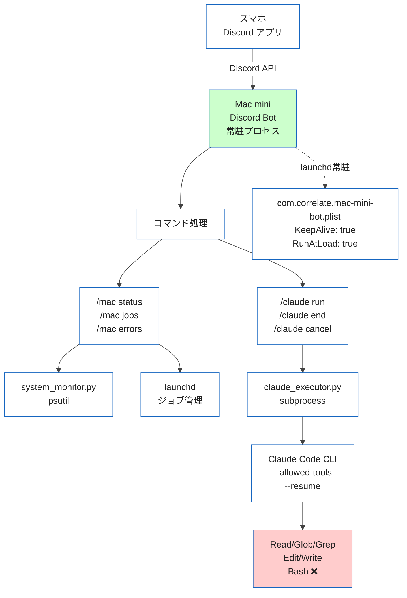
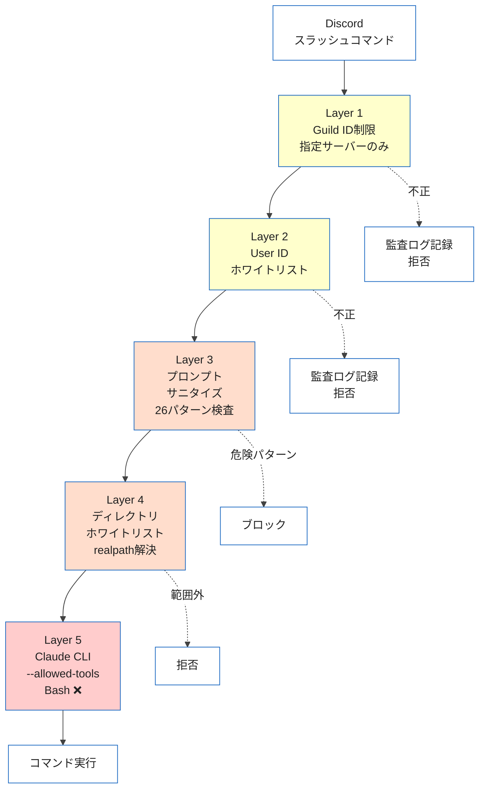

## はじめに — スマホからClaude Codeを使いたい

Mac mini M4 Proを自宅に置いて開発しています。Claude Code（Anthropic公式CLI）を使ったコードリーディングや軽微な修正は日常的な作業ですが、外出先からアクセスする手段が限られていました。

SSH + Tailscaleという王道はありますが、スマホでターミナルを操作するUXは正直厳しいです。小さな画面でvimを開いてClaude Codeにプロンプトを投げる気にはなれません。

「普段使っているDiscordからスラッシュコマンドで操作できたら最高なのでは？」

この発想から、Discord BotでMac miniを遠隔操作する仕組みをPythonで0から自作しました。Clawdbot等の既製ツールもありますが、セキュリティ設計を自分で完全にコントロールしたかったのが自作を選んだ理由です。

この記事では、実装コードと設計判断の「なぜ」を詳しく解説します。

## 完成イメージ

実際にDiscordから操作している様子です。

システム監視（`/mac status`）:
```
Mac mini Status
────────────────
CPU: 3.2% (12 cores)
Memory: 8.1/64.0 GB (12.6%)
Disk: 412/994 GB (41.4%) Free: 581 GB
Uptime: 3d 14h 22m
```

Claude Code対話（`/claude run`）:
1. `/claude run` と入力すると、`prompt`と`directory`の入力欄が表示されるので記入して送信
2. Discordスレッドが自動作成される
3. スレッド内で普通にチャットするだけでClaude Codeとの会話が継続

スマホのDiscordアプリからスラッシュコマンドを打つだけで、自宅のMac miniでClaude Codeが動きます。

## 全体アーキテクチャ



ファイル構成（7ファイル、実効コード約800行）:

```
mac-mini-bot/
├── bot.py               # エントリーポイント（~80行）
├── config.py            # 環境変数の読み込みとバリデーション
├── security.py          # ユーザー認証・プロンプトサニタイズ
├── commands/
│   ├── mac_commands.py  # /mac status, /mac jobs, /mac errors
│   └── claude_commands.py # /claude run + スレッドベース会話
├── services/
│   ├── system_monitor.py # psutilでシステム情報取得
│   └── claude_executor.py # Claude CLI subprocess管理
├── .env                 # シークレット（Git管理外）
└── com.correlate.mac-mini-bot.plist # launchd常駐化設定
```

依存パッケージはたった3つです:

```
discord.py>=2.4  # 2.6.x でも動作確認済み
psutil>=6.0
python-dotenv>=1.0
```

## Step 1: Discord Bot作成と基本設定

### Bot Applicationの作成

[Discord Developer Portal](https://discord.com/developers/applications)で新しいApplicationを作成し、BotセクションでTokenを取得します。

Intentsの設定では MESSAGE CONTENT INTENT を有効にします。スレッド内のチャットメッセージを読むために必要です。

### 環境変数の管理

`.env`ファイルにシークレットを集約します。`.gitignore`に必ず追加してください:

```bash
# .gitignore
.env
.active_threads.json
__pycache__/
```

```env
# .env
DISCORD_TOKEN=your-bot-token-here
GUILD_ID=123456789012345678
ALLOWED_USER_IDS=123456789012345678
ALLOWED_DIRECTORIES=/Users/yourname/dev
MAX_CONCURRENT_JOBS=2
JOB_TIMEOUT=300
```

`config.py`で読み込みとバリデーションを行います:

```python
# config.py（抜粋）
import os
from pathlib import Path
from dotenv import load_dotenv

load_dotenv(Path(__file__).parent / '.env')

DISCORD_TOKEN: str = os.getenv('DISCORD_TOKEN', '')
GUILD_ID: int = _safe_int('GUILD_ID', 0)

# ユーザーIDのホワイトリスト
ALLOWED_USER_IDS: set[int] = set()
_raw_ids = os.getenv('ALLOWED_USER_IDS', '')
for _uid in _raw_ids.split(','):
    _uid = _uid.strip()
    if _uid:
        ALLOWED_USER_IDS.add(int(_uid))

# ディレクトリホワイトリスト（シンボリックリンク解決済み）
ALLOWED_DIRECTORIES: list[str] = [
    s.strip()
    for s in os.getenv('ALLOWED_DIRECTORIES', DEFAULT_WORK_DIR).split(',')
    if s.strip()
]

def validate():
    """起動時に必須項目をチェック。欠落があれば即座にエラー終了。"""
    missing = []
    if not DISCORD_TOKEN:
        missing.append('DISCORD_TOKEN')
    if not GUILD_ID:
        missing.append('GUILD_ID')
    if not ALLOWED_USER_IDS:
        missing.append('ALLOWED_USER_IDS')
    if missing:
        raise RuntimeError(
            f'Missing required environment variables: {", ".join(missing)}'
        )
```

起動時にバリデーションが走るので、設定漏れがあればBotは起動しません。サイレントに動かないことが重要です。

### .envファイルのパーミッションチェック

`.env`にはBot Tokenが含まれるため、パーミッションも検査します:

```python
# config.py validate()内
if _env_path.exists():
    mode = _env_path.stat().st_mode
    if mode & (stat.S_IRGRP | stat.S_IROTH):
        logger.warning(
            f'.env file is readable by group/others (mode={oct(mode)}). '
            f'Run: chmod 600 .env'
        )
```

`chmod 600 .env`を強制するのではなく警告にとどめていますが、ログに残ることで運用時に気づけます。

## Step 2: システム監視コマンド — /mac status

`psutil`でCPU・メモリ・ディスク・uptimeを取得し、Discord Embedで表示します。

```python
# services/system_monitor.py（抜粋）
class SystemMonitor:
    @staticmethod
    async def cpu_memory() -> dict:
        """イベントループをブロックしないCPU/メモリ取得。"""
        return await asyncio.to_thread(SystemMonitor._cpu_memory_sync)

    @staticmethod
    def _cpu_memory_sync() -> dict:
        mem = psutil.virtual_memory()
        return {
            'cpu_percent': psutil.cpu_percent(interval=1),
            'cpu_count': psutil.cpu_count(),
            'memory_total_gb': round(mem.total / (1024 ** 3), 1),
            'memory_used_gb': round(mem.used / (1024 ** 3), 1),
            'memory_percent': mem.percent,
        }
```

ここで重要なのは `asyncio.to_thread()` です。`psutil.cpu_percent(interval=1)` は内部で1秒間ブロックするため、直接呼ぶとDiscord Botのイベントループが止まります。`to_thread`で別スレッドに逃がすことで、他のコマンドの応答性を維持できます。

### launchdジョブ一覧（/mac jobs）

`launchctl list` の出力をパースして、自分のジョブだけをフィルタします:

```python
@staticmethod
def launchd_jobs() -> list[dict]:
    result = subprocess.run(
        ['launchctl', 'list'],
        capture_output=True, text=True, timeout=10
    )
    jobs = []
    for line in result.stdout.strip().split('\n'):
        parts = line.split('\t')
        if len(parts) >= 3 and parts[2].startswith('com.correlate.'):
            jobs.append({
                'pid': parts[0] if parts[0] != '-' else None,
                'status': parts[1],
                'label': parts[2],
            })
    return jobs
```

プレフィックスを`com.correlate.`に限定しているのは、他のシステムジョブを誤って表示しないためです。

## Step 3: Claude Code統合 — /claude run

ここが本記事の核心です。

### 基本的な仕組み

Claude Code CLI（`claude`コマンド）を`subprocess`で実行し、結果をDiscordスレッドに返します。

```python
# services/claude_executor.py（抜粋）
_TOOLS_BY_SAFETY = {
    'readonly': 'Read,Glob,Grep',
    'standard': 'Read,Glob,Grep,Edit,Write',
}

async def run(self, prompt, directory=None, safety='readonly',
              user_id=0, session_id=None) -> Job:
    tools = _TOOLS_BY_SAFETY.get(safety, _TOOLS_BY_SAFETY['readonly'])
    cmd = [
        CLAUDE_CLI_PATH, '-p', prompt,
        '--output-format', 'json',
        '--allowed-tools', tools,
    ]
    if session_id:
        cmd.extend(['--resume', session_id])

    job.process = await asyncio.create_subprocess_exec(
        *cmd,
        stdout=asyncio.subprocess.PIPE,
        stderr=asyncio.subprocess.PIPE,
        cwd=work_dir,
    )
```

ポイントは3つあります。

1つ目は`--allowed-tools`でツールを制限すること。

Claude Code CLIには`--allowed-tools`フラグ（`--allowedTools`でも可）があり、使用可能なツールをカンマ区切りで指定できます。`readonly`モードでは`Read,Glob,Grep`のみを許可し、ファイルの読み取りと検索だけに限定します。`standard`モードでも`Edit,Write`を追加するだけで、Bashツールは常にブロックします。

Discord経由でシェルコマンドが実行可能になるのは、どんなに制限してもリスクが高いためです。

2つ目は`--output-format json`でセッションIDを取得すること。

JSON出力を指定すると、レスポンスに`session_id`が含まれます。これをスレッドに紐づけて保存し、次回のメッセージで`--resume`に渡すことで、会話の文脈を維持します。

```python
# JSON出力のパース
data = json.loads(out_str)
job.output = data.get('result', '')
job.session_id = data.get('session_id', '')
```

3つ目は`asyncio.create_subprocess_exec`で非同期実行すること。

Claude Codeの実行は数秒〜数分かかります。`subprocess.run`で同期的に待つとBotが固まるため、非同期サブプロセスを使います。

### スレッドベースの会話継続

`/claude run`を実行するとDiscordスレッドが作成されます。以降はスレッド内でメッセージを送るだけで、スラッシュコマンドなしに会話が継続します。

```python
# commands/claude_commands.py（抜粋）
@commands.Cog.listener()
async def on_message(self, message: discord.Message):
    # Botのメッセージは無視
    if message.author.bot:
        return
    # アクティブスレッドのメッセージのみ処理
    if message.channel.id not in self._active_threads:
        return
    # Guild IDとユーザーIDを検証
    if not message.guild or message.guild.id != GUILD_ID:
        return
    if message.author.id not in ALLOWED_USER_IDS:
        return

    config = self._active_threads[message.channel.id]
    # 前回のsession_idを使って会話を継続
    await self._run_in_thread(
        message.channel, message.content.strip(),
        config['directory'], config['safety'],
        message.author.id, session_id=config.get('session_id'),
    )
```

スレッドの状態はJSONファイルに永続化しており、Bot再起動後も会話を再開できます:

```python
# .active_threads.json
{
    "1234567890": {
        "directory": "/Users/naoyayokota/dev",
        "safety": "readonly",
        "session_id": "abc123-def456",
        "created_at": 1739234567.89
    }
}
```

### Standard Modeの確認フロー

`safety: standard`（ファイル編集許可）を選択した場合、リアクション確認を挟みます:

```python
if safety_val == 'standard':
    embed = discord.Embed(
        title='Confirm: Standard Mode',
        description=(
            'Standard mode allows **file editing**.\n'
            'Bash is still blocked.\n\n'
            f'React with a checkmark within 30s to confirm.'
        ),
        color=discord.Color.orange(),
    )
    await interaction.response.send_message(embed=embed)
    confirm_msg = await interaction.original_response()
    await confirm_msg.add_reaction('✅')
    await self.bot.wait_for('reaction_add', timeout=30.0, check=check)
```

30秒以内にチェックマークリアクションがなければキャンセルされます。うっかりStandardモードで危険なプロンプトを送るのを防ぐガードレールです。

## Step 4: セキュリティ多層防御

「自宅のマシンをインターネット経由で操作する」以上、セキュリティは最も重要な設計ポイントです。5層の防御を実装しています。




### Layer 1 & 2: 誰が操作できるか

```python
# security.py
def is_authorized(interaction: discord.Interaction) -> bool:
    if interaction.guild_id != GUILD_ID:
        return False
    return interaction.user.id in ALLOWED_USER_IDS
```

Guild IDで「どのサーバーからのコマンドか」を制限し、User IDで「誰が実行しているか」を制限します。Botを他のサーバーに招待されても、コマンドはGuild IDが一致するサーバーでしか動きません。

不正なアクセスは監査ログに記録されます:

```python
logger.warning(
    f'Unauthorized access attempt: '
    f'user={interaction.user} (ID:{interaction.user.id}) '
    f'guild={interaction.guild_id}'
)
```

### Layer 3: 何を実行させるか

プロンプトに含まれる危険なパターンを正規表現でブロックします:

```python
# security.py（抜粋 — 全26パターンのうち代表例）
_BLOCKED_PATTERNS = [
    # ファイル削除系（5パターン: rm -rf, find -delete, find -exec rm 等）
    re.compile(r'\brm\s+(-\w+\s+)*-?r\w*f', re.IGNORECASE),
    # 特権昇格系（3パターン: sudo, su -c, doas）
    re.compile(r'\bsudo\b', re.IGNORECASE),
    # Git破壊系（3パターン: push --force, reset --hard, clean -f）
    re.compile(r'\bgit\s+push\s+(-\w+\s+)*--force\b', re.IGNORECASE),
    # パイプ経由のシェル実行（2パターン: curl|bash, wget|bash）
    re.compile(r'\bcurl\b.*\|\s*(bash|sh|zsh)\b', re.IGNORECASE),
    # ディスク操作系（3パターン: mkfs, dd if=, > /dev/sd*）
    # パーミッション濫用系（2パターン: chmod 777, chmod -R）
    # Pythonエスケープ系（3パターン: python -c os.system 等）
    # ネットワーク系（2パターン: nc -l, ssh -R）
    # Fork bomb（1パターン）
    re.compile(r':\(\)\s*\{.*:\|:.*\};', re.IGNORECASE),
    # ... 計26パターン（完全版はGitHubリポジトリを参照）
]
```

これは主防御ではありません。Layer 5のClaude CLI `--allowed-tools`が主防御であり、このレイヤーは防御を深くするためのものです（defense in depth）。「`rm -rf`を実行して」というプロンプトが来ても、そもそもClaude CLIにBashツールが許可されていないので実行不可能です。しかし、そのようなプロンプトがCLIに到達する前にブロックする方が安全です。

### Layer 4: どこで操作するか

```python
# config.py
def is_allowed_directory(path: str) -> bool:
    """シンボリックリンクを解決してからホワイトリストと照合。"""
    try:
        real = os.path.realpath(os.path.expanduser(path))
    except (ValueError, OSError):
        return False
    for allowed in ALLOWED_DIRECTORIES:
        allowed_real = os.path.realpath(os.path.expanduser(allowed))
        if real == allowed_real or real.startswith(allowed_real + os.sep):
            return False if not os.path.isdir(real) else True
    return False
```

`os.path.realpath()`でシンボリックリンクを解決してからホワイトリストと照合します。`~/dev`をホワイトリストに入れたつもりが、シンボリックリンク経由で`/etc`にアクセスされるような攻撃を防ぎます。

### Layer 5: 何のツールを使わせるか

```python
_TOOLS_BY_SAFETY = {
    'readonly': 'Read,Glob,Grep',
    'standard': 'Read,Glob,Grep,Edit,Write',
}
```

BashツールはどのSafetyレベルでも許可しません。これが最も重要な判断です。Bashが使えると`os.system`呼び出しやパイプ経由での任意コマンド実行が理論的に可能になります。Claude Codeにおいてもファイル操作は`Edit`/`Write`ツールで十分で、Bashが必要になるケースはSSHで直接接続すれば対応できます。

## Step 5: launchd常駐化

macOSでプロセスを常駐させるにはlaunchdを使います。`systemd`（Linux）の代わりにあたるものです。

### plistファイル

以下の`/path/to/`はご自身の環境に合わせて書き換えてください:

```xml
<?xml version="1.0" encoding="UTF-8"?>
<!DOCTYPE plist PUBLIC "-//Apple//DTD PLIST 1.0//EN"
 "http://www.apple.com/DTDs/PropertyList-1.0.dtd">
<plist version="1.0">
<dict>
    <key>Label</key>
    <string>com.correlate.mac-mini-bot</string>
    <key>ProgramArguments</key>
    <array>
        <string>/path/to/mac-mini-bot/.venv/bin/python3</string>
        <string>/path/to/mac-mini-bot/bot.py</string>
    </array>
    <key>WorkingDirectory</key>
    <string>/path/to/mac-mini-bot</string>
    <key>KeepAlive</key>
    <true/>
    <key>RunAtLoad</key>
    <true/>
    <key>StandardOutPath</key>
    <string>/path/to/logs/mac-mini-bot.log</string>
    <key>StandardErrorPath</key>
    <string>/path/to/logs/mac-mini-bot-error.log</string>
    <key>EnvironmentVariables</key>
    <dict>
        <key>PATH</key>
        <string>/path/to/.venv/bin:/opt/homebrew/bin:/usr/local/bin:/usr/bin:/bin</string>
    </dict>
    <key>ThrottleInterval</key>
    <integer>30</integer>
</dict>
</plist>
```

設計ポイントを解説します:

- `KeepAlive: true` -- プロセスが終了したら自動で再起動します。Mac miniの再起動後も自動で復帰します
- `RunAtLoad: true` -- plistをロードした時点で即座に起動します
- `ThrottleInterval: 30` -- 前回の起動から30秒以内の再起動を抑制します。これにより異常終了時のクラッシュループを防ぎます
- `ProgramArguments`にvenv内のPython -- システムのPythonではなくvenvを直接指定します。`source activate`は不要で、venv内のpython3パスを直接書けばOKです
- `EnvironmentVariables`でPATH指定 -- `claude`コマンドのパスを解決するために必要です。launchdはシェルのPATHを引き継がないため、明示的に設定します

### 操作コマンド

```bash
# 登録（初回）
launchctl load ~/Library/LaunchAgents/com.correlate.mac-mini-bot.plist

# 停止
launchctl unload ~/Library/LaunchAgents/com.correlate.mac-mini-bot.plist

# 状態確認
launchctl list | grep com.correlate

# ログ確認
tail -f ~/dev/logs/mac-mini-bot.log
```

### ログローテーション

launchdの`StandardOutPath`はファイルにリダイレクトされますが、ローテーション機能がありません。アプリケーション側で`RotatingFileHandler`を使います:

```python
# bot.py
import logging.handlers
from pathlib import Path
from config import LOG_DIR

log_dir = Path(LOG_DIR)
log_dir.mkdir(parents=True, exist_ok=True)  # ディレクトリ自動作成

logging.basicConfig(
    level=logging.INFO,
    format='%(asctime)s [%(levelname)s] %(name)s: %(message)s',
    handlers=[
        logging.StreamHandler(sys.stdout),
        logging.handlers.RotatingFileHandler(
            log_dir / 'mac-mini-bot-app.log',
            maxBytes=10_000_000,  # 10MB
            backupCount=5,
        ),
    ],
)
```

`StandardOutPath`には起動ログやPython自体のエラーが出力され、`RotatingFileHandler`にはアプリケーションログが出力される二重構成です。

## SSH/Tailscale/Clawdbotとの比較

| 手段 | スマホUX | セットアップ | セキュリティ制御 | AI統合 | コスト |
|:--|:--|:--|:--|:--|:--|
| **Discord Bot（本記事）** | 最高 | 中 | 完全に自分で制御 | Claude Code CLI | 無料 |
| SSH + Tailscale | 中（Termius等） | 低 | 公開鍵認証 | なし | 無料 |
| Clawdbot/OpenClaw | 高 | 中〜高 | OSSだが複雑 | Multi-model | 無料 |
| TeamViewer | 高 | 低 | パスワード/2FA | なし | 無料 |

Discord Botの最大の強みはスマホUXです。すでに日常使いしているDiscordアプリから、スラッシュコマンドのサジェスト付きで操作できます。新しいアプリをインストールする必要がありません。

一方、Clawdbot（現OpenClaw）は50以上のプラットフォームと連携する多機能ツールで、「とにかく高機能なAI執事が欲しい」場合に最適です。本記事のBotは約800行のミニマルな実装ですが、セキュリティの全レイヤーを自分で把握・制御できることが強みです。

## 運用で学んだこと

### Discordの3秒タイムアウト

Discordのインタラクションは3秒以内にレスポンスを返す必要があります。Claude Codeの実行は数秒〜数分かかるため、`interaction.response.defer()`を最初に呼んで「処理中」であることをDiscordに伝えます。

```python
# defer()はコマンドハンドラの最初に呼ぶ
await interaction.response.defer()
# ↑ これより前にバリデーション等の処理を入れると
# 3秒を超えて「Unknown interaction」エラーが出る
```

これは実際にハマったポイントです。バリデーション処理をdefer()の前に置いていたところ、プロンプトが長い場合に3秒を超えて`Unknown interaction`エラーが頻発しました。defer()は必ず最初に呼ぶのが鉄則です。バリデーションエラーは`followup.send()`で後から返します。

### Bot Tokenの多重接続問題

テスト時に同じBot Tokenで2つのプロセスを起動すると、Discord GatewayがWebSocket接続を競合させ、片方が切断されます。テストはREST API直叩き（aiohttp等）で行い、Bot本体のGateway接続を邪魔しないようにします。

テスト後は`ps aux | grep bot.py`でゾンビプロセスがないか確認します。複数プロセスが同じTokenで接続していると、Discordはインタラクションを古いプロセスに配信することがあり、「新しいコードを反映したはずなのに動かない」という症状になります。

### 長い出力のファイル添付

Discordメッセージは2000文字制限があります。Claude Codeの出力がこれを超える場合、テキストファイルとして添付します:

```python
if len(output) <= 1900:
    await thread.send(output)
else:
    file = discord.File(
        io.BytesIO(output.encode('utf-8')),
        filename=f'claude-{job.id}.txt',
    )
    preview = truncate_output(output, 500)
    await thread.send(preview, file=file)
```

先頭500文字をプレビュー表示し、全文はファイルで確認できるようにしています。

## まとめ

Mac miniにDiscord Botを常駐させることで、スマホからClaude Codeを使った開発作業が可能になりました。

自作した理由は、Clawdbotのような既製ツールは便利ですが、自宅マシンを外部から操作する以上、セキュリティ設計を自分で完全にコントロールしたかったからです。全5層の防御をコード付きで理解しているからこそ、安心して常駐運用できています。

この記事から学べるのは、discord.py、asyncio、subprocessの非同期管理、launchd運用、そしてClaude Code CLIの`--allowed-tools`による安全なAI実行制御です。約800行のPythonで、実用的なリモート開発環境が手に入ります。

ソースコードは今後GitHubで公開予定です。

---

## 参考資料

https://discordpy.readthedocs.io/en/stable/

https://docs.anthropic.com/en/docs/claude-code/cli-reference

https://developer.apple.com/library/archive/documentation/MacOSX/Conceptual/BPSystemStartup/Chapters/CreatingLaunchdJobs.html

https://psutil.readthedocs.io/

https://vibecord.dev/blog/discord-bot-token-security-guide

https://zenn.dev/mizchi/articles/discord-claude-code-interface

https://clawd.bot/
