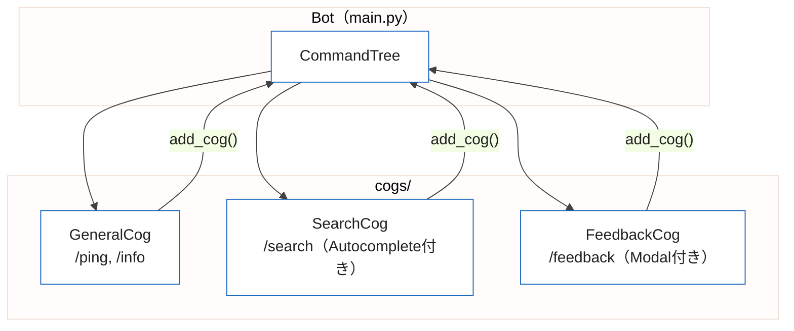

## はじめに

Discordのスラッシュコマンドは、2021年にDiscordが推奨するBotインタフェースとして導入されました。コマンドの入力補完・引数の型チェック・ヘルプ表示の自動生成など、従来のプレフィックスコマンドに比べてユーザー体験が大幅に向上しています。

本記事では discord.py v2.x の `app_commands` モジュールを使い、WebSocket型（Gateway）のBotでスラッシュコマンドを実装する方法を解説します。Cogによるコマンド分割設計・Autocomplete・Modal・Embedまでを一通りカバーし、Cloud Runでの運用ポイントも合わせて紹介します。

なお、Cloud RunのゼロスケールとHTTP Interaction型（discord-interactionsライブラリ）を使った低コストBot構成については、別記事「Discord Bot × Cloud Run ─ スラッシュコマンドとAI連携を含む本番デプロイガイド」で詳しく解説しています。本記事はdiscord.pyのWebSocket型アーキテクチャに特化した内容です。

---

## 1. 基本セットアップ

### インストール

Python 3.10以降と discord.py v2.x が必要です。

```bash
pip install "discord.py>=2.3.0"
```

`requirements.txt`:

```
discord.py>=2.3.0
python-dotenv>=1.0.0
```

### 最小構成のBot

discord.py v2.xでスラッシュコマンドを使う最小構成は以下のとおりです。

```python
import os
import discord
from discord import app_commands
from dotenv import load_dotenv

load_dotenv()

intents = discord.Intents.default()
client = discord.Client(intents=intents)
tree = app_commands.CommandTree(client)


@tree.command(name="ping", description="Botの応答確認")
async def ping(interaction: discord.Interaction):
    await interaction.response.send_message("Pong!")


@client.event
async def on_ready():
    # ギルドコマンドとして同期（即座に反映）
    guild = discord.Object(id=int(os.environ["DISCORD_GUILD_ID"]))
    tree.copy_global_to(guild=guild)
    await tree.sync(guild=guild)
    print(f"Bot起動: {client.user}")


client.run(os.environ["DISCORD_BOT_TOKEN"])
```

`app_commands.CommandTree` がスラッシュコマンドを管理するクラスです。`@tree.command` デコレータで関数をコマンドとして登録し、`tree.sync()` でDiscordに登録内容を送信します。

---

## 2. コマンド登録の仕組み（グローバル vs ギルド）

スラッシュコマンドには「グローバルコマンド」と「ギルドコマンド」の2種類があります。

| 項目 | グローバルコマンド | ギルドコマンド |
|:--|:--|:--|
| 対象 | 全サーバー | 特定サーバーのみ |
| 反映時間 | 最大1時間 | ほぼ即座（数秒〜1分） |
| 登録方法 | `tree.sync()` | `tree.sync(guild=guild)` |
| 用途 | 本番運用 | 開発・テスト |

開発中はギルドコマンドを使い、リリース時にグローバルコマンドへ移行するのが一般的なワークフローです。

```python
# ギルドコマンドの同期（開発用）
guild = discord.Object(id=int(os.environ["DISCORD_GUILD_ID"]))
await tree.sync(guild=guild)

# グローバルコマンドの同期（本番用）
await tree.sync()
```

グローバルコマンドへ移行する際は、ギルドコマンドを先に削除しないと同じコマンドが二重に表示されます。`tree.clear_commands(guild=guild)` で削除してから `tree.sync(guild=guild)` を呼び出してください。

---

## 3. Cogによるコマンド分割設計

コマンドが増えると `main.py` が肥大化します。discord.py の `Cog` を使うと、コマンドをテーマ別のクラスに分割できます。



プロジェクト構成:

```
bot/
├── main.py
├── cogs/
│   ├── __init__.py
│   ├── general.py
│   ├── search.py
│   └── feedback.py
├── Dockerfile
└── requirements.txt
```

### Cogクラスの実装

`cogs/general.py`:

```python
import discord
from discord import app_commands
from discord.ext import commands


class GeneralCog(commands.Cog):
    def __init__(self, bot: commands.Bot):
        self.bot = bot

    @app_commands.command(name="ping", description="Botの応答確認")
    async def ping(self, interaction: discord.Interaction):
        latency_ms = round(self.bot.latency * 1000)
        await interaction.response.send_message(
            f"Pong! レイテンシ: {latency_ms}ms"
        )

    @app_commands.command(name="info", description="Botの情報を表示")
    async def info(self, interaction: discord.Interaction):
        embed = discord.Embed(
            title="Bot 情報",
            color=discord.Color.blue(),
        )
        embed.add_field(name="Discordライブラリ", value="discord.py v2.x")
        embed.add_field(name="実行環境", value="Google Cloud Run")
        await interaction.response.send_message(embed=embed)


async def setup(bot: commands.Bot):
    await bot.add_cog(GeneralCog(bot))
```

### main.pyでCogを読み込む

```python
import os
import asyncio
import discord
from discord.ext import commands
from dotenv import load_dotenv

load_dotenv()

intents = discord.Intents.default()
bot = commands.Bot(command_prefix="!", intents=intents)


@bot.event
async def on_ready():
    guild = discord.Object(id=int(os.environ["DISCORD_GUILD_ID"]))
    bot.tree.copy_global_to(guild=guild)
    await bot.tree.sync(guild=guild)
    print(f"Bot起動: {bot.user}")


async def main():
    async with bot:
        # Cogを順番にロード
        await bot.load_extension("cogs.general")
        await bot.load_extension("cogs.search")
        await bot.load_extension("cogs.feedback")
        await bot.start(os.environ["DISCORD_BOT_TOKEN"])


asyncio.run(main())
```

`load_extension` はCogファイルのパスを `"cogs.general"` のようにドット区切りで指定します。Cogのロードが完了してから `bot.start()` を呼ぶため、`async with bot:` ブロックを使った非同期コンテキストマネージャの形式が推奨です。

---

## 4. オートコンプリートの実装

`@app_commands.autocomplete` を使うと、コマンド入力中に候補を表示できます。

`cogs/search.py`:

```python
import discord
from discord import app_commands
from discord.ext import commands

# 候補データ（実際の運用ではDBや外部APIから取得）
LANGUAGES = [
    "Python", "TypeScript", "Go", "Rust", "Java",
    "Kotlin", "Swift", "Ruby", "PHP", "C#",
]


class SearchCog(commands.Cog):
    def __init__(self, bot: commands.Bot):
        self.bot = bot

    async def language_autocomplete(
        self,
        interaction: discord.Interaction,
        current: str,
    ) -> list[app_commands.Choice[str]]:
        """
        入力中のテキストに前方一致する言語候補を返す。
        最大25件まで返せる（Discord制限）。
        """
        return [
            app_commands.Choice(name=lang, value=lang)
            for lang in LANGUAGES
            if current.lower() in lang.lower()
        ][:25]

    @app_commands.command(name="search", description="プログラミング言語を検索")
    @app_commands.autocomplete(language=language_autocomplete)
    async def search(
        self,
        interaction: discord.Interaction,
        language: str,
    ):
        await interaction.response.send_message(
            f"{language} を検索します..."
        )


async def setup(bot: commands.Bot):
    await bot.add_cog(SearchCog(bot))
```

オートコンプリート関数は `interaction` と `current`（入力中の文字列）を受け取り、`app_commands.Choice` のリストを返します。返せる候補は最大25件です。

動的なデータソース（DBや外部API）から候補を取得する場合は、非同期関数として実装できます。

```python
async def tag_autocomplete(
    self,
    interaction: discord.Interaction,
    current: str,
) -> list[app_commands.Choice[str]]:
    # 非同期DBクエリも使用可能
    tags = await fetch_tags_from_db(current)
    return [
        app_commands.Choice(name=tag, value=tag)
        for tag in tags
    ][:25]
```

---

## 5. モーダルとフォーム入力

`discord.ui.Modal` を使うと、複数フィールドを持つフォームをDiscord上に表示できます。フォームの送信内容はコールバックで受け取ります。

`cogs/feedback.py`:

```python
import discord
from discord import app_commands
from discord.ext import commands


class FeedbackModal(discord.ui.Modal, title="フィードバック送信"):
    # TextInputウィジェットをクラス変数として定義
    subject = discord.ui.TextInput(
        label="件名",
        placeholder="フィードバックの件名を入力してください",
        max_length=100,
    )
    body = discord.ui.TextInput(
        label="内容",
        style=discord.TextStyle.paragraph,
        placeholder="詳細な内容を入力してください",
        max_length=1000,
        required=True,
    )

    async def on_submit(self, interaction: discord.Interaction):
        """フォーム送信時のコールバック"""
        embed = discord.Embed(
            title="フィードバックを受け付けました",
            color=discord.Color.green(),
        )
        embed.add_field(name="件名", value=self.subject.value, inline=False)
        embed.add_field(name="内容", value=self.body.value, inline=False)
        embed.set_footer(text=f"送信者: {interaction.user.display_name}")

        # ephemeral=True で送信者にのみ見えるメッセージとして返す
        await interaction.response.send_message(embed=embed, ephemeral=True)

    async def on_error(
        self,
        interaction: discord.Interaction,
        error: Exception,
    ):
        await interaction.response.send_message(
            "エラーが発生しました。", ephemeral=True
        )


class FeedbackCog(commands.Cog):
    def __init__(self, bot: commands.Bot):
        self.bot = bot

    @app_commands.command(name="feedback", description="フィードバックを送信")
    async def feedback(self, interaction: discord.Interaction):
        """モーダルを表示するコマンド"""
        modal = FeedbackModal()
        await interaction.response.send_modal(modal)


async def setup(bot: commands.Bot):
    await bot.add_cog(FeedbackCog(bot))
```

モーダルの `TextInput` は最大5個まで定義できます。`style=discord.TextStyle.paragraph` で複数行入力に切り替えられます。

`ephemeral=True` を指定すると、コマンド実行者にのみ見える「エフェメラルメッセージ」として送信されます。フォーム確認や内部情報の表示に活用できます。

---

## 6. Embedでのリッチ応答

`discord.Embed` を使うと、タイトル・説明・フィールド・フッター・画像などを含むリッチなカード形式のメッセージを送信できます。

```python
@app_commands.command(name="profile", description="ユーザープロフィールを表示")
async def profile(self, interaction: discord.Interaction):
    user = interaction.user

    embed = discord.Embed(
        title=user.display_name,
        description="サーバーメンバー情報",
        color=discord.Color.from_rgb(88, 101, 242),  # Discord Blurple
    )

    # アバター画像をサムネイルとして設定
    if user.avatar:
        embed.set_thumbnail(url=user.avatar.url)

    # フィールドの追加（inline=True で横並び表示）
    embed.add_field(
        name="アカウント作成日",
        value=user.created_at.strftime("%Y-%m-%d"),
        inline=True,
    )
    embed.add_field(
        name="サーバー参加日",
        value=interaction.guild.get_member(user.id).joined_at.strftime("%Y-%m-%d")
        if interaction.guild
        else "不明",
        inline=True,
    )

    embed.set_footer(text=f"User ID: {user.id}")

    await interaction.response.send_message(embed=embed)
```

Embedの主要プロパティをまとめます。

| プロパティ | 説明 | 文字数制限 |
|:--|:--|:--|
| `title` | タイトル | 256文字 |
| `description` | 説明文 | 4096文字 |
| `add_field(name, value)` | フィールド追加（最大25個） | name:256 / value:1024 |
| `set_footer(text)` | フッターテキスト | 2048文字 |
| `set_thumbnail(url)` | サムネイル画像URL | - |
| `set_image(url)` | メイン画像URL | - |

1つのメッセージに複数のEmbedを含めることもできます。

```python
embeds = [embed1, embed2, embed3]  # 最大10個
await interaction.response.send_message(embeds=embeds)
```

---

## 7. Cloud Runデプロイ時の注意点

discord.py のWebSocket型BotをCloud Runで運用する際には、いくつかの注意点があります。

### 最小インスタンス数の設定

WebSocket型BotはDiscordサーバーとの常時接続を維持するため、コンテナが停止するとBotがオフラインになります。Cloud Runのゼロスケール（最小インスタンス0）は使えません。

```bash
gcloud run services update discord-bot \
  --min-instances 1 \
  --region asia-northeast1
```

最小インスタンス1の維持費は月額約8〜10ドルです。コスト重視の場合は、HTTP Interaction型のアーキテクチャへの移行を検討してください。

### Dockerfile

```dockerfile
FROM python:3.12-slim

WORKDIR /app

COPY requirements.txt .
RUN pip install --no-cache-dir -r requirements.txt

COPY . .

RUN useradd -m appuser && chown -R appuser /app
USER appuser

CMD ["python", "main.py"]
```

WebSocket型のBotはHTTPサーバーを起動しないため、`CMD` は `python main.py` のみで問題ありません。ただし、Cloud Runはヘルスチェックにポートへのアクセスを使うため、別途ヘルスチェック用のHTTPサーバーをスレッドで起動する構成も一般的です。

```python
import threading
from http.server import HTTPServer, BaseHTTPRequestHandler


class HealthHandler(BaseHTTPRequestHandler):
    def do_GET(self):
        self.send_response(200)
        self.end_headers()
        self.wfile.write(b"OK")

    def log_message(self, format, *args):
        pass  # アクセスログを抑制


def run_health_server():
    port = int(os.environ.get("PORT", 8080))
    server = HTTPServer(("0.0.0.0", port), HealthHandler)
    server.serve_forever()


# ヘルスチェックサーバーをバックグラウンドで起動
threading.Thread(target=run_health_server, daemon=True).start()
```

### シークレット管理

Bot TokenやGuild IDはSecret Managerで管理します。

```bash
export PROJECT_ID=YOUR_GCP_PROJECT_ID

# Bot Tokenをシークレットとして保存
echo -n "YOUR_BOT_TOKEN" | \
  gcloud secrets create discord-bot-token \
    --data-file=- \
    --project="${PROJECT_ID}"

# Guild IDをシークレットとして保存
echo -n "YOUR_GUILD_ID" | \
  gcloud secrets create discord-guild-id \
    --data-file=- \
    --project="${PROJECT_ID}"
```

```bash
gcloud run deploy discord-bot \
  --source . \
  --region asia-northeast1 \
  --project "${PROJECT_ID}" \
  --min-instances 1 \
  --update-secrets="DISCORD_BOT_TOKEN=discord-bot-token:latest,DISCORD_GUILD_ID=discord-guild-id:latest"
```

### on_ready でのコマンド同期タイミング

`on_ready` はBot起動時に1回呼ばれますが、再接続（disconnect → reconnect）でも再び呼ばれる仕様です。コマンド同期のAPIコールが頻繁に発生しないよう、フラグで制御するのが安全です。

```python
synced = False


@bot.event
async def on_ready():
    global synced
    if not synced:
        guild = discord.Object(id=int(os.environ["DISCORD_GUILD_ID"]))
        bot.tree.copy_global_to(guild=guild)
        await bot.tree.sync(guild=guild)
        synced = True
        print(f"コマンド同期完了: {bot.user}")
```

---

## まとめ

discord.py v2.x を使ったスラッシュコマンド実装の要点をまとめます。

| トピック | ポイント |
|:--|:--|
| CommandTree | `app_commands.CommandTree` でコマンドを管理し `tree.sync()` でDiscordに登録 |
| 登録方式 | 開発中はギルドコマンド（即時反映）、本番はグローバルコマンド |
| Cog設計 | テーマ別にクラスを分割し `bot.load_extension()` でロード |
| Autocomplete | `@app_commands.autocomplete` で候補を最大25件返す |
| Modal | `discord.ui.Modal` でフォーム入力を実装、`on_submit` で受け取る |
| Embed | `discord.Embed` でリッチなカード形式のメッセージを構築 |
| Cloud Run | WebSocket型はmin-instances=1が必要、ヘルスチェック用HTTPサーバーを別スレッドで起動 |

Cogによるコマンド分割を最初から設計しておくことで、コマンド追加時の変更箇所が明確になり、メンテナンスしやすいBot実装が実現できます。Cloud Runとの組み合わせで、コンテナ管理・シークレット管理・デプロイの一貫したワークフローを確立してください。
