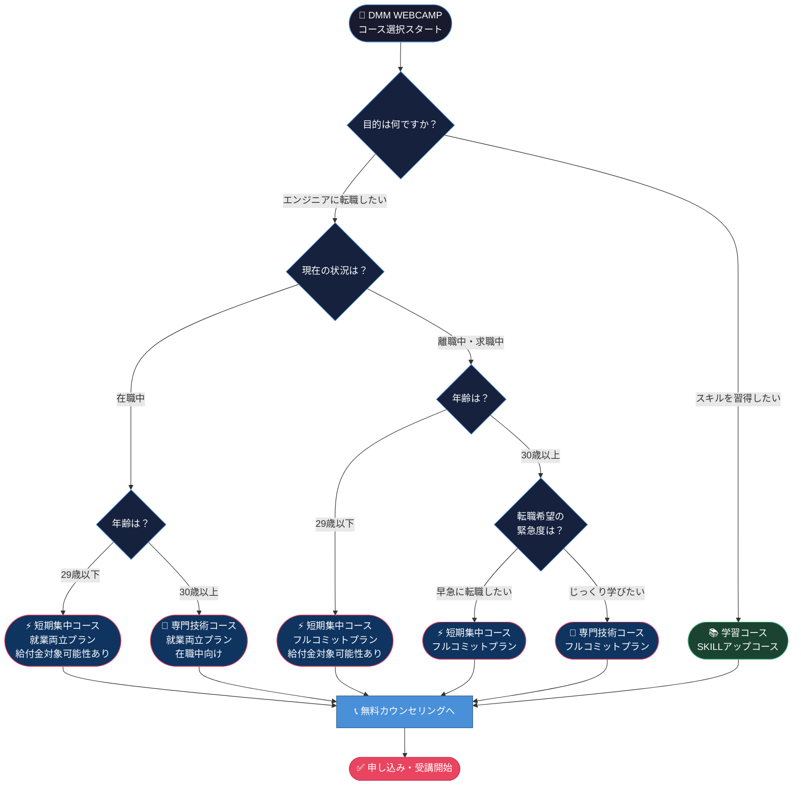

> **記事情報**: 本記事の情報は2025年6月時点のものです。最新情報は公式サイトをご確認ください。

未経験からエンジニアへの転職を目指している方にとって、プログラミングスクール選びは非常に重要な決断です。数あるスクールの中でも、**DMM WEBCAMP**は転職成功率98.8%・入社6ヶ月以内の離職率1.4%という業界トップクラスの実績を誇り、多くの転職希望者から注目を集めています。

本記事では、DMM WEBCAMPの料金・コース体系・カリキュラム・口コミ・他スクールとの比較まで、2025年6月時点の最新情報を徹底的に解説します。無料カウンセリングを申し込む前にぜひご一読ください。

---

## DMM WEBCAMPとは？基本情報

DMM WEBCAMPは、株式会社インフラトップ（DMM.comグループ）が運営するプログラミングスクールです。2018年のサービス開始以来、これまでに**3,000名以上のITエンジニアを輩出**してきた実績があります（2025年6月時点）。

### 基本データ

| 項目 | 詳細 |
|------|------|
| **運営会社** | 株式会社インフラトップ（DMM.comグループ） |
| **サービス開始** | 2018年 |
| **受講形態** | オンライン完結型（全国どこからでも受講可能） |
| **口コミスコア** | 4.13/5.0点（2025年6月時点） |
| **転職成功率** | 98.8% |
| **入社6ヶ月以内の離職率** | 1.4%（業界トップクラス） |
| **学習継続率** | 97% |
| **メンタリング満足度** | 95.11% |

※上記数値はすべて2025年6月時点の公式発表に基づきます。最新情報は公式サイトをご確認ください。

受講形態はオンライン完結型が主流で、東京・大阪に教室が存在するものの、全国どこからでも受講できる環境が整っています。

---

## コース体系と料金

※料金は2025年6月時点の情報です。最新情報は公式サイトをご確認ください。

DMM WEBCAMPのコースは大きく「エンジニア転職コース」と「学習コース（旧SKILLS）」の2種類に分かれています。目的や状況に合わせて最適なコースを選べる体系になっています。

### エンジニア転職コース

エンジニアへの転職を目的としたメインコースです。3つのプランが用意されており、ライフスタイルに合わせて選択できます。

#### 短期集中コース

- **受講期間**：3ヶ月
- **料金**：690,800円（税込）
- **学習時間**：週40〜50時間（フルタイム学習）
- **転職保証**：あり（29歳以下限定）※転職保証の適用条件・保証内容（返金・再受講等）の詳細は公式サイトまたは無料カウンセリングにてご確認ください
- **対象者**：3ヶ月間、集中して学習に取り組める方

最も短期間でエンジニア転職を目指せるコースです。週40〜50時間という学習時間が必要なため、仕事を辞めて集中できる環境が求められます。29歳以下の方には転職保証が付帯しています。

#### 専門技術コース

- **受講期間**：4ヶ月
- **料金**：910,800円（税込）
- **給付金適用後の実質負担額**：273,240円（最大70%OFF）
- **学習時間**：週40〜50時間
- **転職保証**：なし（キャリアサポートは付帯）
- **学習内容**：基礎 ＋ AI or クラウド（AWS）
- **対象者**：AI・クラウド技術を学びたい方

専門実践教育訓練給付金の対象コースで、条件を満たせば受講料の最大70%が還付されます。AIや機械学習、クラウド（AWS）といった専門技術を上乗せして学べるのが特徴です。

#### 就業両立コース

- **受講期間**：6ヶ月
- **料金**：889,350円（税込）
- **給付金適用後の実質負担額**：267,805円（最大70%OFF）
- **学習時間**：週20〜25時間
- **転職保証**：なし（キャリアサポートは付帯）
- **対象者**：働きながら学習したい方

現在の仕事を続けながらエンジニア転職を目指せるコースです。週20〜25時間の学習時間が目安で、短期集中コースと比べると学習ペースが緩やかになっています。こちらも専門実践教育訓練給付金の対象です。

---

### 学習コース（旧SKILLS）

転職を即目的としない方や、特定のスキルを身につけたい方向けのコースです。4週間から選べる柔軟な受講期間が特徴です。

以下の各コースは、学習内容・対象スキルレベル・受講期間・料金を一覧で比較できます。

| コース名 | 主な学習内容 | 対象レベル | 受講期間 | 料金（税込） |
|---------|------------|----------|---------|------------|
| Webアプリケーション開発 | HTML/CSS、Ruby/Rails、Git/GitHub | 初〜中級 | 4〜16週間 | 169,800円〜334,800円 |
| はじめてのプログラミング | プログラミング基礎 | 完全初学者 | 4週間〜 | 169,800円〜 |
| 生成AIアプリケーション開発（2024年新設） | ChatGPT API、生成AI活用 | 初〜中級 | 4週間〜 | 169,800円〜 |
| Webデザイン | Photoshop、Illustrator、XD、HTML/CSS | 初〜中級 | 4週間〜 | 169,800円〜 |
| 動画クリエイター | Premiere Pro、After Effects | 初〜中級 | 4週間〜 | 169,800円〜 |
| Python | Python基礎、データ分析 | 初〜中級 | 4週間〜 | 169,800円〜 |
| Java | Java基礎、Spring Boot | 初〜中級 | 4週間〜 | 169,800円〜 |
| PHP/Laravel | PHP、Laravel | 初〜中級 | 4週間〜 | 169,800円〜 |

※Webアプリケーション開発コースの料金詳細：4週間 169,800円／8週間 224,800円／12週間 279,800円／16週間 334,800円

---

### 支払い方法

- 一括払い
- 分割払い（3回・6回・12回）
- 24回分割（Webデザインコース、副業・フリーランスコースのみ）

---

## 教育訓練給付金制度を活用すると最大70%OFF

DMM WEBCAMPを受講するうえで、ぜひ活用したいのが**教育訓練給付金制度**です。条件を満たせば受講料の最大70%が国から還付されるため、実質負担額を大幅に抑えることができます。

### 給付金対象コース

- **専門技術コース**（専門実践教育訓練給付金）
- **就業両立コース**（専門実践教育訓練給付金）

### 給付金の内訳

| 給付の種類 | 給付率 | 条件 |
|-----------|--------|------|
| 基本給付 | 受講料の50% | 受講修了後に申請 |
| 追加給付① | +20% | 受講修了かつ修了日の翌日から1年以内に雇用保険の被保険者として雇用された場合 |
| **合計** | **最大70%** | 上記条件をすべて満たした場合 |

※給付金制度の詳細・最新情報は[厚生労働省の公式ページ](https://www.mhlw.go.jp/)またはお近くのハローワークにてご確認ください。制度内容は変更される場合があります。

### 給付金受給の主な条件

- 受講開始前に通算2年以上、雇用保険に加入していること
- 初回受給の場合は1年以上の雇用保険加入でOK
- 詳細な条件はハローワークへの確認が必要です

### 給付金適用後の実質負担額

| コース | 通常料金 | 給付金適用後（70%OFF） |
|--------|---------|----------------------|
| 専門技術コース | 910,800円 | **273,240円** |
| 就業両立コース | 889,350円 | **267,805円** |

給付金を活用することで、実質27万円前後での受講が可能になります。給付金の手続きについてもDMM WEBCAMPがサポートしてくれるため、初めての方でも安心して手続きを進められます。

---

## カリキュラム・学習内容

### メイン学習言語と技術スタック

エンジニア転職コースでは、**Ruby / Ruby on Rails**をメインに以下の技術を学習します。

- HTML/CSS
- Ruby / Ruby on Rails
- JavaScript
- Git/GitHub
- MySQL
- AWS

※使用する技術スタックはカリキュラムの改訂により変更される場合があります。最新情報は公式サイトをご確認ください。

### 学習の流れ（エンジニア転職コース・3ヶ月の場合）

#### 1ヶ月目：基礎学習

プログラミングの基礎をゼロから習得します。

- HTML/CSS
- Ruby
- Rails基礎
- Git/GitHub

コーディングの基礎から始まり、Webアプリケーション開発の土台となる知識を積み上げていきます。

#### 2ヶ月目：チーム開発

**DMM WEBCAMPの特徴的なカリキュラム**とも言えるのが、この「チーム開発」です。実際の開発現場を想定した実践的な学習を体験できます。

- デザイナー、ディレクター、エンジニアの役割に分かれて協働
- Gitを使った共同開発・コードレビューの体験
- 実務さながらのチームコミュニケーション

このカリキュラムにより、転職後にすぐ現場で活躍できる素地を在学中から身につけることができます。

#### 3ヶ月目：個人開発（ポートフォリオ制作）

オリジナルWebアプリケーションを開発し、転職活動で使えるポートフォリオを完成させます。

- 企画・設計・実装・デプロイまでを一人で完結
- メンターのサポートを受けながら、自分だけのアプリを開発
- 完成したポートフォリオが転職活動の武器になる

#### 4ヶ月目（専門技術コースのみ）

- AIコース：機械学習を活用したアプリケーション開発
- クラウドコース：AWS（Amazon Web Services）の活用

### 学習メソッド：自己調整学習理論

DMM WEBCAMPでは、教育心理学者バリー・ジマーマンが提唱した「自己調整学習理論」を採用しています。

1. **予見段階**：1週間の学習目標を設定する
2. **進行段階**：設定した目標に向けて実際に学習する
3. **自己内省段階**：学習内容を振り返り、次週の計画に活かす

この3ステップを1週間ごとに繰り返すことで、学習継続率97%という高い数値を実現しています。自己調整学習理論は「自ら目標を設定し、進捗を管理し、内省する」サイクルを習慣化することで、学習の定着と継続率向上に効果的であることが教育心理学の分野で示されています。

---

## DMM WEBCAMPの5つの特徴（強み）

### ① 転職成功率98.8%と手厚い転職サポート

DMM WEBCAMPの最大の強みは、**転職成功率98.8%**という実績です。さらに注目すべきは、**入社6ヶ月以内の離職率がわずか1.4%**という点です（2025年6月時点）。単に就職させるだけでなく、受講生と企業のミスマッチを最小限に抑えた質の高い転職支援を行っています。

具体的なサポート内容は以下のとおりです。

- **600社以上の提携企業**からの