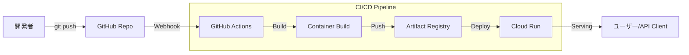

個人開発でWeb APIを作るとき、デプロイ先選びに迷いませんか？
Herokuは有料化したし、Vercel Serverless FunctionはPythonだと制限がきつい。AWSは設定が複雑すぎる……。

結論から言います。
**「Cloud Run + GitHub Actions」**が最強です。

- **安い**: リクエストがない時はインスタンスがゼロになるため、個人レベルならほぼ無料（月数十円〜数百円）。
- **速い**: コンテナなのでローカルと同じ環境が動き、スケーリングも爆速。
- **楽**: GitHubに `git push` するだけで勝手にデプロイ完了。

本記事では、Python (FastAPI) アプリケーションを例に、**「mainブランチにマージしたら即座にCloud Runにデプロイされる」**というCI/CDパイプラインの構築手順を、実際に稼働している `correlate-api` の構成をベースに解説します。

## 全体像



## 1. アプリケーションの準備 (Python)

まずは最小構成のFastAPIアプリを作ります。

```python
# main.py
import os
from fastapi import FastAPI

app = FastAPI()

@app.get("/")
def read_root():
    return {"Hello": "Cloud Run from GitHub Actions!"}

if __name__ == "__main__":
    import uvicorn
    port = int(os.environ.get("PORT", 8080))
    uvicorn.run(app, host="0.0.0.0", port=port)
```

Cloud Runは環境変数 `PORT` (デフォルト8080) でリクエストを待ち受ける必要がある点だけ注意してください。

## 2. Dockerfile の作成

軽量な `python:3.11-slim` をベースにします。

```dockerfile
# Dockerfile
FROM python:3.11-slim

# 作業ディレクトリ設定
WORKDIR /app

# 依存関係のインストール
COPY requirements.txt .
RUN pip install --no-cache-dir -r requirements.txt

# ソースコードのコピー
COPY . .

# 実行ユーザーをroot以外にする（セキュリティ推奨）
RUN useradd -m appuser && chown -R appuser /app
USER appuser

# Cloud Run用ポート開放
ENV PORT=8080
EXPOSE 8080

# 起動コマンド
CMD ["python", "main.py"]
```

## 3. Google Cloud側の準備

### 3.1 Artifact Registry リポジトリ作成
コンテナイメージの置き場です。

```bash
gcloud artifacts repositories create my-repo \
    --repository-format=docker \
    --location=asia-northeast1 \
    --description="Docker repository"
```

### 3.2 Workload Identity Federation (WIF) の設定
セキュリティ向上のため、JSONキーではなく **Workload Identity Federation (WIF)** を使用します。これにより、GitHub ActionsがGCPに「鍵なし」で安全にアクセスできます。

1.  **プールとプロバイダの作成**:
    ```bash
    # プール作成
    gcloud iam workload-identity-pools create "github-pool" \
      --project="${PROJECT_ID}" \
      --location="global" \
      --display-name="GitHub Actions Pool"
    
    # プロバイダ作成（GitHubリポジトリを許可）
    gcloud iam workload-identity-pools providers create-oidc "github-provider" \
      --project="${PROJECT_ID}" \
      --location="global" \
      --workload-identity-pool="github-pool" \
      --display-name="GitHub Provider" \
      --attribute-mapping="google.subject=assertion.sub,attribute.actor=assertion.actor,attribute.repository=assertion.repository" \
      --issuer-uri="https://token.actions.githubusercontent.com"
    ```

2.  **サービスアカウントへの権限付与**:
    GitHubの特定のリポジトリからのアクセスのみを許可します。
    ```bash
    # 変数設定
    REPO_NAME="username/repo-name"  # GitHubの <ユーザー名>/<リポジトリ名>
    
    gcloud iam service-accounts add-iam-policy-binding "my-service-account@${PROJECT_ID}.iam.gserviceaccount.com" \
      --project="${PROJECT_ID}" \
      --role="roles/iam.workloadIdentityUser" \
      --member="principalSet://iam.googleapis.com/projects/${PROJECT_NUMBER}/locations/global/workloadIdentityPools/github-pool/attribute.repository/${REPO_NAME}"
    ```

## 4. GitHub Actions ワークフロー (`.github/workflows/deploy.yml`)

WIFを使用したセキュアなワークフロー定義です。JSONキーの管理は不要です。

```yaml
name: Deploy to Cloud Run

on:
  push:
    branches:
      - main

env:
  PROJECT_ID: correlate-dev-12345
  REGION: asia-northeast1
  REPO_NAME: my-repo
  SERVICE_NAME: correlate-api
  IMAGE_TAG: ${{ github.sha }}
  # WIFプロバイダのリソース名 (projects/123.../locations/global/...)
  WIF_PROVIDER: projects/123456789/locations/global/workloadIdentityPools/github-pool/providers/github-provider
  # サービスアカウントのメールアドレス
  WIF_SERVICE_ACCOUNT: my-service-account@correlate-dev-12345.iam.gserviceaccount.com

jobs:
  deploy:
    runs-on: ubuntu-latest
    permissions:
      contents: read
      id-token: write  # OIDCトークン取得に必須

    steps:
    - uses: actions/checkout@v4

    # Workload Identity Federation で認証
    - id: 'auth'
      uses: 'google-github-actions/auth@v2'
      with:
        workload_identity_provider: '${{ env.WIF_PROVIDER }}'
        service_account: '${{ env.WIF_SERVICE_ACCOUNT }}'

    # Google Cloud SDK セットアップ
    - name: 'Set up Cloud SDK'
      uses: 'google-github-actions/setup-gcloud@v2'

    # Docker認証
    - name: 'Docker Auth'
      run: |-
        gcloud auth configure-docker ${{ env.REGION }}-docker.pkg.dev

    # ビルド & Push (Google Cloud Build を使う手もあり)
    - name: 'Build and Push Container'
      run: |-
        docker build -t "${{ env.REGION }}-docker.pkg.dev/${{ env.PROJECT_ID }}/${{ env.REPO_NAME }}/${{ env.SERVICE_NAME }}:${{ env.IMAGE_TAG }}" .
        docker push "${{ env.REGION }}-docker.pkg.dev/${{ env.PROJECT_ID }}/${{ env.REPO_NAME }}/${{ env.SERVICE_NAME }}:${{ env.IMAGE_TAG }}"

    # Cloud Run デプロイ
    - name: 'Deploy to Cloud Run'
      uses: 'google-github-actions/deploy-cloudrun@v2'
      with:
        service: ${{ env.SERVICE_NAME }}
        region: ${{ env.REGION }}
        image: ${{ env.REGION }}-docker.pkg.dev/${{ env.PROJECT_ID }}/${{ env.REPO_NAME }}/${{ env.SERVICE_NAME }}:${{ env.IMAGE_TAG }}
        flags: '--allow-unauthenticated'
```

## Workload Identity Federation (WIF) を使う理由

かつては「サービスアカウントキー（JSON）」をGitHub Secretsに登録するのが一般的でしたが、現在は**非推奨**です。
WIFを使えば、有効期限の短い使い捨てトークンが発行されるため、万が一JSONキーが漏洩するリスクをゼロにできます。2025年のデプロイパイプラインでは、これが標準です。

## まとめ

これで、開発フローは以下のようになります。

1.  ローカルでコードを書く。
2.  `git commit -am "Fix bug"`
3.  `git push origin main`
4.  （コーヒーを飲む☕️）
5.  1〜2分後、本番環境が更新されている。

個人開発において、CI/CDは「贅沢品」ではありません。**「開発以外の時間を極限まで減らすための必須ツール」**です。

ぜひ、この週末に Cloud Run デデビューしてみてください！
