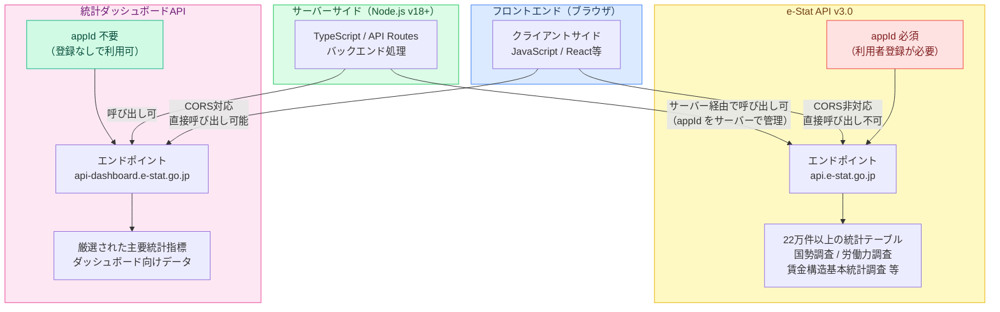
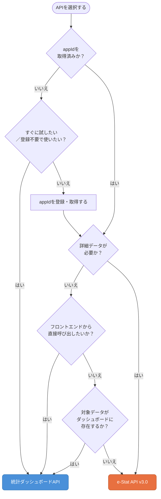
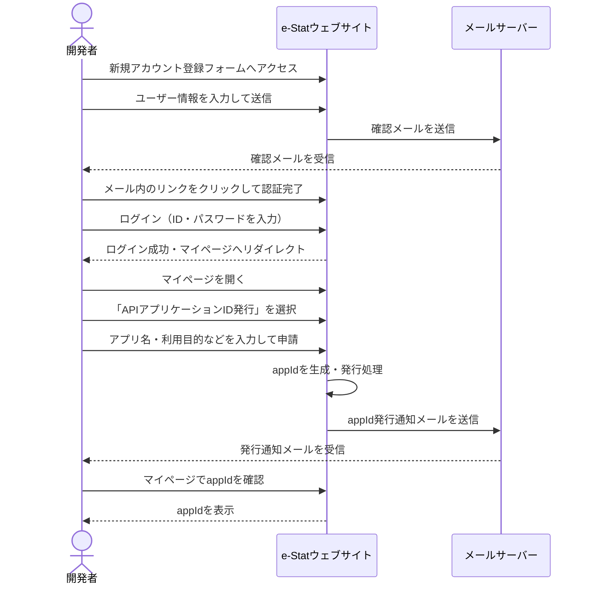
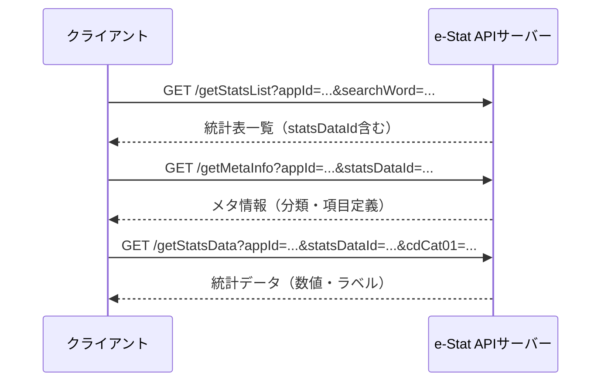
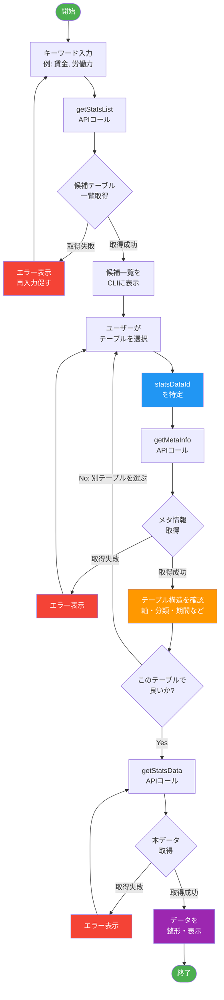

## はじめに

政府が公開する公的統計データをプログラムから活用したいと思ったとき、多くの開発者が最初に行き着くのがe-Stat（政府統計の総合窓口）です。e-Stat APIを使えば、労働力調査や賃金構造基本統計調査など、22万を超える統計テーブルにアクセスできます。

しかし、いざ実装しようとすると「appIdの登録が必要なのか」「どのAPIエンドポイントを呼べばよいのか」「22万テーブルの中から目的のデータをどうやって探すのか」といった疑問に直面します。さらに、e-Stat APIとは別に「統計ダッシュボードAPI」という仕組みも存在しており、どちらを使うべきか迷う方も少なくありません。

本記事では、社会情報プラットフォームの構築過程で得られた実装経験をもとに、e-Stat API v3.0と統計ダッシュボードAPIの両方を解説します。それぞれの特徴と使い分けを明確にしたうえで、TypeScriptによる実装コードとCLIツールを使ったテーブル探索の方法まで、実践的な手順をお伝えします。

なお、本記事のコードサンプルは **Node.js v18以上** を実行環境として想定しています。

---

## 2つのAPIを理解する — e-Stat APIと統計ダッシュボードAPI



### e-Stat API v3.0とは

e-Stat API v3.0は、政府統計の総合窓口であるe-Statが提供する公式APIです。国勢調査、労働力調査、賃金構造基本統計調査をはじめとする22万件以上の統計テーブルに対してプログラムからアクセスできます。

主な特徴は以下のとおりです。

- **appId（アプリケーションID）が必須**: 利用には事前の利用者登録とappIdの取得が必要です
- **22万テーブルという広大なカバレッジ**: 各府省が公表するほぼすべての公的統計を網羅しています
- **詳細データへのアクセス**: 個別の統計表から詳細な集計値まで取得できます
- **CORS非対応**: ブラウザから直接呼び出すことはできず、サーバーサイドでの実装が前提となります

レスポンス形式はJSON（またはXML）で、JSONレスポンスは`GET_STATS_DATA.STATISTICAL_DATA`以下に統計データが格納される独自のネスト構造を持ちます。

> **セキュリティ上の注意**: `appId`はURLクエリパラメータとして送信されます。サーバーサイドでのみ使用し、アクセスログへの記録やプロキシ経由のリークに注意してください。ログのマスキングも検討することを推奨します。

### 統計ダッシュボードAPIとは

統計ダッシュボードAPIは、e-Statとは独立した仕組みで提供されているAPIです。GDP成長率、完全失業率、消費者物価指数など、主要な経済・社会指標をIndicatorCodeと呼ばれる識別子で取得できます。

主な特徴は以下のとおりです。

- **appId不要**: 利用者登録なしで即座に使い始められます
- **CORS対応**: ブラウザのJavaScriptから直接APIを呼び出せます
- **高速レスポンス**: 高速なレスポンスタイムを実現しています
- **主要指標に特化**: カバーする指標はe-Stat全体と比べると限定的ですが、KPIとして頻繁に参照される指標が揃っています

### 使い分けの指針



2つのAPIの特徴をまとめると、次のような使い分けが自然に導き出されます。

| 項目 | e-Stat API v3.0 | 統計ダッシュボードAPI |
|---|---|---|
| appId | 必要 | 不要 |
| CORS対応 | 非対応 | 対応 |
| レスポンス速度 | 数百ms〜数秒 | 高速 |
| テーブル数 | 22万以上 | 主要指標に限定 |
| 主な用途 | 詳細データの深掘り | KPIダッシュボード表示 |
| 実装場所 | サーバーサイド | フロントエンドも可 |

**KPIダッシュボードや速報値の表示** には統計ダッシュボードAPIが適しています。appId不要でCORSに対応しているため、フロントエンドから直接呼び出してリアルタイムに近い形で指標を表示できます。

一方、 **記事やレポートで深掘りした統計データが必要な場合** はe-Stat API v3.0を使います。労働力調査の都道府県別・年齢階層別の詳細集計など、統計ダッシュボードAPIでは取得できない粒度のデータにアクセスできます。

---

## 統計ダッシュボードAPI — フロントエンドから直接使う

統計ダッシュボードAPIはappId不要・CORS対応のため、ブラウザのJavaScriptから直接呼び出せます。以下に完全失業率を取得する例を示します。

```typescript
// dashboard-example.ts
const DASHBOARD_BASE_URL = "https://dashboard.e-stat.go.jp/api/1.0/Json";

// 完全失業率を取得する（IndicatorCode: 0301010000000010010）
async function getUnemploymentRate() {
  const url = new URL(`${DASHBOARD_BASE_URL}/getData`);
  url.searchParams.set("IndicatorCode", "0301010000000010010");
  url.searchParams.set("IsSeasonalAdjustment", "1"); // 季節調整済み

  const response = await fetch(url.toString());
  if (!response.ok) {
    throw new Error(`HTTP error: ${response.status}`);
  }
  const data = await response.json();
  // レスポンスはdata.GET_STATS.STATISTICAL_DATA以下に時系列データが格納される
  return data.GET_STATS.STATISTICAL_DATA;
}

// 使用例（フロントエンド・サーバーサイド両方で動作）
const result = await getUnemploymentRate();
console.log(result);
```

> **IndicatorCodeの調べ方**: [統計ダッシュボード](https://dashboard.e-stat.go.jp/) のWebサイトで指標を検索し、URLまたはAPIドキュメントからIndicatorCodeを確認できます。

---

## e-Stat API v3.0 — appId登録から最初のリクエストまで

### appIdの登録方法



e-Stat API v3.0を利用するには、まずe-Statの利用者登録とappIdの発行が必要です。手順は以下のとおりです。

1. [e-Stat（https://www.e-stat.go.jp/）](https://www.e-stat.go.jp/) にアクセスします
2. 右上の「新規登録」からアカウントを作成します（メールアドレスとパスワードを登録）
3. ログイン後、「マイページ」→「API機能（アプリケーションID発行）」に進みます
4. アプリケーションの名称と概要を入力して申請します
5. 申請後、即座またはメールでappIdが発行されます

発行されたappIdは環境変数として管理するのが安全です。

```bash
# .env
ESTAT_APP_ID=your_application_id_here
```

### 基本的なAPIエンドポイント



e-Stat API v3.0の主なエンドポイントは以下のとおりです。

| エンドポイント | 用途 |
|---|---|
| `getStatsList` | 統計表の一覧を検索する |
| `getMetaInfo` | 統計表のメタ情報（項目定義）を取得する |
| `getStatsData` | 統計データ本体を取得する |

ベースURLは `https://api.e-stat.go.jp/rest/3.0/app/json/` です。

### 最初のリクエスト — TypeScriptによる実装例

以下に、TypeScriptを使った基本的なデータ取得の実装例を示します。

> **注意**: 本番実装では必ずエラーハンドリングを追加してください。appIdが無効な場合・レート制限・ネットワークエラーなどはe-Stat API利用時に実際によく発生します。また、検索結果が0件の場合、`TABLE_INF`が`undefined`になり、そのままアクセスすると`TypeError`が発生します。以下のサンプルにはエラー処理の基本パターンを含めています。

```typescript
// estat-client.ts
// ※ 本番コードでは TableInfo・StatisticalData などの型定義を別途設けてください
// （本サンプルでは説明のため型定義を省略しています）

const ESTAT_BASE_URL = "https://api.e-stat.go.jp/rest/3.0/app/json";
const APP_ID = process.env.ESTAT_APP_ID!;

// 統計表の検索
async function searchStatsList(keyword: string) {
  const url = new URL(`${ESTAT_BASE_URL}/getStatsList`);
  url.searchParams.set("appId", APP_ID);
  url.searchParams.set("searchWord", keyword);
  url.searchParams.set("limit", "10");

  const response = await fetch(url.toString());
  if (!response.ok) {
    throw new Error(`HTTP error: ${response.status} ${response.statusText}`);
  }

  const data = await response.json();

  // 検索結果が0件の場合、TABLE_INFがundefinedになるケースがある
  const tableInf = data.GET_STATS_LIST?.DATALIST_INF?.TABLE_INF;
  if (!tableInf) {
    console.warn("検索結果が0件、またはレスポンス構造が予期しない形式です");
    return [];
  }

  // 1件のみの場合はオブジェクト、複数件の場合は配列で返却されることがある
  return Array.isArray(tableInf) ? tableInf : [tableInf];
}

// 統計データの取得
async function getStatsData(statsDataId: string) {
  const url = new URL(`${ESTAT_BASE_URL}/getStatsData`);
  url.searchParams.set("appId", APP_ID);
  url.searchParams.set("statsDataId", statsDataId);

  const response = await fetch(url.toString());
  if (!response.ok) {
    throw new Error(`HTTP error: ${response.status} ${response.statusText}`);
  }

  const data = await response.json();
  return data.GET_STATS_DATA?.STATISTICAL_DATA;
}

// 使用例
try {
  const tables = await searchStatsList("労働力調査");
  console.log(tables.map((t: any) => ({ id: t["@id"], title: t.TITLE })));
} catch (err) {
  console.error("統計表の検索に失敗しました:", err);
}
```

---

## 22万テーブルを効率的に探す — metaInfo CLIツールの活用



### なぜテーブル探索が難しいのか

e-Stat APIを使いこなす上で最大の障壁の一つが、22万テーブルの中から目的のデータを特定することです。e-Statのウェブサイトから手動で検索することもできますが、プログラムから扱う場合は統計表IDが必要であり、それを効率よく特定する仕組みが欲しくなります。

なお、e-StatのWebサイトで統計表を閲覧しているときのURLに含まれる`statsDataId=XXXXXXXXXX`の数字がそのままAPIのIDとして使用できます。

そこで有効なのが、`getStatsList`と`getMetaInfo`を組み合わせたCLIツールです。

### estat-explore.tsの構成

以下は、テーブル検索から構造確認まで一貫して行えるCLIツールの実装例です。

> **注意**: 大量のテーブルを連続して検索・取得する場合は、e-Statの利用規約に定めるレート制限を確認し、リクエスト間に適切なsleepを挟んでください。

```typescript
// estat-explore.ts
// ※ 本番コードでは ClassObj・TableInfo などの型定義を別途設けてください
// （本サンプルでは説明のため型定義を省略しています）

import { parseArgs } from "util";

const ESTAT_BASE_URL = "https://api.e-stat.go.jp/rest/3.0/app/json";
const APP_ID = process.env.ESTAT_APP_ID!;

const { values } = parseArgs({
  args: process.argv.slice(2),
  options: {
    search: { type: "string", short: "s" },
    meta: { type: "string", short: "m" },
    limit: { type: "string", short: "l", default: "5" },
  },
});

// キーワードで統計表を検索
async function searchTables(keyword: string, limit: number) {
  const url = new URL(`${ESTAT_BASE_URL}/getStatsList`);
  url.searchParams.set("appId", APP_ID);
  url.searchParams.set("searchWord", keyword);
  url.searchParams.set("limit", String(limit));

  const res = await fetch(url.toString());
  const data = await res.json();
  const tables = data.GET_STATS_LIST.DATALIST_INF.TABLE_INF;

  for (const table of tables) {
    console.log(`ID: ${table["@id"]}`);
    console.log(`タイトル: ${table.TITLE}`);
    console.log(`統計名: ${table.STAT_NAME["$"]}`);
    console.log(`調査日: ${table.SURVEY_DATE}`);
    console.log("---");
  }
}

// 統計表のメタ情報を確認
async function showMetaInfo(statsDataId: string) {
  const url = new URL(`${ESTAT_BASE_URL}/getMetaInfo`);
  url.searchParams.set("appId", APP_ID);
  url.searchParams.set("statsDataId", statsDataId);

  const res = await fetch(url.toString());
  const data = await res.json();
  const classInfo = data.GET_META_INFO.METADATA_INF.CLASS_INF.CLASS_OBJ;

  for (const cls of classInfo) {
    console.log(`\n分類: ${cls["@name"]} (${cls["@id"]})`);
    const items = Array.isArray(cls.CLASS) ? cls.CLASS : [cls.CLASS];
    items.slice(0, 5).forEach((item: any) => {
      console.log(`  - ${item["@name"]} (${item["@code"]})`);
    });
    if (items.length > 5) console.log(`  ... 他${items.length - 5}件`);
  }
}

// メインの実行分岐
if (values.search) {
  await searchTables(values.search, Number(values.limit));
} else if (values.meta) {
  await showMetaInfo(values.meta);
}
```

### CLIツールの使い方

実際の操作手順を示します。

**ステップ1: キーワードで統計表を検索する**

```bash
npx tsx estat-explore.ts --search "賃金構造" --limit 5
```

出力例:

```
ID: 0004615086
タイトル: 賃金構造基本統計調査 一般労働者 職種（小分類）
統計名: 賃金構造基本統計調査
調査日: 202301
---
ID: 0004615087
タイトル: 賃金構造基本統計調査 一般労働者 産業（中分類）
統計名: 賃金構造基本統計調査
調査日: 202301
---
```

**ステップ2: 目的のテーブルのメタ情報を確認する**

```bash
npx tsx estat-explore.ts --meta 0004615086
```

出力例:

```
分類: 職種 (cat01)
  - 管理的職業従事者 (010)
  - 専門的・技術的職業従事者 (020)
  - 事務従事者 (030)
  ... 他42件

分類: 性別 (cat02)
  - 男 (1)
  - 女 (2)
  - 計 (3)

分類: 時間軸（年次） (time)
  - 2023年 (2023000000)
  - 2022年 (2022000000)
  ... 他8件
```

**ステップ3: 必要なデータを取得してJSONスナップショットに保存する**

テーブル構造を把握したら、必要な絞り込み条件を指定してデータを取得し、JSONファイルとして保存します。

```typescript
// snapshot.ts
import { writeFileSync } from "fs";

const ESTAT_BASE_URL = "https://api.e-stat.go.jp/rest/3.0/app/json";
const APP_ID = process.env.ESTAT_APP_ID!;

async function saveSnapshot(statsDataId: string, params: Record<string, string>) {
  const url = new URL(`${ESTAT_BASE_URL}/getStatsData`);
  url.searchParams.set("appId", APP_ID);
  url.searchParams.set("statsDataId", statsDataId);

  // 絞り込み条件を設定（例: 男女計のみ、最新3年分）
  for (const [key, value] of Object.entries(params)) {
    url.searchParams.set(key, value);
  }

  const res = await fetch(url.toString());
  if (!res.ok) {
    throw new Error(`HTTP error: ${res.status} ${res.statusText}`);
  }
  const data = await res.json();

  const filename = `snapshot-${statsDataId}-${Date.now()}.json`;
  writeFileSync(filename, JSON.stringify(data, null, 2));
  console.log(`保存完了: ${filename}`);
}

// 使用例: 賃金構造基本統計調査 男女計のみ絞り込み
await saveSnapshot("0004615086", {
  cdCat02: "3", // 性別: 計
});
```

---

## まとめ

本記事では、e-Stat API v3.0と統計ダッシュボードAPIの使い分けから、TypeScriptによる実装、CLIツールを使った22万テーブルの探索方法まで解説しました。

**ポイントのおさらい:**

- **統計ダッシュボードAPI**: appId不要・CORS対応。KPIダッシュボードや速報値表示に最適。フロントエンドから直接呼び出せる
- **e-Stat API v3.0**: appId必須・サーバーサイド専用。22万テーブルへのアクセスが可能で、詳細な統計データを深掘りできる
- **CLIツール（estat-explore.ts）**: `getStatsList`と`getMetaInfo`を組み合わせることで、目的のテーブルを素早く特定できる
- **appId管理**: 必ず環境変数で管理し、フロントエンドや公開リポジトリには含めない

公的統計データを活用することで、独自の分析・可視化・サービスの構築が可能になります。22万テーブルという膨大なデータの中から必要なものを効率よく見つけ、実装に役立てていただければ幸いです。

---

## 参考リンク

- [e-Stat 政府統計の総合窓口](https://www.e-stat.go.jp/)
- [e-Stat API 仕様書](https://www.e-stat.go.jp/api/api-info/e-stat-manual3-0)
- [統計ダッシュボード](https://dashboard.e-stat.go.jp/)
- [統計ダッシュボードAPI仕様書](https://dashboard.e-stat.go.jp/static/statistics/PublicDataApiGuide.pdf)
