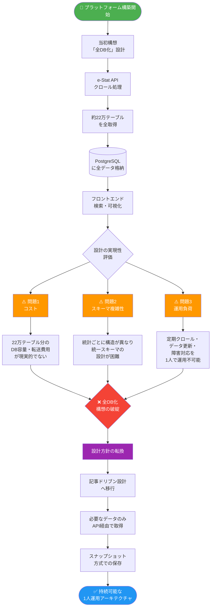
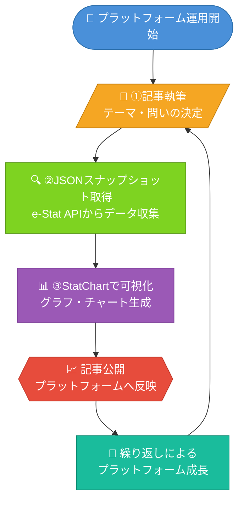
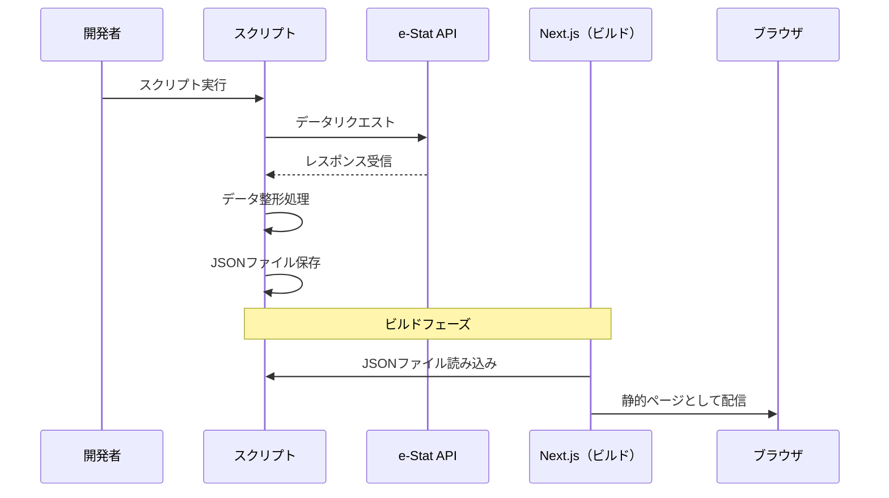
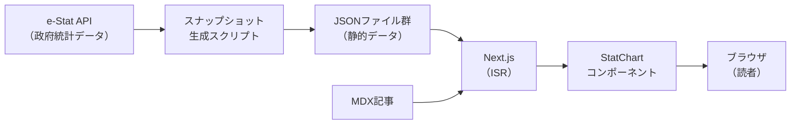
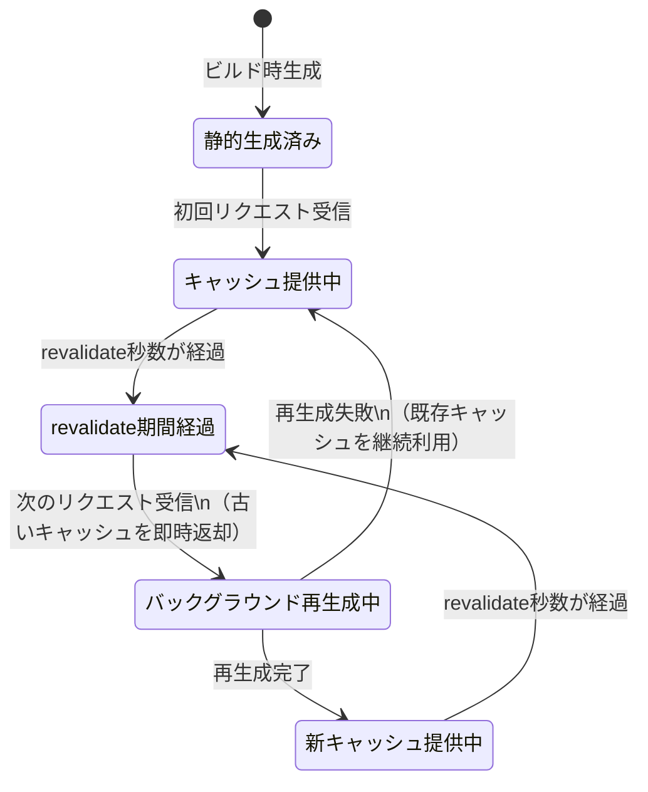

## はじめに

> **対象読者** ：Next.js・TypeScript・React の基本的な知識を前提としています。e-Stat API の基礎知識は本記事内で解説します。

「日本の公的統計データを、誰でも使いやすい形で届けたい」

そんな動機から、ISVD（一般社団法人社会変革推進財団）の社会情報プラットフォーム **data.isvd.or.jp** の構築を始めました。構想からデプロイまでを連続した一連の作業セッション（実質数日間）で完遂するという強引なスケジュールでしたが、その過程で「1人運用のデータプラットフォーム設計」について、非常に重要な教訓を得ることができました。

> **本記事について** ：本記事は **設計編（前編）** として、アーキテクチャの選定・設計判断の経緯を解説します。フェーズ2以降の実装詳細（スナップショット生成・StatChart実装・インフラ構築など）は **後編** で解説予定です。

この記事では、 **設計の失敗と修正のプロセスをそのまま** お伝えします。具体的には、「全DB化」という最初のアイデアがなぜ破綻したか、そこからどう設計を転換したかを、実際に詰まった箇所とともに解説します。e-Stat APIを使ったプラットフォームを作ろうとしている開発者の方に、少しでも参考になれば幸いです。

---

## e-Stat APIとは何か

### 22万テーブルが眠る国家統計データベース

e-Stat（イースタット）は、日本政府が運営する **政府統計の総合窓口** です。総務省統計局をはじめ、各府省庁が公表する統計データを一元的に集約しており、その規模は **約22万テーブル** に及びます。

提供されているデータの例を挙げると、次のようなものがあります。

- 国勢調査（人口・世帯数）
- 家計調査（消費支出の動向）
- 労働力調査（就業・失業状況）
- 学校基本調査（教育機関の状況）
- 国民生活基礎調査（健康・介護・所得）

これらのデータは、従来はPDFや Excelファイルとして公開されていましたが、 **e-Stat API v3.0** の提供により、プログラムから直接取得できるようになっています。

### e-Stat API v3.0 の基本仕様

e-Stat APIはRESTfulなHTTPS APIとして提供されています。主なエンドポイントは以下のとおりです。

| エンドポイント | 用途 |
|---|---|
| `getStatsList` | 統計表一覧の取得 |
| `getMetaInfo` | 統計表のメタ情報取得 |
| `getStatsData` | 統計データの取得 |

> **注意** ：上記は e-Stat API v3.0 の主要エンドポイントです。キーワード検索は `getStatsList` のパラメータ（`searchWord`）として指定します。最新の仕様は[e-Stat API 公式ドキュメント](https://api.e-stat.go.jp/api-detail/api-get-stats-list)を参照してください。

利用には **アプリケーションID（appId）** の取得が必要ですが、e-Statのサイトから無料で申請できます。レスポンス形式はJSON・XMLの両方に対応しており、開発用途にはJSONが扱いやすいでしょう。

なお、e-Stat APIには利用制限が設けられています。詳細な上限値（回数・時間帯・条件）については[公式の利用ガイドライン](https://api.e-stat.go.jp/terms/)を参照してください。この制限の存在が、後述する設計判断に影響しています。

```bash
# 統計表一覧をキーワード検索で取得する例
GET https://api.e-stat.go.jp/rest/3.0/app/json/getStatsList
  ?appId=YOUR_APP_ID
  &searchWord=人口
  &limit=10
```

APIとしての完成度は高く、日本の公的統計データにアクセスする手段としては現時点で最も整備されています。

---

## 最初の設計と、その崩壊



### 「全DB化」という最初のアイデア

プラットフォーム構築の初期段階で、私が最初に考えた設計は非常にシンプルでした。

**「e-Statの統計データをすべてDBに取り込んでしまえばいい」**

具体的には、次のような構成を想定していました。

1. e-Stat APIで全統計表を定期クロール
2. PostgreSQLなどのRDBMSに正規化して格納
3. フロントエンドからDBを検索・可視化

発想としては自然です。データを手元に持てば、検索も可視化も自由自在です。類似サービスとしてイメージしていたのは、Our World in Dataのような **包括的な統計プラットフォーム** でした。

### 22万テーブルの現実

ここが最初に詰まったポイントです。「全部取り込もう」と具体的なコストを試算し始めたところで、設計が一気に現実と衝突しました。

e-Statには約 **22万テーブル** が存在します。概算として、1テーブルあたり平均50KBのJSONデータを想定すると、全テーブルで約 **11GB** のストレージが必要になります。さらに定期同期を加味すると、転送量・API呼び出し回数・計算コストはすべて線形に増加します。このテーブルを1人で管理することは、現実的ではありません。

**運用コストの問題**
- 22万テーブルの初期インポートだけで、相当な計算資源と時間が必要
- e-Statのデータは定期更新されるため、差分同期の仕組みが必要
- データの品質（欠損値・コード体系の変更など）への対処が都度発生

**スキーマ設計の複雑さ**
- 統計表によって次元（時系列/地域/年齢区分など）が異なる
- 汎用スキーマにしようとするほど、クエリが複雑になる
- メンテナンスできるスキーマの複雑度に、個人開発は明確な上限がある

**コストの問題**
- 11GB超のストレージ費用（クラウドDB換算で月額数千〜数万円規模）
- クロールのAPI呼び出し回数（e-Statの利用制限への抵触リスク）

こうした試算から、「全DB化」は **1人運用では持続不可能な設計** であることが明らかになっていきました。

### 失敗から得た問い

この気づきは、設計の根本を問い直すきっかけになりました。

> **「22万テーブルを全部持つ必要が、本当にあるのか？」**

データプラットフォームの価値は、データの量ではなく、 **読者が実際に使えるかどうか** にあります。22万テーブルを所有することと、読者に価値を届けることは、別の話です。この問いから、設計の転換が始まりました。

---

## 記事ドリブン設計への転換

### Our World in Data から学ぶ

設計の方向性を探るなかで、改めて **Our World in Data（OWID）** のアーキテクチャに注目しました。

OWIDは、専任のデータエンジニアチームによる独自のデータ収集・クリーニングパイプラインを持つ大規模なプラットフォームであり、本プロジェクトとは規模も運用体制も大きく異なります。ただし、そのコンテンツ設計の **思想的コンセプト** は、1人運用への応用が可能だと考えました。

OWIDのコンテンツは、「世界の平均寿命はどう変化したか」「所得格差の実態」といった **問いに答える記事** として構成されており、「記事（チャート付き解説）が中心にあり、データはその記事を支えるために存在する」という思想が読み取れます。データはその記事のなかに埋め込まれており、読者は記事を読むことでデータの意味を理解できます。

この設計の **思想的コンセプトを参考に、1人運用向けに大幅に簡略化した** のが、本プロジェクトのアーキテクチャです。

- **データの選択と集中** ：記事に必要なデータだけを用意すればよい
- **文脈の提供** ：数字だけでなく、意味の解説がセットになっている
- **運用の持続可能性** ：記事単位でスコープが明確なので管理しやすい

### 記事ドリブンアーキテクチャの3ステップ



OWIDの思想を参考に、data.isvd.or.jpでは次の3ステップを基本サイクルとする設計に転換しました。

```
① 記事を書く（テーマと問いを決める）
        ↓
② 必要な統計だけJSONスナップショットで引く
        ↓
③ StatChartで可視化する
```

このサイクルを繰り返すことで、プラットフォームは **記事の数だけ成長** していきます。全データを事前に取り込む必要はなく、記事を書くたびに必要なデータを取得・保存するだけです。

### JSONスナップショット戦略



記事ドリブン設計の核心は、 **JSONスナップショット** という概念です。

e-Stat APIから取得したデータは、加工したうえで静的なJSONファイルとして保存します。このJSONファイルが「スナップショット」であり、記事の可視化コンポーネントはこのファイルを参照します。

```
/data/
  snapshots/
    population-trend-2024.json
    labor-force-by-age-2023.json
    household-income-distribution-2022.json
```

スナップショット戦略のメリットは次のとおりです。

**① ビルド時の安定性**
記事のビルド時にAPIを叩く必要がないため、API障害やレート制限の影響を受けません。

**② 再現性の確保**
スナップショットのバージョンを管理することで、記事公開時点のデータが常に参照できます。統計データは定期更新されるため、「記事執筆時点の数値」を保持することは重要です。

**③ コストの最小化**
必要なデータだけをAPIから取得するため、不要なAPI呼び出しがありません。

スナップショットの生成は、記事執筆時に手動で実行するスクリプトとして実装しました。

```typescript
// スナップショット生成スクリプトの概略
// ※ 以下はエラーハンドリングを省略した概略コードです。実際の実装ではtry-catchやresponse.okチェックを行ってください。
async function createSnapshot(statsDataId: string, outputPath: string) {
  const response = await fetch(
    `https://api.e-stat.go.jp/rest/3.0/app/json/getStatsData` +
    `?appId=${process.env.ESTAT_APP_ID}` +
    `&statsDataId=${statsDataId}`
  );
  const raw = await response.json();
  const processed = processEStatData(raw); // 整形処理
  await fs.writeFile(outputPath, JSON.stringify(processed, null, 2));
}
```

---

## 技術スタックと実装の詳細



### フロントエンド：Next.js ISR + MDX



フロントエンドには **Next.js** を採用しました。記事ドリブン設計との相性を考えたとき、Next.jsの **ISR（Incremental Static Regeneration）** は非常に適した機能です。

ISRでは、ページを静的生成しながら、revalidate期間が経過した後の **次のリクエスト時** にバックグラウンドで再生成が走る仕組みです（一定間隔で自動的に再生成されるわけではありません）。統計データは頻繁には変わらないため、完全なSSRは不要であり、ISRによるキャッシュ戦略が運用コストの削減につながります。

記事の本文は **MDX** で管理しています。MDXはMarkdownにJSXを埋め込める形式であり、記事のなかにインタラクティブなチャートコンポーネントを直接配置できます。

```mdx
## 日本の人口推移（1950〜2020年）

戦後から高度経済成長期にかけて、日本の人口は急速に増加しました。
以下のグラフは、国勢調査のデータをもとに作成したものです。

<StatChart
  snapshot="population-trend-2024"
  type="line"
  xKey="year"
  yKey="population"
  title="日本の総人口推移"
  unit="万人"
/>
```
