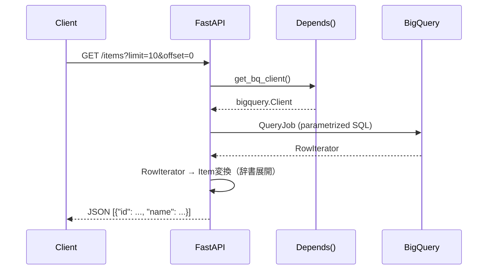

## はじめに

FastAPI でバックエンドAPIを構築する際、多くの記事では SQLAlchemy + PostgreSQL の組み合わせが紹介されます。しかし、Google Cloud Platform を利用している場合、BigQuery をAPIのデータバックエンドとして使うパターンが非常に有効です。

本記事では、 **FastAPI × google-cloud-bigquery を使ってCRUD APIを実装する実践的なパターン** を解説します。

### BigQueryをAPIバックエンドに使うメリット・デメリット

BigQueryはもともと分析用途のデータウェアハウスですが、APIバックエンドとして使う構成にも適したシーンがあります。

**メリット**

- **インフラ管理不要**: DBサーバーのセットアップ・チューニング・パッチ適用が不要です
- **スケーラビリティ**: 数TBのデータでも同じAPIコードでクエリできます
- **分析との統合**: BI ツールや分析パイプラインと同じデータを1つの場所で管理できます
- **GCPエコシステムとの親和性**: IAM、Workload Identity、Cloud Logging との統合が容易です

**デメリット・制約**

- **レイテンシ**: クエリ実行に数百ms〜数秒かかります。ミリ秒単位の応答が必要な用途には不向きです
- **DMLクォータ**: 1テーブルあたり1日1,500回のDML（INSERT/UPDATE/DELETE）上限があります
- **トランザクション非対応**: 複数テーブルをまたぐアトミックな操作は難しいです
- **コスト**: 大量の小規模クエリはスキャン量が積み上がり割高になる可能性があります

### 適したユースケース

BigQueryをAPIバックエンドに使うのが適しているのは、以下のようなケースです。

- 分析集計結果の閲覧API（読み取り多め、書き込み少なめ）
- BigQueryをSingle Source of Truthとしたデータプラットフォーム
- ログ・イベントデータの参照API
- バッチ集計結果の配信

逆に、毎秒数千件の書き込みが発生するリアルタイムAPIには向きません。

### この記事で使う技術スタック

| 要素 | バージョン |
|------|----------|
| Python | 3.12 |
| FastAPI | 0.115.x |
| google-cloud-bigquery | 3.x |
| Pydantic | v2 (2.x) |
| uvicorn | 0.32.x |

---

## アーキテクチャ概要


リクエスト処理フローを詳しく見ると次のようになります。



---

## セットアップ

### 依存関係のインストール

```bash
pip install fastapi uvicorn google-cloud-bigquery pydantic
```

`pyproject.toml` で管理する場合は以下のようにします。

```toml
[project]
dependencies = [
    "fastapi>=0.115.0",
    "uvicorn[standard]>=0.32.0",
    "google-cloud-bigquery>=3.25.0",
    "pydantic>=2.0.0",
]
```

### 認証設定

ローカル開発では ADC（Application Default Credentials）を使います。

```bash
gcloud auth application-default login
```

Cloud Run などの本番環境では、サービスアカウントに適切なIAMロールを付与します。

```
roles/bigquery.dataEditor  # DML操作（INSERT/UPDATE/DELETE）
roles/bigquery.jobUser     # クエリジョブの実行
```

### 環境変数

```bash
# .env（Gitに含めないこと）
GCP_PROJECT_ID=your-project-id
BQ_DATASET=your_dataset
```

---

## BigQueryクライアントの依存性注入（Depends）

FastAPI の `Depends()` を使ってBigQueryクライアントをエンドポイントに注入します。この設計にすることで、テスト時にモッククライアントに差し替えられます。

```python
# dependencies.py
import os
from functools import lru_cache
from google.cloud import bigquery


@lru_cache(maxsize=1)
def get_settings() -> dict:
    """環境変数をキャッシュして返す。"""
    return {
        "project_id": os.environ["GCP_PROJECT_ID"],
        "dataset": os.environ["BQ_DATASET"],
    }


def get_bq_client() -> bigquery.Client:
    """BigQueryクライアントを生成して返す。

    BigQueryClientはスレッドセーフなので、シングルトンとして管理することも可能です。
    ここではシンプルにリクエストごとに生成するパターンを採用しています。
    """
    settings = get_settings()
    return bigquery.Client(project=settings["project_id"])
```

エンドポイントでの使い方は以下のようになります。

```python
from fastapi import Depends
from google.cloud import bigquery
from dependencies import get_bq_client, get_settings

@app.get("/items")
async def list_items(client: bigquery.Client = Depends(get_bq_client)):
    settings = get_settings()
    # client と settings を使ってクエリ実行
    ...
```

---

## Pydanticモデル定義（BQスキーマとの型マッピング）

BigQueryの型とPydantic v2の型は次のようにマッピングします。

| BigQuery型 | Python型 | Pydantic型 |
|-----------|---------|-----------|
| STRING | str | str |
| INT64 / INTEGER | int | int |
| FLOAT64 / FLOAT | float | float |
| BOOL / BOOLEAN | bool | bool |
| TIMESTAMP | datetime | datetime |
| DATE | date | date |
| RECORD / STRUCT | dict | BaseModel（ネスト） |
| REPEATED STRING | list[str] | list[str] |

本記事では `items` テーブルをサンプルとして使います。まずBigQueryにテーブルを作成します。

```sql
CREATE TABLE IF NOT EXISTS `{project}.{dataset}.items` (
  id        STRING    NOT NULL,
  name      STRING    NOT NULL,
  description STRING,
  price     FLOAT64,
  category  STRING,
  is_deleted BOOLEAN  DEFAULT FALSE,
  created_at TIMESTAMP,
  updated_at TIMESTAMP
)
PARTITION BY DATE(created_at)
CLUSTER BY category;
```

このスキーマに対応するPydanticモデルを定義します。

```python
# models.py
from pydantic import BaseModel, Field
from typing import Optional
from datetime import datetime
import uuid


class ItemBase(BaseModel):
    """アイテムの共通フィールド。"""
    name: str
    description: Optional[str] = None
    price: Optional[float] = None
    category: Optional[str] = None


class ItemCreate(ItemBase):
    """POST /items で受け取るリクエストボディ。"""
    id: str = Field(default_factory=lambda: str(uuid.uuid4()))


class ItemUpdate(BaseModel):
    """PUT /items/{id} で受け取るリクエストボディ（全フィールド任意）。"""
    name: Optional[str] = None
    description: Optional[str] = None
    price: Optional[float] = None
    category: Optional[str] = None


class Item(ItemBase):
    """GETレスポンスで返すアイテムモデル。"""
    id: str
    is_deleted: bool = False
    created_at: Optional[datetime] = None
    updated_at: Optional[datetime] = None

    model_config = {"from_attributes": True}
```

---

## GETエンドポイント

### 一覧取得（ページネーション付き）

```python
# main.py
from fastapi import FastAPI, Depends, HTTPException, Query
from google.cloud import bigquery
from typing import Optional
import os

from models import Item
from dependencies import get_bq_client, get_settings

app = FastAPI(title="FastAPI × BigQuery CRUD")


@app.get("/items", response_model=list[Item])
async def list_items(
    limit: int = Query(default=100, ge=1, le=1000),
    offset: int = Query(default=0, ge=0),
    category: Optional[str] = Query(default=None),
    client: bigquery.Client = Depends(get_bq_client),
):
    """アイテム一覧を取得します。

    - limit: 1〜1000件（デフォルト100）
    - offset: スキップ件数
    - category: カテゴリフィルタ（任意）
    """
    settings = get_settings()
    table = f"`{settings['project_id']}.{settings['dataset']}.items`"

    # パラメータ化クエリでSQLインジェクションを防ぐ
    query_params = [
        bigquery.ScalarQueryParameter("limit", "INT64", limit),
        bigquery.ScalarQueryParameter("offset", "INT64", offset),
    ]

    where_clause = "WHERE is_deleted = FALSE"
    if category is not None:
        where_clause += " AND category = @category"
        query_params.append(
            bigquery.ScalarQueryParameter("category", "STRING", category)
        )

    query = f"""
        SELECT id, name, description, price, category,
               is_deleted, created_at, updated_at
        FROM {table}
        {where_clause}
        ORDER BY created_at DESC
        LIMIT @limit OFFSET @offset
    """

    job_config = bigquery.QueryJobConfig(query_parameters=query_params)

    try:
        rows = client.query(query, job_config=job_config).result()
        return [Item(**dict(row)) for row in rows]
    except Exception as e:
        raise HTTPException(status_code=500, detail=f"BigQuery error: {str(e)}")
```

### 単件取得

```python
@app.get("/items/{item_id}", response_model=Item)
async def get_item(
    item_id: str,
    client: bigquery.Client = Depends(get_bq_client),
):
    """指定IDのアイテムを取得します。"""
    settings = get_settings()
    table = f"`{settings['project_id']}.{settings['dataset']}.items`"

    query = f"""
        SELECT id, name, description, price, category,
               is_deleted, created_at, updated_at
        FROM {table}
        WHERE id = @item_id AND is_deleted = FALSE
        LIMIT 1
    """

    job_config = bigquery.QueryJobConfig(
        query_parameters=[
            bigquery.ScalarQueryParameter("item_id", "STRING", item_id),
        ]
    )

    try:
        rows = list(client.query(query, job_config=job_config).result())
    except Exception as e:
        raise HTTPException(status_code=500, detail=f"BigQuery error: {str(e)}")

    if not rows:
        raise HTTPException(status_code=404, detail=f"Item '{item_id}' not found")

    return Item(**dict(rows[0]))
```

---

## POSTエンドポイント（INSERT・冪等MERGE）

BigQueryでINSERTを実装する際は、 **同じリクエストが2回来ても重複しない冪等なMERGE文** を使うことを強く推奨します。通常のINSERTは再試行によって重複行が発生するリスクがあります。

### 冪等INSERT（MERGE文を使った upsert）

```python
from datetime import datetime, timezone
from models import ItemCreate


@app.post("/items", response_model=Item, status_code=201)
async def create_item(
    body: ItemCreate,
    client: bigquery.Client = Depends(get_bq_client),
):
    """アイテムを作成します。

    同じIDで再リクエストされた場合は既存レコードを更新します（冪等）。
    """
    settings = get_settings()
    table = f"`{settings['project_id']}.{settings['dataset']}.items`"
    now = datetime.now(timezone.utc).isoformat()

    # MERGE文で冪等INSERT（upsert）
    query = f"""
        MERGE {table} AS target
        USING (
            SELECT
                @id AS id,
                @name AS name,
                @description AS description,
                @price AS price,
                @category AS category,
                FALSE AS is_deleted,
                CAST(@created_at AS TIMESTAMP) AS created_at,
                CAST(@updated_at AS TIMESTAMP) AS updated_at
        ) AS source
        ON target.id = source.id
        WHEN MATCHED THEN
            UPDATE SET
                name        = source.name,
                description = source.description,
                price       = source.price,
                category    = source.category,
                updated_at  = source.updated_at
        WHEN NOT MATCHED THEN
            INSERT (id, name, description, price, category,
                    is_deleted, created_at, updated_at)
            VALUES (source.id, source.name, source.description,
                    source.price, source.category, source.is_deleted,
                    source.created_at, source.updated_at)
    """

    job_config = bigquery.QueryJobConfig(
        query_parameters=[
            bigquery.ScalarQueryParameter("id", "STRING", body.id),
            bigquery.ScalarQueryParameter("name", "STRING", body.name),
            bigquery.ScalarQueryParameter(
                "description", "STRING", body.description
            ),
            bigquery.ScalarQueryParameter("price", "FLOAT64", body.price),
            bigquery.ScalarQueryParameter("category", "STRING", body.category),
            bigquery.ScalarQueryParameter("created_at", "STRING", now),
            bigquery.ScalarQueryParameter("updated_at", "STRING", now),
        ]
    )

    try:
        client.query(query, job_config=job_config).result()
    except Exception as e:
        raise HTTPException(status_code=500, detail=f"BigQuery error: {str(e)}")

    # 作成したレコードを返す
    return await get_item(body.id, client=client)
```

:::message

**ストリーミングAPIは避けること**

BigQueryには `insert_rows_json()` というストリーミングAPIがありますが、本番での通常CRUD用途には推奨しません。理由は以下の通りです。

- 書き込み後90分間はDMLで更新・削除できない（ストリーミングバッファ期間）
- 重複除去の保証がない
- コストが高め（1MBあたり$0.01）

通常のDML（MERGE文）を使うほうが安全です。
:::

---

## PUTエンドポイント（UPDATE・MERGE文）

```python
from models import ItemUpdate


@app.put("/items/{item_id}", response_model=Item)
async def update_item(
    item_id: str,
    body: ItemUpdate,
    client: bigquery.Client = Depends(get_bq_client),
):
    """指定IDのアイテムを更新します。

    存在しないIDを指定した場合は404を返します。
    """
    settings = get_settings()
    table = f"`{settings['project_id']}.{settings['dataset']}.items`"

    # 更新前に存在確認
    existing = await get_item(item_id, client=client)  # 存在しなければ404

    now = datetime.now(timezone.utc).isoformat()

    # 指定されたフィールドのみUPDATE
    update_fields = []
    query_params = [
        bigquery.ScalarQueryParameter("item_id", "STRING", item_id),
        bigquery.ScalarQueryParameter("updated_at", "STRING", now),
    ]

    if body.name is not None:
        update_fields.append("name = @name")
        query_params.append(
            bigquery.ScalarQueryParameter("name", "STRING", body.name)
        )
    if body.description is not None:
        update_fields.append("description = @description")
        query_params.append(
            bigquery.ScalarQueryParameter(
                "description", "STRING", body.description
            )
        )
    if body.price is not None:
        update_fields.append("price = @price")
        query_params.append(
            bigquery.ScalarQueryParameter("price", "FLOAT64", body.price)
        )
    if body.category is not None:
        update_fields.append("category = @category")
        query_params.append(
            bigquery.ScalarQueryParameter("category", "STRING", body.category)
        )

    if not update_fields:
        # 更新フィールドが何もなければ現状をそのまま返す
        return existing

    update_fields.append("updated_at = CAST(@updated_at AS TIMESTAMP)")
    set_clause = ", ".join(update_fields)

    query = f"""
        UPDATE {table}
        SET {set_clause}
        WHERE id = @item_id AND is_deleted = FALSE
    """

    job_config = bigquery.QueryJobConfig(query_parameters=query_params)

    try:
        client.query(query, job_config=job_config).result()
    except Exception as e:
        raise HTTPException(status_code=500, detail=f"BigQuery error: {str(e)}")

    return await get_item(item_id, client=client)
```

---

## DELETEエンドポイント

BigQueryでは物理削除よりも **論理削除** （`is_deleted = TRUE`）が推奨されます。理由は以下の通りです。

- パーティション化されたテーブルでは物理DELETE後のストレージ解放に時間がかかる
- 誤削除時のリカバリーが容易
- 削除履歴を分析クエリで参照できる

```python
@app.delete("/items/{item_id}", status_code=204)
async def delete_item(
    item_id: str,
    client: bigquery.Client = Depends(get_bq_client),
):
    """指定IDのアイテムを論理削除します。

    存在しないIDを指定した場合は404を返します。
    """
    settings = get_settings()
    table = f"`{settings['project_id']}.{settings['dataset']}.items`"

    # 存在確認
    await get_item(item_id, client=client)  # 存在しなければ404

    now = datetime.now(timezone.utc).isoformat()

    query = f"""
        UPDATE {table}
        SET is_deleted = TRUE,
            updated_at = CAST(@updated_at AS TIMESTAMP)
        WHERE id = @item_id
    """

    job_config = bigquery.QueryJobConfig(
        query_parameters=[
            bigquery.ScalarQueryParameter("item_id", "STRING", item_id),
            bigquery.ScalarQueryParameter("updated_at", "STRING", now),
        ]
    )

    try:
        client.query(query, job_config=job_config).result()
    except Exception as e:
        raise HTTPException(status_code=500, detail=f"BigQuery error: {str(e)}")

    # 204 No Content
    return None
```

---

## エラーハンドリング

BigQueryクライアントが送出する例外を FastAPI の `HTTPException` に変換するためのユーティリティ関数を用意しておくと便利です。

```python
# error_handler.py
from fastapi import HTTPException
from google.api_core.exceptions import (
    NotFound,
    BadRequest,
    Forbidden,
    GoogleAPICallError,
)
import logging

logger = logging.getLogger(__name__)


def handle_bq_exception(e: Exception, context: str = "") -> None:
    """BigQuery例外をHTTPExceptionに変換して送出する。

    Args:
        e: 発生した例外
        context: エラーの文脈（ログ用）
    """
    if isinstance(e, NotFound):
        logger.warning(f"BigQuery NotFound [{context}]: {e}")
        raise HTTPException(status_code=404, detail=str(e))

    if isinstance(e, BadRequest):
        logger.error(f"BigQuery BadRequest [{context}]: {e}")
        raise HTTPException(
            status_code=400, detail=f"Invalid query: {str(e)}"
        )

    if isinstance(e, Forbidden):
        logger.error(f"BigQuery Forbidden [{context}]: {e}")
        raise HTTPException(
            status_code=403,
            detail="BigQuery access denied. Check IAM permissions.",
        )

    if isinstance(e, GoogleAPICallError):
        logger.error(f"BigQuery API error [{context}]: {e}")
        raise HTTPException(
            status_code=503,
            detail="BigQuery is temporarily unavailable.",
        )

    logger.error(f"Unexpected error [{context}]: {e}", exc_info=True)
    raise HTTPException(status_code=500, detail="Internal server error")
```

エンドポイントでの使用例です。

```python
from error_handler import handle_bq_exception

@app.get("/items/{item_id}", response_model=Item)
async def get_item(
    item_id: str,
    client: bigquery.Client = Depends(get_bq_client),
):
    settings = get_settings()
    table = f"`{settings['project_id']}.{settings['dataset']}.items`"

    query = f"""
        SELECT id, name, description, price, category,
               is_deleted, created_at, updated_at
        FROM {table}
        WHERE id = @item_id AND is_deleted = FALSE
        LIMIT 1
    """

    job_config = bigquery.QueryJobConfig(
        query_parameters=[
            bigquery.ScalarQueryParameter("item_id", "STRING", item_id),
        ]
    )

    try:
        rows = list(client.query(query, job_config=job_config).result())
    except Exception as e:
        handle_bq_exception(e, context=f"get_item({item_id})")

    if not rows:
        raise HTTPException(status_code=404, detail=f"Item '{item_id}' not found")

    return Item(**dict(rows[0]))
```

---

## まとめ

本記事では、FastAPI × BigQuery でCRUD APIを実装するパターンを解説しました。

### 実装のポイント整理

| ポイント | 対策 |
|---------|------|
| SQLインジェクション対策 | `bigquery.ScalarQueryParameter` でパラメータ化 |
| 冪等な書き込み | MERGE文で upsert（再試行しても重複しない） |
| 論理削除 | `is_deleted = TRUE` で削除。物理DELETEは最終手段 |
| クライアント管理 | `Depends()` で注入、テスト時にモック差し替え可能 |
| エラーハンドリング | BigQuery例外 → HTTPException への変換ユーティリティ |

### 注意事項

- **f-string によるパラメータ埋め込みは禁止**: SQLインジェクションのリスクがあります
- **ストリーミングAPI（`insert_rows_json`）は通常CRUDには不向き**: DML制限（90分バッファ）があります
- **DMLクォータに注意**: 1テーブルあたり1日1,500回のDMLクォータがあるため、高頻度の書き込みには向きません
- **コスト管理**: `SELECT *` は避け、必要なカラムのみを指定してスキャン量を抑えます

### 向いているユースケース・向いていないユースケース

**向いている**
- 分析結果の閲覧APIやダッシュボード用バックエンド
- 書き込みより読み取りが多い構成
- BigQueryをSingle Source of Truthとしたプラットフォーム

**向いていない**
- 毎秒数千件の書き込みが発生するリアルタイムAPI
- トランザクション整合性が必要なECや金融系
- ミリ秒以下のレイテンシが要求される用途

BigQueryは「なんでもできるRDB」ではありませんが、GCPエコシステムの中で分析とAPIを統合したい場面では非常に強力なバックエンドになります。本記事のパターンを参考に、ユースケースに合わせて採用を検討してみてください。
