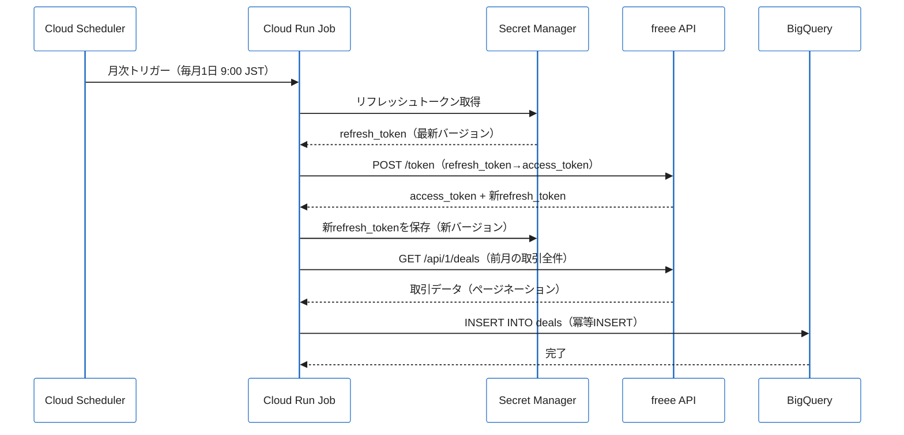
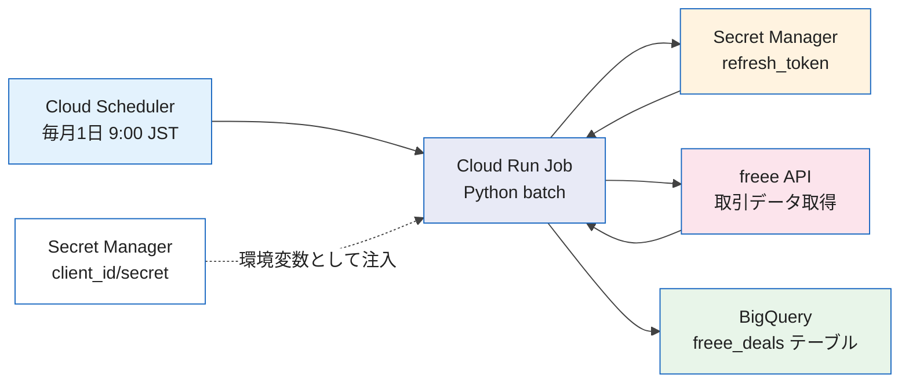

## 月末のルーティンがしんどい

合同会社を1人で運営していると、毎月末に決まってやることがあります。freeeを開いて、その月の取引データを確認し、インボイス対応の税率が正しく入力されているかをチェックし、BigQueryに手でCSVを貼り付けてダッシュボードを更新する。慣れれば2〜3時間で終わりますが、それでも月に一度「あ、またやらなきゃ」と思う瞬間のストレスは小さくありません。

freee APIとCloud Runを組み合わせた月次バッチ処理を構築したところ、この定型作業がほぼゼロになりました。この記事では、その実装パターンと、途中でハマったポイントを共有します。

以前に書いた記事（FastAPI + Discord Bot でリアルタイム操作する構成）とは異なり、この記事では **Cloud Run Jobs + Cloud Scheduler による定期バッチ** に絞って解説します。トークンの永続化やインボイス制度対応など、月次バッチ固有の課題にフォーカスしています。

## freee API の概要

### OAuth2 認証フロー

freee APIはOAuth2（Authorization Code Flow）を使います。初回だけブラウザで認可操作が必要ですが、一度取得したリフレッシュトークンを使い回すことで、以降は無人でアクセストークンを更新できます。

freee特有の仕様として、 **リフレッシュトークンは使い捨て** です。アクセストークンをリフレッシュするたびに新しいリフレッシュトークンが発行され、古いものは即座に無効化されます。バッチ処理では「更新後のリフレッシュトークンをどこに永続化するか」が最初の設計課題になります。

### APIの主な特徴と制約

| 項目 | 詳細 |
|:--|:--|
| アクセストークン有効期限 | 6時間（21,600秒） |
| レートリミット | 1分あたり300リクエスト |
| ページネーション | `offset` + `limit`（最大100件/ページ） |
| 日付フォーマット | `YYYY-MM-DD`（JST基準） |
| インボイス対応 | 2023年10月〜 税区分に対応フィールドが追加 |

## アーキテクチャ

月次バッチ処理のアーキテクチャは以下の通りです。



各コンポーネントの役割は明確です。Cloud Schedulerがcronで毎月1日の朝9時にCloud Run Jobを起動します。JobはSecret Managerからリフレッシュトークンを取得し、freee APIでアクセストークンを更新。前月の取引データを全件取得してBigQueryに書き込みます。トークン更新後は必ず新しいリフレッシュトークンをSecret Managerに保存し直します。

## 実装詳細

### 1. Secret Manager でのトークン永続化

Cloud Run Jobはステートレスなコンテナであるためメモリにトークンを保持できません。Secret Managerにリフレッシュトークンを保存し、実行のたびに読み書きします。

```python
from google.cloud import secretmanager
import json
import os

PROJECT_ID = os.environ["GCP_PROJECT_ID"]
SECRET_NAME = "freee-refresh-token"


def get_refresh_token() -> str:
    """Secret Managerから最新のリフレッシュトークンを取得する"""
    client = secretmanager.SecretManagerServiceClient()
    name = f"projects/{PROJECT_ID}/secrets/{SECRET_NAME}/versions/latest"
    response = client.access_secret_version(request={"name": name})
    return response.payload.data.decode("utf-8").strip()


def save_refresh_token(new_token: str) -> None:
    """新しいリフレッシュトークンをSecret Managerに保存する（新バージョンとして追記）"""
    client = secretmanager.SecretManagerServiceClient()
    parent = f"projects/{PROJECT_ID}/secrets/{SECRET_NAME}"
    payload = new_token.encode("utf-8")
    client.add_secret_version(
        request={
            "parent": parent,
            "payload": {"data": payload},
        }
    )
```

:::message
Secret Managerはバージョン管理機能を持っています。`add_secret_version`で新バージョンを追加すると、以前のバージョンは自動的に無効化されずに残ります。古いバージョンを自動削除したい場合は、Secret Managerの「バージョンの自動削除ポリシー」を設定するか、`destroy_secret_version`で明示的に削除してください。
:::

### 2. OAuth2 トークン取得・更新

```python
import requests
from datetime import datetime, timedelta, timezone
from dataclasses import dataclass

FREEE_CLIENT_ID = os.environ["FREEE_CLIENT_ID"]
FREEE_CLIENT_SECRET = os.environ["FREEE_CLIENT_SECRET"]
FREEE_COMPANY_ID = os.environ["FREEE_COMPANY_ID"]
JST = timezone(timedelta(hours=9))

TOKEN_URL = "https://accounts.secure.freee.co.jp/public_api/token"


@dataclass
class TokenInfo:
    access_token: str
    refresh_token: str
    expires_at: datetime


def refresh_access_token(refresh_token: str) -> TokenInfo:
    """リフレッシュトークンを使ってアクセストークンを取得する"""
    response = requests.post(
        TOKEN_URL,
        data={
            "grant_type": "refresh_token",
            "client_id": FREEE_CLIENT_ID,
            "client_secret": FREEE_CLIENT_SECRET,
            "refresh_token": refresh_token,
        },
        timeout=30,
    )
    response.raise_for_status()
    data = response.json()

    return TokenInfo(
        access_token=data["access_token"],
        # freeeはリフレッシュのたびに新しいリフレッシュトークンを返す
        refresh_token=data["refresh_token"],
        expires_at=datetime.now(JST) + timedelta(seconds=data.get("expires_in", 21600)),
    )
```

### 3. freee API の汎用リクエスト関数

```python
BASE_URL = "https://api.freee.co.jp/api/1"


def freee_get(endpoint: str, token: str, params: dict = None) -> dict:
    """freee API GETリクエストの共通処理"""
    if params is None:
        params = {}

    headers = {
        "Authorization": f"Bearer {token}",
        "Content-Type": "application/json",
    }

    response = requests.get(
        f"{BASE_URL}/{endpoint}",
        headers=headers,
        params=params,
        timeout=30,
    )

    if response.status_code == 429:
        # レートリミット超過時は60秒待機してリトライ
        import time
        time.sleep(60)
        response = requests.get(
            f"{BASE_URL}/{endpoint}",
            headers=headers,
            params=params,
            timeout=30,
        )

    response.raise_for_status()
    return response.json()
```

### 4. 前月の取引データを全件取得する

freee APIのページネーションは`offset`と`limit`で制御します。最大100件/ページなので、月次取引が多い場合はループが必要です。

```python
from typing import Generator


def fetch_deals_for_month(token: str, year: int, month: int) -> Generator[dict, None, None]:
    """指定月の取引データを全件取得するジェネレータ"""
    # 前月の開始・終了日を計算
    start_date = datetime(year, month, 1, tzinfo=JST).strftime("%Y-%m-%d")
    if month == 12:
        end_date = datetime(year + 1, 1, 1, tzinfo=JST) - timedelta(days=1)
    else:
        end_date = datetime(year, month + 1, 1, tzinfo=JST) - timedelta(days=1)
    end_date = end_date.strftime("%Y-%m-%d")

    offset = 0
    limit = 100

    while True:
        data = freee_get(
            "deals",
            token,
            params={
                "company_id": FREEE_COMPANY_ID,
                "start_issue_date": start_date,
                "end_issue_date": end_date,
                "offset": offset,
                "limit": limit,
            },
        )

        deals = data.get("deals", [])
        if not deals:
            break

        for deal in deals:
            yield deal

        # 総件数とオフセットで終了判定
        # total_countが取れない場合は取得件数がlimitより少なければ最終ページと判断
        meta = data.get("meta", {})
        total_count = meta.get("total_count")
        offset += limit
        if total_count is not None:
            if offset >= total_count:
                break
        else:
            # フォールバック: 取得件数がlimitより少なければ最終ページ
            if len(deals) < limit:
                break
```

### 5. BigQuery への書き込み

取得した取引データをBigQueryに書き込みます。冪等性を保つため、同じ月のデータを再実行しても重複しないよう`MERGE`または`DELETE + INSERT`パターンを使います。

```python
from google.cloud import bigquery
from google.cloud.bigquery import LoadJobConfig, WriteDisposition

BQ_DATASET = os.environ["BQ_DATASET"]
BQ_TABLE = "freee_deals"


def normalize_deal(deal: dict) -> dict:
    """freee取引データをBigQueryスキーマに合わせて正規化する"""
    return {
        "deal_id": deal["id"],
        "issue_date": deal["issue_date"],
        "due_date": deal.get("due_date"),
        "deal_type": deal["type"],  # "income" or "expense"
        "amount": deal["amount"],
        "company_id": deal["company_id"],
        "partner_id": deal.get("partner_id"),
        "description": deal.get("description", ""),
        # インボイス制度対応フィールド
        "qualified_invoice_status": deal.get("qualified_invoice_status"),
        "fetched_at": datetime.now(JST).isoformat(),
    }


def upsert_deals_to_bq(deals: list[dict], year: int, month: int) -> None:
    """取引データをBigQueryにupsertする（月単位の冪等INSERT）"""
    if not deals:
        return

    client = bigquery.Client()
    table_id = f"{PROJECT_ID}.{BQ_DATASET}.{BQ_TABLE}"
    rows = [normalize_deal(d) for d in deals]

    # 対象月のデータを一旦削除してから再挿入（冪等性の確保）
    delete_query = f"""
        DELETE FROM `{table_id}`
        WHERE FORMAT_DATE('%Y-%m', PARSE_DATE('%Y-%m-%d', issue_date)) = '{year:04d}-{month:02d}'
    """
    client.query(delete_query).result()

    # 行データをBigQueryにロード
    errors = client.insert_rows_json(table_id, rows)
    if errors:
        raise RuntimeError(f"BigQuery insert errors: {errors}")

    print(f"Upserted {len(rows)} deals for {year}-{month:02d}")
```

:::message
`insert_rows_json`はStreaming Insertであるため、BigQueryの無料枠を超えた場合に課金が発生します。月次バッチ程度の件数であればほぼ無料枠内ですが、気になる場合はLoad Jobを使う方法もあります。
:::

### 6. メインのバッチ処理

以上をまとめたバッチ処理のエントリーポイントです。

```python
from datetime import date


def main():
    """月次経費・取引データ取得バッチのメイン処理"""
    print(f"[{datetime.now(JST)}] 月次バッチ開始")

    # 前月を対象月として計算
    today = date.today()
    if today.month == 1:
        target_year, target_month = today.year - 1, 12
    else:
        target_year, target_month = today.year, today.month - 1

    print(f"対象月: {target_year}-{target_month:02d}")

    # 1. Secret Managerからリフレッシュトークンを取得
    current_refresh_token = get_refresh_token()

    # 2. アクセストークンを更新
    token_info = refresh_access_token(current_refresh_token)

    # 3. 新しいリフレッシュトークンを即座にSecret Managerに保存
    #    （ここで失敗するとトークンが失われるため最優先で実施）
    save_refresh_token(token_info.refresh_token)
    print("リフレッシュトークンを更新しました")

    # 4. 前月の取引データを全件取得
    deals = list(fetch_deals_for_month(token_info.access_token, target_year, target_month))
    print(f"取引データ取得完了: {len(deals)}件")

    # 5. BigQueryに書き込み
    upsert_deals_to_bq(deals, target_year, target_month)

    print(f"[{datetime.now(JST)}] 月次バッチ完了")


if __name__ == "__main__":
    main()
```

## 運用でハマったポイント

### 1. インボイス制度の税区分フィールドが複雑

2023年10月のインボイス制度開始以降、freee APIの取引データには`qualified_invoice_status`や`tax_code`などのフィールドが追加されました。しかし **既存の取引データには値が入っていない** 場合があります。

具体的には、インボイス制度開始前に登録された取引や、freeeの管理画面で手動入力した取引は、`qualified_invoice_status`が`null`または空文字になることがあります。これを「インボイス未対応」として扱うのか「データなし」として扱うのかで、集計ロジックが変わってきます。

対策として、BQでの集計クエリには`COALESCE`でデフォルト値を設定し、管理画面で確認が必要なレコードを別フラグで区別するようにしました。

```sql
SELECT
  issue_date,
  amount,
  COALESCE(qualified_invoice_status, 'unknown') AS invoice_status,
  CASE
    WHEN qualified_invoice_status IS NULL THEN TRUE
    ELSE FALSE
  END AS needs_manual_check
FROM `project.dataset.freee_deals`
WHERE FORMAT_DATE('%Y-%m', PARSE_DATE('%Y-%m-%d', issue_date)) = '2024-01'
```

### 2. リフレッシュトークン更新の順序が命取り

アクセストークン更新後、新しいリフレッシュトークンをSecret Managerに保存する前にバッチが失敗した場合、 **古いリフレッシュトークンはすでに無効化されている** ため、次回実行時に認証エラーが発生します。

これを防ぐため、トークン更新後は **BQへの書き込みより前に**Secret Managerへの保存を完了させる順序にしています（上記のmain関数のコメント参照）。万一BQへの書き込みが失敗しても、再実行すればトークンは使えます。BQへの書き込みは冪等なので、再実行に問題はありません。

### 3. レートリミットは思ったより厳しい

freee APIのレートリミットは1分あたり300リクエストです。月次バッチ1回で取引件数が300件を超える場合、ページネーションのリクエスト数が多くなりレートリミットに引っかかります。

取引データの取得は1ページ100件なので、300件超で4リクエスト以上になります。さらに添付ファイルや明細の詳細を個別取得する場合は急増します。

シンプルな対策として、リクエスト間に適切なスリープを挟みます。

```python
import time

def freee_get_with_rate_limit(endpoint: str, token: str, params: dict = None) -> dict:
    """レートリミット対応版GETリクエスト（リクエスト間に200msのスリープを入れる）"""
    result = freee_get(endpoint, token, params)
    time.sleep(0.2)  # 1分あたり最大300リクエスト → 200ms間隔で安全圏
    return result
```

### 4. Cloud Run Job の環境変数とSecret Managerの使い分け

Secret Managerはリフレッシュトークンのように **値が動的に更新される** ものに使います。`FREEE_CLIENT_ID`や`FREEE_CLIENT_SECRET`のように **変化しない機密情報** は、Cloud Run Jobの環境変数でSecret Managerを参照する設定にするとシンプルです。

```yaml
# Cloud Run Job の設定（cloud-run-job.yaml の一部）
env:
  - name: FREEE_CLIENT_ID
    valueFrom:
      secretKeyRef:
        name: freee-client-id
        key: latest
  - name: FREEE_CLIENT_SECRET
    valueFrom:
      secretKeyRef:
        name: freee-client-secret
        key: latest
  - name: GCP_PROJECT_ID
    value: "your-project-id"
  - name: BQ_DATASET
    value: "accounting"
```

`freee-refresh-token`だけはコードの中でSecret Manager SDKを直接操作します（更新が必要なため）。それ以外の静的シークレットは環境変数として注入するほうが、コードがシンプルになります。

### 5. タイムゾーンの罠

Cloud RunのデフォルトタイムゾーンはUTCです。freee APIは日付をJST基準で扱うため、UTCのまま`datetime.now()`を使うと日付がずれます。特に月末処理では「前月の最終日」の計算が1日ずれる可能性があります。

必ずJSTを明示的に指定してください。

```python
JST = timezone(timedelta(hours=9))

# 良い例
today_jst = datetime.now(JST).date()

# 悪い例（Cloud Run環境ではUTCになる）
today_utc = datetime.now().date()
```

Cloud Schedulerのタイムゾーン設定も忘れずに。ジョブの設定で`timeZone: Asia/Tokyo`を指定することで、毎月1日9:00 JSTにトリガーできます。

```yaml
# Cloud Scheduler の設定
schedule: "0 9 1 * *"
timeZone: "Asia/Tokyo"
```

## まとめ

freee API + Cloud Run Jobs の月次バッチ処理の構成をまとめると以下のようになります。



この構成の利点は3つあります。

**1. 完全な無人運用**: Cloud Schedulerが毎月自動でJobを起動するため、月末に「やらなきゃ」というタスクがなくなります。BQにデータが自動蓄積されるので、Looker StudioやBIツールで常に最新の月次集計を参照できます。

**2. トークン管理の安全性**: Secret Managerでリフレッシュトークンを永続化することで、コンテナの再起動に強い構成になります。以前の実装ではコンテナが予期せず再起動したときにトークンが失われるリスクがありましたが、この構成ではその問題を解決しています。

**3. インボイス制度への対応**: freee APIのインボイス関連フィールドをBQに保存することで、適格請求書の取得・集計・監査がSQLで行えます。税区分の確認作業がfreeeの管理画面を手動で見ることなく、クエリで一括確認できるようになります。

月次の経理作業が完全になくなるわけではありませんが、「データを集めて整理する」という部分は自動化できます。残った時間を、数字を見て判断する本来の作業に使えるようになりました。

## 参考資料

https://developer.freee.co.jp/reference/accounting/reference

https://cloud.google.com/run/docs/create-jobs

https://cloud.google.com/secret-manager/docs/reference/libraries

https://cloud.google.com/bigquery/docs/reference/libraries
