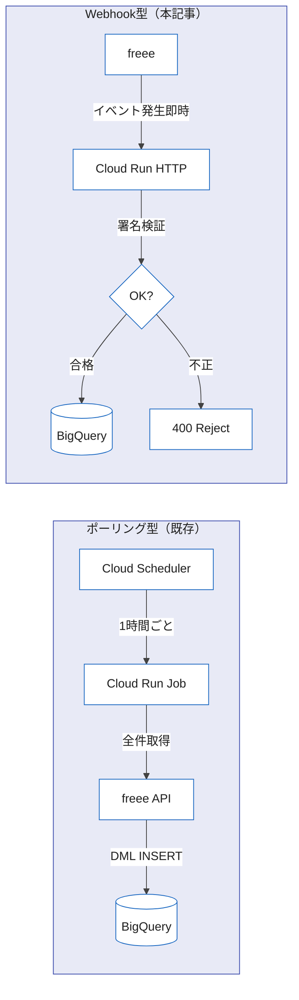
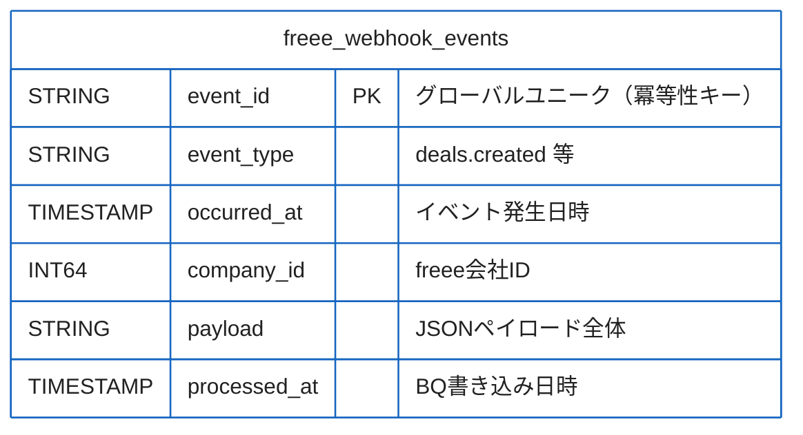

## はじめに

freee APIを使った経理自動化記事として、以前「[freee APIをCloud Runで動かして経理作業を月2時間に減らした話](https://zenn.dev/correlate_dev/articles/freee-api-cloud-run)」を書きました。あの記事では Cloud Scheduler で定期的にデータを取得するポーリング型の実装を紹介しました。

ポーリング型は設定が単純で安定していますが、1つ大きな弱点があります。「今起きたこと」をすぐには捉えられない、という点です。

請求書を発行した瞬間、取引先から入金があった瞬間、経費申請が承認された瞬間——これらのイベントをリアルタイムでBigQueryへ記録できれば、経営判断のスピードが変わります。

本記事では freee の Webhook 機能を使い、イベント発生の瞬間にCloud RunエンドポイントでデータをキャッチしてBigQueryへ蓄積するリアルタイムパターンを実装します。

### ポーリング vs Webhook の比較



| 観点 | ポーリング型 | Webhook型 |
|:--|:--|:--|
| トリガー | Cloud Scheduler（定期） | freee Webhook（イベント駆動） |
| データ到達レイテンシ | 数十分〜数時間 | 秒単位 |
| BQ書き込み方式 | TRUNCATE + DML INSERT | Storage Write API + MERGE |
| 主な用途 | 月次集計、一括同期 | リアルタイムアラート、即時分析 |
| 実装難易度 | 低 | 中（署名検証あり） |

---

## freee Webhook の設定

freee の管理画面でWebhookを有効化します。

1. freee管理画面 → 「アプリ連携」→「Webhook」を開く
2. 「Webhookエンドポイントを追加」をクリック
3. エンドポイントURL（後でCloud RunのURLを入力）を設定
4. 受信するイベントタイプにチェックを入れる
5. 「シークレット」をコピーしてSecret Managerへ保存する

:::message
Webhookシークレットは後述する署名検証に使います。環境変数またはGoogle Cloud Secret Managerで管理し、コードにハードコードしないでください。
:::

管理画面が現時点では英語表記の場合、「Developer settings」→「Webhooks」から設定できます。テスト送信機能もあるため、エンドポイントを実装後にまず疎通確認をすることをお勧めします。

---

## イベントタイプ一覧と受信データ構造

freeeのWebhookで受信できる主なイベントタイプは次のとおりです。

| イベントタイプ | 説明 |
|:--|:--|
| `deals.created` | 取引（収入・支出）が作成されたとき |
| `deals.updated` | 取引が更新されたとき |
| `invoices.created` | 請求書が作成されたとき |
| `invoices.updated` | 請求書が更新されたとき |
| `quotes.created` | 見積書が作成されたとき |
| `payments.created` | 支払いが作成されたとき |
| `expense_applications.created` | 経費申請が作成されたとき |
| `expense_applications.approved` | 経費申請が承認されたとき |

各イベントのペイロードは以下の共通フォーマットです。

```json
{
  "event_id": "evt_01HXXXXXXXXXXXXXXXXX",
  "event_type": "invoices.created",
  "occurred_at": "2026-02-23T10:00:00+09:00",
  "company_id": 123456,
  "data": {
    "id": 789,
    "invoice_number": "INV-2026-001",
    "partner_name": "株式会社サンプル"
  }
}
```

`event_id` はグローバルにユニークな文字列です。後述する冪等性の確保でこの値を使います。

---

## BigQuery テーブルスキーマ設計

受信データを格納するテーブルを設計します。生のペイロードをJSON文字列で保持しつつ、クエリしやすいカラムを合わせて持つ設計にします。



DDL（テーブル作成クエリ）は次のとおりです。

```sql
CREATE TABLE IF NOT EXISTS `your-project.workspace.freee_webhook_events`
(
  event_id     STRING    NOT NULL,
  event_type   STRING,
  occurred_at  TIMESTAMP,
  company_id   INT64,
  payload      STRING,
  processed_at TIMESTAMP
)
PARTITION BY DATE(occurred_at)
CLUSTER BY event_type;
```

`PARTITION BY DATE(occurred_at)` を設定することで、日付フィルタを使ったクエリコストを大幅に削減できます。

---

## Cloud Run エンドポイントの実装（FastAPI）

### 依存パッケージ

```
fastapi>=0.110.0
uvicorn>=0.29.0
google-cloud-bigquery>=3.17.0
google-cloud-bigquery-storage>=2.24.0
google-cloud-secret-manager>=2.18.0
```

### メインコード

```python
# main.py
import hashlib
import hmac
import json
import logging
import os
from datetime import datetime, timezone

from fastapi import FastAPI, HTTPException, Request
from google.cloud import bigquery, secretmanager

app = FastAPI()
logger = logging.getLogger(__name__)

BQ_PROJECT = os.environ["GCP_PROJECT"]
BQ_DATASET = os.environ.get("BQ_DATASET", "workspace")
BQ_TABLE = f"{BQ_PROJECT}.{BQ_DATASET}.freee_webhook_events"
SECRET_NAME = os.environ["FREEE_WEBHOOK_SECRET_NAME"]


def get_webhook_secret() -> str:
    """Secret ManagerからWebhookシークレットを取得する。"""
    client = secretmanager.SecretManagerServiceClient()
    name = f"projects/{BQ_PROJECT}/secrets/{SECRET_NAME}/versions/latest"
    response = client.access_secret_version(request={"name": name})
    return response.payload.data.decode("utf-8")


@app.post("/webhook/freee")
async def receive_freee_webhook(request: Request):
    """freeeからのWebhookを受信する。"""
    raw_body = await request.body()

    # 署名検証（セキュリティ上、必須）
    signature = request.headers.get("X-Freee-Signature", "")
    if not verify_signature(raw_body, signature):
        logger.warning("Webhook signature verification failed")
        raise HTTPException(status_code=400, detail="Invalid signature")

    # ペイロードのパース
    try:
        payload = json.loads(raw_body)
    except json.JSONDecodeError:
        raise HTTPException(status_code=400, detail="Invalid JSON")

    # BigQueryへ書き込み
    event_id = payload.get("event_id", "")
    event_type = payload.get("event_type", "")
    occurred_at_str = payload.get("occurred_at", "")
    company_id = payload.get("company_id")

    if not event_id or not event_type:
        raise HTTPException(status_code=400, detail="Missing required fields")

    try:
        occurred_at = datetime.fromisoformat(occurred_at_str)
    except (ValueError, TypeError):
        occurred_at = datetime.now(timezone.utc)

    success = upsert_event_to_bigquery(
        event_id=event_id,
        event_type=event_type,
        occurred_at=occurred_at,
        company_id=company_id,
        payload=raw_body.decode("utf-8"),
    )

    if not success:
        raise HTTPException(status_code=500, detail="Failed to write to BigQuery")

    logger.info("Webhook processed: event_id=%s type=%s", event_id, event_type)
    return {"status": "ok", "event_id": event_id}
```

---

## 署名検証の実装（HMAC-SHA256）

freeeは送信リクエストの `X-Freee-Signature` ヘッダーに HMAC-SHA256 署名を付与します。この署名を検証することで、リクエストが本物のfreeeから来たものであることを確認します。

```python
def verify_signature(raw_body: bytes, received_signature: str) -> bool:
    """
    HMAC-SHA256 でWebhookの署名を検証する。

    Args:
        raw_body: リクエストの生バイト列
        received_signature: X-Freee-Signatureヘッダーの値

    Returns:
        署名が一致すれば True、不正または空なら False
    """
    if not received_signature:
        return False

    try:
        secret = get_webhook_secret()
        expected = hmac.new(
            key=secret.encode("utf-8"),
            msg=raw_body,
            digestmod=hashlib.sha256,
        ).hexdigest()
    except Exception as e:
        logger.error("Failed to compute signature: %s", e)
        return False

    # タイミング攻撃対策: hmac.compare_digest を必ず使う
    return hmac.compare_digest(expected, received_signature)
```

:::message alert
署名の比較には必ず `hmac.compare_digest()` を使ってください。通常の文字列比較（`==`）はタイミング攻撃に脆弱です。`compare_digest` は文字列長に関係なく一定時間で比較します。
:::

---

## BigQuery へのストリーミング INSERT

### ストリーミングAPIではなく MERGE を使う理由

BigQueryには `insert_rows_json()` によるストリーミングAPIがありますが、書き込んだデータが最大90分間DMLクエリから見えないバッファ期間があります。この特性はリアルタイム分析の用途では問題になることがあります。

本実装では Storage Write API を通じてデータを書き込み、冪等性のために MERGE 文を使います。

```python
def upsert_event_to_bigquery(
    event_id: str,
    event_type: str,
    occurred_at: datetime,
    company_id: int | None,
    payload: str,
) -> bool:
    """
    BigQueryにWebhookイベントをMERGEでupsertする。

    event_idで重複を防ぎ、同じイベントが二重に届いても安全。
    """
    client = bigquery.Client()

    merge_query = """
    MERGE `{table}` AS target
    USING (
      SELECT
        @event_id      AS event_id,
        @event_type    AS event_type,
        @occurred_at   AS occurred_at,
        @company_id    AS company_id,
        @payload       AS payload,
        CURRENT_TIMESTAMP() AS processed_at
    ) AS source
    ON target.event_id = source.event_id
    WHEN NOT MATCHED THEN
      INSERT (event_id, event_type, occurred_at, company_id, payload, processed_at)
      VALUES (source.event_id, source.event_type, source.occurred_at,
              source.company_id, source.payload, source.processed_at)
    """.format(table=BQ_TABLE)

    job_config = bigquery.QueryJobConfig(
        query_parameters=[
            bigquery.ScalarQueryParameter("event_id", "STRING", event_id),
            bigquery.ScalarQueryParameter("event_type", "STRING", event_type),
            bigquery.ScalarQueryParameter("occurred_at", "TIMESTAMP", occurred_at),
            bigquery.ScalarQueryParameter("company_id", "INT64", company_id),
            bigquery.ScalarQueryParameter("payload", "STRING", payload),
        ]
    )

    try:
        job = client.query(merge_query, job_config=job_config)
        job.result()  # 完了まで待機
        return True
    except Exception as e:
        logger.error("BigQuery MERGE failed: %s", e)
        return False
```

:::message
SQLクエリへのパラメータ埋め込みには必ず `QueryJobConfig(query_parameters=[...])` を使ってください。f文字列でSQL文字列を組み立てるとSQLインジェクションのリスクがあります。
:::

---

## 冪等性の確保（event_id による重複除去）

Webhookシステムではネットワークの問題やfreee側のリトライにより、同じイベントが複数回届くことがあります。冪等性を確保することで、何回受信しても結果が同じになります。

前節の MERGE 文がその役割を担います。`ON target.event_id = source.event_id` の条件により、同一 `event_id` のレコードがすでに存在する場合は `INSERT` をスキップします（`WHEN MATCHED` ブランチを省略することで更新もしない）。

動作確認用のシンプルなテストを用意しておくと安心です。

```python
# tests/test_idempotency.py
def test_duplicate_event_is_ignored(bq_client_mock):
    """同じevent_idを2回書き込んでも1件しか存在しないことを確認する。"""
    event_id = "evt_test_duplicate_001"

    result1 = upsert_event_to_bigquery(
        event_id=event_id,
        event_type="invoices.created",
        occurred_at=datetime.now(timezone.utc),
        company_id=999,
        payload='{"test": true}',
    )
    result2 = upsert_event_to_bigquery(
        event_id=event_id,
        event_type="invoices.created",
        occurred_at=datetime.now(timezone.utc),
        company_id=999,
        payload='{"test": true}',
    )

    assert result1 is True
    assert result2 is True  # エラーにならない
    # 実際のBQクエリでは COUNT(*) = 1 になる
```

---

## イベント種別ごとの処理分岐

すべてのイベントを同じテーブルに入れるだけでなく、種別ごとに追加処理を入れることもできます。

```python
def handle_event_by_type(event_type: str, payload: dict) -> None:
    """イベント種別に応じた追加処理を実行する。"""
    handlers = {
        "invoices.created": handle_invoice_created,
        "invoices.updated": handle_invoice_updated,
        "payments.created": handle_payment_created,
        "deals.created": handle_deal_created,
    }

    handler = handlers.get(event_type)
    if handler:
        try:
            handler(payload)
        except Exception as e:
            # 個別ハンドラのエラーはログに残すが、
            # 共通テーブルへの書き込みはすでに完了しているので 200 を返す
            logger.error(
                "Handler error for %s: %s", event_type, e, exc_info=True
            )


def handle_invoice_created(payload: dict) -> None:
    """請求書作成時の追加処理（例: Discordへの通知）。"""
    invoice_data = payload.get("data", {})
    invoice_number = invoice_data.get("invoice_number", "")
    logger.info("New invoice created: %s", invoice_number)
    # ここで Discord Bot 通知などを追加できる


def handle_payment_created(payload: dict) -> None:
    """支払い作成時の追加処理（例: 入金アラート）。"""
    payment_data = payload.get("data", {})
    amount = payment_data.get("amount", 0)
    logger.info("Payment created: amount=%s", amount)
```

---

## エラーハンドリングとリトライ

freeeは HTTP 200 が返らない場合、Webhookをリトライ送信します。リトライ間隔や上限回数は freee の仕様に従います。

このため、エンドポイントは次の設計にします。

1. 署名検証エラー → 400 を返す（freeeに再送させない）
2. JSONパースエラー → 400 を返す（データが壊れているため再送不要）
3. BigQuery書き込みエラー → 500 を返す（freeeにリトライさせる）
4. ハンドラの追加処理エラー → 200 を返す（書き込みは成功しているため）

重い処理（freee APIへの追加取得など）はWebhook受信と同期させず、Cloud Tasksでバックグラウンド処理にする設計を推奨します。

```python
from google.cloud import tasks_v2
import json

TASK_QUEUE = os.environ.get("TASK_QUEUE", "freee-webhook-tasks")
CLOUD_RUN_URL = os.environ["CLOUD_RUN_URL"]


def enqueue_event_processing(event_id: str, event_type: str, payload: dict) -> None:
    """重い処理はCloud Tasksに委譲して即座に200を返す。"""
    client = tasks_v2.CloudTasksClient()
    parent = client.queue_path(BQ_PROJECT, "asia-northeast1", TASK_QUEUE)

    task_payload = json.dumps(
        {"event_id": event_id, "event_type": event_type, "payload": payload}
    ).encode("utf-8")

    task = {
        "http_request": {
            "http_method": tasks_v2.HttpMethod.POST,
            "url": f"{CLOUD_RUN_URL}/tasks/process-event",
            "body": task_payload,
            "headers": {"Content-Type": "application/json"},
            "oidc_token": {
                "service_account_email": os.environ["SERVICE_ACCOUNT_EMAIL"]
            },
        }
    }

    client.create_task(request={"parent": parent, "task": task})
```

:::message
Cloud TasksのOIDCトークンを使うことで、内部エンドポイント（`/tasks/`プレフィックス）への認証済みアクセスが実現します。Cloud Runの外部エンドポイント（`/webhook/freee`）は freee からの POST を受けるため公開しておく必要がありますが、内部処理エンドポイントは認証保護できます。
:::

---

## デプロイ設定

### Dockerfile

```dockerfile
FROM python:3.12-slim

WORKDIR /app
COPY requirements.txt .
RUN pip install --no-cache-dir -r requirements.txt

COPY . .

CMD ["uvicorn", "main:app", "--host", "0.0.0.0", "--port", "8080"]
```

### Cloud Run デプロイコマンド

```bash
gcloud run deploy freee-webhook-receiver \
  --source . \
  --region asia-northeast1 \
  --allow-unauthenticated \
  --set-env-vars GCP_PROJECT=your-project-id \
  --set-env-vars BQ_DATASET=workspace \
  --set-env-vars FREEE_WEBHOOK_SECRET_NAME=freee-webhook-secret \
  --set-env-vars CLOUD_RUN_URL=https://freee-webhook-receiver-xxxxxxxxxx-an.a.run.app \
  --set-env-vars SERVICE_ACCOUNT_EMAIL=your-sa@your-project.iam.gserviceaccount.com \
  --service-account your-sa@your-project.iam.gserviceaccount.com \
  --min-instances 0 \
  --max-instances 3 \
  --memory 512Mi \
  --timeout 30
```

### 必要な IAM 権限（サービスアカウント）

| 権限 | 用途 |
|:--|:--|
| `roles/bigquery.dataEditor` | BQテーブルへのMERGE実行 |
| `roles/bigquery.jobUser` | BigQueryジョブの実行 |
| `roles/secretmanager.secretAccessor` | Webhookシークレットの読み取り |
| `roles/cloudtasks.enqueuer` | Cloud Tasksへのタスク追加 |

### Secret Manager にシークレットを登録

```bash
# Webhookシークレットを Secret Manager に登録
echo -n "your-webhook-secret-from-freee-dashboard" | \
  gcloud secrets create freee-webhook-secret \
    --data-file=- \
    --replication-policy=automatic
```

:::message alert
`your-webhook-secret-from-freee-dashboard` の部分には freee管理画面で発行された実際のシークレット値を入れてください。このシークレット値をGitやコードに直接書かないでください。
:::

デプロイ後に取得したCloud RunのURLを freee管理画面のWebhookエンドポイント設定に入力し、テスト送信で疎通を確認します。

---

## まとめ

freee Webhook × BigQueryのリアルタイム同期パターンを実装しました。実装のポイントを整理します。

署名検証は必須です。HMAC-SHA256で署名を検証し、比較には `hmac.compare_digest()` を使います。不正なリクエストには 400 を返してfreeeに再送させないことが重要です。

冪等性は `event_id` によるMERGEで確保します。ネットワーク障害やfreeeのリトライで同じイベントが複数回届いても、BigQueryに重複レコードが積まれることはありません。

5秒以内のレスポンスを守ります。freeeの仕様でタイムアウトになるとリトライが発生します。重い処理はCloud Tasksに委譲してWebhookエンドポイントは素早くレスポンスを返す設計にします。

ストリーミングAPIは使いません。`insert_rows_json()` のバッファ期間（最大90分）の問題を避けるため、パラメータ化クエリによるMERGE文で書き込みます。

ポーリング型バッチとWebhookを組み合わせることで、日次集計は既存バッチに任せつつ、リアルタイムアラートや即時ダッシュボードをWebhookで実現するハイブリッド構成が現実的な落とし所です。

freee APIの OAuth2認証とCloud Runへのデプロイ手順については「[freee APIをCloud Runで動かして経理作業を月2時間に減らした話](https://zenn.dev/correlate_dev/articles/freee-api-cloud-run)」を参照してください。本記事はWebhook受信に特化しているため、認証フローはそちらで解説しています。
