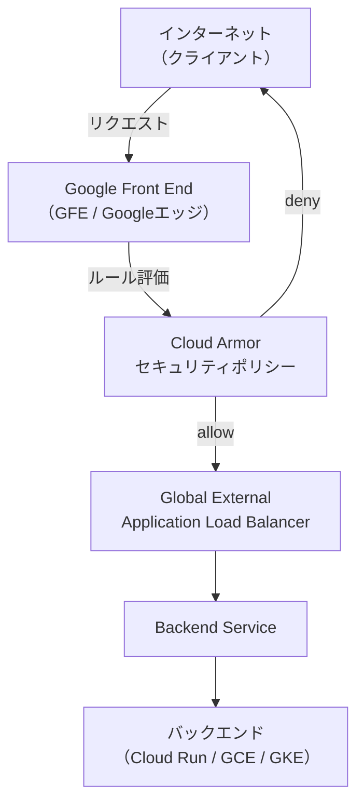
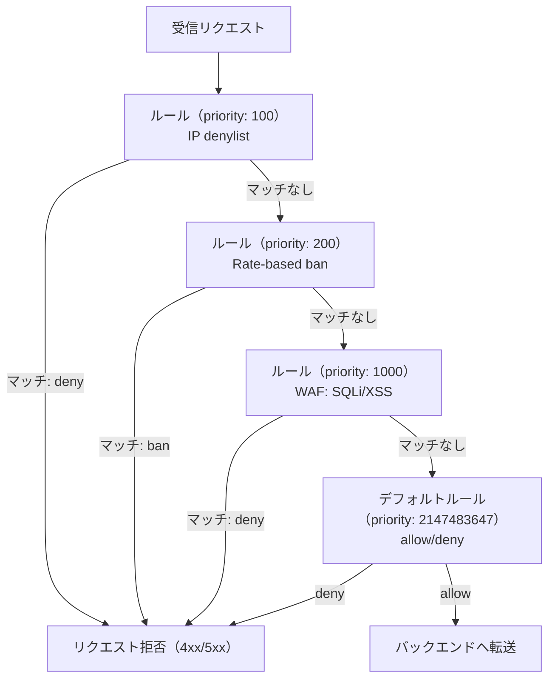
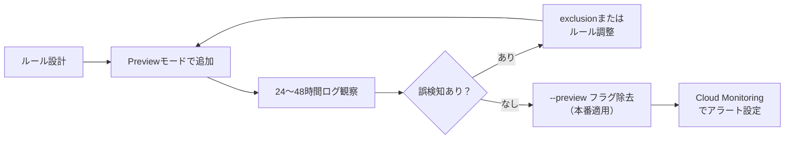

## はじめに

Webアプリケーションへの攻撃は年々高度化・多様化しています。SQLインジェクション、クロスサイトスクリプティング（XSS）、DDoS攻撃など、これらの脅威からアプリケーションを守るためにWAF（Web Application Firewall）の導入は実質的な必須要件になっています。

Google Cloud では、Cloud Armor がマネージドWAFの役割を担います。Cloud Armor は Cloud Load Balancing と統合して動作し、Googleのグローバルネットワークのエッジ（PoP）でトラフィックを検査・フィルタリングします。バックエンドにリクエストが到達する前に悪意のあるトラフィックを遮断できるため、アプリケーションサーバーの負荷軽減にも直結します。

この記事では、Cloud Armor を使ったWAF構築の実践的な手順を解説します。IPフィルタリングから始まり、OWASP Top 10 対応の事前設定ルール、レート制限、CEL式によるカスタムルール、そして Terraform による Infrastructure as Code まで、実務で使えるレベルの内容を網羅します。

## Cloud Armor のアーキテクチャ

### ロードバランサーとの関係

Cloud Armor はスタンドアロンの製品ではなく、Cloud Load Balancing のバックエンドサービス（Backend Service）にセキュリティポリシーをアタッチする形で動作します。



Cloud Armor のルール評価はGoogleのエッジ（GFE）で行われます。deny されたリクエストはバックエンドサービスには一切転送されません。これにより、DDoS 攻撃のトラフィックがバックエンドに到達しないため、アプリケーションサーバーへの負荷を根本的に排除できます。

### 対応するロードバランサーの種類

Cloud Armor が利用できるロードバランサーは以下のとおりです。

| ロードバランサー種別 | Cloud Armor 対応 | セキュリティポリシー種別 |
|---|---|---|
| Global External Application LB | 対応 | CLOUD_ARMOR |
| Regional External Application LB | 対応 | CLOUD_ARMOR_REGIONAL |
| Classic Application LB | 対応 | CLOUD_ARMOR |
| Network LB (Pass-through) | 対応（Network Edge Policy） | CLOUD_ARMOR_NETWORK |
| Internal Application LB | 非対応 | - |

Global External Application LB では、すべてのルール評価がGoogleのエッジPoPで行われます。Regional External Application LB では、プロキシサブネットを介した評価になります。本記事では最も一般的な Global External Application LB を前提に説明します。

### セキュリティポリシーの評価フロー



Cloud Armor は priority の数値が小さいルールから順に評価し、最初にマッチしたルールのアクションを実行します。それ以降のルールは評価されません（最初マッチ原則）。デフォルトルールの priority は 2147483647（Int32最大値）であり、どのルールにもマッチしなかったリクエストに適用されます。

## セキュリティポリシーの基本

### ポリシーの作成

まず、セキュリティポリシーを作成します。

```bash
# セキュリティポリシーを作成（デフォルトはdeny）
gcloud compute security-policies create my-waf-policy \
  --description "本番環境WAFポリシー" \
  --type CLOUD_ARMOR

# デフォルトルールをdeny-403に設定
gcloud compute security-policies rules update 2147483647 \
  --security-policy my-waf-policy \
  --action deny-403 \
  --src-ip-ranges "*"
```

デフォルトルールのアクションは `allow` か `deny-403` か、どちらを選ぶかはポリシーの設計思想によります。

- allowlist 型（デフォルト deny）: 許可したIPやルールにマッチしたもののみ通過させる。厳格だが管理コストが高い
- denylist 型（デフォルト allow）: 拒否したいIPやパターンを明示的にブロックする。一般的なWebサービスに向いている

### バックエンドサービスへのアタッチ

作成したポリシーをバックエンドサービスにアタッチします。

```bash
gcloud compute backend-services update my-backend-service \
  --security-policy my-waf-policy \
  --global
```

これで、バックエンドサービスに到達するすべてのリクエストが Cloud Armor で評価されます。1つのバックエンドサービスには1つのセキュリティポリシーしかアタッチできませんが、1つのポリシーを複数のバックエンドサービスで共有することは可能です。

## IP allowlist / denylist の実装

### 特定IPをブロックする（denylist）

攻撃元IPやスキャナーとして知られているIPレンジをブロックします。

```bash
# 単一IPをブロック
gcloud compute security-policies rules create 100 \
  --security-policy my-waf-policy \
  --description "不審なIPをブロック" \
  --src-ip-ranges "203.0.113.0/24","198.51.100.5/32" \
  --action deny-403

# 複数のルールを一括で確認
gcloud compute security-policies describe my-waf-policy
```

### 社内IPのみ許可する（allowlist）

管理画面やAPIエンドポイントを社内IP限定にする場合、デフォルトルールを deny にした上で許可ルールを追加します。

```bash
# デフォルトをdenyに変更
gcloud compute security-policies rules update 2147483647 \
  --security-policy my-admin-policy \
  --action deny-403 \
  --src-ip-ranges "*"

# 社内IPを許可
gcloud compute security-policies rules create 100 \
  --security-policy my-admin-policy \
  --description "社内IPからのアクセスを許可" \
  --src-ip-ranges "203.0.113.10/32","10.0.0.0/8" \
  --action allow
```

### IPリストのメンテナンス

denylist に大量のIPを追加する場合、1つのルールにつき最大で10個のIPレンジまでしか指定できないことに注意が必要です。多数のIPを管理する場合は Named IP List（Google Threat Intelligence）を活用するか、複数ルールを連番で作成します。

```bash
# ルールの既存src-ip-rangesを上書き更新
gcloud compute security-policies rules update 100 \
  --security-policy my-waf-policy \
  --src-ip-ranges "203.0.113.0/24","198.51.100.0/24","192.0.2.0/24"
```

## 事前設定ルール（OWASP Top 10・SQLi・XSS）

### 事前設定ルールの概要

Cloud Armor の事前設定ルールは、ModSecurity Core Rule Set（CRS）3.3.2 に基づいて構成されています。OWASP Top 10 の主要な攻撃パターンをカバーしており、個別のシグネチャを自前で記述することなく、一行のコマンドで適用できます。

主要な事前設定ルールセットは以下のとおりです。

| ルールセット名 | 保護対象 |
|---|---|
| sqli-v33-stable | SQLインジェクション |
| xss-v33-stable | クロスサイトスクリプティング |
| lfi-v33-stable | ローカルファイルインクルージョン |
| rfi-v33-stable | リモートファイルインクルージョン |
| rce-v33-stable | リモートコード実行 |
| methodenforcement-v33-stable | 不正HTTPメソッド |
| scannerdetection-v33-stable | スキャナー検出 |
| protocolattack-v33-stable | プロトコル攻撃 |
| php-v33-stable | PHP固有の攻撃 |
| sessionfixation-v33-stable | セッション固定攻撃 |
| java-v33-stable | Java固有の攻撃（Log4Shell等） |
| nodejs-v33-stable | Node.js固有の攻撃 |

### sensitivity（感度）の考え方

各ルールセットには sensitivity（感度）パラメーターがあります。これは OWASP CRS の paranoia level に対応しており、1〜4 の範囲で設定します。

- sensitivity 1: 高信頼度のシグネチャのみ有効化。誤検知（false positive）が少ない。最初はここから始める
- sensitivity 2: より広範な検出パターンを有効化。誤検知がやや増加する
- sensitivity 3: さらに広範。一部のレジティマスなリクエストが遮断される可能性がある
- sensitivity 4: 最も広範。誤検知が多くなるため、本番環境での直接適用は非推奨

### SQLi と XSS 対策の設定

```bash
# SQLインジェクション対策（sensitivity 1）
gcloud compute security-policies rules create 1000 \
  --security-policy my-waf-policy \
  --description "SQLインジェクション対策" \
  --expression "evaluatePreconfiguredWaf('sqli-v33-stable', {'sensitivity': 1})" \
  --action deny-403

# XSS対策（sensitivity 1）
gcloud compute security-policies rules create 1001 \
  --security-policy my-waf-policy \
  --description "XSS対策" \
  --expression "evaluatePreconfiguredWaf('xss-v33-stable', {'sensitivity': 1})" \
  --action deny-403

# LFI対策（sensitivity 1）
gcloud compute security-policies rules create 1002 \
  --security-policy my-waf-policy \
  --description "ローカルファイルインクルージョン対策" \
  --expression "evaluatePreconfiguredWaf('lfi-v33-stable', {'sensitivity': 1})" \
  --action deny-403
```

### 特定シグネチャの除外（Exclusion）

事前設定ルールを適用すると、アプリケーション固有のパラメーターや正規のリクエストが誤検知される場合があります。そのような場合は、特定のシグネチャや対象フィールドを除外できます。

```bash
# 特定のリクエストフィールドをSQLiチェックから除外
# （例: /api/search の q パラメーターはSQLiチェックを除外）
gcloud compute security-policies rules create 1000 \
  --security-policy my-waf-policy \
  --description "SQLiチェック（/api/search の q パラメーターは除外）" \
  --expression "evaluatePreconfiguredWaf('sqli-v33-stable', {'sensitivity': 1, 'opt_out_rule_ids': ['owasp-crs-v030301-id942110-sqli']})" \
  --action deny-403
```

除外設定は本番投入前に必ず Preview モードで動作確認してください（後述）。

## レート制限（Rate-based ban）の設定

### throttle と rate-based ban の違い

Cloud Armor のレート制限には2種類のアクションがあります。

| アクション | 動作 |
|---|---|
| throttle | しきい値を超えたリクエストを deny するが、バンはしない。次の時間窓では再び通す |
| rate-based-ban | しきい値を超えたソースを一定期間（ban_duration_sec）完全にブロックする |

ブルートフォース攻撃対策にはrate-based ban が適しており、API過負荷対策には throttle が向いています。

### throttle ルールの設定

```bash
# ログインエンドポイントへのリクエストを1分間に20回に制限
gcloud compute security-policies rules create 500 \
  --security-policy my-waf-policy \
  --description "ログインエンドポイントのレート制限" \
  --expression "request.path.matches('/login')" \
  --action throttle \
  --rate-limit-threshold-count 20 \
  --rate-limit-threshold-interval-sec 60 \
  --conform-action allow \
  --exceed-action deny-429 \
  --enforce-on-key IP
```

### rate-based ban ルールの設定

```bash
# 1分間に100リクエストを超えたIPを10分間バン
gcloud compute security-policies rules create 400 \
  --security-policy my-waf-policy \
  --description "DDoS対策レートバン" \
  --src-ip-ranges "*" \
  --action rate-based-ban \
  --rate-limit-threshold-count 100 \
  --rate-limit-threshold-interval-sec 60 \
  --ban-duration-sec 600 \
  --ban-threshold-count 1000 \
  --ban-threshold-interval-sec 600 \
  --conform-action allow \
  --exceed-action deny-429 \
  --enforce-on-key IP
```

`--enforce-on-key` には以下のオプションを指定できます。

| キー | 説明 |
|---|---|
| IP | クライアントIPアドレスごとにカウント |
| ALL | すべてのリクエストをまとめてカウント（グローバル制限） |
| HTTP_HEADER | 指定したHTTPヘッダー値ごとにカウント |
| XFF_IP | X-Forwarded-For ヘッダーのIPでカウント |
| HTTP_COOKIE | 指定したCookieの値ごとにカウント |
| HTTP_PATH | リクエストパスごとにカウント |

### rate-based ban のパラメーター設計例

実務では以下のような設計が参考になります。

```bash
# パブリックAPIの過負荷対策
# 1分間に200リクエストでスロットル、5分間に600リクエストでバン
gcloud compute security-policies rules create 300 \
  --security-policy my-waf-policy \
  --description "API レート制限" \
  --expression "request.path.matches('/api/.*')" \
  --action rate-based-ban \
  --rate-limit-threshold-count 200 \
  --rate-limit-threshold-interval-sec 60 \
  --ban-duration-sec 300 \
  --ban-threshold-count 600 \
  --ban-threshold-interval-sec 300 \
  --conform-action allow \
  --exceed-action deny-429 \
  --enforce-on-key IP
```

## カスタムルール（CEL 式）の実装

### CEL 式の基本

Cloud Armor のカスタムルールは Common Expression Language（CEL）のサブセットを使用します。主要な属性として以下が利用可能です。

| 属性 | 型 | 説明 |
|---|---|---|
| origin.ip | string | クライアントIPアドレス |
| origin.region_code | string | クライアントのリージョンコード（ISO 3166-1） |
| request.path | string | リクエストパス |
| request.query | string | クエリストリング |
| request.method | string | HTTPメソッド |
| request.headers | map | リクエストヘッダー |
| request.body | string | リクエストボディ（最大64KB） |

### 地域制限ルール

日本向けサービスで海外からのアクセスをブロックしたい場合は、origin.region_code を使います。

```bash
# 日本・米国・英国以外からのアクセスをブロック
gcloud compute security-policies rules create 200 \
  --security-policy my-waf-policy \
  --description "許可リージョン以外からのアクセスをブロック" \
  --expression "!(['JP', 'US', 'GB'].contains(origin.region_code))" \
  --action deny-403
```

### ヘッダーチェックルール

User-Agent や特定のヘッダーを検査するルールです。

```bash
# 管理者パスへのアクセスに特定ヘッダーを要求
gcloud compute security-policies rules create 150 \
  --security-policy my-waf-policy \
  --description "管理パスへのアクセスは内部ヘッダー必須" \
  --expression "request.path.matches('/admin/.*') && !request.headers['x-internal-token'].matches('.*')" \
  --action deny-403

# 既知のスキャナーのUser-Agentをブロック
gcloud compute security-policies rules create 180 \
  --security-policy my-waf-policy \
  --description "スキャナーUser-Agentをブロック" \
  --expression "request.headers['user-agent'].lower().matches('.*(masscan|zgrab|nikto|sqlmap).*')" \
  --action deny-403
```

### パスベースのルール

特定のパスパターンへのアクセスを制御します。

```bash
# .env や設定ファイルへのアクセスをブロック
gcloud compute security-policies rules create 190 \
  --security-policy my-waf-policy \
  --description "機密ファイルへのアクセスをブロック" \
  --expression "request.path.matches('.*\\.(env|git|config|bak|sql|log)$') || request.path.matches('.*\\/\\.git\\/.*')" \
  --action deny-404

# GETとPOST以外のメソッドをブロック（特定パスのみ）
gcloud compute security-policies rules create 195 \
  --security-policy my-waf-policy \
  --description "危険なHTTPメソッドをブロック" \
  --expression "request.path.matches('/api/.*') && !(['GET', 'POST', 'PUT', 'DELETE', 'PATCH', 'OPTIONS'].contains(request.method))" \
  --action deny-405
```

## Preview モードでの安全な検証フロー

### Preview モードとは

Preview モードは、ルールをアクティブに適用せず、マッチしたリクエストをログに記録するだけのモードです。新しいルールが本番トラフィックに与える影響を事前に確認できます。

```bash
# 新しいルールをPreviewモードで追加
gcloud compute security-policies rules create 1000 \
  --security-policy my-waf-policy \
  --description "SQLiブロック（Preview確認中）" \
  --expression "evaluatePreconfiguredWaf('sqli-v33-stable', {'sensitivity': 2})" \
  --action deny-403 \
  --preview

# 既存ルールをPreviewモードに変更
gcloud compute security-policies rules update 1000 \
  --security-policy my-waf-policy \
  --preview
```

### Preview モードのログ確認

Cloud Logging に記録されたログを確認して、誤検知の有無を調べます。

```bash
# Cloud Logging でPreviewモードのルールマッチを確認
gcloud logging read \
  'resource.type="http_load_balancer" AND jsonPayload.enforcedSecurityPolicy.outcome="PREVIEW"' \
  --limit 50 \
  --format json
```

### 検証フローの推奨手順



本番で影響が大きいルールほど、Preview 期間を長く取ることが重要です。特に WAF ルール（SQLi/XSS）は最低24時間のPreview 確認を推奨します。

### Preview モードの解除

問題がないことを確認した後、`--preview` フラグを外して本番適用します。

```bash
# Previewモードを解除して本番適用
gcloud compute security-policies rules update 1000 \
  --security-policy my-waf-policy \
  --no-preview
```

## Adaptive Protection の設定

### Adaptive Protection とは

Adaptive Protection は、機械学習を使ってアプリケーション固有のトラフィックパターンを学習し、L7 DDoS 攻撃を自動検知・緩和する機能です。通常のシグネチャベースのWAFでは対応できない、大量の正規リクエストに見せかけた攻撃（HTTP flood）の検出に特に有効です。

### 有効化の手順

```bash
# セキュリティポリシーに対してAdaptive Protectionを有効化
gcloud compute security-policies update my-waf-policy \
  --enable-layer7-ddos-defense

# Granular models（詳細なアプリケーション学習）を有効化（GA機能）
gcloud compute security-policies update my-waf-policy \
  --enable-layer7-ddos-defense \
  --layer7-ddos-defense-rule-visibility ENHANCED
```

### Adaptive Protection のアラート設定

Adaptive Protection が攻撃を検知すると、Cloud Logging にアラートが書き込まれます。これを Pub/Sub 経由で通知したり、検出されたルールを自動的に有効化したりすることができます。

Adaptive Protection が提案するルールは、自動適用ではなく手動レビューを経てから有効化することを推奨します。攻撃トラフィックと通常トラフィックの分離が不完全な場合、正規ユーザーへの影響が出る可能性があるためです。

```bash
# Adaptive Protectionのイベントをログから確認
gcloud logging read \
  'resource.type="network_security_policy" AND protoPayload.serviceName="networksecurity.googleapis.com"' \
  --limit 20
```

### Auto-Deploy（自動デプロイ）の設定

Adaptive Protection はアタック検知時に自動でルールをデプロイする Auto-Deploy 機能も持っています。

```bash
# Auto-Deployを有効化（load_thresholdとconfidence_thresholdで感度を調整）
gcloud compute security-policies update my-waf-policy \
  --layer7-ddos-defense-auto-deploy-load-threshold 0.7 \
  --layer7-ddos-defense-auto-deploy-confidence-threshold 0.8 \
  --layer7-ddos-defense-auto-deploy-impacted-baseline-threshold 0.01
```

Auto-Deploy は `load_threshold` と `confidence_threshold` が両方の条件を満たしたときにのみ発動します。初期運用段階では confidence を 0.95 以上に設定して誤検知を最小化することを推奨します。

## ロギングとモニタリング

### リクエストロギングの有効化

Cloud Armor のログは Cloud HTTP(S) Load Balancing のログと統合されています。デフォルトではロギングは無効なため、バックエンドサービスごとに有効化が必要です。

```bash
# バックエンドサービスのロギングを有効化（サンプリングレート100%）
gcloud compute backend-services update my-backend-service \
  --enable-logging \
  --logging-sample-rate 1.0 \
  --global
```

チューニング中はサンプリングレートを 1.0（100%）に設定し、安定したら 0.1〜0.5 程度に下げてコストを最適化します。

### Verbose Logging の活用

詳細なルールマッチ情報を取得するには Verbose Logging を有効化します。

```bash
gcloud compute security-policies update my-waf-policy \
  --log-level VERBOSE
```

Verbose Logging を有効にすると、各リクエストに対してどのルールがマッチしたか、WAFルールのどのシグネチャにマッチしたかまで詳細にログが出力されます。

### Cloud Logging クエリ例

```bash
# セキュリティポリシーでブロックされたリクエストを一覧
gcloud logging read \
  'resource.type="http_load_balancer"
   AND jsonPayload.enforcedSecurityPolicy.outcome="DENY"
   AND timestamp >= "2026-01-01T00:00:00Z"' \
  --limit 100 \
  --format "table(timestamp, jsonPayload.enforcedSecurityPolicy.name, jsonPayload.enforcedSecurityPolicy.priority, httpRequest.remoteIp)"

# 特定のIPからのアクセスを検索
gcloud logging read \
  'resource.type="http_load_balancer"
   AND httpRequest.remoteIp="203.0.113.1"' \
  --limit 50
```

### Cloud Monitoring アラート

Cloud Armor のメトリクスは Cloud Monitoring に 1 分間隔でエクスポートされます。以下のメトリクスが利用できます。

| メトリクス | 説明 |
|---|---|
| networksecurity.googleapis.com/https/request_count | ルールごとのリクエスト数 |
| loadbalancing.googleapis.com/https/request_count | ロードバランサーを通過したリクエスト数 |

ブロック数が急増した場合にアラートを飛ばす設定をしておくと、攻撃の早期検知ができます。

## Terraform での管理

### 基本構成

Cloud Armor のリソースを Terraform で管理することで、セキュリティポリシーをコードとしてレビュー・バージョン管理できます。

```hcl
# modules/cloud-armor/main.tf

resource "google_compute_security_policy" "waf_policy" {
  name        = var.policy_name
  description = "本番環境WAFポリシー"
  type        = "CLOUD_ARMOR"

  # Adaptive Protection の有効化
  adaptive_protection_config {
    layer_7_ddos_defense_config {
      enable          = true
      rule_visibility = "ENHANCED"
    }
  }

  # デフォルトルール（allowlistモードの場合はdeny-403）
  rule {
    action   = "allow"
    priority = "2147483647"
    match {
      versioned_expr = "SRC_IPS_V1"
      config {
        src_ip_ranges = ["*"]
      }
    }
    description = "デフォルト: 全トラフィックを許可"
  }
}

# IP denylistルール
resource "google_compute_security_policy_rule" "ip_denylist" {
  security_policy = google_compute_security_policy.waf_policy.name
  priority        = 100
  action          = "deny(403)"
  description     = "不審なIPをブロック"
  match {
    versioned_expr = "SRC_IPS_V1"
    config {
      src_ip_ranges = var.blocked_ip_ranges
    }
  }
}

# rate-based ban ルール
resource "google_compute_security_policy_rule" "rate_based_ban" {
  security_policy = google_compute_security_policy.waf_policy.name
  priority        = 400
  action          = "rate_based_ban"
  description     = "DDoS対策レートバン"
  match {
    versioned_expr = "SRC_IPS_V1"
    config {
      src_ip_ranges = ["*"]
    }
  }
  rate_limit_options {
    conform_action = "allow"
    exceed_action  = "deny(429)"
    enforce_on_key = "IP"
    rate_limit_threshold {
      count        = 100
      interval_sec = 60
    }
    ban_duration_sec = 600
    ban_threshold {
      count        = 1000
      interval_sec = 600
    }
  }
}

# SQLインジェクション対策
resource "google_compute_security_policy_rule" "sqli_rule" {
  security_policy = google_compute_security_policy.waf_policy.name
  priority        = 1000
  action          = "deny(403)"
  description     = "SQLインジェクション対策 (sensitivity 1)"
  preview         = var.preview_mode
  match {
    expr {
      expression = "evaluatePreconfiguredWaf('sqli-v33-stable', {'sensitivity': 1})"
    }
  }
}

# XSS対策
resource "google_compute_security_policy_rule" "xss_rule" {
  security_policy = google_compute_security_policy.waf_policy.name
  priority        = 1001
  action          = "deny(403)"
  description     = "XSS対策 (sensitivity 1)"
  preview         = var.preview_mode
  match {
    expr {
      expression = "evaluatePreconfiguredWaf('xss-v33-stable', {'sensitivity': 1})"
    }
  }
}

# バックエンドサービスへのアタッチ
resource "google_compute_backend_service" "main" {
  name                  = var.backend_service_name
  protocol              = "HTTP"
  port_name             = "http"
  timeout_sec           = 30
  security_policy       = google_compute_security_policy.waf_policy.id
  load_balancing_scheme = "EXTERNAL_MANAGED"

  log_config {
    enable      = true
    sample_rate = 1.0
  }

  backend {
    group = var.instance_group
  }
}
```

```hcl
# modules/cloud-armor/variables.tf

variable "policy_name" {
  type        = string
  description = "セキュリティポリシー名"
}

variable "blocked_ip_ranges" {
  type        = list(string)
  description = "ブロックするIPレンジのリスト"
  default     = []
}

variable "preview_mode" {
  type        = bool
  description = "WAFルールをPreviewモードで動作させるか"
  default     = true
}

variable "backend_service_name" {
  type        = string
  description = "バックエンドサービス名"
}

variable "instance_group" {
  type        = string
  description = "バックエンドのインスタンスグループのURL"
}
```

### Terraform を使った priority 管理のコツ

ルールの priority を Terraform で管理する場合、変数ファイルや locals で一元管理すると変更が楽になります。

```hcl
# locals.tf

locals {
  rule_priorities = {
    ip_denylist        = 100
    geo_restriction    = 200
    scanner_block      = 300
    rate_based_ban     = 400
    login_throttle     = 500
    sqli               = 1000
    xss                = 1001
    lfi                = 1002
  }
}
```

## まとめ

Cloud Armor を使ったWAF構築の要点を整理します。

| 機能 | 用途 | 推奨設定 |
|---|---|---|
| IP denylist | 既知の攻撃元・スキャナーのブロック | priority 100台、随時更新 |
| Geo restriction | 不要なリージョンからのアクセス遮断 | priority 200台 |
| rate-based ban | DDoS・ブルートフォース対策 | priority 300〜400台 |
| throttle | API過負荷防止 | priority 500台 |
| WAF（事前設定ルール） | OWASP Top 10 対策 | priority 1000台、sensitivity 1から開始 |
| CEL カスタムルール | アプリ固有の検査ロジック | 必要に応じて追加 |
| Adaptive Protection | L7 DDoS 自動検知 | 全ポリシーに有効化推奨 |
| Preview モード | 安全な検証 | 新ルール追加時は必ず使う |

Cloud Armor の導入で最も重要なのは、いきなり本番にルールを適用しないことです。Preview モードで十分な期間（最低24時間）観察し、誤検知がないことを確認してから本番適用する習慣をつけることが、サービス影響ゼロでのWAF導入につながります。

また、Terraform で構成をコード化することで、セキュリティポリシーの変更履歴をGitで管理でき、チームレビューを通じた変更管理が実現します。ルールの追加・削除をPRベースで管理する運用体制と組み合わせることで、WAFの継続的な改善サイクルを構築できます。

セキュリティは一度設定して終わりではなく、新たな脅威に合わせてルールを継続的にアップデートし続けることが重要です。Cloud Armor の release notes を定期的にチェックし、新しい事前設定ルールや機能をプロアクティブに取り込んでいくことを推奨します。
