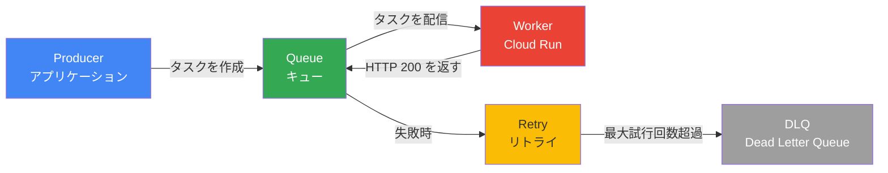
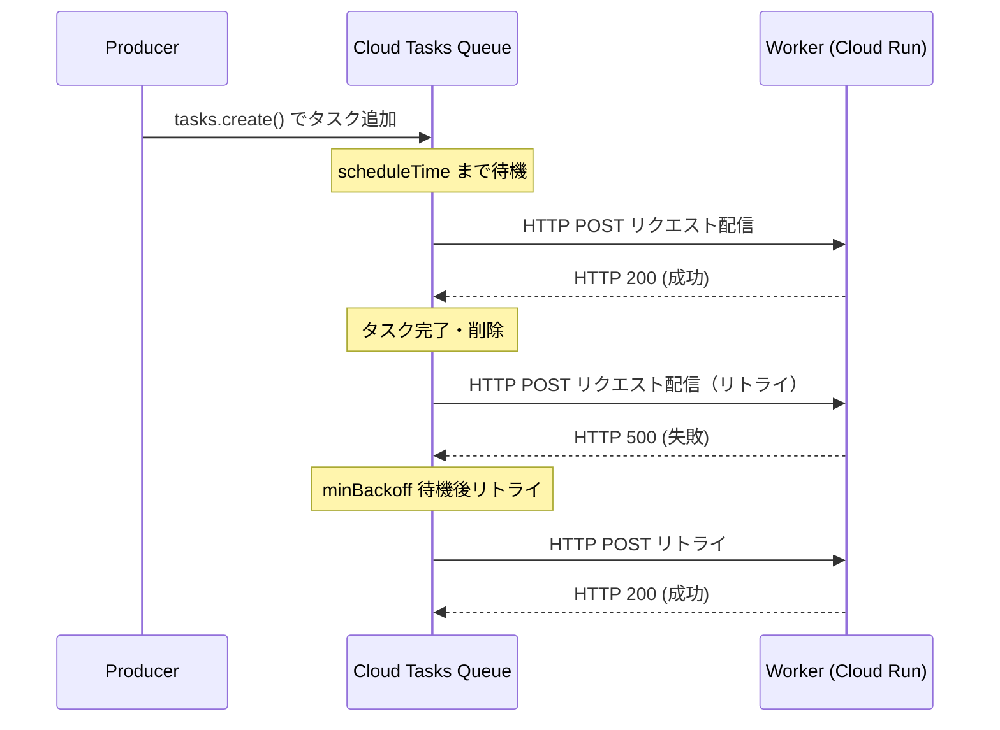
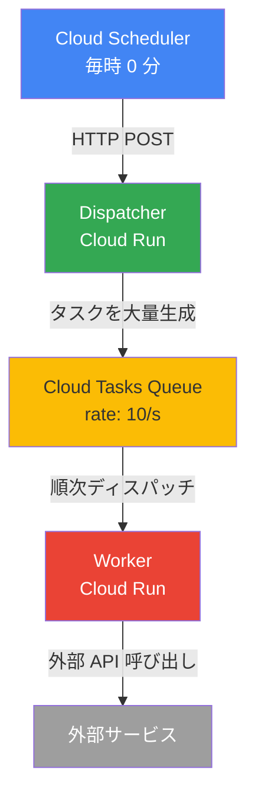

## はじめに

Webアプリケーションを開発していると、レスポンスタイムを犠牲にせずに重い処理を走らせたい場面に頻繁に遭遇します。画像のリサイズ、外部APIへの一括リクエスト、CSVの大量インポート、メール送信——これらをリクエスト処理の中で同期的に実行すると、ユーザーは処理が終わるまで待ち続けることになります。

非同期処理はこの問題を解決する王道のアプローチです。しかし「キューにタスクを積む」という単純なアイデアも、実運用では複雑さを帯びてきます。ワーカーがクラッシュしたときにタスクは失われるのか。レート制限を超えた外部APIへの呼び出しはどう制御するのか。失敗したタスクは何回、どのタイミングで再試行すべきか。

Google Cloud Tasks はこれらの問いに対する答えを持つ、フルマネージドのタスクキューサービスです。本記事では Cloud Tasks のアーキテクチャを理解したうえで、Cloud Run をワーカーとして使った実装パターンを Python と FastAPI で具体的に説明します。

扱う内容は以下のとおりです。

- Cloud Tasks のアーキテクチャとコンポーネントの関係
- Pub/Sub との使い分け判断基準
- gcloud コマンドによるキュー作成と IAM 設定
- Python クライアントからのタスク作成
- FastAPI による Cloud Run ワーカーの実装
- レート制限・同時実行数・リトライポリシーの設定
- OIDC 認証によるセキュアな通信
- Dead Letter Queue と失敗タスクの処理
- Cloud Scheduler との組み合わせパターン
- Cloud Monitoring によるモニタリング

## Cloud Tasks アーキテクチャ

Cloud Tasks を理解するには、3つのコアコンポーネントの関係を把握することが出発点になります。



- Producer: タスクを作成してキューに積むアプリケーション。Cloud Tasks クライアントライブラリを使って HTTP エンドポイントへのリクエスト情報をキューに追加します。
- Queue: タスクを管理し、設定されたレート・同時実行数・スケジュールに従ってワーカーへ配信するコンポーネント。GCP がフルマネージドで運用します。
- Worker: キューからディスパッチされた HTTP リクエストを処理するサービス。Cloud Run、GKE、Compute Engine、あるいは任意の HTTP エンドポイントが対応します。

### タスクのライフサイクル

タスクが作成されてからキューに積まれ、ワーカーで処理されるまでの流れは以下のとおりです。



ワーカーは処理成功時に HTTP 2xx を返す必要があります。デフォルトのタイムアウトは 10 分、最大 30 分まで設定可能です。2xx 以外が返るか、タイムアウトした場合はリトライポリシーに従って再試行されます。

## Pub/Sub vs Cloud Tasks 比較

Cloud Tasks と Pub/Sub はどちらも非同期メッセージングを提供しますが、設計思想が異なります。

| 観点 | Cloud Tasks | Pub/Sub |
|------|------------|---------|
| 配信モデル | プッシュ（キューがワーカーへ送信） | プッシュ / プル |
| 配信先 | 単一の HTTP エンドポイント | 複数のサブスクライバーへブロードキャスト |
| 実行制御 | レート・同時実行・スケジュールを細かく制御 | 基本的にできるだけ早く配信 |
| タスク重複 | 同一 ID のタスクは重複排除 | 少なくとも1回配信（重複あり） |
| 未来のスケジュール実行 | 可能（scheduleTime 指定） | 不可 |
| タスク保持期間 | 最大 31 日 | 最大 7 日（設定で最大 31 日） |
| メッセージサイズ | 最大 1 MB | 最大 10 MB |
| 向いているユースケース | 個別の処理制御が必要な場合 | イベント駆動・複数コンシューマー |

判断の目安は次の通りです。

- 処理対象ごとに「いつ」「何回」「どのレートで」処理するかを制御したい場合は Cloud Tasks を選びます。
- 1つのイベントを複数のシステムに通知する場合や、コンシューマーが HTTP エンドポイントを持たない場合は Pub/Sub を選びます。

## セットアップ

### 前提条件

Cloud Tasks API を有効化し、必要なロールを持つサービスアカウントを作成します。

```bash
# Cloud Tasks API を有効化
gcloud services enable cloudtasks.googleapis.com

# Cloud Run API も有効化（ワーカーに使う場合）
gcloud services enable run.googleapis.com

# ワーカー呼び出し用のサービスアカウントを作成
gcloud iam service-accounts create cloud-tasks-invoker \
  --display-name="Cloud Tasks Invoker"

# Cloud Run Invoker ロールを付与
gcloud projects add-iam-policy-binding YOUR_PROJECT_ID \
  --member="serviceAccount:cloud-tasks-invoker@YOUR_PROJECT_ID.iam.gserviceaccount.com" \
  --role="roles/run.invoker"
```

### キューの作成

```bash
# 基本的なキューを作成
gcloud tasks queues create my-task-queue \
  --location=asia-northeast1

# 詳細設定付きでキューを作成
gcloud tasks queues create image-resize-queue \
  --location=asia-northeast1 \
  --max-dispatches-per-second=10 \
  --max-concurrent-dispatches=5 \
  --max-attempts=3 \
  --min-backoff=10s \
  --max-backoff=300s \
  --max-doublings=3

# キューの設定を確認
gcloud tasks queues describe image-resize-queue \
  --location=asia-northeast1
```

各オプションの意味は次の通りです。

| オプション | 説明 | デフォルト |
|-----------|------|---------|
| `--max-dispatches-per-second` | 1 秒あたりの最大タスク送信数 | 500 |
| `--max-concurrent-dispatches` | 同時に実行できる最大タスク数 | 1000 |
| `--max-attempts` | 最大試行回数（-1 で無制限） | 100 |
| `--min-backoff` | リトライ間隔の最小値 | 0.1s |
| `--max-backoff` | リトライ間隔の最大値 | 3600s |
| `--max-doublings` | バックオフの指数増加回数 | 16 |

## Python クライアントでのタスク作成

### インストール

```bash
pip install google-cloud-tasks
```

### 基本的なタスク作成

```python
import json
from datetime import datetime, timedelta, timezone
from google.cloud import tasks_v2
from google.protobuf import duration_pb2, timestamp_pb2


def create_http_task(
    project: str,
    location: str,
    queue: str,
    url: str,
    payload: dict,
    schedule_delay_seconds: int = 0,
    task_id: str | None = None,
) -> tasks_v2.Task:
    """HTTP ターゲットタスクをキューに追加する。

    Args:
        project: GCP プロジェクト ID
        location: キューのリージョン（例: asia-northeast1）
        queue: キュー名
        url: ワーカーの URL
        payload: タスクのペイロード（JSON シリアライズ可能な dict）
        schedule_delay_seconds: 実行を遅延させる秒数（0 で即時）
        task_id: タスク ID（省略時は自動生成・重複排除に使用）

    Returns:
        作成されたタスクオブジェクト
    """
    client = tasks_v2.CloudTasksClient()
    parent = client.queue_path(project, location, queue)

    task = tasks_v2.Task(
        http_request=tasks_v2.HttpRequest(
            http_method=tasks_v2.HttpMethod.POST,
            url=url,
            headers={"Content-Type": "application/json"},
            body=json.dumps(payload).encode(),
        )
    )

    # タスク ID を指定すると重複排除が有効になる
    if task_id:
        task.name = f"{parent}/tasks/{task_id}"

    # 未来の時刻にスケジュール
    if schedule_delay_seconds > 0:
        schedule_time = datetime.now(timezone.utc) + timedelta(
            seconds=schedule_delay_seconds
        )
        timestamp = timestamp_pb2.Timestamp()
        timestamp.FromDatetime(schedule_time)
        task.schedule_time = timestamp

    response = client.create_task(request={"parent": parent, "task": task})
    print(f"タスクを作成しました: {response.name}")
    return response


# 使用例
if __name__ == "__main__":
    create_http_task(
        project="my-project",
        location="asia-northeast1",
        queue="image-resize-queue",
        url="https://my-worker-xxxx-an.a.run.app/tasks/resize",
        payload={
            "image_id": "img_001",
            "width": 800,
            "height": 600,
            "format": "webp",
        },
        task_id="resize-img_001-800x600",  # 同一 ID は重複排除される
    )
```

### OIDC 認証付きタスク作成

Cloud Run など認証が必要なエンドポイントに送信する場合は、OIDC トークンを設定します。

```python
def create_authenticated_task(
    project: str,
    location: str,
    queue: str,
    url: str,
    payload: dict,
    service_account_email: str,
) -> tasks_v2.Task:
    """OIDC 認証付きの HTTP タスクを作成する。"""
    client = tasks_v2.CloudTasksClient()
    parent = client.queue_path(project, location, queue)

    task = tasks_v2.Task(
        http_request=tasks_v2.HttpRequest(
            http_method=tasks_v2.HttpMethod.POST,
            url=url,
            headers={"Content-Type": "application/json"},
            body=json.dumps(payload).encode(),
            # OIDC トークンを自動付与
            oidc_token=tasks_v2.OidcToken(
                service_account_email=service_account_email,
                audience=url,  # Cloud Run の場合はサービス URL をオーディエンスに設定
            ),
        )
    )

    response = client.create_task(request={"parent": parent, "task": task})
    return response
```

## Cloud Run ワーカーの実装（FastAPI）

### プロジェクト構成

```
worker/
├── main.py           # FastAPI アプリ
├── tasks/
│   ├── __init__.py
│   ├── image.py      # 画像処理タスク
│   └── email.py      # メール送信タスク
├── middleware/
│   └── auth.py       # OIDC 検証ミドルウェア
├── requirements.txt
└── Dockerfile
```

### FastAPI ワーカー実装

```python
# main.py
import logging
from contextlib import asynccontextmanager

from fastapi import FastAPI, Request, HTTPException
from fastapi.responses import JSONResponse

from tasks.image import ImageResizePayload, process_image_resize
from tasks.email import EmailPayload, process_email
from middleware.auth import verify_cloud_tasks_request

logger = logging.getLogger(__name__)


@asynccontextmanager
async def lifespan(app: FastAPI):
    logger.info("ワーカーを起動しました")
    yield
    logger.info("ワーカーをシャットダウンしました")


app = FastAPI(lifespan=lifespan)


@app.post("/tasks/resize")
async def resize_image(payload: ImageResizePayload, request: Request):
    """画像リサイズタスクのエンドポイント。

    Cloud Tasks がこのエンドポイントに HTTP POST を送信する。
    成功時は HTTP 200 を返し、タスクをキューから削除させる。
    """
    # Cloud Tasks からのリクエストかを検証
    verify_cloud_tasks_request(request)

    try:
        result = await process_image_resize(payload)
        logger.info(
            "画像リサイズ完了",
            extra={
                "image_id": payload.image_id,
                "task_id": request.headers.get("X-CloudTasks-TaskName"),
            },
        )
        return JSONResponse(status_code=200, content={"status": "ok", "result": result})

    except ValueError as e:
        # 4xx エラーはリトライされない（恒久的なエラーとして扱われる）
        logger.error(f"バリデーションエラー: {e}")
        raise HTTPException(status_code=400, detail=str(e))

    except Exception as e:
        # 5xx エラーはリトライポリシーに従ってリトライされる
        logger.error(f"処理エラー: {e}", exc_info=True)
        raise HTTPException(status_code=500, detail="Internal server error")


@app.post("/tasks/email")
async def send_email(payload: EmailPayload, request: Request):
    """メール送信タスクのエンドポイント。"""
    verify_cloud_tasks_request(request)

    try:
        await process_email(payload)
        return JSONResponse(status_code=200, content={"status": "ok"})
    except Exception as e:
        logger.error(f"メール送信エラー: {e}", exc_info=True)
        raise HTTPException(status_code=500, detail="Internal server error")


@app.get("/health")
async def health_check():
    return {"status": "healthy"}
```

```python
# tasks/image.py
from pydantic import BaseModel
import asyncio


class ImageResizePayload(BaseModel):
    image_id: str
    width: int
    height: int
    format: str = "webp"
    quality: int = 85


async def process_image_resize(payload: ImageResizePayload) -> dict:
    """画像リサイズ処理の実装。

    冪等性を持たせるため、処理前に既に処理済みかを確認する。
    """
    # 冪等性チェック（例: Firestore や Cloud Storage で状態管理）
    if await is_already_processed(payload.image_id, payload.width, payload.height):
        return {"skipped": True, "reason": "already processed"}

    # 実際のリサイズ処理（Pillow 等を使用）
    await asyncio.sleep(0.1)  # 処理のシミュレーション

    return {
        "image_id": payload.image_id,
        "output_path": f"gs://my-bucket/resized/{payload.image_id}_{payload.width}x{payload.height}.{payload.format}",
    }


async def is_already_processed(image_id: str, width: int, height: int) -> bool:
    """処理済みかどうかを確認する（冪等性保証）。"""
    # 実際は Firestore や Redis で状態チェックを行う
    return False
```

### OIDC 検証ミドルウェア

```python
# middleware/auth.py
import os
import logging
from fastapi import Request, HTTPException
import google.auth.transport.requests
import google.oauth2.id_token

logger = logging.getLogger(__name__)

WORKER_URL = os.environ.get("WORKER_URL", "")


def verify_cloud_tasks_request(request: Request) -> None:
    """Cloud Tasks からのリクエストを OIDC トークンで検証する。

    Cloud Tasks は Authorization: Bearer <OIDC_TOKEN> ヘッダーを付与する。
    本番環境では必ずこの検証を実施すること。
    """
    # ローカル開発環境ではスキップ
    if os.environ.get("ENV") == "local":
        return

    auth_header = request.headers.get("Authorization")
    if not auth_header or not auth_header.startswith("Bearer "):
        raise HTTPException(status_code=401, detail="Authorization header missing")

    token = auth_header.split(" ")[1]

    try:
        # OIDC トークンを検証
        auth_req = google.auth.transport.requests.Request()
        id_info = google.oauth2.id_token.verify_oauth2_token(
            token,
            auth_req,
            audience=WORKER_URL,
        )

        # サービスアカウントのメールアドレスを確認
        expected_sa = os.environ.get("EXPECTED_SERVICE_ACCOUNT")
        if expected_sa and id_info.get("email") != expected_sa:
            raise HTTPException(status_code=403, detail="Unauthorized service account")

        logger.debug(f"OIDC 検証成功: {id_info.get('email')}")

    except ValueError as e:
        logger.warning(f"OIDC トークン検証失敗: {e}")
        raise HTTPException(status_code=401, detail="Invalid OIDC token")
```

### Dockerfile

```dockerfile
FROM python:3.12-slim

WORKDIR /app

COPY requirements.txt .
RUN pip install --no-cache-dir -r requirements.txt

COPY . .

# Cloud Run はデフォルトで PORT 環境変数を設定する
ENV PORT=8080
CMD ["uvicorn", "main:app", "--host", "0.0.0.0", "--port", "8080", "--workers", "4"]
```

### Cloud Run へのデプロイ

```bash
# イメージをビルドして Artifact Registry に push
gcloud builds submit --tag asia-northeast1-docker.pkg.dev/YOUR_PROJECT/workers/task-worker

# Cloud Run にデプロイ
gcloud run deploy task-worker \
  --image asia-northeast1-docker.pkg.dev/YOUR_PROJECT/workers/task-worker \
  --region asia-northeast1 \
  --service-account cloud-tasks-invoker@YOUR_PROJECT.iam.gserviceaccount.com \
  --set-env-vars ENV=production,WORKER_URL=https://task-worker-xxxx-an.a.run.app \
  --set-env-vars EXPECTED_SERVICE_ACCOUNT=cloud-tasks-invoker@YOUR_PROJECT.iam.gserviceaccount.com \
  --no-allow-unauthenticated \
  --min-instances 0 \
  --max-instances 10 \
  --concurrency 80
```

## キュー設定の詳細

### レート制限と同時実行数

キューのディスパッチレートと同時実行数は用途に合わせてチューニングします。

```bash
# 外部 API のレート制限に合わせた設定例
# 例: 1 秒あたり 10 リクエスト、同時 5 タスクまで
gcloud tasks queues update api-call-queue \
  --location=asia-northeast1 \
  --max-dispatches-per-second=10 \
  --max-concurrent-dispatches=5

# バースト処理が必要な場合（大量タスクを一気に処理）
gcloud tasks queues update batch-queue \
  --location=asia-northeast1 \
  --max-dispatches-per-second=100 \
  --max-concurrent-dispatches=50
```

Python コードからキューの設定を変更することもできます。

```python
from google.cloud import tasks_v2
from google.protobuf import duration_pb2


def update_queue_config(
    project: str,
    location: str,
    queue_name: str,
    max_dispatches_per_second: float = 10.0,
    max_concurrent_dispatches: int = 5,
    max_attempts: int = 5,
    min_backoff_seconds: int = 10,
    max_backoff_seconds: int = 300,
) -> tasks_v2.Queue:
    """キューの設定を更新する。"""
    client = tasks_v2.CloudTasksClient()
    queue_path = client.queue_path(project, location, queue_name)

    queue = tasks_v2.Queue(
        name=queue_path,
        rate_limits=tasks_v2.RateLimits(
            max_dispatches_per_second=max_dispatches_per_second,
            max_concurrent_dispatches=max_concurrent_dispatches,
        ),
        retry_config=tasks_v2.RetryConfig(
            max_attempts=max_attempts,
            min_backoff=duration_pb2.Duration(seconds=min_backoff_seconds),
            max_backoff=duration_pb2.Duration(seconds=max_backoff_seconds),
            max_doublings=3,
        ),
    )

    updated_queue = client.update_queue(
        request={
            "queue": queue,
            "update_mask": {"paths": ["rate_limits", "retry_config"]},
        }
    )
    return updated_queue
```

### リトライポリシーの設計

バックオフアルゴリズムの挙動を理解しておくことが重要です。`minBackoff` から始まり、`maxDoublings` 回だけ指数的に増加した後、`maxBackoff` に達するまで線形増加します。

設定例として、外部 API を呼び出すキューのリトライポリシーを考えます。

```
minBackoff: 10s
maxBackoff: 600s（10 分）
maxDoublings: 4

リトライ間隔の推移:
1 回目: 10s
2 回目: 20s
3 回目: 40s
4 回目: 80s
5 回目以降: 160s → 320s → 600s（上限）→ 600s → ...
```

処理の種類ごとに適切なポリシーが異なります。

| 処理の種類 | maxAttempts | minBackoff | maxBackoff | 備考 |
|-----------|------------|-----------|-----------|------|
| 外部 API 呼び出し | 5 | 10s | 300s | レート制限対策 |
| 画像処理 | 3 | 30s | 600s | リソース競合を避ける |
| メール送信 | 3 | 60s | 3600s | 重複送信リスクを最小化 |
| DB 書き込み | 10 | 1s | 60s | 一時的な接続エラーに対応 |

## エラーハンドリングと Dead Letter Queue

### エラーの種類と対応方針

Cloud Tasks では HTTP ステータスコードでリトライの挙動が決まります。

- HTTP 2xx（200〜299）: 成功。タスクをキューから削除します。
- HTTP 4xx（400〜499）: 恒久的なエラー。`429 Too Many Requests` と `503 Service Unavailable` を除き、リトライされません。
- HTTP 5xx（500〜599）: 一時的なエラー。リトライポリシーに従って再試行されます。
- タイムアウト: 5xx 相当として扱われリトライされます。

この仕様から、バリデーションエラー（400）は即座に失敗扱いとし、処理サーバーの問題（500）はリトライに委ねる設計が自然です。

### Dead Letter Queue の設定

最大リトライ回数を超えたタスクを Pub/Sub トピックに転送することで、失敗タスクを確実に捕捉できます。

```bash
# DLQ 用の Pub/Sub トピックを作成
gcloud pubsub topics create cloud-tasks-dlq

# Cloud Tasks に Pub/Sub への書き込み権限を付与
gcloud pubsub topics add-iam-policy-binding cloud-tasks-dlq \
  --member="serviceAccount:service-PROJECT_NUMBER@gcp-sa-cloudtasks.iam.gserviceaccount.com" \
  --role="roles/pubsub.publisher"

# キューに DLQ を設定
gcloud tasks queues update image-resize-queue \
  --location=asia-northeast1 \
  --max-attempts=5 \
  --log-sampling-ratio=1.0 \
  --dead-letter-topic=projects/YOUR_PROJECT/topics/cloud-tasks-dlq
```

Python でキューに DLQ を設定する方法は以下の通りです。

```python
def setup_dead_letter_queue(
    project: str,
    location: str,
    queue_name: str,
    dlq_topic: str,
    max_attempts: int = 5,
) -> tasks_v2.Queue:
    """キューに Dead Letter Queue を設定する。"""
    client = tasks_v2.CloudTasksClient()
    queue_path = client.queue_path(project, location, queue_name)

    queue = tasks_v2.Queue(
        name=queue_path,
        retry_config=tasks_v2.RetryConfig(
            max_attempts=max_attempts,
        ),
        # 最大試行回数超過後に転送する Pub/Sub トピック
        stackdriver_logging_config=tasks_v2.StackdriverLoggingConfig(
            sampling_ratio=1.0
        ),
    )

    # DLQ は REST API または gcloud コマンドで設定する
    # Python クライアントでは stackdriver_logging_config の設定が主になる
    return client.update_queue(
        request={
            "queue": queue,
            "update_mask": {"paths": ["retry_config", "stackdriver_logging_config"]},
        }
    )
```

### DLQ サブスクライバーの実装

```python
# dlq_subscriber.py
import json
import logging
from google.cloud import pubsub_v1

logger = logging.getLogger(__name__)


def handle_dead_letter_task(message: pubsub_v1.subscriber.message.Message) -> None:
    """DLQ に転送されたタスクを処理する。"""
    try:
        # Cloud Tasks からの DLQ メッセージ形式をデコード
        task_data = json.loads(message.data.decode("utf-8"))
        task_name = message.attributes.get("CloudTasksTaskName")
        retry_count = message.attributes.get("CloudTasksTaskRetryCount")

        logger.error(
            "タスクが最大リトライ回数に達しました",
            extra={
                "task_name": task_name,
                "retry_count": retry_count,
                "task_data": task_data,
            },
        )

        # アラートを送信（例: Discord、Slack、PagerDuty）
        send_alert(task_name, task_data, retry_count)

        # 必要に応じて手動リトライのためのデータを保存
        save_failed_task_for_manual_retry(task_name, task_data)

        message.ack()

    except Exception as e:
        logger.error(f"DLQ メッセージ処理エラー: {e}")
        message.nack()


def start_dlq_subscriber(project: str, subscription: str) -> None:
    """DLQ サブスクライバーを起動する。"""
    subscriber = pubsub_v1.SubscriberClient()
    subscription_path = subscriber.subscription_path(project, subscription)

    streaming_pull_future = subscriber.subscribe(
        subscription_path, callback=handle_dead_letter_task
    )

    logger.info(f"DLQ サブスクライバーを起動しました: {subscription_path}")
    streaming_pull_future.result()
```

## Cloud Scheduler との組み合わせ

Cloud Scheduler と Cloud Tasks を組み合わせると、「定期実行でタスクを大量生成し、レート制限しながら処理する」パターンが実現できます。



典型的なユースケースは「全ユーザーへの定期レポート送信」です。毎時 Scheduler がディスパッチャーを起動し、ディスパッチャーが全ユーザー分のタスクをキューに積み、キューがレート制限しながらワーカーを呼び出します。

### ディスパッチャーの実装

```python
# dispatcher.py
import asyncio
from typing import Generator
from google.cloud import tasks_v2, firestore


async def dispatch_report_tasks(
    project: str,
    location: str,
    queue: str,
    worker_url: str,
    service_account_email: str,
) -> dict:
    """全アクティブユーザー分のレポートタスクをキューに積む。"""
    db = firestore.AsyncClient()
    tasks_client = tasks_v2.CloudTasksClient()
    parent = tasks_client.queue_path(project, location, queue)

    # アクティブユーザーを Firestore から取得
    users_ref = db.collection("users").where("active", "==", True)
    users = await users_ref.get()

    dispatched = 0
    errors = 0

    for user_doc in users:
        user_id = user_doc.id
        task_id = f"report-{user_id}-{int(asyncio.get_event_loop().time())}"

        try:
            task = tasks_v2.Task(
                name=f"{parent}/tasks/{task_id}",
                http_request=tasks_v2.HttpRequest(
                    http_method=tasks_v2.HttpMethod.POST,
                    url=f"{worker_url}/tasks/send-report",
                    headers={"Content-Type": "application/json"},
                    body=json.dumps({"user_id": user_id}).encode(),
                    oidc_token=tasks_v2.OidcToken(
                        service_account_email=service_account_email,
                        audience=worker_url,
                    ),
                ),
            )
            tasks_client.create_task(request={"parent": parent, "task": task})
            dispatched += 1

        except Exception as e:
            # 個別タスクの生成失敗はスキップして続行
            logger.error(f"タスク生成失敗 user_id={user_id}: {e}")
            errors += 1

    return {"dispatched": dispatched, "errors": errors}
```

### Cloud Scheduler の設定

```bash
# Dispatcher を呼び出す Scheduler ジョブを作成
gcloud scheduler jobs create http dispatch-reports \
  --location=asia-northeast1 \
  --schedule="0 * * * *" \
  --uri="https://dispatcher-xxxx-an.a.run.app/dispatch" \
  --message-body='{"queue": "report-queue"}' \
  --oidc-service-account-email=cloud-tasks-invoker@YOUR_PROJECT.iam.gserviceaccount.com \
  --time-zone="Asia/Tokyo"
```

## モニタリングとデバッグ

### Cloud Logging でのタスクログ確認

ログサンプリングレートを 1.0 に設定することで、全タスクのログを記録できます。

```bash
# キューのログ記録を有効化
gcloud tasks queues update image-resize-queue \
  --location=asia-northeast1 \
  --log-sampling-ratio=1.0
```

Cloud Logging では以下のフィルターで失敗タスクを絞り込めます。

```
# 失敗したタスクを検索
resource.type="cloud_tasks_queue"
resource.labels.queue_id="image-resize-queue"
httpRequest.status >= 400
```

### Cloud Monitoring アラートの設定

```python
# monitoring_setup.py
from google.cloud import monitoring_v3
from google.protobuf import duration_pb2


def create_queue_depth_alert(
    project: str,
    queue_name: str,
    threshold: int = 1000,
) -> None:
    """キューの深さが閾値を超えたらアラートを発火する。"""
    client = monitoring_v3.AlertPolicyServiceClient()
    project_name = f"projects/{project}"

    alert_policy = monitoring_v3.AlertPolicy(
        display_name=f"Cloud Tasks Queue Depth - {queue_name}",
        conditions=[
            monitoring_v3.AlertPolicy.Condition(
                display_name="Queue depth threshold",
                condition_threshold=monitoring_v3.AlertPolicy.Condition.MetricThreshold(
                    filter=(
                        f'resource.type = "cloud_tasks_queue" '
                        f'AND metric.type = "cloudtasks.googleapis.com/queue/depth" '
                        f'AND resource.labels.queue_id = "{queue_name}"'
                    ),
                    comparison=monitoring_v3.ComparisonType.COMPARISON_GT,
                    threshold_value=threshold,
                    duration=duration_pb2.Duration(seconds=300),
                ),
            )
        ],
        combiner=monitoring_v3.AlertPolicy.ConditionCombinerType.AND,
        notification_channels=[
            f"projects/{project}/notificationChannels/YOUR_CHANNEL_ID"
        ],
    )

    client.create_alert_policy(
        request={"name": project_name, "alert_policy": alert_policy}
    )
```

### デバッグ時の便利なコマンド

```bash
# キューの現在の状態を確認
gcloud tasks queues describe image-resize-queue \
  --location=asia-northeast1

# キュー内の未処理タスク一覧（最大 1000 件）
gcloud tasks list \
  --queue=image-resize-queue \
  --location=asia-northeast1

# 特定タスクの詳細確認
gcloud tasks describe TASK_ID \
  --queue=image-resize-queue \
  --location=asia-northeast1

# タスクを手動で実行（テスト用）
gcloud tasks run TASK_ID \
  --queue=image-resize-queue \
  --location=asia-northeast1

# キューを一時停止（緊急時）
gcloud tasks queues pause image-resize-queue \
  --location=asia-northeast1

# キューを再開
gcloud tasks queues resume image-resize-queue \
  --location=asia-northeast1
```

### よくあるエラーと対処法

| エラー | 原因 | 対処法 |
|-------|------|-------|
| `DEADLINE_EXCEEDED` | ワーカーがタイムアウト（デフォルト 10 分）内に応答しない | ワーカーの処理を分割するか、タイムアウトを延長（最大 30 分） |
| `ALREADY_EXISTS` | 同じ task_id のタスクが既に存在する | task_id の設計を見直すか、タスクが完全に削除されるまで待つ（タスク完了後 1 時間） |
| `PERMISSION_DENIED` | サービスアカウントに権限がない | `roles/run.invoker` が正しく付与されているか確認 |
| HTTP 429 がリトライされる | Cloud Tasks は 429 を一時エラーとして扱う | ワーカー側でレート制限対策を実装するか、maxConcurrentDispatches を下げる |
| コールドスタートによるタイムアウト | Cloud Run の min-instances が 0 の場合に発生しやすい | 処理時間の長いタスクは min-instances=1 にするか、より長いタイムアウトを設定 |

## まとめ

Cloud Tasks は単純なキューサービスを超え、非同期処理の信頼性・制御性を高めるための充実した機能を持っています。本記事で扱った内容を振り返ります。

- アーキテクチャの面では、Producer・Queue・Worker の分離により、スケーラビリティと信頼性が高まります。
- Pub/Sub との使い分けについては、タスクの実行制御（レート・リトライ・スケジュール）が必要なら Cloud Tasks、複数コンシューマーへのブロードキャストなら Pub/Sub が適切です。
- 実装面では、OIDC 認証を使った Cloud Run ワーカーと Python クライアントの組み合わせが現在のベストプラクティスといえます。
- 運用面では、Dead Letter Queue の設定とログサンプリングレートの有効化が失敗タスクを見逃さないための鍵になります。
- Cloud Scheduler との組み合わせにより、「スケジュール起動→大量タスク生成→レート制限して順次処理」という堅牢なバッチパターンが構築できます。

Cloud Tasks はシンプルに始められますが、その設定の奥には細かいチューニングの余地が多く残っています。まずは基本的な HTTP タスクキューから実装を始め、運用データを見ながらレート制限やリトライポリシーを調整していくアプローチが実践的です。

Sources:
- [Create Cloud Tasks queues | Google Cloud Documentation](https://docs.cloud.google.com/tasks/docs/creating-queues)
- [Executing asynchronous tasks | Cloud Run | Google Cloud Documentation](https://cloud.google.com/run/docs/triggering/using-tasks)
- [Choose Cloud Tasks or Pub/Sub | Google Cloud Documentation](https://cloud.google.com/tasks/docs/comp-pub-sub)
- [Configure Cloud Tasks queues | Google Cloud Documentation](https://docs.cloud.google.com/tasks/docs/configuring-queues)
- [Create HTTP tasks with authentication | Cloud Tasks | Google Cloud Documentation](https://cloud.google.com/tasks/docs/samples/cloud-tasks-create-http-task-with-token)
