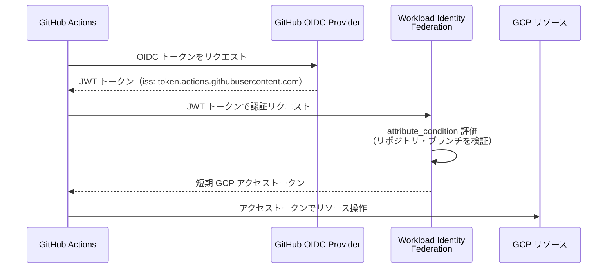

## はじめに

GCP プロジェクトで最も多く発生するセキュリティインシデントの原因の一つが、IAM の設定ミスです。「とりあえず Editor ロールを付与した」「サービスアカウントキーを Git リポジトリに含めていた」といったケースが、実際の情報漏洩事故につながっています。

本記事では、GCP IAM の最小権限設計を実践するための具体的なパターンを紹介します。サービスアカウントの粒度設計、Workload Identity によるキーレス認証、条件付きバインディングによる細粒度制御、そして監査ログの活用まで、実際の gcloud コマンドとともに解説します。

対象読者は GCP プロジェクトをすでに本番環境で運用しているバックエンドエンジニアや DevOps エンジニアを想定しています。

---

## 1. 最小権限設計の3原則

IAM 設計において、以下の3つの原則を常に意識することが重要です。

### 原則1: Primitive Role を使わない

GCP には `roles/owner`、`roles/editor`、`roles/viewer` という3つの基本ロール（Primitive Role）があります。これらはプロジェクト全体のリソースに対して広範な権限を付与するため、実際の運用では使用を避けるべきです。

代わりに、各サービスごとの事前定義ロール（Predefined Role）または必要な権限だけを集めたカスタムロールを使用します。

```bash
# 悪い例: Editor ロールを付与
gcloud projects add-iam-policy-binding PROJECT_ID \
  --member="serviceAccount:my-sa@PROJECT_ID.iam.gserviceaccount.com" \
  --role="roles/editor"

# 良い例: Cloud Run 管理に必要な最小ロールのみ付与
gcloud projects add-iam-policy-binding PROJECT_ID \
  --member="serviceAccount:my-sa@PROJECT_ID.iam.gserviceaccount.com" \
  --role="roles/run.developer"
```

### 原則2: スコープを最小化する

権限はできる限り狭いスコープ（プロジェクト全体より特定リソース）で付与します。たとえば、特定の Cloud Storage バケットだけ読み取りできればよいサービスアカウントには、プロジェクトレベルではなくバケットレベルで権限を付与します。

```bash
# プロジェクトレベル（広すぎる）
gcloud projects add-iam-policy-binding PROJECT_ID \
  --member="serviceAccount:my-sa@PROJECT_ID.iam.gserviceaccount.com" \
  --role="roles/storage.objectViewer"

# バケットレベル（推奨）
gcloud storage buckets add-iam-policy-binding gs://my-bucket \
  --member="serviceAccount:my-sa@PROJECT_ID.iam.gserviceaccount.com" \
  --role="roles/storage.objectViewer"
```

### 原則3: 定期レビューと棚卸し

付与した権限は定期的にレビューし、不要になったバインディングを削除します。`gcloud` コマンドで現在のバインディングを確認できます。

```bash
# プロジェクトの IAM ポリシー全体を確認
gcloud projects get-iam-policy PROJECT_ID \
  --format="yaml(bindings)"

# 特定メンバーのバインディングだけ絞り込む
gcloud projects get-iam-policy PROJECT_ID \
  --format="yaml(bindings)" \
  --flatten="bindings[].members" \
  --filter="bindings.members:serviceAccount:my-sa@PROJECT_ID.iam.gserviceaccount.com"
```

---

## 2. サービスアカウントの設計パターン

### SA-per-Service パターン

サービスアカウント（SA）はサービス・コンポーネントごとに1つ作成するのが基本です。1つの SA を複数サービスで共有すると、権限の最小化が困難になり、インシデント発生時の影響範囲も広くなります。

```bash
# Cloud Run バックエンド API 用 SA
gcloud iam service-accounts create sa-api-backend \
  --display-name="API Backend Service Account" \
  --project=PROJECT_ID

# Cloud Run バッチジョブ用 SA
gcloud iam service-accounts create sa-batch-job \
  --display-name="Batch Job Service Account" \
  --project=PROJECT_ID

# CI/CD デプロイ用 SA
gcloud iam service-accounts create sa-deploy \
  --display-name="CI/CD Deploy Service Account" \
  --project=PROJECT_ID
```

### カスタムロールの作成

事前定義ロールに必要以上の権限が含まれる場合は、カスタムロールを作成します。

```bash
# カスタムロール定義ファイルを作成
cat > custom-role-run-invoker.yaml << 'EOF'
title: "Custom Run Invoker"
description: "Cloud Run サービスの呼び出しのみ許可"
stage: "GA"
includedPermissions:
  - run.routes.invoke
EOF

# カスタムロールをプロジェクトに作成
gcloud iam roles create customRunInvoker \
  --project=PROJECT_ID \
  --file=custom-role-run-invoker.yaml

# 付与
gcloud run services add-iam-policy-binding my-service \
  --region=asia-northeast1 \
  --member="serviceAccount:sa-api-backend@PROJECT_ID.iam.gserviceaccount.com" \
  --role="projects/PROJECT_ID/roles/customRunInvoker"
```

### SA のサービスアカウントトークン作成者

SA が他の SA を模倣（impersonate）できる権限も最小化します。SA 間の impersonation が必要な場合は、明示的に `roles/iam.serviceAccountTokenCreator` を付与します。

```bash
# sa-deploy が sa-api-backend を impersonate できるよう設定
gcloud iam service-accounts add-iam-policy-binding \
  sa-api-backend@PROJECT_ID.iam.gserviceaccount.com \
  --member="serviceAccount:sa-deploy@PROJECT_ID.iam.gserviceaccount.com" \
  --role="roles/iam.serviceAccountTokenCreator"
```

---

## 3. Workload Identity によるキーレス認証

サービスアカウントキーファイル（JSON）は漏洩リスクが高く、管理コストもかかります。Workload Identity を使うことで、キーファイルを一切使わずに GCP リソースへの認証が可能になります。

### Cloud Run での Workload Identity

Cloud Run はデフォルトで Workload Identity が有効です。サービスに SA をアタッチするだけで、コンテナ内から認証情報が自動的に利用できます。

```bash
# Cloud Run サービスに SA をアタッチしてデプロイ
gcloud run deploy my-service \
  --image=asia-northeast1-docker.pkg.dev/PROJECT_ID/my-repo/my-app:latest \
  --service-account=sa-api-backend@PROJECT_ID.iam.gserviceaccount.com \
  --region=asia-northeast1 \
  --platform=managed

# 既存サービスの SA を更新
gcloud run services update my-service \
  --service-account=sa-api-backend@PROJECT_ID.iam.gserviceaccount.com \
  --region=asia-northeast1
```

コンテナ内では、メタデータサーバー経由でアクセストークンが自動取得されます。Google Cloud クライアントライブラリを使用している場合は、追加設定なしで認証が通ります。

### GitHub Actions での Workload Identity Federation

GitHub Actions から GCP リソースを操作する際、従来は SA キーを GitHub Secrets に保存していましたが、Workload Identity Federation を使うことでキー不要になります。



設定手順は以下のとおりです。

```bash
# 1. Workload Identity Pool を作成
gcloud iam workload-identity-pools create github-pool \
  --location=global \
  --display-name="GitHub Actions Pool" \
  --project=PROJECT_ID

# 2. GitHub OIDC プロバイダーを登録
gcloud iam workload-identity-pools providers create-oidc github-provider \
  --workload-identity-pool=github-pool \
  --location=global \
  --issuer-uri="https://token.actions.githubusercontent.com" \
  --attribute-mapping="google.subject=assertion.sub,attribute.repository=assertion.repository,attribute.actor=assertion.actor,attribute.ref=assertion.ref" \
  --attribute-condition="assertion.repository == 'YOUR_ORG/YOUR_REPO'" \
  --project=PROJECT_ID

# 3. SA に Workload Identity User ロールを付与
gcloud iam service-accounts add-iam-policy-binding \
  sa-deploy@PROJECT_ID.iam.gserviceaccount.com \
  --member="principalSet://iam.googleapis.com/projects/PROJECT_NUMBER/locations/global/workloadIdentityPools/github-pool/attribute.repository/YOUR_ORG/YOUR_REPO" \
  --role="roles/iam.workloadIdentityUser" \
  --project=PROJECT_ID
```

GitHub Actions ワークフロー側の設定です。

```yaml
# .github/workflows/deploy.yml
name: Deploy to Cloud Run

on:
  push:
    branches: [main]

permissions:
  contents: read
  id-token: write   # OIDC トークン取得に必要

jobs:
  deploy:
    runs-on: ubuntu-latest
    steps:
      - uses: actions/checkout@v4

      - id: auth
        uses: google-github-actions/auth@v2
        with:
          workload_identity_provider: "projects/PROJECT_NUMBER/locations/global/workloadIdentityPools/github-pool/providers/github-provider"
          service_account: "sa-deploy@PROJECT_ID.iam.gserviceaccount.com"

      - name: Deploy to Cloud Run
        run: |
          gcloud run deploy my-service \
            --image=asia-northeast1-docker.pkg.dev/PROJECT_ID/my-repo/my-app:latest \
            --region=asia-northeast1
```

---

## 4. 条件付きバインディングの実装

IAM Conditions を使うと、CEL（Common Expression Language）で細粒度の条件をバインディングに追加できます。

### 時間制限付きバインディング

一時的に権限を付与する場合に有効です。

```bash
# 2026年3月末まで有効な一時バインディング
gcloud projects add-iam-policy-binding PROJECT_ID \
  --member="user:contractor@example.com" \
  --role="roles/bigquery.dataViewer" \
  --condition='expression=request.time < timestamp("2026-03-31T23:59:59Z"),title=temp-access-2026q1,description=2026年Q1限定アクセス'
```

### リソース名条件

特定のプレフィックスを持つリソースのみアクセス可能にします。

```bash
# prod- プレフィックスのバケットのみアクセス許可
gcloud storage buckets add-iam-policy-binding gs://prod-data-bucket \
  --member="serviceAccount:sa-api-backend@PROJECT_ID.iam.gserviceaccount.com" \
  --role="roles/storage.objectViewer" \
  --condition='expression=resource.name.startsWith("projects/_/buckets/prod-"),title=prod-buckets-only'
```

### BigQuery テーブルレベルの条件

```bash
# 特定テーブルへのアクセスのみ許可
gcloud projects add-iam-policy-binding PROJECT_ID \
  --member="serviceAccount:sa-analytics@PROJECT_ID.iam.gserviceaccount.com" \
  --role="roles/bigquery.dataViewer" \
  --condition='expression=resource.name == "projects/PROJECT_ID/datasets/analytics/tables/events",title=events-table-only'
```

### 条件の確認と削除

```bash
# 条件付きバインディングを含むポリシーを確認
gcloud projects get-iam-policy PROJECT_ID \
  --format="yaml(bindings)" \
  --flatten="bindings[].members" \
  --filter="bindings.condition:*"

# 条件付きバインディングの削除
gcloud projects remove-iam-policy-binding PROJECT_ID \
  --member="user:contractor@example.com" \
  --role="roles/bigquery.dataViewer" \
  --condition='expression=request.time < timestamp("2026-03-31T23:59:59Z"),title=temp-access-2026q1'
```

---

## 5. IAM監査ログの設定と分析

### 監査ログの種類

| ログ種別 | 内容 | デフォルト |
|----------|------|-----------|
| Admin Activity | リソースの作成・削除・IAM設定変更 | 有効（無効化不可） |
| Data Access - ADMIN_READ | リソースメタデータの読み取り | 無効 |
| Data Access - DATA_READ | データの読み取り | 無効 |
| Data Access - DATA_WRITE | データの書き込み | 無効 |
| System Event | GCP 内部のシステムイベント | 有効（無効化不可） |

### Data Access ログの有効化

Data Access ログはデフォルトで無効です。必要なサービスに対して有効化します。

```bash
# 現在の監査ポリシーを確認
gcloud projects get-iam-policy PROJECT_ID \
  --format="yaml(auditConfigs)"

# BigQuery の Data Access ログをすべて有効化
gcloud projects set-iam-policy PROJECT_ID - << 'EOF'
auditConfigs:
  - auditLogConfigs:
    - logType: ADMIN_READ
    - logType: DATA_READ
    - logType: DATA_WRITE
    service: bigquery.googleapis.com
  - auditLogConfigs:
    - logType: ADMIN_READ
    - logType: DATA_READ
    - logType: DATA_WRITE
    service: storage.googleapis.com
EOF
```

### BigQuery での監査ログ分析

Cloud Audit Logs を BigQuery にエクスポートすることで、権限使用状況を SQL で分析できます。

```bash
# ログシンクを作成（Cloud Logging → BigQuery）
gcloud logging sinks create audit-log-sink \
  bigquery.googleapis.com/projects/PROJECT_ID/datasets/audit_logs \
  --log-filter='logName=~"cloudaudit.googleapis.com"' \
  --project=PROJECT_ID
```

```sql
-- 過去30日間で最も多く使われたロールと SA を確認
SELECT
  protopayload_auditlog.authenticationInfo.principalEmail AS principal,
  protopayload_auditlog.methodName AS method,
  COUNT(*) AS call_count
FROM
  `PROJECT_ID.audit_logs.cloudaudit_googleapis_com_data_access_*`
WHERE
  _TABLE_SUFFIX >= FORMAT_DATE('%Y%m%d', DATE_SUB(CURRENT_DATE(), INTERVAL 30 DAY))
GROUP BY
  principal, method
ORDER BY
  call_count DESC
LIMIT 50;

-- 一度も使われていないバインディングを特定するための参照クエリ
-- （実際の使用と IAM ポリシーを突き合わせる用途）
SELECT
  protopayload_auditlog.authenticationInfo.principalEmail AS sa_email,
  MIN(timestamp) AS first_used,
  MAX(timestamp) AS last_used
FROM
  `PROJECT_ID.audit_logs.cloudaudit_googleapis_com_data_access_*`
WHERE
  protopayload_auditlog.authenticationInfo.principalEmail LIKE '%@PROJECT_ID.iam.gserviceaccount.com'
GROUP BY
  sa_email
ORDER BY
  last_used ASC;
```

---

## 6. よくある設定ミス5選

### ミス1: roles/editor を SA に付与する

編集者ロールは課金アカウントや組織レベルの設定を除くほぼすべての操作が可能です。「とりあえず動けばよい」という判断で付与されがちですが、侵害時の被害が最大になります。

```bash
# 現状確認: Editor ロールが付与されている SA を列挙
gcloud projects get-iam-policy PROJECT_ID \
  --format="yaml(bindings)" \
  --flatten="bindings[].members" \
  --filter="bindings.role:roles/editor AND bindings.members:serviceAccount"
```

### ミス2: allUsers / allAuthenticatedUsers に権限を付与する

Cloud Storage バケットや Cloud Run サービスを「とりあえず公開」する際に使われますが、意図しないデータ公開につながります。

```bash
# allUsers バインディングを持つバケットを確認
gcloud storage buckets list --format="value(name)" | while read bucket; do
  result=$(gcloud storage buckets get-iam-policy "gs://${bucket}" 2>/dev/null | grep -l "allUsers" 2>/dev/null)
  if [ -n "$result" ]; then
    echo "WARNING: gs://${bucket} has allUsers binding"
  fi
done
```

### ミス3: SA キーファイルをローカルに長期保存する

SA キーファイルは作成後に失効させない限り有効であり続けます。Git リポジトリへの誤コミットや、マシン紛失時の漏洩リスクがあります。Workload Identity への移行が最善策ですが、どうしてもキーが必要な場合は定期的にローテーションします。

```bash
# SA の既存キーを確認
gcloud iam service-accounts keys list \
  --iam-account=sa-api-backend@PROJECT_ID.iam.gserviceaccount.com

# 古いキーを削除（KEY_ID は上記コマンドで確認）
gcloud iam service-accounts keys delete KEY_ID \
  --iam-account=sa-api-backend@PROJECT_ID.iam.gserviceaccount.com
```

### ミス4: 退職者・外部業者のアカウントへの権限を削除し忘れる

プロジェクト終了後も IAM バインディングが残存するケースは多いです。組織ポリシーと定期レビューで対応します。

```bash
# 特定ドメイン以外のメンバーを列挙して確認
gcloud projects get-iam-policy PROJECT_ID \
  --format="yaml(bindings)" \
  --flatten="bindings[].members" \
  --filter="NOT bindings.members:@PROJECT_ID.iam.gserviceaccount.com AND NOT bindings.members:@correlate.design"
```

### ミス5: SA に SA アクセス管理権限を与えすぎる

`roles/iam.serviceAccountAdmin` や `roles/iam.serviceAccountTokenCreator` を広範囲に付与すると、その SA を経由して他の SA を乗っ取れる「権限昇格」が発生します。SA 管理はプロジェクト管理者の人間ユーザーにのみ限定します。

---

## 7. まとめ: IAM設計チェックリスト

以下のチェックリストを定期的に確認することで、IAM 設定の品質を維持できます。

| カテゴリ | チェック項目 |
|----------|------------|
| ロール設計 | Primitive Role（Owner/Editor）をサービスアカウントに付与していないか |
| ロール設計 | 事前定義ロールで権限が多すぎる場合はカスタムロールを使っているか |
| SA 設計 | サービス・コンポーネントごとに専用 SA を作成しているか |
| SA 設計 | SA キーファイルが存在しないか（または定期ローテーションしているか） |
| SA 設計 | Cloud Run / GKE サービスに Workload Identity を使っているか |
| CI/CD | GitHub Actions 等の外部 CI/CD に Workload Identity Federation を使っているか |
| 条件 | 一時アクセスには条件付きバインディングを使っているか |
| 監査 | Data Access ログが必要なサービスで有効化されているか |
| 監査 | ログが BigQuery にエクスポートされ定期分析できているか |
| レビュー | 四半期に一度 IAM ポリシーの棚卸しをしているか |
| レビュー | 退職者・外部業者のアカウントへのバインディングが残存していないか |
| allUsers | allUsers / allAuthenticatedUsers バインディングが意図的なものか確認しているか |

IAM は「設定したら終わり」ではなく、継続的に見直すものです。最小権限の原則を守ることは、侵害時の被害を最小化するだけでなく、インシデント対応のコストを大幅に下げることにもつながります。Workload Identity の導入や条件付きバインディングの活用から、一つずつ取り組んでみてください。
