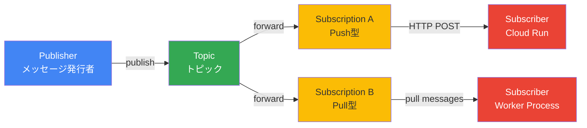
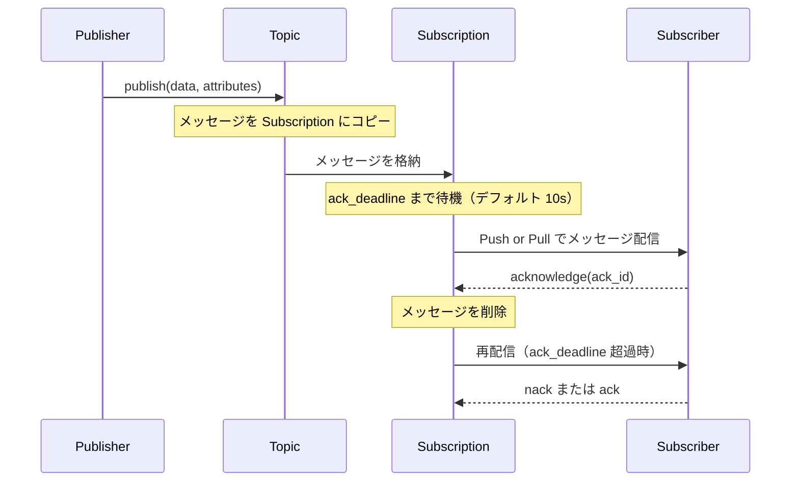

## はじめに

マイクロサービスを運用していると、サービス間の非同期通信が避けられない場面が増えてきます。注文が確定したらメールを送る、ファイルがアップロードされたら変換処理を走らせる、ユーザーの行動ログをリアルタイムで集計する——これらを同期的なAPIコールで実装すると、一方のサービスがダウンしただけで全体が止まります。

Cloud Pub/Sub は Google Cloud のフルマネージドなメッセージングサービスで、パブリッシャーとサブスクライバーを疎結合にしつつ、大規模なスループットと配信保証を両立します。1秒あたり数百万メッセージを処理でき、サブスクライバーが複数あっても1つのトピックから全員にメッセージを届けられます。

本記事では、Pub/Sub を実運用で使いこなすための実践的なパターンを網羅します。Push と Pull の使い分け、べき等処理、デッドレタートピック、順序保証、フィルタリング、バッチ処理と、設計判断に必要な知識を順に整理していきます。

### Cloud Tasks との使い分け

Pub/Sub を採用する前に、Cloud Tasks との使い分けを明確にしておきます。

| 観点 | Cloud Pub/Sub | Cloud Tasks |
|------|--------------|------------|
| 配信モデル | ブロードキャスト（複数コンシューマー） | 単一 HTTP エンドポイント |
| 実行制御 | できるだけ早く配信 | レート・同時実行・スケジュールを細かく制御 |
| メッセージ保持 | 最大 31 日 | 最大 31 日 |
| メッセージサイズ | 最大 10 MB | 最大 1 MB |
| 未来のスケジュール | 不可 | 可能（scheduleTime 指定） |
| 向いているユースケース | イベント通知・複数コンシューマー | 個別タスクの実行制御が必要な場合 |

同じイベントを複数システムに通知したい、コンシューマーが HTTP エンドポイントを持たない、1秒あたり数百万件のスループットが必要——これらに当てはまる場合は Pub/Sub を選びます。個々のタスクに対して「いつ」「何回」「どのレートで」処理するかを制御したい場合は Cloud Tasks が適切です。

---

## 基本アーキテクチャ

Pub/Sub を理解するには、4つのコアコンポーネントの関係を把握することが出発点になります。



- Topic: メッセージの受け口です。パブリッシャーはトピックにメッセージを送り、その先の届け先は関知しません。
- Subscription: トピックへの購読設定です。1つのトピックに複数のサブスクリプションを作成でき、それぞれの購読者が独立してすべてのメッセージを受信します。Push と Pull の2種類があります。
- Publisher: トピックにメッセージを送信するアプリケーションです。
- Subscriber: サブスクリプション経由でメッセージを受信し、処理するアプリケーションです。

### メッセージのライフサイクル



サブスクライバーが `ack_deadline` 内に acknowledge を返さない場合、Pub/Sub はメッセージを再配信します。これが「at-least-once delivery」の仕組みです。同じメッセージを複数回受け取る可能性があるため、処理のべき等性が重要になります。

---

## セットアップ

### API 有効化と IAM 設定

```bash
# Pub/Sub API を有効化
gcloud services enable pubsub.googleapis.com

# トピック作成
gcloud pubsub topics create order-events \
  --project=YOUR_PROJECT_ID

# Pull 用サブスクリプション作成
gcloud pubsub subscriptions create order-events-worker \
  --topic=order-events \
  --ack-deadline=60 \
  --message-retention-duration=7d \
  --project=YOUR_PROJECT_ID

# Push 用サブスクリプション作成（Cloud Run エンドポイントへ）
gcloud pubsub subscriptions create order-events-push \
  --topic=order-events \
  --push-endpoint=https://my-service-xxxx-an.a.run.app/pubsub/push \
  --push-auth-service-account=pubsub-invoker@YOUR_PROJECT.iam.gserviceaccount.com \
  --ack-deadline=60 \
  --project=YOUR_PROJECT_ID
```

### IAM ロールの設定

Push サブスクリプションで Cloud Run を呼び出す場合、Pub/Sub がサービスアカウントのトークンを使って Cloud Run に認証付きリクエストを送ります。

```bash
# Push 呼び出し用サービスアカウントを作成
gcloud iam service-accounts create pubsub-invoker \
  --display-name="Pub/Sub Cloud Run Invoker"

# Cloud Run Invoker ロールを付与
gcloud projects add-iam-policy-binding YOUR_PROJECT_ID \
  --member="serviceAccount:pubsub-invoker@YOUR_PROJECT_ID.iam.gserviceaccount.com" \
  --role="roles/run.invoker"

# Pub/Sub サービスアカウントにトークン生成権限を付与
gcloud projects add-iam-policy-binding YOUR_PROJECT_ID \
  --member="serviceAccount:service-PROJECT_NUMBER@gcp-sa-pubsub.iam.gserviceaccount.com" \
  --role="roles/iam.serviceAccountTokenCreator"

# メッセージ発行用のサービスアカウントを作成
gcloud iam service-accounts create pubsub-publisher \
  --display-name="Pub/Sub Publisher"

gcloud pubsub topics add-iam-policy-binding order-events \
  --member="serviceAccount:pubsub-publisher@YOUR_PROJECT_ID.iam.gserviceaccount.com" \
  --role="roles/pubsub.publisher"
```

---

## Push Subscription + Cloud Run の実装

Push サブスクリプションは、Pub/Sub がメッセージを HTTP POST で指定エンドポイントに送信します。Cloud Run、Cloud Functions など HTTP エンドポイントを持つサービスと相性が良く、サブスクライバー側でポーリングループを実装する必要がありません。

### 使いどころ

- Cloud Run でイベント駆動の処理を行いたい
- 受信レートよりも処理レートが十分に高い
- サーバーレスで無駄なアイドル時間をなくしたい
- 認証を Pub/Sub に任せたい

### FastAPI による Push エンドポイント実装

```python
# main.py
import base64
import json
import logging
from typing import Any

from fastapi import FastAPI, HTTPException, Request
from pydantic import BaseModel

logger = logging.getLogger(__name__)
app = FastAPI()


class PubSubMessage(BaseModel):
    """Pub/Sub が Push で送信するメッセージ形式。"""
    data: str          # base64 エンコードされたメッセージ本文
    messageId: str
    publishTime: str
    attributes: dict[str, str] = {}
    orderingKey: str = ""


class PubSubPushRequest(BaseModel):
    """Push サブスクリプションが送信するリクエスト全体。"""
    message: PubSubMessage
    subscription: str


def decode_pubsub_message(message: PubSubMessage) -> dict[str, Any]:
    """base64 エンコードされたメッセージデータをデコードする。"""
    raw = base64.b64decode(message.data).decode("utf-8")
    return json.loads(raw)


@app.post("/pubsub/push")
async def handle_push(request: Request, body: PubSubPushRequest):
    """Pub/Sub Push サブスクリプションのエンドポイント。

    HTTP 200 を返すと ack（処理成功）として扱われる。
    HTTP 4xx を返すと ack（リトライ不要な失敗）として扱われる。
    HTTP 5xx またはタイムアウトで nack（リトライ対象）として扱われる。
    """
    try:
        payload = decode_pubsub_message(body.message)
        event_type = body.message.attributes.get("eventType", "unknown")

        logger.info(
            "Pub/Sub メッセージを受信",
            extra={
                "message_id": body.message.messageId,
                "event_type": event_type,
                "subscription": body.subscription,
            },
        )

        # イベントタイプに応じてハンドラーを分岐
        match event_type:
            case "order.created":
                await handle_order_created(payload, body.message.messageId)
            case "order.cancelled":
                await handle_order_cancelled(payload, body.message.messageId)
            case _:
                # 未知のイベントタイプは 200 で ack（リトライ不要）
                logger.warning(f"未知のイベントタイプ: {event_type}")

        return {"status": "ok", "message_id": body.message.messageId}

    except json.JSONDecodeError as e:
        # メッセージ形式が不正 → 4xx で ack（リトライしても無意味）
        logger.error(f"メッセージのデコード失敗: {e}")
        raise HTTPException(status_code=400, detail="Invalid message format")

    except Exception as e:
        # 予期しないエラー → 5xx で nack（リトライ対象）
        logger.error(f"メッセージ処理エラー: {e}", exc_info=True)
        raise HTTPException(status_code=500, detail="Internal server error")


async def handle_order_created(payload: dict, message_id: str) -> None:
    """注文作成イベントの処理。"""
    order_id = payload.get("order_id")
    logger.info(f"注文を処理中: order_id={order_id}, message_id={message_id}")
    # 実際の処理をここに実装する


async def handle_order_cancelled(payload: dict, message_id: str) -> None:
    """注文キャンセルイベントの処理。"""
    order_id = payload.get("order_id")
    logger.info(f"キャンセルを処理中: order_id={order_id}, message_id={message_id}")
```

### Python クライアントからのメッセージ発行

```python
# publisher.py
import json
import logging
from google.cloud import pubsub_v1
from google.api_core.exceptions import RetryError

logger = logging.getLogger(__name__)


def publish_event(
    project_id: str,
    topic_id: str,
    event_type: str,
    payload: dict,
    ordering_key: str = "",
) -> str:
    """Pub/Sub トピックにイベントを発行する。

    Args:
        project_id: GCP プロジェクト ID
        topic_id: トピック ID
        event_type: イベントタイプ（属性として付与）
        payload: メッセージ本文（JSON シリアライズ可能な dict）
        ordering_key: 順序保証が必要な場合に設定（同一キーのメッセージは順序保証）

    Returns:
        発行されたメッセージの ID
    """
    publisher = pubsub_v1.PublisherClient()
    topic_path = publisher.topic_path(project_id, topic_id)

    data = json.dumps(payload, ensure_ascii=False).encode("utf-8")

    future = publisher.publish(
        topic_path,
        data=data,
        # 属性はフィルタリングに利用可能（値は常に文字列）
        eventType=event_type,
        version="v1",
        # ordering_key が空文字の場合は順序保証なし
        ordering_key=ordering_key,
    )

    try:
        message_id = future.result(timeout=30)
        logger.info(f"メッセージを発行: message_id={message_id}, event_type={event_type}")
        return message_id
    except RetryError as e:
        logger.error(f"メッセージ発行失敗（リトライ上限超過）: {e}")
        raise


# 使用例
if __name__ == "__main__":
    publish_event(
        project_id="my-project",
        topic_id="order-events",
        event_type="order.created",
        payload={
            "order_id": "ord_12345",
            "user_id": "usr_67890",
            "total": 9800,
            "items": [{"sku": "SKU-001", "qty": 2}],
        },
    )
```

---

## Pull Subscription の実装（Streaming Pull）

Pull サブスクリプションは、サブスクライバー側からメッセージを取得しにいきます。Streaming Pull は双方向ストリームを維持し、メッセージが届き次第リアルタイムで受信します。

### 使いどころ

- 受信レートよりも処理に時間がかかる場合
- バックエンドワーカーや長時間稼働プロセス（GKE、Compute Engine）
- フロー制御が必要な高スループット処理
- Cloud Run のように HTTP エンドポイントが不要な場合

### Streaming Pull の実装

```python
# subscriber.py
import logging
import signal
import threading
from concurrent.futures import ThreadPoolExecutor
from google.cloud import pubsub_v1

logger = logging.getLogger(__name__)


def process_message(message: pubsub_v1.subscriber.message.Message) -> None:
    """受信メッセージを処理するコールバック関数。

    このコールバックはスレッドプール内で実行される。
    処理が ack_deadline（デフォルト 10s）を超える場合は、
    FlowControl で max_lease_duration を延長すること。
    """
    try:
        data = message.data.decode("utf-8")
        event_type = message.attributes.get("eventType", "unknown")

        logger.info(
            f"メッセージ受信: message_id={message.message_id}, "
            f"event_type={event_type}, publish_time={message.publish_time}"
        )

        # 実際の処理
        import json
        payload = json.loads(data)
        handle_event(event_type, payload, message.message_id)

        # 正常終了 → ack（メッセージをキューから削除）
        message.ack()
        logger.debug(f"ack 完了: {message.message_id}")

    except Exception as e:
        logger.error(f"メッセージ処理エラー: {e}", exc_info=True)
        # nack → Pub/Sub がリトライ（ack_deadline 後に再配信）
        message.nack()


def handle_event(event_type: str, payload: dict, message_id: str) -> None:
    """イベントタイプに応じた処理。"""
    logger.info(f"イベント処理: {event_type}, payload={payload}")


def start_subscriber(
    project_id: str,
    subscription_id: str,
    max_messages: int = 10,
    max_workers: int = 4,
) -> None:
    """Streaming Pull サブスクライバーを起動する。

    Args:
        project_id: GCP プロジェクト ID
        subscription_id: サブスクリプション ID
        max_messages: 同時に処理する最大メッセージ数（フロー制御）
        max_workers: メッセージ処理スレッド数
    """
    subscriber = pubsub_v1.SubscriberClient()
    subscription_path = subscriber.subscription_path(project_id, subscription_id)

    # フロー制御設定
    # max_messages: メモリに保持する最大メッセージ数
    # max_bytes: メモリに保持する最大バイト数
    flow_control = pubsub_v1.types.FlowControl(
        max_messages=max_messages,
        max_bytes=50 * 1024 * 1024,  # 50 MB
    )

    # メッセージ処理用のスレッドプール
    scheduler = pubsub_v1.subscriber.scheduler.ThreadScheduler(
        executor=ThreadPoolExecutor(max_workers=max_workers)
    )

    streaming_pull_future = subscriber.subscribe(
        subscription_path,
        callback=process_message,
        flow_control=flow_control,
        scheduler=scheduler,
    )

    logger.info(f"サブスクライバーを起動: {subscription_path}")
    logger.info(f"フロー制御: max_messages={max_messages}, max_workers={max_workers}")

    # SIGTERM/SIGINT でグレースフルシャットダウン
    shutdown_event = threading.Event()

    def shutdown_handler(signum, frame):
        logger.info("シャットダウンシグナルを受信")
        streaming_pull_future.cancel()
        shutdown_event.set()

    signal.signal(signal.SIGTERM, shutdown_handler)
    signal.signal(signal.SIGINT, shutdown_handler)

    try:
        streaming_pull_future.result()
    except Exception as e:
        streaming_pull_future.cancel()
        logger.error(f"サブスクライバーエラー: {e}")
        raise


if __name__ == "__main__":
    logging.basicConfig(level=logging.INFO)
    start_subscriber(
        project_id="my-project",
        subscription_id="order-events-worker",
        max_messages=10,
        max_workers=4,
    )
```

---

## メッセージのべき等処理パターン

Pub/Sub の at-least-once delivery により、同じメッセージが複数回配信される場合があります。ネットワーク障害、ack の遅延、サブスクライバーのクラッシュが原因です。処理のべき等性を確保することが信頼性の鍵になります。

### べき等処理の3つのパターン

パターン1: 処理自体をべき等にする

最もシンプルなアプローチです。同じ処理を何度実行しても結果が変わらないように設計します。

```python
# べき等な処理の例: UPSERT（存在すれば更新、なければ挿入）
async def upsert_user_score(user_id: str, score: int, event_at: str) -> None:
    """ユーザースコアの更新（べき等）。

    同じ user_id と event_at の組み合わせで何度実行しても、
    最終的に同じスコアが保存される。
    """
    # BigQuery の MERGE 文でべき等な UPSERT
    query = """
    MERGE `my_dataset.user_scores` T
    USING (SELECT @user_id AS user_id, @score AS score, @event_at AS event_at) S
    ON T.user_id = S.user_id AND T.event_at = S.event_at
    WHEN MATCHED THEN
        UPDATE SET score = S.score, updated_at = CURRENT_TIMESTAMP()
    WHEN NOT MATCHED THEN
        INSERT (user_id, score, event_at, created_at)
        VALUES (S.user_id, S.score, S.event_at, CURRENT_TIMESTAMP())
    """
    # BigQuery クライアントで実行
```

パターン2: 処理済み ID を記録して重複をスキップ

べき等にできない処理（メール送信など）では、処理済みのメッセージ ID を記録します。

```python
import redis
from typing import Optional


class IdempotencyGuard:
    """メッセージIDを使って重複処理を防ぐガード。

    Redis に処理済みIDを TTL 付きで記録する。
    TTL は Pub/Sub のメッセージ保持期間より長く設定すること。
    """

    def __init__(self, redis_client: redis.Redis, ttl_seconds: int = 7 * 24 * 3600):
        self.redis = redis_client
        self.ttl = ttl_seconds

    def is_processed(self, message_id: str, processing_key: Optional[str] = None) -> bool:
        """指定 ID が処理済みかを確認する。"""
        key = f"pubsub:processed:{processing_key or message_id}"
        return bool(self.redis.exists(key))

    def mark_processed(self, message_id: str, processing_key: Optional[str] = None) -> None:
        """指定 ID を処理済みとしてマークする。"""
        key = f"pubsub:processed:{processing_key or message_id}"
        self.redis.setex(key, self.ttl, "1")


# 使用例
async def send_order_confirmation_email(
    payload: dict,
    message_id: str,
    guard: IdempotencyGuard,
) -> None:
    """注文確認メールを送信する（重複送信防止付き）。"""
    order_id = payload["order_id"]
    # メッセージIDよりも業務IDで管理する方が堅牢
    key = f"email:order_confirmation:{order_id}"

    if guard.is_processed(message_id, processing_key=key):
        logger.info(f"重複メッセージをスキップ: order_id={order_id}")
        return

    # メール送信処理
    await send_email(
        to=payload["user_email"],
        subject=f"ご注文確認 #{order_id}",
        body=render_email_template(payload),
    )

    # 送信成功後にマーク
    guard.mark_processed(message_id, processing_key=key)
    logger.info(f"メール送信完了: order_id={order_id}")
```

パターン3: データベースの一意制約を活用する

Redis を使わず、データベースの一意制約でも重複を防げます。

```python
from sqlalchemy.exc import IntegrityError
from sqlalchemy.orm import Session


async def record_event_with_dedup(
    db: Session,
    event_id: str,
    event_type: str,
    payload: dict,
) -> bool:
    """イベントをDBに記録（一意制約で重複防止）。

    Returns:
        True: 新規記録（初回処理）
        False: 重複（スキップ）
    """
    try:
        event = EventRecord(
            event_id=event_id,     # UNIQUE 制約が設定されているカラム
            event_type=event_type,
            payload=payload,
        )
        db.add(event)
        db.commit()
        return True

    except IntegrityError:
        db.rollback()
        logger.info(f"重複イベントをスキップ: event_id={event_id}")
        return False
```

---

## デッドレタートピックの設定と処理

デッドレタートピック（DLT）は、指定回数のリトライを超えて処理できなかったメッセージを別トピックに転送する仕組みです。失敗メッセージを本流から分離することで、健全なメッセージの処理継続と失敗原因の調査を両立します。

### DLT の設定

```bash
# デッドレタートピックを作成
gcloud pubsub topics create order-events-dead-letter \
  --project=YOUR_PROJECT_ID

# DLT のサブスクリプションも作成しておく（メッセージが消えないように）
gcloud pubsub subscriptions create order-events-dead-letter-sub \
  --topic=order-events-dead-letter \
  --ack-deadline=60 \
  --project=YOUR_PROJECT_ID

# Pub/Sub サービスアカウントに DLT への発行権限を付与
gcloud pubsub topics add-iam-policy-binding order-events-dead-letter \
  --member="serviceAccount:service-PROJECT_NUMBER@gcp-sa-pubsub.iam.gserviceaccount.com" \
  --role="roles/pubsub.publisher" \
  --project=YOUR_PROJECT_ID

# Pub/Sub サービスアカウントに元サブスクリプションへの購読者権限を付与
gcloud pubsub subscriptions add-iam-policy-binding order-events-worker \
  --member="serviceAccount:service-PROJECT_NUMBER@gcp-sa-pubsub.iam.gserviceaccount.com" \
  --role="roles/pubsub.subscriber" \
  --project=YOUR_PROJECT_ID

# サブスクリプションに DLT を設定
# max-delivery-attempts: 5〜100 の間で設定（最小5）
gcloud pubsub subscriptions modify-push-config order-events-worker \
  --dead-letter-topic=projects/YOUR_PROJECT_ID/topics/order-events-dead-letter \
  --max-delivery-attempts=5 \
  --project=YOUR_PROJECT_ID
```

### Python でサブスクリプション作成時に DLT を設定

```python
from google.cloud import pubsub_v1
from google.cloud.pubsub_v1.types import DeadLetterPolicy


def create_subscription_with_dlq(
    project_id: str,
    topic_id: str,
    subscription_id: str,
    dead_letter_topic_id: str,
    max_delivery_attempts: int = 5,
    ack_deadline_seconds: int = 60,
) -> None:
    """デッドレタートピック付きサブスクリプションを作成する。

    Args:
        max_delivery_attempts: 5〜100 の間で設定。
            この回数を超えると DLT に転送される。
    """
    subscriber = pubsub_v1.SubscriberClient()
    publisher = pubsub_v1.PublisherClient()

    subscription_path = subscriber.subscription_path(project_id, subscription_id)
    topic_path = publisher.topic_path(project_id, topic_id)
    dead_letter_topic_path = publisher.topic_path(project_id, dead_letter_topic_id)

    subscription = pubsub_v1.types.Subscription(
        name=subscription_path,
        topic=topic_path,
        ack_deadline_seconds=ack_deadline_seconds,
        dead_letter_policy=DeadLetterPolicy(
            dead_letter_topic=dead_letter_topic_path,
            max_delivery_attempts=max_delivery_attempts,
        ),
    )

    result = subscriber.create_subscription(request=subscription)
    print(f"サブスクリプションを作成しました: {result.name}")
    print(f"DLT: {dead_letter_topic_path}, 最大試行回数: {max_delivery_attempts}")
```

### DLT メッセージの処理

DLT に転送されたメッセージには、失敗の経緯が属性として付与されます。

```python
# dlq_handler.py
import json
import logging
from google.cloud import pubsub_v1

logger = logging.getLogger(__name__)


def handle_dead_letter_message(
    message: pubsub_v1.subscriber.message.Message,
) -> None:
    """DLT に転送されたメッセージを処理する。

    DLT メッセージの属性:
    - CloudPubSubDeadLetterSourceSubscription: 転送元サブスクリプション
    - CloudPubSubDeadLetterSourceSubscriptionProject: プロジェクト ID
    - CloudPubSubDeadLetterSourceTopicPublishTime: 元の発行時刻
    - CloudPubSubDeadLetterSourceDeliveryCount: 試行回数
    """
    try:
        source_subscription = message.attributes.get(
            "CloudPubSubDeadLetterSourceSubscription", "unknown"
        )
        delivery_count = message.attributes.get(
            "CloudPubSubDeadLetterSourceDeliveryCount", "unknown"
        )
        original_event_type = message.attributes.get("eventType", "unknown")

        payload = json.loads(message.data.decode("utf-8"))

        logger.error(
            "DLT にメッセージが転送されました",
            extra={
                "message_id": message.message_id,
                "source_subscription": source_subscription,
                "delivery_count": delivery_count,
                "event_type": original_event_type,
                "payload": payload,
            },
        )

        # アラートを送信（Discord、Slack など）
        send_alert_to_discord(
            title=f"DLT: {original_event_type}",
            description=f"メッセージ {message.message_id} が {delivery_count} 回失敗",
            payload=payload,
        )

        # 手動リトライ用にデータを保存
        save_for_manual_replay(
            message_id=message.message_id,
            event_type=original_event_type,
            payload=payload,
            delivery_count=int(delivery_count),
        )

        message.ack()

    except Exception as e:
        logger.error(f"DLT ハンドラーエラー: {e}", exc_info=True)
        message.nack()


def start_dlq_subscriber(project_id: str, dlq_subscription_id: str) -> None:
    """DLT サブスクライバーを起動する。"""
    subscriber = pubsub_v1.SubscriberClient()
    subscription_path = subscriber.subscription_path(project_id, dlq_subscription_id)

    streaming_pull_future = subscriber.subscribe(
        subscription_path, callback=handle_dead_letter_message
    )

    logger.info(f"DLT サブスクライバー起動: {subscription_path}")
    streaming_pull_future.result()
```

---

## 順序保証（ordering key）の実装

通常、Pub/Sub は同じ ordering key を持つメッセージを発行順に届けることを保証しません。ordering key 機能を使うと、同一キーのメッセージが発行順に配信されるようになります。

### 制約と注意事項

| 項目 | 内容 |
|------|------|
| スループット制限 | ordering key ごとに 1 MB/s |
| 再配信時の挙動 | 再配信時は以降の同一キーのメッセージもすべて再配信される |
| プッシュサブスクリプション | 同一キーの outstanding メッセージは1件のみ（スループット低下に注意） |
| リージョン制約 | 同一リージョン内でのみ順序保証。クロスリージョンは保証なし |
| サブスクリプション設定 | `enable-message-ordering` が必要 |

### 設定と実装

```bash
# 順序保証付きサブスクリプションを作成
gcloud pubsub subscriptions create order-events-ordered \
  --topic=order-events \
  --enable-message-ordering \
  --ack-deadline=60 \
  --project=YOUR_PROJECT_ID
```

```python
# ordered_publisher.py
import json
import logging
from google.cloud import pubsub_v1
from google.api_core import gapic_v1

logger = logging.getLogger(__name__)


def create_ordered_publisher() -> pubsub_v1.PublisherClient:
    """順序保証付きパブリッシャーを作成する。

    ordering_key を使う場合は enable_message_ordering=True が必須。
    """
    publisher_options = pubsub_v1.types.PublisherOptions(
        enable_message_ordering=True,
    )
    return pubsub_v1.PublisherClient(publisher_options=publisher_options)


def publish_ordered_events(
    project_id: str,
    topic_id: str,
    user_id: str,
    events: list[dict],
) -> list[str]:
    """同一ユーザーのイベントを順序保証付きで発行する。

    ordering_key に user_id を使うことで、
    同一ユーザーのイベントが発行順に届くことを保証する。

    注意: ordering key ごとに 1 MB/s のスループット制限がある。
    """
    publisher = create_ordered_publisher()
    topic_path = publisher.topic_path(project_id, topic_id)

    message_ids = []
    for event in events:
        future = publisher.publish(
            topic_path,
            data=json.dumps(event, ensure_ascii=False).encode("utf-8"),
            eventType=event["type"],
            ordering_key=user_id,  # 同一ユーザーは同一キーで順序保証
        )
        message_id = future.result(timeout=30)
        message_ids.append(message_id)
        logger.info(f"発行完了: message_id={message_id}, user_id={user_id}")

    return message_ids


# 使用例: ユーザーの行動ログを順序保証付きで発行
if __name__ == "__main__":
    user_events = [
        {"type": "page_view", "page": "/products", "seq": 1},
        {"type": "add_to_cart", "sku": "SKU-001", "seq": 2},
        {"type": "checkout_start", "seq": 3},
        {"type": "order_complete", "order_id": "ord_123", "seq": 4},
    ]
    publish_ordered_events(
        project_id="my-project",
        topic_id="user-events",
        user_id="usr_67890",
        events=user_events,
    )
```

### ordering key を使ったサブスクライバーの実装

```python
# ordered_subscriber.py
import json
import logging
from collections import defaultdict
from google.cloud import pubsub_v1

logger = logging.getLogger(__name__)

# ordering key ごとの最終処理シーケンス番号を記録
# 実運用では Redis や DB で永続化すること
_last_sequence: dict[str, int] = defaultdict(int)


def process_ordered_message(
    message: pubsub_v1.subscriber.message.Message,
) -> None:
    """順序保証付きメッセージを処理する。

    ordering key が設定されている場合、nack するとそのキーの
    後続メッセージもすべて再配信されるため、慎重に扱う。
    """
    try:
        ordering_key = message.ordering_key  # 空文字の場合は順序保証なし
        payload = json.loads(message.data.decode("utf-8"))
        seq = payload.get("seq", 0)

        if ordering_key:
            logger.info(
                f"順序付きメッセージ受信: key={ordering_key}, seq={seq}, "
                f"message_id={message.message_id}"
            )

            # シーケンス番号の検証（オプション）
            last_seq = _last_sequence[ordering_key]
            if seq <= last_seq:
                logger.warning(f"過去のシーケンス番号を受信: key={ordering_key}, seq={seq}, last={last_seq}")
            _last_sequence[ordering_key] = seq

        # 処理実行
        handle_user_event(ordering_key, payload)
        message.ack()

    except Exception as e:
        logger.error(f"処理エラー: {e}", exc_info=True)
        # ordering key が設定されている場合、nack すると後続も全部再配信される
        # 致命的なエラー以外は ack して DLT に任せる設計も有効
        message.nack()


def handle_user_event(user_id: str, event: dict) -> None:
    """ユーザーイベントを処理する。"""
    event_type = event.get("type")
    logger.info(f"ユーザーイベント処理: user_id={user_id}, type={event_type}")
```

---

## メッセージフィルタリング

サブスクリプションにフィルター式を設定すると、条件に合致したメッセージだけが配信されます。フィルターに合致しないメッセージは自動的に ack され、サブスクライバーには届きません。これにより、1つのトピックから用途別に複数のサブスクリプションを作れます。

### フィルター構文

```bash
# 属性 eventType が "order.created" のメッセージのみ受信
gcloud pubsub subscriptions create order-created-sub \
  --topic=order-events \
  --message-filter='attributes.eventType="order.created"' \
  --project=YOUR_PROJECT_ID

# AND 条件（注文作成 かつ 優先度が high）
gcloud pubsub subscriptions create priority-orders-sub \
  --topic=order-events \
  --message-filter='attributes.eventType="order.created" AND attributes.priority="high"' \
  --project=YOUR_PROJECT_ID

# has() 関数で属性の存在チェック
gcloud pubsub subscriptions create tagged-events-sub \
  --topic=order-events \
  --message-filter='has(attributes.campaignId)' \
  --project=YOUR_PROJECT_ID

# hasPrefix() 関数でプレフィックスマッチ
gcloud pubsub subscriptions create jp-orders-sub \
  --topic=order-events \
  --message-filter='hasPrefix(attributes.region, "jp-")' \
  --project=YOUR_PROJECT_ID
```

フィルター構文の制約は以下のとおりです。

| 項目 | 内容 |
|------|------|
| フィルター対象 | 属性（attribute）のみ。メッセージ本文は対象外 |
| 属性値の型 | 常に文字列。数値比較は不可 |
| 正規表現 | サポートなし |
| 変更・削除 | サブスクリプション作成後は変更不可 |
| 演算子 | `=`（完全一致）、`has()`、`hasPrefix()`、`AND`、`OR`、`NOT` |

### Python での属性付き発行

```python
# フィルタリングに使う属性を適切に設定して発行する
def publish_with_routing_attributes(
    project_id: str,
    topic_id: str,
    payload: dict,
    event_type: str,
    priority: str = "normal",
    region: str = "jp-east",
    campaign_id: str | None = None,
) -> str:
    """ルーティング属性付きでメッセージを発行する。

    サブスクリプション側のフィルターで使用する属性を明示的に設定する。
    属性値は常に文字列である必要がある。
    """
    publisher = pubsub_v1.PublisherClient()
    topic_path = publisher.topic_path(project_id, topic_id)

    attributes = {
        "eventType": event_type,
        "priority": priority,
        "region": region,
    }

    # オプション属性は None の場合は設定しない
    if campaign_id:
        attributes["campaignId"] = campaign_id

    future = publisher.publish(
        topic_path,
        data=json.dumps(payload, ensure_ascii=False).encode("utf-8"),
        **attributes,
    )
    return future.result(timeout=30)
```

---

## 大量メッセージのバッチ処理

高スループットの処理では、バッチ設定とフロー制御を適切に組み合わせることがパフォーマンスの鍵になります。

### パブリッシャー側のバッチ設定

```python
# batch_publisher.py
import json
import logging
from concurrent.futures import as_completed, Future
from google.cloud import pubsub_v1
from google.cloud.pubsub_v1.types import BatchSettings, PublishFlowControl, LimitExceededBehavior

logger = logging.getLogger(__name__)


def create_batch_publisher(
    max_messages: int = 100,
    max_bytes: int = 1 * 1024 * 1024,  # 1 MB
    max_latency: float = 0.1,           # 100ms
) -> pubsub_v1.PublisherClient:
    """バッチ設定付きパブリッシャーを作成する。

    Args:
        max_messages: バッチあたりの最大メッセージ数（上限 1000）
        max_bytes: バッチあたりの最大バイト数（上限 10 MB）
        max_latency: バッチを送信するまでの最大待機時間（秒）

    どれか1つの条件に達した時点でバッチが送信される。
    """
    batch_settings = BatchSettings(
        max_messages=max_messages,
        max_bytes=max_bytes,
        max_latency=max_latency,
    )

    # パブリッシャー側のフロー制御
    # 未送信メッセージが limit を超えたら BLOCK または RAISE
    flow_control = PublishFlowControl(
        message_limit=1000,
        byte_limit=10 * 1024 * 1024,  # 10 MB
        limit_exceeded_behavior=LimitExceededBehavior.BLOCK,
    )

    return pubsub_v1.PublisherClient(
        batch_settings=batch_settings,
        flow_control=flow_control,
    )


def publish_batch(
    project_id: str,
    topic_id: str,
    messages: list[dict],
    event_type: str,
) -> dict:
    """複数メッセージをバッチで発行する。

    Returns:
        {"success": 成功数, "failed": 失敗数}
    """
    publisher = create_batch_publisher()
    topic_path = publisher.topic_path(project_id, topic_id)

    futures: list[Future] = []
    for msg in messages:
        future = publisher.publish(
            topic_path,
            data=json.dumps(msg, ensure_ascii=False).encode("utf-8"),
            eventType=event_type,
        )
        futures.append(future)

    success = 0
    failed = 0
    for future in as_completed(futures):
        try:
            message_id = future.result(timeout=30)
            success += 1
            logger.debug(f"発行成功: {message_id}")
        except Exception as e:
            failed += 1
            logger.error(f"発行失敗: {e}")

    logger.info(f"バッチ発行完了: success={success}, failed={failed}")
    return {"success": success, "failed": failed}
```

### サブスクライバー側の ack_deadline 延長

長時間の処理では、ack_deadline が切れて再配信が発生しないように `modify_ack_deadline` を使います。

```python
# long_running_subscriber.py
import asyncio
import logging
import threading
from google.cloud import pubsub_v1

logger = logging.getLogger(__name__)


def process_with_deadline_extension(
    message: pubsub_v1.subscriber.message.Message,
    subscriber_client: pubsub_v1.SubscriberClient,
    subscription_path: str,
) -> None:
    """処理時間が長いメッセージを ack_deadline を延長しながら処理する。"""
    stop_extension = threading.Event()

    def extend_deadline():
        """バックグラウンドスレッドで ack_deadline を定期延長する。"""
        while not stop_extension.wait(timeout=30):  # 30秒ごとに延長
            try:
                subscriber_client.modify_ack_deadline(
                    request={
                        "subscription": subscription_path,
                        "ack_ids": [message.ack_id],
                        "ack_deadline_seconds": 60,  # さらに 60 秒延長
                    }
                )
                logger.debug(f"ack_deadline を延長: {message.message_id}")
            except Exception as e:
                logger.warning(f"ack_deadline 延長失敗: {e}")

    # バックグラウンドで deadline 延長スレッドを起動
    extension_thread = threading.Thread(target=extend_deadline, daemon=True)
    extension_thread.start()

    try:
        # 長時間かかる処理（例: 動画変換、機械学習推論など）
        perform_heavy_processing(message.data)
        message.ack()
        logger.info(f"長時間処理完了: {message.message_id}")

    except Exception as e:
        logger.error(f"処理エラー: {e}", exc_info=True)
        message.nack()

    finally:
        stop_extension.set()
        extension_thread.join(timeout=5)


def perform_heavy_processing(data: bytes) -> None:
    """重い処理のプレースホルダー。"""
    import time
    time.sleep(120)  # 2分かかる処理のシミュレーション
```

---

## モニタリングと運用

### 重要なメトリクス

Pub/Sub の健全性を監視するには、以下のメトリクスを Cloud Monitoring で追跡します。

| メトリクス | 説明 | アラート目安 |
|-----------|------|-------------|
| `subscription/num_undelivered_messages` | 未配信メッセージ数（バックログ） | 急激な増加 |
| `subscription/oldest_unacked_message_age` | 最も古い未 ack メッセージの経過時間 | 保持期間の 80% |
| `subscription/num_outstanding_messages` | 配信済みだが未 ack のメッセージ数 | 閾値超過 |
| `topic/send_message_operation_count` | 発行操作数 | 急激な増減 |
| `subscription/dead_letter_message_count` | DLT 転送数 | 1件以上で即時アラート |

### Cloud Monitoring でのアラート設定

```python
# monitoring_setup.py
from google.cloud import monitoring_v3
from google.protobuf import duration_pb2


def create_pubsub_alert(
    project_id: str,
    subscription_id: str,
    notification_channel_id: str,
    max_message_age_seconds: int = 3600,  # 1 時間
) -> None:
    """oldest_unacked_message_age のアラートを設定する。

    最も古い未処理メッセージが指定時間を超えたらアラートを発火する。
    """
    client = monitoring_v3.AlertPolicyServiceClient()
    project_name = f"projects/{project_id}"

    alert_policy = monitoring_v3.AlertPolicy(
        display_name=f"Pub/Sub Oldest Unacked - {subscription_id}",
        conditions=[
            monitoring_v3.AlertPolicy.Condition(
                display_name="Oldest unacked message age",
                condition_threshold=monitoring_v3.AlertPolicy.Condition.MetricThreshold(
                    filter=(
                        f'resource.type = "pubsub_subscription" '
                        f'AND metric.type = "pubsub.googleapis.com/subscription/oldest_unacked_message_age" '
                        f'AND resource.labels.subscription_id = "{subscription_id}"'
                    ),
                    comparison=monitoring_v3.ComparisonType.COMPARISON_GT,
                    threshold_value=max_message_age_seconds,
                    duration=duration_pb2.Duration(seconds=300),
                    aggregations=[
                        monitoring_v3.Aggregation(
                            alignment_period=duration_pb2.Duration(seconds=60),
                            per_series_aligner=monitoring_v3.Aggregation.Aligner.ALIGN_MAX,
                        )
                    ],
                ),
            )
        ],
        combiner=monitoring_v3.AlertPolicy.ConditionCombinerType.AND,
        notification_channels=[
            f"projects/{project_id}/notificationChannels/{notification_channel_id}"
        ],
    )

    policy = client.create_alert_policy(
        request={"name": project_name, "alert_policy": alert_policy}
    )
    print(f"アラートポリシーを作成: {policy.name}")
```

### 運用時のトラブルシューティングコマンド

```bash
# サブスクリプションの状態確認
gcloud pubsub subscriptions describe order-events-worker \
  --project=YOUR_PROJECT_ID

# バックログの件数確認
gcloud pubsub subscriptions describe order-events-worker \
  --format="value(name,numUndeliveredMessages)" \
  --project=YOUR_PROJECT_ID

# 未処理メッセージのプレビュー（1件確認）
gcloud pubsub subscriptions pull order-events-worker \
  --limit=1 \
  --auto-ack=false \
  --project=YOUR_PROJECT_ID

# seek でバックログをリセット（注意: メッセージが失われる）
gcloud pubsub subscriptions seek order-events-worker \
  --time=$(date -u +%Y-%m-%dT%H:%M:%SZ) \
  --project=YOUR_PROJECT_ID

# DLT の未処理件数確認
gcloud pubsub subscriptions describe order-events-dead-letter-sub \
  --format="value(numUndeliveredMessages)" \
  --project=YOUR_PROJECT_ID

# トピックへのテストメッセージ発行
gcloud pubsub topics publish order-events \
  --message='{"order_id":"test_001","test":true}' \
  --attribute=eventType=order.created,priority=normal \
  --project=YOUR_PROJECT_ID
```

### よくあるエラーと対処

| エラー / 症状 | 原因 | 対処 |
|--------------|------|------|
| バックログが増え続ける | サブスクライバーの処理が追いつかない | max_messages を下げるか、サブスクライバーのスケールアウト |
| 同じメッセージが何度も来る | ack_deadline 内に処理が終わらず再配信 | ack_deadline を延長するか modify_ack_deadline を使う |
| ordering key 設定後にスループット低下 | キーごとに 1 MB/s の制限 | 粒度の細かいキー設計に見直す |
| DLT 転送数が増加 | 処理ロジックのバグや外部依存のエラー | DLT メッセージの内容から根本原因を調査 |
| Push で 403 エラー | OIDC トークン検証失敗 | サービスアカウントの権限と audience 設定を確認 |
| `RESOURCE_EXHAUSTED` | Pub/Sub のクォータ超過 | クォータの増加申請またはパブリッシュレートを抑制 |

---

## まとめ

Cloud Pub/Sub は単純なメッセージキューを超え、イベント駆動アーキテクチャの基盤として幅広い場面で活躍します。本記事で扱った内容を振り返ります。

Push と Pull の使い分けでは、Cloud Run などサーバーレス環境には Push が自然に統合できます。長時間稼働のワーカープロセスやフロー制御が必要な高スループット処理では Pull（Streaming Pull）が適切です。

べき等処理は、at-least-once delivery の性質上、全実装で必須の考え方です。処理自体をべき等にする、Redis で処理済み ID を記録する、データベースの一意制約を使う——3つのパターンを状況に応じて使い分けます。

デッドレタートピックは、本番運用で必ず設定すべき機能です。最大試行回数を超えたメッセージを DLT に転送することで、失敗の見落としがなくなります。DLT のサブスクリプションを忘れずに作成することと、Pub/Sub サービスアカウントへの権限付与が設定の要点です。

ordering key は強力な機能ですが、キーごとのスループット制限（1 MB/s）と nack 時の挙動（後続メッセージもすべて再配信）を理解した上で慎重に使います。

モニタリングでは `oldest_unacked_message_age` を最重要指標として監視し、バックログの異常増加に早期に気づける体制を整えることが安定運用の核心です。

まずは Push + Cloud Run の基本構成から始め、スループット要件やバックログの増加など実際の運用データを見ながら Pull 移行やフロー制御の導入を検討していくアプローチが実践的です。
