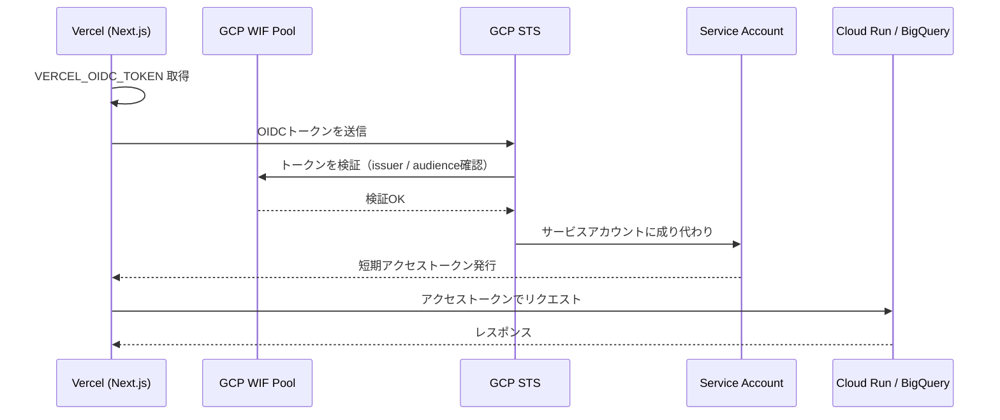
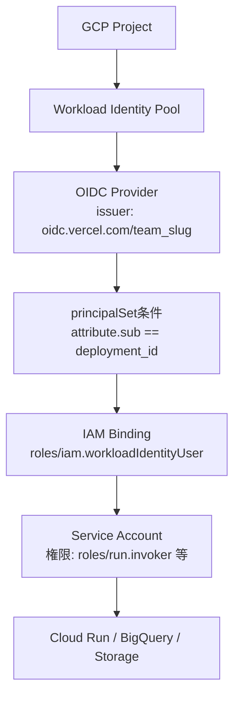

## はじめに

Vercel上のNext.jsアプリからCloud RunやBigQueryを呼び出す際、多くの記事では以下のような方法を紹介しています。

```bash
# よく見る方法（非推奨）
GOOGLE_CREDENTIALS={"type":"service_account","project_id":"...","private_key":"..."}
```

GCPのサービスアカウントキー（JSONファイル）をVercelの環境変数に貼り付ける方法です。動くことは動きますが、この方法にはいくつかの深刻なリスクがあります。

### サービスアカウントキーの問題点

**1. キーの漏洩リスク**
Vercelの環境変数はプレビュー環境や開発者が閲覧できる状態になることがあります。長期有効なサービスアカウントキーが漏洩した場合、そのキーを使ってGCPリソースへ不正アクセスされる危険があります。

**2. ローテーションの困難さ**
サービスアカウントキーは90日ごとのローテーションが推奨されています。しかし実運用では、Vercel環境変数の更新→再デプロイという手順が必要となり、運用負荷が高くなりがちです。

**3. キーの増殖**
開発環境・ステージング・本番と環境が増えるほど、同一サービスアカウントのキーが複数箇所に存在することになります。どのキーが有効でどのキーが廃止されたかの管理が複雑になります。

### Workload Identity Federationで解決できること

**Workload Identity Federation（WIF）** を使うと、サービスアカウントキーを一切作成・配布せずにGCPリソースへアクセスできます。

- サービスアカウントキーが存在しないため、漏洩リスクがゼロ
- OIDCトークンはリクエストごとに動的に発行されるため、ローテーション不要
- キーの棚卸し・監査が不要になる

本記事では、VercelのOIDCトークン機能とGCPのWorkload Identity Federationを組み合わせたキーレス認証の実装方法を解説します。

---

## Workload Identity Federationの仕組み

### 概要

WIFは外部のIDプロバイダー（Vercel、GitHub Actions、AWS等）が発行するトークンをGCPのIAMが信頼する仕組みです。



### 主要コンポーネント

**Workload Identity Pool（WIFプール）**
外部IDプロバイダーとGCPの間の信頼関係を管理するコンテナです。プロバイダー（Vercel、GitHub等）を複数登録できます。

**OIDCプロバイダー（Provider）**
プール内に作成する設定で、外部IDプロバイダーのissuer URLやallowed audiencesを定義します。

**principalSet（主体セット）**
IAMバインディングで使用する条件式で、「このプロバイダーからのトークンのみ許可」という絞り込みができます。

### WIF設定の構造



---

## GCP側の設定

### 前提条件

- GCPプロジェクトが作成済みであること
- `gcloud` CLIがインストール・認証済みであること
- Vercelチームアカウントを使用していること（issuerMode "team"が必要）

### 手順1: 必要なAPIを有効化

```bash
gcloud services enable iam.googleapis.com \
  iamcredentials.googleapis.com \
  sts.googleapis.com \
  --project=YOUR_PROJECT_ID
```

### 手順2: Workload Identity Poolを作成

**gcloudコマンド**

```bash
gcloud iam workload-identity-pools create "vercel-pool" \
  --project="YOUR_PROJECT_ID" \
  --location="global" \
  --display-name="Vercel Workload Identity Pool"
```

**GUIでの操作**
1. GCPコンソール → IAM と管理 → Workload Identity 連携
2. 「プールを作成」をクリック
3. 名前: `vercel-pool`、説明を入力して「続行」

プールIDを確認します。

```bash
gcloud iam workload-identity-pools describe "vercel-pool" \
  --project="YOUR_PROJECT_ID" \
  --location="global" \
  --format="value(name)"
# 出力例: projects/123456789/locations/global/workloadIdentityPools/vercel-pool
```

### 手順3: OIDCプロバイダーを作成

VercelのissuerモードはデフォルトではProject単位ですが、**Team単位（issuerMode: "team"）** を使うとチーム全体で共通のissuer URLになります。

Vercelのissuer URLの形式は以下の通りです。

```
https://oidc.vercel.com/{team_slug}
```

`team_slug` はVercelのチームURLから確認できます（例: `https://vercel.com/{team_slug}`）。

**gcloudコマンド**

```bash
gcloud iam workload-identity-pools providers create-oidc "vercel-provider" \
  --project="YOUR_PROJECT_ID" \
  --location="global" \
  --workload-identity-pool="vercel-pool" \
  --display-name="Vercel OIDC Provider" \
  --issuer-uri="https://oidc.vercel.com/YOUR_TEAM_SLUG" \
  --allowed-audiences="https://gcp.vercel-oidc.vercel.app" \
  --attribute-mapping="google.subject=assertion.sub,attribute.project_id=assertion.project_id,attribute.team_id=assertion.team_id"
```

**GUIでの操作**
1. 作成したプールを選択 → 「プロバイダーを追加」
2. プロバイダーの種類: OpenID Connect（OIDC）
3. プロバイダー名: `vercel-provider`
4. 発行元（Issuer） URL: `https://oidc.vercel.com/YOUR_TEAM_SLUG`
5. 許可されたオーディエンス: `https://gcp.vercel-oidc.vercel.app`
6. 属性マッピングを設定して「保存」

:::message
**allowed-audiencesについて**
`https://gcp.vercel-oidc.vercel.app` はVercelのGCP連携で使用する標準的なaudience値です。Vercelのドキュメントに記載されている値を使用してください。カスタムaudienceを設定する場合は、後述のNext.js実装側でも同じ値を指定する必要があります。
:::

### 手順4: サービスアカウントを作成

```bash
gcloud iam service-accounts create "vercel-sa" \
  --project="YOUR_PROJECT_ID" \
  --display-name="Vercel Service Account"
```

### 手順5: サービスアカウントに必要なロールを付与

呼び出すGCPサービスに応じて適切なロールを付与します。

**Cloud Runを呼び出す場合**

```bash
gcloud projects add-iam-policy-binding YOUR_PROJECT_ID \
  --member="serviceAccount:vercel-sa@YOUR_PROJECT_ID.iam.gserviceaccount.com" \
  --role="roles/run.invoker"
```

**BigQueryを使用する場合**

```bash
gcloud projects add-iam-policy-binding YOUR_PROJECT_ID \
  --member="serviceAccount:vercel-sa@YOUR_PROJECT_ID.iam.gserviceaccount.com" \
  --role="roles/bigquery.dataViewer"

gcloud projects add-iam-policy-binding YOUR_PROJECT_ID \
  --member="serviceAccount:vercel-sa@YOUR_PROJECT_ID.iam.gserviceaccount.com" \
  --role="roles/bigquery.jobUser"
```

### 手順6: WIFからサービスアカウントへのバインディング

WIFプールからサービスアカウントに成り代われるように `roles/iam.workloadIdentityUser` を付与します。

```bash
# プール名を変数に設定
POOL_NAME=$(gcloud iam workload-identity-pools describe "vercel-pool" \
  --project="YOUR_PROJECT_ID" \
  --location="global" \
  --format="value(name)")

# principalSetを使ってバインディング（プロバイダー全体を許可）
gcloud iam service-accounts add-iam-policy-binding \
  "vercel-sa@YOUR_PROJECT_ID.iam.gserviceaccount.com" \
  --project="YOUR_PROJECT_ID" \
  --role="roles/iam.workloadIdentityUser" \
  --member="principalSet://iam.googleapis.com/${POOL_NAME}/attribute.team_id/YOUR_VERCEL_TEAM_ID"
```

:::message
**principalSetの絞り込みについて**
`attribute.team_id` でVercelのチームIDに絞ることで、自分のVercelチームからのトークンのみを受け入れます。さらに厳密に絞り込む場合は `attribute.project_id` でVercelプロジェクトを特定できます。

Vercel Team IDは `https://vercel.com/teams/{team_slug}/settings` のGeneral設定で確認できます。
:::

---

## Vercel側の設定

### OIDC機能の有効化

Vercelダッシュボードで以下の設定を行います。

1. チームの Settings → Security
2. 「Secure Backend Access」セクション → 「Enable OIDC Federation」を有効化
3. Issuer Mode: **Team** を選択（GCPプロバイダー設定のissuer URLと一致させる）

:::message alert
**Issuer ModeはTeamを選択してください**
Project モードの場合、issuer URLが `https://oidc.vercel.com/PROJECT_ID` となり、GCP側の設定と一致しなくなります。チーム全体で共通の設定にするため、Team モードを推奨します。
:::

### 環境変数の設定

Vercel環境変数に以下を設定します。サービスアカウントキーは一切不要です。

```bash
# Vercel環境変数（Vercelダッシュボードで設定）
GCP_PROJECT_ID=YOUR_PROJECT_ID
GCP_PROJECT_NUMBER=123456789012       # 数字のプロジェクト番号
GCP_WORKLOAD_IDENTITY_POOL_ID=vercel-pool
GCP_WORKLOAD_IDENTITY_PROVIDER_ID=vercel-provider
GCP_SERVICE_ACCOUNT_EMAIL=vercel-sa@YOUR_PROJECT_ID.iam.gserviceaccount.com
```

`VERCEL_OIDC_TOKEN` はVercelが自動的に注入するため、自分で設定する必要はありません。

プロジェクト番号は以下のコマンドで確認できます。

```bash
gcloud projects describe YOUR_PROJECT_ID --format="value(projectNumber)"
```

---

## Next.js実装

### パッケージのインストール

```bash
npm install google-auth-library
```

### 認証クライアントの作成

`lib/gcp-auth.ts` として共通モジュールを作成します。

:::message
**audience（対象者）の設定について**
audienceにはWIFプロバイダーのリソース名を指定します。プロジェクトIDではなく**プロジェクト番号**が必要なため注意してください。以下のコマンドで確認できます。

```bash
gcloud projects describe YOUR_PROJECT_ID --format="value(projectNumber)"
```
:::

```typescript
// lib/gcp-auth.ts
import { ExternalAccountClient, GoogleAuth } from "google-auth-library";

// プロジェクト番号（数字）は gcloud projects describe で取得した値を設定
const PROJECT_NUMBER = process.env["GCP_PROJECT_NUMBER"]!;
const POOL_ID = process.env["GCP_WORKLOAD_IDENTITY_POOL_ID"]!;
const PROVIDER_ID = process.env["GCP_WORKLOAD_IDENTITY_PROVIDER_ID"]!;
const SERVICE_ACCOUNT_EMAIL = process.env["GCP_SERVICE_ACCOUNT_EMAIL"]!;

/**
 * Vercel OIDC + GCP WIFを使った認証クライアント
 * credential_source にVercelのOIDCトークンエンドポイントを指定する
 */
export function createWifClient(): ExternalAccountClient {
  return ExternalAccountClient.fromJSON({
    type: "external_account",
    audience: `//iam.googleapis.com/projects/${PROJECT_NUMBER}/locations/global/workloadIdentityPools/${POOL_ID}/providers/${PROVIDER_ID}`,
    subject_token_type: "urn:ietf:params:oauth:token-type:jwt",
    token_url: "https://sts.googleapis.com/v1/token",
    credential_source: {
      url: "https://oidc.vercel.com/token",
      headers: {
        Authorization: `Bearer ${process.env["VERCEL_OIDC_TOKEN"]}`,
      },
      format: {
        type: "json",
        subject_token_field_name: "id_token",
      },
    },
    service_account_impersonation_url: `https://iamcredentials.googleapis.com/v1/projects/-/serviceAccounts/${SERVICE_ACCOUNT_EMAIL}:generateAccessToken`,
  }) as ExternalAccountClient;
}

/**
 * 環境に応じた認証クライアントを返すファクトリ関数
 * - Vercel環境: VERCEL_OIDC_TOKEN が存在 → WIF経由
 * - ローカル環境: VERCEL_OIDC_TOKEN が未設定 → gcloud ADC経由
 */
export async function getGcpAuthClient() {
  if (process.env["VERCEL_OIDC_TOKEN"]) {
    return createWifClient();
  }
  // ローカル環境: Application Default Credentials（gcloud ADC）
  const auth = new GoogleAuth({
    scopes: ["https://www.googleapis.com/auth/cloud-platform"],
  });
  return auth.getClient();
}
```

Vercel環境変数に `GCP_PROJECT_NUMBER` を追加しておきます。

```bash
# Vercel環境変数（追加）
GCP_PROJECT_NUMBER=123456789012  # プロジェクト番号（数字）
```

### Cloud Runを呼び出す実装

Next.js App Routerの `app/api/` ディレクトリにAPI Routeを作成します。

```typescript
// app/api/cloud-run/route.ts
import { NextRequest, NextResponse } from "next/server";
import { GoogleAuth } from "google-auth-library";
import { getGcpAuthClient } from "@/lib/gcp-auth";

const CLOUD_RUN_URL = process.env["CLOUD_RUN_URL"]!;

export async function POST(request: NextRequest) {
  try {
    const body = await request.json();

    // 環境に応じた認証クライアントを取得（Vercel: WIF / ローカル: ADC）
    const authClient = await getGcpAuthClient();

    // Cloud Run呼び出し用のIDトークンを取得
    // GoogleAuth.getIdTokenClient はサービスアカウントを通じてIDトークンを発行する
    const auth = new GoogleAuth();
    const idTokenClient = await auth.getIdTokenClient(CLOUD_RUN_URL);

    // Cloud Runにリクエスト（idTokenClientが自動でAuthorizationヘッダーを付与）
    const response = await idTokenClient.request<unknown>({
      url: `${CLOUD_RUN_URL}/your-endpoint`,
      method: "POST",
      data: body,
    });

    return NextResponse.json(response.data);
  } catch (error) {
    console.error("Cloud Run呼び出しエラー:", error);
    return NextResponse.json(
      { error: "Internal Server Error" },
      { status: 500 }
    );
  }
}
```

:::message
**WIFクライアントとIDトークンについて**
`getIdTokenClient` はWIFクライアントとも連携します。`ExternalAccountClient` はGCPのサービスアカウントに成り代わった後、そのサービスアカウントのIDトークンを発行できます。`GoogleAuth` を初期化せずに `getGcpAuthClient()` が返すクライアントを直接使う場合は、`generateIdToken` エンドポイントを手動で呼び出す方法もあります。
:::

### BigQueryを使う実装

```typescript
// app/api/bigquery/route.ts
import { NextRequest, NextResponse } from "next/server";
import { BigQuery } from "@google-cloud/bigquery";
import { createWifClient } from "@/lib/gcp-auth";
import { GoogleAuth } from "google-auth-library";

export async function GET(_request: NextRequest) {
  try {
    let authClient;
    if (process.env["VERCEL_OIDC_TOKEN"]) {
      authClient = createWifClient();
    } else {
      const auth = new GoogleAuth({
        scopes: ["https://www.googleapis.com/auth/cloud-platform"],
      });
      authClient = await auth.getClient();
    }

    // BigQueryクライアントに認証を渡す
    const bigquery = new BigQuery({
      projectId: process.env["GCP_PROJECT_ID"],
      authClient,
    });

    const query = `
      SELECT
        user_id,
        COUNT(*) AS event_count
      FROM \`YOUR_PROJECT_ID.YOUR_DATASET.YOUR_TABLE\`
      WHERE DATE(created_at) = CURRENT_DATE()
      GROUP BY user_id
      ORDER BY event_count DESC
      LIMIT 100
    `;

    const [rows] = await bigquery.query({ query });
    return NextResponse.json({ rows });
  } catch (error) {
    console.error("BigQueryエラー:", error);
    return NextResponse.json(
      { error: "Internal Server Error" },
      { status: 500 }
    );
  }
}
```

---

## ローカル開発

本番環境ではWIFを使いますが、ローカル開発ではサービスアカウントキーの代わりにgcloudのApplication Default Credentials（ADC）を使います。

### ADCの設定

```bash
# ログインしてADCを設定
gcloud auth application-default login

# プロジェクトを設定
gcloud config set project YOUR_PROJECT_ID

# ADCの確認
gcloud auth application-default print-access-token
```

ADCを設定すると、`GOOGLE_APPLICATION_CREDENTIALS` 環境変数が不要になります。`google-auth-library` はデフォルトで `~/.config/gcloud/application_default_credentials.json` を参照します。

### .env.local の設定

```bash
# .env.local（Gitにコミットしないこと）
GCP_PROJECT_ID=YOUR_PROJECT_ID
GCP_PROJECT_NUMBER=123456789012
GCP_WORKLOAD_IDENTITY_POOL_ID=vercel-pool
GCP_WORKLOAD_IDENTITY_PROVIDER_ID=vercel-provider
GCP_SERVICE_ACCOUNT_EMAIL=vercel-sa@YOUR_PROJECT_ID.iam.gserviceaccount.com
CLOUD_RUN_URL=https://your-service-XXXXXXXX-an.a.run.app

# VERCEL_OIDC_TOKEN は設定しない（未設定=ローカル環境と判定）
```

前述のコードでは `VERCEL_OIDC_TOKEN` の有無で認証フローを分岐させているため、ローカルでは自動的にADCが使用されます。

:::message
**サービスアカウントへの権限確認**
ローカル開発でADCを使う場合、ログインしたGoogleアカウントに必要なIAMロールが付与されている必要があります。サービスアカウントと同じロールを開発者のアカウントにも付与するか、ADC実行時にサービスアカウントの権限を使う（`--impersonate-service-account`）方法があります。

```bash
gcloud auth application-default login \
  --impersonate-service-account=vercel-sa@YOUR_PROJECT_ID.iam.gserviceaccount.com
```
:::

---

## トラブルシューティング

### エラー1: `audience_mismatch`

**症状**

```
Error: Request had insufficient authentication scopes.
Error code: 32
```

または

```
{"error": "invalid_target", "error_description": "The target service indicated by the \"audience\" parameters is invalid."}
```

**原因**

WIFプロバイダーの `allowed-audiences` とNext.js実装の `audience` が一致していません。

**対処法**

```bash
# プロバイダーの設定を確認
gcloud iam workload-identity-pools providers describe "vercel-provider" \
  --project="YOUR_PROJECT_ID" \
  --location="global" \
  --workload-identity-pool="vercel-pool"
```

`allowedAudiences` フィールドの値とコード内の `audience` を一致させてください。

---

### エラー2: `invalid_issuer`

**症状**

```
{"error": "invalid_token", "error_description": "Invalid issuer."}
```

**原因**

VercelのOIDCトークンのissuer URLとWIFプロバイダーの `issuer-uri` が一致していません。

**対処法**

VercelダッシュボードのIssuer Modeを確認します。

- Issuer Mode: **Team** の場合 → `https://oidc.vercel.com/YOUR_TEAM_SLUG`
- Issuer Mode: **Project** の場合 → `https://oidc.vercel.com/YOUR_PROJECT_ID`

GCPプロバイダー設定の `issuer-uri` と完全一致させてください。

---

### エラー3: `PERMISSION_DENIED` on Service Account Impersonation

**症状**

```
Error: 7 PERMISSION_DENIED: Permission 'iam.serviceaccounts.getAccessToken' denied on resource (or it may not exist).
```

**原因**

Workload Identity Poolからサービスアカウントへの `roles/iam.workloadIdentityUser` バインディングが正しく設定されていません。

**対処法**

```bash
# バインディングを確認
gcloud iam service-accounts get-iam-policy \
  vercel-sa@YOUR_PROJECT_ID.iam.gserviceaccount.com \
  --project=YOUR_PROJECT_ID

# principalSetを確認
# 正しい形式: principalSet://iam.googleapis.com/projects/PROJECT_NUMBER/locations/global/workloadIdentityPools/POOL_ID/attribute.team_id/TEAM_ID
```

principalSetの `PROJECT_NUMBER` がプロジェクトIDではなく**数字のプロジェクト番号**であることを確認してください。

---

### エラー4: `VERCEL_OIDC_TOKEN` が undefined

**症状**

本番環境（Vercel上）でも `VERCEL_OIDC_TOKEN` が `undefined` になる。

**原因**

VercelダッシュボードでOIDC Federationが有効化されていないか、Issuer Modeの設定が完了していません。

**対処法**

1. Vercelダッシュボード → チームSettings → Security
2. 「Secure Backend Access」が有効になっているか確認
3. Issuer Mode: **Team** が選択されているか確認
4. 設定変更後に**再デプロイ**が必要

---

### エラー5: プロジェクト番号とプロジェクトIDの混在

**症状**

WIF設定のaudienceでエラーが発生する。

**対処法**

audienceの形式には**プロジェクト番号（数字）** を使用します。

```bash
# プロジェクト番号を取得
gcloud projects describe YOUR_PROJECT_ID --format="value(projectNumber)"
# 例: 123456789012

# audienceの形式
# //iam.googleapis.com/projects/123456789012/locations/global/workloadIdentityPools/vercel-pool/providers/vercel-provider
```

---

## まとめ

本記事で解説したVercel × GCP Workload Identity Federationによるキーレス認証の要点をまとめます。

| 項目 | 従来（キーベース） | WIF（キーレス） |
|------|------------------|----------------|
| 認証情報 | サービスアカウントキー（JSON） | OIDCトークン（動的発行） |
| 漏洩リスク | 高（長期有効な静的キー） | 低（短期トークン、キー不存在） |
| ローテーション | 手動・定期的に必要 | 不要 |
| 管理コスト | 高 | 低 |
| 設定の複雑さ | 低 | 中 |

**設定のチェックリスト**

- [ ] GCP: WIFプール（`vercel-pool`）の作成
- [ ] GCP: OIDCプロバイダーの作成（issuer URLを正確に設定）
- [ ] GCP: サービスアカウントの作成と必要ロールの付与
- [ ] GCP: `roles/iam.workloadIdentityUser` のprincipalSetバインディング
- [ ] Vercel: OIDC FederationをTeamモードで有効化
- [ ] Vercel: 環境変数（`GCP_PROJECT_ID` 等）の設定
- [ ] Next.js: `VERCEL_OIDC_TOKEN` の有無で認証フローを分岐
- [ ] ローカル: `gcloud auth application-default login` でADC設定

初期設定はやや手間がかかりますが、一度設定すれば：

- サービスアカウントキーの管理が完全に不要になる
- セキュリティ監査でキーの棚卸しを求められても「キーが存在しない」と答えられる
- Vercel環境変数を見ても認証情報が漏洩しない

GCP公式ドキュメント「[Workload Identity 連携の構成](https://cloud.google.com/iam/docs/workload-identity-federation)」も併せて参照してください。

本番運用では最小権限の原則に基づき、サービスアカウントに付与するロールを必要最小限に絞ることをおすすめします。
