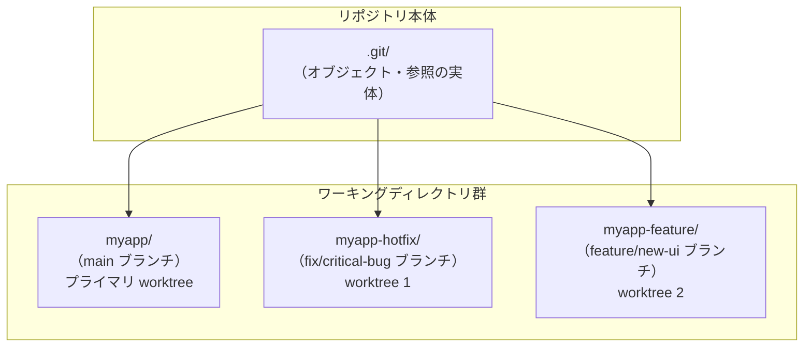

## はじめに

「hotfixを当てたいが、featureブランチで半分まで実装した変更がある」──こういった場面で `git stash` してブランチを切り替え、hotfixを終えてから戻ってくる、という作業は意外にコストがかかります。stashの取り違えや、ブランチ切り替え時のエディタの再読み込み、テストサーバーの再起動など、付随する手間は積み重なります。

`git worktree` はこの問題を根本から解決します。1つのリポジトリに対して複数のワーキングディレクトリを同時に展開できるため、ブランチを切り替えることなく複数のブランチを並行して操作できます。

本記事では、git worktreeの基本から、hotfix + feature 並行開発の実践、さらにClaude Code（AIエージェント）と組み合わせた並列自動開発まで、段階的に解説します。

---

## git worktreeの仕組み

通常のgitリポジトリは、`.git` ディレクトリ（リポジトリ本体）と、その隣にある1つのワーキングディレクトリがセットになっています。`git worktree` はこの制約を取り除き、1つの `.git` に対して複数のワーキングディレクトリを紐付けられるようにします。

各ワーキングディレクトリは独立したブランチをチェックアウトした状態で存在し、互いに干渉しません。



各ディレクトリは通常のgitリポジトリと同様に操作できます。`git add`、`git commit`、`git push` などのコマンドがそのまま使えます。ただし、同じブランチを2つのworktreeで同時にチェックアウトすることはできません。

---

## 基本コマンド

### worktreeを追加する

```bash
# 既存ブランチをworktreeとして展開する
git worktree add ../myapp-hotfix fix/critical-bug

# 新しいブランチを作成しながらworktreeを展開する（-b オプション）
git worktree add -b feature/new-ui ../myapp-feature main
```

`git worktree add <path> <branch>` の構文です。`<path>` はリポジトリ外のディレクトリを指定するのが一般的です（後述のディレクトリ配置を参照）。

### 一覧を確認する

```bash
git worktree list
```

```
/Users/naoya/dev/myapp         abc1234 [main]
/Users/naoya/dev/myapp-hotfix  def5678 [fix/critical-bug]
/Users/naoya/dev/myapp-feature 9ab0123 [feature/new-ui]
```

コミットハッシュとブランチ名が表示されます。

### worktreeを削除する

```bash
# worktreeを削除する（ディレクトリも削除される）
git worktree remove ../myapp-hotfix

# ディレクトリが残っている場合は先にディレクトリを削除してから参照を整理する
rm -rf ../myapp-hotfix
git worktree prune
```

`git worktree prune` は、ディレクトリが存在しないにもかかわらず残っている参照を整理します。手動でディレクトリを削除した後に実行することが多いです。

### ディレクトリ配置のルール

worktreeは元のリポジトリと同じ階層か、1つ上の階層に配置するのが扱いやすいです。

```
~/dev/
├── myapp/            ← プライマリ worktree（.git が存在する）
├── myapp-hotfix/     ← worktree 1
└── myapp-feature/    ← worktree 2
```

リポジトリ内のサブディレクトリに配置することも技術的には可能ですが、`.gitignore` での除外管理が必要になるため避けることを推奨します。

---

## 実践1: hotfix + feature の並行開発

最も典型的なユースケースです。機能開発の途中で緊急のバグ修正が入ったシナリオを例に解説します。

```mermaid
gantt
    title hotfix + feature 並行開発フロー
    dateFormat HH:mm
    axisFormat %H:%M

    section main worktree
    feature/new-ui 開発中         :active, f1, 09:00, 30m
    feature/new-ui 開発再開       :f2, 10:30, 60m
    feature/new-ui マージ         :milestone, 11:30, 0m

    section hotfix worktree
    fix/critical-bug 作業         :crit, h1, 09:30, 45m
    fix/critical-bug マージ       :milestone, 10:15, 0m
```



### 手順

```bash
# 1. 現在の作業状況（feature/new-ui ブランチで開発中）
git branch
# * feature/new-ui
#   main

# 2. hotfix用のworktreeを作成（mainから新しいブランチを切る）
git worktree add -b fix/critical-bug ../myapp-hotfix main

# 3. hotfix worktreeに移動して作業
cd ../myapp-hotfix

# バグ修正を実施
vim src/api/handler.ts

git add src/api/handler.ts
git commit -m "fix: クリティカルなnullポインタ例外を修正"

git push origin fix/critical-bug
# PR作成 → マージ

# 4. hotfix worktreeを削除
cd ../myapp
git worktree remove ../myapp-hotfix

# 5. feature/new-ui の開発を継続（stashもブランチ切り替えも不要）
# 元のディレクトリはずっとfeature/new-uiのままだった
git status
# On branch feature/new-ui
```

feature/new-ui の変更は一切触れる必要がありませんでした。hotfix作業中も、`myapp/` ディレクトリはそのまま `feature/new-ui` の状態を維持しています。

---

## 実践2: Claude Codeとの統合

Claude Code（claude-code CLI）は、`/worktree` コマンドによってworktreeを作成し、そのworktree内で独立したエージェントセッションを開始できます。

### Claude Code worktreeコマンドの動作

Claude Codeセッション内で `/worktree` コマンドを実行すると、現在のHEADから新しいworktreeが作成され、セッションの作業ディレクトリがそのworktreeに切り替わります。

```
# Claude Code セッション内で実行
/worktree feature-auth
```

これにより `.claude/worktrees/feature-auth/` 以下にworktreeが展開され、エージェントはそのディレクトリ内で作業します。セッション終了時にworktreeを保持するか削除するかを選択できます。

### 複数エージェントの並列実行パターン

Claude Codeを複数のターミナルセッションで同時に起動し、それぞれ別のworktreeで作業させることで、複数機能の並列自動開発が実現できます。

```bash
# ターミナル1: 認証機能の実装
# プロジェクトディレクトリで claude を起動
# → /worktree feature-auth でworktreeを作成
# → 「JWT認証機能を実装してください」と指示

# ターミナル2: 通知機能の実装
# プロジェクトディレクトリで claude を起動
# → /worktree feature-notification でworktreeを作成
# → 「メール通知機能を実装してください」と指示
```

2つのエージェントは異なるworktreeで独立して動作するため、ファイルの競合が発生しません。両方の実装が完了したら、それぞれのブランチでPRを作成してマージします。

### 並列実行時の注意点

同じファイルを2つのworktreeで同時に変更すると、マージ時にコンフリクトが発生します。並列実行する際は、あらかじめ作業範囲を明確に分割しておくことが重要です。

| 分割方法 | 例 | 適用場面 |
|----------|-----|----------|
| ディレクトリ単位 | `src/auth/` と `src/notification/` | 機能が明確に分離している場合 |
| ファイル単位 | 異なるコンポーネントファイル | UIコンポーネント並列実装 |
| レイヤー単位 | API層とフロントエンド層 | フルスタック機能開発 |

---

## node_modulesの扱い

Node.jsプロジェクトでworktreeを使うとき、`node_modules` の扱いが課題になります。worktreeを作成しても `node_modules` はコピーされないため、各worktreeで `npm install` を実行する必要があります。

### 方法1: 各worktreeで個別にインストール（推奨）

最もシンプルな方法です。ブランチ間で依存パッケージが異なる場合に適しています。

```bash
cd ../myapp-feature
npm install
```

ディスク容量は増えますが、依存関係の独立性が保たれます。

### 方法2: シンボリックリンクで共有

ブランチ間で依存パッケージが同一の場合、シンボリックリンクで共有できます。

```bash
# feature worktreeのnode_modulesをプライマリに向ける
cd ../myapp-feature
ln -s ../myapp/node_modules ./node_modules
```

ディスク容量を節約できますが、一方のworktreeで `npm install` を実行すると両方に影響します。依存パッケージが変わるブランチ（package.jsonに差分がある場合）では使用しないでください。

### pnpm を使う場合

pnpmはグローバルなコンテンツアドレス可能ストアを使うため、worktreeごとに `pnpm install` を実行しても実際のファイルはハードリンクで共有されます。ディスク容量の増加は最小限に抑えられます。

```bash
cd ../myapp-feature
pnpm install  # ストアのファイルをハードリンクで参照するため高速・省スペース
```

---

## .envファイルの扱い

`.env` ファイルはgit管理外（`.gitignore` に記載）のため、worktreeを作成しても引き継がれません。

### 方法1: 各worktreeに個別に配置

開発環境と本番環境の差異を考慮する必要がある場合や、worktreeごとに異なる環境変数を使いたい場合に適しています。

```bash
# 新しいworktreeに.envをコピー
cp .env ../myapp-feature/.env

# またはworktree作成後に手動作成
touch ../myapp-feature/.env
```

### 方法2: シンボリックリンクで共有

同じ環境変数を使う場合は、シンボリックリンクで一元管理できます。

```bash
cd ../myapp-feature
ln -s ../myapp/.env .env
```

プライマリのworktreeで `.env` を更新すると、全worktreeに反映されます。ただし、worktreeごとに異なる設定が必要な場合（たとえばポート番号の競合）は個別に配置してください。

### ポート競合への対応

複数のdevサーバーを同時に起動する場合、ポートが競合します。各worktreeの `.env` でポート番号を変えて管理します。

```bash
# myapp/.env
PORT=3000

# myapp-feature/.env
PORT=3001

# myapp-hotfix/.env
PORT=3002
```

---

## まとめ

git worktreeが特に効果を発揮する場面と、使用時の注意点を整理します。

### 使うと効果的な場面

| 場面 | 効果 |
|------|------|
| hotfixと機能開発の同時進行 | stash/checkout不要で切り替えコストゼロ |
| コードレビュー中に別作業を続ける | レビュー用ブランチを別ディレクトリで確認しながら開発継続 |
| Claude Codeで複数機能を並列自動実装 | エージェントごとに独立したworktreeで競合なし |
| 本番ブランチと開発ブランチの同時参照 | 2つのターミナルで別ブランチを同時に開く |

### 注意点

- 同じブランチを2つのworktreeでチェックアウトすることはできません
- worktreeを削除し忘れると `.git/worktrees/` 内に参照が残り続けます。`git worktree prune` を定期的に実行してください
- node_modulesと.envは自動で引き継がれません。worktree作成後に必要に応じてセットアップしてください
- 多数のworktreeを並行して持つとディスク容量を消費します。作業が終わったworktreeはこまめに削除することを推奨します

ブランチ切り替えという「小さな摩擦」は、積み重なると開発のテンポを大きく乱します。git worktreeを日常のワークフローに取り入れることで、コンテキストスイッチのコストを削減し、より集中した開発体験を実現できます。
